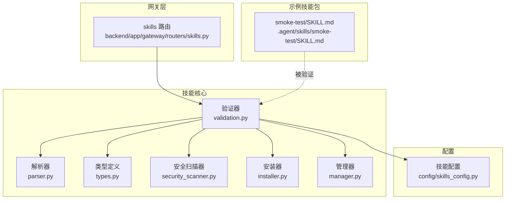
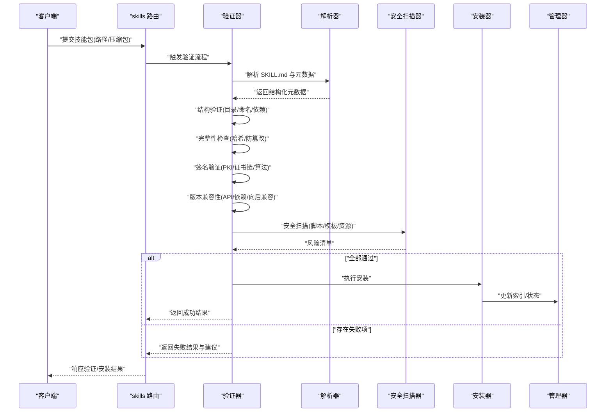
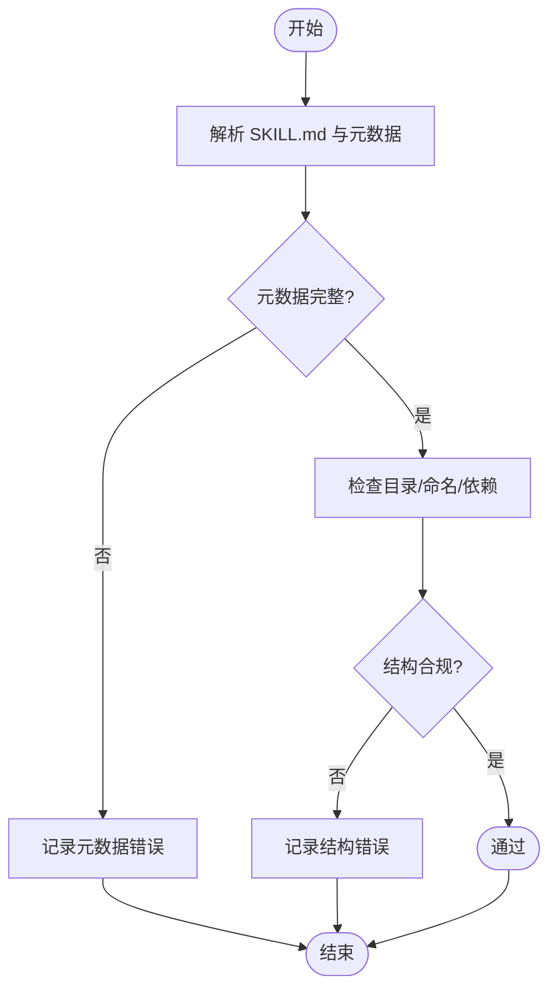
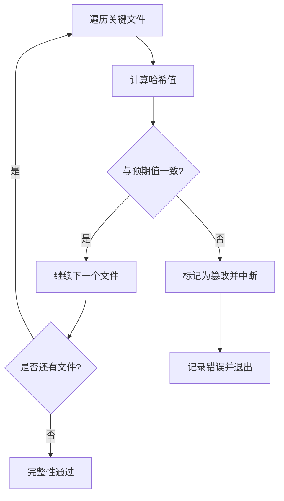
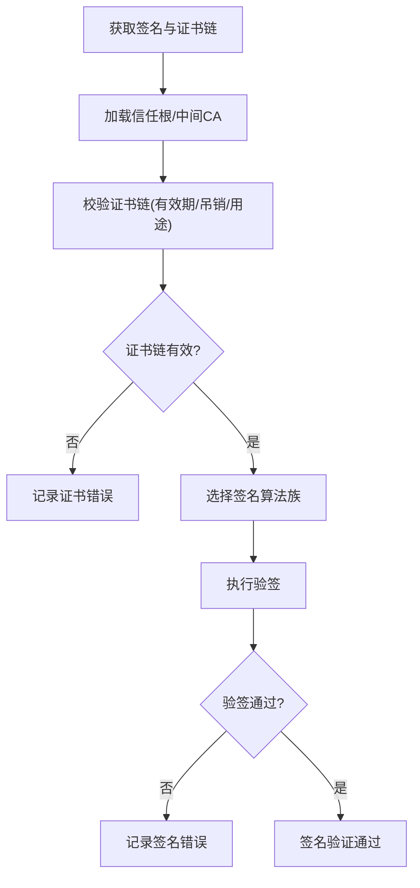
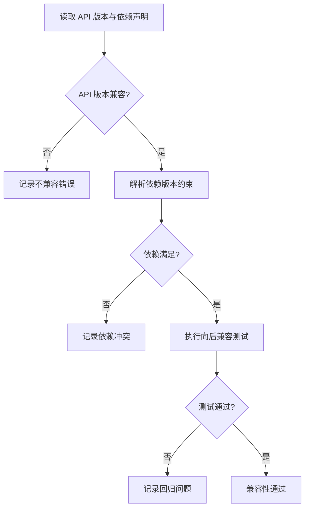
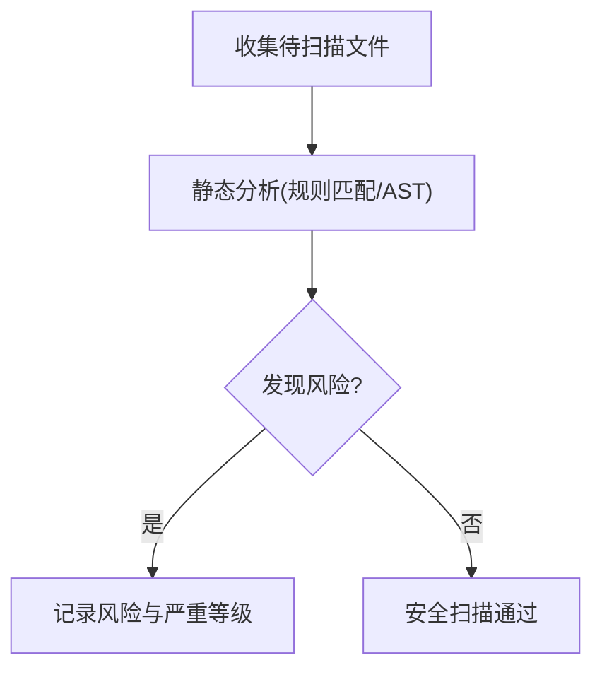
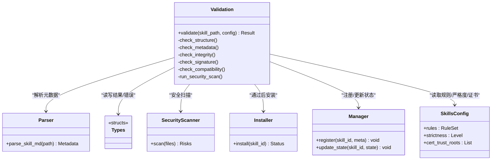

# 技能包验证

<cite>
**本文引用的文件**   
- [backend/app/gateway/routers/skills.py](file://backend/app/gateway/routers/skills.py)
- [backend/packages/harness/deerflow/skills/validation.py](file://backend/packages/harness/deerflow/skills/validation.py)
- [backend/packages/harness/deerflow/skills/parser.py](file://backend/packages/harness/deerflow/skills/parser.py)
- [backend/packages/harness/deerflow/skills/types.py](file://backend/packages/harness/deerflow/skills/types.py)
- [backend/packages/harness/deerflow/skills/security_scanner.py](file://backend/packages/harness/deerflow/skills/security_scanner.py)
- [backend/packages/harness/deerflow/skills/installer.py](file://backend/packages/harness/deerflow/skills/installer.py)
- [backend/packages/harness/deerflow/skills/manager.py](file://backend/packages/harness/deerflow/skills/manager.py)
- [backend/packages/harness/deerflow/config/skills_config.py](file://backend/packages/harness/deerflow/config/skills_config.py)
- [backend/tests/test_skills_validation.py](file://backend/tests/test_skills_validation.py)
- [backend/tests/test_skills_installer.py](file://backend/tests/test_skills_installer.py)
- [backend/tests/test_security_scanner.py](file://backend/tests/test_security_scanner.py)
- [.agent/skills/smoke-test/SKILL.md](file://.agent/skills/smoke-test/SKILL.md)
</cite>

## 目录
1. [简介](#简介)
2. [项目结构](#项目结构)
3. [核心组件](#核心组件)
4. [架构总览](#架构总览)
5. [详细组件分析](#详细组件分析)
6. [依赖关系分析](#依赖关系分析)
7. [性能考虑](#性能考虑)
8. [故障排查指南](#故障排查指南)
9. [结论](#结论)
10. [附录](#附录)

## 简介
本文件面向 DeerFlow 技能包（Skill）的“验证”能力，围绕以下目标展开：
- 数字签名与公钥基础设施（PKI）：说明如何引入证书链校验、签名算法选择与信任根管理。
- 完整性检查：涵盖哈希计算、文件完整性校验与篡改检测。
- 版本兼容性：包括 API 版本检查、依赖版本约束与向后兼容测试策略。
- 元数据验证：SKILL.md 格式检查、字段完整性与描述一致性。
- 结构验证：目录结构规范、文件命名约定与依赖解析。
- 验证流程配置：规则集、严格程度与错误处理策略。
- 结果报告与修复建议：问题清单、严重性评级与解决方案指导。

## 项目结构
DeerFlow 的技能包验证相关代码集中在后端 harness 的 skills 模块中，并通过网关路由对外暴露能力；同时提供安全扫描、安装器与配置项支撑。

图表来源
- [backend/app/gateway/routers/skills.py](file://backend/app/gateway/routers/skills.py)
- [backend/packages/harness/deerflow/skills/validation.py](file://backend/packages/harness/deerflow/skills/validation.py)
- [backend/packages/harness/deerflow/skills/parser.py](file://backend/packages/harness/deerflow/skills/parser.py)
- [backend/packages/harness/deerflow/skills/types.py](file://backend/packages/harness/deerflow/skills/types.py)
- [backend/packages/harness/deerflow/skills/security_scanner.py](file://backend/packages/harness/deerflow/skills/security_scanner.py)
- [backend/packages/harness/deerflow/skills/installer.py](file://backend/packages/harness/deerflow/skills/installer.py)
- [backend/packages/harness/deerflow/skills/manager.py](file://backend/packages/harness/deerflow/skills/manager.py)
- [backend/packages/harness/deerflow/config/skills_config.py](file://backend/packages/harness/deerflow/config/skills_config.py)
- [.agent/skills/smoke-test/SKILL.md](file://.agent/skills/smoke-test/SKILL.md)

章节来源
- [backend/app/gateway/routers/skills.py](file://backend/app/gateway/routers/skills.py)
- [backend/packages/harness/deerflow/skills/validation.py](file://backend/packages/harness/deerflow/skills/validation.py)
- [backend/packages/harness/deerflow/skills/parser.py](file://backend/packages/harness/deerflow/skills/parser.py)
- [backend/packages/harness/deerflow/skills/types.py](file://backend/packages/harness/deerflow/skills/types.py)
- [backend/packages/harness/deerflow/skills/security_scanner.py](file://backend/packages/harness/deerflow/skills/security_scanner.py)
- [backend/packages/harness/deerflow/skills/installer.py](file://backend/packages/harness/deerflow/skills/installer.py)
- [backend/packages/harness/deerflow/skills/manager.py](file://backend/packages/harness/deerflow/skills/manager.py)
- [backend/packages/harness/deerflow/config/skills_config.py](file://backend/packages/harness/deerflow/config/skills_config.py)
- [.agent/skills/smoke-test/SKILL.md](file://.agent/skills/smoke-test/SKILL.md)

## 核心组件
- 验证器（validation.py）：编排所有验证阶段（结构、元数据、完整性、签名、兼容性、安全），输出统一的结果对象。
- 解析器（parser.py）：负责读取并解析 SKILL.md 等元数据，生成结构化模型供验证器使用。
- 类型定义（types.py）：定义技能包结构、元数据字段、验证结果与错误码等数据结构。
- 安全扫描器（security_scanner.py）：对脚本、模板与资源进行静态安全检查（如危险命令、注入点）。
- 安装器（installer.py）：在通过验证后执行安装流程，包含回滚与幂等保护。
- 管理器（manager.py）：维护已安装技能包的索引、状态与生命周期。
- 配置（skills_config.py）：集中管理验证规则集、严格级别、白名单/黑名单、证书与信任根等。

章节来源
- [backend/packages/harness/deerflow/skills/validation.py](file://backend/packages/harness/deerflow/skills/validation.py)
- [backend/packages/harness/deerflow/skills/parser.py](file://backend/packages/harness/deerflow/skills/parser.py)
- [backend/packages/harness/deerflow/skills/types.py](file://backend/packages/harness/deerflow/skills/types.py)
- [backend/packages/harness/deerflow/skills/security_scanner.py](file://backend/packages/harness/deerflow/skills/security_scanner.py)
- [backend/packages/harness/deerflow/skills/installer.py](file://backend/packages/harness/deerflow/skills/installer.py)
- [backend/packages/harness/deerflow/skills/manager.py](file://backend/packages/harness/deerflow/skills/manager.py)
- [backend/packages/harness/deerflow/config/skills_config.py](file://backend/packages/harness/deerflow/config/skills_config.py)

## 架构总览
下图展示了从网关入口到验证器的调用序列，以及各子验证阶段的协作方式。

图表来源
- [backend/app/gateway/routers/skills.py](file://backend/app/gateway/routers/skills.py)
- [backend/packages/harness/deerflow/skills/validation.py](file://backend/packages/harness/deerflow/skills/validation.py)
- [backend/packages/harness/deerflow/skills/parser.py](file://backend/packages/harness/deerflow/skills/parser.py)
- [backend/packages/harness/deerflow/skills/security_scanner.py](file://backend/packages/harness/deerflow/skills/security_scanner.py)
- [backend/packages/harness/deerflow/skills/installer.py](file://backend/packages/harness/deerflow/skills/installer.py)
- [backend/packages/harness/deerflow/skills/manager.py](file://backend/packages/harness/deerflow/skills/manager.py)

## 详细组件分析

### 元数据与结构验证
- 元数据验证
  - 解析 SKILL.md 为结构化模型，校验必填字段、字段类型与取值范围。
  - 描述一致性检查：标题、摘要、作者、许可证等字段需与仓库信息一致。
- 结构验证
  - 目录规范：要求存在必要目录（如 scripts、templates、references 等，视技能而定）。
  - 文件命名约定：脚本、模板、参考文档等遵循统一命名。
  - 依赖解析：解析依赖声明并校验其存在性与可达性。

图表来源
- [backend/packages/harness/deerflow/skills/parser.py](file://backend/packages/harness/deerflow/skills/parser.py)
- [backend/packages/harness/deerflow/skills/validation.py](file://backend/packages/harness/deerflow/skills/validation.py)
- [backend/packages/harness/deerflow/skills/types.py](file://backend/packages/harness/deerflow/skills/types.py)

章节来源
- [backend/packages/harness/deerflow/skills/parser.py](file://backend/packages/harness/deerflow/skills/parser.py)
- [backend/packages/harness/deerflow/skills/validation.py](file://backend/packages/harness/deerflow/skills/validation.py)
- [backend/packages/harness/deerflow/skills/types.py](file://backend/packages/harness/deerflow/skills/types.py)
- [.agent/skills/smoke-test/SKILL.md](file://.agent/skills/smoke-test/SKILL.md)

### 完整性检查
- 哈希计算：对关键文件（脚本、模板、配置文件）计算哈希值。
- 文件完整性校验：将运行时计算的哈希与预期值比对，防止篡改。
- 篡改检测：当发现不一致时立即中止后续流程并上报。

图表来源
- [backend/packages/harness/deerflow/skills/validation.py](file://backend/packages/harness/deerflow/skills/validation.py)
- [backend/packages/harness/deerflow/skills/types.py](file://backend/packages/harness/deerflow/skills/types.py)

章节来源
- [backend/packages/harness/deerflow/skills/validation.py](file://backend/packages/harness/deerflow/skills/validation.py)
- [backend/packages/harness/deerflow/skills/types.py](file://backend/packages/harness/deerflow/skills/types.py)

### 数字签名与 PKI 验证
- 公钥基础设施
  - 支持加载本地或远程证书链，建立信任根与中间 CA 列表。
  - 可配置允许的签名算法族与最小强度要求。
- 签名验证流程
  - 提取签名与原始载荷，按指定算法验签。
  - 校验证书链有效性（有效期、吊销状态、用途限制）。
- 算法选择
  - 推荐强算法族（如基于椭圆曲线或 RSA 的高强度参数）。
  - 拒绝弱算法或不满足强度要求的组合。

图表来源
- [backend/packages/harness/deerflow/skills/validation.py](file://backend/packages/harness/deerflow/skills/validation.py)
- [backend/packages/harness/deerflow/config/skills_config.py](file://backend/packages/harness/deerflow/config/skills_config.py)
- [backend/packages/harness/deerflow/skills/types.py](file://backend/packages/harness/deerflow/skills/types.py)

章节来源
- [backend/packages/harness/deerflow/skills/validation.py](file://backend/packages/harness/deerflow/skills/validation.py)
- [backend/packages/harness/deerflow/config/skills_config.py](file://backend/packages/harness/deerflow/config/skills_config.py)
- [backend/packages/harness/deerflow/skills/types.py](file://backend/packages/harness/deerflow/skills/types.py)

### 版本兼容性验证
- API 版本检查：确保技能包声明的 API 版本与当前系统兼容。
- 依赖版本约束：解析依赖声明，校验版本区间是否满足。
- 向后兼容测试：在沙箱或隔离环境中运行最小用例，验证行为一致。

图表来源
- [backend/packages/harness/deerflow/skills/validation.py](file://backend/packages/harness/deerflow/skills/validation.py)
- [backend/packages/harness/deerflow/skills/types.py](file://backend/packages/harness/deerflow/skills/types.py)

章节来源
- [backend/packages/harness/deerflow/skills/validation.py](file://backend/packages/harness/deerflow/skills/validation.py)
- [backend/packages/harness/deerflow/skills/types.py](file://backend/packages/harness/deerflow/skills/types.py)

### 安全扫描
- 扫描范围：scripts、templates、references 等目录中的脚本与模板。
- 检测项：危险命令、外部网络访问、硬编码凭据、注入点等。
- 输出：风险清单与严重等级，作为验证失败的阻断条件之一。

图表来源
- [backend/packages/harness/deerflow/skills/security_scanner.py](file://backend/packages/harness/deerflow/skills/security_scanner.py)
- [backend/packages/harness/deerflow/skills/validation.py](file://backend/packages/harness/deerflow/skills/validation.py)

章节来源
- [backend/packages/harness/deerflow/skills/security_scanner.py](file://backend/packages/harness/deerflow/skills/security_scanner.py)
- [backend/packages/harness/deerflow/skills/validation.py](file://backend/packages/harness/deerflow/skills/validation.py)

### 验证流程配置
- 规则集：启用/禁用特定验证阶段（结构、元数据、完整性、签名、兼容性、安全）。
- 严格程度：宽松/标准/严格模式，影响失败时的阻断策略与降级行为。
- 错误处理：记录详细错误上下文、定位文件与行号、给出修复建议。
- 证书与信任根：配置证书路径、信任根集合与吊销检查策略。

章节来源
- [backend/packages/harness/deerflow/config/skills_config.py](file://backend/packages/harness/deerflow/config/skills_config.py)
- [backend/packages/harness/deerflow/skills/validation.py](file://backend/packages/harness/deerflow/skills/validation.py)
- [backend/packages/harness/deerflow/skills/types.py](file://backend/packages/harness/deerflow/skills/types.py)

### 验证结果报告与修复建议
- 结果对象：包含通过/失败状态、各阶段明细、错误清单与严重性评级。
- 问题清单：按阶段分组，列出具体文件、位置与原因。
- 严重性评级：致命/高/中/低，决定安装是否被阻断。
- 修复建议：针对常见问题给出操作步骤与参考链接。

章节来源
- [backend/packages/harness/deerflow/skills/validation.py](file://backend/packages/harness/deerflow/skills/validation.py)
- [backend/packages/harness/deerflow/skills/types.py](file://backend/packages/harness/deerflow/skills/types.py)

## 依赖关系分析
验证器依赖解析器、类型定义、安全扫描器、安装器与管理器，并通过配置驱动行为。

图表来源
- [backend/packages/harness/deerflow/skills/validation.py](file://backend/packages/harness/deerflow/skills/validation.py)
- [backend/packages/harness/deerflow/skills/parser.py](file://backend/packages/harness/deerflow/skills/parser.py)
- [backend/packages/harness/deerflow/skills/types.py](file://backend/packages/harness/deerflow/skills/types.py)
- [backend/packages/harness/deerflow/skills/security_scanner.py](file://backend/packages/harness/deerflow/skills/security_scanner.py)
- [backend/packages/harness/deerflow/skills/installer.py](file://backend/packages/harness/deerflow/skills/installer.py)
- [backend/packages/harness/deerflow/skills/manager.py](file://backend/packages/harness/deerflow/skills/manager.py)
- [backend/packages/harness/deerflow/config/skills_config.py](file://backend/packages/harness/deerflow/config/skills_config.py)

章节来源
- [backend/packages/harness/deerflow/skills/validation.py](file://backend/packages/harness/deerflow/skills/validation.py)
- [backend/packages/harness/deerflow/skills/parser.py](file://backend/packages/harness/deerflow/skills/parser.py)
- [backend/packages/harness/deerflow/skills/types.py](file://backend/packages/harness/deerflow/skills/types.py)
- [backend/packages/harness/deerflow/skills/security_scanner.py](file://backend/packages/harness/deerflow/skills/security_scanner.py)
- [backend/packages/harness/deerflow/skills/installer.py](file://backend/packages/harness/deerflow/skills/installer.py)
- [backend/packages/harness/deerflow/skills/manager.py](file://backend/packages/harness/deerflow/skills/manager.py)
- [backend/packages/harness/deerflow/config/skills_config.py](file://backend/packages/harness/deerflow/config/skills_config.py)

## 性能考虑
- 并行化：对无依赖的验证阶段（如结构、元数据、完整性）可并行执行，缩短端到端时间。
- 增量校验：缓存上次校验结果与哈希，仅对变更文件重新计算。
- 安全扫描优化：对大体积资源采用分块扫描与规则预编译。
- 证书链校验：缓存信任根与中间 CA 列表，避免重复加载。

[本节为通用性能建议，无需源码引用]

## 故障排查指南
- 常见错误
  - 元数据缺失或类型不符：检查 SKILL.md 必填字段与格式。
  - 结构不规范：确认必要目录与文件命名是否符合约定。
  - 完整性失败：核对关键文件的哈希值是否与预期一致。
  - 签名失败：检查证书链、有效期与签名算法是否满足策略。
  - 兼容性失败：升级/降级依赖版本或调整 API 版本声明。
  - 安全风险：移除危险命令或加固模板注入点。
- 日志与定位
  - 查看验证结果对象中的错误详情与文件定位。
  - 结合严格模式开关判断是否为阻断性问题。
- 快速修复
  - 使用内置修复建议逐项修正，必要时回退到上一个稳定版本。

章节来源
- [backend/packages/harness/deerflow/skills/validation.py](file://backend/packages/harness/deerflow/skills/validation.py)
- [backend/packages/harness/deerflow/skills/types.py](file://backend/packages/harness/deerflow/skills/types.py)

## 结论
DeerFlow 的技能包验证体系以“验证器”为核心，串联元数据与结构解析、完整性与签名校验、兼容性测试与安全扫描，并通过配置控制规则集与严格程度。该设计在保证安全与稳定的同时，提供了清晰的错误定位与修复指引，便于开发者持续交付高质量技能包。

[本节为总结性内容，无需源码引用]

## 附录
- 示例技能包：可参考 smoke-test 技能的 SKILL.md 结构与字段组织方式。
- 单元测试：验证器、安装器与安全扫描器的测试覆盖可作为实现参考。

章节来源
- [.agent/skills/smoke-test/SKILL.md](file://.agent/skills/smoke-test/SKILL.md)
- [backend/tests/test_skills_validation.py](file://backend/tests/test_skills_validation.py)
- [backend/tests/test_skills_installer.py](file://backend/tests/test_skills_installer.py)
- [backend/tests/test_security_scanner.py](file://backend/tests/test_security_scanner.py)