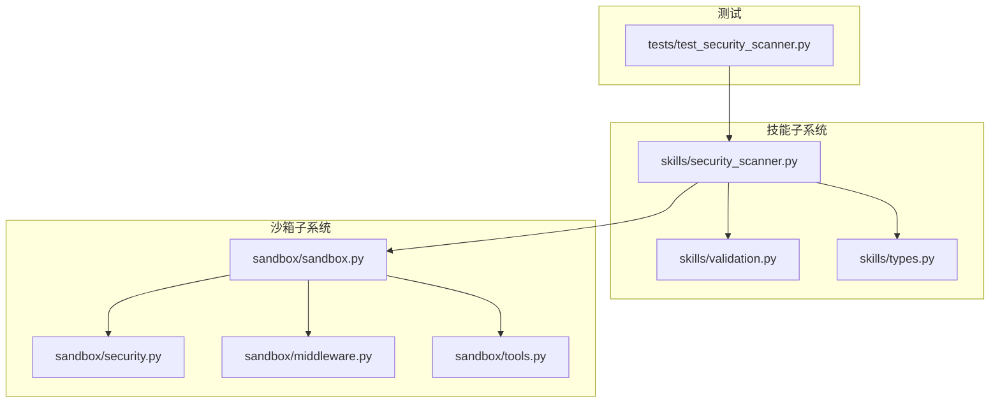
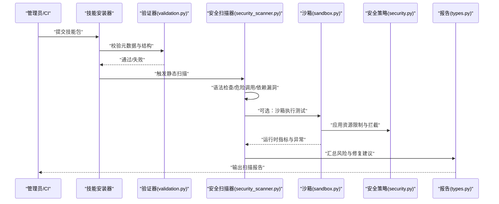
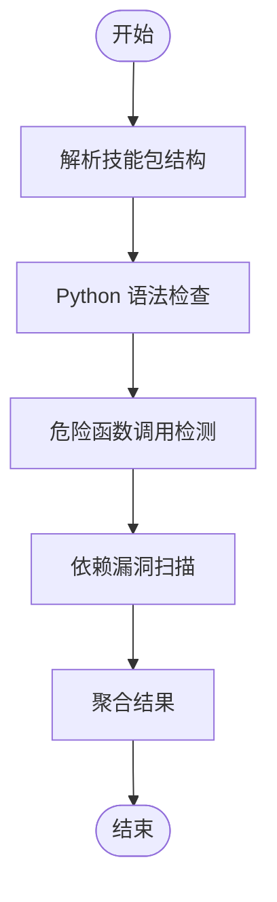
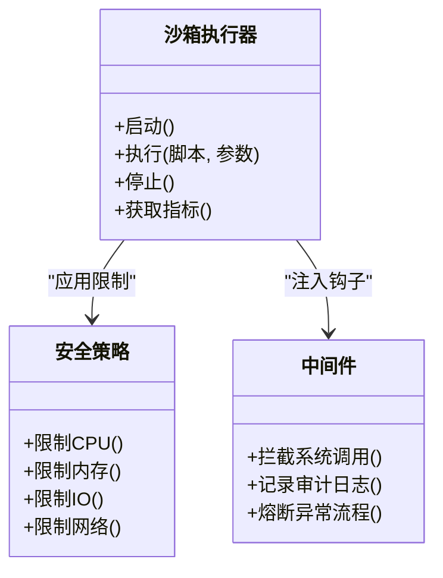
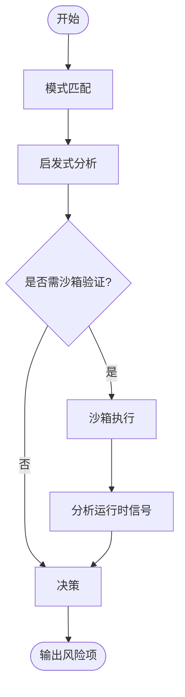
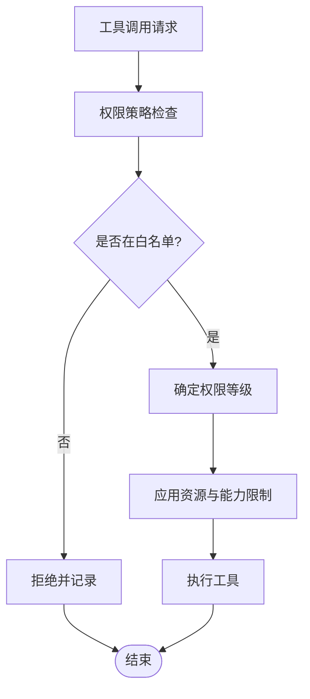
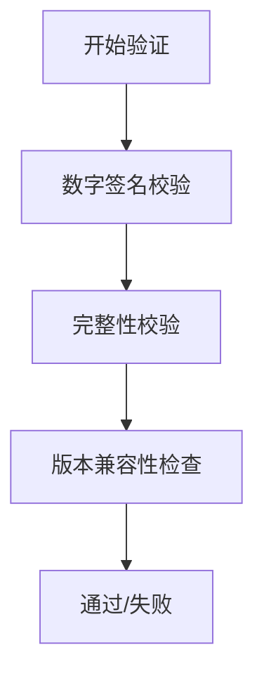
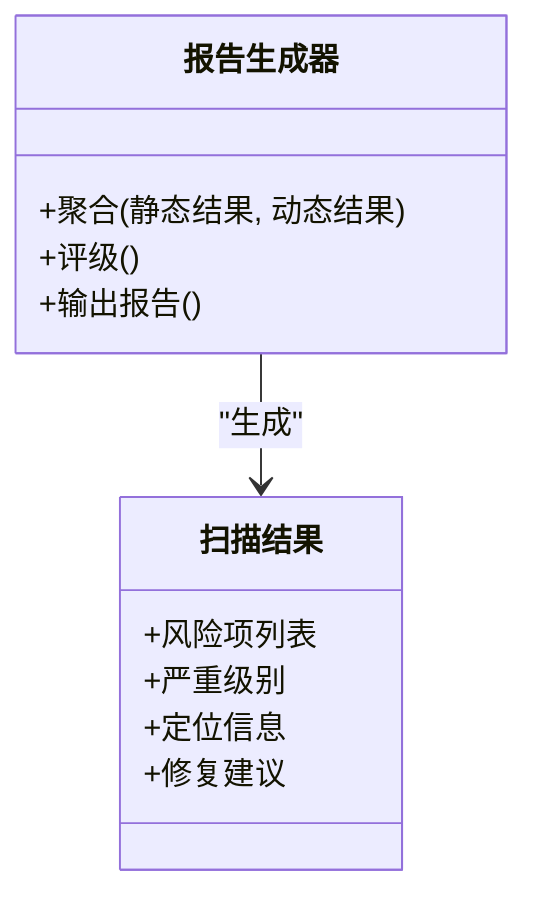
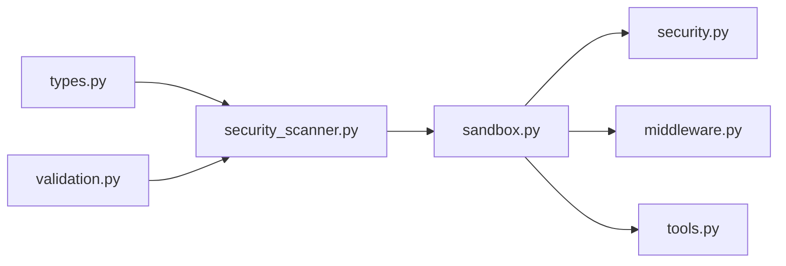

# 技能安全扫描

<cite>
**本文引用的文件**   
- [security_scanner.py](file://backend/packages/harness/deerflow/skills/security_scanner.py)
- [validation.py](file://backend/packages/harness/deerflow/skills/validation.py)
- [types.py](file://backend/packages/harness/deerflow/skills/types.py)
- [sandbox.py](file://backend/packages/harness/deerflow/sandbox/sandbox.py)
- [security.py](file://backend/packages/harness/deerflow/sandbox/security.py)
- [middleware.py](file://backend/packages/harness/deerflow/sandbox/middleware.py)
- [tools.py](file://backend/packages/harness/deerflow/sandbox/tools.py)
- [test_security_scanner.py](file://backend/tests/test_security_scanner.py)
</cite>

## 目录
1. [简介](#简介)
2. [项目结构](#项目结构)
3. [核心组件](#核心组件)
4. [架构总览](#架构总览)
5. [详细组件分析](#详细组件分析)
6. [依赖关系分析](#依赖关系分析)
7. [性能考量](#性能考量)
8. [故障排查指南](#故障排查指南)
9. [结论](#结论)
10. [附录](#附录)

## 简介
本文件面向 DeerFlow 的“技能安全扫描”能力，系统性阐述静态与动态检测、恶意代码识别、工具权限策略、技能包验证以及报告生成等关键主题。文档以仓库中现有实现为依据，重点围绕以下模块：
- 静态扫描：语法检查、危险函数调用检测、依赖漏洞扫描
- 动态行为检测：运行时监控、系统调用拦截、资源使用分析
- 恶意代码识别：已知模式匹配、启发式分析、沙箱执行测试
- 工具权限策略：白名单/黑名单、权限分级
- 技能包验证：数字签名、完整性校验、版本兼容
- 报告输出：风险等级评估与修复建议
- 自定义规则：配置与扩展方法

## 项目结构
与安全扫描相关的核心代码位于后端 harness 的 skills 与 sandbox 子系统中，测试用例位于 tests 目录。下图给出与“技能安全扫描”直接相关的文件组织概览。

图表来源
- [security_scanner.py](file://backend/packages/harness/deerflow/skills/security_scanner.py)
- [validation.py](file://backend/packages/harness/deerflow/skills/validation.py)
- [types.py](file://backend/packages/harness/deerflow/skills/types.py)
- [sandbox.py](file://backend/packages/harness/deerflow/sandbox/sandbox.py)
- [security.py](file://backend/packages/harness/deerflow/sandbox/security.py)
- [middleware.py](file://backend/packages/harness/deerflow/sandbox/middleware.py)
- [tools.py](file://backend/packages/harness/deerflow/sandbox/tools.py)
- [test_security_scanner.py](file://backend/tests/test_security_scanner.py)

章节来源
- [security_scanner.py](file://backend/packages/harness/deerflow/skills/security_scanner.py)
- [validation.py](file://backend/packages/harness/deerflow/skills/validation.py)
- [types.py](file://backend/packages/harness/deerflow/skills/types.py)
- [sandbox.py](file://backend/packages/harness/deerflow/sandbox/sandbox.py)
- [security.py](file://backend/packages/harness/deerflow/sandbox/security.py)
- [middleware.py](file://backend/packages/harness/deerflow/sandbox/middleware.py)
- [tools.py](file://backend/packages/harness/deerflow/sandbox/tools.py)
- [test_security_scanner.py](file://backend/tests/test_security_scanner.py)

## 核心组件
- 安全扫描器（skills/security_scanner.py）
  - 职责：对技能包进行静态扫描，聚合结果并生成结构化报告；协调各扫描阶段（语法、危险调用、依赖漏洞）。
  - 输入：技能包路径或归档；输出：包含风险项、严重级别、定位信息与修复建议的报告对象。
- 验证器（skills/validation.py）
  - 职责：对技能包元数据、结构与约束进行校验，为扫描提供前置合法性保障。
- 类型定义（skills/types.py）
  - 职责：定义扫描结果、风险等级、报告数据结构，确保前后端一致的数据契约。
- 沙箱运行环境（sandbox/*）
  - 职责：在隔离环境中执行待测脚本，限制系统调用、网络访问与资源消耗，收集运行时指标。
  - 关键文件：
    - sandbox.py：沙箱生命周期与执行入口
    - security.py：安全策略与资源限制
    - middleware.py：中间件钩子用于拦截与审计
    - tools.py：受限工具集暴露给被检代码

章节来源
- [security_scanner.py](file://backend/packages/harness/deerflow/skills/security_scanner.py)
- [validation.py](file://backend/packages/harness/deerflow/skills/validation.py)
- [types.py](file://backend/packages/harness/deerflow/skills/types.py)
- [sandbox.py](file://backend/packages/harness/deerflow/sandbox/sandbox.py)
- [security.py](file://backend/packages/harness/deerflow/sandbox/security.py)
- [middleware.py](file://backend/packages/harness/deerflow/sandbox/middleware.py)
- [tools.py](file://backend/packages/harness/deerflow/sandbox/tools.py)

## 架构总览
下图展示从“安装/加载技能”到“静态扫描+动态沙箱”的整体流程，以及报告生成的关键节点。

图表来源
- [validation.py](file://backend/packages/harness/deerflow/skills/validation.py)
- [security_scanner.py](file://backend/packages/harness/deerflow/skills/security_scanner.py)
- [sandbox.py](file://backend/packages/harness/deerflow/sandbox/sandbox.py)
- [security.py](file://backend/packages/harness/deerflow/sandbox/security.py)
- [types.py](file://backend/packages/harness/deerflow/skills/types.py)

## 详细组件分析

### 静态代码分析
- Python 语法检查
  - 目标：快速发现语法错误、导入问题与基础合规性缺陷。
  - 位置参考：[security_scanner.py](file://backend/packages/harness/deerflow/skills/security_scanner.py)
- 危险函数调用检测
  - 目标：识别高风险 API（如进程创建、文件系统高危操作、网络请求等），并结合上下文判定风险等级。
  - 位置参考：[security_scanner.py](file://backend/packages/harness/deerflow/skills/security_scanner.py)
- 依赖漏洞扫描
  - 目标：解析依赖清单，比对已知漏洞库，输出受影响包与修复建议。
  - 位置参考：[security_scanner.py](file://backend/packages/harness/deerflow/skills/security_scanner.py)

图表来源
- [security_scanner.py](file://backend/packages/harness/deerflow/skills/security_scanner.py)

章节来源
- [security_scanner.py](file://backend/packages/harness/deerflow/skills/security_scanner.py)

### 动态行为检测
- 运行时监控
  - 目标：在沙箱内执行被测脚本，采集 CPU、内存、I/O、网络等指标。
  - 位置参考：[sandbox.py](file://backend/packages/harness/deerflow/sandbox/sandbox.py)
- 系统调用拦截
  - 目标：通过中间件与策略层拦截敏感系统调用，阻断越权行为。
  - 位置参考：[middleware.py](file://backend/packages/harness/deerflow/sandbox/middleware.py)、[security.py](file://backend/packages/harness/deerflow/sandbox/security.py)
- 资源使用分析
  - 目标：基于采集指标判断是否存在资源滥用（如无限循环、内存泄漏倾向）。
  - 位置参考：[sandbox.py](file://backend/packages/harness/deerflow/sandbox/sandbox.py)

图表来源
- [sandbox.py](file://backend/packages/harness/deerflow/sandbox/sandbox.py)
- [security.py](file://backend/packages/harness/deerflow/sandbox/security.py)
- [middleware.py](file://backend/packages/harness/deerflow/sandbox/middleware.py)

章节来源
- [sandbox.py](file://backend/packages/harness/deerflow/sandbox/sandbox.py)
- [security.py](file://backend/packages/harness/deerflow/sandbox/security.py)
- [middleware.py](file://backend/packages/harness/deerflow/sandbox/middleware.py)

### 恶意代码识别
- 已知恶意模式匹配
  - 目标：基于正则/AST 模式匹配常见恶意片段（如自解压、外连回传、持久化写入等）。
  - 位置参考：[security_scanner.py](file://backend/packages/harness/deerflow/skills/security_scanner.py)
- 启发式分析
  - 目标：结合调用图、控制流与外部交互特征，推断潜在恶意意图。
  - 位置参考：[security_scanner.py](file://backend/packages/harness/deerflow/skills/security_scanner.py)
- 沙箱执行测试
  - 目标：在受控环境下观察真实行为，辅助确认误报与漏报。
  - 位置参考：[sandbox.py](file://backend/packages/harness/deerflow/sandbox/sandbox.py)

图表来源
- [security_scanner.py](file://backend/packages/harness/deerflow/skills/security_scanner.py)
- [sandbox.py](file://backend/packages/harness/deerflow/sandbox/sandbox.py)

章节来源
- [security_scanner.py](file://backend/packages/harness/deerflow/skills/security_scanner.py)
- [sandbox.py](file://backend/packages/harness/deerflow/sandbox/sandbox.py)

### 工具权限策略
- 白名单/黑名单
  - 目标：仅允许受信任的工具集合，屏蔽高风险命令与接口。
  - 位置参考：[tools.py](file://backend/packages/harness/deerflow/sandbox/tools.py)
- 权限分级管理
  - 目标：按角色或场景授予不同权限等级，最小化可用能力面。
  - 位置参考：[security.py](file://backend/packages/harness/deerflow/sandbox/security.py)

图表来源
- [tools.py](file://backend/packages/harness/deerflow/sandbox/tools.py)
- [security.py](file://backend/packages/harness/deerflow/sandbox/security.py)

章节来源
- [tools.py](file://backend/packages/harness/deerflow/sandbox/tools.py)
- [security.py](file://backend/packages/harness/deerflow/sandbox/security.py)

### 技能包验证
- 数字签名验证
  - 目标：校验发布者身份与内容未被篡改。
  - 位置参考：[validation.py](file://backend/packages/harness/deerflow/skills/validation.py)
- 完整性检查
  - 目标：对比哈希值，确保包体完整。
  - 位置参考：[validation.py](file://backend/packages/harness/deerflow/skills/validation.py)
- 版本兼容性验证
  - 目标：确保技能与当前 DeerFlow 版本兼容。
  - 位置参考：[validation.py](file://backend/packages/harness/deerflow/skills/validation.py)

图表来源
- [validation.py](file://backend/packages/harness/deerflow/skills/validation.py)

章节来源
- [validation.py](file://backend/packages/harness/deerflow/skills/validation.py)

### 安全扫描报告生成
- 风险等级评估
  - 目标：综合静态与动态结果，划分风险等级（如高/中/低）。
  - 位置参考：[types.py](file://backend/packages/harness/deerflow/skills/types.py)
- 修复建议
  - 目标：针对每个风险项给出可操作的修复指引。
  - 位置参考：[security_scanner.py](file://backend/packages/harness/deerflow/skills/security_scanner.py)

图表来源
- [types.py](file://backend/packages/harness/deerflow/skills/types.py)
- [security_scanner.py](file://backend/packages/harness/deerflow/skills/security_scanner.py)

章节来源
- [types.py](file://backend/packages/harness/deerflow/skills/types.py)
- [security_scanner.py](file://backend/packages/harness/deerflow/skills/security_scanner.py)

### 自定义安全规则的配置与扩展
- 配置方式
  - 目标：通过配置文件或环境变量启用/禁用特定规则、调整阈值与策略。
  - 位置参考：[security_scanner.py](file://backend/packages/harness/deerflow/skills/security_scanner.py)
- 扩展机制
  - 目标：支持新增规则插件、注册新的危险模式与启发式策略。
  - 位置参考：[security_scanner.py](file://backend/packages/harness/deerflow/skills/security_scanner.py)

章节来源
- [security_scanner.py](file://backend/packages/harness/deerflow/skills/security_scanner.py)

## 依赖关系分析
- 组件耦合
  - 安全扫描器依赖验证器完成前置校验；依赖沙箱执行器进行动态验证；依赖类型定义统一报告结构。
- 外部依赖
  - 依赖操作系统沙箱能力（如 cgroups、命名空间）、第三方依赖漏洞数据库与签名校验库。
- 潜在循环依赖
  - 当前设计将扫描与沙箱解耦，未见明显循环依赖。

图表来源
- [types.py](file://backend/packages/harness/deerflow/skills/types.py)
- [security_scanner.py](file://backend/packages/harness/deerflow/skills/security_scanner.py)
- [validation.py](file://backend/packages/harness/deerflow/skills/validation.py)
- [sandbox.py](file://backend/packages/harness/deerflow/sandbox/sandbox.py)
- [security.py](file://backend/packages/harness/deerflow/sandbox/security.py)
- [middleware.py](file://backend/packages/harness/deerflow/sandbox/middleware.py)
- [tools.py](file://backend/packages/harness/deerflow/sandbox/tools.py)

章节来源
- [security_scanner.py](file://backend/packages/harness/deerflow/skills/security_scanner.py)
- [validation.py](file://backend/packages/harness/deerflow/skills/validation.py)
- [types.py](file://backend/packages/harness/deerflow/skills/types.py)
- [sandbox.py](file://backend/packages/harness/deerflow/sandbox/sandbox.py)
- [security.py](file://backend/packages/harness/deerflow/sandbox/security.py)
- [middleware.py](file://backend/packages/harness/deerflow/sandbox/middleware.py)
- [tools.py](file://backend/packages/harness/deerflow/sandbox/tools.py)

## 性能考量
- 并行扫描
  - 对多个文件或模块的静态扫描可并行执行，缩短整体耗时。
- 增量扫描
  - 缓存上次扫描结果，仅对变更部分重新分析。
- 沙箱限流
  - 合理设置 CPU/内存/时间上限，避免长时间占用资源。
- 结果复用
  - 对公共依赖的漏洞检测结果进行缓存，减少重复扫描。

## 故障排查指南
- 常见问题
  - 扫描超时：检查沙箱资源限制与任务复杂度。
  - 误报过多：调整规则阈值或关闭不相关规则。
  - 依赖库缺失：确保运行环境与依赖清单一致。
- 调试手段
  - 开启详细日志，定位具体规则命中点。
  - 使用单元测试覆盖典型用例，回归验证。
- 参考测试
  - 位置参考：[test_security_scanner.py](file://backend/tests/test_security_scanner.py)

章节来源
- [test_security_scanner.py](file://backend/tests/test_security_scanner.py)

## 结论
DeerFlow 的技能安全扫描体系以“静态为主、动态为辅”的策略构建，结合严格的权限策略与沙箱隔离，有效降低恶意或高风险技能带来的威胁面。通过统一的类型定义与报告结构，便于集成 CI/CD 与可视化呈现。未来可在规则生态、自动化修复与更细粒度的权限模型方面持续演进。

## 附录
- 术语
  - 技能包：由开发者打包的可安装功能单元，包含脚本、模板与描述文件。
  - 沙箱：隔离的执行环境，限制系统调用与资源使用。
- 最佳实践
  - 在发布前强制通过安全扫描；对高风险规则设置为阻断级；定期更新依赖与规则库。