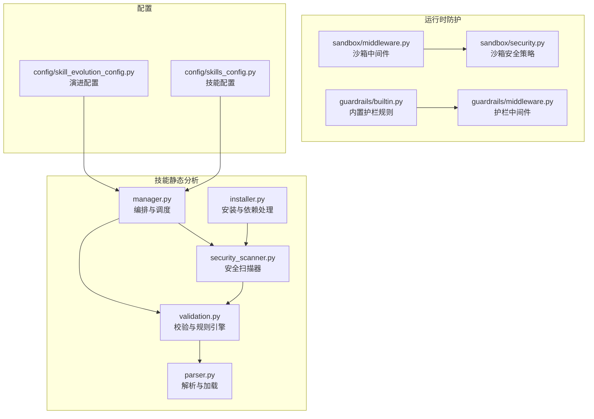
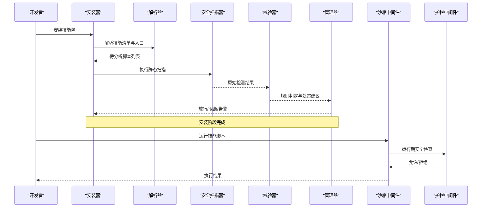
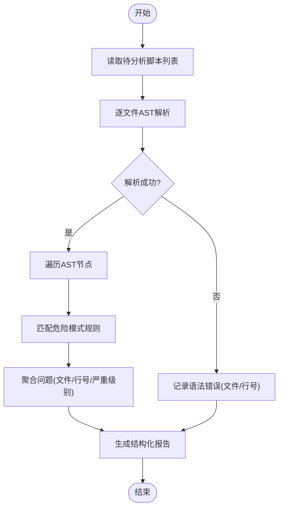
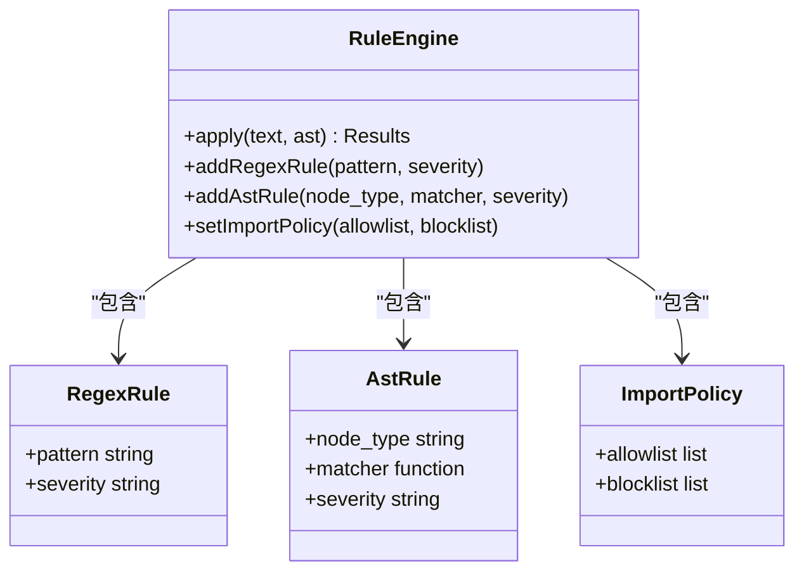
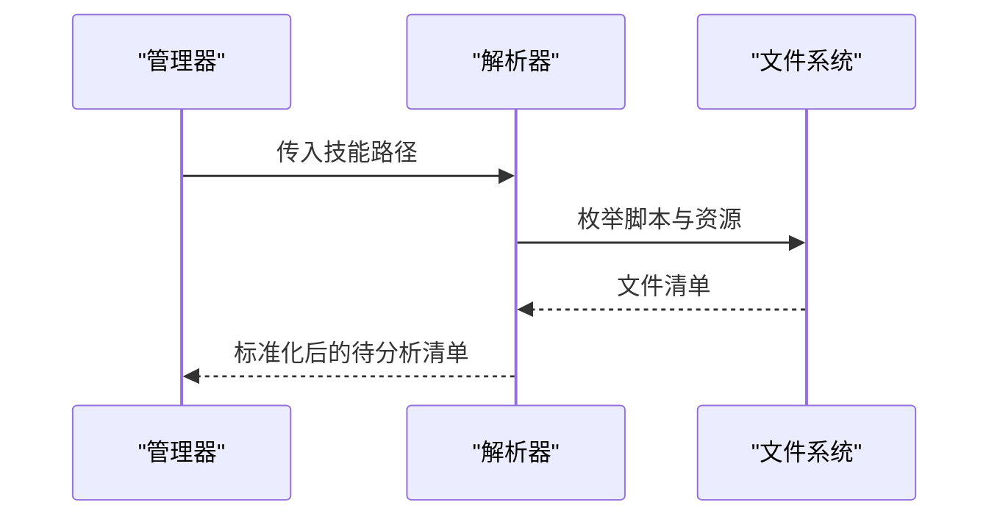
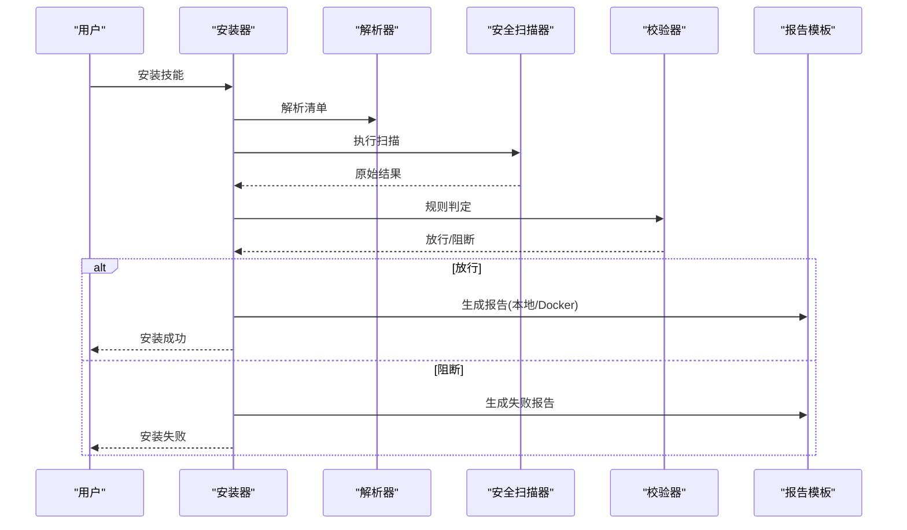
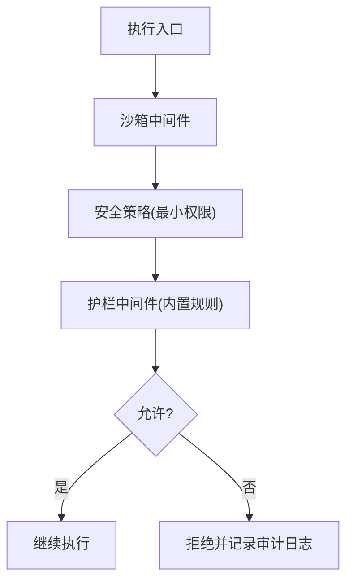
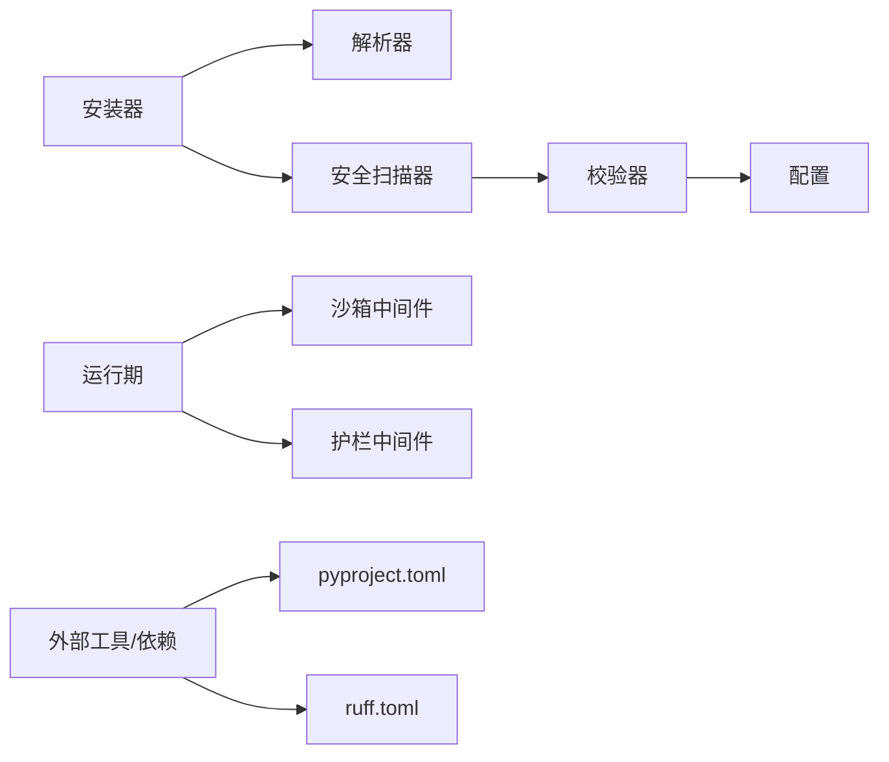

# 静态代码分析

<cite>
**本文引用的文件**   
- [backend/app/harness/deerflow/skills/security_scanner.py](file://backend/app/harness/deerflow/skills/security_scanner.py)
- [backend/app/harness/deerflow/skills/validation.py](file://backend/app/harness/deerflow/skills/validation.py)
- [backend/app/harness/deerflow/skills/parser.py](file://backend/app/harness/deerflow/skills/parser.py)
- [backend/app/harness/deerflow/skills/manager.py](file://backend/app/harness/deerflow/skills/manager.py)
- [backend/app/harness/deerflow/skills/installer.py](file://backend/app/harness/deerflow/skills/installer.py)
- [backend/app/harness/deerflow/sandbox/middleware.py](file://backend/app/harness/deerflow/sandbox/middleware.py)
- [backend/app/harness/deerflow/sandbox/security.py](file://backend/app/harness/deerflow/sandbox/security.py)
- [backend/app/harness/deerflow/guardrails/builtin.py](file://backend/app/harness/deerflow/guardrails/builtin.py)
- [backend/app/harness/deerflow/guardrails/middleware.py](file://backend/app/harness/deerflow/guardrails/middleware.py)
- [backend/app/harness/deerflow/config/skill_evolution_config.py](file://backend/app/harness/deerflow/config/skill_evolution_config.py)
- [backend/app/harness/deerflow/config/skills_config.py](file://backend/app/harness/deerflow/config/skills_config.py)
- [backend/tests/test_security_scanner.py](file://backend/tests/test_security_scanner.py)
- [backend/ruff.toml](file://backend/ruff.toml)
- [backend/pyproject.toml](file://backend/pyproject.toml)
- [.agent/skills/smoke-test/templates/report.docker.template.md](file://.agent/skills/smoke-test/templates/report.docker.template.md)
- [.agent/skills/smoke-test/templates/report.local.template.md](file://.agent/skills/smoke-test/templates/report.local.template.md)
</cite>

## 目录
1. [简介](#简介)
2. [项目结构](#项目结构)
3. [核心组件](#核心组件)
4. [架构总览](#架构总览)
5. [详细组件分析](#详细组件分析)
6. [依赖关系分析](#依赖关系分析)
7. [性能考虑](#性能考虑)
8. [故障排查指南](#故障排查指南)
9. [结论](#结论)
10. [附录](#附录)

## 简介
本文件面向DeerFlow技能（Skills）的静态代码分析能力，聚焦Python侧的安全与质量保障。内容覆盖：
- Python语法检查机制：AST解析、语法树遍历、语法错误检测
- 危险函数调用检测：系统命令执行、文件操作、网络请求等高风险API识别
- 依赖漏洞扫描：第三方库版本检查、已知CVE匹配与安全依赖推荐
- 代码质量评估：复杂度分析、重复代码检测、最佳实践检查
- 自定义静态分析规则配置：正则表达式规则、AST节点匹配规则、导入路径验证
- 报告生成与可视化展示：本地与Docker环境下的模板化输出

## 项目结构
与静态分析相关的核心模块位于后端harness的skills与guardrails子系统中，配合沙箱安全策略与配置项共同工作。

图表来源
- [backend/app/harness/deerflow/skills/security_scanner.py](file://backend/app/harness/deerflow/skills/security_scanner.py)
- [backend/app/harness/deerflow/skills/validation.py](file://backend/app/harness/deerflow/skills/validation.py)
- [backend/app/harness/deerflow/skills/parser.py](file://backend/app/harness/deerflow/skills/parser.py)
- [backend/app/harness/deerflow/skills/manager.py](file://backend/app/harness/deerflow/skills/manager.py)
- [backend/app/harness/deerflow/skills/installer.py](file://backend/app/harness/deerflow/skills/installer.py)
- [backend/app/harness/deerflow/sandbox/middleware.py](file://backend/app/harness/deerflow/sandbox/middleware.py)
- [backend/app/harness/deerflow/sandbox/security.py](file://backend/app/harness/deerflow/sandbox/security.py)
- [backend/app/harness/deerflow/guardrails/builtin.py](file://backend/app/harness/deerflow/guardrails/builtin.py)
- [backend/app/harness/deerflow/guardrails/middleware.py](file://backend/app/harness/deerflow/guardrails/middleware.py)
- [backend/app/harness/deerflow/config/skill_evolution_config.py](file://backend/app/harness/deerflow/config/skill_evolution_config.py)
- [backend/app/harness/deerflow/config/skills_config.py](file://backend/app/harness/deerflow/config/skills_config.py)

章节来源
- [backend/app/harness/deerflow/skills/security_scanner.py](file://backend/app/harness/deerflow/skills/security_scanner.py)
- [backend/app/harness/deerflow/skills/validation.py](file://backend/app/harness/deerflow/skills/validation.py)
- [backend/app/harness/deerflow/skills/parser.py](file://backend/app/harness/deerflow/skills/parser.py)
- [backend/app/harness/deerflow/skills/manager.py](file://backend/app/harness/deerflow/skills/manager.py)
- [backend/app/harness/deerflow/skills/installer.py](file://backend/app/harness/deerflow/skills/installer.py)
- [backend/app/harness/deerflow/sandbox/middleware.py](file://backend/app/harness/deerflow/sandbox/middleware.py)
- [backend/app/harness/deerflow/sandbox/security.py](file://backend/app/harness/deerflow/sandbox/security.py)
- [backend/app/harness/deerflow/guardrails/builtin.py](file://backend/app/harness/deerflow/guardrails/builtin.py)
- [backend/app/harness/deerflow/guardrails/middleware.py](file://backend/app/harness/deerflow/guardrails/middleware.py)
- [backend/app/harness/deerflow/config/skill_evolution_config.py](file://backend/app/harness/deerflow/config/skill_evolution_config.py)
- [backend/app/harness/deerflow/config/skills_config.py](file://backend/app/harness/deerflow/config/skills_config.py)

## 核心组件
- 安全扫描器（Security Scanner）
  - 负责在构建或安装阶段对技能脚本进行静态安全检查，包括危险函数调用检测、导入路径校验、基础语法检查等。
  - 典型流程：读取目标脚本 -> AST解析 -> 遍历节点 -> 匹配风险模式 -> 汇总问题并返回结构化结果。
- 校验与规则引擎（Validation & Rules）
  - 提供可配置的规则集合，支持正则表达式规则与AST节点匹配规则，并可扩展导入路径白名单/黑名单。
  - 将扫描结果与规则阈值结合，决定是否阻断安装或上报告警。
- 解析与加载（Parser & Loader）
  - 负责定位技能入口、解析元数据、收集需要分析的脚本清单。
- 编排与调度（Manager）
  - 协调安装、解析、扫描、校验等步骤，统一输出分析报告。
- 安装器（Installer）
  - 在安装流程中触发静态分析，依据结果决定继续或回滚。
- 沙箱与护栏（Sandbox & Guardrails）
  - 运行期防护：通过中间件拦截高风险系统调用、限制文件系统访问、控制网络出站等；护栏规则用于动态拒绝违规行为。

章节来源
- [backend/app/harness/deerflow/skills/security_scanner.py](file://backend/app/harness/deerflow/skills/security_scanner.py)
- [backend/app/harness/deerflow/skills/validation.py](file://backend/app/harness/deerflow/skills/validation.py)
- [backend/app/harness/deerflow/skills/parser.py](file://backend/app/harness/deerflow/skills/parser.py)
- [backend/app/harness/deerflow/skills/manager.py](file://backend/app/harness/deerflow/skills/manager.py)
- [backend/app/harness/deerflow/skills/installer.py](file://backend/app/harness/deerflow/skills/installer.py)
- [backend/app/harness/deerflow/sandbox/middleware.py](file://backend/app/harness/deerflow/sandbox/middleware.py)
- [backend/app/harness/deerflow/sandbox/security.py](file://backend/app/harness/deerflow/sandbox/security.py)
- [backend/app/harness/deerflow/guardrails/builtin.py](file://backend/app/harness/deerflow/guardrails/builtin.py)
- [backend/app/harness/deerflow/guardrails/middleware.py](file://backend/app/harness/deerflow/guardrails/middleware.py)

## 架构总览
静态分析贯穿“安装前”和“运行期”两个阶段：
- 安装前：由安装器触发解析与扫描，校验器基于规则判定是否放行。
- 运行期：沙箱中间件与护栏中间件对实际执行进行二次约束。

图表来源
- [backend/app/harness/deerflow/skills/installer.py](file://backend/app/harness/deerflow/skills/installer.py)
- [backend/app/harness/deerflow/skills/parser.py](file://backend/app/harness/deerflow/skills/parser.py)
- [backend/app/harness/deerflow/skills/security_scanner.py](file://backend/app/harness/deerflow/skills/security_scanner.py)
- [backend/app/harness/deerflow/skills/validation.py](file://backend/app/harness/deerflow/skills/validation.py)
- [backend/app/harness/deerflow/skills/manager.py](file://backend/app/harness/deerflow/skills/manager.py)
- [backend/app/harness/deerflow/sandbox/middleware.py](file://backend/app/harness/deerflow/sandbox/middleware.py)
- [backend/app/harness/deerflow/guardrails/middleware.py](file://backend/app/harness/deerflow/guardrails/middleware.py)

## 详细组件分析

### 安全扫描器（Security Scanner）
职责与流程
- 输入：技能中的Python脚本集合
- 处理：
  - AST解析：使用标准库解析为抽象语法树
  - 遍历：深度优先遍历节点，提取函数调用、属性访问、字符串常量等上下文
  - 匹配：基于预置规则集识别高风险模式（如系统命令执行、敏感文件读写、外部网络请求等）
  - 聚合：按文件、行号、严重级别汇总问题
- 输出：结构化检测报告（供校验器与报告模板消费）

关键实现要点
- 危险函数检测
  - 系统命令执行：匹配常见危险函数名与参数模式（例如直接拼接用户输入的场景）
  - 文件操作：匹配高权限路径写入、临时目录滥用、符号链接绕过等
  - 网络请求：匹配未校验URL、禁用证书、明文传输等
- 导入路径验证
  - 白名单/黑名单机制，阻止从不受信任命名空间导入
- 语法错误检测
  - 捕获解析异常并记录位置信息，便于修复

图表来源
- [backend/app/harness/deerflow/skills/security_scanner.py](file://backend/app/harness/deerflow/skills/security_scanner.py)

章节来源
- [backend/app/harness/deerflow/skills/security_scanner.py](file://backend/app/harness/deerflow/skills/security_scanner.py)

### 校验与规则引擎（Validation & Rules）
职责与流程
- 规则类型
  - 正则表达式规则：针对源码文本快速命中可疑片段
  - AST节点匹配规则：基于语义更精确地识别风险调用
  - 导入路径验证：限定允许的包/模块来源
- 决策逻辑
  - 根据规则命中数量与严重级别，计算是否阻断安装或仅告警
  - 支持阈值与豁免配置

图表来源
- [backend/app/harness/deerflow/skills/validation.py](file://backend/app/harness/deerflow/skills/validation.py)

章节来源
- [backend/app/harness/deerflow/skills/validation.py](file://backend/app/harness/deerflow/skills/validation.py)

### 解析与加载（Parser & Loader）
职责与流程
- 定位技能根目录与入口文件
- 收集需要分析的脚本清单（排除无关资源）
- 提供统一的文件路径规范化与相对路径映射

图表来源
- [backend/app/harness/deerflow/skills/parser.py](file://backend/app/harness/deerflow/skills/parser.py)
- [backend/app/harness/deerflow/skills/manager.py](file://backend/app/harness/deerflow/skills/manager.py)

章节来源
- [backend/app/harness/deerflow/skills/parser.py](file://backend/app/harness/deerflow/skills/parser.py)
- [backend/app/harness/deerflow/skills/manager.py](file://backend/app/harness/deerflow/skills/manager.py)

### 安装器（Installer）
职责与流程
- 在技能安装前后触发静态分析
- 根据校验结果决定是否继续安装、回滚或提示人工确认
- 集成报告生成（本地/Docker模板）

图表来源
- [backend/app/harness/deerflow/skills/installer.py](file://backend/app/harness/deerflow/skills/installer.py)
- [.agent/skills/smoke-test/templates/report.docker.template.md](file://.agent/skills/smoke-test/templates/report.docker.template.md)
- [.agent/skills/smoke-test/templates/report.local.template.md](file://.agent/skills/smoke-test/templates/report.local.template.md)

章节来源
- [backend/app/harness/deerflow/skills/installer.py](file://backend/app/harness/deerflow/skills/installer.py)
- [.agent/skills/smoke-test/templates/report.docker.template.md](file://.agent/skills/smoke-test/templates/report.docker.template.md)
- [.agent/skills/smoke-test/templates/report.local.template.md](file://.agent/skills/smoke-test/templates/report.local.template.md)

### 沙箱与护栏（Sandbox & Guardrails）
职责与流程
- 沙箱中间件：在执行时限制系统调用、文件IO、网络访问等
- 护栏中间件：基于内置规则对运行时行为进行拦截与审计
- 安全策略：定义最小权限模型与默认拒绝策略

图表来源
- [backend/app/harness/deerflow/sandbox/middleware.py](file://backend/app/harness/deerflow/sandbox/middleware.py)
- [backend/app/harness/deerflow/sandbox/security.py](file://backend/app/harness/deerflow/sandbox/security.py)
- [backend/app/harness/deerflow/guardrails/builtin.py](file://backend/app/harness/deerflow/guardrails/builtin.py)
- [backend/app/harness/deerflow/guardrails/middleware.py](file://backend/app/harness/deerflow/guardrails/middleware.py)

章节来源
- [backend/app/harness/deerflow/sandbox/middleware.py](file://backend/app/harness/deerflow/sandbox/middleware.py)
- [backend/app/harness/deerflow/sandbox/security.py](file://backend/app/harness/deerflow/sandbox/security.py)
- [backend/app/harness/deerflow/guardrails/builtin.py](file://backend/app/harness/deerflow/guardrails/builtin.py)
- [backend/app/harness/deerflow/guardrails/middleware.py](file://backend/app/harness/deerflow/guardrails/middleware.py)

### 配置项（Config）
- 技能演进配置：控制静态分析开关、规则强度、是否阻断安装等
- 技能配置：管理技能元数据、依赖声明、安装策略等

章节来源
- [backend/app/harness/deerflow/config/skill_evolution_config.py](file://backend/app/harness/deerflow/config/skill_evolution_config.py)
- [backend/app/harness/deerflow/config/skills_config.py](file://backend/app/harness/deerflow/config/skills_config.py)

## 依赖关系分析
- 内部依赖
  - 安装器依赖解析器与安全扫描器
  - 安全扫描器依赖校验器与规则引擎
  - 沙箱与护栏在运行期作为额外防线
- 外部依赖
  - Python标准库AST用于语法树解析
  - 可选工具链（如ruff）用于代码风格与基础质量检查
  - 依赖清单（pyproject.toml）用于版本管理与潜在漏洞参考

图表来源
- [backend/app/harness/deerflow/skills/installer.py](file://backend/app/harness/deerflow/skills/installer.py)
- [backend/app/harness/deerflow/skills/parser.py](file://backend/app/harness/deerflow/skills/parser.py)
- [backend/app/harness/deerflow/skills/security_scanner.py](file://backend/app/harness/deerflow/skills/security_scanner.py)
- [backend/app/harness/deerflow/skills/validation.py](file://backend/app/harness/deerflow/skills/validation.py)
- [backend/app/harness/deerflow/sandbox/middleware.py](file://backend/app/harness/deerflow/sandbox/middleware.py)
- [backend/app/harness/deerflow/guardrails/middleware.py](file://backend/app/harness/deerflow/guardrails/middleware.py)
- [backend/pyproject.toml](file://backend/pyproject.toml)
- [backend/ruff.toml](file://backend/ruff.toml)

章节来源
- [backend/pyproject.toml](file://backend/pyproject.toml)
- [backend/ruff.toml](file://backend/ruff.toml)

## 性能考虑
- 增量扫描：仅对变更文件进行AST解析与规则匹配，减少全量扫描开销
- 并行处理：多文件并发解析与匹配，利用CPU多核提升吞吐
- 规则优化：将高频正则规则前置，AST规则后置，降低不必要的解析成本
- 缓存策略：对已解析的AST与规则命中结果进行缓存，避免重复计算
- 阈值控制：对低严重级别问题采用异步报告而非阻塞安装，缩短主流程耗时

[本节为通用指导，不直接分析具体文件]

## 故障排查指南
- 常见问题
  - 解析失败：检查语法错误与编码问题，定位到具体文件与行号
  - 误报过多：调整规则阈值或添加豁免项，必要时扩展白名单
  - 阻断安装：查看报告详情，定位高危调用并替换为安全替代方案
- 定位方法
  - 启用详细日志，关注扫描阶段的异常堆栈
  - 使用测试用例复现：参考现有测试以构造最小复现场景
- 相关测试
  - 安全扫描器测试：验证规则命中与报告格式
  - 沙箱与护栏测试：验证运行期拦截与审计日志

章节来源
- [backend/tests/test_security_scanner.py](file://backend/tests/test_security_scanner.py)

## 结论
DeerFlow的技能静态代码分析体系以“安装前静态扫描 + 运行期沙箱护栏”的双层防护为核心，结合可配置规则引擎与模板化报告，形成从发现、评估到处置的闭环。通过AST解析与规则匹配，可有效识别危险函数调用与不安全导入；通过沙箱与护栏进一步收敛运行期风险。建议在团队内推广该机制，并结合CI流水线持续集成，确保技能生态的安全与质量。

[本节为总结性内容，不直接分析具体文件]

## 附录

### 自定义静态分析规则配置方法
- 正则表达式规则
  - 适用场景：快速命中可疑文本片段（如硬编码密钥、危险字符串）
  - 配置要点：定义匹配模式与严重级别，避免过度宽泛导致误报
- AST节点匹配规则
  - 适用场景：基于语义精准识别风险调用（如特定函数名+参数模式）
  - 配置要点：明确节点类型与匹配条件，结合上下文提高准确率
- 导入路径验证
  - 适用场景：限制从不受信任命名空间导入
  - 配置要点：维护白名单/黑名单，定期更新以适配新依赖

[本节为概念性说明，不直接分析具体文件]

### 报告生成与可视化
- 模板
  - 本地模板：适用于开发环境与本地调试
  - Docker模板：适用于容器化部署与流水线集成
- 输出字段
  - 文件路径、行号、问题描述、严重级别、修复建议
- 可视化
  - 可将报告转换为HTML或Markdown，便于在PR或文档中展示

章节来源
- [.agent/skills/smoke-test/templates/report.docker.template.md](file://.agent/skills/smoke-test/templates/report.docker.template.md)
- [.agent/skills/smoke-test/templates/report.local.template.md](file://.agent/skills/smoke-test/templates/report.local.template.md)