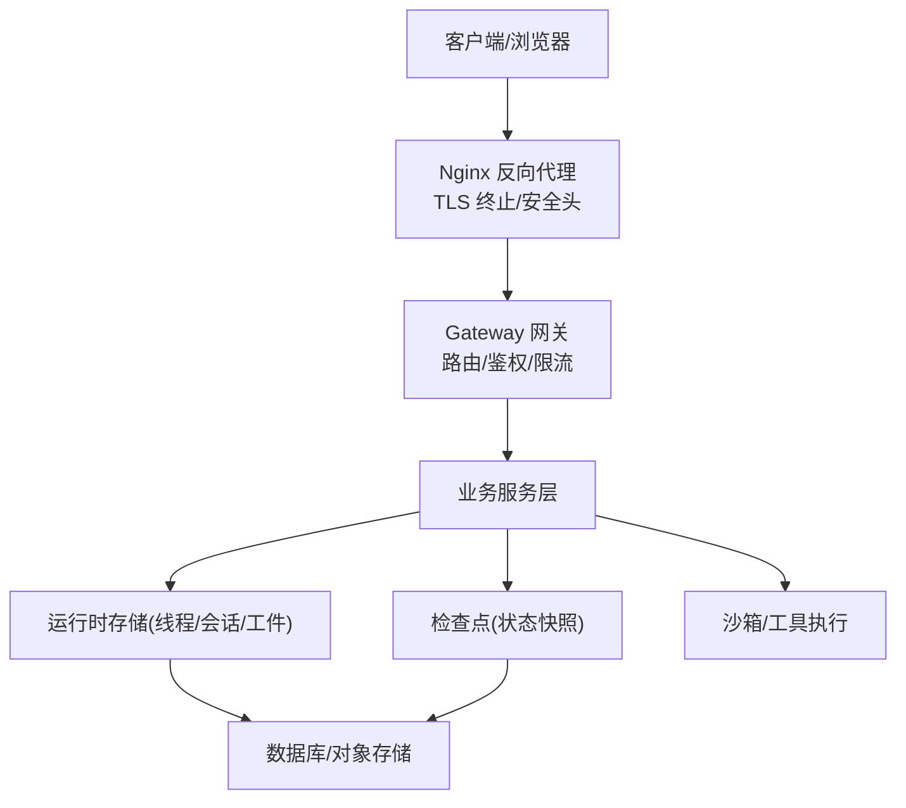
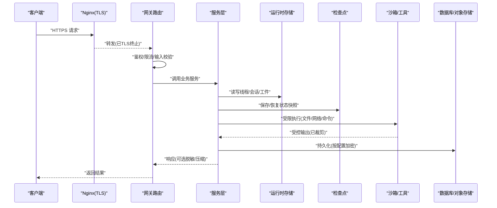
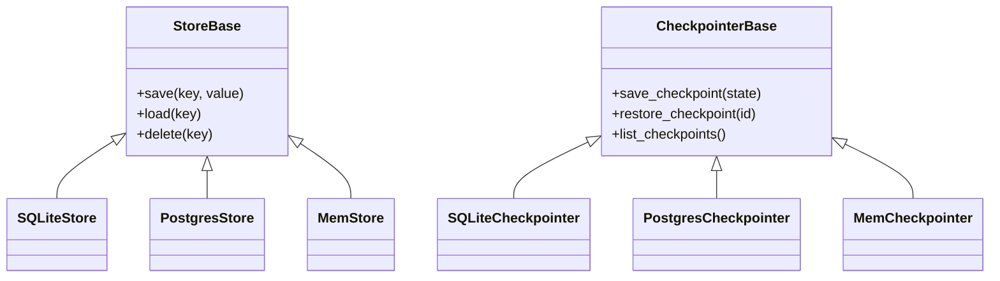
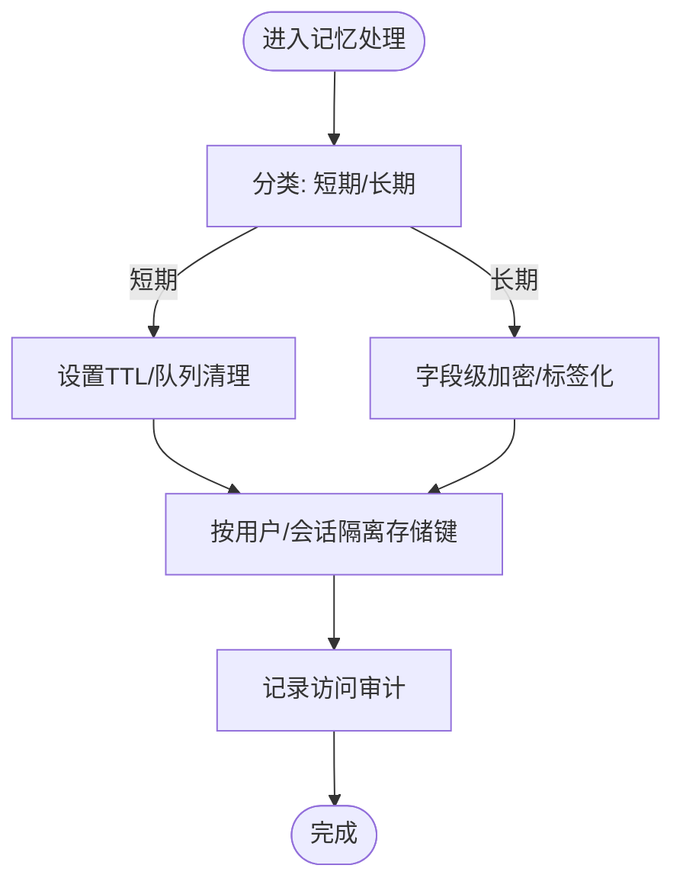
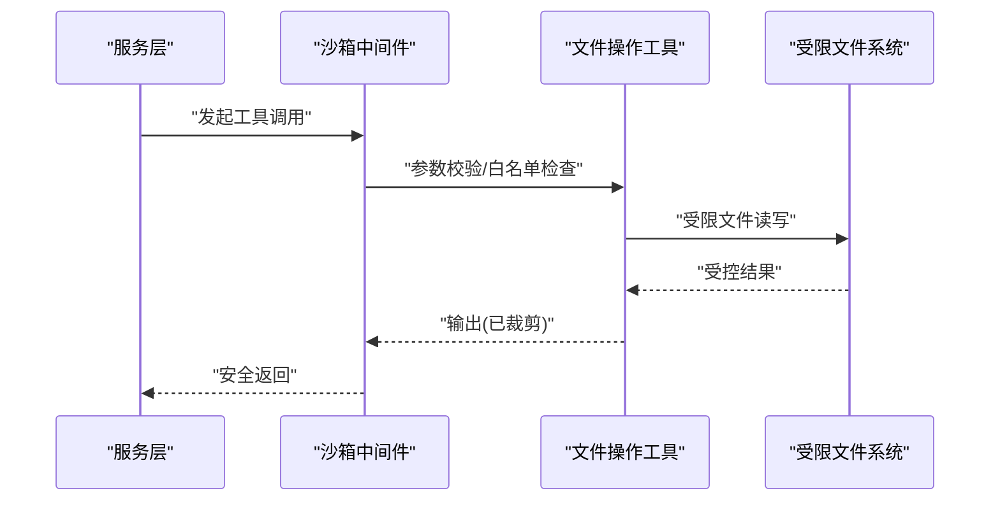
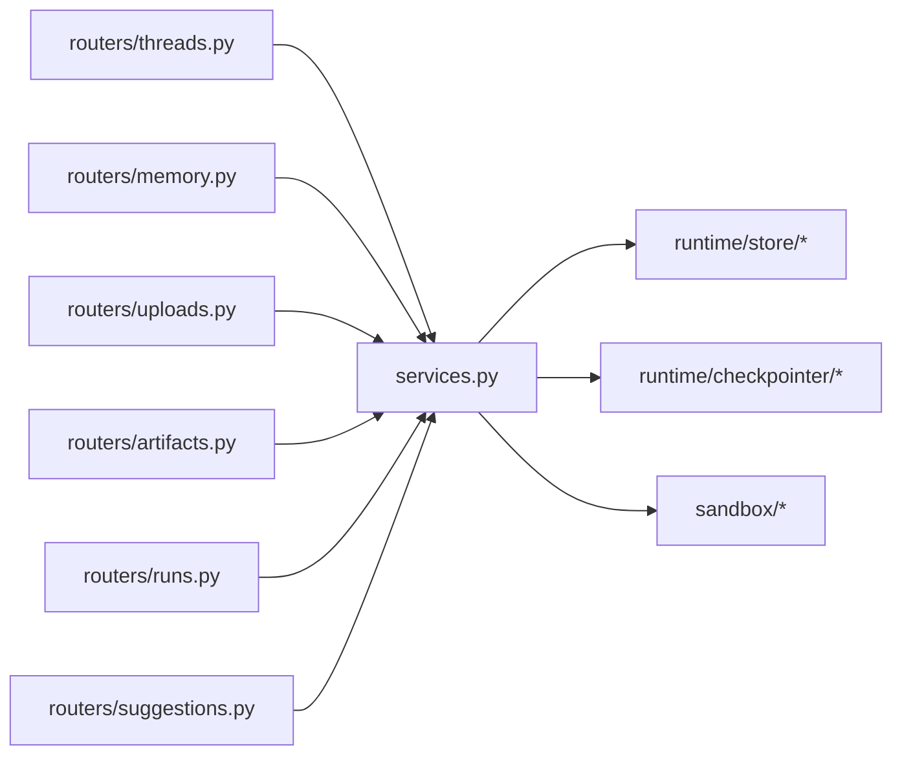

# 数据安全与隐私

<cite>
**本文引用的文件**   
- [backend/app/gateway/routers/memory.py](file://backend/app/gateway/routers/memory.py)
- [backend/app/gateway/routers/threads.py](file://backend/app/gateway/routers/threads.py)
- [backend/app/gateway/routers/uploads.py](file://backend/app/gateway/routers/uploads.py)
- [backend/app/gateway/routers/artifacts.py](file://backend/app/gateway/routers/artifacts.py)
- [backend/app/gateway/routers/runs.py](file://backend/app/gateway/routers/runs.py)
- [backend/app/gateway/routers/suggestions.py](file://backend/app/gateway/routers/suggestions.py)
- [backend/app/gateway/services.py](file://backend/app/gateway/services.py)
- [backend/app/gateway/deps.py](file://backend/app/gateway/deps.py)
- [backend/app/gateway/config.py](file://backend/app/gateway/config.py)
- [backend/packages/harness/deerflow/runtime/store/__init__.py](file://backend/packages/harness/deerflow/runtime/store/__init__.py)
- [backend/packages/harness/deerflow/runtime/store/base.py](file://backend/packages/harness/deerflow/runtime/store/base.py)
- [backend/packages/harness/deerflow/runtime/store/sqlite_store.py](file://backend/packages/harness/deerflow/runtime/store/sqlite_store.py)
- [backend/packages/harness/deerflow/runtime/store/postgres_store.py](file://backend/packages/harness/deerflow/runtime/store/postgres_store.py)
- [backend/packages/harness/deerflow/runtime/store/mem_store.py](file://backend/packages/harness/deerflow/runtime/store/mem_store.py)
- [backend/packages/harness/deerflow/runtime/checkpointer/__init__.py](file://backend/packages/harness/deerflow/runtime/checkpointer/__init__.py)
- [backend/packages/harness/deerflow/runtime/checkpointer/base.py](file://backend/packages/harness/deerflow/runtime/checkpointer/base.py)
- [backend/packages/harness/deerflow/runtime/checkpointer/sqlite_checkpointer.py](file://backend/packages/harness/deerflow/runtime/checkpointer/sqlite_checkpointer.py)
- [backend/packages/harness/deerflow/runtime/checkpointer/postgres_checkpointer.py](file://backend/packages/harness/deerflow/runtime/checkpointer/postgres_checkpointer.py)
- [backend/packages/harness/deerflow/runtime/checkpointer/mem_checkpointer.py](file://backend/packages/harness/deerflow/runtime/checkpointer/mem_checkpointer.py)
- [backend/packages/harness/deerflow/agents/memory/memory_manager.py](file://backend/packages/harness/deerflow/agents/memory/memory_manager.py)
- [backend/packages/harness/deerflow/agents/memory/memory_updater.py](file://backend/packages/harness/deerflow/agents/memory/memory_updater.py)
- [backend/packages/harness/deerflow/agents/memory/memory_queue.py](file://backend/packages/harness/deerflow/agents/memory/memory_queue.py)
- [backend/packages/harness/deerflow/agents/memory/memory_prompt_injection_middleware.py](file://backend/packages/harness/deerflow/agents/memory/memory_prompt_injection_middleware.py)
- [backend/packages/harness/deerflow/agents/middlewares/thread_data_middleware.py](file://backend/packages/harness/deerflow/agents/middlewares/thread_data_middleware.py)
- [backend/packages/harness/deerflow/agents/middlewares/subagent_limit_middleware.py](file://backend/packages/harness/deerflow/agents/middlewares/subagent_limit_middleware.py)
- [backend/packages/harness/deerflow/agents/middlewares/tool_output_truncation_middleware.py](file://backend/packages/harness/deerflow/agents/middlewares/tool_output_truncation_middleware.py)
- [backend/packages/harness/deerflow/agents/middlewares/llm_error_handling_middleware.py](file://backend/packages/harness/deerflow/agents/middlewares/llm_error_handling_middleware.py)
- [backend/packages/harness/deerflow/agents/middlewares/title_middleware.py](file://backend/packages/harness/deerflow/agents/middlewares/title_middleware.py)
- [backend/packages/harness/deerflow/tools/builtins/file_operation_tool.py](file://backend/packages/harness/deerflow/tools/builtins/file_operation_tool.py)
- [backend/packages/harness/deerflow/sandbox/security.py](file://backend/packages/harness/deerflow/sandbox/security.py)
- [backend/packages/harness/deerflow/sandbox/middleware.py](file://backend/packages/harness/deerflow/sandbox/middleware.py)
- [backend/packages/harness/deerflow/sandbox/local/backend.py](file://backend/packages/harness/deerflow/sandbox/local/backend.py)
- [backend/packages/harness/deerflow/sandbox/local/provider.py](file://backend/packages/harness/deerflow/sandbox/local/provider.py)
- [backend/packages/harness/deerflow/sandbox/local/provisioner.py](file://backend/packages/harness/deerflow/sandbox/local/provisioner.py)
- [docker/nginx/nginx.conf](file://docker/nginx/nginx.conf)
- [docker/docker-compose.yaml](file://docker/docker-compose.yaml)
- [SECURITY.md](file://SECURITY.md)
</cite>

## 目录
1. [简介](#简介)
2. [项目结构](#项目结构)
3. [核心组件](#核心组件)
4. [架构总览](#架构总览)
5. [详细组件分析](#详细组件分析)
6. [依赖关系分析](#依赖关系分析)
7. [性能考虑](#性能考虑)
8. [故障排查指南](#故障排查指南)
9. [结论](#结论)
10. [附录](#附录)

## 简介
本文件聚焦 DeerFlow 的数据安全与隐私，围绕传输加密、存储加密、字段级加密、敏感数据处理（PII识别、脱敏、匿名化）、数据库访问控制与审计、记忆数据生命周期与隔离、API 安全（请求签名、响应加密、速率限制）、合规性支持（GDPR/CCPA）以及数据泄露检测与应急响应进行系统化说明。文档既提供高层概览，也给出面向代码的深入分析与图示，帮助读者在理解系统的同时落地最佳实践。

## 项目结构
DeerFlow 后端采用网关路由 + 服务层 + 运行时持久化（Store/Checkpointer）的分层设计；前端通过 Next.js API 路由与后端交互；Nginx 作为反向代理承载 TLS 终止与基础安全头；沙箱与工具链对执行环境进行隔离与约束。

图表来源
- [docker/nginx/nginx.conf:1-200](file://docker/nginx/nginx.conf#L1-L200)
- [backend/app/gateway/routers/threads.py:1-200](file://backend/app/gateway/routers/threads.py#L1-L200)
- [backend/app/gateway/services.py:1-200](file://backend/app/gateway/services.py#L1-L200)
- [backend/packages/harness/deerflow/runtime/store/__init__.py:1-200](file://backend/packages/harness/deerflow/runtime/store/__init__.py#L1-L200)
- [backend/packages/harness/deerflow/runtime/checkpointer/__init__.py:1-200](file://backend/packages/harness/deerflow/runtime/checkpointer/__init__.py#L1-L200)
- [backend/packages/harness/deerflow/sandbox/middleware.py:1-200](file://backend/packages/harness/deerflow/sandbox/middleware.py#L1-L200)

章节来源
- [docker/nginx/nginx.conf:1-200](file://docker/nginx/nginx.conf#L1-L200)
- [docker/docker-compose.yaml:1-200](file://docker/docker-compose.yaml#L1-L200)
- [backend/app/gateway/routers/threads.py:1-200](file://backend/app/gateway/routers/threads.py#L1-L200)
- [backend/app/gateway/services.py:1-200](file://backend/app/gateway/services.py#L1-L200)
- [backend/packages/harness/deerflow/runtime/store/__init__.py:1-200](file://backend/packages/harness/deerflow/runtime/store/__init__.py#L1-L200)
- [backend/packages/harness/deerflow/runtime/checkpointer/__init__.py:1-200](file://backend/packages/harness/deerflow/runtime/checkpointer/__init__.py#L1-L200)
- [backend/packages/harness/deerflow/sandbox/middleware.py:1-200](file://backend/packages/harness/deerflow/sandbox/middleware.py#L1-L200)

## 核心组件
- 网关与安全中间件：负责请求入口、鉴权、限流、输入校验、输出裁剪等。
- 运行时存储与检查点：线程上下文、会话、工件与状态快照的持久化。
- 记忆管理：短期/长期记忆队列、更新器、注入防护。
- 沙箱与工具：受限执行环境、文件操作白名单、输出截断。
- 外部集成：模型调用、MCP、上传与下载、通道消息。

章节来源
- [backend/app/gateway/routers/memory.py:1-200](file://backend/app/gateway/routers/memory.py#L1-L200)
- [backend/app/gateway/routers/uploads.py:1-200](file://backend/app/gateway/routers/uploads.py#L1-L200)
- [backend/app/gateway/routers/artifacts.py:1-200](file://backend/app/gateway/routers/artifacts.py#L1-L200)
- [backend/app/gateway/routers/runs.py:1-200](file://backend/app/gateway/routers/runs.py#L1-L200)
- [backend/app/gateway/routers/suggestions.py:1-200](file://backend/app/gateway/routers/suggestions.py#L1-L200)
- [backend/app/gateway/services.py:1-200](file://backend/app/gateway/services.py#L1-L200)
- [backend/app/gateway/deps.py:1-200](file://backend/app/gateway/deps.py#L1-L200)
- [backend/app/gateway/config.py:1-200](file://backend/app/gateway/config.py#L1-L200)

## 架构总览
下图展示从客户端到存储/检查点的端到端数据流，并标注关键安全控制点（TLS、鉴权、限流、输入校验、输出裁剪、沙箱隔离）。

图表来源
- [docker/nginx/nginx.conf:1-200](file://docker/nginx/nginx.conf#L1-L200)
- [backend/app/gateway/routers/threads.py:1-200](file://backend/app/gateway/routers/threads.py#L1-L200)
- [backend/app/gateway/services.py:1-200](file://backend/app/gateway/services.py#L1-L200)
- [backend/packages/harness/deerflow/runtime/store/__init__.py:1-200](file://backend/packages/harness/deerflow/runtime/store/__init__.py#L1-L200)
- [backend/packages/harness/deerflow/runtime/checkpointer/__init__.py:1-200](file://backend/packages/harness/deerflow/runtime/checkpointer/__init__.py#L1-L200)
- [backend/packages/harness/deerflow/sandbox/middleware.py:1-200](file://backend/packages/harness/deerflow/sandbox/middleware.py#L1-L200)

## 详细组件分析

### 传输加密（TLS）
- Nginx 作为反向代理统一终止 TLS，对外暴露 HTTPS，对内以 HTTP 通信，集中管理证书与协议版本。
- 建议启用强密码套件、HSTS、OCSP Stapling，并在容器编排中通过环境变量注入证书路径与密钥。

章节来源
- [docker/nginx/nginx.conf:1-200](file://docker/nginx/nginx.conf#L1-L200)
- [docker/docker-compose.yaml:1-200](file://docker/docker-compose.yaml#L1-L200)

### 存储加密与字段级加密
- 运行时存储与检查点抽象了多种后端实现（内存、SQLite、PostgreSQL），可通过配置切换。生产建议使用具备透明磁盘加密或列级加密能力的数据库引擎，并结合 KMS 管理密钥。
- 字段级加密可在服务层对高敏感字段（如 PII）写入前加密、读取后解密，确保即使底层未开启全库加密也能满足最小可见原则。

图表来源
- [backend/packages/harness/deerflow/runtime/store/base.py:1-200](file://backend/packages/harness/deerflow/runtime/store/base.py#L1-L200)
- [backend/packages/harness/deerflow/runtime/store/sqlite_store.py:1-200](file://backend/packages/harness/deerflow/runtime/store/sqlite_store.py#L1-L200)
- [backend/packages/harness/deerflow/runtime/store/postgres_store.py:1-200](file://backend/packages/harness/deerflow/runtime/store/postgres_store.py#L1-L200)
- [backend/packages/harness/deerflow/runtime/store/mem_store.py:1-200](file://backend/packages/harness/deerflow/runtime/store/mem_store.py#L1-L200)
- [backend/packages/harness/deerflow/runtime/checkpointer/base.py:1-200](file://backend/packages/harness/deerflow/runtime/checkpointer/base.py#L1-L200)
- [backend/packages/harness/deerflow/runtime/checkpointer/sqlite_checkpointer.py:1-200](file://backend/packages/harness/deerflow/runtime/checkpointer/sqlite_checkpointer.py#L1-L200)
- [backend/packages/harness/deerflow/runtime/checkpointer/postgres_checkpointer.py:1-200](file://backend/packages/harness/deerflow/runtime/checkpointer/postgres_checkpointer.py#L1-L200)
- [backend/packages/harness/deerflow/runtime/checkpointer/mem_checkpointer.py:1-200](file://backend/packages/harness/deerflow/runtime/checkpointer/mem_checkpointer.py#L1-L200)

章节来源
- [backend/packages/harness/deerflow/runtime/store/__init__.py:1-200](file://backend/packages/harness/deerflow/runtime/store/__init__.py#L1-L200)
- [backend/packages/harness/deerflow/runtime/checkpointer/__init__.py:1-200](file://backend/packages/harness/deerflow/runtime/checkpointer/__init__.py#L1-L200)

### 敏感数据处理（PII 识别、脱敏、匿名化）
- 建议在网关或服务层引入统一的敏感信息扫描与替换管线，对日志、响应体、上传内容中的 PII 进行识别与脱敏。
- 对于需要保留但不可见的高敏字段，采用“标记+延迟解密”策略，仅在必要上下文中解密并严格记录访问审计。

章节来源
- [backend/app/gateway/routers/uploads.py:1-200](file://backend/app/gateway/routers/uploads.py#L1-L200)
- [backend/app/gateway/routers/artifacts.py:1-200](file://backend/app/gateway/routers/artifacts.py#L1-L200)
- [backend/app/gateway/services.py:1-200](file://backend/app/gateway/services.py#L1-L200)

### 数据库安全（访问控制、查询审计、备份加密）
- 使用独立数据库账号与最小权限原则，区分读写账号与只读账号；连接串通过配置中心或密钥管理服务注入。
- 在生产环境启用数据库审计插件或基于 WAF/代理层的 SQL 审计；定期导出备份并启用静态加密。

章节来源
- [backend/packages/harness/deerflow/runtime/store/postgres_store.py:1-200](file://backend/packages/harness/deerflow/runtime/store/postgres_store.py#L1-L200)
- [backend/packages/harness/deerflow/runtime/checkpointer/postgres_checkpointer.py:1-200](file://backend/packages/harness/deerflow/runtime/checkpointer/postgres_checkpointer.py#L1-L200)
- [backend/app/gateway/config.py:1-200](file://backend/app/gateway/config.py#L1-L200)

### 记忆数据安全（短期清理、长期加密、用户隔离）
- 短期记忆：结合队列与过期策略，避免常驻内存导致泄露面扩大。
- 长期记忆：落盘前进行字段级加密；按用户/租户维度隔离存储键空间。
- 注入防护：对记忆注入点进行校验与过滤，防止提示词注入。

图表来源
- [backend/packages/harness/deerflow/agents/memory/memory_queue.py:1-200](file://backend/packages/harness/deerflow/agents/memory/memory_queue.py#L1-L200)
- [backend/packages/harness/deerflow/agents/memory/memory_updater.py:1-200](file://backend/packages/harness/deerflow/agents/memory/memory_updater.py#L1-L200)
- [backend/packages/harness/deerflow/agents/memory/memory_prompt_injection_middleware.py:1-200](file://backend/packages/harness/deerflow/agents/memory/memory_prompt_injection_middleware.py#L1-L200)
- [backend/packages/harness/deerflow/agents/middlewares/thread_data_middleware.py:1-200](file://backend/packages/harness/deerflow/agents/middlewares/thread_data_middleware.py#L1-L200)

章节来源
- [backend/packages/harness/deerflow/agents/memory/memory_manager.py:1-200](file://backend/packages/harness/deerflow/agents/memory/memory_manager.py#L1-L200)
- [backend/packages/harness/deerflow/agents/memory/memory_queue.py:1-200](file://backend/packages/harness/deerflow/agents/memory/memory_queue.py#L1-L200)
- [backend/packages/harness/deerflow/agents/memory/memory_updater.py:1-200](file://backend/packages/harness/deerflow/agents/memory/memory_updater.py#L1-L200)
- [backend/packages/harness/deerflow/agents/memory/memory_prompt_injection_middleware.py:1-200](file://backend/packages/harness/deerflow/agents/memory/memory_prompt_injection_middleware.py#L1-L200)
- [backend/packages/harness/deerflow/agents/middlewares/thread_data_middleware.py:1-200](file://backend/packages/harness/deerflow/agents/middlewares/thread_data_middleware.py#L1-L200)

### API 数据安全（请求签名、响应加密、速率限制）
- 请求签名：在网关层验证客户端签名，防止篡改与重放。
- 响应加密：对包含敏感信息的响应体进行选择性加密或脱敏后再返回。
- 速率限制：基于 IP/用户/租户维度实施限流，保护后端资源与降低滥用风险。

章节来源
- [backend/app/gateway/routers/threads.py:1-200](file://backend/app/gateway/routers/threads.py#L1-L200)
- [backend/app/gateway/routers/memory.py:1-200](file://backend/app/gateway/routers/memory.py#L1-L200)
- [backend/app/gateway/routers/uploads.py:1-200](file://backend/app/gateway/routers/uploads.py#L1-L200)
- [backend/app/gateway/routers/artifacts.py:1-200](file://backend/app/gateway/routers/artifacts.py#L1-L200)
- [backend/app/gateway/routers/runs.py:1-200](file://backend/app/gateway/routers/runs.py#L1-L200)
- [backend/app/gateway/routers/suggestions.py:1-200](file://backend/app/gateway/routers/suggestions.py#L1-L200)
- [backend/app/gateway/deps.py:1-200](file://backend/app/gateway/deps.py#L1-L200)
- [backend/app/gateway/config.py:1-200](file://backend/app/gateway/config.py#L1-L200)

### 沙箱与工具安全（文件操作、网络、命令）
- 沙箱中间件对工具执行进行隔离与约束，限制文件系统访问范围、网络出站与可执行命令白名单。
- 内置文件操作工具需遵循最小权限与路径白名单策略，并对输出进行长度与内容裁剪。

图表来源
- [backend/packages/harness/deerflow/sandbox/middleware.py:1-200](file://backend/packages/harness/deerflow/sandbox/middleware.py#L1-L200)
- [backend/packages/harness/deerflow/sandbox/security.py:1-200](file://backend/packages/harness/deerflow/sandbox/security.py#L1-L200)
- [backend/packages/harness/deerflow/tools/builtins/file_operation_tool.py:1-200](file://backend/packages/harness/deerflow/tools/builtins/file_operation_tool.py#L1-L200)
- [backend/packages/harness/deerflow/agents/middlewares/tool_output_truncation_middleware.py:1-200](file://backend/packages/harness/deerflow/agents/middlewares/tool_output_truncation_middleware.py#L1-L200)

章节来源
- [backend/packages/harness/deerflow/sandbox/local/backend.py:1-200](file://backend/packages/harness/deerflow/sandbox/local/backend.py#L1-L200)
- [backend/packages/harness/deerflow/sandbox/local/provider.py:1-200](file://backend/packages/harness/deerflow/sandbox/local/provider.py#L1-L200)
- [backend/packages/harness/deerflow/sandbox/local/provisioner.py:1-200](file://backend/packages/harness/deerflow/sandbox/local/provisioner.py#L1-L200)

### 错误处理与异常安全
- LLM 错误处理中间件对异常进行规范化与脱敏，避免将内部堆栈或敏感信息回显给客户端。
- 标题生成中间件与子代理限制中间件用于减少不必要的数据外泄面。

章节来源
- [backend/packages/harness/deerflow/agents/middlewares/llm_error_handling_middleware.py:1-200](file://backend/packages/harness/deerflow/agents/middlewares/llm_error_handling_middleware.py#L1-L200)
- [backend/packages/harness/deerflow/agents/middlewares/title_middleware.py:1-200](file://backend/packages/harness/deerflow/agents/middlewares/title_middleware.py#L1-L200)
- [backend/packages/harness/deerflow/agents/middlewares/subagent_limit_middleware.py:1-200](file://backend/packages/harness/deerflow/agents/middlewares/subagent_limit_middleware.py#L1-L200)

## 依赖关系分析
- 网关路由依赖服务层与配置/依赖注入模块，服务层再组合运行时存储与检查点。
- 沙箱与工具位于运行时外围，通过中间件接入，形成横向安全能力。

图表来源
- [backend/app/gateway/routers/threads.py:1-200](file://backend/app/gateway/routers/threads.py#L1-L200)
- [backend/app/gateway/routers/memory.py:1-200](file://backend/app/gateway/routers/memory.py#L1-L200)
- [backend/app/gateway/routers/uploads.py:1-200](file://backend/app/gateway/routers/uploads.py#L1-L200)
- [backend/app/gateway/routers/artifacts.py:1-200](file://backend/app/gateway/routers/artifacts.py#L1-L200)
- [backend/app/gateway/routers/runs.py:1-200](file://backend/app/gateway/routers/runs.py#L1-L200)
- [backend/app/gateway/routers/suggestions.py:1-200](file://backend/app/gateway/routers/suggestions.py#L1-L200)
- [backend/app/gateway/services.py:1-200](file://backend/app/gateway/services.py#L1-L200)
- [backend/packages/harness/deerflow/runtime/store/__init__.py:1-200](file://backend/packages/harness/deerflow/runtime/store/__init__.py#L1-L200)
- [backend/packages/harness/deerflow/runtime/checkpointer/__init__.py:1-200](file://backend/packages/harness/deerflow/runtime/checkpointer/__init__.py#L1-L200)
- [backend/packages/harness/deerflow/sandbox/middleware.py:1-200](file://backend/packages/harness/deerflow/sandbox/middleware.py#L1-L200)

章节来源
- [backend/app/gateway/deps.py:1-200](file://backend/app/gateway/deps.py#L1-L200)
- [backend/app/gateway/config.py:1-200](file://backend/app/gateway/config.py#L1-L200)

## 性能考虑
- 存储与检查点选择：内存型适合开发/测试，生产建议使用具备索引与事务能力的数据库，并开启连接池。
- 输出裁剪与脱敏：在服务层尽早裁剪大体积输出，减少序列化与网络开销。
- 限流与熔断：在高并发场景下配合网关限流与后端熔断，避免雪崩。
- 缓存策略：对只读元数据与模板类内容进行缓存，降低重复计算与 I/O。

[本节为通用指导，不直接分析具体文件]

## 故障排查指南
- 常见问题定位
  - 无法建立数据库连接：检查配置项与凭据注入、网络连通性与防火墙策略。
  - 上传失败或文件被拒绝：确认沙箱白名单与路径权限、文件大小与类型校验。
  - 响应中包含敏感信息：检查输出裁剪与脱敏中间件是否生效。
  - 记忆数据泄漏：核对短期记忆清理策略与长期记忆加密开关。
- 诊断要点
  - 查看网关与服务的访问日志与审计日志，关注鉴权失败、限流触发与异常堆栈。
  - 对沙箱执行进行审计，确认命令与文件访问是否在白名单内。
  - 对数据库连接与慢查询进行监控，评估是否需要优化索引或分片。

章节来源
- [SECURITY.md:1-200](file://SECURITY.md#L1-L200)
- [backend/app/gateway/routers/uploads.py:1-200](file://backend/app/gateway/routers/uploads.py#L1-L200)
- [backend/packages/harness/deerflow/sandbox/middleware.py:1-200](file://backend/packages/harness/deerflow/sandbox/middleware.py#L1-L200)
- [backend/packages/harness/deerflow/agents/middlewares/llm_error_handling_middleware.py:1-200](file://backend/packages/harness/deerflow/agents/middlewares/llm_error_handling_middleware.py#L1-L200)

## 结论
DeerFlow 在网关层、服务层、运行时存储与沙箱侧均提供了多层次的安全控制点。生产部署应优先启用 TLS、最小权限数据库访问、字段级加密与严格的输入/输出管控，并结合审计与告警体系实现可观测性与快速响应。针对合规要求（GDPR/CCPA），应在数据生命周期各阶段落实“最小化、目的限定、可删除与可追溯”的原则。

[本节为总结性内容，不直接分析具体文件]

## 附录

### 合规性支持（GDPR/CCPA）
- 数据最小化与目的限定：仅收集与处理必要的用户数据，明确用途并限制二次使用。
- 用户权利支持：提供数据访问、更正、删除与导出接口，便于响应数据主体请求。
- 同意与撤回：在涉及第三方共享或跨境传输时，确保获得有效同意并提供撤回机制。
- 审计与问责：记录数据处理活动与访问日志，定期开展风险评估与整改。

[本节为通用合规指导，不直接分析具体文件]

### 数据泄露检测与应急响应流程
- 检测：基于网关与服务日志、数据库审计、沙箱行为与异常指标构建告警规则。
- 遏制：立即限制受影响账户/租户访问，暂停可疑任务与工具调用。
- 根因分析：回溯变更与配置，定位漏洞与误配。
- 修复与加固：修补漏洞、收紧权限、增强加密与脱敏策略。
- 通知与复盘：按法规要求通知相关方，组织复盘并完善预案。

[本节为通用应急指导，不直接分析具体文件]