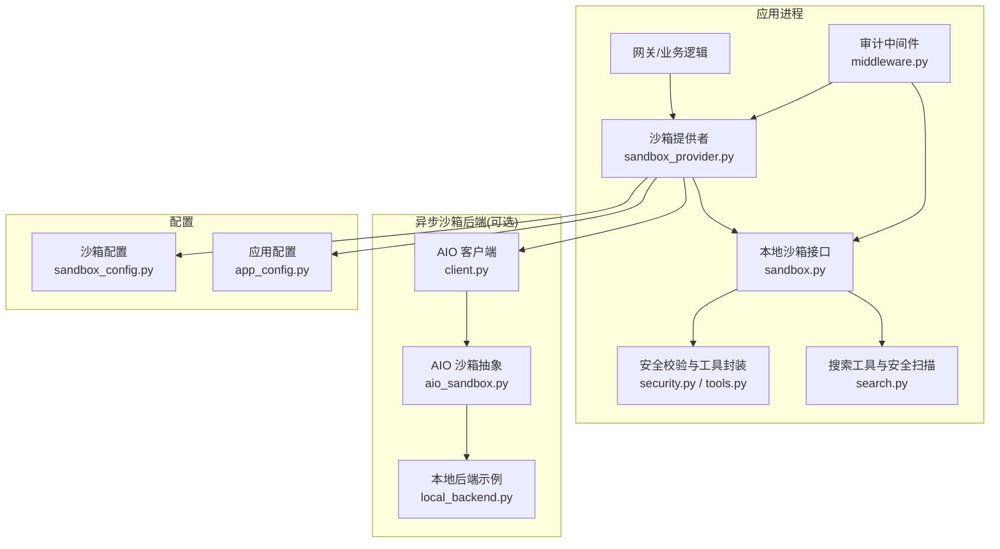
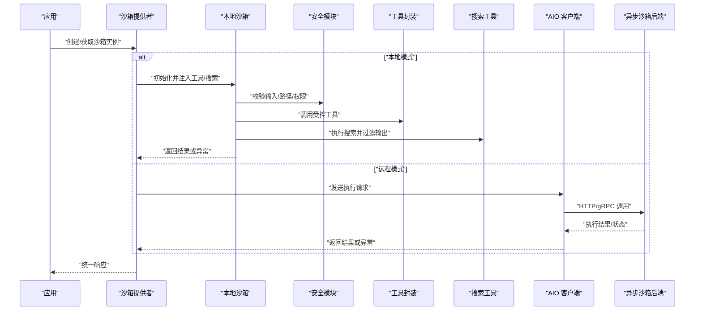
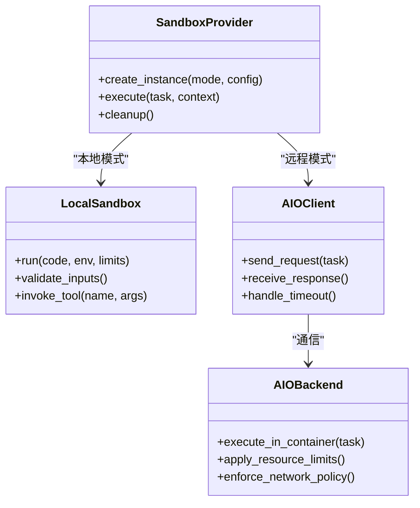
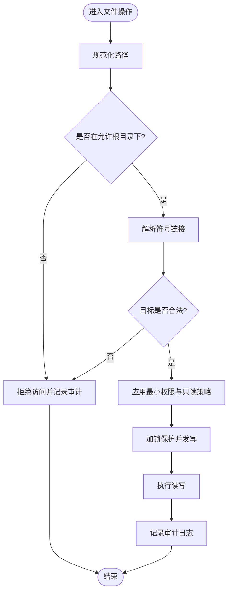
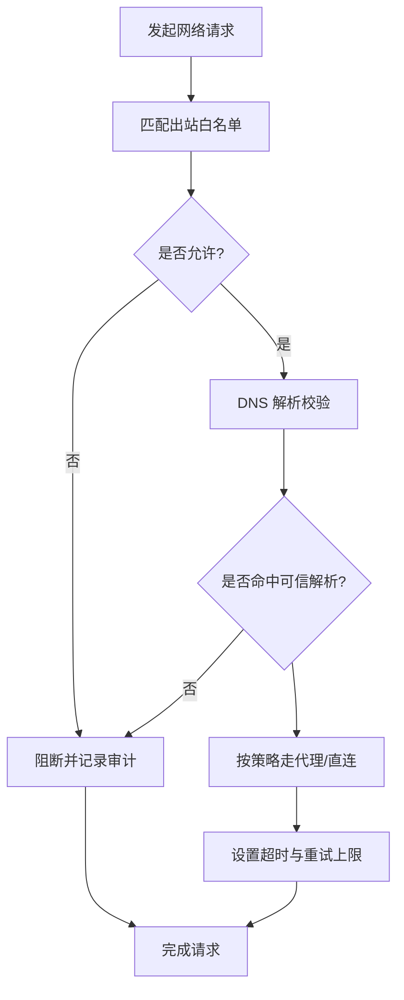
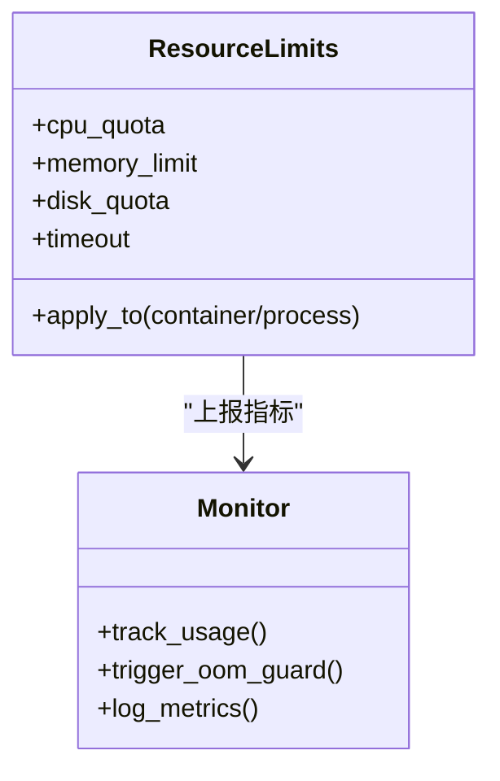
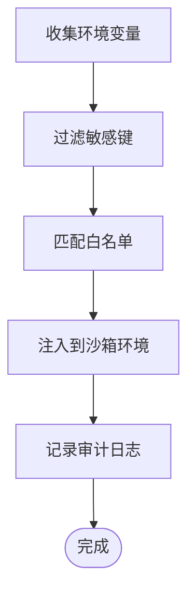
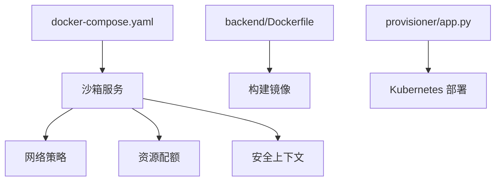
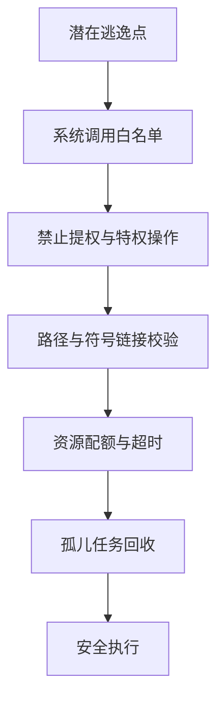
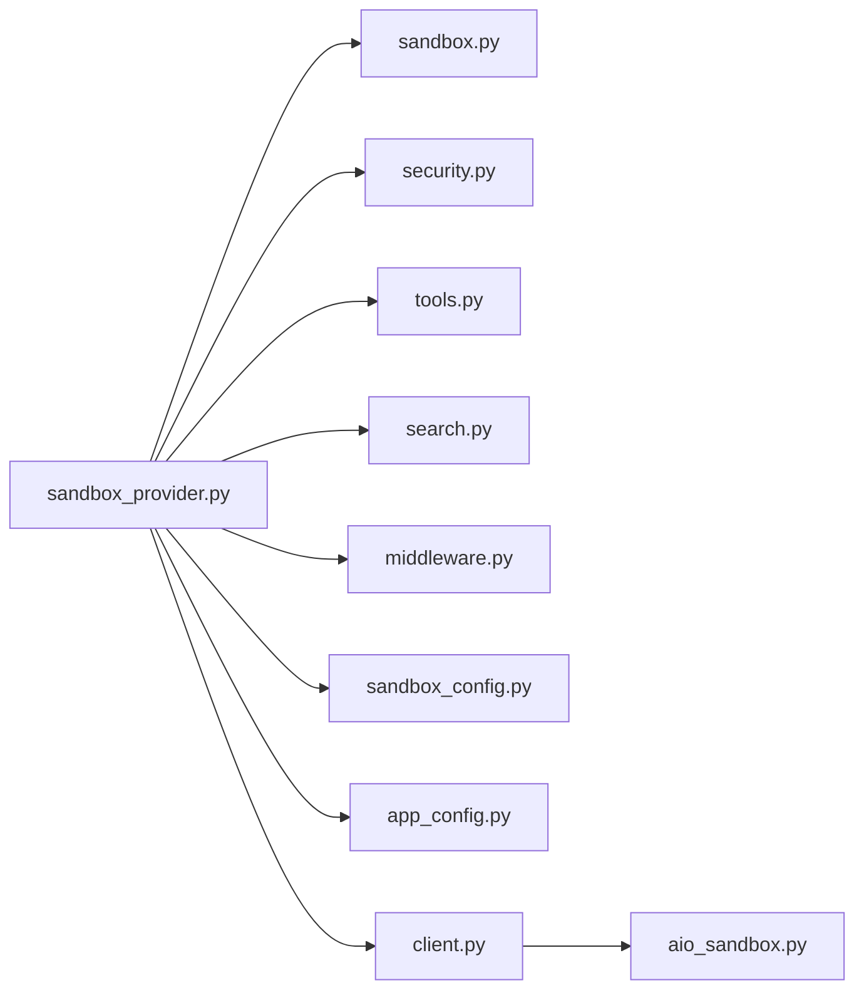

# 沙箱安全模型

<cite>
**本文引用的文件**   
- [sandbox.py](file://backend/packages/harness/deerflow/sandbox/sandbox.py)
- [sandbox_provider.py](file://backend/packages/harness/deerflow/sandbox/sandbox_provider.py)
- [security.py](file://backend/packages/harness/deerflow/sandbox/security.py)
- [middleware.py](file://backend/packages/harness/deerflow/sandbox/middleware.py)
- [tools.py](file://backend/packages/harness/deerflow/sandbox/tools.py)
- [search.py](file://backend/packages/harness/deerflow/sandbox/search.py)
- [exceptions.py](file://backend/packages/harness/deerflow/sandbox/exceptions.py)
- [__init__.py](file://backend/packages/harness/deerflow/sandbox/__init__.py)
- [local_backend.py](file://backend/packages/harness/deerflow/community/aio_sandbox/local_backend.py)
- [client.py](file://backend/packages/harness/deerflow/community/aio_sandbox/client.py)
- [aio_sandbox.py](file://backend/packages/harness/deerflow/community/aio_sandbox/aio_sandbox.py)
- [sandbox_config.py](file://backend/packages/harness/deerflow/config/sandbox_config.py)
- [app_config.py](file://backend/packages/harness/deerflow/config/app_config.py)
- [docker-compose.yaml](file://docker/docker-compose.yaml)
- [Dockerfile](file://backend/Dockerfile)
- [provisioner app.py](file://docker/provisioner/app.py)
- [test_aio_sandbox.py](file://backend/tests/test_aio_sandbox.py)
- [test_aio_sandbox_local_backend.py](file://backend/tests/test_aio_sandbox_local_backend.py)
- [test_aio_sandbox_provider.py](file://backend/tests/test_aio_sandbox_provider.py)
- [test_docker_sandbox_mode_detection.py](file://backend/tests/test_docker_sandbox_mode_detection.py)
- [test_sandbox_tools_security.py](file://backend/tests/test_sandbox_tools_security.py)
- [test_sandbox_search_tools.py](file://backend/tests/test_sandbox_search_tools.py)
- [test_sandbox_audit_middleware.py](file://backend/tests/test_sandbox_audit_middleware.py)
- [test_sandbox_orphan_reconciliation.py](file://backend/tests/test_sandbox_orphan_reconciliation.py)
- [test_sandbox_orphan_reconciliation_e2e.py](file://backend/tests/test_sandbox_orphan_reconciliation_e2e.py)
</cite>

## 目录
1. [简介](#简介)
2. [项目结构](#项目结构)
3. [核心组件](#核心组件)
4. [架构总览](#架构总览)
5. [详细组件分析](#详细组件分析)
6. [依赖关系分析](#依赖关系分析)
7. [性能考虑](#性能考虑)
8. [故障排查指南](#故障排查指南)
9. [结论](#结论)
10. [附录](#附录)

## 简介
本文件系统化阐述 DeerFlow 的沙箱安全模型，覆盖进程隔离、文件系统隔离、网络访问控制、资源限制策略、环境变量安全、容器化安全配置以及逃逸与资源耗尽防护。文档面向不同技术背景的读者，既提供高层概览，也给出代码级映射与可视化图示，帮助理解与落地部署。

## 项目结构
DeerFlow 的沙箱能力由“本地执行器 + 可选远程异步沙箱后端”组成：
- 本地执行器：在宿主进程内以受限方式运行用户代码（通过工具层与中间件进行约束）。
- 异步沙箱后端：基于 aio_sandbox 的独立服务，支持 Docker/Kubernetes 等运行时，实现更强的进程与系统调用隔离。
- 配置层：集中管理沙箱行为、网络白名单、DNS 策略、资源配额等。
- 测试套件：覆盖模式检测、工具安全、搜索工具、审计中间件、孤儿任务清理等关键场景。

图表来源
- [sandbox_provider.py:1-200](file://backend/packages/harness/deerflow/sandbox/sandbox_provider.py#L1-L200)
- [sandbox.py:1-200](file://backend/packages/harness/deerflow/sandbox/sandbox.py#L1-L200)
- [security.py:1-200](file://backend/packages/harness/deerflow/sandbox/security.py#L1-L200)
- [tools.py:1-200](file://backend/packages/harness/deerflow/sandbox/tools.py#L1-L200)
- [search.py:1-200](file://backend/packages/harness/deerflow/sandbox/search.py#L1-L200)
- [middleware.py:1-200](file://backend/packages/harness/deerflow/sandbox/middleware.py#L1-L200)
- [client.py:1-200](file://backend/packages/harness/deerflow/community/aio_sandbox/client.py#L1-L200)
- [aio_sandbox.py:1-200](file://backend/packages/harness/deerflow/community/aio_sandbox/aio_sandbox.py#L1-L200)
- [local_backend.py:1-200](file://backend/packages/harness/deerflow/community/aio_sandbox/local_backend.py#L1-L200)
- [sandbox_config.py:1-200](file://backend/packages/harness/deerflow/config/sandbox_config.py#L1-L200)
- [app_config.py:1-200](file://backend/packages/harness/deerflow/config/app_config.py#L1-L200)

章节来源
- [sandbox_provider.py:1-200](file://backend/packages/harness/deerflow/sandbox/sandbox_provider.py#L1-L200)
- [sandbox.py:1-200](file://backend/packages/harness/deerflow/sandbox/sandbox.py#L1-L200)
- [security.py:1-200](file://backend/packages/harness/deerflow/sandbox/security.py#L1-L200)
- [tools.py:1-200](file://backend/packages/harness/deerflow/sandbox/tools.py#L1-L200)
- [search.py:1-200](file://backend/packages/harness/deerflow/sandbox/search.py#L1-L200)
- [middleware.py:1-200](file://backend/packages/harness/deerflow/sandbox/middleware.py#L1-L200)
- [client.py:1-200](file://backend/packages/harness/deerflow/community/aio_sandbox/client.py#L1-L200)
- [aio_sandbox.py:1-200](file://backend/packages/harness/deerflow/community/aio_sandbox/aio_sandbox.py#L1-L200)
- [local_backend.py:1-200](file://backend/packages/harness/deerflow/community/aio_sandbox/local_backend.py#L1-L200)
- [sandbox_config.py:1-200](file://backend/packages/harness/deerflow/config/sandbox_config.py#L1-L200)
- [app_config.py:1-200](file://backend/packages/harness/deerflow/config/app_config.py#L1-L200)

## 核心组件
- 沙箱提供者（sandbox_provider）：统一调度本地与远程沙箱实例，负责生命周期管理与上下文注入。
- 本地沙箱（sandbox）：定义本地执行边界、工具集、搜索能力与安全校验入口。
- 安全模块（security）：路径遍历防护、符号链接检测、权限控制、输入校验等通用安全函数。
- 工具封装（tools）：对危险系统调用进行白名单化封装，限制可访问的系统资源。
- 搜索工具（search）：对外部搜索能力的受控封装，包含输出过滤与速率限制。
- 审计中间件（middleware）：记录沙箱调用、资源使用与异常事件，便于追踪与告警。
- 异步沙箱后端（aio_sandbox）：抽象出跨运行时的沙箱协议，提供 Docker/K8s 等后端适配。
- 配置（sandbox_config/app_config）：集中管理网络白名单、DNS 策略、资源配额、超时与日志级别。

章节来源
- [sandbox_provider.py:1-200](file://backend/packages/harness/deerflow/sandbox/sandbox_provider.py#L1-L200)
- [sandbox.py:1-200](file://backend/packages/harness/deerflow/sandbox/sandbox.py#L1-L200)
- [security.py:1-200](file://backend/packages/harness/deerflow/sandbox/security.py#L1-L200)
- [tools.py:1-200](file://backend/packages/harness/deerflow/sandbox/tools.py#L1-L200)
- [search.py:1-200](file://backend/packages/harness/deerflow/sandbox/search.py#L1-L200)
- [middleware.py:1-200](file://backend/packages/harness/deerflow/sandbox/middleware.py#L1-L200)
- [client.py:1-200](file://backend/packages/harness/deerflow/community/aio_sandbox/client.py#L1-L200)
- [aio_sandbox.py:1-200](file://backend/packages/harness/deerflow/community/aio_sandbox/aio_sandbox.py#L1-L200)
- [sandbox_config.py:1-200](file://backend/packages/harness/deerflow/config/sandbox_config.py#L1-L200)
- [app_config.py:1-200](file://backend/packages/harness/deerflow/config/app_config.py#L1-L200)

## 架构总览
下图展示从业务请求到沙箱执行的端到端流程，包括本地与远程两种路径。

图表来源
- [sandbox_provider.py:1-200](file://backend/packages/harness/deerflow/sandbox/sandbox_provider.py#L1-L200)
- [sandbox.py:1-200](file://backend/packages/harness/deerflow/sandbox/sandbox.py#L1-L200)
- [security.py:1-200](file://backend/packages/harness/deerflow/sandbox/security.py#L1-L200)
- [tools.py:1-200](file://backend/packages/harness/deerflow/sandbox/tools.py#L1-L200)
- [search.py:1-200](file://backend/packages/harness/deerflow/sandbox/search.py#L1-L200)
- [client.py:1-200](file://backend/packages/harness/deerflow/community/aio_sandbox/client.py#L1-L200)
- [aio_sandbox.py:1-200](file://backend/packages/harness/deerflow/community/aio_sandbox/aio_sandbox.py#L1-L200)

## 详细组件分析

### 进程隔离与执行环境
- 本地执行：通过工具白名单与中间件拦截，限制可直接使用的系统能力；适合开发调试与轻量任务。
- 远程执行：借助异步沙箱后端，可在容器或 Kubernetes Pod 中运行，具备更强的进程与系统调用隔离。
- 模式切换：由沙箱提供者根据配置选择本地或远程后端，并在失败时回退或上报错误。

图表来源
- [sandbox_provider.py:1-200](file://backend/packages/harness/deerflow/sandbox/sandbox_provider.py#L1-L200)
- [sandbox.py:1-200](file://backend/packages/harness/deerflow/sandbox/sandbox.py#L1-L200)
- [client.py:1-200](file://backend/packages/harness/deerflow/community/aio_sandbox/client.py#L1-L200)
- [aio_sandbox.py:1-200](file://backend/packages/harness/deerflow/community/aio_sandbox/aio_sandbox.py#L1-L200)

章节来源
- [sandbox_provider.py:1-200](file://backend/packages/harness/deerflow/sandbox/sandbox_provider.py#L1-L200)
- [sandbox.py:1-200](file://backend/packages/harness/deerflow/sandbox/sandbox.py#L1-L200)
- [client.py:1-200](file://backend/packages/harness/deerflow/community/aio_sandbox/client.py#L1-L200)
- [aio_sandbox.py:1-200](file://backend/packages/harness/deerflow/community/aio_sandbox/aio_sandbox.py#L1-L200)

### 文件系统隔离与安全
- 路径遍历防护：对所有文件路径进行规范化与白名单校验，拒绝越权访问。
- 符号链接检测：解析并检查符号链接目标，防止绕过目录限制。
- 权限控制：最小权限原则，仅暴露必要目录与只读挂载。
- 操作锁：并发写入时使用文件级锁，避免竞态条件导致的安全问题。

图表来源
- [security.py:1-200](file://backend/packages/harness/deerflow/sandbox/security.py#L1-L200)
- [tools.py:1-200](file://backend/packages/harness/deerflow/sandbox/tools.py#L1-L200)
- [sandbox.py:1-200](file://backend/packages/harness/deerflow/sandbox/sandbox.py#L1-L200)

章节来源
- [security.py:1-200](file://backend/packages/harness/deerflow/sandbox/security.py#L1-L200)
- [tools.py:1-200](file://backend/packages/harness/deerflow/sandbox/tools.py#L1-L200)
- [sandbox.py:1-200](file://backend/packages/harness/deerflow/sandbox/sandbox.py#L1-L200)

### 网络访问控制
- 出站连接白名单：仅允许访问配置的域名/IP段，其他请求被拒绝。
- DNS 解析限制：强制使用内部或可信 DNS，禁止解析任意外部地址。
- 代理配置：支持透明代理或出口代理，统一审计与限流。
- 超时与重试：为所有出站请求设置严格超时与有限重试，防止资源耗尽。

图表来源
- [sandbox_config.py:1-200](file://backend/packages/harness/deerflow/config/sandbox_config.py#L1-L200)
- [aio_sandbox.py:1-200](file://backend/packages/harness/deerflow/community/aio_sandbox/aio_sandbox.py#L1-L200)
- [client.py:1-200](file://backend/packages/harness/deerflow/community/aio_sandbox/client.py#L1-L200)

章节来源
- [sandbox_config.py:1-200](file://backend/packages/harness/deerflow/config/sandbox_config.py#L1-L200)
- [aio_sandbox.py:1-200](file://backend/packages/harness/deerflow/community/aio_sandbox/aio_sandbox.py#L1-L200)
- [client.py:1-200](file://backend/packages/harness/deerflow/community/aio_sandbox/client.py#L1-L200)

### 资源限制策略
- CPU 时间片：通过容器或进程组限制 CPU 份额与上限，防止单任务独占。
- 内存使用限制：设定最大内存阈值，触发 OOM 保护或优雅降级。
- 磁盘空间配额：限制工作目录大小与临时文件数量，避免磁盘打满。
- 超时与取消：全局与任务级超时，结合中间件监控与自动回收。

图表来源
- [sandbox_config.py:1-200](file://backend/packages/harness/deerflow/config/sandbox_config.py#L1-L200)
- [aio_sandbox.py:1-200](file://backend/packages/harness/deerflow/community/aio_sandbox/aio_sandbox.py#L1-L200)

章节来源
- [sandbox_config.py:1-200](file://backend/packages/harness/deerflow/config/sandbox_config.py#L1-L200)
- [aio_sandbox.py:1-200](file://backend/packages/harness/deerflow/community/aio_sandbox/aio_sandbox.py#L1-L200)

### 环境变量安全
- 敏感信息过滤：启动前剔除密钥、令牌等敏感变量，仅保留白名单。
- 环境变量白名单：明确允许注入的变量集合，默认拒绝未知变量。
- 动态注入：按需注入任务相关变量，避免持久化泄露。
- 审计与脱敏：记录注入动作与变量名（不含值），便于追溯。

图表来源
- [sandbox_config.py:1-200](file://backend/packages/harness/deerflow/config/sandbox_config.py#L1-L200)
- [app_config.py:1-200](file://backend/packages/harness/deerflow/config/app_config.py#L1-L200)

章节来源
- [sandbox_config.py:1-200](file://backend/packages/harness/deerflow/config/sandbox_config.py#L1-L200)
- [app_config.py:1-200](file://backend/packages/harness/deerflow/config/app_config.py#L1-L200)

### 容器化沙箱安全配置
- Docker 安全选项：禁用特权、只读根文件系统、最小镜像、非 root 用户、限制端口与卷挂载。
- Kubernetes 安全上下文：设置 runAsNonRoot、readOnlyRootFilesystem、allowPrivilegeEscalation=false、资源配额与网络策略。
- 编排与模板：通过 docker-compose 与 provisioner 脚本统一管理沙箱实例与资源。

图表来源
- [docker-compose.yaml:1-200](file://docker/docker-compose.yaml#L1-L200)
- [Dockerfile:1-200](file://backend/Dockerfile#L1-L200)
- [provisioner app.py:1-200](file://docker/provisioner/app.py#L1-L200)

章节来源
- [docker-compose.yaml:1-200](file://docker/docker-compose.yaml#L1-L200)
- [Dockerfile:1-200](file://backend/Dockerfile#L1-L200)
- [provisioner app.py:1-200](file://docker/provisioner/app.py#L1-L200)

### 沙箱逃逸防护与资源耗尽防范
- 逃逸防护：
  - 系统调用白名单与 seccomp 策略（在容器后端启用）。
  - 禁止加载内核模块与提升权限。
  - 严格的路径与符号链接校验，防止越权访问。
- 资源耗尽防范：
  - 严格的 CPU/内存/磁盘配额与超时。
  - 并发限制与队列背压，避免雪崩。
  - 孤儿任务检测与自动回收。

图表来源
- [security.py:1-200](file://backend/packages/harness/deerflow/sandbox/security.py#L1-L200)
- [sandbox.py:1-200](file://backend/packages/harness/deerflow/sandbox/sandbox.py#L1-L200)
- [sandbox_config.py:1-200](file://backend/packages/harness/deerflow/config/sandbox_config.py#L1-L200)

章节来源
- [security.py:1-200](file://backend/packages/harness/deerflow/sandbox/security.py#L1-L200)
- [sandbox.py:1-200](file://backend/packages/harness/deerflow/sandbox/sandbox.py#L1-L200)
- [sandbox_config.py:1-200](file://backend/packages/harness/deerflow/config/sandbox_config.py#L1-L200)

## 依赖关系分析
- 模块耦合：
  - sandbox_provider 作为入口，依赖 sandbox、security、tools、search 与 middleware。
  - aio_sandbox 通过 client 与后端通信，依赖 sandbox_config 与 app_config。
- 外部依赖：
  - Docker/Kubernetes 运行时用于强隔离。
  - 网络策略与 DNS 由平台侧保障。
- 循环依赖：
  - 当前设计无直接循环导入，职责清晰分层。

图表来源
- [sandbox_provider.py:1-200](file://backend/packages/harness/deerflow/sandbox/sandbox_provider.py#L1-L200)
- [sandbox.py:1-200](file://backend/packages/harness/deerflow/sandbox/sandbox.py#L1-L200)
- [security.py:1-200](file://backend/packages/harness/deerflow/sandbox/security.py#L1-L200)
- [tools.py:1-200](file://backend/packages/harness/deerflow/sandbox/tools.py#L1-L200)
- [search.py:1-200](file://backend/packages/harness/deerflow/sandbox/search.py#L1-L200)
- [middleware.py:1-200](file://backend/packages/harness/deerflow/sandbox/middleware.py#L1-L200)
- [client.py:1-200](file://backend/packages/harness/deerflow/community/aio_sandbox/client.py#L1-L200)
- [aio_sandbox.py:1-200](file://backend/packages/harness/deerflow/community/aio_sandbox/aio_sandbox.py#L1-L200)
- [sandbox_config.py:1-200](file://backend/packages/harness/deerflow/config/sandbox_config.py#L1-L200)
- [app_config.py:1-200](file://backend/packages/harness/deerflow/config/app_config.py#L1-L200)

章节来源
- [sandbox_provider.py:1-200](file://backend/packages/harness/deerflow/sandbox/sandbox_provider.py#L1-L200)
- [sandbox.py:1-200](file://backend/packages/harness/deerflow/sandbox/sandbox.py#L1-L200)
- [security.py:1-200](file://backend/packages/harness/deerflow/sandbox/security.py#L1-L200)
- [tools.py:1-200](file://backend/packages/harness/deerflow/sandbox/tools.py#L1-L200)
- [search.py:1-200](file://backend/packages/harness/deerflow/sandbox/search.py#L1-L200)
- [middleware.py:1-200](file://backend/packages/harness/deerflow/sandbox/middleware.py#L1-L200)
- [client.py:1-200](file://backend/packages/harness/deerflow/community/aio_sandbox/client.py#L1-L200)
- [aio_sandbox.py:1-200](file://backend/packages/harness/deerflow/community/aio_sandbox/aio_sandbox.py#L1-L200)
- [sandbox_config.py:1-200](file://backend/packages/harness/deerflow/config/sandbox_config.py#L1-L200)
- [app_config.py:1-200](file://backend/packages/harness/deerflow/config/app_config.py#L1-L200)

## 性能考虑
- 合理设置超时与重试，避免长尾请求拖垮系统。
- 使用只读镜像与最小化依赖，缩短启动时间。
- 对高频工具调用引入缓存与批处理。
- 监控 CPU/内存/磁盘指标，设置告警阈值与自动扩容。
- 在本地模式下谨慎开启重型功能，优先使用远程沙箱进行重负载任务。

[本节为通用指导，无需特定文件引用]

## 故障排查指南
- 模式检测与回退：
  - 验证是否成功识别 Docker/K8s 模式，必要时回退到本地模式。
  - 参考测试用例定位模式判断逻辑与异常分支。
- 工具安全与搜索工具：
  - 检查工具白名单与搜索输出过滤是否生效。
  - 关注审计日志中的拒绝与异常记录。
- 审计与孤儿任务：
  - 确认审计中间件正常记录调用与资源使用。
  - 检查孤儿任务回收机制是否按时清理未完成任务。
- 本地后端与客户端：
  - 验证本地后端连通性与错误码映射。
  - 检查客户端超时与重试策略是否符合预期。

章节来源
- [test_docker_sandbox_mode_detection.py:1-200](file://backend/tests/test_docker_sandbox_mode_detection.py#L1-L200)
- [test_sandbox_tools_security.py:1-200](file://backend/tests/test_sandbox_tools_security.py#L1-L200)
- [test_sandbox_search_tools.py:1-200](file://backend/tests/test_sandbox_search_tools.py#L1-L200)
- [test_sandbox_audit_middleware.py:1-200](file://backend/tests/test_sandbox_audit_middleware.py#L1-L200)
- [test_sandbox_orphan_reconciliation.py:1-200](file://backend/tests/test_sandbox_orphan_reconciliation.py#L1-L200)
- [test_sandbox_orphan_reconciliation_e2e.py:1-200](file://backend/tests/test_sandbox_orphan_reconciliation_e2e.py#L1-L200)
- [test_aio_sandbox_local_backend.py:1-200](file://backend/tests/test_aio_sandbox_local_backend.py#L1-L200)
- [test_aio_sandbox.py:1-200](file://backend/tests/test_aio_sandbox.py#L1-L200)
- [test_aio_sandbox_provider.py:1-200](file://backend/tests/test_aio_sandbox_provider.py#L1-L200)

## 结论
DeerFlow 的沙箱安全模型通过“本地受限执行 + 远程强隔离后端”的双轨方案，结合严格的文件系统、网络与环境变量策略，以及完善的审计与资源治理，有效降低恶意代码与资源滥用风险。生产环境建议优先采用容器化后端，并配合平台级网络策略与资源配额，形成纵深防御体系。

[本节为总结性内容，无需特定文件引用]

## 附录
- 配置项建议：
  - 网络白名单：仅开放必要域名/IP段。
  - DNS：使用企业可信解析服务。
  - 资源配额：依据任务规模设定 CPU/内存/磁盘上限。
  - 超时：全局与任务级双重超时。
- 最佳实践：
  - 最小权限与只读文件系统。
  - 非 root 用户运行。
  - 定期更新镜像与依赖。
  - 全链路审计与告警。

[本节为补充说明，无需特定文件引用]