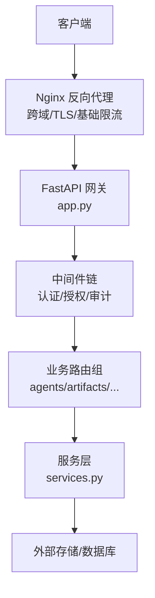
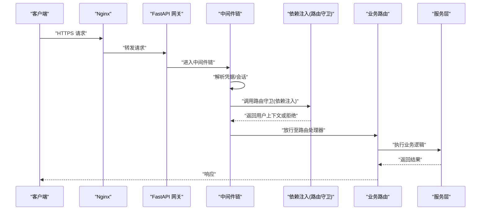
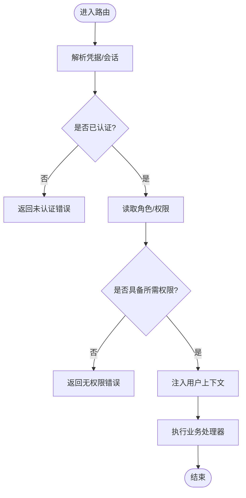
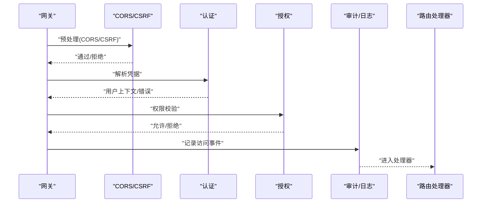
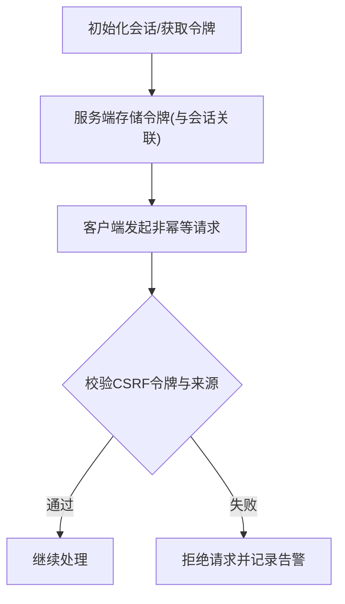
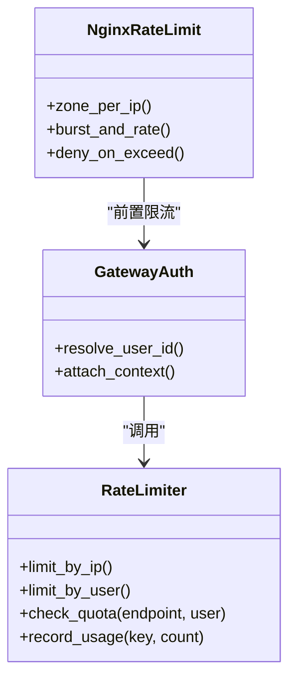
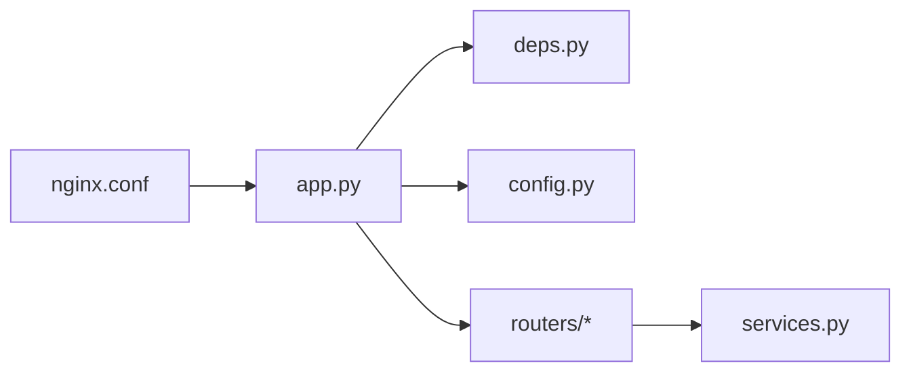

# API访问控制

<cite>
**本文引用的文件**   
- [backend/app/gateway/app.py](file://backend/app/gateway/app.py)
- [backend/app/gateway/config.py](file://backend/app/gateway/config.py)
- [backend/app/gateway/deps.py](file://backend/app/gateway/deps.py)
- [backend/app/gateway/services.py](file://backend/app/gateway/services.py)
- [backend/app/gateway/routers/agents.py](file://backend/app/gateway/routers/agents.py)
- [backend/app/gateway/routers/artifacts.py](file://backend/app/gateway/routers/artifacts.py)
- [backend/app/gateway/routers/channels.py](file://backend/app/gateway/routers/channels.py)
- [backend/app/gateway/routers/memory.py](file://backend/app/gateway/routers/memory.py)
- [backend/app/gateway/routers/models.py](file://backend/app/gateway/routers/models.py)
- [backend/app/gateway/routers/runs.py](file://backend/app/gateway/routers/runs.py)
- [backend/app/gateway/routers/skills.py](file://backend/app/gateway/routers/skills.py)
- [backend/app/gateway/routers/suggestions.py](file://backend/app/gateway/routers/suggestions.py)
- [backend/app/gateway/routers/thread_runs.py](file://backend/app/gateway/routers/thread_runs.py)
- [backend/app/gateway/routers/threads.py](file://backend/app/gateway/routers/threads.py)
- [backend/app/gateway/routers/uploads.py](file://backend/app/gateway/routers/uploads.py)
- [backend/app/gateway/routers/mcp.py](file://backend/app/gateway/routers/mcp.py)
- [backend/app/gateway/routers/assistants_compat.py](file://backend/app/gateway/routers/assistants_compat.py)
- [backend/docs/middleware-execution-flow.md](file://backend/docs/middleware-execution-flow.md)
- [docker/nginx/nginx.conf](file://docker/nginx/nginx.conf)
- [docker/nginx/nginx.local.conf](file://docker/nginx/nginx.local.conf)
</cite>

## 目录
1. [简介](#简介)
2. [项目结构](#项目结构)
3. [核心组件](#核心组件)
4. [架构总览](#架构总览)
5. [详细组件分析](#详细组件分析)
6. [依赖关系分析](#依赖关系分析)
7. [性能考虑](#性能考虑)
8. [故障排查指南](#故障排查指南)
9. [结论](#结论)
10. [附录](#附录)

## 简介
本文件聚焦 DeerFlow 后端的 API 访问控制，围绕以下目标展开：
- 路由级权限控制：说明如何在 FastAPI 路由层实现鉴权与授权（注解/装饰器模式）。
- 中间件鉴权机制：解释请求拦截、身份验证与权限检查的执行顺序。
- CSRF 防护：说明令牌生成、校验与跨域请求处理策略。
- 限流与速率限制：提供 IP 级别与用户级别的访问控制思路与落地建议。
- 安全配置示例与测试方法：给出可操作的配置项与测试用例设计要点。
- 常见漏洞防护与最佳实践：总结关键风险点与缓解措施。

## 项目结构
DeerFlow 后端采用 FastAPI 网关（Gateway）组织 API 路由，并通过中间件与依赖注入实现统一的鉴权与授权能力。Nginx 作为反向代理，承担跨域、TLS 终止与基础限流等职责。

图示来源
- [backend/app/gateway/app.py](file://backend/app/gateway/app.py)
- [backend/app/gateway/services.py](file://backend/app/gateway/services.py)
- [docker/nginx/nginx.conf](file://docker/nginx/nginx.conf)

章节来源
- [backend/app/gateway/app.py](file://backend/app/gateway/app.py)
- [backend/app/gateway/config.py](file://backend/app/gateway/config.py)
- [backend/app/gateway/deps.py](file://backend/app/gateway/deps.py)
- [backend/app/gateway/services.py](file://backend/app/gateway/services.py)
- [docker/nginx/nginx.conf](file://docker/nginx/nginx.conf)

## 核心组件
- 网关应用与中间件注册：在网关入口集中注册全局中间件，统一执行认证、授权、审计与错误处理。
- 依赖注入与路由守卫：通过 FastAPI 的依赖注入机制实现“类装饰器”的路由守卫，按路由粒度控制访问。
- 服务层抽象：将鉴权上下文、资源访问逻辑下沉到服务层，便于复用与测试。
- 配置中心：集中管理鉴权开关、白名单、CSRF 策略、限流参数等。

章节来源
- [backend/app/gateway/app.py](file://backend/app/gateway/app.py)
- [backend/app/gateway/deps.py](file://backend/app/gateway/deps.py)
- [backend/app/gateway/config.py](file://backend/app/gateway/config.py)
- [backend/app/gateway/services.py](file://backend/app/gateway/services.py)

## 架构总览
下图展示从客户端到业务路由的完整访问链路，以及各阶段的安全控制点。

图示来源
- [backend/app/gateway/app.py](file://backend/app/gateway/app.py)
- [backend/app/gateway/deps.py](file://backend/app/gateway/deps.py)
- [backend/app/gateway/services.py](file://backend/app/gateway/services.py)

## 详细组件分析

### 路由级权限控制（注解/装饰器模式）
- 使用 FastAPI 依赖注入实现“路由守卫”，以函数式装饰器形式挂载到具体路由，完成细粒度权限判定。
- 典型流程：
  - 从请求头/会话中解析用户身份与角色。
  - 根据路由标签或资源标识进行授权判断。
  - 失败时返回标准错误码；成功时将用户上下文注入后续依赖。
- 适用场景：
  - 对敏感路由（如模型管理、上传、线程/运行管理等）启用强鉴权。
  - 对只读接口启用弱鉴权或仅基于角色的最小权限。

章节来源
- [backend/app/gateway/deps.py](file://backend/app/gateway/deps.py)
- [backend/app/gateway/routers/agents.py](file://backend/app/gateway/routers/agents.py)
- [backend/app/gateway/routers/artifacts.py](file://backend/app/gateway/routers/artifacts.py)
- [backend/app/gateway/routers/channels.py](file://backend/app/gateway/routers/channels.py)
- [backend/app/gateway/routers/memory.py](file://backend/app/gateway/routers/memory.py)
- [backend/app/gateway/routers/models.py](file://backend/app/gateway/routers/models.py)
- [backend/app/gateway/routers/runs.py](file://backend/app/gateway/routers/runs.py)
- [backend/app/gateway/routers/skills.py](file://backend/app/gateway/routers/skills.py)
- [backend/app/gateway/routers/suggestions.py](file://backend/app/gateway/routers/suggestions.py)
- [backend/app/gateway/routers/thread_runs.py](file://backend/app/gateway/routers/thread_runs.py)
- [backend/app/gateway/routers/threads.py](file://backend/app/gateway/routers/threads.py)
- [backend/app/gateway/routers/uploads.py](file://backend/app/gateway/routers/uploads.py)
- [backend/app/gateway/routers/mcp.py](file://backend/app/gateway/routers/mcp.py)
- [backend/app/gateway/routers/assistants_compat.py](file://backend/app/gateway/routers/assistants_compat.py)

### 中间件鉴权机制（执行顺序）
- 中间件链顺序决定安全策略生效时机，通常遵循：
  - 请求拦截与标准化（CORS、CSRF、内容类型校验）
  - 身份验证（解析 Token/Session/JWT）
  - 权限检查（基于角色/资源的授权）
  - 审计与追踪（记录访问日志、埋点）
- 建议在网关入口集中注册中间件，确保所有路由均受保护，同时为公开端点提供豁免列表。

章节来源
- [backend/app/gateway/app.py](file://backend/app/gateway/app.py)
- [backend/docs/middleware-execution-flow.md](file://backend/docs/middleware-execution-flow.md)

### CSRF 防护措施
- 令牌生成：服务端在建立会话或首次访问时下发 CSRF 令牌，并绑定会话状态。
- 令牌验证：对非幂等请求（POST/PUT/DELETE/PATCH）强制校验 CSRF 令牌与来源站点。
- 跨域处理：严格限定允许的 Origin、方法与头部；必要时启用 SameSite Cookie 策略。
- 前端配合：在表单或 AJAX 请求中携带 CSRF 令牌，避免通过 URL 传递敏感信息。

章节来源
- [backend/app/gateway/app.py](file://backend/app/gateway/app.py)
- [backend/app/gateway/config.py](file://backend/app/gateway/config.py)
- [docker/nginx/nginx.conf](file://docker/nginx/nginx.conf)

### 限流与速率限制（IP 与用户级别）
- IP 级别限流：在 Nginx 层基于源地址限制并发与请求频率，防止滥用与暴力破解。
- 用户级别限流：在网关或服务层基于用户标识（Token/Session）进行配额控制，支持分级策略（如按角色/套餐）。
- 策略维度：
  - 时间窗口（秒/分钟/小时）
  - 并发连接数
  - 资源权重（不同端点设置不同配额）
- 降级与熔断：当触发限流阈值时返回标准错误码，并记录审计日志以便溯源。

章节来源
- [docker/nginx/nginx.conf](file://docker/nginx/nginx.conf)
- [backend/app/gateway/app.py](file://backend/app/gateway/app.py)
- [backend/app/gateway/deps.py](file://backend/app/gateway/deps.py)

### API 安全配置示例
- 环境变量与配置项（建议）：
  - 认证开关、JWT 密钥、会话超时、CSRF 开关、允许的域名白名单、限流阈值、审计开关。
- 配置位置：
  - 网关配置与运行时环境变量统一管理，避免硬编码。
- 示例清单（概念性）：
  - CORS 允许来源与方法
  - CSRF 令牌有效期与同源策略
  - 限流窗口与突发阈值
  - 鉴权失败与无权限的错误码规范

章节来源
- [backend/app/gateway/config.py](file://backend/app/gateway/config.py)
- [backend/app/gateway/app.py](file://backend/app/gateway/app.py)

### 测试方法
- 单元测试：
  - 针对依赖注入的路由守卫编写断言，覆盖认证成功、失败、无权限分支。
  - 模拟中间件行为，验证执行顺序与异常传播。
- 集成测试：
  - 使用测试客户端构造带凭据的请求，端到端验证鉴权与授权路径。
  - 模拟限流触发，验证错误响应与审计日志。
- 安全测试：
  - CSRF 绕过尝试、重放攻击、越权访问、跨站脚本注入等用例。
  - 使用自动化扫描工具对开放端点进行基线检测。

章节来源
- [backend/app/gateway/deps.py](file://backend/app/gateway/deps.py)
- [backend/app/gateway/app.py](file://backend/app/gateway/app.py)

## 依赖关系分析
- 组件耦合：
  - 网关入口依赖中间件与依赖注入模块，形成松耦合的鉴权扩展点。
  - 路由层仅关注业务逻辑，通过依赖注入获取用户上下文与权限校验结果。
- 外部依赖：
  - Nginx 负责反向代理、跨域与基础限流。
  - 外部存储/数据库用于持久化会话、令牌与审计日志。

图示来源
- [backend/app/gateway/app.py](file://backend/app/gateway/app.py)
- [backend/app/gateway/deps.py](file://backend/app/gateway/deps.py)
- [backend/app/gateway/config.py](file://backend/app/gateway/config.py)
- [backend/app/gateway/services.py](file://backend/app/gateway/services.py)
- [docker/nginx/nginx.conf](file://docker/nginx/nginx.conf)

章节来源
- [backend/app/gateway/app.py](file://backend/app/gateway/app.py)
- [backend/app/gateway/deps.py](file://backend/app/gateway/deps.py)
- [backend/app/gateway/config.py](file://backend/app/gateway/config.py)
- [backend/app/gateway/services.py](file://backend/app/gateway/services.py)
- [docker/nginx/nginx.conf](file://docker/nginx/nginx.conf)

## 性能考虑
- 中间件链尽量轻量，避免阻塞型 I/O；将耗时操作异步化或下沉到后台任务。
- 限流策略优先在 Nginx 层实施，减少后端压力。
- 缓存热点鉴权结果（如角色/权限），注意失效策略与一致性。
- 合理设置超时与重试上限，避免雪崩效应。

## 故障排查指南
- 常见问题定位：
  - 401/403：检查认证中间件与路由守卫是否正确挂载，确认凭据格式与来源。
  - CSRF 失败：核对令牌是否随请求发送、同源策略与 Cookie 属性是否匹配。
  - 限流触发：查看 Nginx 与网关层的限流日志，确认阈值与窗口设置。
- 诊断手段：
  - 开启审计日志与追踪 ID，串联请求全链路。
  - 使用最小复现用例隔离问题范围。
  - 对比生产与开发环境配置差异。

章节来源
- [backend/app/gateway/app.py](file://backend/app/gateway/app.py)
- [backend/docs/middleware-execution-flow.md](file://backend/docs/middleware-execution-flow.md)

## 结论
通过网关中间件与依赖注入的路由守卫相结合，DeerFlow 实现了灵活且可扩展的 API 访问控制体系。结合 Nginx 的基础限流与 CSRF 防护，可在多层面构建纵深防御。建议在生产环境中持续完善审计与监控，定期开展安全测试与渗透评估，确保访问控制策略的有效性与健壮性。

## 附录
- 术语表：
  - 路由守卫：基于依赖注入实现的细粒度权限控制单元。
  - 中间件链：请求进入处理器前依次执行的横切逻辑集合。
  - CSRF：跨站请求伪造，需通过令牌与同源策略防护。
  - 限流：对请求频率与并发进行控制的策略。