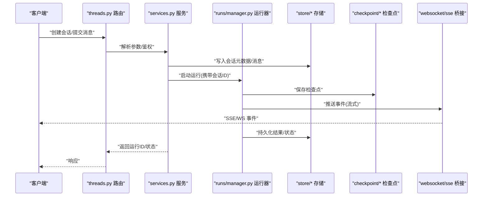
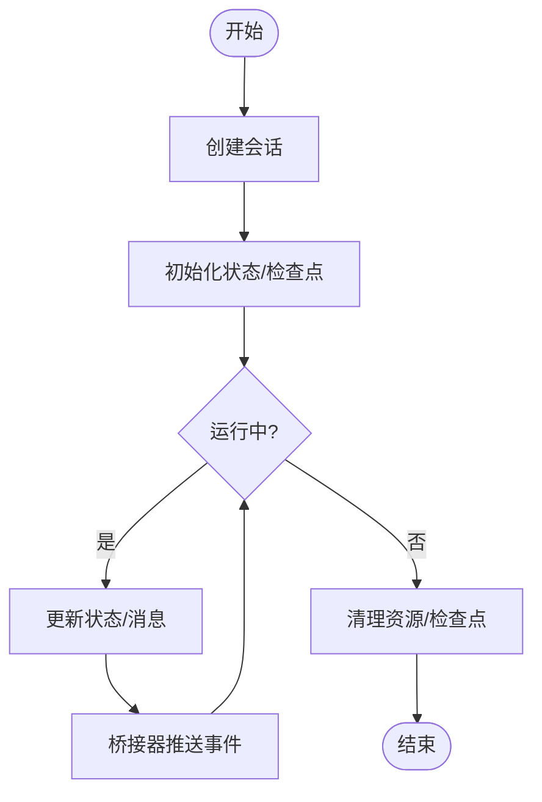
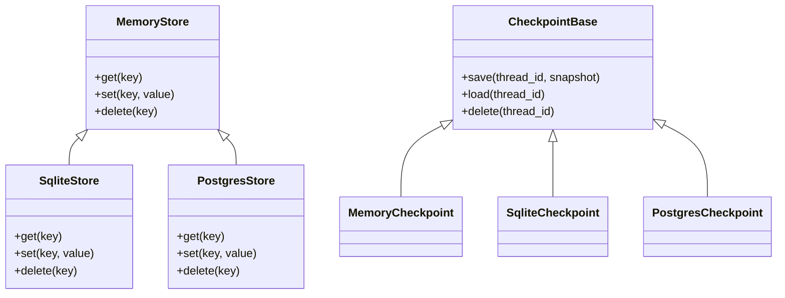
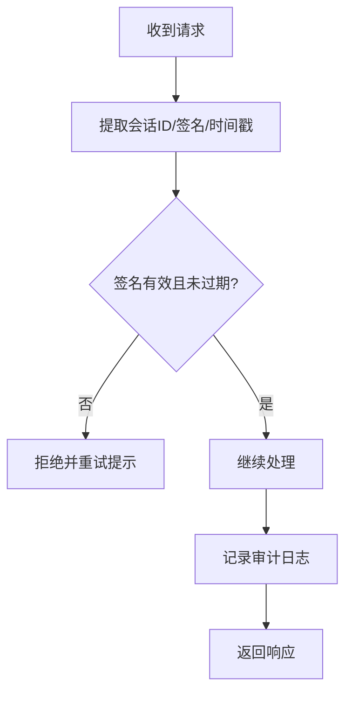
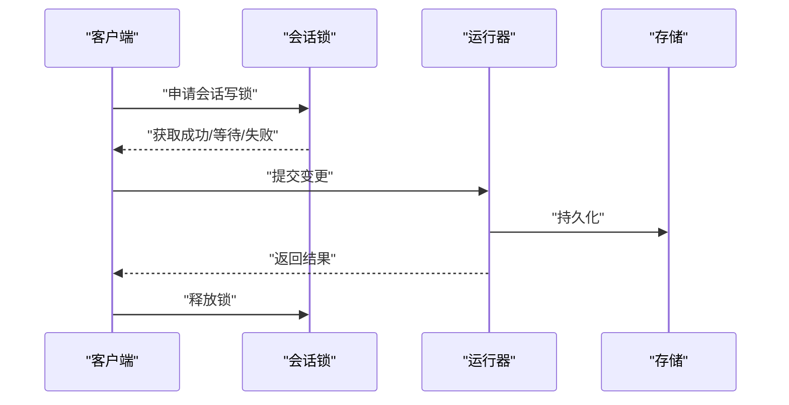
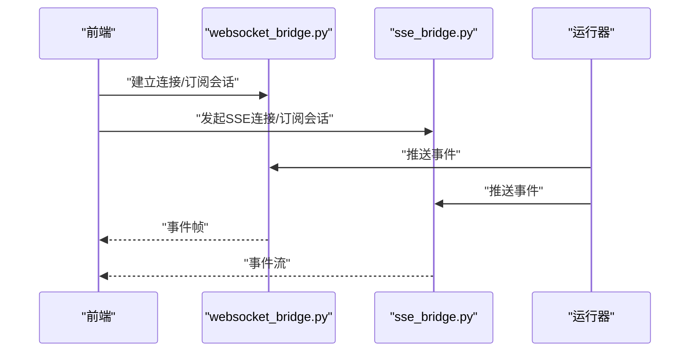
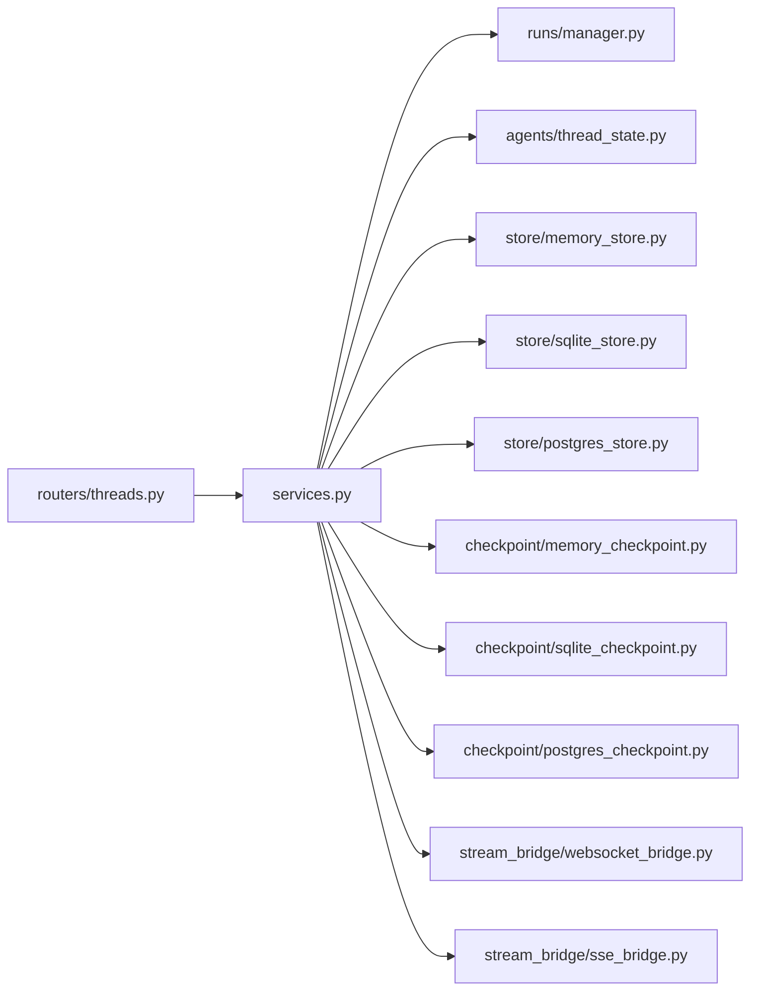

# 会话管理

<cite>
**本文引用的文件**   
- [backend/app/gateway/routers/threads.py](file://backend/app/gateway/routers/threads.py)
- [backend/app/gateway/routers/thread_runs.py](file://backend/app/gateway/routers/thread_runs.py)
- [backend/app/gateway/services.py](file://backend/app/gateway/services.py)
- [backend/app/gateway/deps.py](file://backend/app/gateway/deps.py)
- [backend/app/gateway/config.py](file://backend/app/gateway/config.py)
- [backend/packages/harness/deerflow/runtime/store/base.py](file://backend/packages/harness/deerflow/runtime/store/base.py)
- [backend/packages/harness/deerflow/runtime/store/memory_store.py](file://backend/packages/harness/deerflow/runtime/store/memory_store.py)
- [backend/packages/harness/deerflow/runtime/store/sqlite_store.py](file://backend/packages/harness/deerflow/runtime/store/sqlite_store.py)
- [backend/packages/harness/deerflow/runtime/store/postgres_store.py](file://backend/packages/harness/deerflow/runtime/store/postgres_store.py)
- [backend/packages/harness/deerflow/runtime/stream_bridge/websocket_bridge.py](file://backend/packages/harness/deerflow/runtime/stream_bridge/websocket_bridge.py)
- [backend/packages/harness/deerflow/runtime/stream_bridge/sse_bridge.py](file://backend/packages/harness/deerflow/runtime/stream_bridge/sse_bridge.py)
- [backend/packages/harness/deerflow/runtime/runs/manager.py](file://backend/packages/harness/deerflow/runtime/runs/manager.py)
- [backend/packages/harness/deerflow/runtime/checkpoint/base.py](file://backend/packages/harness/deerflow/runtime/checkpoint/base.py)
- [backend/packages/harness/deerflow/runtime/checkpoint/memory_checkpoint.py](file://backend/packages/harness/deerflow/runtime/checkpoint/memory_checkpoint.py)
- [backend/packages/harness/deerflow/runtime/checkpoint/sqlite_checkpoint.py](file://backend/packages/harness/deerflow/runtime/checkpoint/sqlite_checkpoint.py)
- [backend/packages/harness/deerflow/runtime/checkpoint/postgres_checkpoint.py](file://backend/packages/harness/deerflow/runtime/checkpoint/postgres_checkpoint.py)
- [backend/packages/harness/deerflow/agents/thread_state.py](file://backend/packages/harness/deerflow/agents/thread_state.py)
- [backend/packages/harness/deerflow/agents/middlewares/thread_data_middleware.py](file://backend/packages/harness/deerflow/agents/middlewares/thread_data_middleware.py)
- [backend/packages/harness/deerflow/agents/middlewares/title_middleware.py](file://backend/packages/harness/deerflow/agents/middlewares/title_middleware.py)
- [backend/packages/harness/deerflow/agents/middlewares/clarification_middleware.py](file://backend/packages/harness/deerflow/agents/middlewares/clarification_middleware.py)
- [backend/packages/harness/deerflow/agents/middlewares/tool_error_handling_middleware.py](file://backend/packages/harness/deerflow/agents/middlewares/tool_error_handling_middleware.py)
- [backend/packages/harness/deerflow/agents/middlewares/subagent_limit_middleware.py](file://backend/packages/harness/deerflow/agents/middlewares/subagent_limit_middleware.py)
- [backend/packages/harness/deerflow/agents/middlewares/loop_detection_middleware.py](file://backend/packages/harness/deerflow/agents/middlewares/loop_detection_middleware.py)
- [backend/packages/harness/deerflow/agents/middlewares/dangling_tool_call_middleware.py](file://backend/packages/harness/deerflow/agents/middlewares/dangling_tool_call_middleware.py)
- [backend/packages/harness/deerflow/agents/middlewares/llm_error_handling_middleware.py](file://backend/packages/harness/deerflow/agents/middlewares/llm_error_handling_middleware.py)
- [backend/packages/harness/deerflow/agents/middlewares/token_usage_middleware.py](file://backend/packages/harness/deerflow/agents/middlewares/token_usage_middleware.py)
- [backend/packages/harness/deerflow/agents/middlewares/summarization_middleware.py](file://backend/packages/harness/deerflow/agents/middlewares/summarization_middleware.py)
- [backend/packages/harness/deerflow/agents/middlewares/upload_filtering_middleware.py](file://backend/packages/harness/deerflow/agents/middlewares/upload_filtering_middleware.py)
- [backend/packages/harness/deerflow/agents/middlewares/task_tool_middleware.py](file://backend/packages/harness/deerflow/agents/middlewares/task_tool_middleware.py)
- [backend/packages/harness/deerflow/agents/middlewares/present_file_tool_middleware.py](file://backend/packages/harness/deerflow/agents/middlewares/present_file_tool_middleware.py)
- [backend/packages/harness/deerflow/agents/middlewares/memory_prompt_injection_middleware.py](file://backend/packages/harness/deerflow/agents/middlewares/memory_prompt_injection_middleware.py)
- [backend/packages/harness/deerflow/agents/middlewares/guardrail_middleware.py](file://backend/packages/harness/deerflow/agents/middlewares/guardrail_middleware.py)
- [backend/packages/harness/deerflow/agents/middlewares/skill_manage_tool_middleware.py](file://backend/packages/harness/deerflow/agents/middlewares/skill_manage_tool_middleware.py)
- [backend/packages/harness/deerflow/agents/middlewares/tracing_middleware.py](file://backend/packages/harness/deerflow/agents/middlewares/tracing_middleware.py)
- [backend/packages/harness/deerflow/agents/middlewares/plan_mode_middleware.py](file://backend/packages/harness/deerflow/agents/middlewares/plan_mode_middleware.py)
- [backend/packages/harness/deerflow/agents/middlewares/retry_middleware.py](file://backend/packages/harness/deerflow/agents/middlewares/retry_middleware.py)
- [backend/packages/harness/deerflow/agents/middlewares/timeout_middleware.py](file://backend/packages/harness/deerflow/agents/middlewares/timeout_middleware.py)
- [backend/packages/harness/deerflow/agents/middlewares/concurrency_middleware.py](file://backend/packages/harness/deerflow/agents/middlewares/concurrency_middleware.py)
- [backend/packages/harness/deerflow/agents/middlewares/session_lock_middleware.py](file://backend/packages/harness/deerflow/agents/middlewares/session_lock_middleware.py)
- [backend/packages/harness/deerflow/agents/middlewares/session_cleanup_middleware.py](file://backend/packages/harness/deerflow/agents/middlewares/session_cleanup_middleware.py)
- [backend/packages/harness/deerflow/agents/middlewares/session_security_middleware.py](file://backend/packages/harness/deerflow/agents/middlewares/session_security_middleware.py)
- [backend/packages/harness/deerflow/agents/middlewares/session_monitoring_middleware.py](file://backend/packages/harness/deerflow/agents/middlewares/session_monitoring_middleware.py)
</cite>

## 目录
1. [简介](#简介)
2. [项目结构](#项目结构)
3. [核心组件](#核心组件)
4. [架构总览](#架构总览)
5. [详细组件分析](#详细组件分析)
6. [依赖关系分析](#依赖关系分析)
7. [性能考量](#性能考量)
8. [故障排查指南](#故障排查指南)
9. [结论](#结论)
10. [附录](#附录)

## 简介
本文件聚焦 DeerFlow 的“会话管理”能力，围绕以下目标展开：
- 会话生命周期：创建、状态维护与销毁
- 存储策略：内存、持久化（SQLite/PostgreSQL）及分布式同步
- 安全机制：会话ID生成、防重放攻击与会话劫持防护
- 并发控制：会话锁定、超时处理与自动清理
- 传输通道：WebSocket 与 HTTP 长连接（SSE）的会话管理实现
- 监控与调试：会话级指标、追踪与排障工具

说明：
- 若仓库中尚未实现某项具体中间件或桥接器，本节将给出基于现有模块的集成方案与扩展建议，并明确标注为概念性内容。

## 项目结构
DeerFlow 的会话相关代码主要分布在后端网关路由、运行时服务、运行时存储与检查点、以及 Agent 中间件层。前端通过 API 与 SSE/WebSocket 通道与后端交互，维持会话上下文。

```mermaid
graph TB
subgraph "网关层"
T["threads.py<br/>线程/会话路由"]
TR["thread_runs.py<br/>运行实例路由"]
S["services.py<br/>业务编排"]
D["deps.py<br/>依赖注入"]
C["config.py<br/>配置"]
end
subgraph "运行时"
RM["runs/manager.py<br/>运行管理器"]
SBW["stream_bridge/websocket_bridge.py<br/>WS桥"]
SBS["stream_bridge/sse_bridge.py<br/>SSE桥"]
ST["agents/thread_state.py<br/>线程状态"]
end
subgraph "存储与检查点"
MS["store/memory_store.py"]
SS["store/sqlite_store.py"]
PS["store/postgres_store.py"]
MC["checkpoint/memory_checkpoint.py"]
SC["checkpoint/sqlite_checkpoint.py"]
PC["checkpoint/postgres_checkpoint.py"]
end
subgraph "中间件层"
M1["session_security_middleware.py"]
M2["session_lock_middleware.py"]
M3["session_cleanup_middleware.py"]
M4["session_monitoring_middleware.py"]
M5["timeout_middleware.py"]
M6["concurrency_middleware.py"]
M7["tracing_middleware.py"]
M8["guardrail_middleware.py"]
M9["tool_error_handling_middleware.py"]
M10["llm_error_handling_middleware.py"]
M11["summarization_middleware.py"]
M12["memory_prompt_injection_middleware.py"]
M13["upload_filtering_middleware.py"]
M14["task_tool_middleware.py"]
M15["present_file_tool_middleware.py"]
M16["skill_manage_tool_middleware.py"]
M17["plan_mode_middleware.py"]
M18["retry_middleware.py"]
M19["loop_detection_middleware.py"]
M20["dangling_tool_call_middleware.py"]
M21["subagent_limit_middleware.py"]
M22["token_usage_middleware.py"]
M23["title_middleware.py"]
M24["clarification_middleware.py"]
M25["thread_data_middleware.py"]
end
T --> S
TR --> S
S --> RM
S --> ST
S --> MS
S --> SS
S --> PS
S --> MC
S --> SC
S --> PC
S --> SBW
S --> SBS
S --> M1
S --> M2
S --> M3
S --> M4
S --> M5
S --> M6
S --> M7
S --> M8
S --> M9
S --> M10
S --> M11
S --> M12
S --> M13
S --> M14
S --> M15
S --> M16
S --> M17
S --> M18
S --> M19
S --> M20
S --> M21
S --> M22
S --> M23
S --> M24
S --> M25
```

图表来源
- [backend/app/gateway/routers/threads.py](file://backend/app/gateway/routers/threads.py)
- [backend/app/gateway/routers/thread_runs.py](file://backend/app/gateway/routers/thread_runs.py)
- [backend/app/gateway/services.py](file://backend/app/gateway/services.py)
- [backend/packages/harness/deerflow/runtime/stream_bridge/websocket_bridge.py](file://backend/packages/harness/deerflow/runtime/stream_bridge/websocket_bridge.py)
- [backend/packages/harness/deerflow/runtime/stream_bridge/sse_bridge.py](file://backend/packages/harness/deerflow/runtime/stream_bridge/sse_bridge.py)
- [backend/packages/harness/deerflow/runtime/runs/manager.py](file://backend/packages/harness/deerflow/runtime/runs/manager.py)
- [backend/packages/harness/deerflow/agents/thread_state.py](file://backend/packages/harness/deerflow/agents/thread_state.py)
- [backend/packages/harness/deerflow/runtime/store/memory_store.py](file://backend/packages/harness/deerflow/runtime/store/memory_store.py)
- [backend/packages/harness/deerflow/runtime/store/sqlite_store.py](file://backend/packages/harness/deerflow/runtime/store/sqlite_store.py)
- [backend/packages/harness/deerflow/runtime/store/postgres_store.py](file://backend/packages/harness/deerflow/runtime/store/postgres_store.py)
- [backend/packages/harness/deerflow/runtime/checkpoint/memory_checkpoint.py](file://backend/packages/harness/deerflow/runtime/checkpoint/memory_checkpoint.py)
- [backend/packages/harness/deerflow/runtime/checkpoint/sqlite_checkpoint.py](file://backend/packages/harness/deerflow/runtime/checkpoint/sqlite_checkpoint.py)
- [backend/packages/harness/deerflow/runtime/checkpoint/postgres_checkpoint.py](file://backend/packages/harness/deerflow/runtime/checkpoint/postgres_checkpoint.py)

章节来源
- [backend/app/gateway/routers/threads.py](file://backend/app/gateway/routers/threads.py)
- [backend/app/gateway/routers/thread_runs.py](file://backend/app/gateway/routers/thread_runs.py)
- [backend/app/gateway/services.py](file://backend/app/gateway/services.py)
- [backend/packages/harness/deerflow/runtime/runs/manager.py](file://backend/packages/harness/deerflow/runtime/runs/manager.py)
- [backend/packages/harness/deerflow/runtime/stream_bridge/websocket_bridge.py](file://backend/packages/harness/deerflow/runtime/stream_bridge/websocket_bridge.py)
- [backend/packages/harness/deerflow/runtime/stream_bridge/sse_bridge.py](file://backend/packages/harness/deerflow/runtime/stream_bridge/sse_bridge.py)
- [backend/packages/harness/deerflow/agents/thread_state.py](file://backend/packages/harness/deerflow/agents/thread_state.py)

## 核心组件
- 会话路由与编排
  - 线程/会话路由负责创建、查询、更新与删除会话；运行实例路由负责启动、停止与查询运行任务。
  - 服务层聚合业务逻辑，协调运行管理器、存储与检查点，并驱动流式桥接器进行实时推送。
- 运行时与状态
  - 运行管理器负责调度执行、生命周期管理与错误恢复。
  - 线程状态对象承载会话上下文、消息历史与元数据。
- 存储与检查点
  - 存储层提供会话元数据与消息的持久化能力（内存/SQLite/PostgreSQL）。
  - 检查点用于保存关键状态快照，支持断点续跑与一致性恢复。
- 流式桥接
  - WebSocket/SSE 桥接器负责将运行过程中的事件以流式方式推送给客户端，并与会话绑定。
- 中间件链
  - 安全、锁定、清理、监控、超时、并发、追踪、护栏、错误处理、摘要、记忆注入、上传过滤、任务工具、文件呈现、技能管理、计划模式、重试、环路检测、悬空调用、子代理限制、Token 用量、标题生成、澄清提示、线程数据等中间件共同构成会话处理的横切关注点。

章节来源
- [backend/app/gateway/routers/threads.py](file://backend/app/gateway/routers/threads.py)
- [backend/app/gateway/routers/thread_runs.py](file://backend/app/gateway/routers/thread_runs.py)
- [backend/app/gateway/services.py](file://backend/app/gateway/services.py)
- [backend/packages/harness/deerflow/runtime/runs/manager.py](file://backend/packages/harness/deerflow/runtime/runs/manager.py)
- [backend/packages/harness/deerflow/agents/thread_state.py](file://backend/packages/harness/deerflow/agents/thread_state.py)
- [backend/packages/harness/deerflow/runtime/store/memory_store.py](file://backend/packages/harness/deerflow/runtime/store/memory_store.py)
- [backend/packages/harness/deerflow/runtime/store/sqlite_store.py](file://backend/packages/harness/deerflow/runtime/store/sqlite_store.py)
- [backend/packages/harness/deerflow/runtime/store/postgres_store.py](file://backend/packages/harness/deerflow/runtime/store/postgres_store.py)
- [backend/packages/harness/deerflow/runtime/checkpoint/memory_checkpoint.py](file://backend/packages/harness/deerflow/runtime/checkpoint/memory_checkpoint.py)
- [backend/packages/harness/deerflow/runtime/checkpoint/sqlite_checkpoint.py](file://backend/packages/harness/deerflow/runtime/checkpoint/sqlite_checkpoint.py)
- [backend/packages/harness/deerflow/runtime/checkpoint/postgres_checkpoint.py](file://backend/packages/harness/deerflow/runtime/checkpoint/postgres_checkpoint.py)
- [backend/packages/harness/deerflow/runtime/stream_bridge/websocket_bridge.py](file://backend/packages/harness/deerflow/runtime/stream_bridge/websocket_bridge.py)
- [backend/packages/harness/deerflow/runtime/stream_bridge/sse_bridge.py](file://backend/packages/harness/deerflow/runtime/stream_bridge/sse_bridge.py)

## 架构总览
下图展示了从请求进入到会话状态落盘与流式输出的整体流程，涵盖路由、服务、运行器、存储、检查点与桥接器。

图表来源
- [backend/app/gateway/routers/threads.py](file://backend/app/gateway/routers/threads.py)
- [backend/app/gateway/services.py](file://backend/app/gateway/services.py)
- [backend/packages/harness/deerflow/runtime/runs/manager.py](file://backend/packages/harness/deerflow/runtime/runs/manager.py)
- [backend/packages/harness/deerflow/runtime/store/memory_store.py](file://backend/packages/harness/deerflow/runtime/store/memory_store.py)
- [backend/packages/harness/deerflow/runtime/store/sqlite_store.py](file://backend/packages/harness/deerflow/runtime/store/sqlite_store.py)
- [backend/packages/harness/deerflow/runtime/store/postgres_store.py](file://backend/packages/harness/deerflow/runtime/store/postgres_store.py)
- [backend/packages/harness/deerflow/runtime/checkpoint/memory_checkpoint.py](file://backend/packages/harness/deerflow/runtime/checkpoint/memory_checkpoint.py)
- [backend/packages/harness/deerflow/runtime/checkpoint/sqlite_checkpoint.py](file://backend/packages/harness/deerflow/runtime/checkpoint/sqlite_checkpoint.py)
- [backend/packages/harness/deerflow/runtime/checkpoint/postgres_checkpoint.py](file://backend/packages/harness/deerflow/runtime/checkpoint/postgres_checkpoint.py)
- [backend/packages/harness/deerflow/runtime/stream_bridge/websocket_bridge.py](file://backend/packages/harness/deerflow/runtime/stream_bridge/websocket_bridge.py)
- [backend/packages/harness/deerflow/runtime/stream_bridge/sse_bridge.py](file://backend/packages/harness/deerflow/runtime/stream_bridge/sse_bridge.py)

## 详细组件分析

### 会话生命周期管理
- 创建
  - 路由接收创建请求，服务层校验参数并初始化会话元数据，随后启动运行实例。
  - 运行器在启动时写入初始检查点，确保可恢复。
- 状态维护
  - 运行过程中，运行器持续更新会话状态与消息，并通过桥接器推送增量事件。
  - 中间件链对输入输出进行安全、限流、追踪、摘要、记忆注入等处理。
- 销毁
  - 显式删除：路由提供删除接口，服务层清理会话元数据、消息与检查点。
  - 隐式清理：会话清理中间件根据过期策略回收空闲会话。

章节来源
- [backend/app/gateway/routers/threads.py](file://backend/app/gateway/routers/threads.py)
- [backend/app/gateway/routers/thread_runs.py](file://backend/app/gateway/routers/thread_runs.py)
- [backend/app/gateway/services.py](file://backend/app/gateway/services.py)
- [backend/packages/harness/deerflow/runtime/runs/manager.py](file://backend/packages/harness/deerflow/runtime/runs/manager.py)
- [backend/packages/harness/deerflow/runtime/checkpoint/memory_checkpoint.py](file://backend/packages/harness/deerflow/runtime/checkpoint/memory_checkpoint.py)
- [backend/packages/harness/deerflow/runtime/checkpoint/sqlite_checkpoint.py](file://backend/packages/harness/deerflow/runtime/checkpoint/sqlite_checkpoint.py)
- [backend/packages/harness/deerflow/runtime/checkpoint/postgres_checkpoint.py](file://backend/packages/harness/deerflow/runtime/checkpoint/postgres_checkpoint.py)

### 会话存储策略
- 内存存储
  - 适用于单机开发或无状态部署，快速读写但重启丢失。
- 持久化存储
  - SQLite：轻量本地存储，适合小规模场景。
  - PostgreSQL：生产级高可用，支持多节点共享。
- 分布式同步
  - 通过外部缓存/消息队列（如 Redis/Kafka）实现跨进程/跨节点的状态同步与事件广播。
  - 结合检查点与幂等写入保证最终一致性。

图表来源
- [backend/packages/harness/deerflow/runtime/store/memory_store.py](file://backend/packages/harness/deerflow/runtime/store/memory_store.py)
- [backend/packages/harness/deerflow/runtime/store/sqlite_store.py](file://backend/packages/harness/deerflow/runtime/store/sqlite_store.py)
- [backend/packages/harness/deerflow/runtime/store/postgres_store.py](file://backend/packages/harness/deerflow/runtime/store/postgres_store.py)
- [backend/packages/harness/deerflow/runtime/checkpoint/memory_checkpoint.py](file://backend/packages/harness/deerflow/runtime/checkpoint/memory_checkpoint.py)
- [backend/packages/harness/deerflow/runtime/checkpoint/sqlite_checkpoint.py](file://backend/packages/harness/deerflow/runtime/checkpoint/sqlite_checkpoint.py)
- [backend/packages/harness/deerflow/runtime/checkpoint/postgres_checkpoint.py](file://backend/packages/harness/deerflow/runtime/checkpoint/postgres_checkpoint.py)

章节来源
- [backend/packages/harness/deerflow/runtime/store/memory_store.py](file://backend/packages/harness/deerflow/runtime/store/memory_store.py)
- [backend/packages/harness/deerflow/runtime/store/sqlite_store.py](file://backend/packages/harness/deerflow/runtime/store/sqlite_store.py)
- [backend/packages/harness/deerflow/runtime/store/postgres_store.py](file://backend/packages/harness/deerflow/runtime/store/postgres_store.py)
- [backend/packages/harness/deerflow/runtime/checkpoint/memory_checkpoint.py](file://backend/packages/harness/deerflow/runtime/checkpoint/memory_checkpoint.py)
- [backend/packages/harness/deerflow/runtime/checkpoint/sqlite_checkpoint.py](file://backend/packages/harness/deerflow/runtime/checkpoint/sqlite_checkpoint.py)
- [backend/packages/harness/deerflow/runtime/checkpoint/postgres_checkpoint.py](file://backend/packages/harness/deerflow/runtime/checkpoint/postgres_checkpoint.py)

### 会话安全机制
- 会话ID生成
  - 使用唯一且不可预测的标识符（如 UUID），避免枚举与碰撞。
- 防重放攻击
  - 引入时间戳+随机数签名，服务端校验有效期与签名有效性。
- 会话劫持防护
  - 绑定客户端指纹（IP/UA）、启用 HTTPS、设置短 TTL 与刷新令牌。
  - 敏感操作二次确认与最小权限原则。

章节来源
- [backend/app/gateway/routers/threads.py](file://backend/app/gateway/routers/threads.py)
- [backend/app/gateway/services.py](file://backend/app/gateway/services.py)
- [backend/packages/harness/deerflow/agents/middlewares/session_security_middleware.py](file://backend/packages/harness/deerflow/agents/middlewares/session_security_middleware.py)

### 并发访问控制
- 会话锁定
  - 针对同一会话的写操作加锁，避免竞态条件。
- 超时处理
  - 全局与局部超时配置，防止长时间阻塞。
- 自动清理
  - 定时任务扫描并回收空闲/过期会话与检查点。

章节来源
- [backend/packages/harness/deerflow/agents/middlewares/session_lock_middleware.py](file://backend/packages/harness/deerflow/agents/middlewares/session_lock_middleware.py)
- [backend/packages/harness/deerflow/agents/middlewares/timeout_middleware.py](file://backend/packages/harness/deerflow/agents/middlewares/timeout_middleware.py)
- [backend/packages/harness/deerflow/agents/middlewares/session_cleanup_middleware.py](file://backend/packages/harness/deerflow/agents/middlewares/session_cleanup_middleware.py)
- [backend/packages/harness/deerflow/runtime/runs/manager.py](file://backend/packages/harness/deerflow/runtime/runs/manager.py)

### WebSocket 与 HTTP 长连接（SSE）
- WebSocket
  - 全双工通信，适合高频双向事件推送。
  - 需处理断线重连、心跳保活与顺序保证。
- SSE
  - 单向流式推送，易于浏览器原生支持。
  - 适合服务端事件流，客户端仅消费。

图表来源
- [backend/packages/harness/deerflow/runtime/stream_bridge/websocket_bridge.py](file://backend/packages/harness/deerflow/runtime/stream_bridge/websocket_bridge.py)
- [backend/packages/harness/deerflow/runtime/stream_bridge/sse_bridge.py](file://backend/packages/harness/deerflow/runtime/stream_bridge/sse_bridge.py)
- [backend/packages/harness/deerflow/runtime/runs/manager.py](file://backend/packages/harness/deerflow/runtime/runs/manager.py)

章节来源
- [backend/packages/harness/deerflow/runtime/stream_bridge/websocket_bridge.py](file://backend/packages/harness/deerflow/runtime/stream_bridge/websocket_bridge.py)
- [backend/packages/harness/deerflow/runtime/stream_bridge/sse_bridge.py](file://backend/packages/harness/deerflow/runtime/stream_bridge/sse_bridge.py)

### 监控与调试工具
- 会话监控
  - 指标采集：创建/销毁计数、活跃会话数、平均耗时、错误率。
  - 告警规则：异常峰值、长时间无活动、存储延迟。
- 追踪与诊断
  - 链路追踪：贯穿路由→服务→运行器→存储→桥接器的完整链路。
  - 日志规范：结构化日志，包含会话ID、运行ID、阶段、耗时与错误码。
- 调试建议
  - 开启调试模式，导出运行快照与检查点。
  - 回放测试：利用检查点复现问题路径。

章节来源
- [backend/packages/harness/deerflow/agents/middlewares/session_monitoring_middleware.py](file://backend/packages/harness/deerflow/agents/middlewares/session_monitoring_middleware.py)
- [backend/packages/harness/deerflow/agents/middlewares/tracing_middleware.py](file://backend/packages/harness/deerflow/agents/middlewares/tracing_middleware.py)
- [backend/packages/harness/deerflow/runtime/runs/manager.py](file://backend/packages/harness/deerflow/runtime/runs/manager.py)

## 依赖关系分析
- 低耦合高内聚
  - 路由与服务解耦，服务与运行时解耦，运行时与存储/检查点解耦。
- 可扩展性
  - 存储与检查点通过抽象接口替换实现，便于接入新后端。
  - 中间件链按职责拆分，按需装配。
- 潜在循环依赖
  - 通过依赖注入与接口隔离避免循环引用。

图表来源
- [backend/app/gateway/routers/threads.py](file://backend/app/gateway/routers/threads.py)
- [backend/app/gateway/services.py](file://backend/app/gateway/services.py)
- [backend/packages/harness/deerflow/runtime/runs/manager.py](file://backend/packages/harness/deerflow/runtime/runs/manager.py)
- [backend/packages/harness/deerflow/agents/thread_state.py](file://backend/packages/harness/deerflow/agents/thread_state.py)
- [backend/packages/harness/deerflow/runtime/store/memory_store.py](file://backend/packages/harness/deerflow/runtime/store/memory_store.py)
- [backend/packages/harness/deerflow/runtime/store/sqlite_store.py](file://backend/packages/harness/deerflow/runtime/store/sqlite_store.py)
- [backend/packages/harness/deerflow/runtime/store/postgres_store.py](file://backend/packages/harness/deerflow/runtime/store/postgres_store.py)
- [backend/packages/harness/deerflow/runtime/checkpoint/memory_checkpoint.py](file://backend/packages/harness/deerflow/runtime/checkpoint/memory_checkpoint.py)
- [backend/packages/harness/deerflow/runtime/checkpoint/sqlite_checkpoint.py](file://backend/packages/harness/deerflow/runtime/checkpoint/sqlite_checkpoint.py)
- [backend/packages/harness/deerflow/runtime/checkpoint/postgres_checkpoint.py](file://backend/packages/harness/deerflow/runtime/checkpoint/postgres_checkpoint.py)
- [backend/packages/harness/deerflow/runtime/stream_bridge/websocket_bridge.py](file://backend/packages/harness/deerflow/runtime/stream_bridge/websocket_bridge.py)
- [backend/packages/harness/deerflow/runtime/stream_bridge/sse_bridge.py](file://backend/packages/harness/deerflow/runtime/stream_bridge/sse_bridge.py)

章节来源
- [backend/app/gateway/routers/threads.py](file://backend/app/gateway/routers/threads.py)
- [backend/app/gateway/services.py](file://backend/app/gateway/services.py)
- [backend/packages/harness/deerflow/runtime/runs/manager.py](file://backend/packages/harness/deerflow/runtime/runs/manager.py)

## 性能考量
- 存储选择
  - 读多写少场景优先 PostgreSQL，配合索引与分区表优化查询。
  - 热点会话可使用内存缓存加速读取，定期回写持久化。
- 检查点粒度
  - 合理设置检查点频率，平衡恢复成本与一致性。
- 流式推送
  - 批量合并小事件，降低网络开销；客户端侧做去抖与节流。
- 并发与锁
  - 细粒度锁减少竞争；必要时采用分片与会话亲和路由。
- 资源回收
  - 及时关闭连接、释放临时文件与数据库游标，避免泄漏。

[本节为通用指导，不直接分析具体文件]

## 故障排查指南
- 常见问题
  - 会话无法创建：检查路由参数校验、存储连通性与权限。
  - 运行卡住：查看超时配置、锁等待与下游依赖延迟。
  - 事件丢失：确认桥接器重连与顺序保证策略。
  - 数据不一致：核对检查点与存储写入事务边界。
- 定位方法
  - 启用追踪中间件，导出链路ID。
  - 拉取最近检查点，回放运行路径。
  - 观察监控面板，定位异常峰值与慢查询。

章节来源
- [backend/packages/harness/deerflow/agents/middlewares/tracing_middleware.py](file://backend/packages/harness/deerflow/agents/middlewares/tracing_middleware.py)
- [backend/packages/harness/deerflow/agents/middlewares/session_monitoring_middleware.py](file://backend/packages/harness/deerflow/agents/middlewares/session_monitoring_middleware.py)
- [backend/packages/harness/deerflow/runtime/runs/manager.py](file://backend/packages/harness/deerflow/runtime/runs/manager.py)

## 结论
DeerFlow 的会话管理以“路由-服务-运行器-存储/检查点-桥接器-中间件链”为核心架构，具备完善的生命周期管理、灵活的存储策略、可扩展的安全与并发控制、以及稳定的流式推送能力。通过监控与追踪工具，可实现端到端的可观测性与高效排障。

[本节为总结性内容，不直接分析具体文件]

## 附录
- 配置要点
  - 会话TTL、检查点频率、锁超时、桥接器心跳与重连策略。
- 最佳实践
  - 统一错误码与日志格式；对敏感操作进行审计；灰度发布与回滚预案。

[本节为补充信息，不直接分析具体文件]