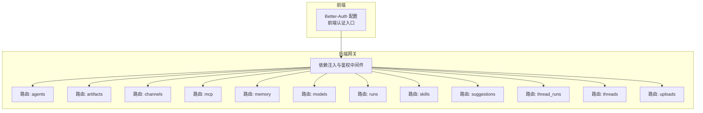
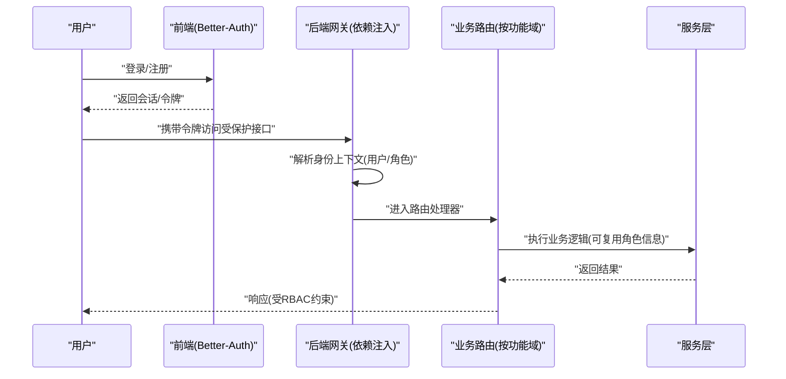
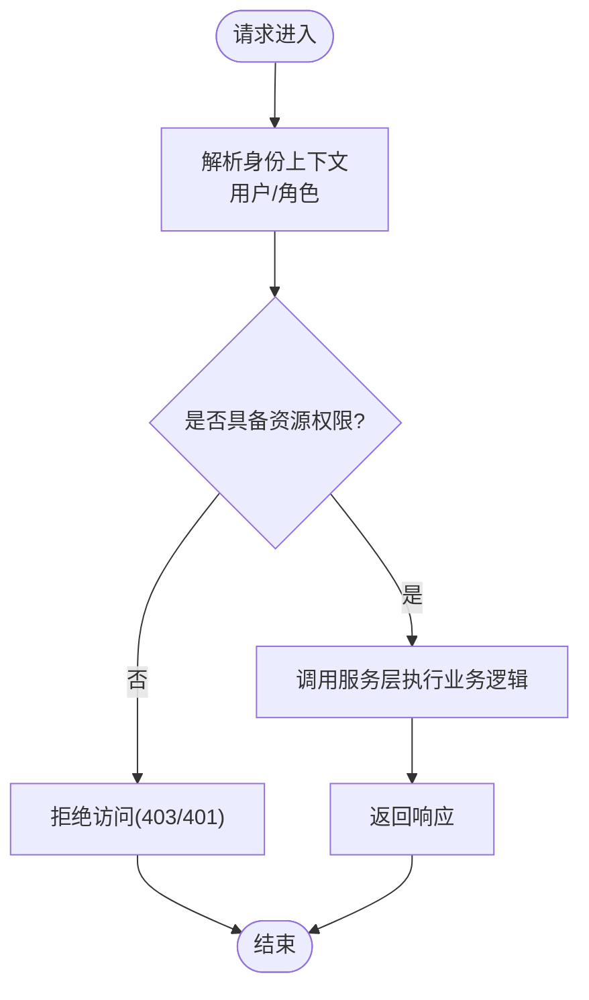
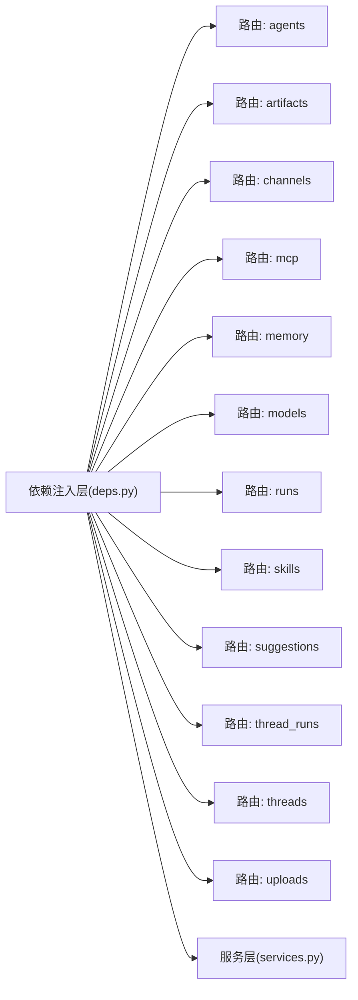

# 基于角色的访问控制(RBAC)

<cite>
**本文引用的文件**   
- [backend/app/gateway/routers/agents.py](file://backend/app/gateway/routers/agents.py)
- [backend/app/gateway/routers/artifacts.py](file://backend/app/gateway/routers/artifacts.py)
- [backend/app/gateway/routers/channels.py](file://backend/app/gateway/routers/channels.py)
- [backend/app/gateway/routers/mcp.py](file://backend/app/gateway/routers/mcp.py)
- [backend/app/gateway/routers/memory.py](file://backend/app/gateway/routers/memory.py)
- [backend/app/gateway/routers/models.py](file://backend/app/gateway/routers/models.py)
- [backend/app/gateway/routers/runs.py](file://backend/app/gateway/routers/runs.py)
- [backend/app/gateway/routers/skills.py](file://backend/app/gateway/routers/skills.py)
- [backend/app/gateway/routers/suggestions.py](file://backend/app/gateway/routers/suggestions.py)
- [backend/app/gateway/routers/thread_runs.py](file://backend/app/gateway/routers/thread_runs.py)
- [backend/app/gateway/routers/threads.py](file://backend/app/gateway/routers/threads.py)
- [backend/app/gateway/routers/uploads.py](file://backend/app/gateway/routers/uploads.py)
- [backend/app/gateway/deps.py](file://backend/app/gateway/deps.py)
- [backend/app/gateway/services.py](file://backend/app/gateway/services.py)
- [frontend/src/server/better-auth/config.ts](file://frontend/src/server/better-auth/config.ts)
- [frontend/src/server/better-auth/server.ts](file://frontend/src/server/better-auth/server.ts)
- [config.example.yaml](file://config.example.yaml)
</cite>

## 目录
1. [简介](#简介)
2. [项目结构](#项目结构)
3. [核心组件](#核心组件)
4. [架构总览](#架构总览)
5. [详细组件分析](#详细组件分析)
6. [依赖分析](#依赖分析)
7. [性能考虑](#性能考虑)
8. [故障排查指南](#故障排查指南)
9. [结论](#结论)
10. [附录](#附录)

## 简介
本文件面向 DeerFlow 的基于角色的访问控制（RBAC）模型，系统性阐述角色定义、权限分配策略、用户与角色关联管理、配置示例与最佳实践，以及角色层次结构与权限冲突解决策略。文档同时结合后端网关路由与前端的认证配置，给出端到端视角的 RBAC 落地建议与可操作指引。

## 项目结构
DeerFlow 采用前后端分离架构：
- 前端通过 Better-Auth 进行身份认证与会话管理，提供登录、注册、会话校验等能力。
- 后端以 FastAPI 网关为核心，按功能域划分路由模块（如 agents、artifacts、channels、memory、models、runs、skills、threads、uploads 等），并在依赖注入层集中处理鉴权逻辑。

图表来源
- [frontend/src/server/better-auth/config.ts](file://frontend/src/server/better-auth/config.ts)
- [frontend/src/server/better-auth/server.ts](file://frontend/src/server/better-auth/server.ts)
- [backend/app/gateway/deps.py](file://backend/app/gateway/deps.py)
- [backend/app/gateway/routers/agents.py](file://backend/app/gateway/routers/agents.py)
- [backend/app/gateway/routers/artifacts.py](file://backend/app/gateway/routers/artifacts.py)
- [backend/app/gateway/routers/channels.py](file://backend/app/gateway/routers/channels.py)
- [backend/app/gateway/routers/mcp.py](file://backend/app/gateway/routers/mcp.py)
- [backend/app/gateway/routers/memory.py](file://backend/app/gateway/routers/memory.py)
- [backend/app/gateway/routers/models.py](file://backend/app/gateway/routers/models.py)
- [backend/app/gateway/routers/runs.py](file://backend/app/gateway/routers/runs.py)
- [backend/app/gateway/routers/skills.py](file://backend/app/gateway/routers/skills.py)
- [backend/app/gateway/routers/suggestions.py](file://backend/app/gateway/routers/suggestions.py)
- [backend/app/gateway/routers/thread_runs.py](file://backend/app/gateway/routers/thread_runs.py)
- [backend/app/gateway/routers/threads.py](file://backend/app/gateway/routers/threads.py)
- [backend/app/gateway/routers/uploads.py](file://backend/app/gateway/routers/uploads.py)

章节来源
- [frontend/src/server/better-auth/config.ts](file://frontend/src/server/better-auth/config.ts)
- [frontend/src/server/better-auth/server.ts](file://frontend/src/server/better-auth/server.ts)
- [backend/app/gateway/deps.py](file://backend/app/gateway/deps.py)

## 核心组件
- 认证与身份上下文
  - 前端使用 Better-Auth 完成用户登录、会话管理与令牌传递。
  - 后端在依赖注入层解析请求中的身份上下文，为后续鉴权提供基础数据（如用户标识、角色集合等）。
- 路由级鉴权
  - 各业务路由模块通过依赖注入获取当前用户与角色信息，并据此执行资源访问控制。
- 服务层扩展点
  - 服务层可复用鉴权结果，实现更细粒度的权限判断（例如对特定资源的读写权限）。

章节来源
- [frontend/src/server/better-auth/config.ts](file://frontend/src/server/better-auth/config.ts)
- [frontend/src/server/better-auth/server.ts](file://frontend/src/server/better-auth/server.ts)
- [backend/app/gateway/deps.py](file://backend/app/gateway/deps.py)
- [backend/app/gateway/services.py](file://backend/app/gateway/services.py)

## 架构总览
下图展示了从前端认证到后端鉴权的端到端流程，以及 RBAC 在其中的作用位置。

图表来源
- [frontend/src/server/better-auth/config.ts](file://frontend/src/server/better-auth/config.ts)
- [frontend/src/server/better-auth/server.ts](file://frontend/src/server/better-auth/server.ts)
- [backend/app/gateway/deps.py](file://backend/app/gateway/deps.py)
- [backend/app/gateway/routers/agents.py](file://backend/app/gateway/routers/agents.py)
- [backend/app/gateway/routers/artifacts.py](file://backend/app/gateway/routers/artifacts.py)
- [backend/app/gateway/routers/channels.py](file://backend/app/gateway/routers/channels.py)
- [backend/app/gateway/routers/mcp.py](file://backend/app/gateway/routers/mcp.py)
- [backend/app/gateway/routers/memory.py](file://backend/app/gateway/routers/memory.py)
- [backend/app/gateway/routers/models.py](file://backend/app/gateway/routers/models.py)
- [backend/app/gateway/routers/runs.py](file://backend/app/gateway/routers/runs.py)
- [backend/app/gateway/routers/skills.py](file://backend/app/gateway/routers/skills.py)
- [backend/app/gateway/routers/suggestions.py](file://backend/app/gateway/routers/suggestions.py)
- [backend/app/gateway/routers/thread_runs.py](file://backend/app/gateway/routers/thread_runs.py)
- [backend/app/gateway/routers/threads.py](file://backend/app/gateway/routers/threads.py)
- [backend/app/gateway/routers/uploads.py](file://backend/app/gateway/routers/uploads.py)

## 详细组件分析

### 角色定义机制（内置角色与自定义角色）
- 设计要点
  - 内置角色：系统预置的角色集合，用于覆盖常见场景（如管理员、普通用户、只读访客等）。
  - 自定义角色：由管理员或授权主体创建，支持组合不同权限集以满足组织差异化需求。
- 角色属性建议
  - 唯一标识、名称、描述、状态（启用/禁用）、继承关系、创建与更新时间戳。
- 生命周期
  - 创建、编辑、删除、启用/禁用、批量导入导出。
- 与权限的关系
  - 角色作为权限容器，一个角色可包含多个权限；权限可被多个角色共享。

章节来源
- [backend/app/gateway/deps.py](file://backend/app/gateway/deps.py)
- [backend/app/gateway/services.py](file://backend/app/gateway/services.py)

### 权限分配策略（角色到权限映射与继承规则）
- 映射关系
  - 角色-权限多对多：每个角色可绑定多个权限，每个权限可被多个角色拥有。
- 继承规则
  - 支持层级化角色继承：子角色自动获得父角色的全部权限，便于构建“管理员 > 部门主管 > 成员”的层次结构。
- 显式拒绝优先
  - 当存在显式拒绝时，应优先于允许，避免权限提升漏洞。
- 最小权限原则
  - 默认拒绝，按需授予；仅授予完成任务所需的最小权限集合。

章节来源
- [backend/app/gateway/deps.py](file://backend/app/gateway/deps.py)
- [backend/app/gateway/services.py](file://backend/app/gateway/services.py)

### 用户与角色关联管理（动态分配与批量操作）
- 动态分配
  - 运行时根据上下文（如租户、项目、任务）动态计算用户有效角色集合，减少静态配置的维护成本。
- 批量操作
  - 支持批量为用户分配/移除角色，或批量更新角色权限，提高运维效率。
- 审计与追溯
  - 记录角色变更事件（谁、何时、对谁、变更内容），便于合规审计与问题回溯。

章节来源
- [backend/app/gateway/deps.py](file://backend/app/gateway/deps.py)
- [backend/app/gateway/services.py](file://backend/app/gateway/services.py)

### 路由级鉴权与资源访问控制
- 统一鉴权入口
  - 所有受保护接口均经过依赖注入层解析身份上下文，再进入具体路由处理器。
- 资源维度控制
  - 针对资源类型（如代理、工件、通道、记忆、模型、运行、技能、建议、线程、上传等）分别实施访问控制。
- 典型流程
  - 请求到达网关 -> 解析用户与角色 -> 检查资源权限 -> 调用服务层执行业务逻辑 -> 返回响应。

图表来源
- [backend/app/gateway/deps.py](file://backend/app/gateway/deps.py)
- [backend/app/gateway/routers/agents.py](file://backend/app/gateway/routers/agents.py)
- [backend/app/gateway/routers/artifacts.py](file://backend/app/gateway/routers/artifacts.py)
- [backend/app/gateway/routers/channels.py](file://backend/app/gateway/routers/channels.py)
- [backend/app/gateway/routers/mcp.py](file://backend/app/gateway/routers/mcp.py)
- [backend/app/gateway/routers/memory.py](file://backend/app/gateway/routers/memory.py)
- [backend/app/gateway/routers/models.py](file://backend/app/gateway/routers/models.py)
- [backend/app/gateway/routers/runs.py](file://backend/app/gateway/routers/runs.py)
- [backend/app/gateway/routers/skills.py](file://backend/app/gateway/routers/skills.py)
- [backend/app/gateway/routers/suggestions.py](file://backend/app/gateway/routers/suggestions.py)
- [backend/app/gateway/routers/thread_runs.py](file://backend/app/gateway/routers/thread_runs.py)
- [backend/app/gateway/routers/threads.py](file://backend/app/gateway/routers/threads.py)
- [backend/app/gateway/routers/uploads.py](file://backend/app/gateway/routers/uploads.py)

### 前端认证集成（Better-Auth）
- 职责边界
  - 负责用户登录、注册、会话管理、令牌刷新等。
- 与后端的协作
  - 前端在后续请求中携带认证凭据，后端依赖注入层负责解析并转换为内部身份上下文。
- 安全建议
  - 合理设置令牌有效期与刷新策略；敏感操作需二次确认或附加风险校验。

章节来源
- [frontend/src/server/better-auth/config.ts](file://frontend/src/server/better-auth/config.ts)
- [frontend/src/server/better-auth/server.ts](file://frontend/src/server/better-auth/server.ts)

### 配置与示例（RBAC 相关）
- 配置文件
  - 可在应用配置文件中定义 RBAC 相关开关、默认角色、全局策略等。
- 示例要点
  - 定义内置角色及其初始权限。
  - 指定角色继承树。
  - 配置默认拒绝策略与显式拒绝优先级。
  - 开启审计日志与关键操作告警。

章节来源
- [config.example.yaml](file://config.example.yaml)

## 依赖分析
- 组件耦合
  - 依赖注入层与各路由模块强耦合，确保统一的鉴权入口与一致的错误处理。
  - 服务层弱耦合于路由层，便于复用鉴权结果与扩展权限策略。
- 外部依赖
  - 前端依赖 Better-Auth 完成认证；后端依赖框架提供的依赖注入与中间件机制。
- 潜在循环依赖
  - 路由与服务层应保持单向依赖（路由 -> 服务），避免反向引用造成循环。

图表来源
- [backend/app/gateway/deps.py](file://backend/app/gateway/deps.py)
- [backend/app/gateway/services.py](file://backend/app/gateway/services.py)
- [backend/app/gateway/routers/agents.py](file://backend/app/gateway/routers/agents.py)
- [backend/app/gateway/routers/artifacts.py](file://backend/app/gateway/routers/artifacts.py)
- [backend/app/gateway/routers/channels.py](file://backend/app/gateway/routers/channels.py)
- [backend/app/gateway/routers/mcp.py](file://backend/app/gateway/routers/mcp.py)
- [backend/app/gateway/routers/memory.py](file://backend/app/gateway/routers/memory.py)
- [backend/app/gateway/routers/models.py](file://backend/app/gateway/routers/models.py)
- [backend/app/gateway/routers/runs.py](file://backend/app/gateway/routers/runs.py)
- [backend/app/gateway/routers/skills.py](file://backend/app/gateway/routers/skills.py)
- [backend/app/gateway/routers/suggestions.py](file://backend/app/gateway/routers/suggestions.py)
- [backend/app/gateway/routers/thread_runs.py](file://backend/app/gateway/routers/thread_runs.py)
- [backend/app/gateway/routers/threads.py](file://backend/app/gateway/routers/threads.py)
- [backend/app/gateway/routers/uploads.py](file://backend/app/gateway/routers/uploads.py)

章节来源
- [backend/app/gateway/deps.py](file://backend/app/gateway/deps.py)
- [backend/app/gateway/services.py](file://backend/app/gateway/services.py)

## 性能考虑
- 缓存角色与权限
  - 将用户角色与权限映射缓存至内存或分布式缓存，降低每次请求的查询开销。
- 延迟加载
  - 仅在需要时计算复杂继承链与动态角色，避免无谓的全量计算。
- 批量操作优化
  - 批量分配/移除角色时采用事务与批处理，减少数据库往返次数。
- 限流与熔断
  - 对高频鉴权路径实施限流，防止恶意探测与雪崩效应。

[本节为通用性能建议，不直接分析具体文件]

## 故障排查指南
- 常见问题
  - 未登录或令牌过期：检查前端会话与后端令牌解析链路。
  - 权限不足：核对用户角色集合、角色继承关系与资源权限映射。
  - 显式拒绝生效：确认是否存在显式拒绝策略覆盖了允许规则。
- 定位步骤
  - 查看请求的身份上下文是否正确注入。
  - 检查路由层的权限判定逻辑与服务层的资源级校验。
  - 审查审计日志，追踪最近的角色与权限变更。
- 恢复措施
  - 修正角色-权限映射或继承关系。
  - 调整显式拒绝策略范围，避免误伤正常访问。
  - 清理无效会话与过期令牌。

章节来源
- [backend/app/gateway/deps.py](file://backend/app/gateway/deps.py)
- [backend/app/gateway/services.py](file://backend/app/gateway/services.py)

## 结论
DeerFlow 的 RBAC 模型以依赖注入层为统一鉴权入口，结合前端 Better-Auth 完成身份认证，形成清晰的“认证-鉴权-授权”链路。通过内置与自定义角色、灵活的继承与显式拒绝策略、以及资源维度的细粒度控制，能够满足企业级多租户与多团队的复杂权限需求。建议在部署时遵循最小权限原则，完善审计与监控，持续优化性能与可观测性。

[本节为总结性内容，不直接分析具体文件]

## 附录
- 术语表
  - 角色：一组权限的集合，代表某类用户的访问能力。
  - 权限：对特定资源的操作许可（如读取、写入、删除）。
  - 继承：子角色自动获得父角色权限的机制。
  - 显式拒绝：明确禁止某操作的策略，优先级高于允许。
- 最佳实践清单
  - 默认拒绝，按需授予。
  - 使用显式拒绝处理高风险操作。
  - 定期审计角色与权限变更。
  - 对高敏资源实施额外校验（如二次确认、风控评分）。
  - 保持角色命名与权限命名规范，便于检索与维护。

[本节为概念性内容，不直接分析具体文件]