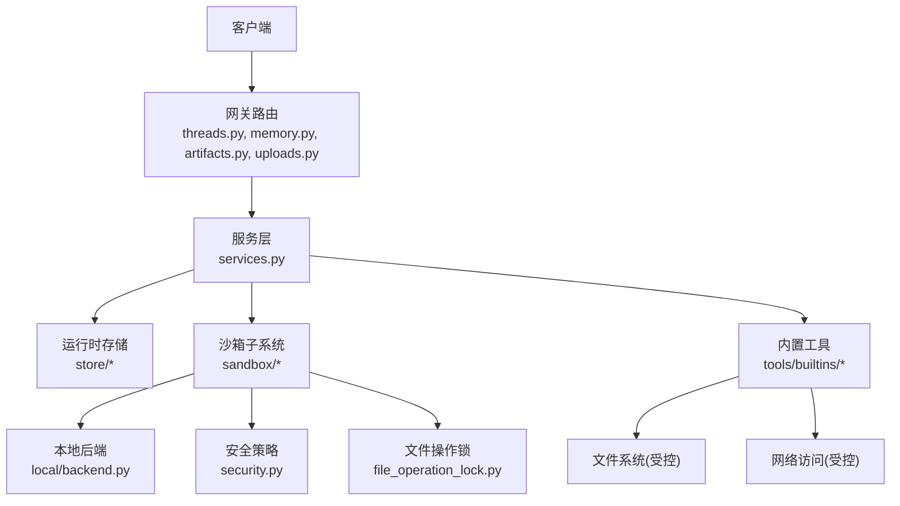
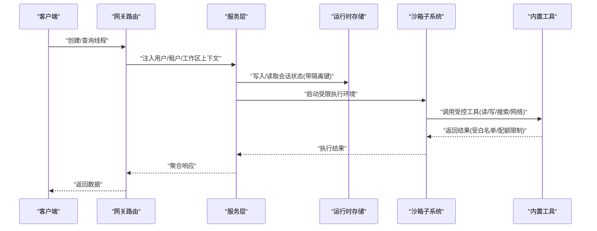
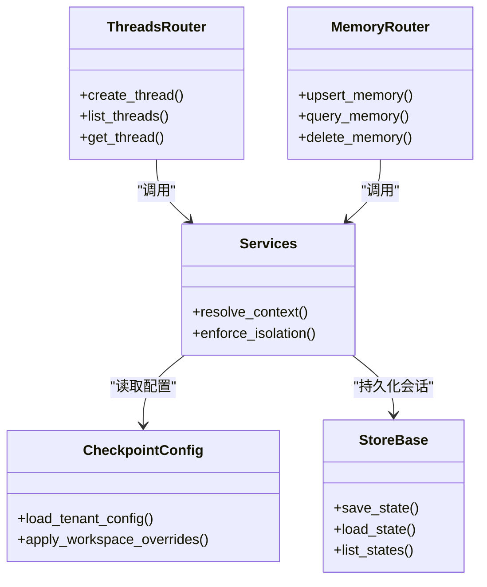
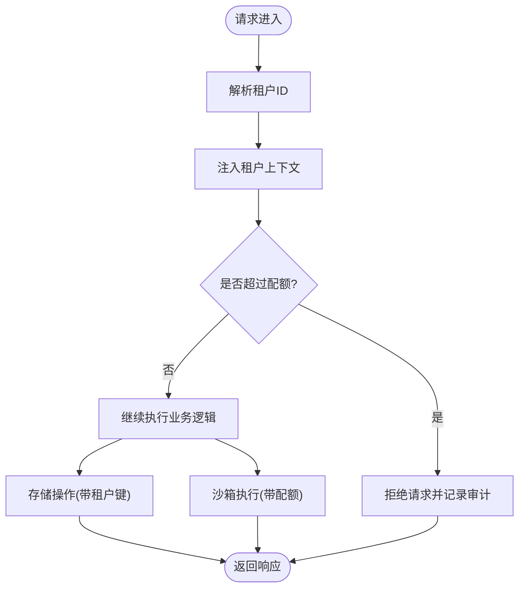
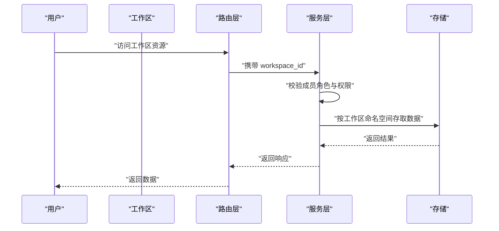
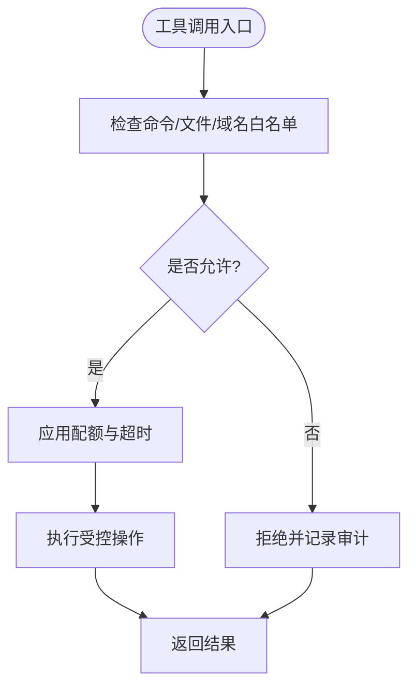
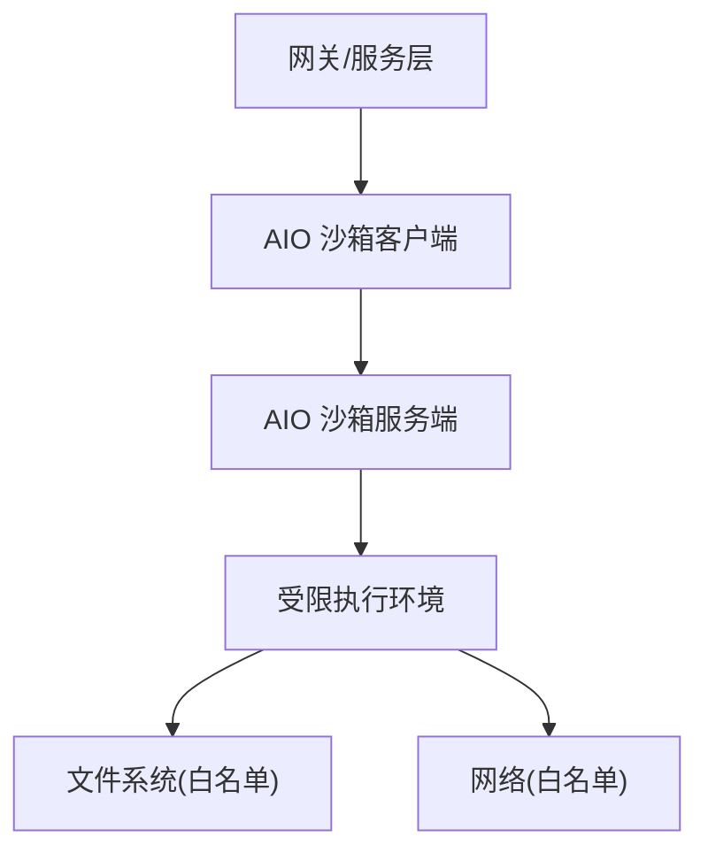
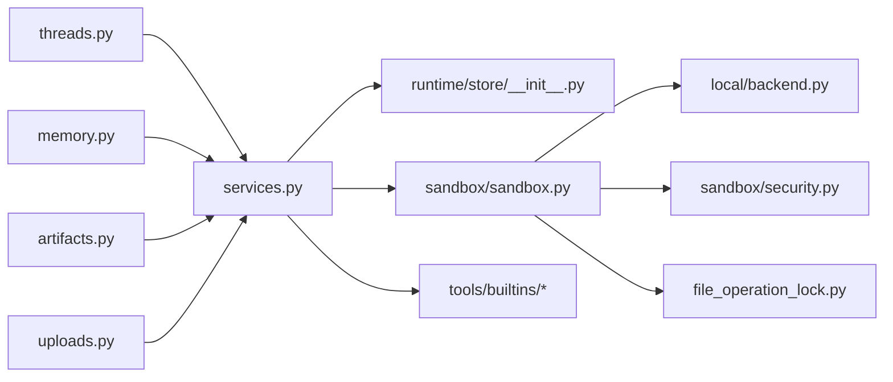

# 数据隔离机制

<cite>
**本文引用的文件**   
- [backend/app/gateway/routers/threads.py](file://backend/app/gateway/routers/threads.py)
- [backend/app/gateway/routers/memory.py](file://backend/app/gateway/routers/memory.py)
- [backend/app/gateway/routers/artifacts.py](file://backend/app/gateway/routers/artifacts.py)
- [backend/app/gateway/routers/uploads.py](file://backend/app/gateway/routers/uploads.py)
- [backend/app/gateway/services.py](file://backend/app/gateway/services.py)
- [backend/app/gateway/deps.py](file://backend/app/gateway/deps.py)
- [backend/packages/harness/deerflow/runtime/store/__init__.py](file://backend/packages/harness/deerflow/runtime/store/__init__.py)
- [backend/packages/harness/deerflow/runtime/store/base.py](file://backend/packages/harness/deerflow/runtime/store/base.py)
- [backend/packages/harness/deerflow/runtime/store/sqlite_store.py](file://backend/packages/harness/deerflow/runtime/store/sqlite_store.py)
- [backend/packages/harness/deerflow/runtime/store/postgres_store.py](file://backend/packages/harness/deerflow/runtime/store/postgres_store.py)
- [backend/packages/harness/deerflow/config/checkpointer_config.py](file://backend/packages/harness/deerflow/config/checkpointer_config.py)
- [backend/packages/harness/deerflow/sandbox/sandbox.py](file://backend/packages/harness/deerflow/sandbox/sandbox.py)
- [backend/packages/harness/deerflow/sandbox/local/backend.py](file://backend/packages/harness/deerflow/sandbox/local/backend.py)
- [backend/packages/harness/deerflow/sandbox/security.py](file://backend/packages/harness/deerflow/sandbox/security.py)
- [backend/packages/harness/deerflow/sandbox/middleware.py](file://backend/packages/harness/deerflow/sandbox/middleware.py)
- [backend/packages/harness/deerflow/sandbox/file_operation_lock.py](file://backend/packages/harness/deerflow/sandbox/file_operation_lock.py)
- [backend/packages/harness/deerflow/config/sandbox_config.py](file://backend/packages/harness/deerflow/config/sandbox_config.py)
- [backend/packages/harness/deerflow/tools/builtins/present_file.py](file://backend/packages/harness/deerflow/tools/builtins/present_file.py)
- [backend/packages/harness/deerflow/tools/builtins/read_file.py](file://backend/packages/harness/deerflow/tools/builtins/read_file.py)
- [backend/packages/harness/deerflow/tools/builtins/write_file.py](file://backend/packages/harness/deerflow/tools/builtins/write_file.py)
- [backend/packages/harness/deerflow/tools/builtins/list_dir.py](file://backend/packages/harness/deerflow/tools/builtins/list_dir.py)
- [backend/packages/harness/deerflow/tools/builtins/search_codebase.py](file://backend/packages/harness/deerflow/tools/builtins/search_codebase.py)
- [backend/packages/harness/deerflow/tools/builtins/run_bash.py](file://backend/packages/harness/deerflow/tools/builtins/run_bash.py)
- [backend/packages/harness/deerflow/tools/builtins/curl.py](file://backend/packages/harness/deerflow/tools/builtins/curl.py)
- [backend/packages/harness/deerflow/tools/builtins/web_fetch.py](file://backend/packages/harness/deerflow/tools/builtins/web_fetch.py)
- [backend/packages/harness/deerflow/community/aio_sandbox/client.py](file://backend/packages/harness/deerflow/community/aio_sandbox/client.py)
- [backend/packages/harness/deerflow/community/aio_sandbox/server.py](file://backend/packages/harness/deerflow/community/aio_sandbox/server.py)
- [docker/provisioner/app.py](file://docker/provisioner/app.py)
- [config.example.yaml](file://config.example.yaml)
</cite>

## 目录
1. [简介](#简介)
2. [项目结构](#项目结构)
3. [核心组件](#核心组件)
4. [架构总览](#架构总览)
5. [详细组件分析](#详细组件分析)
6. [依赖关系分析](#依赖关系分析)
7. [性能考量](#性能考量)
8. [故障排查指南](#故障排查指南)
9. [结论](#结论)
10. [附录](#附录)

## 简介
本文件系统性阐述 DeerFlow 的数据隔离机制，覆盖用户级、租户级与工作区级隔离策略；说明会话、记忆与配置数据的隔离实现；解释沙箱环境中的文件系统与网络访问控制；并提供可操作的配置示例与性能优化建议。目标是帮助读者在多租户与多工作区场景下，正确设计安全边界并保障资源限制与审计能力。

## 项目结构
DeerFlow 后端采用网关路由 + 服务层 + 运行时存储的层次化设计：
- 网关层负责鉴权上下文注入、请求参数校验与路由分发
- 服务层封装业务逻辑，统一处理用户/租户/工作区标识
- 运行时存储提供会话状态、记忆与工件等持久化能力
- 沙箱子系统提供受限执行环境与资源控制

图表来源
- [backend/app/gateway/routers/threads.py](file://backend/app/gateway/routers/threads.py)
- [backend/app/gateway/routers/memory.py](file://backend/app/gateway/routers/memory.py)
- [backend/app/gateway/routers/artifacts.py](file://backend/app/gateway/routers/artifacts.py)
- [backend/app/gateway/routers/uploads.py](file://backend/app/gateway/routers/uploads.py)
- [backend/app/gateway/services.py](file://backend/app/gateway/services.py)
- [backend/packages/harness/deerflow/runtime/store/__init__.py](file://backend/packages/harness/deerflow/runtime/store/__init__.py)
- [backend/packages/harness/deerflow/sandbox/sandbox.py](file://backend/packages/harness/deerflow/sandbox/sandbox.py)
- [backend/packages/harness/deerflow/sandbox/local/backend.py](file://backend/packages/harness/deerflow/sandbox/local/backend.py)
- [backend/packages/harness/deerflow/sandbox/security.py](file://backend/packages/harness/deerflow/sandbox/security.py)
- [backend/packages/harness/deerflow/sandbox/file_operation_lock.py](file://backend/packages/harness/deerflow/sandbox/file_operation_lock.py)
- [backend/packages/harness/deerflow/tools/builtins/present_file.py](file://backend/packages/harness/deerflow/tools/builtins/present_file.py)
- [backend/packages/harness/deerflow/tools/builtins/read_file.py](file://backend/packages/harness/deerflow/tools/builtins/read_file.py)
- [backend/packages/harness/deerflow/tools/builtins/write_file.py](file://backend/packages/harness/deerflow/tools/builtins/write_file.py)
- [backend/packages/harness/deerflow/tools/builtins/list_dir.py](file://backend/packages/harness/deerflow/tools/builtins/list_dir.py)
- [backend/packages/harness/deerflow/tools/builtins/search_codebase.py](file://backend/packages/harness/deerflow/tools/builtins/search_codebase.py)
- [backend/packages/harness/deerflow/tools/builtins/run_bash.py](file://backend/packages/harness/deerflow/tools/builtins/run_bash.py)
- [backend/packages/harness/deerflow/tools/builtins/curl.py](file://backend/packages/harness/deerflow/tools/builtins/curl.py)
- [backend/packages/harness/deerflow/tools/builtins/web_fetch.py](file://backend/packages/harness/deerflow/tools/builtins/web_fetch.py)

章节来源
- [backend/app/gateway/routers/threads.py](file://backend/app/gateway/routers/threads.py)
- [backend/app/gateway/routers/memory.py](file://backend/app/gateway/routers/memory.py)
- [backend/app/gateway/routers/artifacts.py](file://backend/app/gateway/routers/artifacts.py)
- [backend/app/gateway/routers/uploads.py](file://backend/app/gateway/routers/uploads.py)
- [backend/app/gateway/services.py](file://backend/app/gateway/services.py)
- [backend/packages/harness/deerflow/runtime/store/__init__.py](file://backend/packages/harness/deerflow/runtime/store/__init__.py)
- [backend/packages/harness/deerflow/sandbox/sandbox.py](file://backend/packages/harness/deerflow/sandbox/sandbox.py)

## 核心组件
- 网关路由层
  - 线程与会话路由：按 thread_id 组织会话数据，结合用户/租户/工作区上下文进行过滤
  - 记忆路由：以 user_id/tenant_id/workspace_id 为维度读写记忆
  - 工件与上传路由：将产物与上传文件绑定到用户/租户/工作区命名空间
- 服务层
  - 统一解析认证上下文（用户、租户、工作区），并在所有数据访问前附加隔离键
- 运行时存储
  - 基于 checkpointer 抽象的会话状态存储，支持 SQLite/PostgreSQL 等后端
  - 通过 namespace 或表级分区实现用户/租户/工作区隔离
- 沙箱子系统
  - 提供受限执行环境，包含文件系统白名单、命令白名单、网络访问控制
  - 通过中间件对工具调用进行审计与拦截

章节来源
- [backend/app/gateway/routers/threads.py](file://backend/app/gateway/routers/threads.py)
- [backend/app/gateway/routers/memory.py](file://backend/app/gateway/routers/memory.py)
- [backend/app/gateway/routers/artifacts.py](file://backend/app/gateway/routers/artifacts.py)
- [backend/app/gateway/routers/uploads.py](file://backend/app/gateway/routers/uploads.py)
- [backend/app/gateway/services.py](file://backend/app/gateway/services.py)
- [backend/packages/harness/deerflow/config/checkpointer_config.py](file://backend/packages/harness/deerflow/config/checkpointer_config.py)
- [backend/packages/harness/deerflow/runtime/store/__init__.py](file://backend/packages/harness/deerflow/runtime/store/__init__.py)
- [backend/packages/harness/deerflow/sandbox/sandbox.py](file://backend/packages/harness/deerflow/sandbox/sandbox.py)

## 架构总览
下图展示从请求进入网关到落盘与沙箱执行的完整路径，以及各层如何携带与使用隔离键（user_id、tenant_id、workspace_id）。

图表来源
- [backend/app/gateway/routers/threads.py](file://backend/app/gateway/routers/threads.py)
- [backend/app/gateway/services.py](file://backend/app/gateway/services.py)
- [backend/packages/harness/deerflow/runtime/store/__init__.py](file://backend/packages/harness/deerflow/runtime/store/__init__.py)
- [backend/packages/harness/deerflow/sandbox/sandbox.py](file://backend/packages/harness/deerflow/sandbox/sandbox.py)
- [backend/packages/harness/deerflow/tools/builtins/read_file.py](file://backend/packages/harness/deerflow/tools/builtins/read_file.py)
- [backend/packages/harness/deerflow/tools/builtins/write_file.py](file://backend/packages/harness/deerflow/tools/builtins/write_file.py)
- [backend/packages/harness/deerflow/tools/builtins/curl.py](file://backend/packages/harness/deerflow/tools/builtins/curl.py)
- [backend/packages/harness/deerflow/tools/builtins/web_fetch.py](file://backend/packages/harness/deerflow/tools/builtins/web_fetch.py)

## 详细组件分析

### 用户级数据隔离（会话、记忆、配置）
- 会话数据
  - 线程路由在创建与查询时，强制携带 thread_id 与用户/租户/工作区上下文，确保会话仅对当前主体可见
  - 服务层在调用存储前，将隔离键注入到查询条件中，避免跨主体访问
- 记忆数据
  - 记忆路由以 user_id/tenant_id/workspace_id 作为主键维度，读写均受此约束
  - 记忆更新与检索在服务层完成，保证一致性
- 配置数据
  - 应用配置通过检查点配置模块加载，支持按租户/工作区分发不同模型、工具与技能集
  - 配置项在沙箱与服务层之间传递，用于限定工具与网络访问范围

图表来源
- [backend/app/gateway/routers/threads.py](file://backend/app/gateway/routers/threads.py)
- [backend/app/gateway/routers/memory.py](file://backend/app/gateway/routers/memory.py)
- [backend/app/gateway/services.py](file://backend/app/gateway/services.py)
- [backend/packages/harness/deerflow/config/checkpointer_config.py](file://backend/packages/harness/deerflow/config/checkpointer_config.py)
- [backend/packages/harness/deerflow/runtime/store/base.py](file://backend/packages/harness/deerflow/runtime/store/base.py)

章节来源
- [backend/app/gateway/routers/threads.py](file://backend/app/gateway/routers/threads.py)
- [backend/app/gateway/routers/memory.py](file://backend/app/gateway/routers/memory.py)
- [backend/app/gateway/services.py](file://backend/app/gateway/services.py)
- [backend/packages/harness/deerflow/config/checkpointer_config.py](file://backend/packages/harness/deerflow/config/checkpointer_config.py)
- [backend/packages/harness/deerflow/runtime/store/base.py](file://backend/packages/harness/deerflow/runtime/store/base.py)

### 多租户安全边界与资源限制
- 租户隔离
  - 网关与服务层在每次请求中解析 tenant_id，并将其注入到存储查询与沙箱环境变量
  - 存储层通过命名空间或表字段实现物理隔离，防止跨租户数据泄漏
- 资源限制
  - 沙箱配置定义 CPU/内存/超时/并发上限，由 provisioner 或容器编排系统强制执行
  - 工具侧限制如最大输出长度、最大文件数、最大网络请求次数等，在服务层与中间件双重校验

图表来源
- [backend/app/gateway/services.py](file://backend/app/gateway/services.py)
- [backend/packages/harness/deerflow/config/sandbox_config.py](file://backend/packages/harness/deerflow/config/sandbox_config.py)
- [docker/provisioner/app.py](file://docker/provisioner/app.py)

章节来源
- [backend/app/gateway/services.py](file://backend/app/gateway/services.py)
- [backend/packages/harness/deerflow/config/sandbox_config.py](file://backend/packages/harness/deerflow/config/sandbox_config.py)
- [docker/provisioner/app.py](file://docker/provisioner/app.py)

### 工作区级权限控制与资源共享
- 成员管理
  - 工作区上下文在服务层解析，决定该用户对工作区内资源的访问级别（只读/读写/管理员）
- 资源共享策略
  - 同一工作区内，会话、记忆与工件默认共享；跨工作区需显式授权
  - 上传与工件路由在工作区命名空间内组织，避免越权访问

图表来源
- [backend/app/gateway/routers/artifacts.py](file://backend/app/gateway/routers/artifacts.py)
- [backend/app/gateway/routers/uploads.py](file://backend/app/gateway/routers/uploads.py)
- [backend/app/gateway/services.py](file://backend/app/gateway/services.py)

章节来源
- [backend/app/gateway/routers/artifacts.py](file://backend/app/gateway/routers/artifacts.py)
- [backend/app/gateway/routers/uploads.py](file://backend/app/gateway/routers/uploads.py)
- [backend/app/gateway/services.py](file://backend/app/gateway/services.py)

### 沙箱环境中的数据隔离（文件系统与网络访问）
- 文件系统隔离
  - 沙箱中间件对工具的文件操作进行拦截，仅允许访问白名单目录
  - 文件操作锁确保并发安全，避免竞态条件导致的数据污染
- 网络访问控制
  - curl/web_fetch 工具受域名白名单与速率限制保护
  - 禁止访问内网地址与敏感端口，失败时记录审计日志
- 命令与进程限制
  - run_bash 工具仅允许白名单命令，且受超时与资源配额限制

图表来源
- [backend/packages/harness/deerflow/sandbox/middleware.py](file://backend/packages/harness/deerflow/sandbox/middleware.py)
- [backend/packages/harness/deerflow/sandbox/security.py](file://backend/packages/harness/deerflow/sandbox/security.py)
- [backend/packages/harness/deerflow/sandbox/file_operation_lock.py](file://backend/packages/harness/deerflow/sandbox/file_operation_lock.py)
- [backend/packages/harness/deerflow/tools/builtins/read_file.py](file://backend/packages/harness/deerflow/tools/builtins/read_file.py)
- [backend/packages/harness/deerflow/tools/builtins/write_file.py](file://backend/packages/harness/deerflow/tools/builtins/write_file.py)
- [backend/packages/harness/deerflow/tools/builtins/list_dir.py](file://backend/packages/harness/deerflow/tools/builtins/list_dir.py)
- [backend/packages/harness/deerflow/tools/builtins/search_codebase.py](file://backend/packages/harness/deerflow/tools/builtins/search_codebase.py)
- [backend/packages/harness/deerflow/tools/builtins/run_bash.py](file://backend/packages/harness/deerflow/tools/builtins/run_bash.py)
- [backend/packages/harness/deerflow/tools/builtins/curl.py](file://backend/packages/harness/deerflow/tools/builtins/curl.py)
- [backend/packages/harness/deerflow/tools/builtins/web_fetch.py](file://backend/packages/harness/deerflow/tools/builtins/web_fetch.py)

章节来源
- [backend/packages/harness/deerflow/sandbox/middleware.py](file://backend/packages/harness/deerflow/sandbox/middleware.py)
- [backend/packages/harness/deerflow/sandbox/security.py](file://backend/packages/harness/deerflow/sandbox/security.py)
- [backend/packages/harness/deerflow/sandbox/file_operation_lock.py](file://backend/packages/harness/deerflow/sandbox/file_operation_lock.py)
- [backend/packages/harness/deerflow/tools/builtins/read_file.py](file://backend/packages/harness/deerflow/tools/builtins/read_file.py)
- [backend/packages/harness/deerflow/tools/builtins/write_file.py](file://backend/packages/harness/deerflow/tools/builtins/write_file.py)
- [backend/packages/harness/deerflow/tools/builtins/list_dir.py](file://backend/packages/harness/deerflow/tools/builtins/list_dir.py)
- [backend/packages/harness/deerflow/tools/builtins/search_codebase.py](file://backend/packages/harness/deerflow/tools/builtins/search_codebase.py)
- [backend/packages/harness/deerflow/tools/builtins/run_bash.py](file://backend/packages/harness/deerflow/tools/builtins/run_bash.py)
- [backend/packages/harness/deerflow/tools/builtins/curl.py](file://backend/packages/harness/deerflow/tools/builtins/curl.py)
- [backend/packages/harness/deerflow/tools/builtins/web_fetch.py](file://backend/packages/harness/deerflow/tools/builtins/web_fetch.py)

### 远程沙箱与隔离扩展
- AIO 沙箱客户端/服务端提供异步执行通道，适合分布式部署
- 通过独立进程或容器承载受限执行环境，进一步降低宿主风险

图表来源
- [backend/packages/harness/deerflow/community/aio_sandbox/client.py](file://backend/packages/harness/deerflow/community/aio_sandbox/client.py)
- [backend/packages/harness/deerflow/community/aio_sandbox/server.py](file://backend/packages/harness/deerflow/community/aio_sandbox/server.py)

章节来源
- [backend/packages/harness/deerflow/community/aio_sandbox/client.py](file://backend/packages/harness/deerflow/community/aio_sandbox/client.py)
- [backend/packages/harness/deerflow/community/aio_sandbox/server.py](file://backend/packages/harness/deerflow/community/aio_sandbox/server.py)

## 依赖关系分析
- 耦合与内聚
  - 网关路由与服务层解耦良好，服务层集中处理隔离键注入与权限校验
  - 存储抽象清晰，便于替换后端（SQLite/PostgreSQL）
- 外部依赖与集成点
  - 沙箱配置与 provisioner 集成，实现资源限制与生命周期管理
  - 工具层与沙箱中间件强耦合，确保所有 I/O 操作受控

图表来源
- [backend/app/gateway/routers/threads.py](file://backend/app/gateway/routers/threads.py)
- [backend/app/gateway/routers/memory.py](file://backend/app/gateway/routers/memory.py)
- [backend/app/gateway/routers/artifacts.py](file://backend/app/gateway/routers/artifacts.py)
- [backend/app/gateway/routers/uploads.py](file://backend/app/gateway/routers/uploads.py)
- [backend/app/gateway/services.py](file://backend/app/gateway/services.py)
- [backend/packages/harness/deerflow/runtime/store/__init__.py](file://backend/packages/harness/deerflow/runtime/store/__init__.py)
- [backend/packages/harness/deerflow/sandbox/sandbox.py](file://backend/packages/harness/deerflow/sandbox/sandbox.py)
- [backend/packages/harness/deerflow/sandbox/local/backend.py](file://backend/packages/harness/deerflow/sandbox/local/backend.py)
- [backend/packages/harness/deerflow/sandbox/security.py](file://backend/packages/harness/deerflow/sandbox/security.py)
- [backend/packages/harness/deerflow/sandbox/file_operation_lock.py](file://backend/packages/harness/deerflow/sandbox/file_operation_lock.py)
- [backend/packages/harness/deerflow/tools/builtins/present_file.py](file://backend/packages/harness/deerflow/tools/builtins/present_file.py)
- [backend/packages/harness/deerflow/tools/builtins/read_file.py](file://backend/packages/harness/deerflow/tools/builtins/read_file.py)
- [backend/packages/harness/deerflow/tools/builtins/write_file.py](file://backend/packages/harness/deerflow/tools/builtins/write_file.py)
- [backend/packages/harness/deerflow/tools/builtins/list_dir.py](file://backend/packages/harness/deerflow/tools/builtins/list_dir.py)
- [backend/packages/harness/deerflow/tools/builtins/search_codebase.py](file://backend/packages/harness/deerflow/tools/builtins/search_codebase.py)
- [backend/packages/harness/deerflow/tools/builtins/run_bash.py](file://backend/packages/harness/deerflow/tools/builtins/run_bash.py)
- [backend/packages/harness/deerflow/tools/builtins/curl.py](file://backend/packages/harness/deerflow/tools/builtins/curl.py)
- [backend/packages/harness/deerflow/tools/builtins/web_fetch.py](file://backend/packages/harness/deerflow/tools/builtins/web_fetch.py)

章节来源
- [backend/app/gateway/routers/threads.py](file://backend/app/gateway/routers/threads.py)
- [backend/app/gateway/routers/memory.py](file://backend/app/gateway/routers/memory.py)
- [backend/app/gateway/routers/artifacts.py](file://backend/app/gateway/routers/artifacts.py)
- [backend/app/gateway/routers/uploads.py](file://backend/app/gateway/routers/uploads.py)
- [backend/app/gateway/services.py](file://backend/app/gateway/services.py)
- [backend/packages/harness/deerflow/runtime/store/__init__.py](file://backend/packages/harness/deerflow/runtime/store/__init__.py)
- [backend/packages/harness/deerflow/sandbox/sandbox.py](file://backend/packages/harness/deerflow/sandbox/sandbox.py)

## 性能考量
- 存储层
  - 优先使用 PostgreSQL 以获得更好的并发与索引能力；SQLite 适用于单机与轻量场景
  - 合理设置连接池大小与查询缓存，减少跨租户扫描开销
- 沙箱执行
  - 启用异步沙箱（AIO）以降低阻塞；为高负载租户分配独立容器实例
  - 限制单次任务的文件遍历深度与网络请求数量，避免长尾任务拖慢整体吞吐
- 工具与中间件
  - 对大文件读取与全文搜索增加分页与限流；对网络请求增加重试退避与熔断
- 监控与审计
  - 记录关键操作（创建/删除/越权尝试）的审计日志，便于定位瓶颈与异常

[本节为通用指导，不直接分析具体文件]

## 故障排查指南
- 常见错误
  - 越权访问：检查网关与服务层是否正确注入 user_id/tenant_id/workspace_id
  - 沙箱拒绝：确认命令/文件/域名是否在白名单，配额是否超限
  - 存储不可用：验证数据库连接与命名空间是否存在
- 诊断步骤
  - 查看网关与服务层日志，确认上下文解析与权限校验结果
  - 检查沙箱中间件与安全策略日志，定位被拦截的操作
  - 核对存储层查询条件，确保隔离键参与过滤
- 恢复建议
  - 修正配置项（白名单、配额、命名空间）
  - 扩容沙箱实例或调整资源限制
  - 清理孤儿进程与临时文件，释放资源

章节来源
- [backend/app/gateway/services.py](file://backend/app/gateway/services.py)
- [backend/packages/harness/deerflow/sandbox/middleware.py](file://backend/packages/harness/deerflow/sandbox/middleware.py)
- [backend/packages/harness/deerflow/sandbox/security.py](file://backend/packages/harness/deerflow/sandbox/security.py)
- [backend/packages/harness/deerflow/runtime/store/base.py](file://backend/packages/harness/deerflow/runtime/store/base.py)

## 结论
DeerFlow 通过“网关上下文注入 + 服务层权限校验 + 存储命名空间隔离 + 沙箱受控执行”的多层机制，实现了用户级、租户级与工作区级数据隔离。配合沙箱白名单、配额与审计能力，可在多租户环境中构建坚实的安全边界。生产部署建议采用 PostgreSQL 与异步沙箱，并结合监控与限流策略提升稳定性与性能。

[本节为总结性内容，不直接分析具体文件]

## 附录

### 数据隔离配置示例
- 基础隔离键
  - user_id：用户唯一标识
  - tenant_id：租户唯一标识
  - workspace_id：工作区唯一标识
- 沙箱限制
  - 文件白名单目录列表
  - 命令白名单
  - 域名白名单与速率限制
  - CPU/内存/超时/并发上限
- 存储选择
  - SQLite：单机与开发环境
  - PostgreSQL：多租户与高并发生产环境

章节来源
- [config.example.yaml](file://config.example.yaml)
- [backend/packages/harness/deerflow/config/sandbox_config.py](file://backend/packages/harness/deerflow/config/sandbox_config.py)
- [backend/packages/harness/deerflow/config/checkpointer_config.py](file://backend/packages/harness/deerflow/config/checkpointer_config.py)
- [backend/packages/harness/deerflow/runtime/store/sqlite_store.py](file://backend/packages/harness/deerflow/runtime/store/sqlite_store.py)
- [backend/packages/harness/deerflow/runtime/store/postgres_store.py](file://backend/packages/harness/deerflow/runtime/store/postgres_store.py)