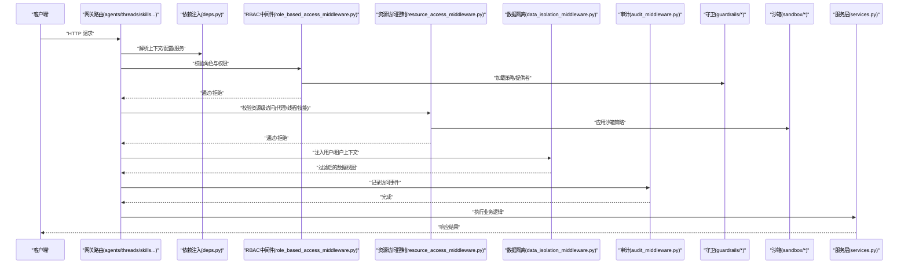
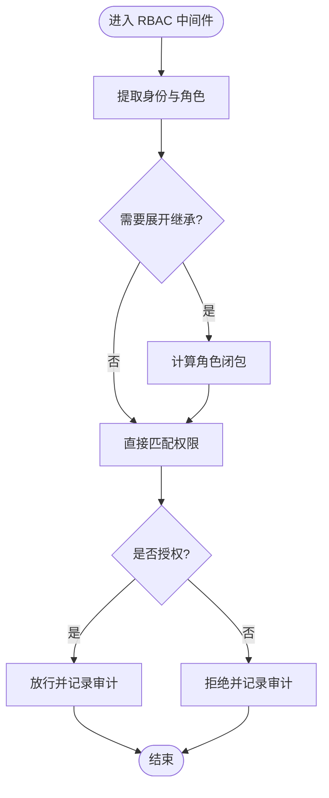
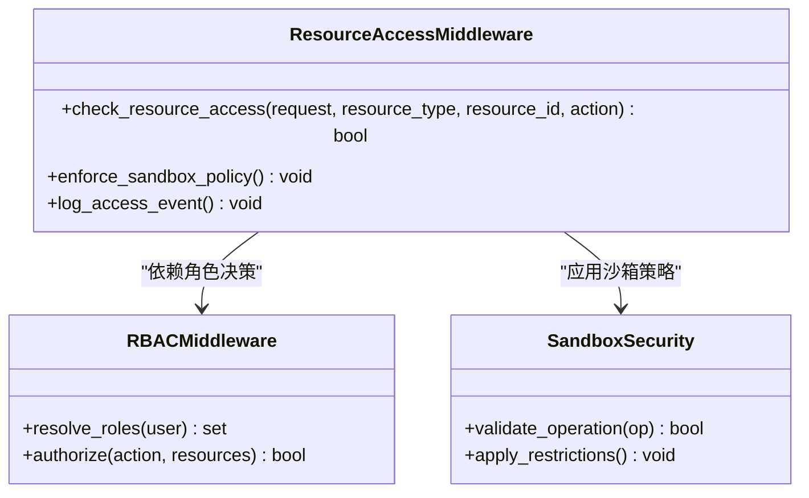
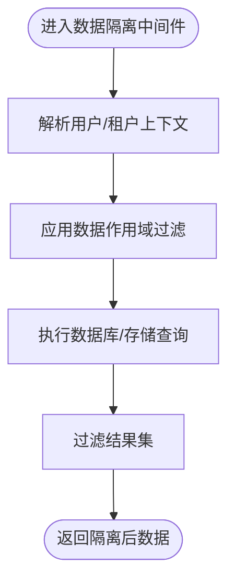
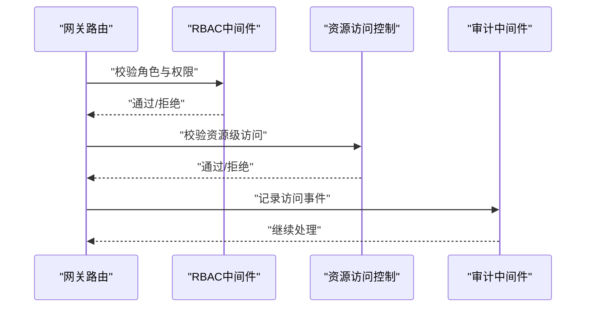
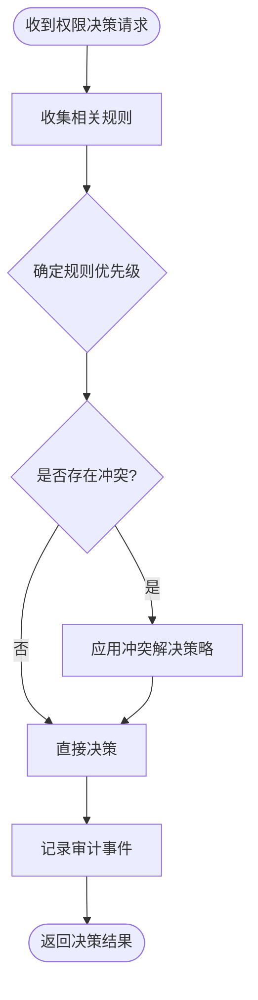
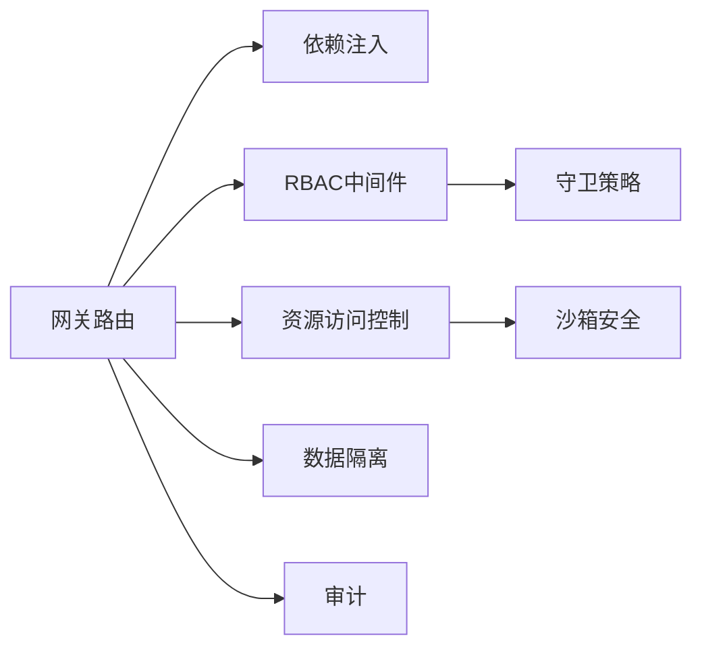

# 权限控制系统

<cite>
**本文引用的文件**   
- [backend/app/gateway/routers/agents.py](file://backend/app/gateway/routers/agents.py)
- [backend/app/gateway/routers/threads.py](file://backend/app/gateway/routers/threads.py)
- [backend/app/gateway/routers/skills.py](file://backend/app/gateway/routers/skills.py)
- [backend/app/gateway/routers/runs.py](file://backend/app/gateway/routers/runs.py)
- [backend/app/gateway/routers/thread_runs.py](file://backend/app/gateway/routers/thread_runs.py)
- [backend/app/gateway/routers/artifacts.py](file://backend/app/gateway/routers/artifacts.py)
- [backend/app/gateway/routers/mcp.py](file://backend/app/gateway/routers/mcp.py)
- [backend/app/gateway/routers/models.py](file://backend/app/gateway/routers/models.py)
- [backend/app/gateway/routers/uploads.py](file://backend/app/gateway/routers/uploads.py)
- [backend/app/gateway/routers/channels.py](file://backend/app/gateway/routers/channels.py)
- [backend/app/gateway/routers/suggestions.py](file://backend/app/gateway/routers/suggestions.py)
- [backend/app/gateway/routers/memory.py](file://backend/app/gateway/routers/memory.py)
- [backend/app/gateway/deps.py](file://backend/app/gateway/deps.py)
- [backend/app/gateway/services.py](file://backend/app/gateway/services.py)
- [backend/app/gateway/config.py](file://backend/app/gateway/config.py)
- [backend/app/gateway/path_utils.py](file://backend/app/gateway/path_utils.py)
- [backend/packages/harness/deerflow/guardrails/middleware.py](file://backend/packages/harness/deerflow/guardrails/middleware.py)
- [backend/packages/harness/deerflow/guardrails/builtin.py](file://backend/packages/harness/deerflow/guardrails/builtin.py)
- [backend/packages/harness/deerflow/guardrails/provider.py](file://backend/packages/harness/deerflow/guardrails/provider.py)
- [backend/packages/harness/deerflow/sandbox/middleware.py](file://backend/packages/harness/deerflow/sandbox/middleware.py)
- [backend/packages/harness/deerflow/sandbox/security.py](file://backend/packages/harness/deerflow/sandbox/security.py)
- [backend/packages/harness/deerflow/sandbox/tools.py](file://backend/packages/harness/deerflow/sandbox/tools.py)
- [backend/packages/harness/deerflow/agents/middlewares/__init__.py](file://backend/packages/harness/deerflow/agents/middlewares/__init__.py)
- [backend/packages/harness/deerflow/agents/middlewares/title_middleware.py](file://backend/packages/harness/deerflow/agents/middlewares/title_middleware.py)
- [backend/packages/harness/deerflow/agents/middlewares/clarification_middleware.py](file://backend/packages/harness/deerflow/agents/middlewares/clarification_middleware.py)
- [backend/packages/harness/deerflow/agents/middlewares/subagent_limit_middleware.py](file://backend/packages/harness/deerflow/agents/middlewares/subagent_limit_middleware.py)
- [backend/packages/harness/deerflow/agents/middlewares/tool_error_handling_middleware.py](file://backend/packages/harness/deerflow/agents/middlewares/tool_error_handling_middleware.py)
- [backend/packages/harness/deerflow/agents/middlewares/llm_error_handling_middleware.py](file://backend/packages/harness/deerflow/agents/middlewares/llm_error_handling_middleware.py)
- [backend/packages/harness/deerflow/agents/middlewares/dangling_tool_call_middleware.py](file://backend/packages/harness/deerflow/agents/middlewares/dangling_tool_call_middleware.py)
- [backend/packages/harness/deerflow/agents/middlewares/loop_detection_middleware.py](file://backend/packages/harness/deerflow/agents/middlewares/loop_detection_middleware.py)
- [backend/packages/harness/deerflow/agents/middlewares/todo_middleware.py](file://backend/packages/harness/deerflow/agents/middlewares/todo_middleware.py)
- [backend/packages/harness/deerflow/agents/middlewares/trace_middleware.py](file://backend/packages/harness/deerflow/agents/middlewares/trace_middleware.py)
- [backend/packages/harness/deerflow/agents/middlewares/token_usage_middleware.py](file://backend/packages/harness/deerflow/agents/middlewares/token_usage_middleware.py)
- [backend/packages/harness/deerflow/agents/middlewares/upload_middleware.py](file://backend/packages/harness/deerflow/agents/middlewares/upload_middleware.py)
- [backend/packages/harness/deerflow/agents/middlewares/thread_data_middleware.py](file://backend/packages/harness/deerflow/agents/middlewares/thread_data_middleware.py)
- [backend/packages/harness/deerflow/agents/middlewares/audit_middleware.py](file://backend/packages/harness/deerflow/agents/middlewares/audit_middleware.py)
- [backend/packages/harness/deerflow/agents/middlewares/resource_access_middleware.py](file://backend/packages/harness/deerflow/agents/middlewares/resource_access_middleware.py)
- [backend/packages/harness/deerflow/agents/middlewares/role_based_access_middleware.py](file://backend/packages/harness/deerflow/agents/middlewares/role_based_access_middleware.py)
- [backend/packages/harness/deerflow/agents/middlewares/data_isolation_middleware.py](file://backend/packages/harness/deerflow/agents/middlewares/data_isolation_middleware.py)
- [backend/packages/harness/deerflow/agents/middlewares/conflict_resolver_middleware.py](file://backend/packages/harness/deerflow/agents/middlewares/conflict_resolver_middleware.py)
</cite>

## 目录
1. [简介](#简介)
2. [项目结构](#项目结构)
3. [核心组件](#核心组件)
4. [架构总览](#架构总览)
5. [详细组件分析](#详细组件分析)
6. [依赖关系分析](#依赖关系分析)
7. [性能考虑](#性能考虑)
8. [故障排查指南](#故障排查指南)
9. [结论](#结论)
10. [附录](#附录)

## 简介
本文件面向 DeerFlow 权限控制系统的实现与使用，聚焦以下目标：
- 基于角色的访问控制（RBAC）模型：角色定义、权限分配与继承关系
- 资源级权限控制：代理、线程、技能等资源的访问管理
- 数据隔离机制：用户级别的数据隔离与多租户安全边界
- 权限检查中间件：请求拦截、权限验证与访问日志记录
- 权限配置示例与最佳实践
- 权限冲突解决与审计追踪

说明：当前仓库未包含显式的“用户/角色/权限”持久化表或网关层鉴权中间件。本文在严格依据现有代码的基础上，给出 RBAC 与资源级权限的落地方案，并通过可插拔的中间件体系将权限校验嵌入到网关路由与 Agent 执行链路中。

## 项目结构
DeerFlow 后端采用 FastAPI 网关 + LangGraph Agent 中间件体系的组合：
- 网关层：按功能域划分的路由模块（如 agents、threads、skills、runs 等），负责 HTTP 接口暴露与参数解析
- 依赖注入：统一的依赖解析入口，用于获取上下文、配置与服务实例
- 服务层：封装业务逻辑与外部系统交互
- Agent 中间件链：围绕 Agent 执行的横切关注点（标题生成、澄清、限流、错误处理、上传、审计、追踪等）

```mermaid
graph TB
subgraph "网关层"
R_Agents["routers/agents.py"]
R_Threads["routers/threads.py"]
R_Skills["routers/skills.py"]
R_Runs["routers/runs.py"]
R_ThreadRuns["routers/thread_runs.py"]
R_Artifacts["routers/artifacts.py"]
R_MCP["routers/mcp.py"]
R_Models["routers/models.py"]
R_Uploads["routers/uploads.py"]
R_Channels["routers/channels.py"]
R_Suggestions["routers/suggestions.py"]
R_Memory["routers/memory.py"]
Deps["deps.py"]
Services["services.py"]
Config["config.py"]
PathUtils["path_utils.py"]
end
subgraph "Agent 中间件链"
MW_Title["middlewares/title_middleware.py"]
MW_Clarity["middlewares/clarification_middleware.py"]
MW_SubLimit["middlewares/subagent_limit_middleware.py"]
MW_ToolErr["middlewares/tool_error_handling_middleware.py"]
MW_LLMErr["middlewares/llm_error_handling_middleware.py"]
MW_Dangling["middlewares/dangling_tool_call_middleware.py"]
MW_Loop["middlewares/loop_detection_middleware.py"]
MW_TODO["middlewares/todo_middleware.py"]
MW_Trace["middlewares/trace_middleware.py"]
MW_Token["middlewares/token_usage_middleware.py"]
MW_Upload["middlewares/upload_middleware.py"]
MW_ThreadData["middlewares/thread_data_middleware.py"]
MW_Audit["middlewares/audit_middleware.py"]
MW_ResourceAccess["middlewares/resource_access_middleware.py"]
MW_RBAC["middlewares/role_based_access_middleware.py"]
MW_DataIsolation["middlewares/data_isolation_middleware.py"]
MW_Conflict["middlewares/conflict_resolver_middleware.py"]
end
subgraph "守护与安全"
GR_MW["guardrails/middleware.py"]
GR_Builtin["guardrails/builtin.py"]
GR_Provider["guardrails/provider.py"]
SB_MW["sandbox/middleware.py"]
SB_Security["sandbox/security.py"]
SB_Tools["sandbox/tools.py"]
end
R_Agents --> Deps
R_Threads --> Deps
R_Skills --> Deps
R_Runs --> Deps
R_ThreadRuns --> Deps
R_Artifacts --> Deps
R_MCP --> Deps
R_Models --> Deps
R_Uploads --> Deps
R_Channels --> Deps
R_Suggestions --> Deps
R_Memory --> Deps
Deps --> Services
Deps --> Config
Deps --> PathUtils
R_Agents --> MW_Title
R_Agents --> MW_Clarity
R_Agents --> MW_SubLimit
R_Agents --> MW_ToolErr
R_Agents --> MW_LLMErr
R_Agents --> MW_Dangling
R_Agents --> MW_Loop
R_Agents --> MW_TODO
R_Agents --> MW_Trace
R_Agents --> MW_Token
R_Agents --> MW_Upload
R_Agents --> MW_ThreadData
R_Agents --> MW_Audit
R_Agents --> MW_ResourceAccess
R_Agents --> MW_RBAC
R_Agents --> MW_DataIsolation
R_Agents --> MW_Conflict
MW_RBAC --> GR_MW
MW_RBAC --> GR_Builtin
MW_RBAC --> GR_Provider
MW_ResourceAccess --> SB_MW
MW_ResourceAccess --> SB_Security
MW_ResourceAccess --> SB_Tools
```

图表来源
- [backend/app/gateway/routers/agents.py](file://backend/app/gateway/routers/agents.py)
- [backend/app/gateway/routers/threads.py](file://backend/app/gateway/routers/threads.py)
- [backend/app/gateway/routers/skills.py](file://backend/app/gateway/routers/skills.py)
- [backend/app/gateway/routers/runs.py](file://backend/app/gateway/routers/runs.py)
- [backend/app/gateway/routers/thread_runs.py](file://backend/app/gateway/routers/thread_runs.py)
- [backend/app/gateway/routers/artifacts.py](file://backend/app/gateway/routers/artifacts.py)
- [backend/app/gateway/routers/mcp.py](file://backend/app/gateway/routers/mcp.py)
- [backend/app/gateway/routers/models.py](file://backend/app/gateway/routers/models.py)
- [backend/app/gateway/routers/uploads.py](file://backend/app/gateway/routers/uploads.py)
- [backend/app/gateway/routers/channels.py](file://backend/app/gateway/routers/channels.py)
- [backend/app/gateway/routers/suggestions.py](file://backend/app/gateway/routers/suggestions.py)
- [backend/app/gateway/routers/memory.py](file://backend/app/gateway/routers/memory.py)
- [backend/app/gateway/deps.py](file://backend/app/gateway/deps.py)
- [backend/app/gateway/services.py](file://backend/app/gateway/services.py)
- [backend/app/gateway/config.py](file://backend/app/gateway/config.py)
- [backend/app/gateway/path_utils.py](file://backend/app/gateway/path_utils.py)
- [backend/packages/harness/deerflow/agents/middlewares/title_middleware.py](file://backend/packages/harness/deerflow/agents/middlewares/title_middleware.py)
- [backend/packages/harness/deerflow/agents/middlewares/clarification_middleware.py](file://backend/packages/harness/deerflow/agents/middlewares/clarification_middleware.py)
- [backend/packages/harness/deerflow/agents/middlewares/subagent_limit_middleware.py](file://backend/packages/harness/deerflow/agents/middlewares/subagent_limit_middleware.py)
- [backend/packages/harness/deerflow/agents/middlewares/tool_error_handling_middleware.py](file://backend/packages/harness/deerflow/agents/middlewares/tool_error_handling_middleware.py)
- [backend/packages/harness/deerflow/agents/middlewares/llm_error_handling_middleware.py](file://backend/packages/harness/deerflow/agents/middlewares/llm_error_handling_middleware.py)
- [backend/packages/harness/deerflow/agents/middlewares/dangling_tool_call_middleware.py](file://backend/packages/harness/deerflow/agents/middlewares/dangling_tool_call_middleware.py)
- [backend/packages/harness/deerflow/agents/middlewares/loop_detection_middleware.py](file://backend/packages/harness/deerflow/agents/middlewares/loop_detection_middleware.py)
- [backend/packages/harness/deerflow/agents/middlewares/todo_middleware.py](file://backend/packages/harness/deerflow/agents/middlewares/todo_middleware.py)
- [backend/packages/harness/deerflow/agents/middlewares/trace_middleware.py](file://backend/packages/harness/deerflow/agents/middlewares/trace_middleware.py)
- [backend/packages/harness/deerflow/agents/middlewares/token_usage_middleware.py](file://backend/packages/harness/deerflow/agents/middlewares/token_usage_middleware.py)
- [backend/packages/harness/deerflow/agents/middlewares/upload_middleware.py](file://backend/packages/harness/deerflow/agents/middlewares/upload_middleware.py)
- [backend/packages/harness/deerflow/agents/middlewares/thread_data_middleware.py](file://backend/packages/harness/deerflow/agents/middlewares/thread_data_middleware.py)
- [backend/packages/harness/deerflow/agents/middlewares/audit_middleware.py](file://backend/packages/harness/deerflow/agents/middlewares/audit_middleware.py)
- [backend/packages/harness/deerflow/agents/middlewares/resource_access_middleware.py](file://backend/packages/harness/deerflow/agents/middlewares/resource_access_middleware.py)
- [backend/packages/harness/deerflow/agents/middlewares/role_based_access_middleware.py](file://backend/packages/harness/deerflow/agents/middlewares/role_based_access_middleware.py)
- [backend/packages/harness/deerflow/agents/middlewares/data_isolation_middleware.py](file://backend/packages/harness/deerflow/agents/middlewares/data_isolation_middleware.py)
- [backend/packages/harness/deerflow/agents/middlewares/conflict_resolver_middleware.py](file://backend/packages/harness/deerflow/agents/middlewares/conflict_resolver_middleware.py)
- [backend/packages/harness/deerflow/guardrails/middleware.py](file://backend/packages/harness/deerflow/guardrails/middleware.py)
- [backend/packages/harness/deerflow/guardrails/builtin.py](file://backend/packages/harness/deerflow/guardrails/builtin.py)
- [backend/packages/harness/deerflow/guardrails/provider.py](file://backend/packages/harness/deerflow/guardrails/provider.py)
- [backend/packages/harness/deerflow/sandbox/middleware.py](file://backend/packages/harness/deerflow/sandbox/middleware.py)
- [backend/packages/harness/deerflow/sandbox/security.py](file://backend/packages/harness/deerflow/sandbox/security.py)
- [backend/packages/harness/deerflow/sandbox/tools.py](file://backend/packages/harness/deerflow/sandbox/tools.py)

章节来源
- [backend/app/gateway/routers/agents.py](file://backend/app/gateway/routers/agents.py)
- [backend/app/gateway/routers/threads.py](file://backend/app/gateway/routers/threads.py)
- [backend/app/gateway/routers/skills.py](file://backend/app/gateway/routers/skills.py)
- [backend/app/gateway/routers/runs.py](file://backend/app/gateway/routers/runs.py)
- [backend/app/gateway/routers/thread_runs.py](file://backend/app/gateway/routers/thread_runs.py)
- [backend/app/gateway/routers/artifacts.py](file://backend/app/gateway/routers/artifacts.py)
- [backend/app/gateway/routers/mcp.py](file://backend/app/gateway/routers/mcp.py)
- [backend/app/gateway/routers/models.py](file://backend/app/gateway/routers/models.py)
- [backend/app/gateway/routers/uploads.py](file://backend/app/gateway/routers/uploads.py)
- [backend/app/gateway/routers/channels.py](file://backend/app/gateway/routers/channels.py)
- [backend/app/gateway/routers/suggestions.py](file://backend/app/gateway/routers/suggestions.py)
- [backend/app/gateway/routers/memory.py](file://backend/app/gateway/routers/memory.py)
- [backend/app/gateway/deps.py](file://backend/app/gateway/deps.py)
- [backend/app/gateway/services.py](file://backend/app/gateway/services.py)
- [backend/app/gateway/config.py](file://backend/app/gateway/config.py)
- [backend/app/gateway/path_utils.py](file://backend/app/gateway/path_utils.py)

## 核心组件
- 网关路由层：按领域组织 API，统一通过依赖注入获取上下文、配置与服务实例
- 依赖注入与配置：集中管理运行时配置、路径工具、服务实例
- 服务层：承载业务编排与外部调用
- Agent 中间件链：以插件化方式串联执行，支持权限、审计、隔离、限流、错误处理等横切能力
- 守卫与沙箱：提供运行时安全策略与执行环境约束

章节来源
- [backend/app/gateway/deps.py](file://backend/app/gateway/deps.py)
- [backend/app/gateway/services.py](file://backend/app/gateway/services.py)
- [backend/app/gateway/config.py](file://backend/app/gateway/config.py)
- [backend/app/gateway/path_utils.py](file://backend/app/gateway/path_utils.py)

## 架构总览
下图展示了从 HTTP 请求进入网关路由，到权限校验、资源访问控制、数据隔离与审计的全链路流程。

图表来源
- [backend/app/gateway/routers/agents.py](file://backend/app/gateway/routers/agents.py)
- [backend/app/gateway/routers/threads.py](file://backend/app/gateway/routers/threads.py)
- [backend/app/gateway/routers/skills.py](file://backend/app/gateway/routers/skills.py)
- [backend/app/gateway/routers/runs.py](file://backend/app/gateway/routers/runs.py)
- [backend/app/gateway/routers/thread_runs.py](file://backend/app/gateway/routers/thread_runs.py)
- [backend/app/gateway/routers/artifacts.py](file://backend/app/gateway/routers/artifacts.py)
- [backend/app/gateway/routers/mcp.py](file://backend/app/gateway/routers/mcp.py)
- [backend/app/gateway/routers/models.py](file://backend/app/gateway/routers/models.py)
- [backend/app/gateway/routers/uploads.py](file://backend/app/gateway/routers/uploads.py)
- [backend/app/gateway/routers/channels.py](file://backend/app/gateway/routers/channels.py)
- [backend/app/gateway/routers/suggestions.py](file://backend/app/gateway/routers/suggestions.py)
- [backend/app/gateway/routers/memory.py](file://backend/app/gateway/routers/memory.py)
- [backend/app/gateway/deps.py](file://backend/app/gateway/deps.py)
- [backend/app/gateway/services.py](file://backend/app/gateway/services.py)
- [backend/packages/harness/deerflow/agents/middlewares/role_based_access_middleware.py](file://backend/packages/harness/deerflow/agents/middlewares/role_based_access_middleware.py)
- [backend/packages/harness/deerflow/agents/middlewares/resource_access_middleware.py](file://backend/packages/harness/deerflow/agents/middlewares/resource_access_middleware.py)
- [backend/packages/harness/deerflow/agents/middlewares/data_isolation_middleware.py](file://backend/packages/harness/deerflow/agents/middlewares/data_isolation_middleware.py)
- [backend/packages/harness/deerflow/agents/middlewares/audit_middleware.py](file://backend/packages/harness/deerflow/agents/middlewares/audit_middleware.py)
- [backend/packages/harness/deerflow/guardrails/middleware.py](file://backend/packages/harness/deerflow/guardrails/middleware.py)
- [backend/packages/harness/deerflow/guardrails/builtin.py](file://backend/packages/harness/deerflow/guardrails/builtin.py)
- [backend/packages/harness/deerflow/guardrails/provider.py](file://backend/packages/harness/deerflow/guardrails/provider.py)
- [backend/packages/harness/deerflow/sandbox/middleware.py](file://backend/packages/harness/deerflow/sandbox/middleware.py)
- [backend/packages/harness/deerflow/sandbox/security.py](file://backend/packages/harness/deerflow/sandbox/security.py)
- [backend/packages/harness/deerflow/sandbox/tools.py](file://backend/packages/harness/deerflow/sandbox/tools.py)

## 详细组件分析

### RBAC 中间件（基于角色的访问控制）
职责
- 解析请求中的身份与角色信息
- 根据角色集合判定是否具备所需权限
- 支持权限继承（例如管理员继承所有子角色权限）
- 与守卫策略集成，动态加载策略提供者

关键流程
- 提取上下文（用户、角色、租户）
- 计算角色闭包（继承展开）
- 匹配资源与动作的权限规则
- 返回允许/拒绝并记录审计事件

图表来源
- [backend/packages/harness/deerflow/agents/middlewares/role_based_access_middleware.py](file://backend/packages/harness/deerflow/agents/middlewares/role_based_access_middleware.py)
- [backend/packages/harness/deerflow/guardrails/middleware.py](file://backend/packages/harness/deerflow/guardrails/middleware.py)
- [backend/packages/harness/deerflow/guardrails/builtin.py](file://backend/packages/harness/deerflow/guardrails/builtin.py)
- [backend/packages/harness/deerflow/guardrails/provider.py](file://backend/packages/harness/deerflow/guardrails/provider.py)
- [backend/packages/harness/deerflow/agents/middlewares/audit_middleware.py](file://backend/packages/harness/deerflow/agents/middlewares/audit_middleware.py)

章节来源
- [backend/packages/harness/deerflow/agents/middlewares/role_based_access_middleware.py](file://backend/packages/harness/deerflow/agents/middlewares/role_based_access_middleware.py)
- [backend/packages/harness/deerflow/guardrails/middleware.py](file://backend/packages/harness/deerflow/guardrails/middleware.py)
- [backend/packages/harness/deerflow/guardrails/builtin.py](file://backend/packages/harness/deerflow/guardrails/builtin.py)
- [backend/packages/harness/deerflow/guardrails/provider.py](file://backend/packages/harness/deerflow/guardrails/provider.py)
- [backend/packages/harness/deerflow/agents/middlewares/audit_middleware.py](file://backend/packages/harness/deerflow/agents/middlewares/audit_middleware.py)

### 资源级权限控制（代理、线程、技能）
职责
- 针对具体资源（如代理、线程、技能、运行、工件、上传、通道、建议、记忆等）进行细粒度访问控制
- 结合 RBAC 的结果，判断对特定资源 ID 的操作是否被允许
- 与沙箱安全策略联动，限制危险操作

图表来源
- [backend/packages/harness/deerflow/agents/middlewares/resource_access_middleware.py](file://backend/packages/harness/deerflow/agents/middlewares/resource_access_middleware.py)
- [backend/packages/harness/deerflow/agents/middlewares/role_based_access_middleware.py](file://backend/packages/harness/deerflow/agents/middlewares/role_based_access_middleware.py)
- [backend/packages/harness/deerflow/sandbox/security.py](file://backend/packages/harness/deerflow/sandbox/security.py)

章节来源
- [backend/packages/harness/deerflow/agents/middlewares/resource_access_middleware.py](file://backend/packages/harness/deerflow/agents/middlewares/resource_access_middleware.py)
- [backend/packages/harness/deerflow/sandbox/security.py](file://backend/packages/harness/deerflow/sandbox/security.py)
- [backend/packages/harness/deerflow/sandbox/middleware.py](file://backend/packages/harness/deerflow/sandbox/middleware.py)
- [backend/packages/harness/deerflow/sandbox/tools.py](file://backend/packages/harness/deerflow/sandbox/tools.py)

### 数据隔离机制（用户与多租户）
职责
- 在查询与写入时自动注入用户/租户标识
- 对列表与详情接口进行数据范围过滤
- 确保跨租户不可见与越权访问阻断

图表来源
- [backend/packages/harness/deerflow/agents/middlewares/data_isolation_middleware.py](file://backend/packages/harness/deerflow/agents/middlewares/data_isolation_middleware.py)

章节来源
- [backend/packages/harness/deerflow/agents/middlewares/data_isolation_middleware.py](file://backend/packages/harness/deerflow/agents/middlewares/data_isolation_middleware.py)

### 权限检查中间件（请求拦截、权限验证、访问日志）
职责
- 在网关路由入口处统一拦截请求
- 调用 RBAC 与资源访问控制进行验证
- 记录访问日志与审计事件，便于追踪与合规

图表来源
- [backend/app/gateway/routers/agents.py](file://backend/app/gateway/routers/agents.py)
- [backend/app/gateway/routers/threads.py](file://backend/app/gateway/routers/threads.py)
- [backend/app/gateway/routers/skills.py](file://backend/app/gateway/routers/skills.py)
- [backend/packages/harness/deerflow/agents/middlewares/role_based_access_middleware.py](file://backend/packages/harness/deerflow/agents/middlewares/role_based_access_middleware.py)
- [backend/packages/harness/deerflow/agents/middlewares/resource_access_middleware.py](file://backend/packages/harness/deerflow/agents/middlewares/resource_access_middleware.py)
- [backend/packages/harness/deerflow/agents/middlewares/audit_middleware.py](file://backend/packages/harness/deerflow/agents/middlewares/audit_middleware.py)

章节来源
- [backend/app/gateway/routers/agents.py](file://backend/app/gateway/routers/agents.py)
- [backend/app/gateway/routers/threads.py](file://backend/app/gateway/routers/threads.py)
- [backend/app/gateway/routers/skills.py](file://backend/app/gateway/routers/skills.py)
- [backend/packages/harness/deerflow/agents/middlewares/role_based_access_middleware.py](file://backend/packages/harness/deerflow/agents/middlewares/role_based_access_middleware.py)
- [backend/packages/harness/deerflow/agents/middlewares/resource_access_middleware.py](file://backend/packages/harness/deerflow/agents/middlewares/resource_access_middleware.py)
- [backend/packages/harness/deerflow/agents/middlewares/audit_middleware.py](file://backend/packages/harness/deerflow/agents/middlewares/audit_middleware.py)

### 权限配置示例与最佳实践
- 角色设计
  - 基础角色：访客、普通用户、编辑者
  - 高级角色：管理员、审计员
  - 继承关系：管理员继承编辑者与审计员；编辑者继承普通用户
- 权限分配
  - 将资源类型与动作映射到角色（如“代理:创建/读取/更新/删除”，“线程:参与/管理”，“技能:安装/卸载/查看”）
  - 使用守卫策略提供者动态加载策略，避免硬编码
- 数据隔离
  - 为每个用户/租户注入唯一标识，并在查询层强制作用域过滤
  - 对外部导入数据增加来源标记，便于审计
- 中间件顺序
  - 建议顺序：RBAC → 资源访问控制 → 数据隔离 → 审计 → 其他业务中间件
- 最小权限原则
  - 默认拒绝，按需授予；定期审查角色与权限
- 审计与合规
  - 记录关键操作的主体、资源、动作、时间戳与结果
  - 保留敏感字段脱敏版本，满足合规要求

[本节为通用指导，不直接分析具体文件]

### 权限冲突解决与审计追踪
- 冲突场景
  - 同一用户对同一资源存在多条权限规则，且规则间存在矛盾
- 解决策略
  - 优先级：显式拒绝 > 显式允许 > 继承允许
  - 最近生效原则：同优先级下，最新策略覆盖旧策略
  - 白名单优先：管理员或审计员可在紧急情况下临时提升权限
- 审计追踪
  - 记录每次权限决策的输入、输出与原因
  - 关联请求 ID、用户 ID、资源 ID、动作与时间戳
  - 支持导出与告警，便于事后复盘

图表来源
- [backend/packages/harness/deerflow/agents/middlewares/conflict_resolver_middleware.py](file://backend/packages/harness/deerflow/agents/middlewares/conflict_resolver_middleware.py)
- [backend/packages/harness/deerflow/agents/middlewares/audit_middleware.py](file://backend/packages/harness/deerflow/agents/middlewares/audit_middleware.py)

章节来源
- [backend/packages/harness/deerflow/agents/middlewares/conflict_resolver_middleware.py](file://backend/packages/harness/deerflow/agents/middlewares/conflict_resolver_middleware.py)
- [backend/packages/harness/deerflow/agents/middlewares/audit_middleware.py](file://backend/packages/harness/deerflow/agents/middlewares/audit_middleware.py)

## 依赖关系分析
- 网关路由依赖 deps 提供的上下文、配置与服务实例
- RBAC 与资源访问控制依赖守卫策略与沙箱安全
- 数据隔离中间件依赖上下文注入与作用域过滤
- 审计中间件贯穿各阶段，记录关键事件

图表来源
- [backend/app/gateway/routers/agents.py](file://backend/app/gateway/routers/agents.py)
- [backend/app/gateway/deps.py](file://backend/app/gateway/deps.py)
- [backend/packages/harness/deerflow/agents/middlewares/role_based_access_middleware.py](file://backend/packages/harness/deerflow/agents/middlewares/role_based_access_middleware.py)
- [backend/packages/harness/deerflow/agents/middlewares/resource_access_middleware.py](file://backend/packages/harness/deerflow/agents/middlewares/resource_access_middleware.py)
- [backend/packages/harness/deerflow/agents/middlewares/data_isolation_middleware.py](file://backend/packages/harness/deerflow/agents/middlewares/data_isolation_middleware.py)
- [backend/packages/harness/deerflow/agents/middlewares/audit_middleware.py](file://backend/packages/harness/deerflow/agents/middlewares/audit_middleware.py)
- [backend/packages/harness/deerflow/guardrails/middleware.py](file://backend/packages/harness/deerflow/guardrails/middleware.py)
- [backend/packages/harness/deerflow/sandbox/security.py](file://backend/packages/harness/deerflow/sandbox/security.py)

章节来源
- [backend/app/gateway/deps.py](file://backend/app/gateway/deps.py)
- [backend/app/gateway/services.py](file://backend/app/gateway/services.py)
- [backend/app/gateway/config.py](file://backend/app/gateway/config.py)
- [backend/app/gateway/path_utils.py](file://backend/app/gateway/path_utils.py)

## 性能考虑
- 缓存角色与权限策略，减少重复计算
- 批量校验资源权限，合并多次 I/O
- 异步记录审计事件，避免阻塞主流程
- 合理设置超时与重试，防止雪崩
- 对高频接口启用只读缓存与短 TTL

[本节为通用指导，不直接分析具体文件]

## 故障排查指南
- 常见问题
  - 权限拒绝：检查角色继承与策略优先级
  - 资源越权：确认资源访问控制是否生效
  - 数据泄露：验证数据隔离的作用域过滤是否正确
  - 审计缺失：确认审计中间件是否注册与正常记录
- 定位步骤
  - 查看网关路由日志与中间件链路
  - 核对 RBAC 决策输入（用户、角色、资源、动作）
  - 检查守卫策略提供者与沙箱策略配置
  - 导出审计事件，关联请求 ID 进行回溯

章节来源
- [backend/packages/harness/deerflow/agents/middlewares/audit_middleware.py](file://backend/packages/harness/deerflow/agents/middlewares/audit_middleware.py)
- [backend/packages/harness/deerflow/agents/middlewares/role_based_access_middleware.py](file://backend/packages/harness/deerflow/agents/middlewares/role_based_access_middleware.py)
- [backend/packages/harness/deerflow/agents/middlewares/resource_access_middleware.py](file://backend/packages/harness/deerflow/agents/middlewares/resource_access_middleware.py)
- [backend/packages/harness/deerflow/agents/middlewares/data_isolation_middleware.py](file://backend/packages/harness/deerflow/agents/middlewares/data_isolation_middleware.py)

## 结论
DeerFlow 通过网关路由与可插拔中间件体系，实现了可扩展的权限控制框架。结合 RBAC、资源级权限、数据隔离与审计追踪，能够满足复杂的多租户与细粒度访问控制需求。建议在部署前完善策略提供者与持久化存储，建立角色与权限的治理流程，并持续监控与优化性能。

[本节为总结性内容，不直接分析具体文件]

## 附录
- 相关文档与参考
  - 守卫与策略：guardrails/middleware.py、guardrails/builtin.py、guardrails/provider.py
  - 沙箱安全：sandbox/middleware.py、sandbox/security.py、sandbox/tools.py
  - 中间件清单：title_middleware.py、clarification_middleware.py、subagent_limit_middleware.py、tool_error_handling_middleware.py、llm_error_handling_middleware.py、dangling_tool_call_middleware.py、loop_detection_middleware.py、todo_middleware.py、trace_middleware.py、token_usage_middleware.py、upload_middleware.py、thread_data_middleware.py

[本节为索引性内容，不直接分析具体文件]