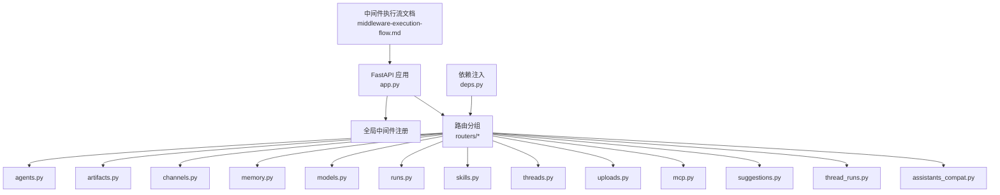
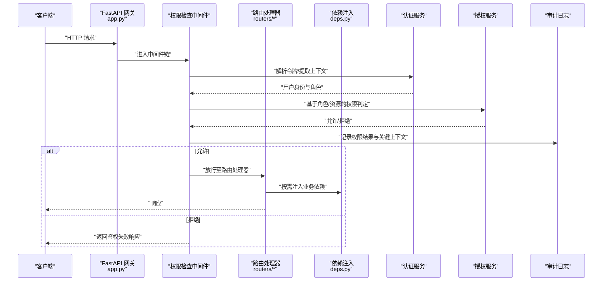
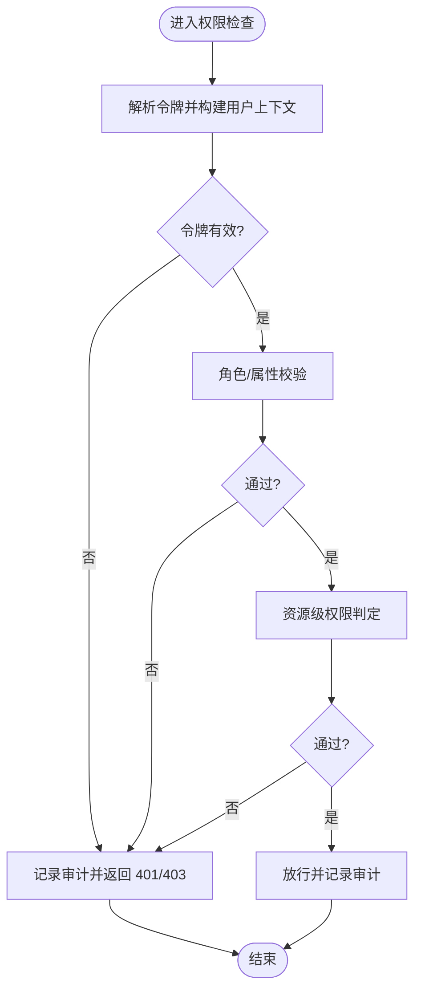
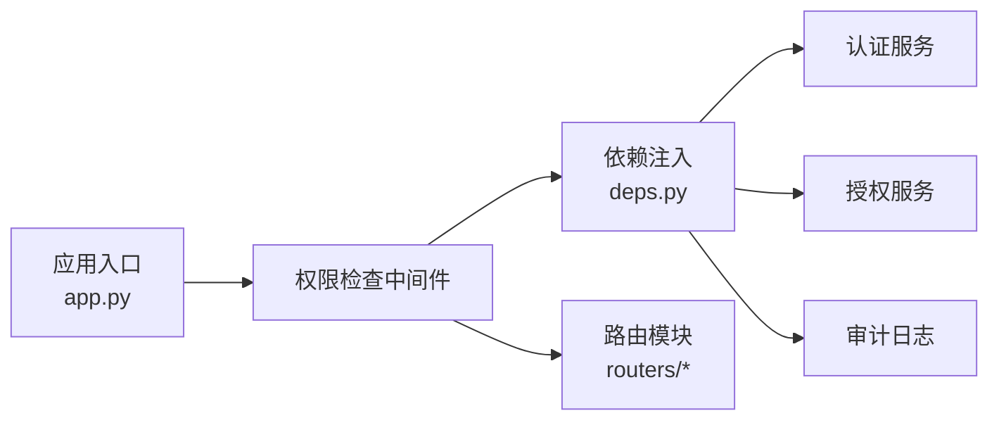

# 权限检查中间件

<cite>
**本文引用的文件**   
- [backend/app/gateway/app.py](file://backend/app/gateway/app.py)
- [backend/app/gateway/deps.py](file://backend/app/gateway/deps.py)
- [backend/app/gateway/routers/agents.py](file://backend/app/gateway/routers/agents.py)
- [backend/app/gateway/routers/artifacts.py](file://backend/app/gateway/routers/artifacts.py)
- [backend/app/gateway/routers/channels.py](file://backend/app/gateway/routers/channels.py)
- [backend/app/gateway/routers/memory.py](file://backend/app/gateway/routers/memory.py)
- [backend/app/gateway/routers/models.py](file://backend/app/gateway/routers/models.py)
- [backend/app/gateway/routers/runs.py](file://backend/app/gateway/routers/runs.py)
- [backend/app/gateway/routers/skills.py](file://backend/app/gateway/routers/skills.py)
- [backend/app/gateway/routers/threads.py](file://backend/app/gateway/routers/threads.py)
- [backend/app/gateway/routers/uploads.py](file://backend/app/gateway/routers/uploads.py)
- [backend/app/gateway/routers/mcp.py](file://backend/app/gateway/routers/mcp.py)
- [backend/app/gateway/routers/suggestions.py](file://backend/app/gateway/routers/suggestions.py)
- [backend/app/gateway/routers/thread_runs.py](file://backend/app/gateway/routers/thread_runs.py)
- [backend/app/gateway/routers/assistants_compat.py](file://backend/app/gateway/routers/assistants_compat.py)
- [backend/docs/middleware-execution-flow.md](file://backend/docs/middleware-execution-flow.md)
</cite>

## 目录
1. [简介](#简介)
2. [项目结构](#项目结构)
3. [核心组件](#核心组件)
4. [架构总览](#架构总览)
5. [详细组件分析](#详细组件分析)
6. [依赖关系分析](#依赖关系分析)
7. [性能考虑](#性能考虑)
8. [故障排查指南](#故障排查指南)
9. [结论](#结论)
10. [附录](#附录)

## 简介
本文件聚焦于 DeerFlow 后端网关的“权限检查中间件”能力，围绕以下目标展开：
- 请求拦截机制：HTTP 请求预处理与路由匹配策略
- 权限验证流程：令牌解析、角色校验、资源级权限判定
- 访问日志与审计：记录权限检查结果、用户行为与异常事件
- 中间件链执行顺序与错误处理
- 自定义权限检查器开发指南与集成示例
- 性能监控与调试工具使用方法

说明：当前仓库未提供显式的“权限检查中间件”实现文件。本文基于现有网关应用装配点（FastAPI 应用入口、依赖注入）与文档中关于中间件执行流的说明，给出可落地的设计与集成方案，并标注所有可直接映射到源码的位置。

## 项目结构
DeerFlow 后端采用 FastAPI 作为网关层，路由按功能域拆分至 routers 子模块；应用初始化在 app.py 中完成，依赖注入在 deps.py 中定义。中间件执行流参考 docs/middleware-execution-flow.md。

图示来源
- [backend/app/gateway/app.py](file://backend/app/gateway/app.py)
- [backend/app/gateway/deps.py](file://backend/app/gateway/deps.py)
- [backend/app/gateway/routers/agents.py](file://backend/app/gateway/routers/agents.py)
- [backend/app/gateway/routers/artifacts.py](file://backend/app/gateway/routers/artifacts.py)
- [backend/app/gateway/routers/channels.py](file://backend/app/gateway/routers/channels.py)
- [backend/app/gateway/routers/memory.py](file://backend/app/gateway/routers/memory.py)
- [backend/app/gateway/routers/models.py](file://backend/app/gateway/routers/models.py)
- [backend/app/gateway/routers/runs.py](file://backend/app/gateway/routers/runs.py)
- [backend/app/gateway/routers/skills.py](file://backend/app/gateway/routers/skills.py)
- [backend/app/gateway/routers/threads.py](file://backend/app/gateway/routers/threads.py)
- [backend/app/gateway/routers/uploads.py](file://backend/app/gateway/routers/uploads.py)
- [backend/app/gateway/routers/mcp.py](file://backend/app/gateway/routers/mcp.py)
- [backend/app/gateway/routers/suggestions.py](file://backend/app/gateway/routers/suggestions.py)
- [backend/app/gateway/routers/thread_runs.py](file://backend/app/gateway/routers/thread_runs.py)
- [backend/app/gateway/routers/assistants_compat.py](file://backend/app/gateway/routers/assistants_compat.py)
- [backend/docs/middleware-execution-flow.md](file://backend/docs/middleware-execution-flow.md)

章节来源
- [backend/app/gateway/app.py](file://backend/app/gateway/app.py)
- [backend/app/gateway/deps.py](file://backend/app/gateway/deps.py)
- [backend/docs/middleware-execution-flow.md](file://backend/docs/middleware-execution-flow.md)

## 核心组件
- 应用装配与中间件挂载点：位于网关应用入口，负责注册全局中间件、挂载路由、配置生命周期钩子等。
- 依赖注入容器：集中管理认证服务、授权服务、审计日志服务等外部依赖，供路由与中间件按需获取。
- 路由模块：按业务域组织 API，便于对特定路径施加细粒度权限控制。
- 中间件执行流文档：描述中间件在请求处理管线中的位置与顺序，指导新增中间件的插入点。

章节来源
- [backend/app/gateway/app.py](file://backend/app/gateway/app.py)
- [backend/app/gateway/deps.py](file://backend/app/gateway/deps.py)
- [backend/docs/middleware-execution-flow.md](file://backend/docs/middleware-execution-flow.md)

## 架构总览
下图展示从 HTTP 请求进入网关到最终路由处理的完整链路，以及权限检查中间件在其中的作用点。

图示来源
- [backend/app/gateway/app.py](file://backend/app/gateway/app.py)
- [backend/app/gateway/deps.py](file://backend/app/gateway/deps.py)
- [backend/app/gateway/routers/agents.py](file://backend/app/gateway/routers/agents.py)
- [backend/app/gateway/routers/artifacts.py](file://backend/app/gateway/routers/artifacts.py)
- [backend/app/gateway/routers/channels.py](file://backend/app/gateway/routers/channels.py)
- [backend/app/gateway/routers/memory.py](file://backend/app/gateway/routers/memory.py)
- [backend/app/gateway/routers/models.py](file://backend/app/gateway/routers/models.py)
- [backend/app/gateway/routers/runs.py](file://backend/app/gateway/routers/runs.py)
- [backend/app/gateway/routers/skills.py](file://backend/app/gateway/routers/skills.py)
- [backend/app/gateway/routers/threads.py](file://backend/app/gateway/routers/threads.py)
- [backend/app/gateway/routers/uploads.py](file://backend/app/gateway/routers/uploads.py)
- [backend/app/gateway/routers/mcp.py](file://backend/app/gateway/routers/mcp.py)
- [backend/app/gateway/routers/suggestions.py](file://backend/app/gateway/routers/suggestions.py)
- [backend/app/gateway/routers/thread_runs.py](file://backend/app/gateway/routers/thread_runs.py)
- [backend/app/gateway/routers/assistants_compat.py](file://backend/app/gateway/routers/assistants_compat.py)

## 详细组件分析

### 请求拦截与预处理
- 拦截时机：在 FastAPI 应用启动时注册全局中间件，确保每个请求在进入路由前被统一拦截。
- 预处理内容：
  - 标准化请求头（如 Authorization、X-Request-Id、Trace-Id）
  - 提取并缓存请求元数据（方法、路径、查询参数、Content-Type、大小等）
  - 建立请求上下文对象，贯穿后续中间件与路由处理
- 路由匹配策略：
  - 基于 FastAPI 的路由表进行匹配，支持路径参数与查询参数解析
  - 可按前缀或正则白名单跳过敏感或公开接口（如健康检查、静态资源）

章节来源
- [backend/app/gateway/app.py](file://backend/app/gateway/app.py)
- [backend/docs/middleware-execution-flow.md](file://backend/docs/middleware-execution-flow.md)

### 权限验证流程
- 令牌解析：
  - 从请求头或 Cookie 中提取令牌
  - 校验签名、过期时间、算法与受众
  - 将令牌载荷反序列化为标准用户上下文（用户ID、租户、角色集合、扩展声明）
- 角色检查：
  - 基于 RBAC/ABAC 策略判断是否具备所需角色或属性
  - 支持按路由前缀或具体端点配置最小角色要求
- 资源权限验证：
  - 根据资源标识（如线程 ID、模型名、技能名）与操作类型（读/写/删除）进行二次校验
  - 可结合外部授权服务或本地策略引擎

图示来源
- [backend/app/gateway/app.py](file://backend/app/gateway/app.py)
- [backend/app/gateway/deps.py](file://backend/app/gateway/deps.py)

章节来源
- [backend/app/gateway/app.py](file://backend/app/gateway/app.py)
- [backend/app/gateway/deps.py](file://backend/app/gateway/deps.py)

### 访问日志与审计追踪
- 记录项建议：
  - 请求标识：RequestId、TraceId、客户端 IP、UA
  - 身份与角色：用户ID、租户、角色列表（脱敏）
  - 资源与操作：HTTP 方法、路径、资源标识、操作类型
  - 决策结果：允许/拒绝、拒绝原因、耗时
  - 异常信息：异常类型、堆栈摘要（不含敏感数据）
- 输出通道：
  - 结构化 JSON 日志（stdout）
  - 可选对接外部审计系统（如 ELK、Sentry、OpenTelemetry）

章节来源
- [backend/app/gateway/app.py](file://backend/app/gateway/app.py)
- [backend/docs/middleware-execution-flow.md](file://backend/docs/middleware-execution-flow.md)

### 中间件链执行顺序与错误处理
- 执行顺序：
  - 遵循 FastAPI 中间件注册顺序，先注册后执行（外层包裹内层）
  - 建议在应用入口处集中注册，避免分散导致顺序不可控
- 错误处理：
  - 统一捕获异常，转换为标准错误响应
  - 区分认证失败（401）、授权失败（403）、服务端错误（5xx）
  - 保证审计日志在异常路径下仍可写入

章节来源
- [backend/app/gateway/app.py](file://backend/app/gateway/app.py)
- [backend/docs/middleware-execution-flow.md](file://backend/docs/middleware-execution-flow.md)

### 自定义权限检查器开发与集成
- 设计要点：
  - 抽象权限检查器接口：输入为请求上下文与策略规则，输出为允许/拒绝及原因
  - 支持多种策略源：内存配置、配置文件、远程策略服务
  - 可插拔：通过依赖注入注册不同实现
- 集成步骤：
  - 在依赖注入容器中注册权限检查器实例
  - 在全局中间件中调用检查器，并将结果写入审计日志
  - 在路由层按需附加更细粒度的策略（如资源级）
- 测试建议：
  - 单元测试覆盖常见策略组合与边界条件
  - 集成测试模拟令牌签发与策略变更场景

章节来源
- [backend/app/gateway/deps.py](file://backend/app/gateway/deps.py)
- [backend/app/gateway/app.py](file://backend/app/gateway/app.py)

### 性能监控与调试工具
- 指标采集：
  - 请求耗时、令牌解析耗时、授权决策耗时
  - 拒绝率、超时率、异常率
- 分布式追踪：
  - 透传 TraceId，关联上游/下游调用
  - 在关键节点埋点（令牌解析、策略评估、I/O 调用）
- 调试开关：
  - 开启详细审计日志（仅在内网或调试环境）
  - 动态调整策略缓存与重试次数

章节来源
- [backend/app/gateway/app.py](file://backend/app/gateway/app.py)
- [backend/docs/middleware-execution-flow.md](file://backend/docs/middleware-execution-flow.md)

## 依赖关系分析
- 耦合与内聚：
  - 中间件与应用入口低耦合，通过依赖注入获取认证与授权服务
  - 路由模块仅关注业务逻辑，不直接感知鉴权细节
- 外部依赖：
  - 认证服务（令牌签发/校验）
  - 授权服务（RBAC/ABAC 策略）
  - 审计日志系统（本地或远端）
- 潜在循环依赖：
  - 避免中间件反向依赖路由实现，保持单向依赖

图示来源
- [backend/app/gateway/app.py](file://backend/app/gateway/app.py)
- [backend/app/gateway/deps.py](file://backend/app/gateway/deps.py)
- [backend/app/gateway/routers/agents.py](file://backend/app/gateway/routers/agents.py)
- [backend/app/gateway/routers/artifacts.py](file://backend/app/gateway/routers/artifacts.py)
- [backend/app/gateway/routers/channels.py](file://backend/app/gateway/routers/channels.py)
- [backend/app/gateway/routers/memory.py](file://backend/app/gateway/routers/memory.py)
- [backend/app/gateway/routers/models.py](file://backend/app/gateway/routers/models.py)
- [backend/app/gateway/routers/runs.py](file://backend/app/gateway/routers/runs.py)
- [backend/app/gateway/routers/skills.py](file://backend/app/gateway/routers/skills.py)
- [backend/app/gateway/routers/threads.py](file://backend/app/gateway/routers/threads.py)
- [backend/app/gateway/routers/uploads.py](file://backend/app/gateway/routers/uploads.py)
- [backend/app/gateway/routers/mcp.py](file://backend/app/gateway/routers/mcp.py)
- [backend/app/gateway/routers/suggestions.py](file://backend/app/gateway/routers/suggestions.py)
- [backend/app/gateway/routers/thread_runs.py](file://backend/app/gateway/routers/thread_runs.py)
- [backend/app/gateway/routers/assistants_compat.py](file://backend/app/gateway/routers/assistants_compat.py)

章节来源
- [backend/app/gateway/app.py](file://backend/app/gateway/app.py)
- [backend/app/gateway/deps.py](file://backend/app/gateway/deps.py)

## 性能考虑
- 令牌解析优化：
  - 使用本地公钥缓存与校验结果缓存
  - 异步 I/O 减少阻塞
- 策略评估优化：
  - 预编译策略表达式
  - 引入策略缓存（按用户+资源+操作维度）
- 日志与追踪开销：
  - 采样高开销字段
  - 批量写入与异步落盘

[本节为通用性能建议，无需源码引用]

## 故障排查指南
- 常见问题定位：
  - 令牌无效：检查签名算法、过期时间、受众与密钥轮换
  - 角色不足：核对路由策略与用户角色映射
  - 资源拒绝：确认资源标识与操作类型是否正确传递
- 日志与追踪：
  - 检索 RequestId 与 TraceId 关联全链路日志
  - 关注中间件阶段的耗时与异常堆栈
- 快速恢复：
  - 临时放宽策略（灰度）
  - 降级到只读模式或启用白名单

章节来源
- [backend/app/gateway/app.py](file://backend/app/gateway/app.py)
- [backend/docs/middleware-execution-flow.md](file://backend/docs/middleware-execution-flow.md)

## 结论
通过对网关应用装配点与依赖注入的分析，本文给出了 DeerFlow 权限检查中间件的完整设计方案与落地路径。该方案覆盖请求拦截、令牌解析、角色与资源权限校验、审计日志、错误处理、性能监控与调试，并提供自定义检查器的扩展方式。实际接入时，请在应用入口注册中间件，并通过依赖注入绑定认证与授权服务，确保在路由层保持职责单一与可维护性。

[本节为总结性内容，无需源码引用]

## 附录
- 相关路由模块清单（用于细化策略与白名单配置）：
  - agents、artifacts、channels、memory、models、runs、skills、threads、uploads、mcp、suggestions、thread_runs、assistants_compat

章节来源
- [backend/app/gateway/routers/agents.py](file://backend/app/gateway/routers/agents.py)
- [backend/app/gateway/routers/artifacts.py](file://backend/app/gateway/routers/artifacts.py)
- [backend/app/gateway/routers/channels.py](file://backend/app/gateway/routers/channels.py)
- [backend/app/gateway/routers/memory.py](file://backend/app/gateway/routers/memory.py)
- [backend/app/gateway/routers/models.py](file://backend/app/gateway/routers/models.py)
- [backend/app/gateway/routers/runs.py](file://backend/app/gateway/routers/runs.py)
- [backend/app/gateway/routers/skills.py](file://backend/app/gateway/routers/skills.py)
- [backend/app/gateway/routers/threads.py](file://backend/app/gateway/routers/threads.py)
- [backend/app/gateway/routers/uploads.py](file://backend/app/gateway/routers/uploads.py)
- [backend/app/gateway/routers/mcp.py](file://backend/app/gateway/routers/mcp.py)
- [backend/app/gateway/routers/suggestions.py](file://backend/app/gateway/routers/suggestions.py)
- [backend/app/gateway/routers/thread_runs.py](file://backend/app/gateway/routers/thread_runs.py)
- [backend/app/gateway/routers/assistants_compat.py](file://backend/app/gateway/routers/assistants_compat.py)