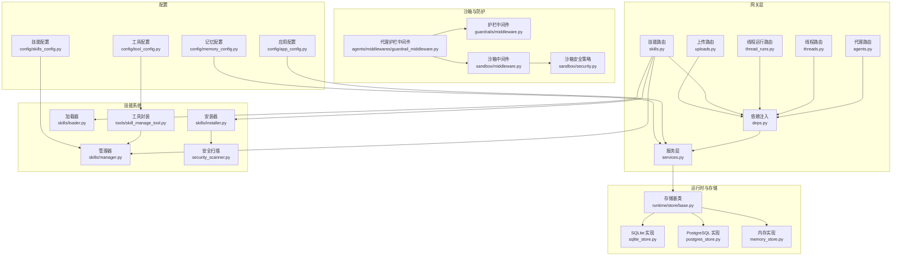
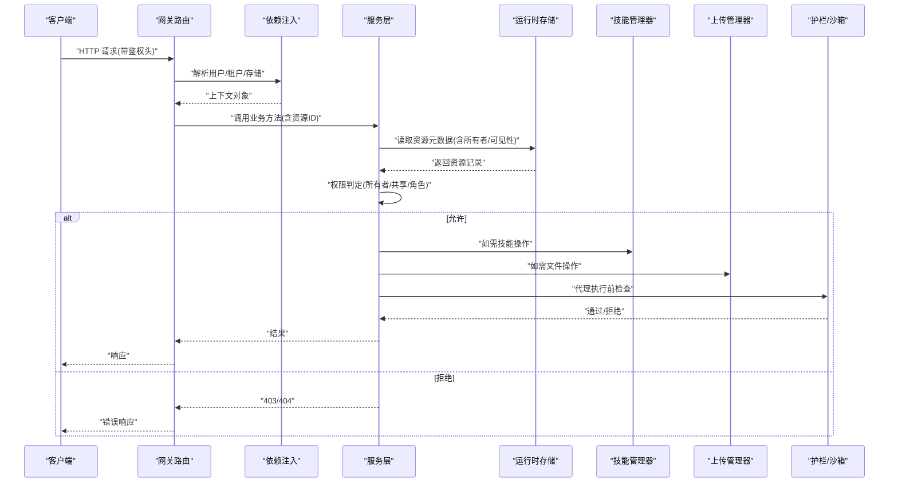
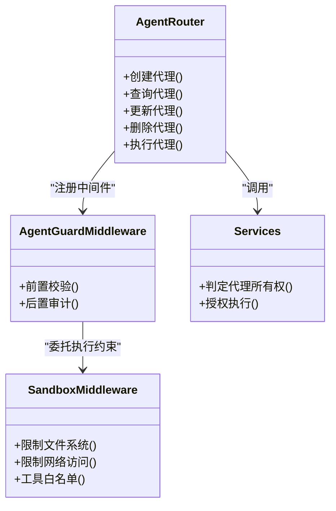
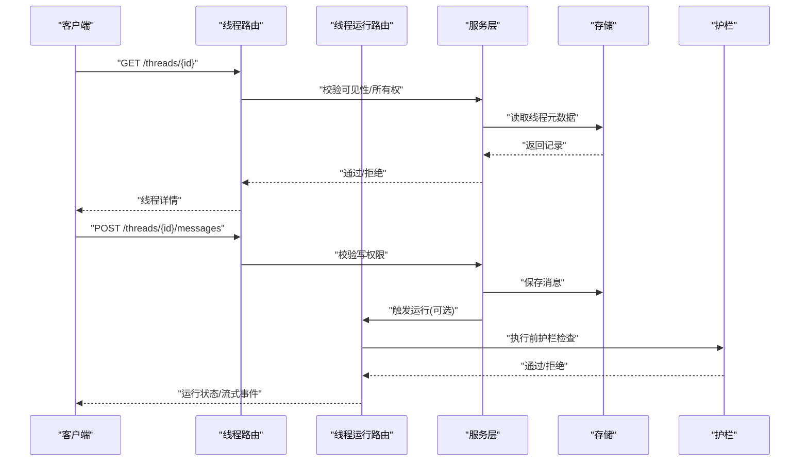
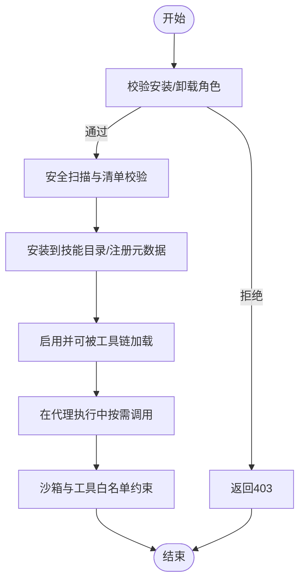
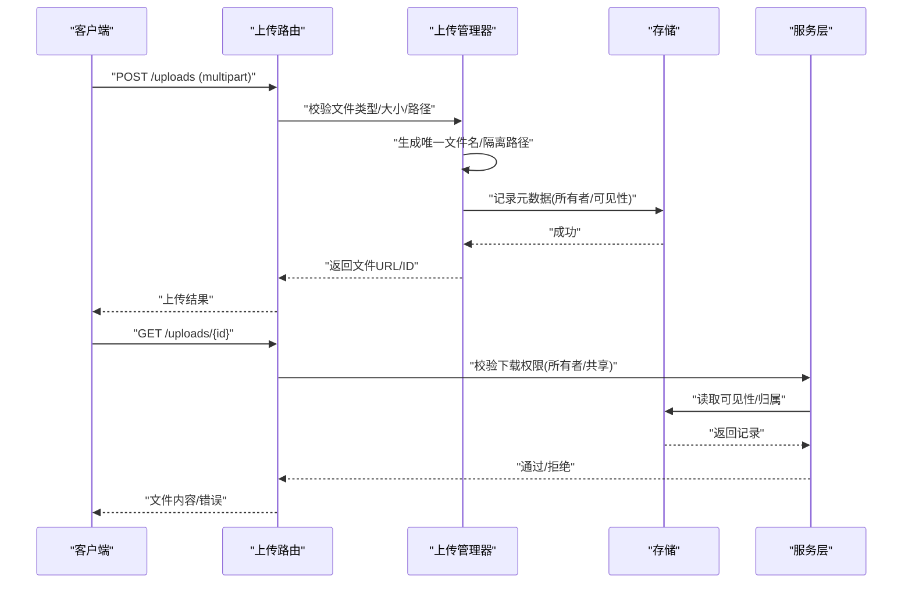
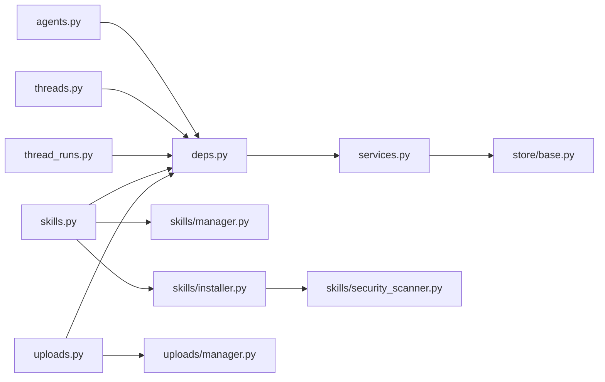

# 资源级权限控制

<cite>
**本文引用的文件**   
- [backend/app/gateway/routers/agents.py](file://backend/app/gateway/routers/agents.py)
- [backend/app/gateway/routers/threads.py](file://backend/app/gateway/routers/threads.py)
- [backend/app/gateway/routers/thread_runs.py](file://backend/app/gateway/routers/thread_runs.py)
- [backend/app/gateway/routers/skills.py](file://backend/app/gateway/routers/skills.py)
- [backend/app/gateway/routers/uploads.py](file://backend/app/gateway/routers/uploads.py)
- [backend/app/gateway/deps.py](file://backend/app/gateway/deps.py)
- [backend/app/gateway/services.py](file://backend/app/gateway/services.py)
- [backend/packages/harness/deerflow/skills/installer.py](file://backend/packages/harness/deerflow/skills/installer.py)
- [backend/packages/harness/deerflow/skills/loader.py](file://backend/packages/harness/deerflow/skills/loader.py)
- [backend/packages/harness/deerflow/skills/manager.py](file://backend/packages/harness/deerflow/skills/manager.py)
- [backend/packages/harness/deerflow/skills/security_scanner.py](file://backend/packages/harness/deerflow/skills/security_scanner.py)
- [backend/packages/harness/deerflow/sandbox/middleware.py](file://backend/packages/harness/deerflow/sandbox/middleware.py)
- [backend/packages/harness/deerflow/sandbox/security.py](file://backend/packages/harness/deerflow/sandbox/security.py)
- [backend/packages/harness/deerflow/tools/skill_manage_tool.py](file://backend/packages/harness/deerflow/tools/skill_manage_tool.py)
- [backend/packages/harness/deerflow/agents/middlewares/guardrail_middleware.py](file://backend/packages/harness/deerflow/agents/middlewares/guardrail_middleware.py)
- [backend/packages/harness/deerflow/guardrails/middleware.py](file://backend/packages/harness/deerflow/guardrails/middleware.py)
- [backend/packages/harness/deerflow/config/app_config.py](file://backend/packages/harness/deerflow/config/app_config.py)
- [backend/packages/harness/deerflow/config/skills_config.py](file://backend/packages/harness/deerflow/config/skills_config.py)
- [backend/packages/harness/deerflow/config/tool_config.py](file://backend/packages/harness/deerflow/config/tool_config.py)
- [backend/packages/harness/deerflow/config/memory_config.py](file://backend/packages/harness/deerflow/config/memory_config.py)
- [backend/packages/harness/deerflow/runtime/store/base.py](file://backend/packages/harness/deerflow/runtime/store/base.py)
- [backend/packages/harness/deerflow/runtime/store/sqlite_store.py](file://backend/packages/harness/deerflow/runtime/store/sqlite_store.py)
- [backend/packages/harness/deerflow/runtime/store/postgres_store.py](file://backend/packages/harness/deerflow/runtime/store/postgres_store.py)
- [backend/packages/harness/deerflow/runtime/store/memory_store.py](file://backend/packages/harness/deerflow/runtime/store/memory_store.py)
- [backend/packages/harness/deerflow/uploads/manager.py](file://backend/packages/harness/deerflow/uploads/manager.py)
- [frontend/src/core/api/api-client.ts](file://frontend/src/core/api/api-client.ts)
- [frontend/src/core/threads/index.ts](file://frontend/src/core/threads/index.ts)
- [frontend/src/core/threads/api.ts](file://frontend/src/core/threads/api.ts)
- [frontend/src/core/uploads/api.ts](file://frontend/src/core/uploads/api.ts)
- [frontend/src/core/skills/api.ts](file://frontend/src/core/skills/api.ts)
</cite>

## 目录
1. [简介](#简介)
2. [项目结构](#项目结构)
3. [核心组件](#核心组件)
4. [架构总览](#架构总览)
5. [详细组件分析](#详细组件分析)
6. [依赖关系分析](#依赖关系分析)
7. [性能考虑](#性能考虑)
8. [故障排查指南](#故障排查指南)
9. [结论](#结论)
10. [附录](#附录)

## 简介
本文件聚焦 DeerFlow 的资源级权限控制，围绕以下四类资源展开：代理（Agent）、线程（Thread）、技能（Skill）与文件（Upload）。文档从网关路由、依赖注入、服务层、运行时存储与沙箱等层面，系统性说明各资源的创建、修改、删除、执行与访问控制策略，并提供配置示例与安全最佳实践。

## 项目结构
DeerFlow 后端采用 FastAPI 网关 + 领域服务 + 运行时存储的分层架构。权限校验在网关层通过依赖注入获取当前用户上下文，并在服务层结合运行时存储进行资源归属判断；技能安装与使用还涉及安全扫描与沙箱隔离；上传下载由独立管理器负责，并受网关与服务层双重校验。

图表来源
- [backend/app/gateway/routers/agents.py](file://backend/app/gateway/routers/agents.py)
- [backend/app/gateway/routers/threads.py](file://backend/app/gateway/routers/threads.py)
- [backend/app/gateway/routers/thread_runs.py](file://backend/app/gateway/routers/thread_runs.py)
- [backend/app/gateway/routers/skills.py](file://backend/app/gateway/routers/skills.py)
- [backend/app/gateway/routers/uploads.py](file://backend/app/gateway/routers/uploads.py)
- [backend/app/gateway/deps.py](file://backend/app/gateway/deps.py)
- [backend/app/gateway/services.py](file://backend/app/gateway/services.py)
- [backend/packages/harness/deerflow/skills/installer.py](file://backend/packages/harness/deerflow/skills/installer.py)
- [backend/packages/harness/deerflow/skills/loader.py](file://backend/packages/harness/deerflow/skills/loader.py)
- [backend/packages/harness/deerflow/skills/manager.py](file://backend/packages/harness/deerflow/skills/manager.py)
- [backend/packages/harness/deerflow/skills/security_scanner.py](file://backend/packages/harness/deerflow/skills/security_scanner.py)
- [backend/packages/harness/deerflow/agents/middlewares/guardrail_middleware.py](file://backend/packages/harness/deerflow/agents/middlewares/guardrail_middleware.py)
- [backend/packages/harness/deerflow/guardrails/middleware.py](file://backend/packages/harness/deerflow/guardrails/middleware.py)
- [backend/packages/harness/deerflow/sandbox/middleware.py](file://backend/packages/harness/deerflow/sandbox/middleware.py)
- [backend/packages/harness/deerflow/sandbox/security.py](file://backend/packages/harness/deerflow/sandbox/security.py)
- [backend/packages/harness/deerflow/config/app_config.py](file://backend/packages/harness/deerflow/config/app_config.py)
- [backend/packages/harness/deerflow/config/skills_config.py](file://backend/packages/harness/deerflow/config/skills_config.py)
- [backend/packages/harness/deerflow/config/tool_config.py](file://backend/packages/harness/deerflow/config/tool_config.py)
- [backend/packages/harness/deerflow/config/memory_config.py](file://backend/packages/harness/deerflow/config/memory_config.py)
- [backend/packages/harness/deerflow/runtime/store/base.py](file://backend/packages/harness/deerflow/runtime/store/base.py)
- [backend/packages/harness/deerflow/runtime/store/sqlite_store.py](file://backend/packages/harness/deerflow/runtime/store/sqlite_store.py)
- [backend/packages/harness/deerflow/runtime/store/postgres_store.py](file://backend/packages/harness/deerflow/runtime/store/postgres_store.py)
- [backend/packages/harness/deerflow/runtime/store/memory_store.py](file://backend/packages/harness/deerflow/runtime/store/memory_store.py)
- [backend/packages/harness/deerflow/uploads/manager.py](file://backend/packages/harness/deerflow/uploads/manager.py)

章节来源
- [backend/app/gateway/routers/agents.py](file://backend/app/gateway/routers/agents.py)
- [backend/app/gateway/routers/threads.py](file://backend/app/gateway/routers/threads.py)
- [backend/app/gateway/routers/thread_runs.py](file://backend/app/gateway/routers/thread_runs.py)
- [backend/app/gateway/routers/skills.py](file://backend/app/gateway/routers/skills.py)
- [backend/app/gateway/routers/uploads.py](file://backend/app/gateway/routers/uploads.py)
- [backend/app/gateway/deps.py](file://backend/app/gateway/deps.py)
- [backend/app/gateway/services.py](file://backend/app/gateway/services.py)
- [backend/packages/harness/deerflow/skills/installer.py](file://backend/packages/harness/deerflow/skills/installer.py)
- [backend/packages/harness/deerflow/skills/loader.py](file://backend/packages/harness/deerflow/skills/loader.py)
- [backend/packages/harness/deerflow/skills/manager.py](file://backend/packages/harness/deerflow/skills/manager.py)
- [backend/packages/harness/deerflow/skills/security_scanner.py](file://backend/packages/harness/deerflow/skills/security_scanner.py)
- [backend/packages/harness/deerflow/agents/middlewares/guardrail_middleware.py](file://backend/packages/harness/deerflow/agents/middlewares/guardrail_middleware.py)
- [backend/packages/harness/deerflow/guardrails/middleware.py](file://backend/packages/harness/deerflow/guardrails/middleware.py)
- [backend/packages/harness/deerflow/sandbox/middleware.py](file://backend/packages/harness/deerflow/sandbox/middleware.py)
- [backend/packages/harness/deerflow/sandbox/security.py](file://backend/packages/harness/deerflow/sandbox/security.py)
- [backend/packages/harness/deerflow/config/app_config.py](file://backend/packages/harness/deerflow/config/app_config.py)
- [backend/packages/harness/deerflow/config/skills_config.py](file://backend/packages/harness/deerflow/config/skills_config.py)
- [backend/packages/harness/deerflow/config/tool_config.py](file://backend/packages/harness/deerflow/config/tool_config.py)
- [backend/packages/harness/deerflow/config/memory_config.py](file://backend/packages/harness/deerflow/config/memory_config.py)
- [backend/packages/harness/deerflow/runtime/store/base.py](file://backend/packages/harness/deerflow/runtime/store/base.py)
- [backend/packages/harness/deerflow/runtime/store/sqlite_store.py](file://backend/packages/harness/deerflow/runtime/store/sqlite_store.py)
- [backend/packages/harness/deerflow/runtime/store/postgres_store.py](file://backend/packages/harness/deerflow/runtime/store/postgres_store.py)
- [backend/packages/harness/deerflow/runtime/store/memory_store.py](file://backend/packages/harness/deerflow/runtime/store/memory_store.py)
- [backend/packages/harness/deerflow/uploads/manager.py](file://backend/packages/harness/deerflow/uploads/manager.py)

## 核心组件
- 网关路由层：定义代理、线程、技能、上传等 REST 接口，统一通过依赖注入解析认证上下文与请求参数。
- 依赖注入层：提供当前用户身份、租户/工作区上下文、存储实例、配置对象等。
- 服务层：聚合业务逻辑，执行资源级权限校验（如“仅创建者可读/改/删”），调用存储与外部能力。
- 运行时存储：以抽象接口提供线程、消息、元数据等持久化能力，支持多后端。
- 技能系统：包含安装、加载、管理、安全扫描与工具封装，支持受限环境下的安全执行。
- 沙箱与护栏：对代理执行过程进行输入输出过滤、工具白名单、网络与文件系统限制。
- 上传管理器：处理文件上传、类型/大小校验、路径隔离与访问控制。

章节来源
- [backend/app/gateway/deps.py](file://backend/app/gateway/deps.py)
- [backend/app/gateway/services.py](file://backend/app/gateway/services.py)
- [backend/packages/harness/deerflow/runtime/store/base.py](file://backend/packages/harness/deerflow/runtime/store/base.py)
- [backend/packages/harness/deerflow/skills/manager.py](file://backend/packages/harness/deerflow/skills/manager.py)
- [backend/packages/harness/deerflow/sandbox/middleware.py](file://backend/packages/harness/deerflow/sandbox/middleware.py)
- [backend/packages/harness/deerflow/uploads/manager.py](file://backend/packages/harness/deerflow/uploads/manager.py)

## 架构总览
下图展示资源级权限控制的关键交互：网关路由接收请求，依赖注入层提供用户上下文与存储；服务层基于资源所有者或角色进行授权决策；技能与上传分别走专用管理器；代理执行经护栏与沙箱保护。

图表来源
- [backend/app/gateway/routers/agents.py](file://backend/app/gateway/routers/agents.py)
- [backend/app/gateway/routers/threads.py](file://backend/app/gateway/routers/threads.py)
- [backend/app/gateway/routers/thread_runs.py](file://backend/app/gateway/routers/thread_runs.py)
- [backend/app/gateway/routers/skills.py](file://backend/app/gateway/routers/skills.py)
- [backend/app/gateway/routers/uploads.py](file://backend/app/gateway/routers/uploads.py)
- [backend/app/gateway/deps.py](file://backend/app/gateway/deps.py)
- [backend/app/gateway/services.py](file://backend/app/gateway/services.py)
- [backend/packages/harness/deerflow/skills/manager.py](file://backend/packages/harness/deerflow/skills/manager.py)
- [backend/packages/harness/deerflow/uploads/manager.py](file://backend/packages/harness/deerflow/uploads/manager.py)
- [backend/packages/harness/deerflow/agents/middlewares/guardrail_middleware.py](file://backend/packages/harness/deerflow/agents/middlewares/guardrail_middleware.py)
- [backend/packages/harness/deerflow/sandbox/middleware.py](file://backend/packages/harness/deerflow/sandbox/middleware.py)

## 详细组件分析

### 代理资源权限控制
- 覆盖范围：代理的创建、查看、修改、删除与执行。
- 关键流程：
  - 创建：需具备管理员或特定角色；写入代理元数据时绑定创建者标识。
  - 查看/修改/删除：默认遵循“仅创建者可操作”，可通过共享策略扩展。
  - 执行：进入护栏与沙箱，校验工具白名单、网络与文件系统访问策略。
- 相关实现位置：
  - 路由与依赖注入：[backend/app/gateway/routers/agents.py](file://backend/app/gateway/routers/agents.py)、[backend/app/gateway/deps.py](file://backend/app/gateway/deps.py)
  - 服务层权限判定：[backend/app/gateway/services.py](file://backend/app/gateway/services.py)
  - 护栏与沙箱：[backend/packages/harness/deerflow/agents/middlewares/guardrail_middleware.py](file://backend/packages/harness/deerflow/agents/middlewares/guardrail_middleware.py)、[backend/packages/harness/deerflow/sandbox/middleware.py](file://backend/packages/harness/deerflow/sandbox/middleware.py)、[backend/packages/harness/deerflow/sandbox/security.py](file://backend/packages/harness/deerflow/sandbox/security.py)

图表来源
- [backend/app/gateway/routers/agents.py](file://backend/app/gateway/routers/agents.py)
- [backend/app/gateway/services.py](file://backend/app/gateway/services.py)
- [backend/packages/harness/deerflow/agents/middlewares/guardrail_middleware.py](file://backend/packages/harness/deerflow/agents/middlewares/guardrail_middleware.py)
- [backend/packages/harness/deerflow/sandbox/middleware.py](file://backend/packages/harness/deerflow/sandbox/middleware.py)
- [backend/packages/harness/deerflow/sandbox/security.py](file://backend/packages/harness/deerflow/sandbox/security.py)

章节来源
- [backend/app/gateway/routers/agents.py](file://backend/app/gateway/routers/agents.py)
- [backend/app/gateway/deps.py](file://backend/app/gateway/deps.py)
- [backend/app/gateway/services.py](file://backend/app/gateway/services.py)
- [backend/packages/harness/deerflow/agents/middlewares/guardrail_middleware.py](file://backend/packages/harness/deerflow/agents/middlewares/guardrail_middleware.py)
- [backend/packages/harness/deerflow/sandbox/middleware.py](file://backend/packages/harness/deerflow/sandbox/middleware.py)
- [backend/packages/harness/deerflow/sandbox/security.py](file://backend/packages/harness/deerflow/sandbox/security.py)

### 线程资源权限控制
- 覆盖范围：线程查看、消息发送、历史记录读取。
- 关键流程：
  - 查看：根据线程可见性与所有者判定；支持团队/共享场景。
  - 发送消息：要求对线程有写权限；写入消息后触发后续运行。
  - 历史：按分页与时间窗口拉取，受同一可见性规则约束。
- 相关实现位置：
  - 路由与运行入口：[backend/app/gateway/routers/threads.py](file://backend/app/gateway/routers/threads.py)、[backend/app/gateway/routers/thread_runs.py](file://backend/app/gateway/routers/thread_runs.py)
  - 服务层与存储：[backend/app/gateway/services.py](file://backend/app/gateway/services.py)、[backend/packages/harness/deerflow/runtime/store/base.py](file://backend/packages/harness/deerflow/runtime/store/base.py)

图表来源
- [backend/app/gateway/routers/threads.py](file://backend/app/gateway/routers/threads.py)
- [backend/app/gateway/routers/thread_runs.py](file://backend/app/gateway/routers/thread_runs.py)
- [backend/app/gateway/services.py](file://backend/app/gateway/services.py)
- [backend/packages/harness/deerflow/runtime/store/base.py](file://backend/packages/harness/deerflow/runtime/store/base.py)
- [backend/packages/harness/deerflow/agents/middlewares/guardrail_middleware.py](file://backend/packages/harness/deerflow/agents/middlewares/guardrail_middleware.py)

章节来源
- [backend/app/gateway/routers/threads.py](file://backend/app/gateway/routers/threads.py)
- [backend/app/gateway/routers/thread_runs.py](file://backend/app/gateway/routers/thread_runs.py)
- [backend/app/gateway/services.py](file://backend/app/gateway/services.py)
- [backend/packages/harness/deerflow/runtime/store/base.py](file://backend/packages/harness/deerflow/runtime/store/base.py)

### 技能资源权限控制
- 覆盖范围：技能安装、卸载、使用。
- 关键流程：
  - 安装：管理员或具备安装权限的用户；安装前进行安全扫描与清单校验。
  - 卸载：仅创建者或管理员可执行。
  - 使用：在工具链中按需加载，受工具白名单与沙箱策略约束。
- 相关实现位置：
  - 路由：[backend/app/gateway/routers/skills.py](file://backend/app/gateway/routers/skills.py)
  - 安装器/加载器/管理器：[backend/packages/harness/deerflow/skills/installer.py](file://backend/packages/harness/deerflow/skills/installer.py)、[backend/packages/harness/deerflow/skills/loader.py](file://backend/packages/harness/deerflow/skills/loader.py)、[backend/packages/harness/deerflow/skills/manager.py](file://backend/packages/harness/deerflow/skills/manager.py)
  - 安全扫描：[backend/packages/harness/deerflow/skills/security_scanner.py](file://backend/packages/harness/deerflow/skills/security_scanner.py)
  - 工具封装：[backend/packages/harness/deerflow/tools/skill_manage_tool.py](file://backend/packages/harness/deerflow/tools/skill_manage_tool.py)

图表来源
- [backend/app/gateway/routers/skills.py](file://backend/app/gateway/routers/skills.py)
- [backend/packages/harness/deerflow/skills/installer.py](file://backend/packages/harness/deerflow/skills/installer.py)
- [backend/packages/harness/deerflow/skills/loader.py](file://backend/packages/harness/deerflow/skills/loader.py)
- [backend/packages/harness/deerflow/skills/manager.py](file://backend/packages/harness/deerflow/skills/manager.py)
- [backend/packages/harness/deerflow/skills/security_scanner.py](file://backend/packages/harness/deerflow/skills/security_scanner.py)
- [backend/packages/harness/deerflow/tools/skill_manage_tool.py](file://backend/packages/harness/deerflow/tools/skill_manage_tool.py)

章节来源
- [backend/app/gateway/routers/skills.py](file://backend/app/gateway/routers/skills.py)
- [backend/packages/harness/deerflow/skills/installer.py](file://backend/packages/harness/deerflow/skills/installer.py)
- [backend/packages/harness/deerflow/skills/loader.py](file://backend/packages/harness/deerflow/skills/loader.py)
- [backend/packages/harness/deerflow/skills/manager.py](file://backend/packages/harness/deerflow/skills/manager.py)
- [backend/packages/harness/deerflow/skills/security_scanner.py](file://backend/packages/harness/deerflow/skills/security_scanner.py)
- [backend/packages/harness/deerflow/tools/skill_manage_tool.py](file://backend/packages/harness/deerflow/tools/skill_manage_tool.py)

### 文件资源权限控制
- 覆盖范围：上传、下载、共享文件的访问控制。
- 关键流程：
  - 上传：校验类型、大小、命名规范；落盘至隔离目录；记录元数据与所有者。
  - 下载：校验请求者对文件或所属线程/代理的访问权限。
  - 共享：基于资源可见性策略控制跨用户/团队的访问。
- 相关实现位置：
  - 路由：[backend/app/gateway/routers/uploads.py](file://backend/app/gateway/routers/uploads.py)
  - 上传管理器：[backend/packages/harness/deerflow/uploads/manager.py](file://backend/packages/harness/deerflow/uploads/manager.py)
  - 存储与可见性：[backend/packages/harness/deerflow/runtime/store/base.py](file://backend/packages/harness/deerflow/runtime/store/base.py)

图表来源
- [backend/app/gateway/routers/uploads.py](file://backend/app/gateway/routers/uploads.py)
- [backend/packages/harness/deerflow/uploads/manager.py](file://backend/packages/harness/deerflow/uploads/manager.py)
- [backend/packages/harness/deerflow/runtime/store/base.py](file://backend/packages/harness/deerflow/runtime/store/base.py)

章节来源
- [backend/app/gateway/routers/uploads.py](file://backend/app/gateway/routers/uploads.py)
- [backend/packages/harness/deerflow/uploads/manager.py](file://backend/packages/harness/deerflow/uploads/manager.py)
- [backend/packages/harness/deerflow/runtime/store/base.py](file://backend/packages/harness/deerflow/runtime/store/base.py)

### 前端侧权限相关要点
- API 客户端统一携带鉴权头，确保服务端能识别用户身份。
- 线程与上传模块在前端发起请求时附带会话上下文，配合后端权限判定。
- 技能模块在前端提供安装/卸载入口，但实际权限校验在服务端完成。

章节来源
- [frontend/src/core/api/api-client.ts](file://frontend/src/core/api/api-client.ts)
- [frontend/src/core/threads/index.ts](file://frontend/src/core/threads/index.ts)
- [frontend/src/core/threads/api.ts](file://frontend/src/core/threads/api.ts)
- [frontend/src/core/uploads/api.ts](file://frontend/src/core/uploads/api.ts)
- [frontend/src/core/skills/api.ts](file://frontend/src/core/skills/api.ts)

## 依赖关系分析
- 网关路由强耦合于依赖注入与服务层，避免在路由中直接实现复杂权限逻辑。
- 服务层依赖运行时存储抽象，便于在不同后端间切换并保持权限判定一致。
- 技能系统与沙箱相互协作：安装阶段安全扫描，运行阶段沙箱约束。
- 上传管理器与存储解耦，通过元数据承载可见性与归属信息。

图表来源
- [backend/app/gateway/routers/agents.py](file://backend/app/gateway/routers/agents.py)
- [backend/app/gateway/routers/threads.py](file://backend/app/gateway/routers/threads.py)
- [backend/app/gateway/routers/thread_runs.py](file://backend/app/gateway/routers/thread_runs.py)
- [backend/app/gateway/routers/skills.py](file://backend/app/gateway/routers/skills.py)
- [backend/app/gateway/routers/uploads.py](file://backend/app/gateway/routers/uploads.py)
- [backend/app/gateway/deps.py](file://backend/app/gateway/deps.py)
- [backend/app/gateway/services.py](file://backend/app/gateway/services.py)
- [backend/packages/harness/deerflow/runtime/store/base.py](file://backend/packages/harness/deerflow/runtime/store/base.py)
- [backend/packages/harness/deerflow/skills/manager.py](file://backend/packages/harness/deerflow/skills/manager.py)
- [backend/packages/harness/deerflow/skills/installer.py](file://backend/packages/harness/deerflow/skills/installer.py)
- [backend/packages/harness/deerflow/skills/security_scanner.py](file://backend/packages/harness/deerflow/skills/security_scanner.py)
- [backend/packages/harness/deerflow/uploads/manager.py](file://backend/packages/harness/deerflow/uploads/manager.py)

章节来源
- [backend/app/gateway/deps.py](file://backend/app/gateway/deps.py)
- [backend/app/gateway/services.py](file://backend/app/gateway/services.py)
- [backend/packages/harness/deerflow/runtime/store/base.py](file://backend/packages/harness/deerflow/runtime/store/base.py)

## 性能考虑
- 权限判定尽量缓存高频只读元数据（如线程可见性、所有者），减少重复 IO。
- 技能安装前的安全扫描应异步化或限流，避免阻塞主流程。
- 上传大文件采用分片与断点续传，降低超时风险。
- 沙箱与护栏的检查应在最小必要范围内执行，避免过度拦截导致延迟。

## 故障排查指南
- 403 未授权：检查依赖注入是否成功解析用户上下文；确认服务层所有权/可见性判定逻辑。
- 404 资源不存在：核对存储查询条件与 ID 映射；确认资源未被软删除。
- 技能安装失败：查看安全扫描日志与清单校验错误；确认安装者具备相应角色。
- 上传失败：检查文件大小/类型限制、磁盘配额与路径隔离策略。
- 代理执行被拒：定位护栏与沙箱中间件的拒绝原因（工具白名单、网络/文件访问限制）。

章节来源
- [backend/app/gateway/services.py](file://backend/app/gateway/services.py)
- [backend/packages/harness/deerflow/skills/security_scanner.py](file://backend/packages/harness/deerflow/skills/security_scanner.py)
- [backend/packages/harness/deerflow/sandbox/middleware.py](file://backend/packages/harness/deerflow/sandbox/middleware.py)
- [backend/packages/harness/deerflow/uploads/manager.py](file://backend/packages/harness/deerflow/uploads/manager.py)

## 结论
DeerFlow 的资源级权限控制以“网关鉴权 + 服务层授权 + 存储可见性 + 沙箱约束”为核心，覆盖代理、线程、技能与文件四大资源。通过清晰的职责分层与可扩展的配置项，既保证了安全性，也兼顾了灵活性。建议在生产环境中启用严格的安全扫描、沙箱策略与细粒度可见性控制，并结合审计日志持续优化。

## 附录

### 资源权限矩阵（示例）
- 代理
  - 创建：管理员/指定角色
  - 查看：所有者/共享成员/公开
  - 修改：所有者/管理员
  - 删除：所有者/管理员
  - 执行：具备运行权限且通过护栏/沙箱检查
- 线程
  - 查看：所有者/共享成员/公开
  - 发消息：写权限（所有者/协作者）
  - 历史：同查看权限
- 技能
  - 安装：管理员/指定角色
  - 卸载：所有者/管理员
  - 使用：已安装且通过工具白名单
- 文件
  - 上传：登录用户（受类型/大小限制）
  - 下载：所有者/共享成员/公开
  - 共享：基于资源可见性策略

### 配置示例（节选）
- 应用配置（权限与护栏开关）
  - 参考路径：[backend/packages/harness/deerflow/config/app_config.py](file://backend/packages/harness/deerflow/config/app_config.py)
- 技能配置（安装/加载/扫描策略）
  - 参考路径：[backend/packages/harness/deerflow/config/skills_config.py](file://backend/packages/harness/deerflow/config/skills_config.py)
- 工具配置（白名单/限制）
  - 参考路径：[backend/packages/harness/deerflow/config/tool_config.py](file://backend/packages/harness/deerflow/config/tool_config.py)
- 记忆配置（线程/消息存储后端）
  - 参考路径：[backend/packages/harness/deerflow/config/memory_config.py](file://backend/packages/harness/deerflow/config/memory_config.py)

### 安全最佳实践
- 最小权限原则：默认拒绝，显式授予。
- 所有资源绑定创建者与可见性，禁止隐式全局可读。
- 技能安装强制安全扫描与清单校验，禁用危险脚本。
- 沙箱隔离执行环境，限制文件系统与网络访问。
- 上传文件类型白名单与大小上限，路径随机化与隔离。
- 开启审计日志，记录权限判定与拒绝原因。