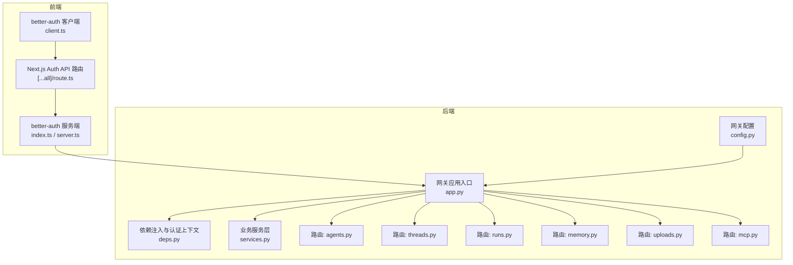
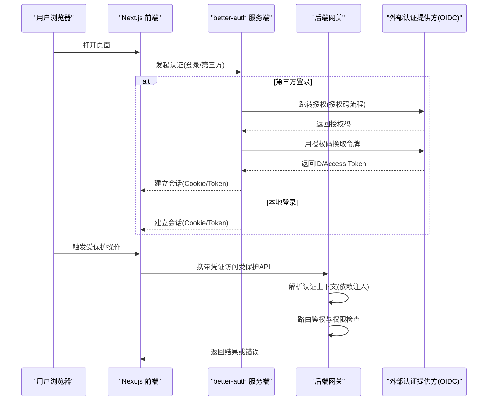
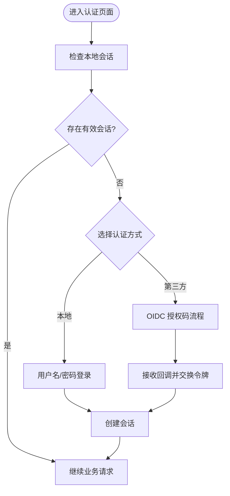
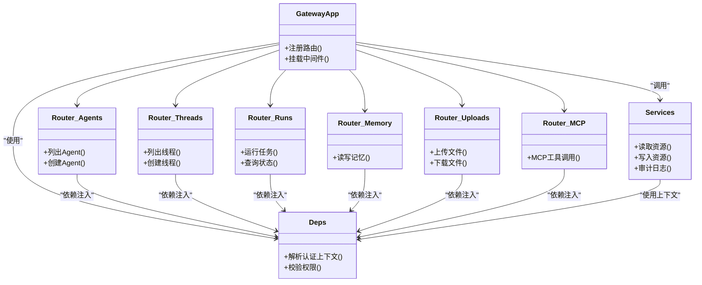
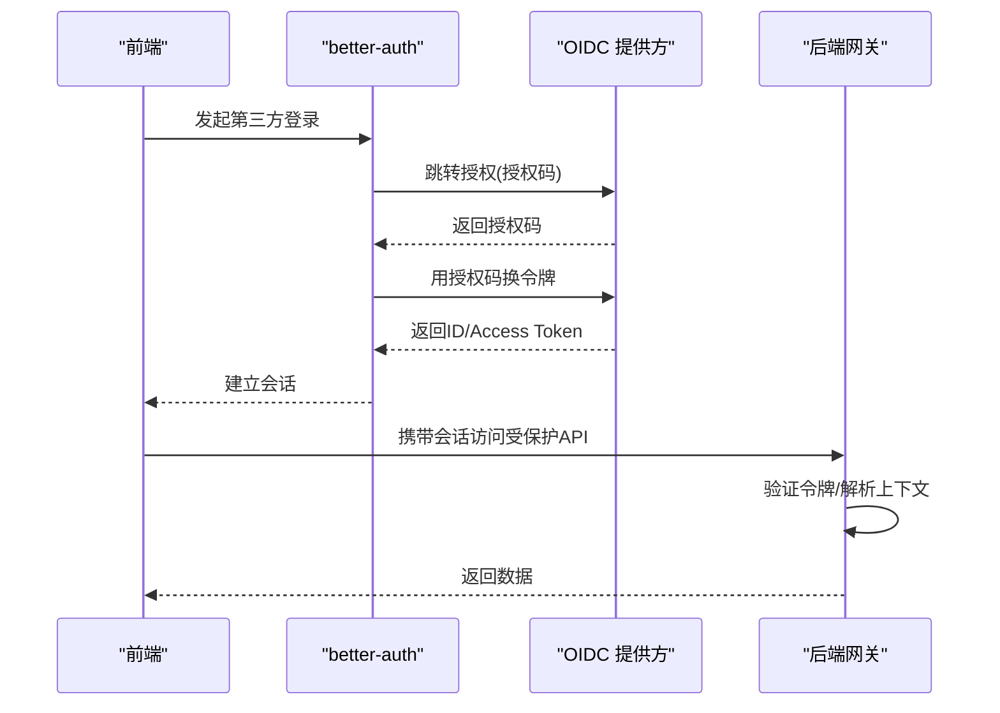
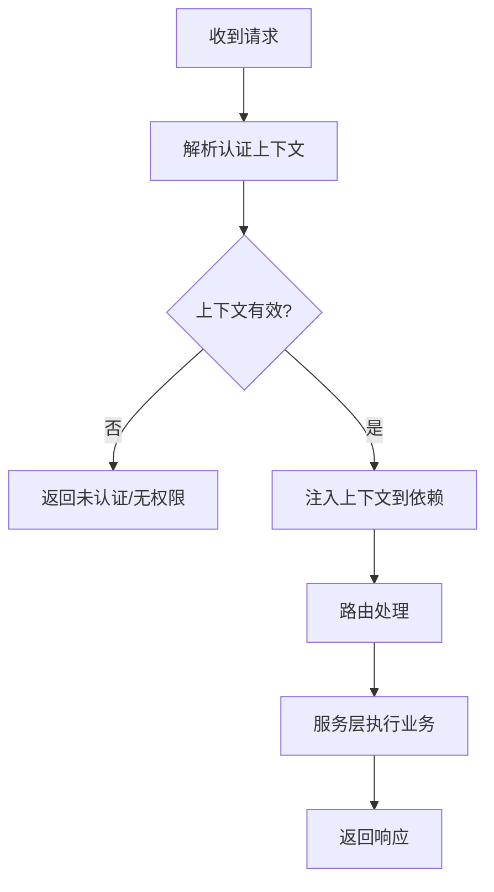
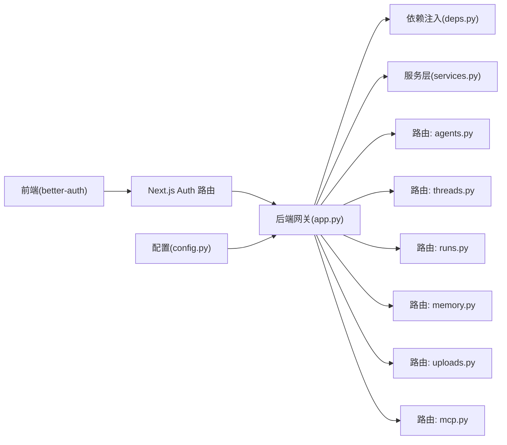

# 认证机制

<cite>
**本文引用的文件**   
- [backend/app/gateway/routers/agents.py](file://backend/app/gateway/routers/agents.py)
- [backend/app/gateway/routers/artifacts.py](file://backend/app/gateway/routers/artifacts.py)
- [backend/app/gateway/routers/channels.py](file://backend/app/gateway/routers/channels.py)
- [backend/app/gateway/routers/mcp.py](file://backend/app/gateway/routers/mcp.py)
- [backend/app/gateway/routers/memory.py](file://backend/app/gateway/routers/memory.py)
- [backend/app/gateway/routers/models.py](file://backend/app/gateway/routers/models.py)
- [backend/app/gateway/routers/runs.py](file://backend/app/gateway/routers/runs.py)
- [backend/app/gateway/routers/skills.py](file://backend/app/gateway/routers/skills.py)
- [backend/app/gateway/routers/suggestions.py](file://backend/app/gateway/routers/suggestions.py)
- [backend/app/gateway/routers/thread_runs.py](file://backend/app/gateway/routers/thread_runs.py)
- [backend/app/gateway/routers/threads.py](file://backend/app/gateway/routers/threads.py)
- [backend/app/gateway/routers/uploads.py](file://backend/app/gateway/routers/uploads.py)
- [backend/app/gateway/deps.py](file://backend/app/gateway/deps.py)
- [backend/app/gateway/services.py](file://backend/app/gateway/services.py)
- [backend/app/gateway/config.py](file://backend/app/gateway/config.py)
- [backend/app/gateway/app.py](file://backend/app/gateway/app.py)
- [frontend/src/server/better-auth/index.ts](file://frontend/src/server/better-auth/index.ts)
- [frontend/src/server/better-auth/server.ts](file://frontend/src/server/better-auth/server.ts)
- [frontend/src/server/better-auth/client.ts](file://frontend/src/server/better-auth/client.ts)
- [frontend/src/server/better-auth/config.ts](file://frontend/src/server/better-auth/config.ts)
- [frontend/src/app/api/auth/[...all]/route.ts](file://frontend/src/app/api/auth/[...all]/route.ts)
</cite>

## 目录
1. [简介](#简介)
2. [项目结构](#项目结构)
3. [核心组件](#核心组件)
4. [架构总览](#架构总览)
5. [详细组件分析](#详细组件分析)
6. [依赖关系分析](#依赖关系分析)
7. [性能考虑](#性能考虑)
8. [故障排除指南](#故障排除指南)
9. [结论](#结论)
10. [附录](#附录)

## 简介
本文件系统性梳理 DeerFlow 的认证机制，覆盖以下方面：
- 本地认证系统：用户密码验证、管理员账户初始化与安全策略
- OIDC 集成：OAuth2.0 授权码流程、JWT 令牌生成与校验、用户信息同步
- 内部服务认证：服务间通信安全验证与 API 密钥管理
- 多提供商认证架构：认证提供者抽象接口与动态加载机制
- 认证中间件：实现原理与请求处理流程
- 配置示例与常见问题排查

说明：当前仓库中前端采用 Next.js 并集成 better-auth 提供统一认证入口；后端网关层通过依赖注入解析认证上下文并对受保护路由进行鉴权。具体实现细节以各源文件为准。

## 项目结构
认证相关代码主要分布在前后端：
- 前端（Next.js）
  - better-auth 服务端与客户端封装
  - Next.js API Route 代理到 better-auth
- 后端（FastAPI 网关）
  - 路由层对受保护资源进行鉴权
  - 依赖注入解析认证上下文
  - 服务层与配置项支撑认证行为

图表来源
- [frontend/src/server/better-auth/index.ts](file://frontend/src/server/better-auth/index.ts)
- [frontend/src/server/better-auth/server.ts](file://frontend/src/server/better-auth/server.ts)
- [frontend/src/server/better-auth/client.ts](file://frontend/src/server/better-auth/client.ts)
- [frontend/src/app/api/auth/[...all]/route.ts](file://frontend/src/app/api/auth/[...all]/route.ts)
- [backend/app/gateway/app.py](file://backend/app/gateway/app.py)
- [backend/app/gateway/deps.py](file://backend/app/gateway/deps.py)
- [backend/app/gateway/services.py](file://backend/app/gateway/services.py)
- [backend/app/gateway/config.py](file://backend/app/gateway/config.py)
- [backend/app/gateway/routers/agents.py](file://backend/app/gateway/routers/agents.py)
- [backend/app/gateway/routers/threads.py](file://backend/app/gateway/routers/threads.py)
- [backend/app/gateway/routers/runs.py](file://backend/app/gateway/routers/runs.py)
- [backend/app/gateway/routers/memory.py](file://backend/app/gateway/routers/memory.py)
- [backend/app/gateway/routers/uploads.py](file://backend/app/gateway/routers/uploads.py)
- [backend/app/gateway/routers/mcp.py](file://backend/app/gateway/routers/mcp.py)

章节来源
- [backend/app/gateway/app.py](file://backend/app/gateway/app.py)
- [backend/app/gateway/deps.py](file://backend/app/gateway/deps.py)
- [backend/app/gateway/services.py](file://backend/app/gateway/services.py)
- [backend/app/gateway/config.py](file://backend/app/gateway/config.py)
- [frontend/src/server/better-auth/index.ts](file://frontend/src/server/better-auth/index.ts)
- [frontend/src/server/better-auth/server.ts](file://frontend/src/server/better-auth/server.ts)
- [frontend/src/server/better-auth/client.ts](file://frontend/src/server/better-auth/client.ts)
- [frontend/src/app/api/auth/[...all]/route.ts](file://frontend/src/app/api/auth/[...all]/route.ts)

## 核心组件
- 前端 better-auth 集成
  - 服务端初始化与配置
  - 客户端 SDK 调用
  - Next.js API 路由转发至 better-auth
- 后端网关认证
  - 依赖注入解析认证上下文（如用户身份、权限）
  - 路由级鉴权装饰器或依赖
  - 服务层访问控制与审计
- 配置与策略
  - 认证开关、提供者选择、密钥与超时等

章节来源
- [frontend/src/server/better-auth/index.ts](file://frontend/src/server/better-auth/index.ts)
- [frontend/src/server/better-auth/server.ts](file://frontend/src/server/better-auth/server.ts)
- [frontend/src/server/better-auth/client.ts](file://frontend/src/server/better-auth/client.ts)
- [frontend/src/app/api/auth/[...all]/route.ts](file://frontend/src/app/api/auth/[...all]/route.ts)
- [backend/app/gateway/deps.py](file://backend/app/gateway/deps.py)
- [backend/app/gateway/services.py](file://backend/app/gateway/services.py)
- [backend/app/gateway/config.py](file://backend/app/gateway/config.py)

## 架构总览
整体认证链路：
- 前端通过 better-auth 完成登录、会话管理与第三方登录（OIDC）
- 前端在后续请求携带凭证（如 Cookie/Token）访问后端
- 后端网关通过依赖注入解析认证上下文，并在受保护路由执行鉴权
- 服务层根据上下文执行细粒度访问控制

图表来源
- [frontend/src/server/better-auth/index.ts](file://frontend/src/server/better-auth/index.ts)
- [frontend/src/server/better-auth/server.ts](file://frontend/src/server/better-auth/server.ts)
- [frontend/src/app/api/auth/[...all]/route.ts](file://frontend/src/app/api/auth/[...all]/route.ts)
- [backend/app/gateway/deps.py](file://backend/app/gateway/deps.py)
- [backend/app/gateway/routers/agents.py](file://backend/app/gateway/routers/agents.py)
- [backend/app/gateway/routers/threads.py](file://backend/app/gateway/routers/threads.py)
- [backend/app/gateway/routers/runs.py](file://backend/app/gateway/routers/runs.py)
- [backend/app/gateway/routers/memory.py](file://backend/app/gateway/routers/memory.py)
- [backend/app/gateway/routers/uploads.py](file://backend/app/gateway/routers/uploads.py)
- [backend/app/gateway/routers/mcp.py](file://backend/app/gateway/routers/mcp.py)

## 详细组件分析

### 前端 better-auth 集成
- 角色与职责
  - 服务端：初始化认证提供者、会话存储、回调处理
  - 客户端：暴露登录、登出、获取会话等方法
  - API 路由：将 /api/auth/* 转发至 better-auth 处理器
- 关键流程
  - 首次访问触发认证，必要时重定向至 OIDC 提供方
  - 授权完成后建立会话，前端在后续请求自动携带凭证
  - 支持本地账号与第三方登录并存

图表来源
- [frontend/src/server/better-auth/index.ts](file://frontend/src/server/better-auth/index.ts)
- [frontend/src/server/better-auth/server.ts](file://frontend/src/server/better-auth/server.ts)
- [frontend/src/server/better-auth/client.ts](file://frontend/src/server/better-auth/client.ts)
- [frontend/src/app/api/auth/[...all]/route.ts](file://frontend/src/app/api/auth/[...all]/route.ts)

章节来源
- [frontend/src/server/better-auth/index.ts](file://frontend/src/server/better-auth/index.ts)
- [frontend/src/server/better-auth/server.ts](file://frontend/src/server/better-auth/server.ts)
- [frontend/src/server/better-auth/client.ts](file://frontend/src/server/better-auth/client.ts)
- [frontend/src/app/api/auth/[...all]/route.ts](file://frontend/src/app/api/auth/[...all]/route.ts)

### 后端网关认证与鉴权
- 依赖注入解析认证上下文
  - 从请求头/会话中提取用户身份与权限
  - 为路由函数提供已认证的上下文对象
- 路由级鉴权
  - 受保护路由通过依赖注入强制要求认证
  - 未认证或无权限时返回标准错误响应
- 服务层访问控制
  - 基于上下文进行资源归属校验与权限判断
  - 记录审计日志用于追踪敏感操作

图表来源
- [backend/app/gateway/app.py](file://backend/app/gateway/app.py)
- [backend/app/gateway/deps.py](file://backend/app/gateway/deps.py)
- [backend/app/gateway/services.py](file://backend/app/gateway/services.py)
- [backend/app/gateway/routers/agents.py](file://backend/app/gateway/routers/agents.py)
- [backend/app/gateway/routers/threads.py](file://backend/app/gateway/routers/threads.py)
- [backend/app/gateway/routers/runs.py](file://backend/app/gateway/routers/runs.py)
- [backend/app/gateway/routers/memory.py](file://backend/app/gateway/routers/memory.py)
- [backend/app/gateway/routers/uploads.py](file://backend/app/gateway/routers/uploads.py)
- [backend/app/gateway/routers/mcp.py](file://backend/app/gateway/routers/mcp.py)

章节来源
- [backend/app/gateway/deps.py](file://backend/app/gateway/deps.py)
- [backend/app/gateway/services.py](file://backend/app/gateway/services.py)
- [backend/app/gateway/routers/agents.py](file://backend/app/gateway/routers/agents.py)
- [backend/app/gateway/routers/threads.py](file://backend/app/gateway/routers/threads.py)
- [backend/app/gateway/routers/runs.py](file://backend/app/gateway/routers/runs.py)
- [backend/app/gateway/routers/memory.py](file://backend/app/gateway/routers/memory.py)
- [backend/app/gateway/routers/uploads.py](file://backend/app/gateway/routers/uploads.py)
- [backend/app/gateway/routers/mcp.py](file://backend/app/gateway/routers/mcp.py)

### 本地认证系统
- 用户密码验证
  - 前端通过 better-auth 提交凭据
  - 后端在需要时校验会话有效性并解析用户上下文
- 管理员账户初始化
  - 通过配置或初始化脚本创建初始管理员
  - 确保首次启动具备可管理的超级用户
- 安全策略
  - 密码强度与复杂度策略
  - 会话有效期与刷新策略
  - 失败次数限制与锁定策略（可选）

章节来源
- [frontend/src/server/better-auth/index.ts](file://frontend/src/server/better-auth/index.ts)
- [frontend/src/server/better-auth/server.ts](file://frontend/src/server/better-auth/server.ts)
- [backend/app/gateway/deps.py](file://backend/app/gateway/deps.py)

### OIDC 集成实现
- OAuth2.0 授权码流程
  - 前端重定向至 OIDC 提供方
  - 回调地址接收授权码并交换令牌
- JWT 令牌生成与验证
  - 会话中可能包含短期令牌或引用
  - 后端在受保护接口处验证令牌签名与过期时间
- 用户信息同步
  - 从 OIDC 提供方拉取用户资料并映射到内部用户模型
  - 支持属性映射与字段清洗

图表来源
- [frontend/src/server/better-auth/index.ts](file://frontend/src/server/better-auth/index.ts)
- [frontend/src/server/better-auth/server.ts](file://frontend/src/server/better-auth/server.ts)
- [frontend/src/app/api/auth/[...all]/route.ts](file://frontend/src/app/api/auth/[...all]/route.ts)
- [backend/app/gateway/deps.py](file://backend/app/gateway/deps.py)

章节来源
- [frontend/src/server/better-auth/index.ts](file://frontend/src/server/better-auth/index.ts)
- [frontend/src/server/better-auth/server.ts](file://frontend/src/server/better-auth/server.ts)
- [frontend/src/app/api/auth/[...all]/route.ts](file://frontend/src/app/api/auth/[...all]/route.ts)
- [backend/app/gateway/deps.py](file://backend/app/gateway/deps.py)

### 内部服务认证机制
- 服务间通信安全验证
  - 使用内部令牌或服务账户进行互信
  - 网关层校验内部来源与签名
- API 密钥管理
  - 集中管理密钥生命周期（创建、轮换、撤销）
  - 按服务维度分配最小权限范围

章节来源
- [backend/app/gateway/deps.py](file://backend/app/gateway/deps.py)
- [backend/app/gateway/services.py](file://backend/app/gateway/services.py)
- [backend/app/gateway/config.py](file://backend/app/gateway/config.py)

### 多提供商认证架构
- 认证提供者抽象接口
  - 定义统一的登录、回调、用户信息拉取接口
  - 支持扩展新的认证提供方
- 动态加载机制
  - 根据配置动态启用不同提供者
  - 运行时切换与热更新（视部署策略而定）

章节来源
- [frontend/src/server/better-auth/index.ts](file://frontend/src/server/better-auth/index.ts)
- [frontend/src/server/better-auth/server.ts](file://frontend/src/server/better-auth/server.ts)
- [backend/app/gateway/config.py](file://backend/app/gateway/config.py)

### 认证中间件与请求处理流程
- 中间件职责
  - 解析认证上下文（会话/令牌）
  - 校验权限与资源归属
  - 注入上下文供路由与服务使用
- 请求处理流程
  - 进入网关后先经过认证中间件
  - 未通过则直接拒绝
  - 通过后进入路由与服务层执行业务逻辑

图表来源
- [backend/app/gateway/deps.py](file://backend/app/gateway/deps.py)
- [backend/app/gateway/routers/agents.py](file://backend/app/gateway/routers/agents.py)
- [backend/app/gateway/routers/threads.py](file://backend/app/gateway/routers/threads.py)
- [backend/app/gateway/routers/runs.py](file://backend/app/gateway/routers/runs.py)
- [backend/app/gateway/routers/memory.py](file://backend/app/gateway/routers/memory.py)
- [backend/app/gateway/routers/uploads.py](file://backend/app/gateway/routers/uploads.py)
- [backend/app/gateway/routers/mcp.py](file://backend/app/gateway/routers/mcp.py)

章节来源
- [backend/app/gateway/deps.py](file://backend/app/gateway/deps.py)
- [backend/app/gateway/routers/agents.py](file://backend/app/gateway/routers/agents.py)
- [backend/app/gateway/routers/threads.py](file://backend/app/gateway/routers/threads.py)
- [backend/app/gateway/routers/runs.py](file://backend/app/gateway/routers/runs.py)
- [backend/app/gateway/routers/memory.py](file://backend/app/gateway/routers/memory.py)
- [backend/app/gateway/routers/uploads.py](file://backend/app/gateway/routers/uploads.py)
- [backend/app/gateway/routers/mcp.py](file://backend/app/gateway/routers/mcp.py)

## 依赖关系分析
- 前端依赖
  - better-auth 服务端与客户端
  - Next.js API 路由作为统一入口
- 后端依赖
  - 网关应用装配路由与中间件
  - 依赖注入模块负责认证上下文解析
  - 服务层依赖上下文进行访问控制
  - 配置模块驱动认证策略与提供者选择

图表来源
- [frontend/src/server/better-auth/index.ts](file://frontend/src/server/better-auth/index.ts)
- [frontend/src/server/better-auth/server.ts](file://frontend/src/server/better-auth/server.ts)
- [frontend/src/app/api/auth/[...all]/route.ts](file://frontend/src/app/api/auth/[...all]/route.ts)
- [backend/app/gateway/app.py](file://backend/app/gateway/app.py)
- [backend/app/gateway/deps.py](file://backend/app/gateway/deps.py)
- [backend/app/gateway/services.py](file://backend/app/gateway/services.py)
- [backend/app/gateway/config.py](file://backend/app/gateway/config.py)
- [backend/app/gateway/routers/agents.py](file://backend/app/gateway/routers/agents.py)
- [backend/app/gateway/routers/threads.py](file://backend/app/gateway/routers/threads.py)
- [backend/app/gateway/routers/runs.py](file://backend/app/gateway/routers/runs.py)
- [backend/app/gateway/routers/memory.py](file://backend/app/gateway/routers/memory.py)
- [backend/app/gateway/routers/uploads.py](file://backend/app/gateway/routers/uploads.py)
- [backend/app/gateway/routers/mcp.py](file://backend/app/gateway/routers/mcp.py)

章节来源
- [backend/app/gateway/app.py](file://backend/app/gateway/app.py)
- [backend/app/gateway/deps.py](file://backend/app/gateway/deps.py)
- [backend/app/gateway/services.py](file://backend/app/gateway/services.py)
- [backend/app/gateway/config.py](file://backend/app/gateway/config.py)
- [frontend/src/server/better-auth/index.ts](file://frontend/src/server/better-auth/index.ts)
- [frontend/src/server/better-auth/server.ts](file://frontend/src/server/better-auth/server.ts)
- [frontend/src/app/api/auth/[...all]/route.ts](file://frontend/src/app/api/auth/[...all]/route.ts)

## 性能考虑
- 减少不必要的认证校验：对公开接口与静态资源跳过认证
- 缓存会话与用户信息：避免频繁拉取外部用户资料
- 合理设置令牌有效期与刷新策略：平衡安全性与用户体验
- 限流与防暴力破解：对登录与令牌刷新接口实施速率限制
- 异步与并发：在高并发场景下优化认证中间件的解析路径

## 故障排除指南
- 无法登录或第三方登录失败
  - 检查 OIDC 提供方配置（客户端ID、密钥、回调地址）
  - 确认网络连通性与证书有效性
  - 查看前端控制台与后端日志中的错误堆栈
- 会话无效或频繁退出
  - 核对会话有效期与跨域设置
  - 检查浏览器是否阻止了 Cookie 或第三方 Cookie
- 后端返回未认证/无权限
  - 确认请求是否携带有效凭证
  - 检查路由是否标记为受保护且依赖注入正确
  - 审查权限策略与资源归属规则
- 内部服务调用被拒
  - 校验内部令牌或服务账户权限
  - 检查密钥是否过期或被撤销
  - 确认网关对内部来源的白名单配置

章节来源
- [backend/app/gateway/deps.py](file://backend/app/gateway/deps.py)
- [backend/app/gateway/services.py](file://backend/app/gateway/services.py)
- [backend/app/gateway/config.py](file://backend/app/gateway/config.py)
- [frontend/src/server/better-auth/index.ts](file://frontend/src/server/better-auth/index.ts)
- [frontend/src/server/better-auth/server.ts](file://frontend/src/server/better-auth/server.ts)

## 结论
DeerFlow 在前端采用 better-auth 统一管理认证与会话，在后端通过依赖注入与路由级鉴权实现细粒度的访问控制。结合 OIDC 授权码流程与 JWT 校验，系统支持本地与第三方登录并存，并提供可扩展的多提供商架构。建议在生产环境完善密钥管理、会话策略与审计日志，以提升安全性与可观测性。

## 附录
- 配置要点
  - 启用/禁用特定认证提供者
  - 设置会话有效期、刷新策略与跨域
  - 配置内部服务认证与 API 密钥
- 最佳实践
  - 最小权限原则与资源隔离
  - 定期轮换密钥与令牌
  - 开启审计日志与异常告警
  - 对敏感接口实施速率限制与风控