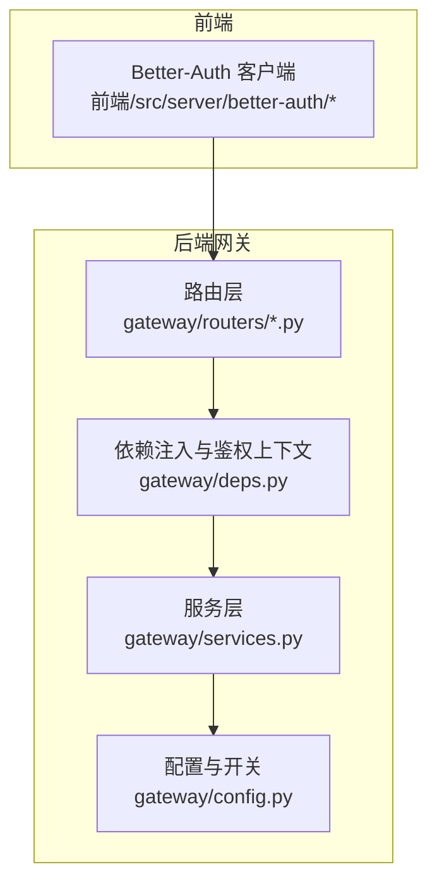
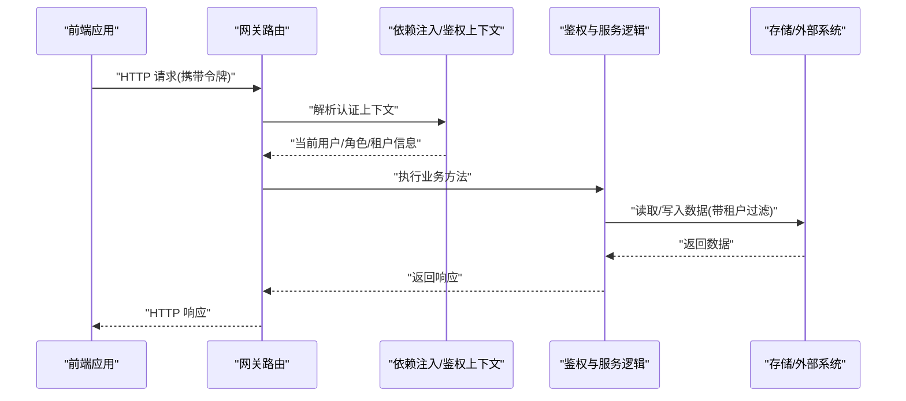
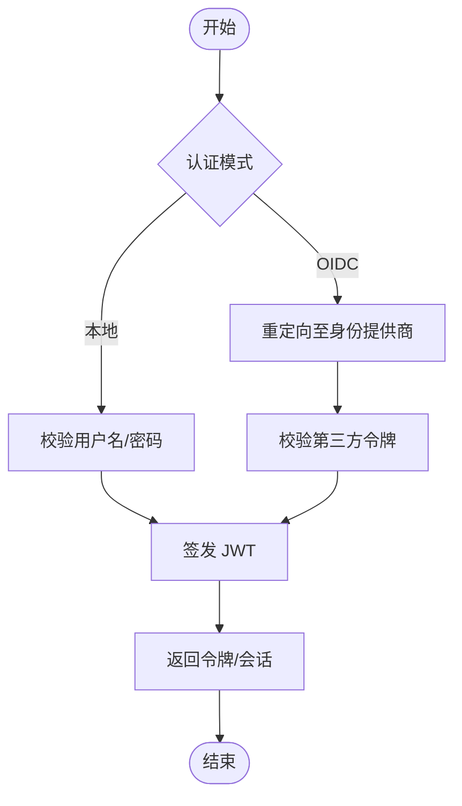
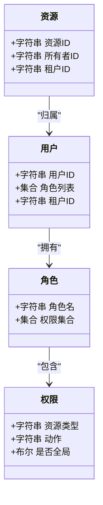
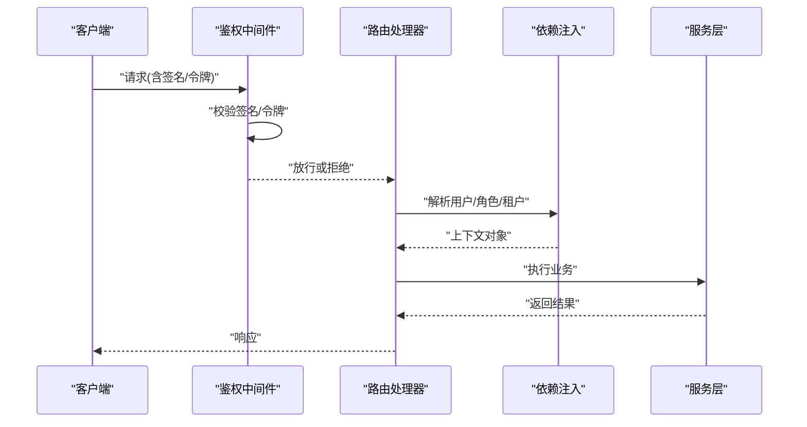
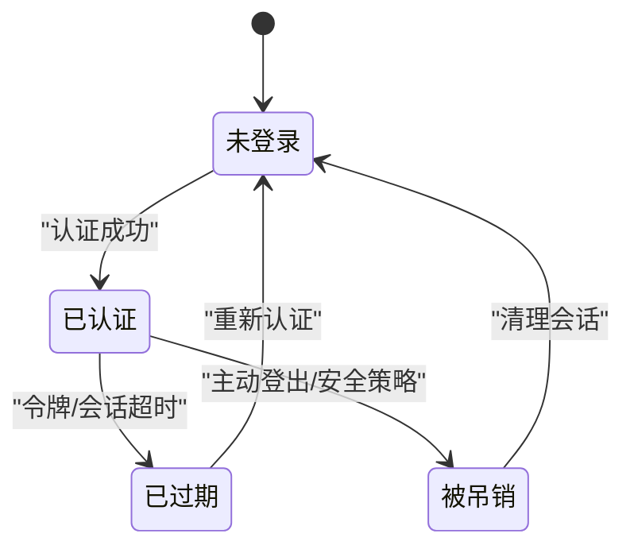
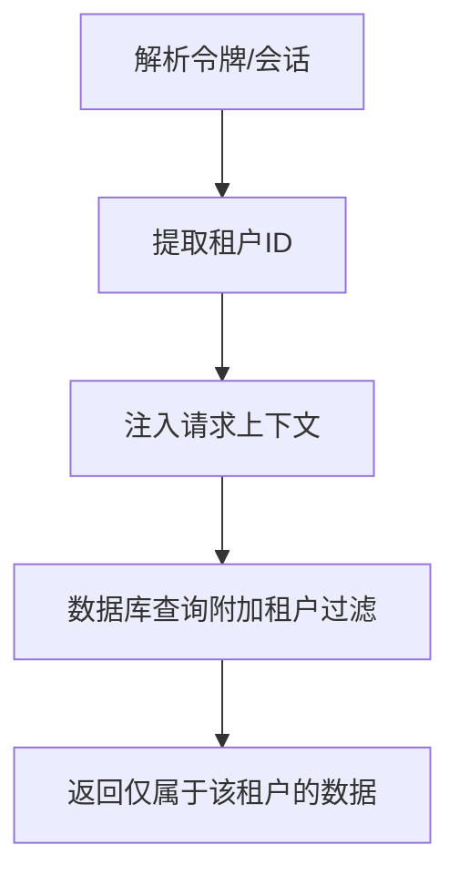
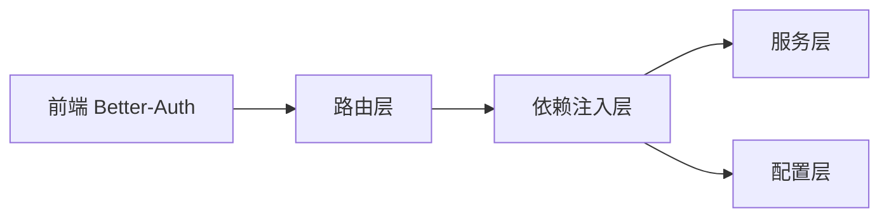

# 访问控制与认证

<cite>
**本文引用的文件**   
- [backend/app/gateway/routers/agents.py](file://backend/app/gateway/routers/agents.py)
- [backend/app/gateway/routers/artifacts.py](file://backend/app/gateway/routers/artifacts.py)
- [backend/app/gateway/routers/channels.py](file://backend/app/gateway/routers/channels.py)
- [backend/app/gateway/routers/mcp.py](file://backend/app/gateway/routers/mcp.py)
- [backend/app/gateway/routers/memory.py](file://backend/app/gateway/routers/memory.py)
- [backend/app/gateway/routers/models.py](file://backend/app/gateway/routers/models.py)
- [backend/app/gateway/routers/runs.py](file://backend/app/gateway/routers/runs.py)
- [backend/app/gateway/routers/skills.py](file://backend/app/gateway/routers/skills.py)
- [backend/app/gateway/routers/suggestions.py](file://backend/app/gateway/routers/suggestions.py)
- [backend/app/gateway/routers/thread_runs.py](file://backend/app/gateway/routers/thread_runs.py)
- [backend/app/gateway/routers/threads.py](file://backend/app/gateway/routers/threads.py)
- [backend/app/gateway/routers/uploads.py](file://backend/app/gateway/routers/uploads.py)
- [backend/app/gateway/deps.py](file://backend/app/gateway/deps.py)
- [backend/app/gateway/config.py](file://backend/app/gateway/config.py)
- [backend/app/gateway/services.py](file://backend/app/gateway/services.py)
- [backend/packages/harness/deerflow/mcp/oauth.py](file://backend/packages/harness/deerflow/mcp/oauth.py)
- [frontend/src/server/better-auth/client.ts](file://frontend/src/server/better-auth/client.ts)
- [frontend/src/server/better-auth/config.ts](file://frontend/src/server/better-auth/config.ts)
- [frontend/src/server/better-auth/index.ts](file://frontend/src/server/better-auth/index.ts)
- [frontend/src/server/better-auth/server.ts](file://frontend/src/server/better-auth/server.ts)
</cite>

## 目录
1. [简介](#简介)
2. [项目结构](#项目结构)
3. [核心组件](#核心组件)
4. [架构总览](#架构总览)
5. [详细组件分析](#详细组件分析)
6. [依赖关系分析](#依赖关系分析)
7. [性能考虑](#性能考虑)
8. [故障排查指南](#故障排查指南)
9. [结论](#结论)
10. [附录](#附录)

## 简介
本文件聚焦 DeerFlow 的访问控制与认证体系，围绕以下目标展开：
- 用户认证机制：本地认证、OIDC 集成、JWT 令牌管理
- 权限控制系统：基于角色的访问控制（RBAC）、资源级权限、数据隔离
- API 访问控制：路由级权限、中间件鉴权、请求签名验证
- 会话管理：会话状态、超时控制、并发访问限制
- 多租户环境下的用户隔离实现
- 认证失败的错误处理与日志记录
- OAuth2.0 与 SAML 集成的最佳实践

说明：
- 后端网关采用 FastAPI 风格的路由组织，认证与鉴权通常通过依赖注入与中间件完成。
- 前端集成了 Better-Auth，提供 OIDC 等第三方登录能力，并负责客户端侧的令牌管理与请求头注入。

## 项目结构
从访问控制视角看，关键位置包括：
- 后端网关路由层：各业务路由文件定义接口路径与参数校验，并在依赖中引入鉴权逻辑
- 依赖注入与配置：统一解析认证上下文、加载配置项（如是否启用认证、密钥、策略）
- 服务层：承载鉴权决策、权限检查、租户隔离等核心逻辑
- 前端认证客户端：封装 Better-Auth 调用、令牌刷新、请求拦截器

图表来源
- [backend/app/gateway/routers/agents.py](file://backend/app/gateway/routers/agents.py)
- [backend/app/gateway/deps.py](file://backend/app/gateway/deps.py)
- [backend/app/gateway/services.py](file://backend/app/gateway/services.py)
- [backend/app/gateway/config.py](file://backend/app/gateway/config.py)
- [frontend/src/server/better-auth/client.ts](file://frontend/src/server/better-auth/client.ts)

章节来源
- [backend/app/gateway/routers/agents.py](file://backend/app/gateway/routers/agents.py)
- [backend/app/gateway/deps.py](file://backend/app/gateway/deps.py)
- [backend/app/gateway/services.py](file://backend/app/gateway/services.py)
- [backend/app/gateway/config.py](file://backend/app/gateway/config.py)
- [frontend/src/server/better-auth/client.ts](file://frontend/src/server/better-auth/client.ts)

## 核心组件
- 认证提供者与令牌管理
  - 前端使用 Better-Auth 进行 OIDC 登录流程，维护会话与令牌，并在后续请求中自动携带凭证
  - 后端在依赖注入层解析认证上下文（例如从请求头提取 JWT），并注入到路由处理器
- 鉴权与授权
  - 依赖注入层或中间件对请求进行鉴权（校验令牌有效性、过期时间、签名）
  - 服务层执行 RBAC 与资源级权限判断，必要时结合租户标识做数据隔离
- 配置与开关
  - 通过配置文件控制是否启用认证、选择认证提供方、设置令牌算法与有效期、是否开启签名校验等

章节来源
- [frontend/src/server/better-auth/client.ts](file://frontend/src/server/better-auth/client.ts)
- [frontend/src/server/better-auth/config.ts](file://frontend/src/server/better-auth/config.ts)
- [frontend/src/server/better-auth/index.ts](file://frontend/src/server/better-auth/index.ts)
- [frontend/src/server/better-auth/server.ts](file://frontend/src/server/better-auth/server.ts)
- [backend/app/gateway/deps.py](file://backend/app/gateway/deps.py)
- [backend/app/gateway/services.py](file://backend/app/gateway/services.py)
- [backend/app/gateway/config.py](file://backend/app/gateway/config.py)

## 架构总览
下图展示一次受保护 API 调用的端到端流程：前端发起请求，后端网关路由接收，依赖注入层解析认证上下文，服务层执行鉴权与授权，最终返回结果。

图表来源
- [backend/app/gateway/routers/agents.py](file://backend/app/gateway/routers/agents.py)
- [backend/app/gateway/deps.py](file://backend/app/gateway/deps.py)
- [backend/app/gateway/services.py](file://backend/app/gateway/services.py)

## 详细组件分析

### 认证机制：本地认证、OIDC 集成、JWT 令牌管理
- 本地认证
  - 适用于开发或内网场景，用户名密码经服务端校验后签发短期令牌
  - 建议配合最小权限原则与强制密码策略
- OIDC 集成
  - 前端通过 Better-Auth 对接 OIDC 提供商，完成授权码流或隐式流
  - 后端需校验 ID Token/JWT 签名、受众、过期时间与发行者
- JWT 令牌管理
  - 建议采用无状态校验，服务端仅验签与声明解析
  - 支持刷新令牌轮换、黑名单撤销（可选）与短生命周期访问令牌

章节来源
- [frontend/src/server/better-auth/client.ts](file://frontend/src/server/better-auth/client.ts)
- [frontend/src/server/better-auth/config.ts](file://frontend/src/server/better-auth/config.ts)
- [frontend/src/server/better-auth/index.ts](file://frontend/src/server/better-auth/index.ts)
- [frontend/src/server/better-auth/server.ts](file://frontend/src/server/better-auth/server.ts)

### 权限控制系统：RBAC、资源级权限、数据隔离
- RBAC
  - 将“角色-权限”映射集中管理，路由或服务层根据角色判定是否允许操作
- 资源级权限
  - 针对具体资源实例（如某个线程、上传文件）进行细粒度校验，确保用户仅能访问其拥有资源的子集
- 数据隔离
  - 在多租户环境下，所有查询默认附加租户过滤条件，避免跨租户数据泄露

章节来源
- [backend/app/gateway/services.py](file://backend/app/gateway/services.py)
- [backend/app/gateway/deps.py](file://backend/app/gateway/deps.py)

### API 访问控制：路由级权限、中间件鉴权、请求签名验证
- 路由级权限
  - 在路由依赖中声明所需角色或权限，未满足则直接拒绝
- 中间件鉴权
  - 在请求进入路由前统一校验令牌、签名、来源白名单等
- 请求签名验证
  - 对敏感接口采用 HMAC 签名，服务端校验签名以防篡改

章节来源
- [backend/app/gateway/routers/agents.py](file://backend/app/gateway/routers/agents.py)
- [backend/app/gateway/routers/artifacts.py](file://backend/app/gateway/routers/artifacts.py)
- [backend/app/gateway/routers/channels.py](file://backend/app/gateway/routers/channels.py)
- [backend/app/gateway/routers/mcp.py](file://backend/app/gateway/routers/mcp.py)
- [backend/app/gateway/routers/memory.py](file://backend/app/gateway/routers/memory.py)
- [backend/app/gateway/routers/models.py](file://backend/app/gateway/routers/models.py)
- [backend/app/gateway/routers/runs.py](file://backend/app/gateway/routers/runs.py)
- [backend/app/gateway/routers/skills.py](file://backend/app/gateway/routers/skills.py)
- [backend/app/gateway/routers/suggestions.py](file://backend/app/gateway/routers/suggestions.py)
- [backend/app/gateway/routers/thread_runs.py](file://backend/app/gateway/routers/thread_runs.py)
- [backend/app/gateway/routers/threads.py](file://backend/app/gateway/routers/threads.py)
- [backend/app/gateway/routers/uploads.py](file://backend/app/gateway/routers/uploads.py)
- [backend/app/gateway/deps.py](file://backend/app/gateway/deps.py)

### 会话管理机制：会话状态、超时控制、并发访问限制
- 会话状态
  - 若采用有状态会话，需在服务端维护会话表/缓存，并关联用户与租户
- 超时控制
  - 访问令牌短生命周期；刷新令牌具备最大有效期与会话空闲超时
- 并发访问限制
  - 对同一用户的并发会话数进行上限控制，防止账号共享与滥用

章节来源
- [backend/app/gateway/config.py](file://backend/app/gateway/config.py)
- [backend/app/gateway/deps.py](file://backend/app/gateway/deps.py)

### 多租户环境下的用户隔离实现
- 租户标识注入
  - 在认证阶段解析租户信息并注入请求上下文
- 数据访问隔离
  - 所有数据查询默认附加租户过滤条件，禁止跨租户访问
- 权限边界
  - 管理员可跨租户但需审计；普通用户仅可见自身租户数据

章节来源
- [backend/app/gateway/deps.py](file://backend/app/gateway/deps.py)
- [backend/app/gateway/services.py](file://backend/app/gateway/services.py)

### 认证失败的错误处理与日志记录
- 错误分类
  - 未认证（缺少令牌/无效令牌）、未授权（权限不足）、会话过期、签名校验失败
- 统一错误响应
  - 标准化错误码与消息，便于前端提示与监控告警
- 日志记录
  - 记录失败原因、来源 IP、用户标识（脱敏）、租户、时间戳，便于审计与排障

章节来源
- [backend/app/gateway/deps.py](file://backend/app/gateway/deps.py)
- [backend/app/gateway/services.py](file://backend/app/gateway/services.py)

### OAuth2.0 与 SAML 集成最佳实践
- OAuth2.0
  - 优先使用授权码流+PKCE，避免隐式流
  - 严格校验 ID Token 签名、受众、发行者与过期时间
  - 支持刷新令牌轮换与令牌撤销
- SAML
  - 校验断言签名与证书链，绑定 SP EntityID 与 ACS URL
  - 将 SAML 属性映射为内部用户与角色，建立本地会话
- MCP 场景中的 OAuth2.0
  - 对于工具/插件的 OAuth2.0 访问，应遵循最小权限与最短有效期原则

章节来源
- [backend/packages/harness/deerflow/mcp/oauth.py](file://backend/packages/harness/deerflow/mcp/oauth.py)
- [frontend/src/server/better-auth/config.ts](file://frontend/src/server/better-auth/config.ts)

## 依赖关系分析
- 路由层依赖依赖注入层获取认证上下文与权限校验能力
- 依赖注入层依赖配置层决定认证策略与开关
- 服务层承载 RBAC、资源级权限与租户隔离逻辑
- 前端 Better-Auth 客户端负责 OIDC 登录与令牌管理

图表来源
- [backend/app/gateway/routers/agents.py](file://backend/app/gateway/routers/agents.py)
- [backend/app/gateway/deps.py](file://backend/app/gateway/deps.py)
- [backend/app/gateway/services.py](file://backend/app/gateway/services.py)
- [backend/app/gateway/config.py](file://backend/app/gateway/config.py)
- [frontend/src/server/better-auth/client.ts](file://frontend/src/server/better-auth/client.ts)

章节来源
- [backend/app/gateway/routers/agents.py](file://backend/app/gateway/routers/agents.py)
- [backend/app/gateway/deps.py](file://backend/app/gateway/deps.py)
- [backend/app/gateway/services.py](file://backend/app/gateway/services.py)
- [backend/app/gateway/config.py](file://backend/app/gateway/config.py)
- [frontend/src/server/better-auth/client.ts](file://frontend/src/server/better-auth/client.ts)

## 性能考虑
- 无状态 JWT 校验优先，减少服务端会话存储压力
- 对高频鉴权路径引入缓存（如公钥、角色缓存）
- 合理设置令牌有效期与刷新频率，平衡安全与性能
- 对签名校验与外部 OIDC 调用增加超时与重试退避策略

## 故障排查指南
- 常见问题
  - 401 未认证：检查令牌是否存在、是否过期、是否携带正确头部
  - 403 未授权：检查角色与资源权限映射是否正确
  - 签名校验失败：核对签名算法、密钥与请求体一致性
  - 多租户数据不可见：确认租户标识是否正确注入与过滤
- 定位步骤
  - 查看鉴权中间件与依赖注入层的日志输出
  - 核对配置项（是否启用认证、算法、密钥、OIDC 元数据）
  - 复现时抓取完整请求头与响应体，比对前后端令牌流转

章节来源
- [backend/app/gateway/deps.py](file://backend/app/gateway/deps.py)
- [backend/app/gateway/services.py](file://backend/app/gateway/services.py)
- [backend/app/gateway/config.py](file://backend/app/gateway/config.py)

## 结论
DeerFlow 的访问控制与认证体系以“前端 Better-Auth + 后端依赖注入/服务层鉴权”为核心，结合 RBAC、资源级权限与租户隔离，形成从入口到数据的闭环安全控制。建议在部署中严格配置 OIDC/SAML、JWT 策略与签名校验，并通过完善的日志与错误处理保障可观测性与可运维性。

## 附录
- 相关文档与示例
  - 前端 Better-Auth 客户端与配置位于 frontend/src/server/better-auth 目录
  - 后端网关路由与服务逻辑位于 backend/app/gateway 目录
  - MCP OAuth2.0 参考实现位于 backend/packages/harness/deerflow/mcp/oauth.py