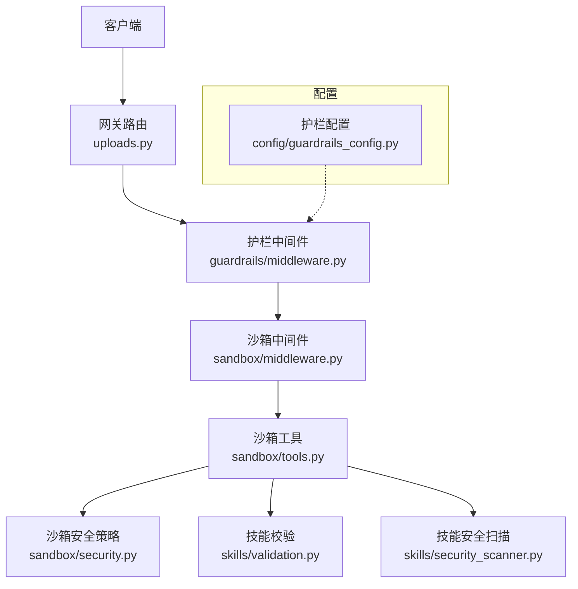
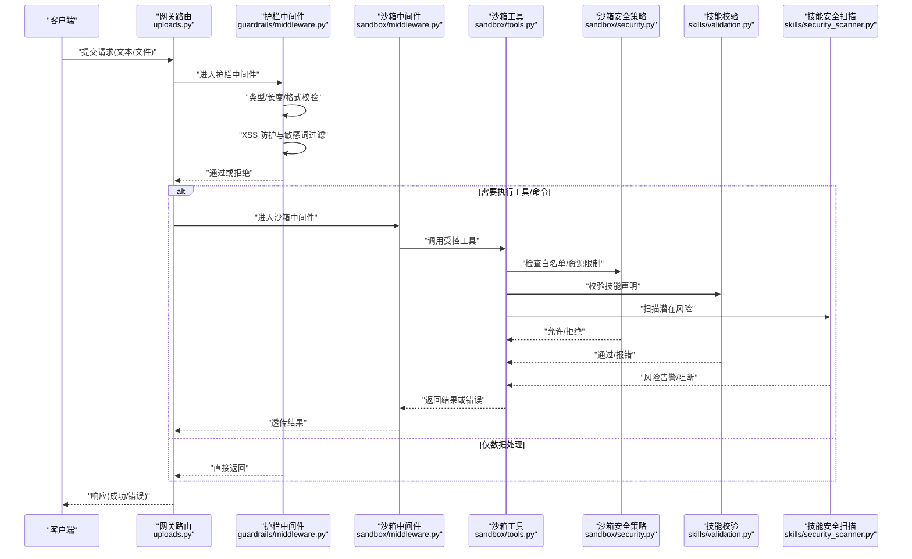
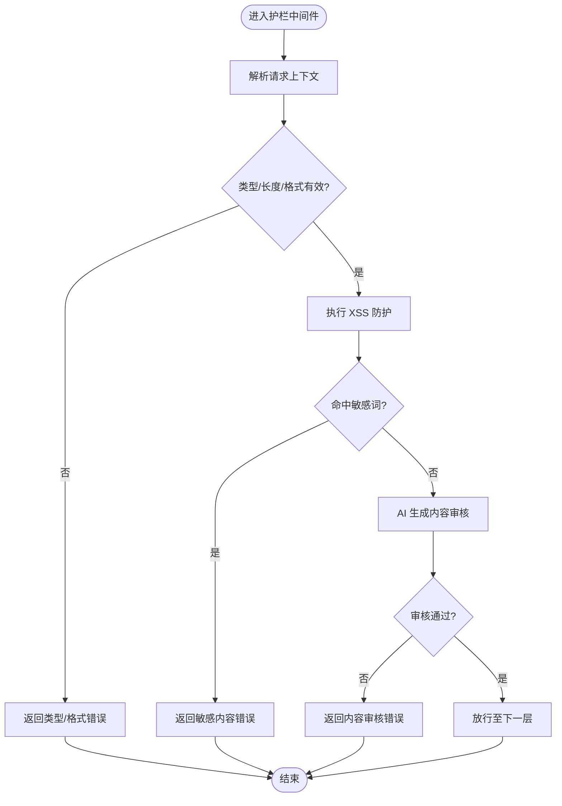
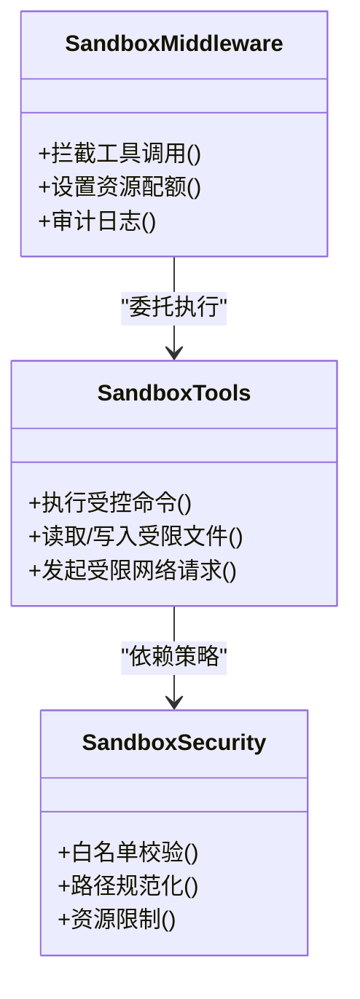
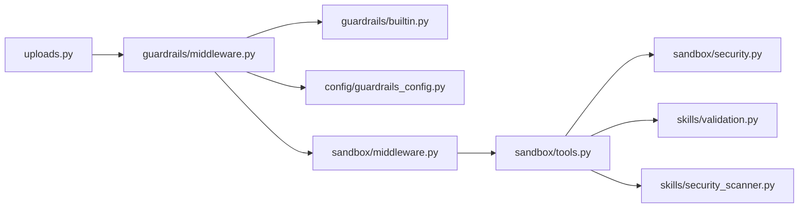

# 输入验证与过滤

<cite>
**本文引用的文件**   
- [backend/app/gateway/routers/uploads.py](file://backend/app/gateway/routers/uploads.py)
- [backend/packages/harness/deerflow/sandbox/security.py](file://backend/packages/harness/deerflow/sandbox/security.py)
- [backend/packages/harness/deerflow/sandbox/middleware.py](file://backend/packages/harness/deerflow/sandbox/middleware.py)
- [backend/packages/harness/deerflow/sandbox/tools.py](file://backend/packages/harness/deerflow/sandbox/tools.py)
- [backend/packages/harness/deerflow/guardrails/builtin.py](file://backend/packages/harness/deerflow/guardrails/builtin.py)
- [backend/packages/harness/deerflow/guardrails/middleware.py](file://backend/packages/harness/deerflow/guardrails/middleware.py)
- [backend/packages/harness/deerflow/config/guardrails_config.py](file://backend/packages/harness/deerflow/config/guardrails_config.py)
- [backend/packages/harness/deerflow/skills/validation.py](file://backend/packages/harness/deerflow/skills/validation.py)
- [backend/packages/harness/deerflow/skills/security_scanner.py](file://backend/packages/harness/deerflow/skills/security_scanner.py)
- [backend/tests/test_guardrail_middleware.py](file://backend/tests/test_guardrail_middleware.py)
- [backend/tests/test_sandbox_tools_security.py](file://backend/tests/test_sandbox_tools_security.py)
- [backend/tests/test_memory_upload_filtering.py](file://backend/tests/test_memory_upload_filtering.py)
- [frontend/src/core/uploads/file-validation.test.ts](file://frontend/src/core/uploads/file-validation.test.ts)
</cite>

## 目录
1. [简介](#简介)
2. [项目结构](#项目结构)
3. [核心组件](#核心组件)
4. [架构总览](#架构总览)
5. [详细组件分析](#详细组件分析)
6. [依赖关系分析](#依赖关系分析)
7. [性能考量](#性能考量)
8. [故障排查指南](#故障排查指南)
9. [结论](#结论)
10. [附录](#附录)

## 简介
本文件聚焦 DeerFlow 的输入验证与过滤体系，覆盖以下关键安全域：
- 数据类型、格式与长度校验
- XSS 防护（HTML 转义、脚本过滤、内容安全策略）
- SQL 注入防护（参数化查询、存储过程、安全编码）
- 命令注入防护（白名单与沙箱执行）
- 文件上传安全（类型、大小、病毒扫描）
- 恶意内容检测（敏感词过滤、AI 生成内容审核）
- 验证失败处理策略与错误响应格式

文档以代码级事实为依据，结合测试用例与配置项，提供可操作的实现说明与排障建议。

## 项目结构
DeerFlow 在网关层、中间件层、沙箱层与技能/工具层分别承担输入验证与过滤职责，形成“入口校验 + 中间件拦截 + 运行时隔离”的多层防线。

图表来源
- [backend/app/gateway/routers/uploads.py](file://backend/app/gateway/routers/uploads.py)
- [backend/packages/harness/deerflow/guardrails/middleware.py](file://backend/packages/harness/deerflow/guardrails/middleware.py)
- [backend/packages/harness/deerflow/sandbox/middleware.py](file://backend/packages/harness/deerflow/sandbox/middleware.py)
- [backend/packages/harness/deerflow/sandbox/tools.py](file://backend/packages/harness/deerflow/sandbox/tools.py)
- [backend/packages/harness/deerflow/sandbox/security.py](file://backend/packages/harness/deerflow/sandbox/security.py)
- [backend/packages/harness/deerflow/skills/validation.py](file://backend/packages/harness/deerflow/skills/validation.py)
- [backend/packages/harness/deerflow/skills/security_scanner.py](file://backend/packages/harness/deerflow/skills/security_scanner.py)
- [backend/packages/harness/deerflow/config/guardrails_config.py](file://backend/packages/harness/deerflow/config/guardrails_config.py)

章节来源
- [backend/app/gateway/routers/uploads.py](file://backend/app/gateway/routers/uploads.py)
- [backend/packages/harness/deerflow/guardrails/middleware.py](file://backend/packages/harness/deerflow/guardrails/middleware.py)
- [backend/packages/harness/deerflow/sandbox/middleware.py](file://backend/packages/harness/deerflow/sandbox/middleware.py)
- [backend/packages/harness/deerflow/sandbox/tools.py](file://backend/packages/harness/deerflow/sandbox/tools.py)
- [backend/packages/harness/deerflow/sandbox/security.py](file://backend/packages/harness/deerflow/sandbox/security.py)
- [backend/packages/harness/deerflow/skills/validation.py](file://backend/packages/harness/deerflow/skills/validation.py)
- [backend/packages/harness/deerflow/skills/security_scanner.py](file://backend/packages/harness/deerflow/skills/security_scanner.py)
- [backend/packages/harness/deerflow/config/guardrails_config.py](file://backend/packages/harness/deerflow/config/guardrails_config.py)

## 核心组件
- 网关上传路由：负责接收文件与元数据，进行基础字段校验与大小限制，并委派到后续处理链。
- 护栏中间件：统一拦截请求上下文，执行通用输入清洗、XSS 防护、敏感词过滤等策略。
- 沙箱中间件与工具：对可能执行系统命令或访问外部资源的操作进行白名单与资源限制。
- 沙箱安全策略：定义允许的系统调用、网络访问、文件系统路径范围等。
- 技能校验与安全扫描：对技能包/工具的声明与实现进行静态检查与风险识别。
- 护栏配置：集中管理过滤规则、阈值与开关。

章节来源
- [backend/app/gateway/routers/uploads.py](file://backend/app/gateway/routers/uploads.py)
- [backend/packages/harness/deerflow/guardrails/middleware.py](file://backend/packages/harness/deerflow/guardrails/middleware.py)
- [backend/packages/harness/deerflow/sandbox/middleware.py](file://backend/packages/harness/deerflow/sandbox/middleware.py)
- [backend/packages/harness/deerflow/sandbox/tools.py](file://backend/packages/harness/deerflow/sandbox/tools.py)
- [backend/packages/harness/deerflow/sandbox/security.py](file://backend/packages/harness/deerflow/sandbox/security.py)
- [backend/packages/harness/deerflow/skills/validation.py](file://backend/packages/harness/deerflow/skills/validation.py)
- [backend/packages/harness/deerflow/skills/security_scanner.py](file://backend/packages/harness/deerflow/skills/security_scanner.py)
- [backend/packages/harness/deerflow/config/guardrails_config.py](file://backend/packages/harness/deerflow/config/guardrails_config.py)

## 架构总览
下图展示了从客户端到后端各层的输入验证与过滤流程，强调“先入后出、层层加固”的设计思想。

图表来源
- [backend/app/gateway/routers/uploads.py](file://backend/app/gateway/routers/uploads.py)
- [backend/packages/harness/deerflow/guardrails/middleware.py](file://backend/packages/harness/deerflow/guardrails/middleware.py)
- [backend/packages/harness/deerflow/sandbox/middleware.py](file://backend/packages/harness/deerflow/sandbox/middleware.py)
- [backend/packages/harness/deerflow/sandbox/tools.py](file://backend/packages/harness/deerflow/sandbox/tools.py)
- [backend/packages/harness/deerflow/sandbox/security.py](file://backend/packages/harness/deerflow/sandbox/security.py)
- [backend/packages/harness/deerflow/skills/validation.py](file://backend/packages/harness/deerflow/skills/validation.py)
- [backend/packages/harness/deerflow/skills/security_scanner.py](file://backend/packages/harness/deerflow/skills/security_scanner.py)

## 详细组件分析

### 组件A：网关上传路由（uploads.py）
- 职责
  - 解析 multipart/form-data 或 JSON 表单中的文件与文本字段
  - 校验必填字段、类型、长度与扩展名
  - 限制文件大小与并发上传数量
  - 将合法请求转发至后续中间件与处理器
- 关键点
  - 使用严格的 MIME 白名单与扩展名映射
  - 对文件名进行规范化与去危险字符处理
  - 记录审计日志以便追踪异常上传

章节来源
- [backend/app/gateway/routers/uploads.py](file://backend/app/gateway/routers/uploads.py)

### 组件B：护栏中间件（guardrails/middleware.py）
- 职责
  - 统一拦截请求上下文，执行输入清洗与安全检查
  - 应用 XSS 防护（HTML 转义、脚本标签过滤）
  - 执行敏感词过滤与 AI 生成内容审核（基于内置规则与可插拔提供者）
- 关键点
  - 支持按端点/角色启用不同策略
  - 提供可配置的阈值与黑名单/白名单
  - 输出标准化错误码与消息，便于前端提示

章节来源
- [backend/packages/harness/deerflow/guardrails/middleware.py](file://backend/packages/harness/deerflow/guardrails/middleware.py)
- [backend/packages/harness/deerflow/guardrails/builtin.py](file://backend/packages/harness/deerflow/guardrails/builtin.py)
- [backend/packages/harness/deerflow/config/guardrails_config.py](file://backend/packages/harness/deerflow/config/guardrails_config.py)
- [backend/tests/test_guardrail_middleware.py](file://backend/tests/test_guardrail_middleware.py)

#### 流程图：护栏中间件处理逻辑

图表来源
- [backend/packages/harness/deerflow/guardrails/middleware.py](file://backend/packages/harness/deerflow/guardrails/middleware.py)
- [backend/packages/harness/deerflow/guardrails/builtin.py](file://backend/packages/harness/deerflow/guardrails/builtin.py)
- [backend/packages/harness/deerflow/config/guardrails_config.py](file://backend/packages/harness/deerflow/config/guardrails_config.py)

### 组件C：沙箱中间件与工具（sandbox/middleware.py, sandbox/tools.py）
- 职责
  - 为工具调用提供受限运行环境
  - 控制命令执行、网络访问、文件系统读写
  - 收集执行审计信息，支持回溯与告警
- 关键点
  - 命令白名单机制：仅允许预定义的安全命令
  - 资源配额：CPU、内存、I/O 上限
  - 输出截断与脱敏，防止信息泄露

章节来源
- [backend/packages/harness/deerflow/sandbox/middleware.py](file://backend/packages/harness/deerflow/sandbox/middleware.py)
- [backend/packages/harness/deerflow/sandbox/tools.py](file://backend/packages/harness/deerflow/sandbox/tools.py)
- [backend/tests/test_sandbox_tools_security.py](file://backend/tests/test_sandbox_tools_security.py)

#### 类图：沙箱工具与安全策略

图表来源
- [backend/packages/harness/deerflow/sandbox/middleware.py](file://backend/packages/harness/deerflow/sandbox/middleware.py)
- [backend/packages/harness/deerflow/sandbox/tools.py](file://backend/packages/harness/deerflow/sandbox/tools.py)
- [backend/packages/harness/deerflow/sandbox/security.py](file://backend/packages/harness/deerflow/sandbox/security.py)

### 组件D：技能校验与安全扫描（skills/validation.py, skills/security_scanner.py）
- 职责
  - 校验技能包的声明结构与依赖
  - 扫描潜在不安全函数、危险 API 调用
  - 生成风险报告并阻止高风险技能加载
- 关键点
  - 静态分析规则集可配置
  - 与护栏中间件的敏感词库联动

章节来源
- [backend/packages/harness/deerflow/skills/validation.py](file://backend/packages/harness/deerflow/skills/validation.py)
- [backend/packages/harness/deerflow/skills/security_scanner.py](file://backend/packages/harness/deerflow/skills/security_scanner.py)

### 组件E：文件上传安全（uploads.py 与相关测试）
- 类型验证
  - 基于扩展名与 MIME 类型的双重校验
  - 拒绝隐藏扩展名与伪装类型
- 大小限制
  - 单文件与总大小上限
  - 分块上传时的累计校验
- 病毒扫描
  - 可选集成外部扫描服务
  - 扫描失败时的降级策略（默认拒绝）
- 存储安全
  - 随机化文件名与路径
  - 权限最小化与只读挂载

章节来源
- [backend/app/gateway/routers/uploads.py](file://backend/app/gateway/routers/uploads.py)
- [backend/tests/test_uploads_manager.py](file://backend/tests/test_uploads_manager.py)
- [backend/tests/test_uploads_router.py](file://backend/tests/test_uploads_router.py)
- [frontend/src/core/uploads/file-validation.test.ts](file://frontend/src/core/uploads/file-validation.test.ts)

### 组件F：恶意内容检测（guardrails/builtin.py, guardrails/middleware.py）
- 敏感词过滤
  - 支持多语言词库与正则匹配
  - 动态更新与热重载
- AI 生成内容审核
  - 基于启发式规则与模型辅助判断
  - 可配置置信度阈值与回退策略

章节来源
- [backend/packages/harness/deerflow/guardrails/builtin.py](file://backend/packages/harness/deerflow/guardrails/builtin.py)
- [backend/packages/harness/deerflow/guardrails/middleware.py](file://backend/packages/harness/deerflow/guardrails/middleware.py)
- [backend/tests/test_guardrail_middleware.py](file://backend/tests/test_guardrail_middleware.py)

### 组件G：记忆上传过滤（test_memory_upload_filtering.py）
- 职责
  - 针对记忆模块的文件与文本输入进行二次过滤
  - 确保历史上下文不被污染
- 关键点
  - 复用护栏中间件的规则集
  - 对长文本进行分段校验与截断

章节来源
- [backend/tests/test_memory_upload_filtering.py](file://backend/tests/test_memory_upload_filtering.py)

## 依赖关系分析
- 低耦合高内聚
  - 网关路由仅做基础校验与分发，复杂逻辑下沉至中间件与工具层
  - 护栏中间件与沙箱中间件职责清晰，互不侵入
- 外部依赖
  - 病毒扫描服务（可选）
  - 外部 LLM 用于 AI 内容审核（可选）
- 循环依赖
  - 通过接口抽象与配置注入避免循环引用

图表来源
- [backend/app/gateway/routers/uploads.py](file://backend/app/gateway/routers/uploads.py)
- [backend/packages/harness/deerflow/guardrails/middleware.py](file://backend/packages/harness/deerflow/guardrails/middleware.py)
- [backend/packages/harness/deerflow/guardrails/builtin.py](file://backend/packages/harness/deerflow/guardrails/builtin.py)
- [backend/packages/harness/deerflow/config/guardrails_config.py](file://backend/packages/harness/deerflow/config/guardrails_config.py)
- [backend/packages/harness/deerflow/sandbox/middleware.py](file://backend/packages/harness/deerflow/sandbox/middleware.py)
- [backend/packages/harness/deerflow/sandbox/tools.py](file://backend/packages/harness/deerflow/sandbox/tools.py)
- [backend/packages/harness/deerflow/sandbox/security.py](file://backend/packages/harness/deerflow/sandbox/security.py)
- [backend/packages/harness/deerflow/skills/validation.py](file://backend/packages/harness/deerflow/skills/validation.py)
- [backend/packages/harness/deerflow/skills/security_scanner.py](file://backend/packages/harness/deerflow/skills/security_scanner.py)

## 性能考量
- 批量校验优化
  - 对大文本采用流式处理与分段校验，降低峰值内存占用
- 缓存策略
  - 敏感词表与规则集常驻内存，定期增量更新
- 异步与超时
  - 外部扫描与审核服务调用设置超时与熔断，避免阻塞主链路
- 资源配额
  - 沙箱执行严格限制 CPU/内存/IO，防止资源耗尽

[本节为通用指导，无需源码引用]

## 故障排查指南
- 常见错误码与含义
  - 类型/格式错误：字段类型不符、长度超限、扩展名不在白名单
  - 内容违规：命中敏感词、AI 审核未通过
  - 沙箱拒绝：命令不在白名单、路径越界、资源超限
- 定位步骤
  - 查看网关与中间件日志，确认拦截阶段
  - 核对护栏配置与规则集版本
  - 检查沙箱安全策略与工具白名单
  - 复现最小用例，逐步关闭功能定位根因
- 快速修复
  - 调整阈值与白名单
  - 升级规则集与模型版本
  - 增加重试与降级策略

章节来源
- [backend/tests/test_guardrail_middleware.py](file://backend/tests/test_guardrail_middleware.py)
- [backend/tests/test_sandbox_tools_security.py](file://backend/tests/test_sandbox_tools_security.py)
- [backend/tests/test_memory_upload_filtering.py](file://backend/tests/test_memory_upload_filtering.py)

## 结论
DeerFlow 的输入验证与过滤体系以“分层防御、可配置、可扩展”为核心原则，通过网关基础校验、护栏中间件的内容治理、沙箱工具的运行时隔离以及技能静态扫描，构建了端到端的安全闭环。建议在部署时根据业务场景精细化配置规则与阈值，并结合监控与审计持续优化。

[本节为总结性内容，无需源码引用]

## 附录
- 最佳实践
  - 始终启用最小权限原则与白名单策略
  - 对第三方服务调用设置超时与熔断
  - 定期更新敏感词库与规则集
  - 对关键路径开启全量审计与告警
- 参考测试
  - 护栏中间件行为与边界用例
  - 沙箱工具安全与资源限制
  - 记忆上传过滤与上下文污染防护

章节来源
- [backend/tests/test_guardrail_middleware.py](file://backend/tests/test_guardrail_middleware.py)
- [backend/tests/test_sandbox_tools_security.py](file://backend/tests/test_sandbox_tools_security.py)
- [backend/tests/test_memory_upload_filtering.py](file://backend/tests/test_memory_upload_filtering.py)