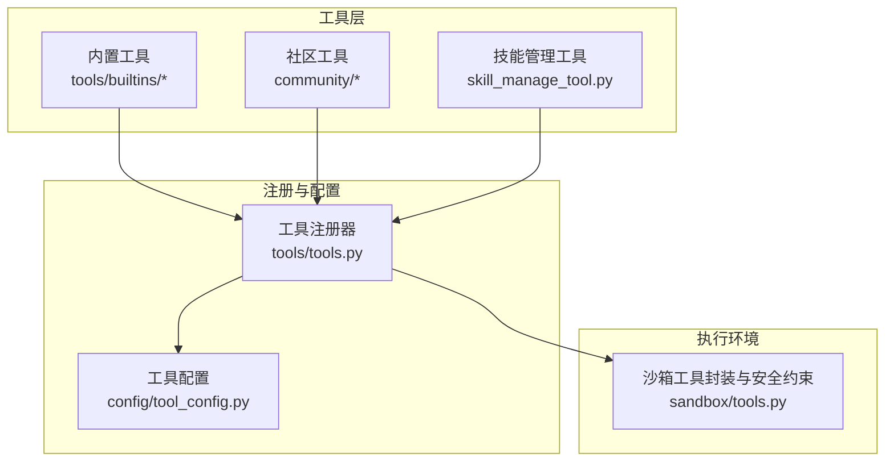
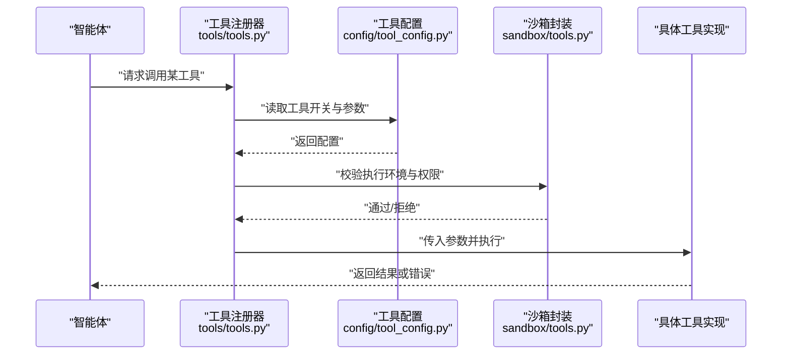
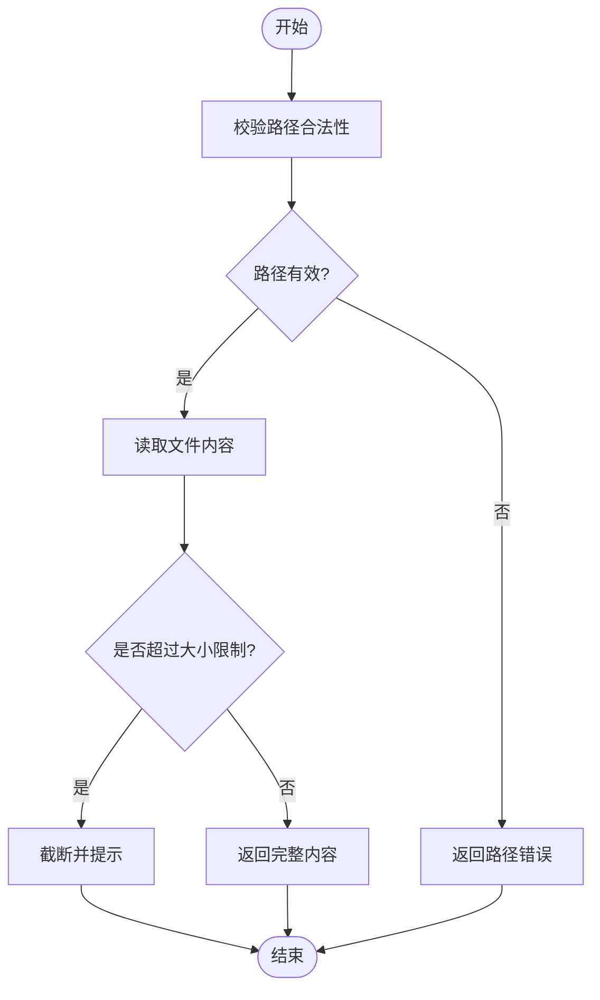
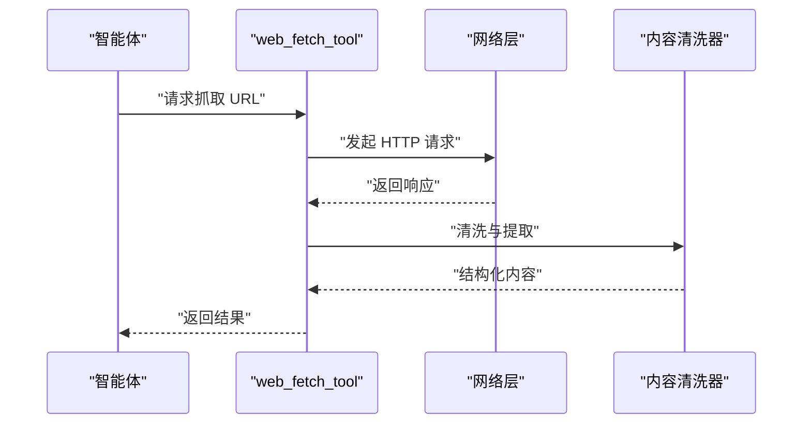
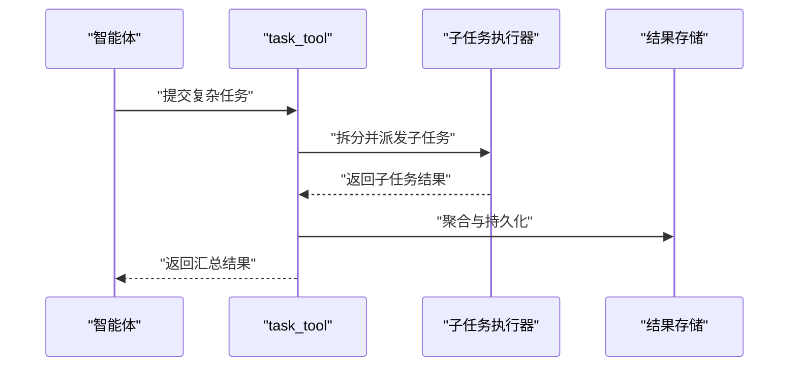
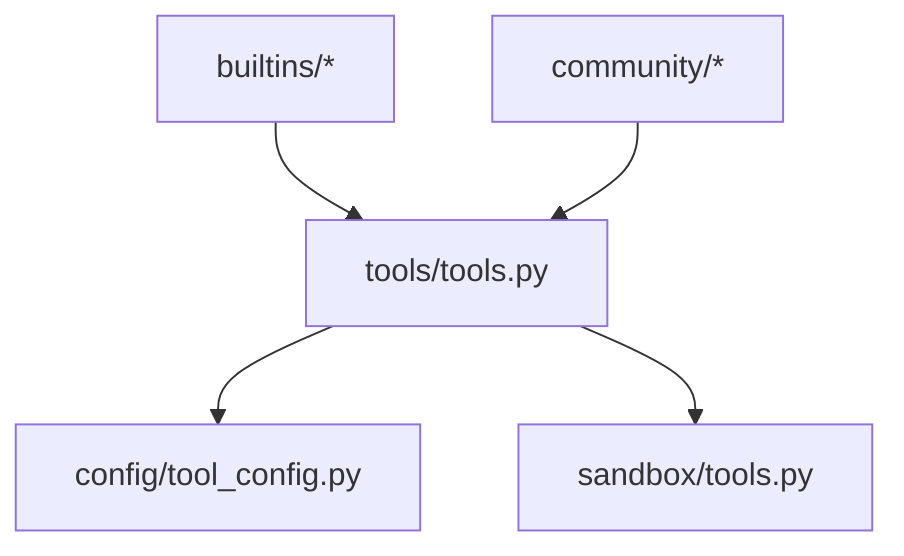

# 内置工具详解

<cite>
**本文引用的文件**   
- [backend/packages/harness/deerflow/tools/builtins/file_tools.py](file://backend/packages/harness/deerflow/tools/builtins/file_tools.py)
- [backend/packages/harness/deerflow/tools/builtins/code_execution_tool.py](file://backend/packages/harness/deerflow/tools/builtins/code_execution_tool.py)
- [backend/packages/harness/deerflow/tools/builtins/web_search_tool.py](file://backend/packages/harness/deerflow/tools/builtins/web_search_tool.py)
- [backend/packages/harness/deerflow/tools/builtins/web_fetch_tool.py](file://backend/packages/harness/deerflow/tools/builtins/web_fetch_tool.py)
- [backend/packages/harness/deerflow/tools/builtins/image_search_tool.py](file://backend/packages/harness/deerflow/tools/builtins/image_search_tool.py)
- [backend/packages/harness/deerflow/tools/builtins/grep_tool.py](file://backend/packages/harness/deerflow/tools/builtins/grep_tool.py)
- [backend/packages/harness/deerflow/tools/builtins/glob_tool.py](file://backend/packages/harness/deerflow/tools/builtins/glob_tool.py)
- [backend/packages/harness/deerflow/tools/builtins/task_tool.py](file://backend/packages/harness/deerflow/tools/builtins/task_tool.py)
- [backend/packages/harness/deerflow/tools/builtins/present_file_tool.py](file://backend/packages/harness/deerflow/tools/builtins/present_file_tool.py)
- [backend/packages/harness/deerflow/tools/builtins/summarize_text_tool.py](file://backend/packages/harness/deerflow/tools/builtins/summarize_text_tool.py)
- [backend/packages/harness/deerflow/tools/builtins/python_repl_tool.py](file://backend/packages/harness/deerflow/tools/builtins/python_repl_tool.py)
- [backend/packages/harness/deerflow/tools/builtins/bash_tool.py](file://backend/packages/harness/deerflow/tools/builtins/bash_tool.py)
- [backend/packages/harness/deerflow/tools/builtins/skill_manage_tool.py](file://backend/packages/harness/deerflow/tools/skill_manage_tool.py)
- [backend/packages/harness/deerflow/tools/tools.py](file://backend/packages/harness/deerflow/tools/tools.py)
- [backend/packages/harness/deerflow/config/tool_config.py](file://backend/packages/harness/deerflow/config/tool_config.py)
- [backend/packages/harness/deerflow/sandbox/tools.py](file://backend/packages/harness/deerflow/sandbox/tools.py)
- [backend/packages/harness/deerflow/community/ddg_search/__init__.py](file://backend/packages/harness/deerflow/community/ddg_search/__init__.py)
- [backend/packages/harness/deerflow/community/jina_ai/__init__.py](file://backend/packages/harness/deerflow/community/jina_ai/__init__.py)
- [backend/packages/harness/deerflow/community/firecrawl/__init__.py](file://backend/packages/harness/deerflow/community/firecrawl/__init__.py)
- [backend/packages/harness/deerflow/community/exa/__init__.py](file://backend/packages/harness/deerflow/community/exa/__init__.py)
- [backend/packages/harness/deerflow/community/infoquest/__init__.py](file://backend/packages/harness/deerflow/community/infoquest/__init__.py)
- [backend/packages/harness/deerflow/community/tavily/__init__.py](file://backend/packages/harness/deerflow/community/tavily/__init__.py)
</cite>

## 目录
1. [简介](#简介)
2. [项目结构](#项目结构)
3. [核心组件](#核心组件)
4. [架构总览](#架构总览)
5. [详细组件分析](#详细组件分析)
6. [依赖关系分析](#依赖关系分析)
7. [性能考量](#性能考量)
8. [故障排查指南](#故障排查指南)
9. [结论](#结论)
10. [附录](#附录)

## 简介
本文件系统化梳理 DeerFlow 的内置工具，覆盖文件操作、网络请求、数据处理、搜索与代码执行等能力。文档面向不同技术背景的读者，提供功能说明、参数约定、输入输出格式、错误处理策略、执行环境与权限限制、性能特点与最佳实践建议，并给出可追溯的代码片段路径以便深入查阅实现细节。

## 项目结构
DeerFlow 的工具主要位于后端包内：
- 内置工具实现集中在 tools/builtins 目录下，按能力域划分（文件、搜索、抓取、代码执行、任务编排等）。
- 社区扩展工具位于 community 子目录，按需启用。
- 工具注册与加载逻辑位于 tools/tools.py。
- 工具配置项位于 config/tool_config.py。
- 沙箱侧对工具的安全约束与执行环境在 sandbox/tools.py 中定义。

图表来源
- [backend/packages/harness/deerflow/tools/tools.py](file://backend/packages/harness/deerflow/tools/tools.py)
- [backend/packages/harness/deerflow/config/tool_config.py](file://backend/packages/harness/deerflow/config/tool_config.py)
- [backend/packages/harness/deerflow/sandbox/tools.py](file://backend/packages/harness/deerflow/sandbox/tools.py)

章节来源
- [backend/packages/harness/deerflow/tools/tools.py](file://backend/packages/harness/deerflow/tools/tools.py)
- [backend/packages/harness/deerflow/config/tool_config.py](file://backend/packages/harness/deerflow/config/tool_config.py)
- [backend/packages/harness/deerflow/sandbox/tools.py](file://backend/packages/harness/deerflow/sandbox/tools.py)

## 核心组件
本节概述关键内置工具的能力边界与典型用法要点，并提供具体实现文件的定位路径，便于进一步阅读源码。

- 文件操作类
  - read_file：读取指定路径的文件内容，支持编码与大小限制。
  - write_file：写入文本到目标路径，支持创建父目录与覆盖策略。
  - present_file：以结构化方式呈现文件元信息与摘要，适合大文件预览。
  - grep_tool / glob_tool：基于正则与通配符进行文件检索，配合工作空间路径使用。
  
  章节来源
  - [backend/packages/harness/deerflow/tools/builtins/file_tools.py](file://backend/packages/harness/deerflow/tools/builtins/file_tools.py)
  - [backend/packages/harness/deerflow/tools/builtins/present_file_tool.py](file://backend/packages/harness/deerflow/tools/builtins/present_file_tool.py)
  - [backend/packages/harness/deerflow/tools/builtins/grep_tool.py](file://backend/packages/harness/deerflow/tools/builtins/grep_tool.py)
  - [backend/packages/harness/deerflow/tools/builtins/glob_tool.py](file://backend/packages/harness/deerflow/tools/builtins/glob_tool.py)

- 网络与搜索类
  - web_fetch_tool：拉取网页内容，支持超时、重试与内容清洗。
  - ddg_search：通过 DuckDuckGo 进行关键词搜索，返回结果摘要与链接。
  - jina_ai：调用 Jina AI 服务进行网页提取或嵌入生成。
  - firecrawl：通过 Firecrawl 服务进行深度网页抓取与结构化解析。
  - exa：Exa 搜索引擎集成，用于高质量语义搜索。
  - infoquest：InfoQuest 搜索服务集成。
  - tavily：Tavily 搜索服务集成。
  - image_search_tool：图片搜索工具，返回图片列表与缩略图信息。

  章节来源
  - [backend/packages/harness/deerflow/tools/builtins/web_fetch_tool.py](file://backend/packages/harness/deerflow/tools/builtins/web_fetch_tool.py)
  - [backend/packages/harness/deerflow/community/ddg_search/__init__.py](file://backend/packages/harness/deerflow/community/ddg_search/__init__.py)
  - [backend/packages/harness/deerflow/community/jina_ai/__init__.py](file://backend/packages/harness/deerflow/community/jina_ai/__init__.py)
  - [backend/packages/harness/deerflow/community/firecrawl/__init__.py](file://backend/packages/harness/deerflow/community/firecrawl/__init__.py)
  - [backend/packages/harness/deerflow/community/exa/__init__.py](file://backend/packages/harness/deerflow/community/exa/__init__.py)
  - [backend/packages/harness/deerflow/community/infoquest/__init__.py](file://backend/packages/harness/deerflow/community/infoquest/__init__.py)
  - [backend/packages/harness/deerflow/community/tavily/__init__.py](file://backend/packages/harness/deerflow/community/tavily/__init__.py)
  - [backend/packages/harness/deerflow/tools/builtins/image_search_tool.py](file://backend/packages/harness/deerflow/tools/builtins/image_search_tool.py)

- 数据处理与总结类
  - summarize_text_tool：对长文本进行摘要压缩，支持长度阈值与语言偏好。
  - python_repl_tool：受限 Python REPL 执行环境，适合轻量计算与数据转换。
  - code_execution_tool：通用代码执行工具，结合沙箱运行用户脚本。
  - bash_tool：受限 Bash 命令执行，受沙箱安全策略约束。

  章节来源
  - [backend/packages/harness/deerflow/tools/builtins/summarize_text_tool.py](file://backend/packages/harness/deerflow/tools/builtins/summarize_text_tool.py)
  - [backend/packages/harness/deerflow/tools/builtins/python_repl_tool.py](file://backend/packages/harness/deerflow/tools/builtins/python_repl_tool.py)
  - [backend/packages/harness/deerflow/tools/builtins/code_execution_tool.py](file://backend/packages/harness/deerflow/tools/builtins/code_execution_tool.py)
  - [backend/packages/harness/deerflow/tools/builtins/bash_tool.py](file://backend/packages/harness/deerflow/tools/builtins/bash_tool.py)

- 任务编排与技能管理
  - task_tool：将复杂任务拆解为子任务并协调执行，支持状态跟踪与结果聚合。
  - skill_manage_tool：安装、更新、卸载技能包，维护技能清单与依赖。

  章节来源
  - [backend/packages/harness/deerflow/tools/builtins/task_tool.py](file://backend/packages/harness/deerflow/tools/builtins/task_tool.py)
  - [backend/packages/harness/deerflow/tools/skill_manage_tool.py](file://backend/packages/harness/deerflow/tools/skill_manage_tool.py)

## 架构总览
下图展示工具从注册到执行的端到端流程，包括配置注入、沙箱安全校验与最终执行。

图表来源
- [backend/packages/harness/deerflow/tools/tools.py](file://backend/packages/harness/deerflow/tools/tools.py)
- [backend/packages/harness/deerflow/config/tool_config.py](file://backend/packages/harness/deerflow/config/tool_config.py)
- [backend/packages/harness/deerflow/sandbox/tools.py](file://backend/packages/harness/deerflow/sandbox/tools.py)

## 详细组件分析

### 文件操作工具
- read_file
  - 功能：读取本地文件内容，支持编码选择与最大长度限制。
  - 输入：文件路径、可选编码、可选最大字节数。
  - 输出：字符串内容或错误信息。
  - 错误处理：路径不存在、无权限、过大截断提示。
  - 示例路径：[read_file 实现](file://backend/packages/harness/deerflow/tools/builtins/file_tools.py)

- write_file
  - 功能：向目标路径写入文本，自动创建父目录，支持覆盖策略。
  - 输入：文件路径、文本内容、可选编码、可选覆盖标志。
  - 输出：成功标记或错误信息。
  - 错误处理：路径不可写、磁盘空间不足、权限不足。
  - 示例路径：[write_file 实现](file://backend/packages/harness/deerflow/tools/builtins/file_tools.py)

- present_file
  - 功能：以结构化方式呈现文件元信息与摘要，适合大文件预览。
  - 输入：文件路径、可选摘要长度。
  - 输出：包含文件名、大小、修改时间、前若干行内容的对象。
  - 错误处理：文件不可读、路径非法。
  - 示例路径：[present_file 实现](file://backend/packages/harness/deerflow/tools/builtins/present_file_tool.py)

- grep_tool
  - 功能：在工作空间内按正则表达式匹配文件内容。
  - 输入：正则表达式、搜索根路径、可选递归与忽略规则。
  - 输出：匹配结果列表（文件路径、行号、上下文）。
  - 错误处理：无效正则、路径不存在。
  - 示例路径：[grep_tool 实现](file://backend/packages/harness/deerflow/tools/builtins/grep_tool.py)

- glob_tool
  - 功能：按通配符模式查找文件集合。
  - 输入：glob 模式、搜索根路径、可选递归。
  - 输出：匹配文件路径列表。
  - 错误处理：模式非法、路径不存在。
  - 示例路径：[glob_tool 实现](file://backend/packages/harness/deerflow/tools/builtins/glob_tool.py)

图表来源
- [backend/packages/harness/deerflow/tools/builtins/file_tools.py](file://backend/packages/harness/deerflow/tools/builtins/file_tools.py)

章节来源
- [backend/packages/harness/deerflow/tools/builtins/file_tools.py](file://backend/packages/harness/deerflow/tools/builtins/file_tools.py)
- [backend/packages/harness/deerflow/tools/builtins/present_file_tool.py](file://backend/packages/harness/deerflow/tools/builtins/present_file_tool.py)
- [backend/packages/harness/deerflow/tools/builtins/grep_tool.py](file://backend/packages/harness/deerflow/tools/builtins/grep_tool.py)
- [backend/packages/harness/deerflow/tools/builtins/glob_tool.py](file://backend/packages/harness/deerflow/tools/builtins/glob_tool.py)

### 网络请求与搜索工具
- web_fetch_tool
  - 功能：拉取网页内容，支持超时、重试与内容清洗。
  - 输入：URL、可选超时、可选代理、可选清洗选项。
  - 输出：HTML/文本内容与元信息（状态码、标题）。
  - 错误处理：网络异常、SSL 错误、超时、重定向过多。
  - 示例路径：[web_fetch_tool 实现](file://backend/packages/harness/deerflow/tools/builtins/web_fetch_tool.py)

- ddg_search
  - 功能：通过 DuckDuckGo 进行关键词搜索。
  - 输入：查询词、可选结果数量。
  - 输出：搜索结果列表（标题、摘要、链接）。
  - 错误处理：网络异常、空结果。
  - 示例路径：[ddg_search 实现](file://backend/packages/harness/deerflow/community/ddg_search/__init__.py)

- jina_ai
  - 功能：调用 Jina AI 服务进行网页提取或嵌入生成。
  - 输入：URL 或文本、可选模型与参数。
  - 输出：提取内容或向量嵌入。
  - 错误处理：鉴权失败、服务不可用。
  - 示例路径：[jina_ai 实现](file://backend/packages/harness/deerflow/community/jina_ai/__init__.py)

- firecrawl
  - 功能：通过 Firecrawl 服务进行深度网页抓取与结构化解析。
  - 输入：URL、可选抓取策略与输出格式。
  - 输出：结构化页面数据。
  - 错误处理：服务限流、解析失败。
  - 示例路径：[firecrawl 实现](file://backend/packages/harness/deerflow/community/firecrawl/__init__.py)

- exa / infoquest / tavily
  - 功能：分别对接 Exa、InfoQuest、Tavily 搜索服务。
  - 输入：查询词、可选过滤条件。
  - 输出：搜索结果列表。
  - 错误处理：鉴权失败、配额耗尽。
  - 示例路径：
    - [exa 实现](file://backend/packages/harness/deerflow/community/exa/__init__.py)
    - [infoquest 实现](file://backend/packages/harness/deerflow/community/infoquest/__init__.py)
    - [tavily 实现](file://backend/packages/harness/deerflow/community/tavily/__init__.py)

- image_search_tool
  - 功能：图片搜索，返回图片列表与缩略图信息。
  - 输入：关键词、可选数量与尺寸过滤。
  - 输出：图片元数据与下载链接。
  - 错误处理：服务不可用、结果为空。
  - 示例路径：[image_search_tool 实现](file://backend/packages/harness/deerflow/tools/builtins/image_search_tool.py)

图表来源
- [backend/packages/harness/deerflow/tools/builtins/web_fetch_tool.py](file://backend/packages/harness/deerflow/tools/builtins/web_fetch_tool.py)

章节来源
- [backend/packages/harness/deerflow/tools/builtins/web_fetch_tool.py](file://backend/packages/harness/deerflow/tools/builtins/web_fetch_tool.py)
- [backend/packages/harness/deerflow/community/ddg_search/__init__.py](file://backend/packages/harness/deerflow/community/ddg_search/__init__.py)
- [backend/packages/harness/deerflow/community/jina_ai/__init__.py](file://backend/packages/harness/deerflow/community/jina_ai/__init__.py)
- [backend/packages/harness/deerflow/community/firecrawl/__init__.py](file://backend/packages/harness/deerflow/community/firecrawl/__init__.py)
- [backend/packages/harness/deerflow/community/exa/__init__.py](file://backend/packages/harness/deerflow/community/exa/__init__.py)
- [backend/packages/harness/deerflow/community/infoquest/__init__.py](file://backend/packages/harness/deerflow/community/infoquest/__init__.py)
- [backend/packages/harness/deerflow/community/tavily/__init__.py](file://backend/packages/harness/deerflow/community/tavily/__init__.py)
- [backend/packages/harness/deerflow/tools/builtins/image_search_tool.py](file://backend/packages/harness/deerflow/tools/builtins/image_search_tool.py)

### 数据处理与总结工具
- summarize_text_tool
  - 功能：对长文本进行摘要压缩，支持长度阈值与语言偏好。
  - 输入：待摘要文本、可选最大长度、可选语言。
  - 输出：摘要文本。
  - 错误处理：输入过长、模型不可用。
  - 示例路径：[summarize_text_tool 实现](file://backend/packages/harness/deerflow/tools/builtins/summarize_text_tool.py)

- python_repl_tool
  - 功能：受限 Python REPL 执行环境，适合轻量计算与数据转换。
  - 输入：Python 代码片段、可选环境变量。
  - 输出：执行结果或错误信息。
  - 错误处理：语法错误、运行时异常、资源超限。
  - 示例路径：[python_repl_tool 实现](file://backend/packages/harness/deerflow/tools/builtins/python_repl_tool.py)

- code_execution_tool
  - 功能：通用代码执行工具，结合沙箱运行用户脚本。
  - 输入：代码、语言类型、可选参数。
  - 输出：执行结果或错误信息。
  - 错误处理：沙箱隔离失败、超时、权限不足。
  - 示例路径：[code_execution_tool 实现](file://backend/packages/harness/deerflow/tools/builtins/code_execution_tool.py)

- bash_tool
  - 功能：受限 Bash 命令执行，受沙箱安全策略约束。
  - 输入：Bash 命令、可选工作目录。
  - 输出：标准输出、标准错误与退出码。
  - 错误处理：命令被拒绝、超时、资源限制。
  - 示例路径：[bash_tool 实现](file://backend/packages/harness/deerflow/tools/builtins/bash_tool.py)

图表来源
- [backend/packages/harness/deerflow/tools/builtins/summarize_text_tool.py](file://backend/packages/harness/deerflow/tools/builtins/summarize_text_tool.py)
- [backend/packages/harness/deerflow/tools/builtins/python_repl_tool.py](file://backend/packages/harness/deerflow/tools/builtins/python_repl_tool.py)
- [backend/packages/harness/deerflow/tools/builtins/code_execution_tool.py](file://backend/packages/harness/deerflow/tools/builtins/code_execution_tool.py)
- [backend/packages/harness/deerflow/tools/builtins/bash_tool.py](file://backend/packages/harness/deerflow/tools/builtins/bash_tool.py)

章节来源
- [backend/packages/harness/deerflow/tools/builtins/summarize_text_tool.py](file://backend/packages/harness/deerflow/tools/builtins/summarize_text_tool.py)
- [backend/packages/harness/deerflow/tools/builtins/python_repl_tool.py](file://backend/packages/harness/deerflow/tools/builtins/python_repl_tool.py)
- [backend/packages/harness/deerflow/tools/builtins/code_execution_tool.py](file://backend/packages/harness/deerflow/tools/builtins/code_execution_tool.py)
- [backend/packages/harness/deerflow/tools/builtins/bash_tool.py](file://backend/packages/harness/deerflow/tools/builtins/bash_tool.py)

### 任务编排与技能管理工具
- task_tool
  - 功能：将复杂任务拆解为子任务并协调执行，支持状态跟踪与结果聚合。
  - 输入：任务描述、子任务模板、可选调度策略。
  - 输出：子任务执行结果汇总。
  - 错误处理：子任务失败回退、超时控制。
  - 示例路径：[task_tool 实现](file://backend/packages/harness/deerflow/tools/builtins/task_tool.py)

- skill_manage_tool
  - 功能：安装、更新、卸载技能包，维护技能清单与依赖。
  - 输入：动作（install/update/uninstall）、技能标识、可选版本。
  - 输出：操作结果与日志。
  - 错误处理：网络失败、依赖冲突、签名校验失败。
  - 示例路径：[skill_manage_tool 实现](file://backend/packages/harness/deerflow/tools/skill_manage_tool.py)

图表来源
- [backend/packages/harness/deerflow/tools/builtins/task_tool.py](file://backend/packages/harness/deerflow/tools/builtins/task_tool.py)

章节来源
- [backend/packages/harness/deerflow/tools/builtins/task_tool.py](file://backend/packages/harness/deerflow/tools/builtins/task_tool.py)
- [backend/packages/harness/deerflow/tools/skill_manage_tool.py](file://backend/packages/harness/deerflow/tools/skill_manage_tool.py)

## 依赖关系分析
工具注册器负责统一加载与暴露工具接口，同时读取配置决定是否启用特定工具，并在沙箱环境中执行以确保安全。

图表来源
- [backend/packages/harness/deerflow/tools/tools.py](file://backend/packages/harness/deerflow/tools/tools.py)
- [backend/packages/harness/deerflow/config/tool_config.py](file://backend/packages/harness/deerflow/config/tool_config.py)
- [backend/packages/harness/deerflow/sandbox/tools.py](file://backend/packages/harness/deerflow/sandbox/tools.py)

章节来源
- [backend/packages/harness/deerflow/tools/tools.py](file://backend/packages/harness/deerflow/tools/tools.py)
- [backend/packages/harness/deerflow/config/tool_config.py](file://backend/packages/harness/deerflow/config/tool_config.py)
- [backend/packages/harness/deerflow/sandbox/tools.py](file://backend/packages/harness/deerflow/sandbox/tools.py)

## 性能考量
- 文件操作
  - 大文件读取建议使用 present_file 进行摘要预览，避免一次性加载导致内存峰值。
  - 批量写入时合并小文件以减少系统调用开销。
- 网络请求
  - 合理设置超时与重试次数，避免雪崩；对第三方服务增加指数退避。
  - 对高频访问的页面启用缓存策略（如适用）。
- 搜索工具
  - 控制单次查询结果数量，避免返回过多数据影响下游处理。
  - 多源搜索时并行执行但限制并发度，防止触发服务限流。
- 代码执行
  - 限制执行时间与内存上限，避免长时间占用资源。
  - 优先使用 python_repl_tool 进行轻量计算，复杂任务交由 code_execution_tool 在沙箱中运行。
- 任务编排
  - 子任务拆分粒度适中，避免过细导致调度开销过大。
  - 对失败子任务采用快速失败与重试策略，保障整体稳定性。

## 故障排查指南
- 常见错误与定位
  - 路径与权限问题：检查文件路径是否存在、读写权限是否足够，确认工作空间挂载是否正确。
  - 网络异常：确认代理与证书配置，查看第三方服务的可用性与配额。
  - 执行超时：调整工具配置中的超时参数，优化代码逻辑减少耗时。
  - 沙箱拒绝：核对沙箱安全策略，确保命令与资源访问在允许范围内。
- 调试建议
  - 开启工具执行日志，记录输入参数与返回结果。
  - 逐步缩小问题范围，先验证基础能力（如简单读取与抓取），再引入复杂逻辑。
  - 对于搜索与外部服务，单独测试其客户端连通性。

章节来源
- [backend/packages/harness/deerflow/sandbox/tools.py](file://backend/packages/harness/deerflow/sandbox/tools.py)
- [backend/packages/harness/deerflow/config/tool_config.py](file://backend/packages/harness/deerflow/config/tool_config.py)

## 结论
DeerFlow 的内置工具覆盖了文件操作、网络请求、数据处理、搜索与代码执行等核心场景，并通过统一的注册器与沙箱机制保障安全性与可扩展性。建议在生产环境中根据业务需求启用合适的工具组合，遵循最佳实践与性能优化建议，以获得稳定高效的执行体验。

## 附录
- 工具注册与加载入口
  - [tools/tools.py](file://backend/packages/harness/deerflow/tools/tools.py)
- 工具配置项
  - [config/tool_config.py](file://backend/packages/harness/deerflow/config/tool_config.py)
- 沙箱安全约束
  - [sandbox/tools.py](file://backend/packages/harness/deerflow/sandbox/tools.py)
- 内置工具实现
  - [file_tools.py](file://backend/packages/harness/deerflow/tools/builtins/file_tools.py)
  - [web_fetch_tool.py](file://backend/packages/harness/deerflow/tools/builtins/web_fetch_tool.py)
  - [image_search_tool.py](file://backend/packages/harness/deerflow/tools/builtins/image_search_tool.py)
  - [grep_tool.py](file://backend/packages/harness/deerflow/tools/builtins/grep_tool.py)
  - [glob_tool.py](file://backend/packages/harness/deerflow/tools/builtins/glob_tool.py)
  - [summarize_text_tool.py](file://backend/packages/harness/deerflow/tools/builtins/summarize_text_tool.py)
  - [python_repl_tool.py](file://backend/packages/harness/deerflow/tools/builtins/python_repl_tool.py)
  - [code_execution_tool.py](file://backend/packages/harness/deerflow/tools/builtins/code_execution_tool.py)
  - [bash_tool.py](file://backend/packages/harness/deerflow/tools/builtins/bash_tool.py)
  - [task_tool.py](file://backend/packages/harness/deerflow/tools/builtins/task_tool.py)
  - [present_file_tool.py](file://backend/packages/harness/deerflow/tools/builtins/present_file_tool.py)
- 社区扩展工具
  - [ddg_search/__init__.py](file://backend/packages/harness/deerflow/community/ddg_search/__init__.py)
  - [jina_ai/__init__.py](file://backend/packages/harness/deerflow/community/jina_ai/__init__.py)
  - [firecrawl/__init__.py](file://backend/packages/harness/deerflow/community/firecrawl/__init__.py)
  - [exa/__init__.py](file://backend/packages/harness/deerflow/community/exa/__init__.py)
  - [infoquest/__init__.py](file://backend/packages/harness/deerflow/community/infoquest/__init__.py)
  - [tavily/__init__.py](file://backend/packages/harness/deerflow/community/tavily/__init__.py)