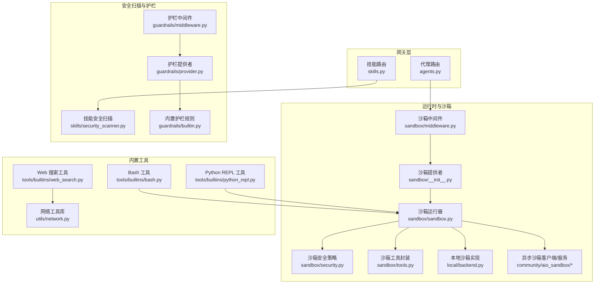
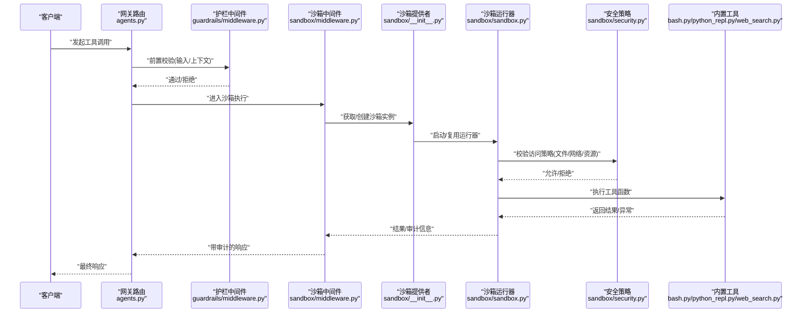
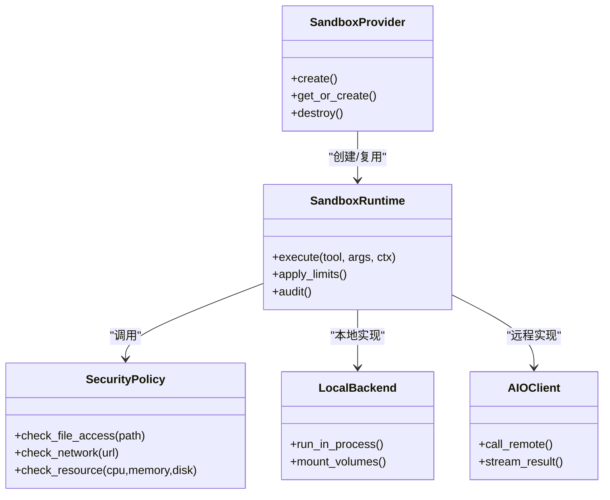
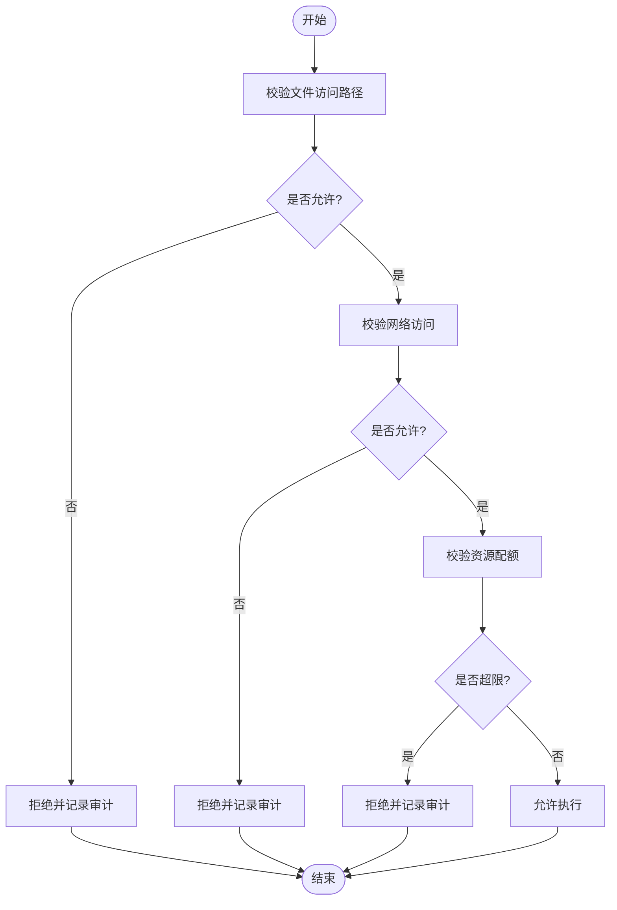
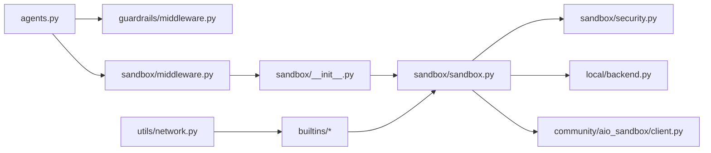

# 工具安全与权限控制

<cite>
**本文引用的文件**   
- [backend/app/gateway/routers/agents.py](file://backend/app/gateway/routers/agents.py)
- [backend/app/gateway/routers/skills.py](file://backend/app/gateway/routers/skills.py)
- [backend/packages/harness/deerflow/config/tool_config.py](file://backend/packages/harness/deerflow/config/tool_config.py)
- [backend/packages/harness/deerflow/config/sandbox_config.py](file://backend/packages/harness/deerflow/config/sandbox_config.py)
- [backend/packages/harness/deerflow/sandbox/__init__.py](file://backend/packages/harness/deerflow/sandbox/__init__.py)
- [backend/packages/harness/deerflow/sandbox/sandbox.py](file://backend/packages/harness/deerflow/sandbox/sandbox.py)
- [backend/packages/harness/deerflow/sandbox/middleware.py](file://backend/packages/harness/deerflow/sandbox/middleware.py)
- [backend/packages/harness/deerflow/sandbox/security.py](file://backend/packages/harness/deerflow/sandbox/security.py)
- [backend/packages/harness/deerflow/sandbox/tools.py](file://backend/packages/harness/deerflow/sandbox/tools.py)
- [backend/packages/harness/deerflow/sandbox/file_operation_lock.py](file://backend/packages/harness/deerflow/sandbox/file_operation_lock.py)
- [backend/packages/harness/deerflow/sandbox/local/__init__.py](file://backend/packages/harness/deerflow/sandbox/local/__init__.py)
- [backend/packages/harness/deerflow/sandbox/local/backend.py](file://backend/packages/harness/deerflow/sandbox/local/backend.py)
- [backend/packages/harness/deerflow/community/aio_sandbox/client.py](file://backend/packages/harness/deerflow/community/aio_sandbox/client.py)
- [backend/packages/harness/deerflow/community/aio_sandbox/server.py](file://backend/packages/harness/deerflow/community/aio_sandbox/server.py)
- [backend/packages/harness/deerflow/skills/security_scanner.py](file://backend/packages/harness/deerflow/skills/security_scanner.py)
- [backend/packages/harness/deerflow/guardrails/builtin.py](file://backend/packages/harness/deerflow/guardrails/builtin.py)
- [backend/packages/harness/deerflow/guardrails/middleware.py](file://backend/packages/harness/deerflow/guardrails/middleware.py)
- [backend/packages/harness/deerflow/guardrails/provider.py](file://backend/packages/harness/deerflow/guardrails/provider.py)
- [backend/packages/harness/deerflow/tools/builtins/bash.py](file://backend/packages/harness/deerflow/tools/builtins/bash.py)
- [backend/packages/harness/deerflow/tools/builtins/python_repl.py](file://backend/packages/harness/deerflow/tools/builtins/python_repl.py)
- [backend/packages/harness/deerflow/tools/builtins/web_search.py](file://backend/packages/harness/deerflow/tools/builtins/web_search.py)
- [backend/packages/harness/deerflow/utils/network.py](file://backend/packages/harness/deerflow/utils/network.py)
- [backend/tests/test_sandbox_tools_security.py](file://backend/tests/test_sandbox_tools_security.py)
- [backend/tests/test_security_scanner.py](file://backend/tests/test_security_scanner.py)
- [backend/tests/test_guardrail_middleware.py](file://backend/tests/test_guardrail_middleware.py)
- [backend/tests/test_aio_sandbox_provider.py](file://backend/tests/test_aio_sandbox_provider.py)
- [backend/tests/test_local_sandbox_provider_mounts.py](file://backend/tests/test_local_sandbox_provider mounts.py)
</cite>

## 目录
1. [简介](#简介)
2. [项目结构](#项目结构)
3. [核心组件](#核心组件)
4. [架构总览](#架构总览)
5. [详细组件分析](#详细组件分析)
6. [依赖关系分析](#依赖关系分析)
7. [性能考量](#性能考量)
8. [故障排查指南](#故障排查指南)
9. [结论](#结论)
10. [附录](#附录)

## 简介
本文件聚焦于“工具执行的安全与权限控制”，围绕以下目标展开：
- 沙箱隔离机制与安全边界：文件系统访问控制、网络请求限制、资源使用限制。
- 权限模型与访问控制策略：基于用户、角色、环境的多维度权限管理。
- 安全扫描与风险评估：防止恶意工具执行。
- 安全配置最佳实践与常见威胁防护。

## 项目结构
与工具安全相关的代码主要分布在后端网关路由、沙箱运行时、技能安全扫描、护栏（Guardrails）以及内置工具中。下图给出概念性结构，便于理解各模块的职责与交互。

[此图为概念性结构图，不直接映射具体源码文件，故无图表来源]

## 核心组件
- 沙箱提供者与运行器：负责创建、调度、隔离工具执行环境，提供统一的执行接口与生命周期管理。
- 沙箱中间件：在工具调用前后注入审计、限流、超时、资源配额等横切逻辑。
- 沙箱安全策略：定义并校验文件系统白名单、网络访问策略、系统调用限制等。
- 技能安全扫描：对技能包进行静态分析与风险评分，阻止高风险技能加载或执行。
- 护栏（Guardrails）：在工具输入输出侧进行内容安全校验与拦截。
- 内置工具：如 Bash、Python REPL、Web 搜索等，均受沙箱与护栏约束。

章节来源
- [backend/packages/harness/deerflow/sandbox/__init__.py](file://backend/packages/harness/deerflow/sandbox/__init__.py)
- [backend/packages/harness/deerflow/sandbox/sandbox.py](file://backend/packages/harness/deerflow/sandbox/sandbox.py)
- [backend/packages/harness/deerflow/sandbox/middleware.py](file://backend/packages/harness/deerflow/sandbox/middleware.py)
- [backend/packages/harness/deerflow/sandbox/security.py](file://backend/packages/harness/deerflow/sandbox/security.py)
- [backend/packages/harness/deerflow/skills/security_scanner.py](file://backend/packages/harness/deerflow/skills/security_scanner.py)
- [backend/packages/harness/deerflow/guardrails/middleware.py](file://backend/packages/harness/deerflow/guardrails/middleware.py)
- [backend/packages/harness/deerflow/guardrails/builtin.py](file://backend/packages/harness/deerflow/guardrails/builtin.py)
- [backend/packages/harness/deerflow/tools/builtins/bash.py](file://backend/packages/harness/deerflow/tools/builtins/bash.py)
- [backend/packages/harness/deerflow/tools/builtins/python_repl.py](file://backend/packages/harness/deerflow/tools/builtins/python_repl.py)
- [backend/packages/harness/deerflow/tools/builtins/web_search.py](file://backend/packages/harness/deerflow/tools/builtins/web_search.py)

## 架构总览
下图展示一次典型工具调用的端到端流程，涵盖网关路由、沙箱中间件、沙箱运行器、安全策略与内置工具的协作。

图表来源
- [backend/app/gateway/routers/agents.py](file://backend/app/gateway/routers/agents.py)
- [backend/packages/harness/deerflow/guardrails/middleware.py](file://backend/packages/harness/deerflow/guardrails/middleware.py)
- [backend/packages/harness/deerflow/sandbox/middleware.py](file://backend/packages/harness/deerflow/sandbox/middleware.py)
- [backend/packages/harness/deerflow/sandbox/__init__.py](file://backend/packages/harness/deerflow/sandbox/__init__.py)
- [backend/packages/harness/deerflow/sandbox/sandbox.py](file://backend/packages/harness/deerflow/sandbox/sandbox.py)
- [backend/packages/harness/deerflow/sandbox/security.py](file://backend/packages/harness/deerflow/sandbox/security.py)
- [backend/packages/harness/deerflow/tools/builtins/bash.py](file://backend/packages/harness/deerflow/tools/builtins/bash.py)
- [backend/packages/harness/deerflow/tools/builtins/python_repl.py](file://backend/packages/harness/deerflow/tools/builtins/python_repl.py)
- [backend/packages/harness/deerflow/tools/builtins/web_search.py](file://backend/packages/harness/deerflow/tools/builtins/web_search.py)

## 详细组件分析

### 沙箱提供者与运行器
- 职责
  - 提供统一入口以创建/复用沙箱实例，支持本地进程级与异步远程沙箱两种模式。
  - 管理工具执行的上下文、工作目录、挂载卷、环境变量、超时与资源配额。
- 关键能力
  - 运行器负责将工具函数包装为可隔离执行的单元，并在执行前注入安全策略检查。
  - 支持按会话/线程/任务维度隔离状态，避免跨租户数据泄露。
- 扩展点
  - 新增沙箱后端（如容器化、Kubernetes Pod）可通过提供者接口接入。

章节来源
- [backend/packages/harness/deerflow/sandbox/__init__.py](file://backend/packages/harness/deerflow/sandbox/__init__.py)
- [backend/packages/harness/deerflow/sandbox/sandbox.py](file://backend/packages/harness/deerflow/sandbox/sandbox.py)

#### 类关系图（概念映射）

图表来源
- [backend/packages/harness/deerflow/sandbox/__init__.py](file://backend/packages/harness/deerflow/sandbox/__init__.py)
- [backend/packages/harness/deerflow/sandbox/sandbox.py](file://backend/packages/harness/deerflow/sandbox/sandbox.py)
- [backend/packages/harness/deerflow/sandbox/security.py](file://backend/packages/harness/deerflow/sandbox/security.py)
- [backend/packages/harness/deerflow/sandbox/local/backend.py](file://backend/packages/harness/deerflow/sandbox/local/backend.py)
- [backend/packages/harness/deerflow/community/aio_sandbox/client.py](file://backend/packages/harness/deerflow/community/aio_sandbox/client.py)

### 沙箱中间件与审计
- 职责
  - 在工具调用前后记录审计日志、统计耗时、收集指标。
  - 应用全局限流、超时、重试降级策略。
- 关键点
  - 中间件与运行器解耦，便于横向扩展监控与治理。

章节来源
- [backend/packages/harness/deerflow/sandbox/middleware.py](file://backend/packages/harness/deerflow/sandbox/middleware.py)

### 沙箱安全策略
- 文件系统访问控制
  - 白名单目录、禁止符号链接逃逸、只读挂载敏感路径。
  - 文件操作锁用于并发场景下的原子性与一致性保护。
- 网络访问限制
  - 域名/IP 白名单、协议限制（仅 HTTP/HTTPS）、内网地址阻断。
- 资源使用限制
  - CPU、内存、磁盘 I/O、进程数、打开文件数上限。
- 策略评估流程
  - 在执行前对每个外部访问点进行判定，拒绝即短路返回错误。

图表来源
- [backend/packages/harness/deerflow/sandbox/security.py](file://backend/packages/harness/deerflow/sandbox/security.py)
- [backend/packages/harness/deerflow/sandbox/file_operation_lock.py](file://backend/packages/harness/deerflow/sandbox/file_operation_lock.py)

章节来源
- [backend/packages/harness/deerflow/sandbox/security.py](file://backend/packages/harness/deerflow/sandbox/security.py)
- [backend/packages/harness/deerflow/sandbox/file_operation_lock.py](file://backend/packages/harness/deerflow/sandbox/file_operation_lock.py)

### 技能安全扫描与风险评估
- 扫描范围
  - 脚本依赖、危险 API 调用、外部网络访问、动态加载、硬编码密钥等。
- 风险评分与决策
  - 根据规则集计算风险分，超过阈值则拒绝安装/启用。
- 集成点
  - 在技能路由加载阶段触发扫描，结合管理员审批流程。

章节来源
- [backend/packages/harness/deerflow/skills/security_scanner.py](file://backend/packages/harness/deerflow/skills/security_scanner.py)
- [backend/app/gateway/routers/skills.py](file://backend/app/gateway/routers/skills.py)

### 护栏（Guardrails）与内容安全
- 功能
  - 对工具输入/输出进行内容安全校验，拦截注入、越权、敏感信息泄露等。
- 实现
  - 中间件统一接入，规则由提供者加载，内置规则覆盖常见攻击面。

章节来源
- [backend/packages/harness/deerflow/guardrails/middleware.py](file://backend/packages/harness/deerflow/guardrails/middleware.py)
- [backend/packages/harness/deerflow/guardrails/provider.py](file://backend/packages/harness/deerflow/guardrails/provider.py)
- [backend/packages/harness/deerflow/guardrails/builtin.py](file://backend/packages/harness/deerflow/guardrails/builtin.py)

### 内置工具安全约束
- Bash 工具
  - 受限命令集、禁止高危命令、强制在沙箱内执行。
- Python REPL 工具
  - 禁用危险模块、限制标准库导入、输出长度截断。
- Web 搜索工具
  - 通过统一网络库进行出站访问控制，遵循白名单与协议限制。

章节来源
- [backend/packages/harness/deerflow/tools/builtins/bash.py](file://backend/packages/harness/deerflow/tools/builtins/bash.py)
- [backend/packages/harness/deerflow/tools/builtins/python_repl.py](file://backend/packages/harness/deerflow/tools/builtins/python_repl.py)
- [backend/packages/harness/deerflow/tools/builtins/web_search.py](file://backend/packages/harness/deerflow/tools/builtins/web_search.py)
- [backend/packages/harness/deerflow/utils/network.py](file://backend/packages/harness/deerflow/utils/network.py)

### 权限模型与访问控制策略
- 多维度授权
  - 基于用户身份、角色（如管理员/开发者/普通用户）、环境（开发/测试/生产）组合策略。
- 策略粒度
  - 工具级开关、API 级鉴权、沙箱资源配额、网络与文件访问策略。
- 落地方式
  - 网关路由层进行鉴权；沙箱中间件与运行器执行策略；护栏进行内容级校验。

章节来源
- [backend/app/gateway/routers/agents.py](file://backend/app/gateway/routers/agents.py)
- [backend/packages/harness/deerflow/sandbox/middleware.py](file://backend/packages/harness/deerflow/sandbox/middleware.py)
- [backend/packages/harness/deerflow/guardrails/middleware.py](file://backend/packages/harness/deerflow/guardrails/middleware.py)

### 配置项与默认行为
- 工具配置
  - 工具启用/禁用、参数校验、默认超时与重试策略。
- 沙箱配置
  - 文件系统白名单、网络白名单、资源限额、挂载卷策略。
- 护栏配置
  - 规则开关、阈值、黑白名单。

章节来源
- [backend/packages/harness/deerflow/config/tool_config.py](file://backend/packages/harness/deerflow/config/tool_config.py)
- [backend/packages/harness/deerflow/config/sandbox_config.py](file://backend/packages/harness/deerflow/config/sandbox_config.py)

## 依赖关系分析
- 组件耦合
  - 网关路由依赖护栏与沙箱中间件；沙箱运行器依赖安全策略与后端实现；内置工具依赖网络工具库。
- 外部依赖
  - 异步沙箱客户端/服务端用于远程执行；本地后端用于进程级隔离。
- 潜在环依赖
  - 通过中间件与提供者抽象降低耦合，避免循环引用。

图表来源
- [backend/app/gateway/routers/agents.py](file://backend/app/gateway/routers/agents.py)
- [backend/packages/harness/deerflow/guardrails/middleware.py](file://backend/packages/harness/deerflow/guardrails/middleware.py)
- [backend/packages/harness/deerflow/sandbox/middleware.py](file://backend/packages/harness/deerflow/sandbox/middleware.py)
- [backend/packages/harness/deerflow/sandbox/__init__.py](file://backend/packages/harness/deerflow/sandbox/__init__.py)
- [backend/packages/harness/deerflow/sandbox/sandbox.py](file://backend/packages/harness/deerflow/sandbox/sandbox.py)
- [backend/packages/harness/deerflow/sandbox/security.py](file://backend/packages/harness/deerflow/sandbox/security.py)
- [backend/packages/harness/deerflow/sandbox/local/backend.py](file://backend/packages/harness/deerflow/sandbox/local/backend.py)
- [backend/packages/harness/deerflow/community/aio_sandbox/client.py](file://backend/packages/harness/deerflow/community/aio_sandbox/client.py)
- [backend/packages/harness/deerflow/tools/builtins/bash.py](file://backend/packages/harness/deerflow/tools/builtins/bash.py)
- [backend/packages/harness/deerflow/tools/builtins/python_repl.py](file://backend/packages/harness/deerflow/tools/builtins/python_repl.py)
- [backend/packages/harness/deerflow/tools/builtins/web_search.py](file://backend/packages/harness/deerflow/tools/builtins/web_search.py)
- [backend/packages/harness/deerflow/utils/network.py](file://backend/packages/harness/deerflow/utils/network.py)

章节来源
- [backend/app/gateway/routers/agents.py](file://backend/app/gateway/routers/agents.py)
- [backend/packages/harness/deerflow/sandbox/__init__.py](file://backend/packages/harness/deerflow/sandbox/__init__.py)
- [backend/packages/harness/deerflow/sandbox/sandbox.py](file://backend/packages/harness/deerflow/sandbox/sandbox.py)
- [backend/packages/harness/deerflow/sandbox/security.py](file://backend/packages/harness/deerflow/sandbox/security.py)
- [backend/packages/harness/deerflow/sandbox/local/backend.py](file://backend/packages/harness/deerflow/sandbox/local/backend.py)
- [backend/packages/harness/deerflow/community/aio_sandbox/client.py](file://backend/packages/harness/deerflow/community/aio_sandbox/client.py)
- [backend/packages/harness/deerflow/tools/builtins/bash.py](file://backend/packages/harness/deerflow/tools/builtins/bash.py)
- [backend/packages/harness/deerflow/tools/builtins/python_repl.py](file://backend/packages/harness/deerflow/tools/builtins/python_repl.py)
- [backend/packages/harness/deerflow/tools/builtins/web_search.py](file://backend/packages/harness/deerflow/tools/builtins/web_search.py)
- [backend/packages/harness/deerflow/utils/network.py](file://backend/packages/harness/deerflow/utils/network.py)

## 性能考量
- 沙箱复用与池化：减少频繁创建销毁带来的开销。
- 异步执行：对于 IO 密集的工具，优先采用异步沙箱客户端/服务端。
- 资源配额：合理设置 CPU/内存/磁盘限额，避免单租户占用过多资源。
- 缓存与去重：对幂等查询结果进行缓存，降低重复计算。
- 限流与熔断：在高负载下保护系统稳定性。

[本节为通用指导，不涉及具体文件分析]

## 故障排查指南
- 常见问题
  - 工具执行被拒绝：检查沙箱安全策略（文件/网络/资源）与护栏规则。
  - 沙箱无法创建：确认提供者配置与后端可用性（本地/异步）。
  - 技能安装失败：查看安全扫描报告与风险评分。
- 定位方法
  - 查看网关与沙箱中间件的审计日志。
  - 核对工具配置与沙箱配置项。
  - 复现最小用例，逐步关闭护栏规则定位问题。

章节来源
- [backend/tests/test_sandbox_tools_security.py](file://backend/tests/test_sandbox_tools_security.py)
- [backend/tests/test_security_scanner.py](file://backend/tests/test_security_scanner.py)
- [backend/tests/test_guardrail_middleware.py](file://backend/tests/test_guardrail_middleware.py)
- [backend/tests/test_aio_sandbox_provider.py](file://backend/tests/test_aio_sandbox_provider.py)
- [backend/tests/test_local_sandbox_provider_mounts.py](file://backend/tests/test_local_sandbox_provider mounts.py)

## 结论
通过“网关鉴权 + 护栏内容校验 + 沙箱隔离 + 安全策略 + 技能扫描”的分层防御体系，本项目实现了工具执行的全链路安全控制。建议在生产环境中严格启用白名单策略、最小权限原则与资源配额，并结合审计与告警持续优化安全基线。

[本节为总结性内容，不涉及具体文件分析]

## 附录
- 安全配置最佳实践
  - 文件系统：仅挂载必要目录，开启只读模式，禁用符号链接。
  - 网络：仅允许白名单域名与 HTTPS，阻断私有网段。
  - 资源：为每个租户设置 CPU/内存/磁盘上限，启用超时与重试降级。
  - 护栏：启用内置规则，定期更新规则库，针对业务定制规则。
  - 技能：强制安全扫描与审批流程，禁止高风险脚本。
- 常见威胁与防护
  - 命令注入：限制 Bash 命令集，转义与校验输入。
  - 路径穿越：规范化路径、白名单校验、禁止相对路径逃逸。
  - SSRF：阻断内网地址与元数据服务访问。
  - 资源耗尽：配额与熔断，限制并发与队列长度。
  - 数据泄露：输出截断与敏感信息过滤。

[本节为通用指导，不涉及具体文件分析]