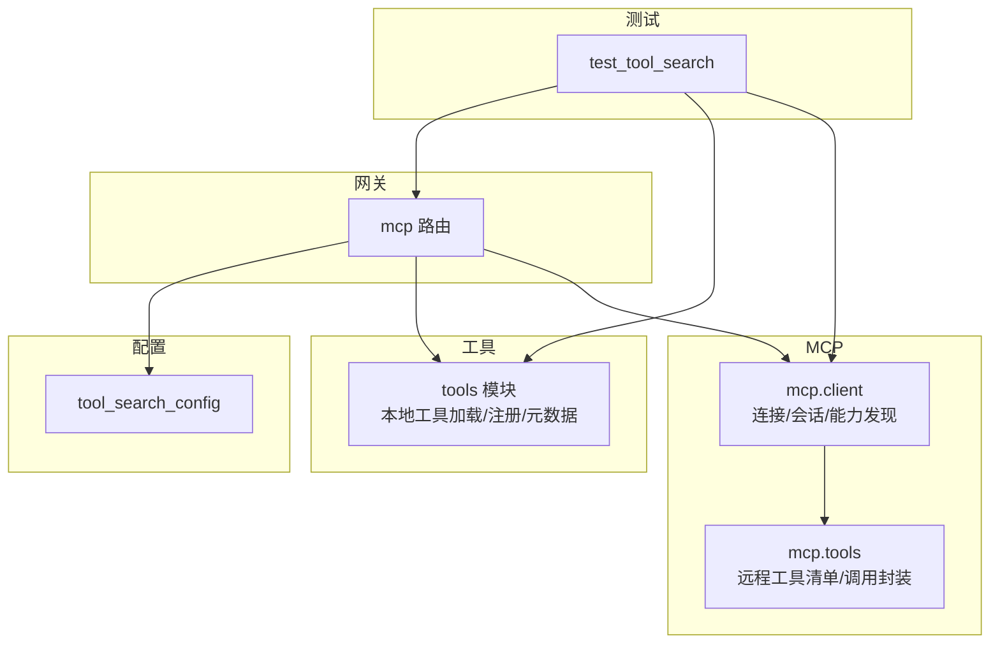
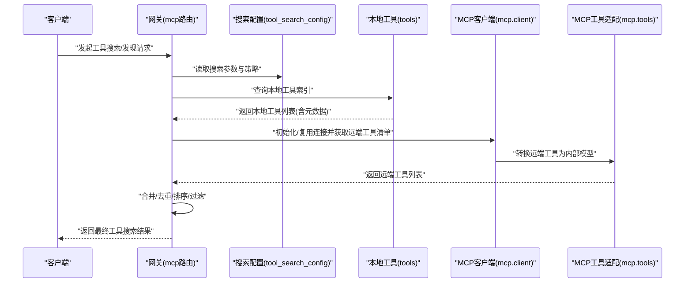
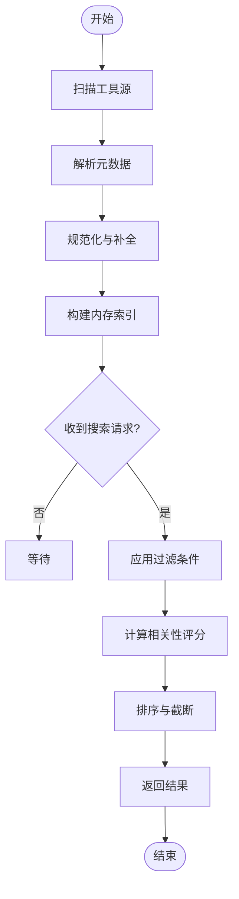
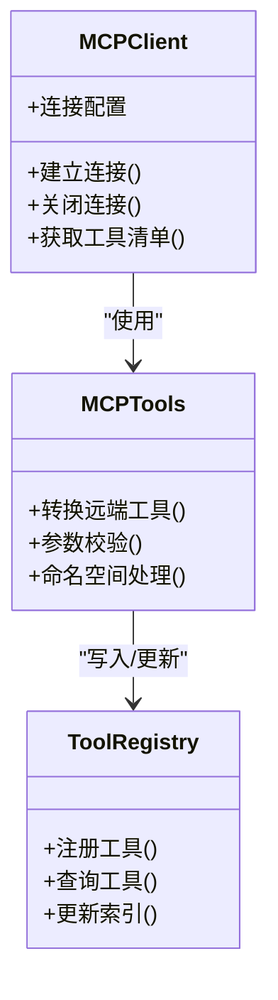
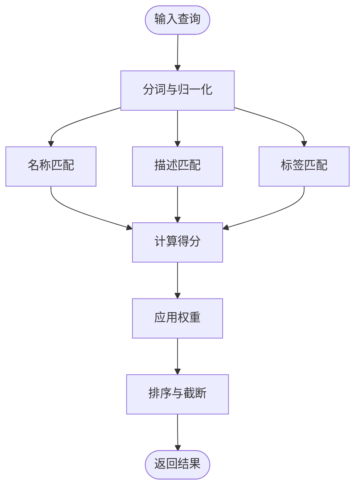
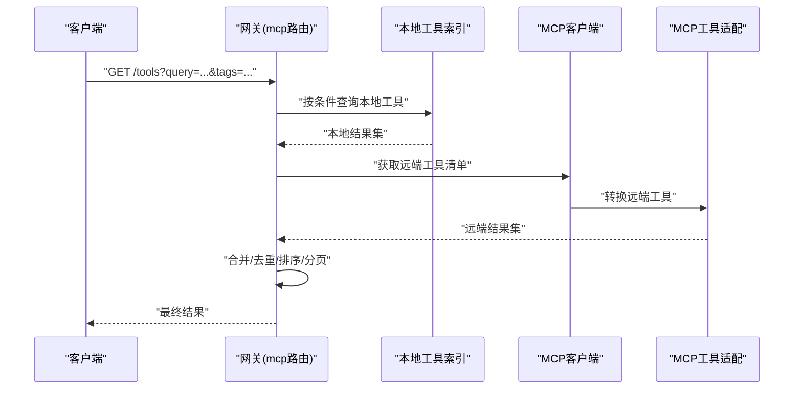
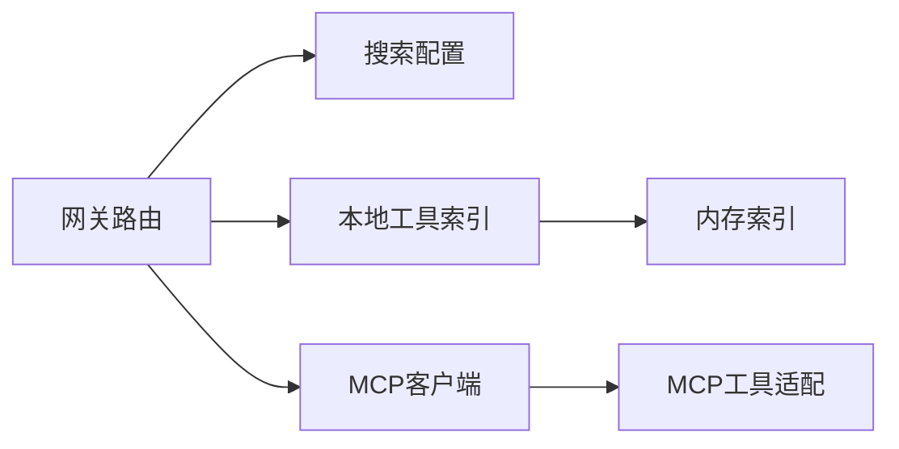

# 工具搜索与发现

<cite>
**本文引用的文件**   
- [backend/app/gateway/routers/mcp.py](file://backend/app/gateway/routers/mcp.py)
- [backend/packages/harness/deerflow/config/tool_search_config.py](file://backend/packages/harness/deerflow/config/tool_search_config.py)
- [backend/packages/harness/deerflow/tools/tools.py](file://backend/packages/harness/deerflow/tools/tools.py)
- [backend/packages/harness/deerflow/mcp/client.py](file://backend/packages/harness/deerflow/mcp/client.py)
- [backend/packages/harness/deerflow/mcp/tools.py](file://backend/packages/harness/deerflow/mcp/tools.py)
- [backend/tests/test_tool_search.py](file://backend/tests/test_tool_search.py)
</cite>

## 目录
1. [简介](#简介)
2. [项目结构](#项目结构)
3. [核心组件](#核心组件)
4. [架构总览](#架构总览)
5. [详细组件分析](#详细组件分析)
6. [依赖关系分析](#依赖关系分析)
7. [性能考虑](#性能考虑)
8. [故障排查指南](#故障排查指南)
9. [结论](#结论)
10. [附录](#附录)

## 简介
本文件围绕“工具搜索与发现机制”展开，系统性阐述以下主题：
- 工具的自动发现与注册流程（扫描、元数据提取、索引构建）
- 工具搜索算法与匹配策略（按名称、描述、标签等多维度检索）
- MCP 协议集成与外部工具发现机制
- 工具分类与组织最佳实践，帮助构建可维护的工具生态

目标读者包括后端开发者、平台集成工程师以及希望扩展工具生态的第三方贡献者。

## 项目结构
与“工具搜索与发现”直接相关的代码主要分布在以下位置：
- 网关路由层：提供对外暴露的 MCP 相关接口
- 配置层：定义工具搜索行为与参数
- 工具层：负责本地工具的加载、注册与元数据管理
- MCP 客户端与工具适配：负责与外部 MCP 服务交互并拉取工具清单
- 测试用例：覆盖搜索与发现的典型路径

图表来源
- [backend/app/gateway/routers/mcp.py](file://backend/app/gateway/routers/mcp.py)
- [backend/packages/harness/deerflow/config/tool_search_config.py](file://backend/packages/harness/deerflow/config/tool_search_config.py)
- [backend/packages/harness/deerflow/tools/tools.py](file://backend/packages/harness/deerflow/tools/tools.py)
- [backend/packages/harness/deerflow/mcp/client.py](file://backend/packages/harness/deerflow/mcp/client.py)
- [backend/packages/harness/deerflow/mcp/tools.py](file://backend/packages/harness/deerflow/mcp/tools.py)
- [backend/tests/test_tool_search.py](file://backend/tests/test_tool_search.py)

章节来源
- [backend/app/gateway/routers/mcp.py](file://backend/app/gateway/routers/mcp.py)
- [backend/packages/harness/deerflow/config/tool_search_config.py](file://backend/packages/harness/deerflow/config/tool_search_config.py)
- [backend/packages/harness/deerflow/tools/tools.py](file://backend/packages/harness/deerflow/tools/tools.py)
- [backend/packages/harness/deerflow/mcp/client.py](file://backend/packages/harness/deerflow/mcp/client.py)
- [backend/packages/harness/deerflow/mcp/tools.py](file://backend/packages/harness/deerflow/mcp/tools.py)
- [backend/tests/test_tool_search.py](file://backend/tests/test_tool_search.py)

## 核心组件
- 工具搜索配置（tool_search_config）
  - 作用：集中管理工具搜索的行为开关、权重、过滤条件等参数
  - 关键点：支持控制是否启用模糊匹配、是否包含描述/标签字段、最大返回数量等
- 工具注册中心（tools）
  - 作用：扫描内置/插件工具，解析其元数据（名称、描述、标签、参数签名），统一注册到内存索引
  - 关键点：增量更新、去重、异常隔离（单个工具加载失败不影响整体）
- MCP 客户端（mcp.client）
  - 作用：建立与外部 MCP 服务的连接，执行能力协商与工具清单拉取
  - 关键点：超时、重试、错误降级、缓存策略
- MCP 工具适配（mcp.tools）
  - 作用：将远端工具清单转换为内部统一的工具模型，参与全局索引
  - 关键点：类型映射、参数校验、命名空间隔离
- 网关路由（gateway.routers.mcp）
  - 作用：暴露工具发现与搜索的 HTTP 接口，聚合本地与远端工具结果
  - 关键点：分页、排序、过滤、合并策略

章节来源
- [backend/packages/harness/deerflow/config/tool_search_config.py](file://backend/packages/harness/deerflow/config/tool_search_config.py)
- [backend/packages/harness/deerflow/tools/tools.py](file://backend/packages/harness/deerflow/tools/tools.py)
- [backend/packages/harness/deerflow/mcp/client.py](file://backend/packages/harness/deerflow/mcp/client.py)
- [backend/packages/harness/deerflow/mcp/tools.py](file://backend/packages/harness/deerflow/mcp/tools.py)
- [backend/app/gateway/routers/mcp.py](file://backend/app/gateway/routers/mcp.py)

## 架构总览
下图展示了从请求进入网关到完成工具搜索与发现的整体流程，涵盖本地工具索引与 MCP 远端工具清单的融合。

图表来源
- [backend/app/gateway/routers/mcp.py](file://backend/app/gateway/routers/mcp.py)
- [backend/packages/harness/deerflow/config/tool_search_config.py](file://backend/packages/harness/deerflow/config/tool_search_config.py)
- [backend/packages/harness/deerflow/tools/tools.py](file://backend/packages/harness/deerflow/tools/tools.py)
- [backend/packages/harness/deerflow/mcp/client.py](file://backend/packages/harness/deerflow/mcp/client.py)
- [backend/packages/harness/deerflow/mcp/tools.py](file://backend/packages/harness/deerflow/mcp/tools.py)

## 详细组件分析

### 组件一：本地工具扫描、元数据提取与索引构建
- 扫描范围
  - 内置工具包与可插拔工具目录
  - 支持按约定或声明式方式注册
- 元数据提取
  - 名称、描述、标签、参数签名、版本、作者/来源等
  - 对缺失字段进行默认值填充与规范化
- 索引构建
  - 内存索引结构：以工具标识为主键，元数据为值
  - 支持增量更新与热重载
  - 异常隔离：单个工具加载失败不中断整体流程
- 搜索与匹配
  - 精确匹配：名称、唯一标识
  - 模糊匹配：名称、描述、标签
  - 组合过滤：按标签集合、类别、来源等筛选
  - 排序策略：相关性评分 + 配置权重

图表来源
- [backend/packages/harness/deerflow/tools/tools.py](file://backend/packages/harness/deerflow/tools/tools.py)
- [backend/packages/harness/deerflow/config/tool_search_config.py](file://backend/packages/harness/deerflow/config/tool_search_config.py)

章节来源
- [backend/packages/harness/deerflow/tools/tools.py](file://backend/packages/harness/deerflow/tools/tools.py)
- [backend/packages/harness/deerflow/config/tool_search_config.py](file://backend/packages/harness/deerflow/config/tool_search_config.py)

### 组件二：MCP 协议集成与外部工具发现
- 连接与会话
  - 根据配置建立与 MCP 服务器的连接
  - 支持认证、超时、重试与错误降级
- 能力协商与清单拉取
  - 通过 MCP 协议获取远端工具清单
  - 将远端工具转换为内部统一模型
- 工具适配与注册
  - 类型映射、参数校验、命名空间隔离
  - 与本地工具索引合并，供统一搜索
- 缓存与刷新
  - 可选缓存策略，避免频繁网络请求
  - 支持按需刷新与失效策略

图表来源
- [backend/packages/harness/deerflow/mcp/client.py](file://backend/packages/harness/deerflow/mcp/client.py)
- [backend/packages/harness/deerflow/mcp/tools.py](file://backend/packages/harness/deerflow/mcp/tools.py)
- [backend/packages/harness/deerflow/tools/tools.py](file://backend/packages/harness/deerflow/tools/tools.py)

章节来源
- [backend/packages/harness/deerflow/mcp/client.py](file://backend/packages/harness/deerflow/mcp/client.py)
- [backend/packages/harness/deerflow/mcp/tools.py](file://backend/packages/harness/deerflow/mcp/tools.py)
- [backend/packages/harness/deerflow/tools/tools.py](file://backend/packages/harness/deerflow/tools/tools.py)

### 组件三：搜索算法与匹配策略
- 输入
  - 关键词、标签集合、类别、来源、分页与排序参数
- 匹配规则
  - 名称：精确/前缀/模糊
  - 描述：分词后相似度匹配
  - 标签：集合交集/包含
- 评分与排序
  - 基于字段权重与命中次数计算相关性得分
  - 结合业务优先级与配置权重进行最终排序
- 输出
  - 工具元数据摘要、命中原因、分页信息

图表来源
- [backend/packages/harness/deerflow/config/tool_search_config.py](file://backend/packages/harness/deerflow/config/tool_search_config.py)
- [backend/packages/harness/deerflow/tools/tools.py](file://backend/packages/harness/deerflow/tools/tools.py)

章节来源
- [backend/packages/harness/deerflow/config/tool_search_config.py](file://backend/packages/harness/deerflow/config/tool_search_config.py)
- [backend/packages/harness/deerflow/tools/tools.py](file://backend/packages/harness/deerflow/tools/tools.py)

### 组件四：网关路由与对外接口
- 职责
  - 接收搜索/发现请求，解析参数
  - 协调本地工具与 MCP 远端工具
  - 合并、去重、排序、分页后返回
- 关键逻辑
  - 参数校验与默认值填充
  - 错误聚合与降级（如远端不可用时仅返回本地）
  - 日志与追踪埋点

图表来源
- [backend/app/gateway/routers/mcp.py](file://backend/app/gateway/routers/mcp.py)
- [backend/packages/harness/deerflow/tools/tools.py](file://backend/packages/harness/deerflow/tools/tools.py)
- [backend/packages/harness/deerflow/mcp/client.py](file://backend/packages/harness/deerflow/mcp/client.py)
- [backend/packages/harness/deerflow/mcp/tools.py](file://backend/packages/harness/deerflow/mcp/tools.py)

章节来源
- [backend/app/gateway/routers/mcp.py](file://backend/app/gateway/routers/mcp.py)

### 组件五：测试与验证
- 覆盖范围
  - 本地工具搜索与过滤
  - MCP 远端工具发现与适配
  - 合并与排序策略
- 方法
  - 使用 Mock 模拟远端 MCP 响应
  - 注入不同搜索配置验证匹配与排序
  - 边界条件与异常路径覆盖

章节来源
- [backend/tests/test_tool_search.py](file://backend/tests/test_tool_search.py)

## 依赖关系分析
- 耦合关系
  - 网关路由依赖搜索配置、本地工具索引与 MCP 客户端
  - MCP 客户端依赖 MCP 工具适配进行模型转换
  - 本地工具索引独立于网络层，便于离线场景
- 外部依赖
  - MCP 服务器（HTTP/SSE/WS 等传输，具体由实现决定）
  - 配置系统（环境变量/配置文件）
- 潜在风险
  - 远端不可用时的降级策略需完善
  - 大规模工具清单的内存占用与序列化开销

图表来源
- [backend/app/gateway/routers/mcp.py](file://backend/app/gateway/routers/mcp.py)
- [backend/packages/harness/deerflow/config/tool_search_config.py](file://backend/packages/harness/deerflow/config/tool_search_config.py)
- [backend/packages/harness/deerflow/tools/tools.py](file://backend/packages/harness/deerflow/tools/tools.py)
- [backend/packages/harness/deerflow/mcp/client.py](file://backend/packages/harness/deerflow/mcp/client.py)
- [backend/packages/harness/deerflow/mcp/tools.py](file://backend/packages/harness/deerflow/mcp/tools.py)

章节来源
- [backend/app/gateway/routers/mcp.py](file://backend/app/gateway/routers/mcp.py)
- [backend/packages/harness/deerflow/config/tool_search_config.py](file://backend/packages/harness/deerflow/config/tool_search_config.py)
- [backend/packages/harness/deerflow/tools/tools.py](file://backend/packages/harness/deerflow/tools/tools.py)
- [backend/packages/harness/deerflow/mcp/client.py](file://backend/packages/harness/deerflow/mcp/client.py)
- [backend/packages/harness/deerflow/mcp/tools.py](file://backend/packages/harness/deerflow/mcp/tools.py)

## 性能考虑
- 索引优化
  - 使用倒排索引或哈希表加速名称/标签查找
  - 对长文本描述做轻量分词与缓存
- 搜索优化
  - 先粗筛再精排，减少不必要的相似度计算
  - 限制最大返回数量与深度分页
- 网络优化
  - 对 MCP 远端工具清单进行缓存与增量更新
  - 合理设置超时与重试退避策略
- 资源控制
  - 监控内存占用与 GC 压力
  - 对大对象进行惰性加载与流式处理

[本节为通用指导，无需特定文件引用]

## 故障排查指南
- 常见问题
  - 远端 MCP 不可达：检查网络连通性、认证配置与超时设置
  - 工具元数据缺失：确认工具注册时必填字段与默认值策略
  - 搜索结果不准确：调整搜索权重与分词策略
- 定位步骤
  - 查看网关日志与追踪 ID
  - 单独测试本地索引与远端清单拉取
  - 对比搜索配置变更前后结果差异
- 恢复建议
  - 启用降级模式（仅本地工具）
  - 清理缓存并重建索引
  - 增加重试与熔断保护

章节来源
- [backend/app/gateway/routers/mcp.py](file://backend/app/gateway/routers/mcp.py)
- [backend/packages/harness/deerflow/mcp/client.py](file://backend/packages/harness/deerflow/mcp/client.py)
- [backend/packages/harness/deerflow/tools/tools.py](file://backend/packages/harness/deerflow/tools/tools.py)

## 结论
本方案通过“本地工具索引 + MCP 远端工具清单”的双通道发现机制，配合灵活的搜索配置与匹配策略，实现了高效、可扩展的工具搜索与发现能力。建议在工程实践中重视元数据质量、搜索权重调优与远端容错，从而构建稳定且易维护的工具生态。

[本节为总结性内容，无需特定文件引用]

## 附录
- 术语
  - 工具：具备明确输入输出与元数据的可调用单元
  - 元数据：用于描述工具的属性集合（名称、描述、标签、参数签名等）
  - 索引：内存中用于快速检索的结构
  - MCP：Model Context Protocol，用于与外部服务进行能力协商与工具发现
- 最佳实践
  - 为每个工具编写清晰的名称与描述，补充常用标签
  - 保持工具粒度适中，避免过大或过细
  - 对远端工具清单实施缓存与定期刷新
  - 在网关层统一处理错误与降级，提升用户体验

[本节为概念性内容，无需特定文件引用]