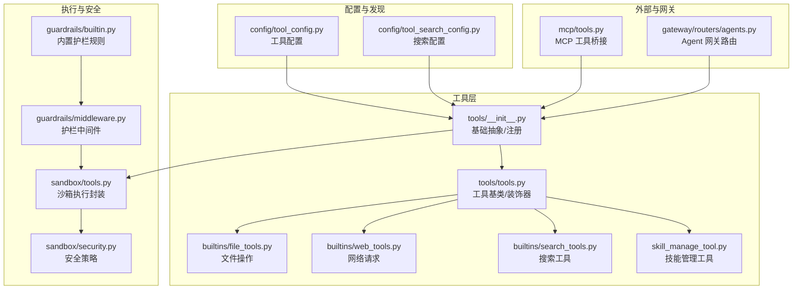
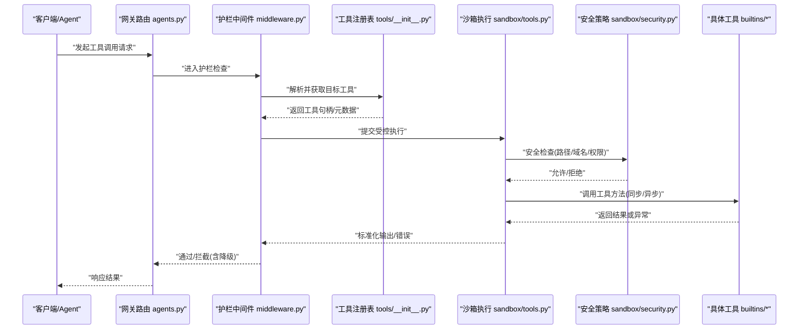
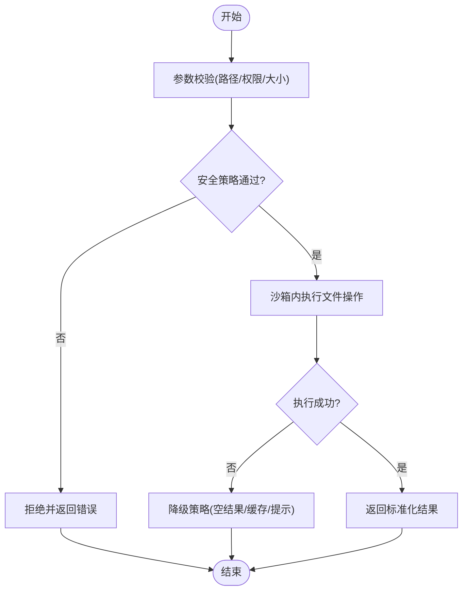
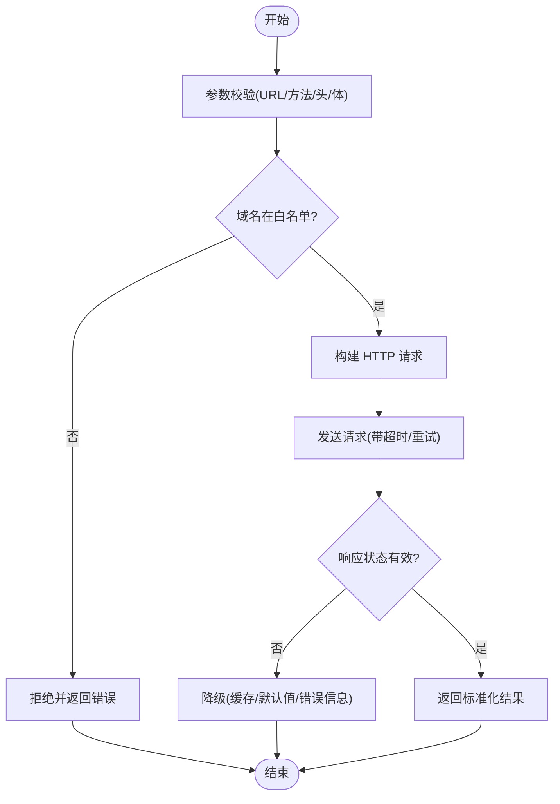
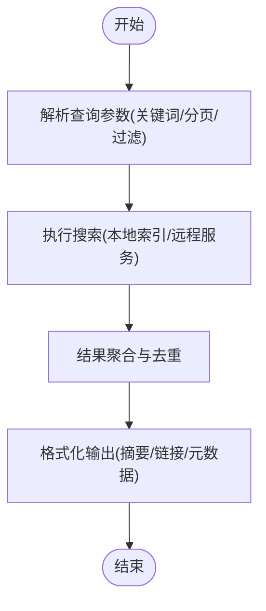
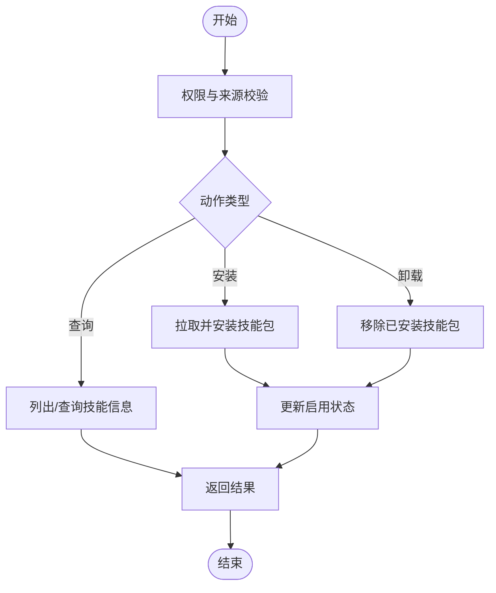
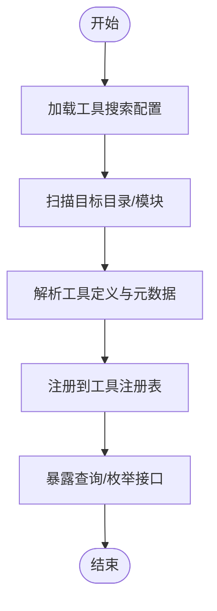
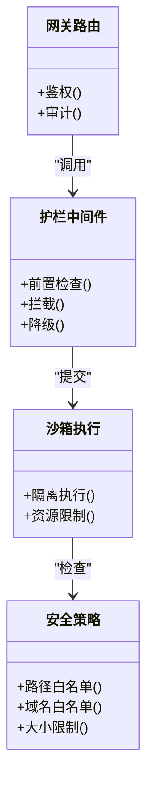
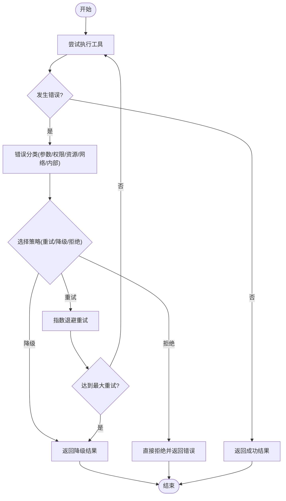
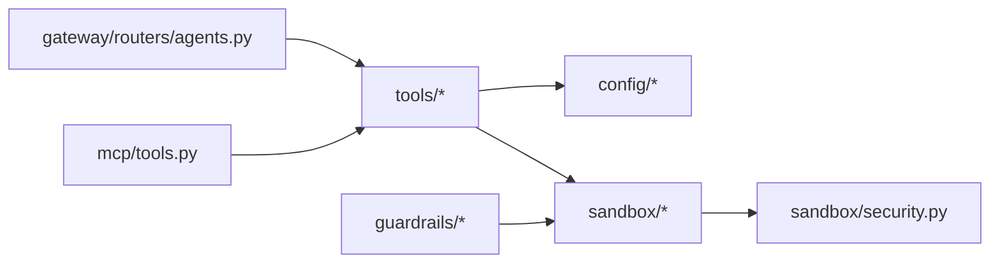

# 工具系统

<cite>
**本文引用的文件**   
- [backend/packages/harness/deerflow/tools/__init__.py](file://backend/packages/harness/deerflow/tools/__init__.py)
- [backend/packages/harness/deerflow/tools/tools.py](file://backend/packages/harness/deerflow/tools/tools.py)
- [backend/packages/harness/deerflow/tools/builtins/file_tools.py](file://backend/packages/harness/deerflow/tools/builtins/file_tools.py)
- [backend/packages/harness/deerflow/tools/builtins/web_tools.py](file://backend/packages/harness/deerflow/tools/builtins/web_tools.py)
- [backend/packages/harness/deerflow/tools/builtins/search_tools.py](file://backend/packages/harness/deerflow/tools/builtins/search_tools.py)
- [backend/packages/harness/deerflow/tools/skill_manage_tool.py](file://backend/packages/harness/deerflow/tools/skill_manage_tool.py)
- [backend/packages/harness/deerflow/config/tool_config.py](file://backend/packages/harness/deerflow/config/tool_config.py)
- [backend/packages/harness/deerflow/config/tool_search_config.py](file://backend/packages/harness/deerflow/config/tool_search_config.py)
- [backend/packages/harness/deerflow/mcp/tools.py](file://backend/packages/harness/deerflow/mcp/tools.py)
- [backend/packages/harness/deerflow/sandbox/tools.py](file://backend/packages/harness/deerflow/sandbox/tools.py)
- [backend/packages/harness/deerflow/sandbox/security.py](file://backend/packages/harness/deerflow/sandbox/security.py)
- [backend/packages/harness/deerflow/guardrails/builtin.py](file://backend/packages/harness/deerflow/guardrails/builtin.py)
- [backend/packages/harness/deerflow/guardrails/middleware.py](file://backend/packages/harness/deerflow/guardrails/middleware.py)
- [backend/app/gateway/routers/agents.py](file://backend/app/gateway/routers/agents.py)
- [backend/tests/test_tool_search.py](file://backend/tests/test_tool_search.py)
- [backend/tests/test_tool_error_handling_middleware.py](file://backend/tests/test_tool_error_handling_middleware.py)
- [backend/tests/test_sandbox_tools_security.py](file://backend/tests/test_sandbox_tools_security.py)
</cite>

## 目录
1. [简介](#简介)
2. [项目结构](#项目结构)
3. [核心组件](#核心组件)
4. [架构总览](#架构总览)
5. [详细组件分析](#详细组件分析)
6. [依赖关系分析](#依赖关系分析)
7. [性能考虑](#性能考虑)
8. [故障排查指南](#故障排查指南)
9. [结论](#结论)
10. [附录](#附录)

## 简介
本章节面向 DeerFlow 工具系统的整体认知，解释“工具(Tool)”的概念、在代理工作流中的作用，以及系统如何发现、加载、执行和管控工具。文档同时覆盖内置工具能力、自定义工具开发规范、搜索与发现机制、权限与安全控制、错误处理与降级策略、性能优化与调试技巧，并提供完整的开发与集成示例路径指引。

## 项目结构
DeerFlow 的工具系统位于后端 harness 模块中，围绕“工具定义—注册—发现—执行—安全—可观测”的闭环展开：
- 工具定义与注册：tools 包提供基础抽象、装饰器与注册表；builtins 提供常用内置工具（文件、网络、搜索等）。
- 配置与发现：tool_config 与 tool_search_config 负责工具开关、过滤与搜索策略。
- 执行与沙箱：sandbox.tools 将工具调用纳入沙箱环境，结合 security 进行资源访问限制。
- 安全护栏：guardrails 对工具调用进行前置校验与拦截。
- 外部协议：mcp.tools 暴露 MCP 协议下的工具能力。
- 网关路由：gateway.routers.agents 将工具能力接入到 Agent 运行入口。

图表来源
- [backend/packages/harness/deerflow/tools/__init__.py](file://backend/packages/harness/deerflow/tools/__init__.py)
- [backend/packages/harness/deerflow/tools/tools.py](file://backend/packages/harness/deerflow/tools/tools.py)
- [backend/packages/harness/deerflow/tools/builtins/file_tools.py](file://backend/packages/harness/deerflow/tools/builtins/file_tools.py)
- [backend/packages/harness/deerflow/tools/builtins/web_tools.py](file://backend/packages/harness/deerflow/tools/builtins/web_tools.py)
- [backend/packages/harness/deerflow/tools/builtins/search_tools.py](file://backend/packages/harness/deerflow/tools/builtins/search_tools.py)
- [backend/packages/harness/deerflow/tools/skill_manage_tool.py](file://backend/packages/harness/deerflow/tools/skill_manage_tool.py)
- [backend/packages/harness/deerflow/config/tool_config.py](file://backend/packages/harness/deerflow/config/tool_config.py)
- [backend/packages/harness/deerflow/config/tool_search_config.py](file://backend/packages/harness/deerflow/config/tool_search_config.py)
- [backend/packages/harness/deerflow/sandbox/tools.py](file://backend/packages/harness/deerflow/sandbox/tools.py)
- [backend/packages/harness/deerflow/sandbox/security.py](file://backend/packages/harness/deerflow/sandbox/security.py)
- [backend/packages/harness/deerflow/guardrails/builtin.py](file://backend/packages/harness/deerflow/guardrails/builtin.py)
- [backend/packages/harness/deerflow/guardrails/middleware.py](file://backend/packages/harness/deerflow/guardrails/middleware.py)
- [backend/packages/harness/deerflow/mcp/tools.py](file://backend/packages/harness/deerflow/mcp/tools.py)
- [backend/app/gateway/routers/agents.py](file://backend/app/gateway/routers/agents.py)

章节来源
- [backend/packages/harness/deerflow/tools/__init__.py](file://backend/packages/harness/deerflow/tools/__init__.py)
- [backend/packages/harness/deerflow/tools/tools.py](file://backend/packages/harness/deerflow/tools/tools.py)
- [backend/packages/harness/deerflow/config/tool_config.py](file://backend/packages/harness/deerflow/config/tool_config.py)
- [backend/packages/harness/deerflow/config/tool_search_config.py](file://backend/packages/harness/deerflow/config/tool_search_config.py)
- [backend/packages/harness/deerflow/sandbox/tools.py](file://backend/packages/harness/deerflow/sandbox/tools.py)
- [backend/packages/harness/deerflow/sandbox/security.py](file://backend/packages/harness/deerflow/sandbox/security.py)
- [backend/packages/harness/deerflow/guardrails/builtin.py](file://backend/packages/harness/deerflow/guardrails/builtin.py)
- [backend/packages/harness/deerflow/guardrails/middleware.py](file://backend/packages/harness/deerflow/guardrails/middleware.py)
- [backend/packages/harness/deerflow/mcp/tools.py](file://backend/packages/harness/deerflow/mcp/tools.py)
- [backend/app/gateway/routers/agents.py](file://backend/app/gateway/routers/agents.py)

## 核心组件
- 工具基类与装饰器：提供统一的工具描述、参数签名、返回值结构与元数据；支持同步/异步执行模型与错误包装。
- 工具注册表：集中维护可用工具清单，支持按名称、标签、版本检索。
- 内置工具集：
  - 文件操作：读取、写入、列出目录、移动/复制、删除、压缩/解压等。
  - 网络请求：HTTP GET/POST/PUT/DELETE、表单上传、下载、重试与超时控制。
  - 搜索工具：关键词检索、结果摘要、分页与过滤。
  - 技能管理：安装、卸载、启用/禁用、查询技能列表与详情。
- 沙箱执行：将工具调用隔离在受限环境中，限制文件系统、网络与进程能力。
- 安全护栏：对工具调用进行前置检查（如路径白名单、域名白名单、敏感参数过滤），失败时走降级或拒绝策略。
- 配置与发现：通过配置文件启用/禁用工具、设置搜索范围与匹配规则，实现动态发现。
- MCP 桥接：将内部工具以 MCP 协议暴露，便于外部系统集成。
- 网关集成：Agent 网关在路由阶段注入工具上下文，统一鉴权与审计。

章节来源
- [backend/packages/harness/deerflow/tools/tools.py](file://backend/packages/harness/deerflow/tools/tools.py)
- [backend/packages/harness/deerflow/tools/builtins/file_tools.py](file://backend/packages/harness/deerflow/tools/builtins/file_tools.py)
- [backend/packages/harness/deerflow/tools/builtins/web_tools.py](file://backend/packages/harness/deerflow/tools/builtins/web_tools.py)
- [backend/packages/harness/deerflow/tools/builtins/search_tools.py](file://backend/packages/harness/deerflow/tools/builtins/search_tools.py)
- [backend/packages/harness/deerflow/tools/skill_manage_tool.py](file://backend/packages/harness/deerflow/tools/skill_manage_tool.py)
- [backend/packages/harness/deerflow/sandbox/tools.py](file://backend/packages/harness/deerflow/sandbox/tools.py)
- [backend/packages/harness/deerflow/sandbox/security.py](file://backend/packages/harness/deerflow/sandbox/security.py)
- [backend/packages/harness/deerflow/guardrails/builtin.py](file://backend/packages/harness/deerflow/guardrails/builtin.py)
- [backend/packages/harness/deerflow/guardrails/middleware.py](file://backend/packages/harness/deerflow/guardrails/middleware.py)
- [backend/packages/harness/deerflow/mcp/tools.py](file://backend/packages/harness/deerflow/mcp/tools.py)
- [backend/app/gateway/routers/agents.py](file://backend/app/gateway/routers/agents.py)

## 架构总览
下图展示了从 Agent 发起工具调用到最终返回结果的完整链路，包括护栏检查、沙箱执行、错误处理与降级。

图表来源
- [backend/app/gateway/routers/agents.py](file://backend/app/gateway/routers/agents.py)
- [backend/packages/harness/deerflow/guardrails/middleware.py](file://backend/packages/harness/deerflow/guardrails/middleware.py)
- [backend/packages/harness/deerflow/tools/__init__.py](file://backend/packages/harness/deerflow/tools/__init__.py)
- [backend/packages/harness/deerflow/sandbox/tools.py](file://backend/packages/harness/deerflow/sandbox/tools.py)
- [backend/packages/harness/deerflow/sandbox/security.py](file://backend/packages/harness/deerflow/sandbox/security.py)
- [backend/packages/harness/deerflow/tools/builtins/file_tools.py](file://backend/packages/harness/deerflow/tools/builtins/file_tools.py)
- [backend/packages/harness/deerflow/tools/builtins/web_tools.py](file://backend/packages/harness/deerflow/tools/builtins/web_tools.py)
- [backend/packages/harness/deerflow/tools/builtins/search_tools.py](file://backend/packages/harness/deerflow/tools/builtins/search_tools.py)

## 详细组件分析

### 工具基类与装饰器
- 设计要点
  - 统一的工具描述：名称、版本、描述、参数 schema、返回 schema、是否异步。
  - 装饰器：用于声明式注册工具，自动收集到注册表。
  - 错误包装：将底层异常转换为标准错误对象，便于上层统一处理。
- 使用建议
  - 为每个工具编写清晰的参数说明与约束。
  - 对耗时操作优先采用异步接口，配合超时与重试策略。
  - 在工具内部记录必要日志，便于追踪与排障。

章节来源
- [backend/packages/harness/deerflow/tools/tools.py](file://backend/packages/harness/deerflow/tools/tools.py)

### 内置工具：文件操作
- 能力概览
  - 读取/写入文本与二进制文件
  - 列出目录、递归遍历
  - 移动/复制/删除文件与目录
  - 压缩/解压归档
- 安全与沙箱
  - 路径白名单与相对路径规范化
  - 禁止符号链接逃逸
  - 大小限制与速率限制
- 典型流程
  - 输入校验 → 安全策略检查 → 沙箱内执行 → 结果封装与审计

图表来源
- [backend/packages/harness/deerflow/tools/builtins/file_tools.py](file://backend/packages/harness/deerflow/tools/builtins/file_tools.py)
- [backend/packages/harness/deerflow/sandbox/security.py](file://backend/packages/harness/deerflow/sandbox/security.py)

章节来源
- [backend/packages/harness/deerflow/tools/builtins/file_tools.py](file://backend/packages/harness/deerflow/tools/builtins/file_tools.py)
- [backend/packages/harness/deerflow/sandbox/security.py](file://backend/packages/harness/deerflow/sandbox/security.py)

### 内置工具：网络请求
- 能力概览
  - HTTP 方法：GET/POST/PUT/DELETE/PATCH
  - 表单与文件上传、下载
  - 超时、重试、连接池、代理
- 安全与沙箱
  - 域名白名单/黑名单
  - 协议限制(仅 http/https)
  - 最大响应体大小限制
- 典型流程
  - 参数校验 → 域名白名单检查 → 构建请求 → 发送与重试 → 结果封装

图表来源
- [backend/packages/harness/deerflow/tools/builtins/web_tools.py](file://backend/packages/harness/deerflow/tools/builtins/web_tools.py)
- [backend/packages/harness/deerflow/sandbox/security.py](file://backend/packages/harness/deerflow/sandbox/security.py)

章节来源
- [backend/packages/harness/deerflow/tools/builtins/web_tools.py](file://backend/packages/harness/deerflow/tools/builtins/web_tools.py)
- [backend/packages/harness/deerflow/sandbox/security.py](file://backend/packages/harness/deerflow/sandbox/security.py)

### 内置工具：搜索
- 能力概览
  - 关键词检索、分页、排序、过滤
  - 结果摘要与去重
- 典型流程
  - 查询解析 → 索引/服务调用 → 结果聚合 → 格式化输出

图表来源
- [backend/packages/harness/deerflow/tools/builtins/search_tools.py](file://backend/packages/harness/deerflow/tools/builtins/search_tools.py)

章节来源
- [backend/packages/harness/deerflow/tools/builtins/search_tools.py](file://backend/packages/harness/deerflow/tools/builtins/search_tools.py)

### 技能管理工具
- 能力概览
  - 安装/卸载技能包
  - 启用/禁用技能
  - 查询技能列表与详情
- 典型流程
  - 权限校验 → 包源验证 → 安装/卸载 → 状态更新 → 结果反馈

图表来源
- [backend/packages/harness/deerflow/tools/skill_manage_tool.py](file://backend/packages/harness/deerflow/tools/skill_manage_tool.py)

章节来源
- [backend/packages/harness/deerflow/tools/skill_manage_tool.py](file://backend/packages/harness/deerflow/tools/skill_manage_tool.py)

### 工具搜索与发现机制
- 机制概述
  - 基于配置的扫描与匹配：根据 tool_search_config 指定目录、命名模式、标签进行发现。
  - 运行时注册：启动时加载所有已注册工具，形成全局注册表。
  - 动态刷新：支持热重载与增量更新。
- 关键流程
  - 读取配置 → 扫描模块/包 → 解析工具元数据 → 注册到表 → 对外暴露查询接口

图表来源
- [backend/packages/harness/deerflow/config/tool_search_config.py](file://backend/packages/harness/deerflow/config/tool_search_config.py)
- [backend/packages/harness/deerflow/tools/__init__.py](file://backend/packages/harness/deerflow/tools/__init__.py)

章节来源
- [backend/packages/harness/deerflow/config/tool_search_config.py](file://backend/packages/harness/deerflow/config/tool_search_config.py)
- [backend/packages/harness/deerflow/tools/__init__.py](file://backend/packages/harness/deerflow/tools/__init__.py)
- [backend/tests/test_tool_search.py](file://backend/tests/test_tool_search.py)

### 权限控制与访问限制
- 控制点
  - 网关层：鉴权与审计，决定是否允许调用某工具。
  - 护栏层：基于规则的安全检查（路径、域名、参数）。
  - 沙箱层：资源隔离与最小权限原则。
- 策略项
  - 路径白名单、域名白名单、文件大小上限、并发限制、超时限制。
  - 敏感参数脱敏与审计日志。

图表来源
- [backend/app/gateway/routers/agents.py](file://backend/app/gateway/routers/agents.py)
- [backend/packages/harness/deerflow/guardrails/middleware.py](file://backend/packages/harness/deerflow/guardrails/middleware.py)
- [backend/packages/harness/deerflow/sandbox/tools.py](file://backend/packages/harness/deerflow/sandbox/tools.py)
- [backend/packages/harness/deerflow/sandbox/security.py](file://backend/packages/harness/deerflow/sandbox/security.py)

章节来源
- [backend/app/gateway/routers/agents.py](file://backend/app/gateway/routers/agents.py)
- [backend/packages/harness/deerflow/guardrails/middleware.py](file://backend/packages/harness/deerflow/guardrails/middleware.py)
- [backend/packages/harness/deerflow/sandbox/tools.py](file://backend/packages/harness/deerflow/sandbox/tools.py)
- [backend/packages/harness/deerflow/sandbox/security.py](file://backend/packages/harness/deerflow/sandbox/security.py)
- [backend/tests/test_sandbox_tools_security.py](file://backend/tests/test_sandbox_tools_security.py)

### 错误处理与降级机制
- 错误分类
  - 参数错误、权限拒绝、资源不可用、超时、网络异常、内部异常。
- 处理策略
  - 标准化错误对象，包含错误码、消息、上下文。
  - 降级策略：返回缓存/默认值/友好提示，避免级联失败。
  - 重试与退避：对瞬时错误进行有限次重试。
- 可观测性
  - 结构化日志、指标上报、链路追踪。

图表来源
- [backend/packages/harness/deerflow/guardrails/middleware.py](file://backend/packages/harness/deerflow/guardrails/middleware.py)
- [backend/packages/harness/deerflow/sandbox/tools.py](file://backend/packages/harness/deerflow/sandbox/tools.py)

章节来源
- [backend/tests/test_tool_error_handling_middleware.py](file://backend/tests/test_tool_error_handling_middleware.py)
- [backend/packages/harness/deerflow/guardrails/middleware.py](file://backend/packages/harness/deerflow/guardrails/middleware.py)
- [backend/packages/harness/deerflow/sandbox/tools.py](file://backend/packages/harness/deerflow/sandbox/tools.py)

### 自定义工具开发指南
- 步骤
  - 定义工具：继承工具基类或使用装饰器声明工具元数据。
  - 参数验证：使用 schema 描述必填、类型、范围、正则等约束。
  - 错误处理：捕获并转换异常为标准错误对象。
  - 异步支持：对耗时操作实现异步接口，配合超时与取消。
  - 注册与发现：确保模块被扫描到，或在注册表中显式注册。
- 最佳实践
  - 幂等性与可重试性：尽量保证幂等，合理设置重试策略。
  - 资源清理：及时释放文件句柄、网络连接等。
  - 日志与追踪：记录关键步骤与上下文，便于定位问题。
- 参考路径
  - 工具基类与装饰器：[tools/tools.py](file://backend/packages/harness/deerflow/tools/tools.py)
  - 内置文件工具示例：[builtins/file_tools.py](file://backend/packages/harness/deerflow/tools/builtins/file_tools.py)
  - 内置网络工具示例：[builtins/web_tools.py](file://backend/packages/harness/deerflow/tools/builtins/web_tools.py)
  - 内置搜索工具示例：[builtins/search_tools.py](file://backend/packages/harness/deerflow/tools/builtins/search_tools.py)
  - 技能管理工具示例：[skill_manage_tool.py](file://backend/packages/harness/deerflow/tools/skill_manage_tool.py)

章节来源
- [backend/packages/harness/deerflow/tools/tools.py](file://backend/packages/harness/deerflow/tools/tools.py)
- [backend/packages/harness/deerflow/tools/builtins/file_tools.py](file://backend/packages/harness/deerflow/tools/builtins/file_tools.py)
- [backend/packages/harness/deerflow/tools/builtins/web_tools.py](file://backend/packages/harness/deerflow/tools/builtins/web_tools.py)
- [backend/packages/harness/deerflow/tools/builtins/search_tools.py](file://backend/packages/harness/deerflow/tools/builtins/search_tools.py)
- [backend/packages/harness/deerflow/tools/skill_manage_tool.py](file://backend/packages/harness/deerflow/tools/skill_manage_tool.py)

### 集成案例
- 网关集成
  - 在网关路由中注入工具上下文，统一鉴权与审计。
  - 参考路径：[gateway/routers/agents.py](file://backend/app/gateway/routers/agents.py)
- MCP 集成
  - 通过 MCP 协议暴露工具能力，供外部系统调用。
  - 参考路径：[mcp/tools.py](file://backend/packages/harness/deerflow/mcp/tools.py)
- 测试用例
  - 工具搜索与发现：[test_tool_search.py](file://backend/tests/test_tool_search.py)
  - 错误处理中间件：[test_tool_error_handling_middleware.py](file://backend/tests/test_tool_error_handling_middleware.py)
  - 沙箱安全策略：[test_sandbox_tools_security.py](file://backend/tests/test_sandbox_tools_security.py)

章节来源
- [backend/app/gateway/routers/agents.py](file://backend/app/gateway/routers/agents.py)
- [backend/packages/harness/deerflow/mcp/tools.py](file://backend/packages/harness/deerflow/mcp/tools.py)
- [backend/tests/test_tool_search.py](file://backend/tests/test_tool_search.py)
- [backend/tests/test_tool_error_handling_middleware.py](file://backend/tests/test_tool_error_handling_middleware.py)
- [backend/tests/test_sandbox_tools_security.py](file://backend/tests/test_sandbox_tools_security.py)

## 依赖关系分析
- 组件耦合
  - 工具层依赖配置与发现机制，执行层依赖沙箱与安全策略。
  - 护栏中间件贯穿整个调用链，起到统一拦截与降级的作用。
- 外部依赖
  - MCP 协议用于外部系统集成。
  - 网关路由作为统一入口，承载鉴权与审计。
- 潜在风险
  - 循环依赖：应避免工具与护栏之间的双向依赖。
  - 配置漂移：确保工具搜索配置与实际模块一致。

图表来源
- [backend/packages/harness/deerflow/tools/tools.py](file://backend/packages/harness/deerflow/tools/tools.py)
- [backend/packages/harness/deerflow/config/tool_config.py](file://backend/packages/harness/deerflow/config/tool_config.py)
- [backend/packages/harness/deerflow/config/tool_search_config.py](file://backend/packages/harness/deerflow/config/tool_search_config.py)
- [backend/packages/harness/deerflow/sandbox/tools.py](file://backend/packages/harness/deerflow/sandbox/tools.py)
- [backend/packages/harness/deerflow/sandbox/security.py](file://backend/packages/harness/deerflow/sandbox/security.py)
- [backend/packages/harness/deerflow/guardrails/middleware.py](file://backend/packages/harness/deerflow/guardrails/middleware.py)
- [backend/app/gateway/routers/agents.py](file://backend/app/gateway/routers/agents.py)
- [backend/packages/harness/deerflow/mcp/tools.py](file://backend/packages/harness/deerflow/mcp/tools.py)

章节来源
- [backend/packages/harness/deerflow/tools/tools.py](file://backend/packages/harness/deerflow/tools/tools.py)
- [backend/packages/harness/deerflow/config/tool_config.py](file://backend/packages/harness/deerflow/config/tool_config.py)
- [backend/packages/harness/deerflow/config/tool_search_config.py](file://backend/packages/harness/deerflow/config/tool_search_config.py)
- [backend/packages/harness/deerflow/sandbox/tools.py](file://backend/packages/harness/deerflow/sandbox/tools.py)
- [backend/packages/harness/deerflow/sandbox/security.py](file://backend/packages/harness/deerflow/sandbox/security.py)
- [backend/packages/harness/deerflow/guardrails/middleware.py](file://backend/packages/harness/deerflow/guardrails/middleware.py)
- [backend/app/gateway/routers/agents.py](file://backend/app/gateway/routers/agents.py)
- [backend/packages/harness/deerflow/mcp/tools.py](file://backend/packages/harness/deerflow/mcp/tools.py)

## 性能考虑
- 工具层面
  - 优先异步实现，减少阻塞；合理使用连接池与缓存。
  - 控制单次结果大小，避免大对象传输；必要时分页或流式返回。
- 执行层面
  - 沙箱资源限制：CPU、内存、I/O 配额；避免单工具独占资源。
  - 超时与重试：设置合理的超时阈值与退避策略，防止雪崩。
- 可观测性
  - 指标采集：QPS、延迟分布、错误率、降级率。
  - 链路追踪：跨组件 traceId，便于端到端定位瓶颈。

## 故障排查指南
- 常见问题
  - 工具未找到：检查搜索配置与模块路径是否正确。
  - 权限拒绝：确认网关鉴权与护栏规则是否放行。
  - 沙箱限制：检查路径/域名白名单与资源配额。
  - 超时与重试：调整超时阈值与重试次数，观察错误日志。
- 排查步骤
  - 查看网关日志与护栏拦截记录。
  - 检查沙箱执行日志与安全策略命中情况。
  - 复现最小用例，逐步缩小问题范围。
- 参考测试
  - 工具搜索与发现：[test_tool_search.py](file://backend/tests/test_tool_search.py)
  - 错误处理中间件：[test_tool_error_handling_middleware.py](file://backend/tests/test_tool_error_handling_middleware.py)
  - 沙箱安全策略：[test_sandbox_tools_security.py](file://backend/tests/test_sandbox_tools_security.py)

章节来源
- [backend/tests/test_tool_search.py](file://backend/tests/test_tool_search.py)
- [backend/tests/test_tool_error_handling_middleware.py](file://backend/tests/test_tool_error_handling_middleware.py)
- [backend/tests/test_sandbox_tools_security.py](file://backend/tests/test_sandbox_tools_security.py)

## 结论
DeerFlow 工具系统通过统一的工具抽象、严格的沙箱与安全护栏、完善的配置与发现机制，为代理工作流提供了强大而安全的扩展能力。遵循本文的开发指南与最佳实践，可以快速构建高质量、可观测、可运维的自定义工具，并在生产环境中稳定运行。

## 附录
- 快速上手
  - 新增内置工具：参考 builtins 下现有实现，遵循基类与装饰器约定。
  - 配置启用：在 tool_config 与 tool_search_config 中声明工具与扫描范围。
  - 集成网关：在 agents 路由中注入工具上下文，完成鉴权与审计。
- 参考路径汇总
  - 工具基类与装饰器：[tools/tools.py](file://backend/packages/harness/deerflow/tools/tools.py)
  - 内置文件工具：[builtins/file_tools.py](file://backend/packages/harness/deerflow/tools/builtins/file_tools.py)
  - 内置网络工具：[builtins/web_tools.py](file://backend/packages/harness/deerflow/tools/builtins/web_tools.py)
  - 内置搜索工具：[builtins/search_tools.py](file://backend/packages/harness/deerflow/tools/builtins/search_tools.py)
  - 技能管理工具：[skill_manage_tool.py](file://backend/packages/harness/deerflow/tools/skill_manage_tool.py)
  - 工具配置：[config/tool_config.py](file://backend/packages/harness/deerflow/config/tool_config.py)
  - 工具搜索配置：[config/tool_search_config.py](file://backend/packages/harness/deerflow/config/tool_search_config.py)
  - 沙箱执行与安全：[sandbox/tools.py](file://backend/packages/harness/deerflow/sandbox/tools.py)、[sandbox/security.py](file://backend/packages/harness/deerflow/sandbox/security.py)
  - 护栏中间件与规则：[guardrails/middleware.py](file://backend/packages/harness/deerflow/guardrails/middleware.py)、[guardrails/builtin.py](file://backend/packages/harness/deerflow/guardrails/builtin.py)
  - MCP 工具桥接：[mcp/tools.py](file://backend/packages/harness/deerflow/mcp/tools.py)
  - 网关路由集成：[gateway/routers/agents.py](file://backend/app/gateway/routers/agents.py)