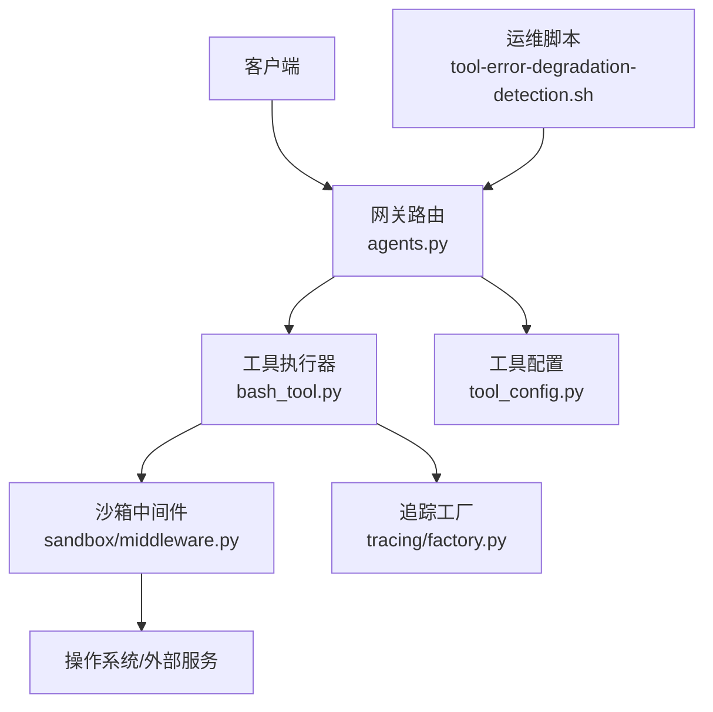
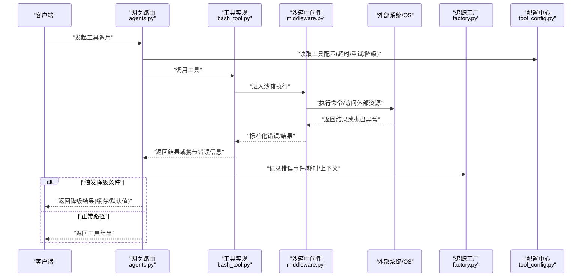
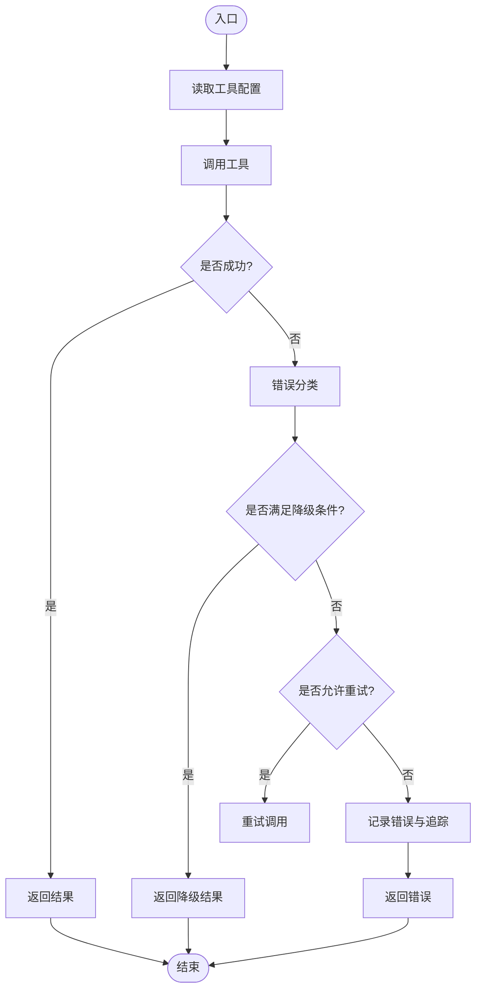
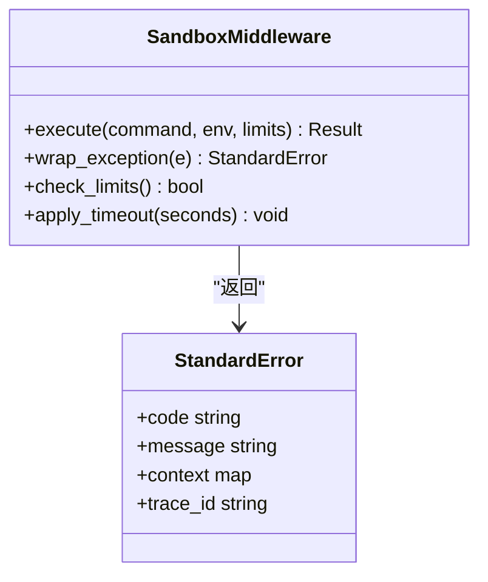
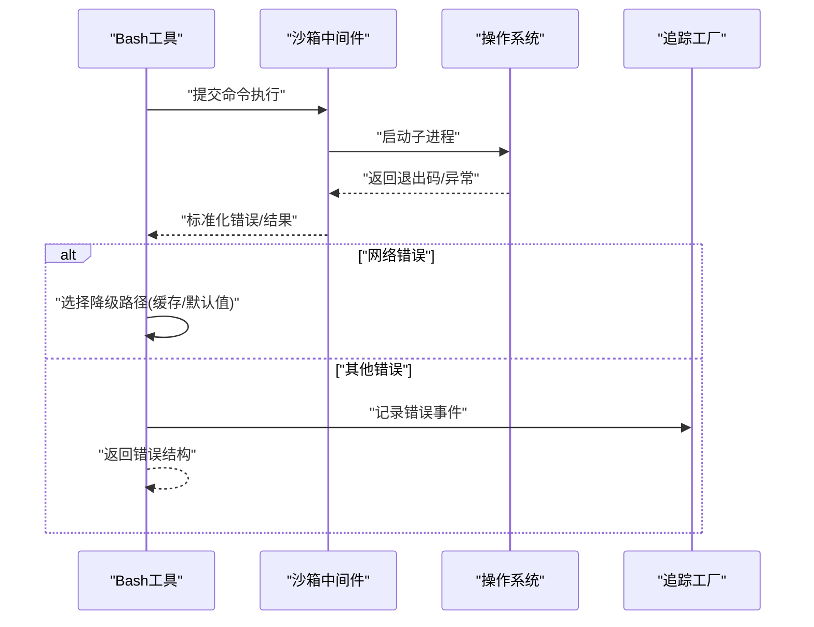
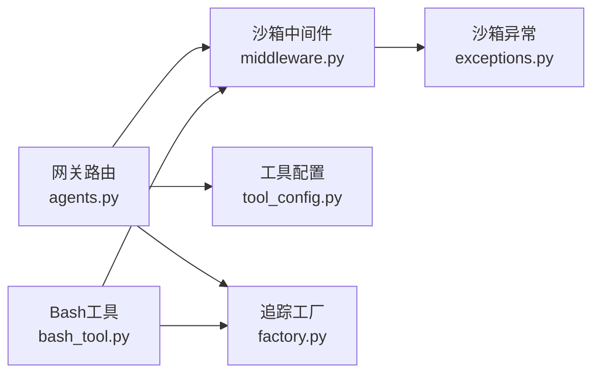

# 工具错误处理与降级

<cite>
**本文引用的文件**   
- [backend/app/gateway/routers/agents.py](file://backend/app/gateway/routers/agents.py)
- [backend/packages/harness/deerflow/tools/builtins/bash_tool.py](file://backend/packages/harness/deerflow/tools/builtins/bash_tool.py)
- [backend/packages/harness/deerflow/sandbox/middleware.py](file://backend/packages/harness/deerflow/sandbox/middleware.py)
- [backend/packages/harness/deerflow/sandbox/exceptions.py](file://backend/packages/harness/deerflow/sandbox/exceptions.py)
- [backend/packages/harness/deerflow/config/tool_config.py](file://backend/packages/harness/deerflow/config/tool_config.py)
- [backend/packages/harness/deerflow/tracing/factory.py](file://backend/packages/harness/deerflow/tracing/factory.py)
- [scripts/tool-error-degradation-detection.sh](file://scripts/tool-error-degradation-detection.sh)
</cite>

## 目录
1. [简介](#简介)
2. [项目结构](#项目结构)
3. [核心组件](#核心组件)
4. [架构总览](#架构总览)
5. [详细组件分析](#详细组件分析)
6. [依赖关系分析](#依赖关系分析)
7. [性能考虑](#性能考虑)
8. [故障排查指南](#故障排查指南)
9. [结论](#结论)
10. [附录](#附录)

## 简介
本文件聚焦于“工具执行过程中的错误处理与降级策略”，覆盖异常捕获、超时控制、网络错误、资源不足等常见错误的处理方式；阐述工具的降级与容错机制，确保在部分工具不可用时系统仍可运行；说明错误日志记录与监控告警机制，并提供配置选项与自定义错误处理器开发指南。

## 项目结构
围绕工具错误处理与降级的关键代码主要分布在以下位置：
- 网关路由层：负责调用工具并统一处理返回结果与异常
- 沙箱中间件：对工具执行进行隔离、限流、资源保护与异常包装
- 内置工具实现：具体工具（如 Bash）的错误捕获与降级逻辑
- 配置中心：提供超时、重试、熔断、降级开关等可观测性与稳定性参数
- 追踪工厂：为错误路径注入追踪上下文，便于定位问题
- 运维脚本：用于检测工具降级状态与触发告警

图表来源
- [backend/app/gateway/routers/agents.py](file://backend/app/gateway/routers/agents.py)
- [backend/packages/harness/deerflow/tools/builtins/bash_tool.py](file://backend/packages/harness/deerflow/tools/builtins/bash_tool.py)
- [backend/packages/harness/deerflow/sandbox/middleware.py](file://backend/packages/harness/deerflow/sandbox/middleware.py)
- [backend/packages/harness/deerflow/tracing/factory.py](file://backend/packages/harness/deerflow/tracing/factory.py)
- [backend/packages/harness/deerflow/config/tool_config.py](file://backend/packages/harness/deerflow/config/tool_config.py)
- [scripts/tool-error-degradation-detection.sh](file://scripts/tool-error-degradation-detection.sh)

章节来源
- [backend/app/gateway/routers/agents.py](file://backend/app/gateway/routers/agents.py)
- [backend/packages/harness/deerflow/tools/builtins/bash_tool.py](file://backend/packages/harness/deerflow/tools/builtins/bash_tool.py)
- [backend/packages/harness/deerflow/sandbox/middleware.py](file://backend/packages/harness/deerflow/sandbox/middleware.py)
- [backend/packages/harness/deerflow/config/tool_config.py](file://backend/packages/harness/deerflow/config/tool_config.py)
- [backend/packages/harness/deerflow/tracing/factory.py](file://backend/packages/harness/deerflow/tracing/factory.py)
- [scripts/tool-error-degradation-detection.sh](file://scripts/tool-error-degradation-detection.sh)

## 核心组件
- 网关路由层
  - 职责：接收请求、调度工具、统一封装响应、将异常转换为标准错误结构，并写入追踪上下文。
  - 关键点：对工具调用的异常进行捕获与分类，结合配置决定是否降级或重试。
- 沙箱中间件
  - 职责：在执行前后注入上下文、限制资源使用、拦截超时与资源不足异常、标准化错误码。
  - 关键点：将底层异常包装为上层可识别的语义化错误类型，便于路由层决策。
- 内置工具（以 Bash 为例）
  - 职责：执行命令、捕获子进程异常、处理超时与退出码、输出结构化结果。
  - 关键点：对网络相关命令失败进行区分，必要时走降级路径（如返回缓存或空结果）。
- 配置中心
  - 职责：集中管理工具级超时、重试次数、熔断阈值、降级开关、采样率等。
  - 关键点：支持热更新与运行时读取，影响错误处理与降级行为。
- 追踪工厂
  - 职责：创建/传播追踪上下文，记录错误事件、耗时、堆栈摘要等。
  - 关键点：为错误路径提供可观测性，支撑告警与排障。
- 运维脚本
  - 职责：周期性探测工具健康度，统计错误率与降级比例，触发告警。
  - 关键点：基于指标阈值判断是否进入降级模式。

章节来源
- [backend/app/gateway/routers/agents.py](file://backend/app/gateway/routers/agents.py)
- [backend/packages/harness/deerflow/sandbox/middleware.py](file://backend/packages/harness/deerflow/sandbox/middleware.py)
- [backend/packages/harness/deerflow/tools/builtins/bash_tool.py](file://backend/packages/harness/deerflow/tools/builtins/bash_tool.py)
- [backend/packages/harness/deerflow/config/tool_config.py](file://backend/packages/harness/deerflow/config/tool_config.py)
- [backend/packages/harness/deerflow/tracing/factory.py](file://backend/packages/harness/deerflow/tracing/factory.py)
- [scripts/tool-error-degradation-detection.sh](file://scripts/tool-error-degradation-detection.sh)

## 架构总览
下图展示了从请求进入到工具执行、异常捕获、降级决策与追踪记录的完整链路。

图表来源
- [backend/app/gateway/routers/agents.py](file://backend/app/gateway/routers/agents.py)
- [backend/packages/harness/deerflow/tools/builtins/bash_tool.py](file://backend/packages/harness/deerflow/tools/builtins/bash_tool.py)
- [backend/packages/harness/deerflow/sandbox/middleware.py](file://backend/packages/harness/deerflow/sandbox/middleware.py)
- [backend/packages/harness/deerflow/config/tool_config.py](file://backend/packages/harness/deerflow/config/tool_config.py)
- [backend/packages/harness/deerflow/tracing/factory.py](file://backend/packages/harness/deerflow/tracing/factory.py)

## 详细组件分析

### 网关路由层错误处理与降级
- 异常捕获与分类
  - 捕获工具执行抛出的异常，依据错误类型（超时、网络、权限、资源不足等）进行分类。
  - 将异常映射为标准错误结构，包含错误码、消息、上下文标识（如 trace_id）、建议操作。
- 降级决策
  - 根据配置中心的降级开关与熔断阈值，决定直接返回降级结果或继续重试。
  - 降级结果可为缓存数据、默认值或提示用户稍后重试。
- 追踪与告警
  - 通过追踪工厂记录错误事件，包括错误类型、堆栈摘要、耗时、资源占用等。
  - 当错误率超过阈值时，触发告警并自动进入降级模式。

图表来源
- [backend/app/gateway/routers/agents.py](file://backend/app/gateway/routers/agents.py)
- [backend/packages/harness/deerflow/config/tool_config.py](file://backend/packages/harness/deerflow/config/tool_config.py)

章节来源
- [backend/app/gateway/routers/agents.py](file://backend/app/gateway/routers/agents.py)
- [backend/packages/harness/deerflow/config/tool_config.py](file://backend/packages/harness/deerflow/config/tool_config.py)

### 沙箱中间件异常包装与资源保护
- 异常包装
  - 将底层异常（如子进程崩溃、信号中断、IO 错误）包装为语义化错误类型，便于上层统一处理。
  - 增加上下文字段（如命令、工作目录、环境变量），辅助定位问题。
- 资源保护
  - 限制 CPU/内存/文件句柄等资源使用，防止单个工具耗尽系统资源。
  - 对长时间运行的任务设置超时，避免阻塞主流程。
- 标准化错误码
  - 定义统一的错误码空间（如超时、网络、权限、资源不足、内部错误），提升可观测性与一致性。

图表来源
- [backend/packages/harness/deerflow/sandbox/middleware.py](file://backend/packages/harness/deerflow/sandbox/middleware.py)
- [backend/packages/harness/deerflow/sandbox/exceptions.py](file://backend/packages/harness/deerflow/sandbox/exceptions.py)

章节来源
- [backend/packages/harness/deerflow/sandbox/middleware.py](file://backend/packages/harness/deerflow/sandbox/middleware.py)
- [backend/packages/harness/deerflow/sandbox/exceptions.py](file://backend/packages/harness/deerflow/sandbox/exceptions.py)

### 内置工具（Bash）错误处理与降级
- 错误捕获
  - 捕获子进程异常、非零退出码、超时、权限拒绝等场景。
  - 对网络相关命令失败进行区分，记录更详细的诊断信息（如 DNS 解析失败、连接被拒）。
- 降级策略
  - 在网络不可用时，尝试返回本地缓存或默认结果。
  - 在资源不足时，降低并发或跳过非必要步骤，保证核心功能可用。
- 输出规范
  - 无论成功或失败，均返回结构化结果，包含状态码、消息、耗时、追踪 ID。

图表来源
- [backend/packages/harness/deerflow/tools/builtins/bash_tool.py](file://backend/packages/harness/deerflow/tools/builtins/bash_tool.py)
- [backend/packages/harness/deerflow/sandbox/middleware.py](file://backend/packages/harness/deerflow/sandbox/middleware.py)
- [backend/packages/harness/deerflow/tracing/factory.py](file://backend/packages/harness/deerflow/tracing/factory.py)

章节来源
- [backend/packages/harness/deerflow/tools/builtins/bash_tool.py](file://backend/packages/harness/deerflow/tools/builtins/bash_tool.py)
- [backend/packages/harness/deerflow/sandbox/middleware.py](file://backend/packages/harness/deerflow/sandbox/middleware.py)
- [backend/packages/harness/deerflow/tracing/factory.py](file://backend/packages/harness/deerflow/tracing/factory.py)

### 配置项与自定义错误处理器
- 配置项（示例键名）
  - tool.timeout_seconds：工具执行超时时间
  - tool.retry.max_attempts：最大重试次数
  - tool.retry.backoff_base：退避基数
  - tool.circuit_breaker.error_threshold：熔断错误阈值
  - tool.fallback.enabled：是否启用降级
  - tool.fallback.strategy：降级策略（cache/default/none）
  - tool.tracing.sample_rate：追踪采样率
- 自定义错误处理器
  - 接口约定：接收标准化错误对象，返回处理结果（重试、降级、告警、丢弃等）。
  - 注册方式：在配置中指定处理器类路径，或在初始化时注入到路由层。
  - 最佳实践：保持幂等、快速返回、避免二次异常；记录必要上下文以便排障。

章节来源
- [backend/packages/harness/deerflow/config/tool_config.py](file://backend/packages/harness/deerflow/config/tool_config.py)
- [backend/app/gateway/routers/agents.py](file://backend/app/gateway/routers/agents.py)

### 监控告警与运维脚本
- 监控指标
  - 错误率、平均耗时、P99/P999 耗时、降级比例、熔断触发次数。
- 告警规则
  - 错误率超过阈值持续 N 分钟触发告警。
  - 降级比例超过阈值自动进入全局降级模式。
- 运维脚本
  - 定期探测工具健康度，汇总错误与降级指标，推送至监控系统。
  - 支持手动触发降级或恢复操作。

章节来源
- [scripts/tool-error-degradation-detection.sh](file://scripts/tool-error-degradation-detection.sh)
- [backend/packages/harness/deerflow/tracing/factory.py](file://backend/packages/harness/deerflow/tracing/factory.py)

## 依赖关系分析
- 组件耦合
  - 网关路由层依赖沙箱中间件与配置中心，间接依赖追踪工厂。
  - 内置工具依赖沙箱中间件进行资源保护与异常包装。
- 外部依赖
  - 操作系统与外部服务（网络、文件系统、数据库等）可能引入不稳定因素。
- 潜在循环依赖
  - 当前设计通过中间件与配置解耦，未出现明显循环依赖。
- 接口契约
  - 标准化错误对象作为跨层契约，确保错误信息一致性与可观测性。

图表来源
- [backend/app/gateway/routers/agents.py](file://backend/app/gateway/routers/agents.py)
- [backend/packages/harness/deerflow/tools/builtins/bash_tool.py](file://backend/packages/harness/deerflow/tools/builtins/bash_tool.py)
- [backend/packages/harness/deerflow/sandbox/middleware.py](file://backend/packages/harness/deerflow/sandbox/middleware.py)
- [backend/packages/harness/deerflow/sandbox/exceptions.py](file://backend/packages/harness/deerflow/sandbox/exceptions.py)
- [backend/packages/harness/deerflow/config/tool_config.py](file://backend/packages/harness/deerflow/config/tool_config.py)
- [backend/packages/harness/deerflow/tracing/factory.py](file://backend/packages/harness/deerflow/tracing/factory.py)

章节来源
- [backend/app/gateway/routers/agents.py](file://backend/app/gateway/routers/agents.py)
- [backend/packages/harness/deerflow/tools/builtins/bash_tool.py](file://backend/packages/harness/deerflow/tools/builtins/bash_tool.py)
- [backend/packages/harness/deerflow/sandbox/middleware.py](file://backend/packages/harness/deerflow/sandbox/middleware.py)
- [backend/packages/harness/deerflow/sandbox/exceptions.py](file://backend/packages/harness/deerflow/sandbox/exceptions.py)
- [backend/packages/harness/deerflow/config/tool_config.py](file://backend/packages/harness/deerflow/config/tool_config.py)
- [backend/packages/harness/deerflow/tracing/factory.py](file://backend/packages/harness/deerflow/tracing/factory.py)

## 性能考虑
- 超时与重试
  - 合理设置超时时间与重试次数，避免雪崩效应；采用指数退避减少瞬时压力。
- 资源限制
  - 对 CPU、内存、I/O 进行限制，防止单点故障扩散。
- 采样与开销
  - 追踪采样率需平衡可观测性与性能开销；高负载下适当降低采样率。
- 降级成本
  - 降级路径应尽量轻量，避免引入额外延迟；缓存命中优先。

[本节为通用指导，不直接分析具体文件]

## 故障排查指南
- 常见问题
  - 超时：检查工具超时配置与外部服务响应时间；查看追踪中的耗时分布。
  - 网络错误：确认 DNS、代理、防火墙策略；关注网络相关错误码。
  - 资源不足：观察系统资源使用率；调整沙箱限制或扩容实例。
  - 权限问题：校验运行账户权限与文件访问策略。
- 定位方法
  - 通过追踪 ID 关联错误事件与日志，快速定位根因。
  - 使用运维脚本获取实时健康度与降级状态。
- 恢复策略
  - 临时降级：启用缓存或默认值，保障核心功能。
  - 逐步恢复：降低流量或分批恢复，观察错误率变化。

章节来源
- [scripts/tool-error-degradation-detection.sh](file://scripts/tool-error-degradation-detection.sh)
- [backend/packages/harness/deerflow/tracing/factory.py](file://backend/packages/harness/deerflow/tracing/factory.py)

## 结论
通过网关路由层的统一异常处理与降级决策、沙箱中间件的资源保护与异常包装、内置工具的精细化错误捕获与降级路径、配置中心的灵活参数控制以及追踪工厂的可观测性支撑，系统在部分工具不可用时仍能保持稳定运行。配合监控告警与运维脚本，可实现快速定位与自动恢复，提升整体可靠性与用户体验。

[本节为总结性内容，不直接分析具体文件]

## 附录
- 术语
  - 降级：在部分功能不可用时，返回替代结果以保证核心流程可用。
  - 熔断：当错误率超过阈值时，暂时停止调用外部依赖，避免雪崩。
  - 追踪：记录请求全链路上下文，便于问题定位与分析。
- 参考实现路径
  - 网关路由层错误处理与降级：[backend/app/gateway/routers/agents.py](file://backend/app/gateway/routers/agents.py)
  - 沙箱中间件异常包装与资源保护：[backend/packages/harness/deerflow/sandbox/middleware.py](file://backend/packages/harness/deerflow/sandbox/middleware.py)
  - 内置工具（Bash）错误处理与降级：[backend/packages/harness/deerflow/tools/builtins/bash_tool.py](file://backend/packages/harness/deerflow/tools/builtins/bash_tool.py)
  - 工具配置项：[backend/packages/harness/deerflow/config/tool_config.py](file://backend/packages/harness/deerflow/config/tool_config.py)
  - 追踪工厂：[backend/packages/harness/deerflow/tracing/factory.py](file://backend/packages/harness/deerflow/tracing/factory.py)
  - 运维脚本：[scripts/tool-error-degradation-detection.sh](file://scripts/tool-error-degradation-detection.sh)