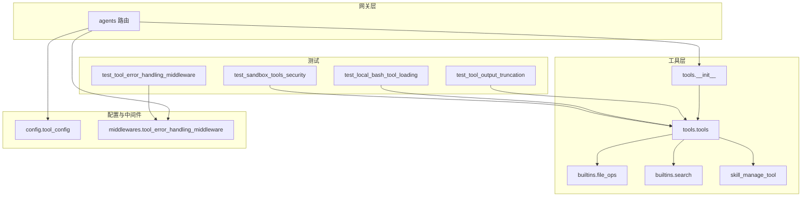
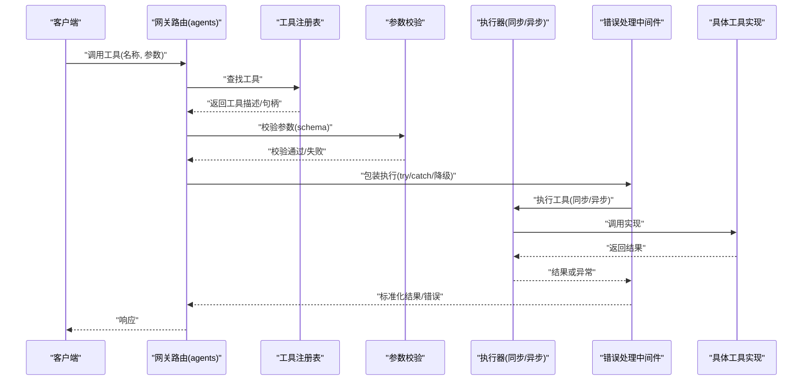
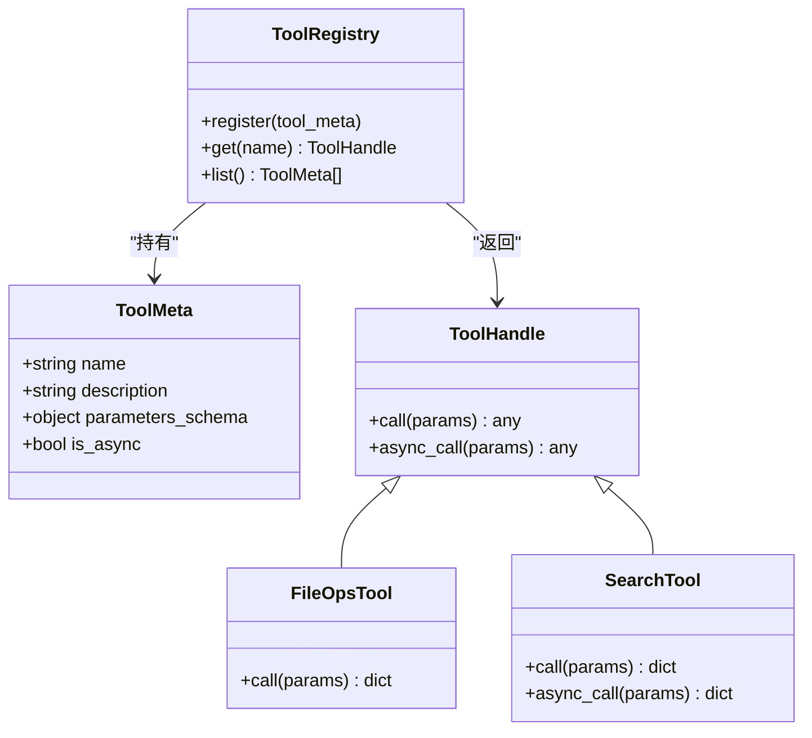
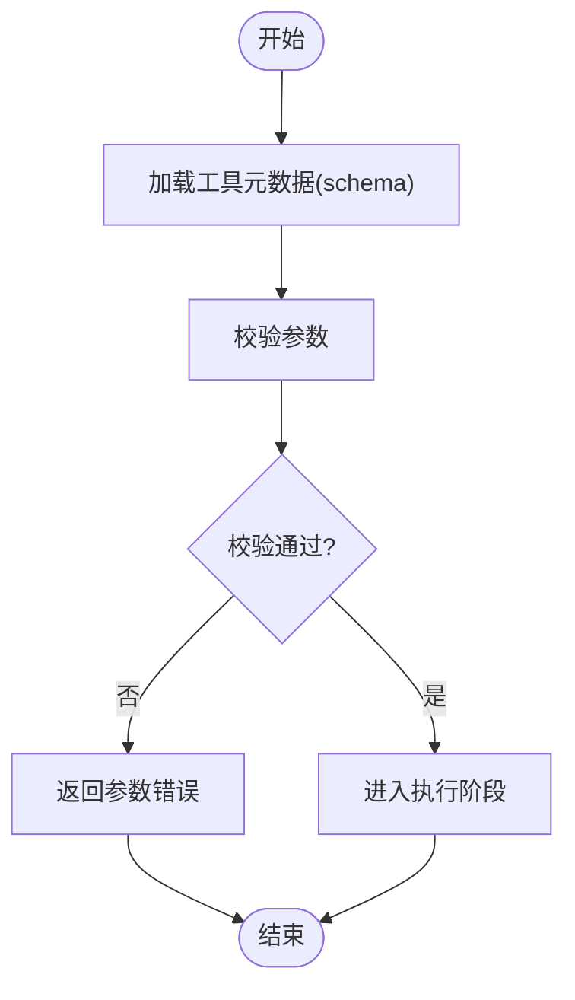
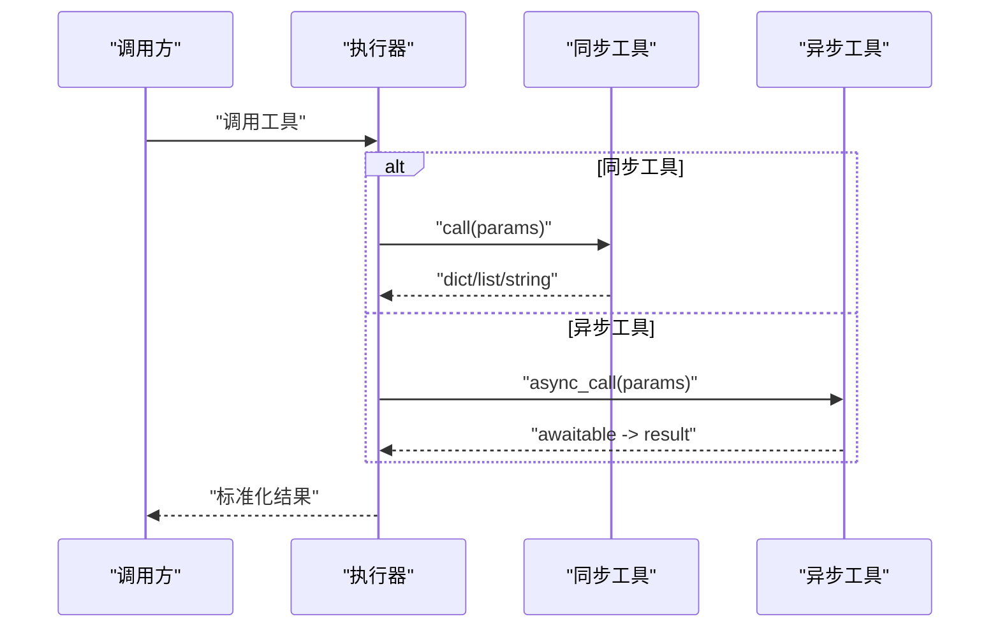
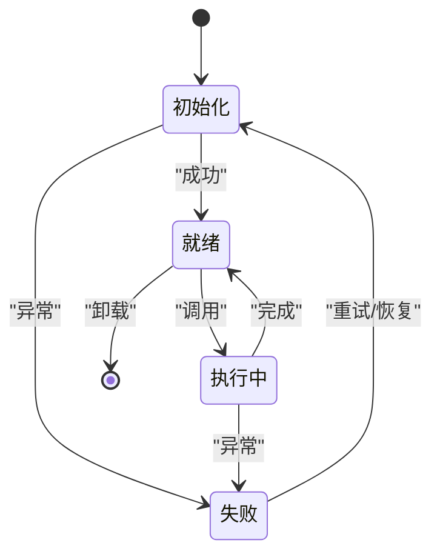
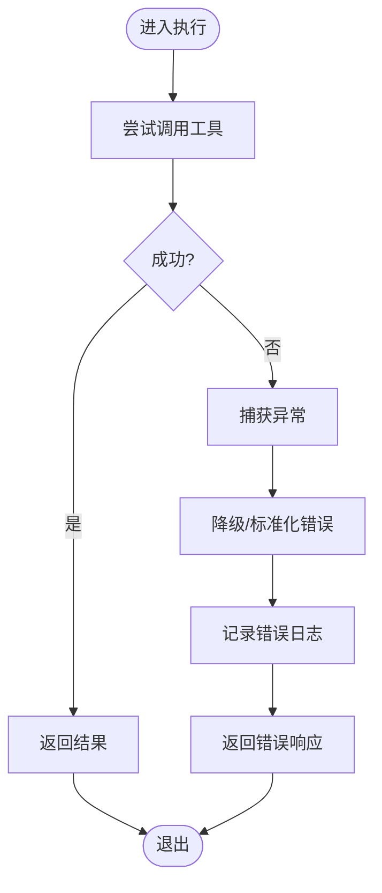
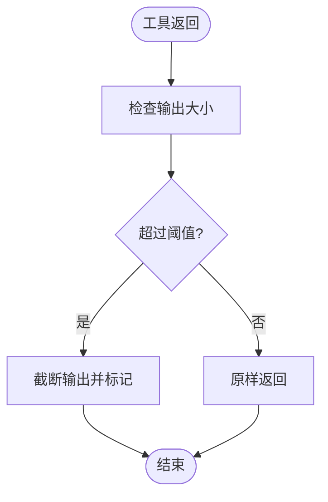
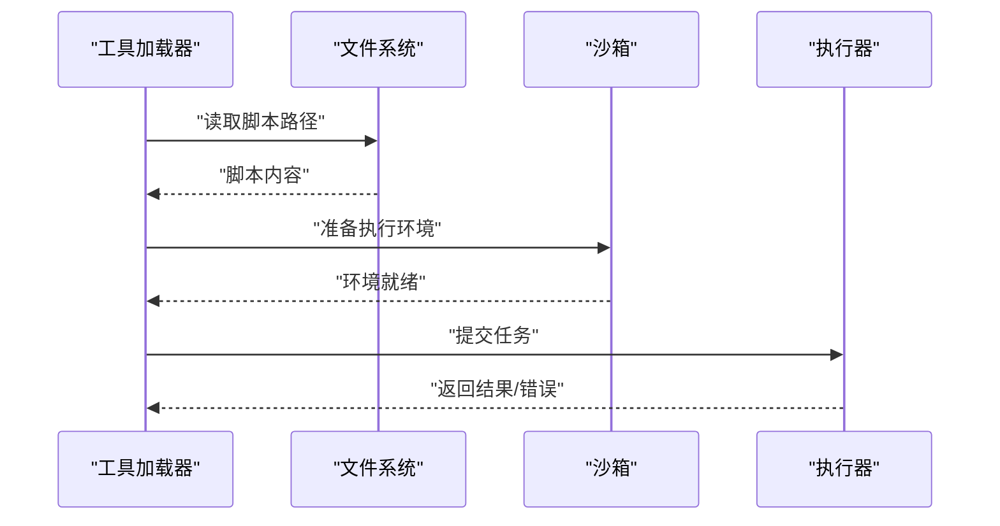
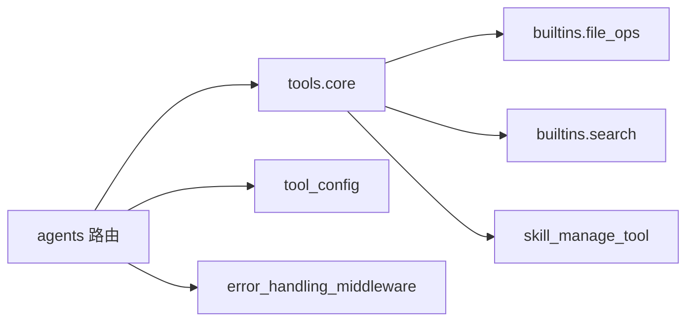

# 自定义工具开发

<cite>
**本文引用的文件**   
- [backend/app/gateway/routers/agents.py](file://backend/app/gateway/routers/agents.py)
- [backend/packages/harness/deerflow/tools/__init__.py](file://backend/packages/harness/deerflow/tools/__init__.py)
- [backend/packages/harness/deerflow/tools/tools.py](file://backend/packages/harness/deerflow/tools/tools.py)
- [backend/packages/harness/deerflow/tools/builtins/file_ops.py](file://backend/packages/harness/deerflow/tools/builtins/file_ops.py)
- [backend/packages/harness/deerflow/tools/builtins/search.py](file://backend/packages/harness/deerflow/tools/builtins/search.py)
- [backend/packages/harness/deerflow/tools/skill_manage_tool.py](file://backend/packages/harness/deerflow/tools/skill_manage_tool.py)
- [backend/packages/harness/deerflow/config/tool_config.py](file://backend/packages/harness/deerflow/config/tool_config.py)
- [backend/packages/harness/deerflow/middlewares/tool_error_handling_middleware.py](file://backend/packages/harness/deerflow/middlewares/tool_error_handling_middleware.py)
- [backend/tests/test_tool_error_handling_middleware.py](file://backend/tests/test_tool_error_handling_middleware.py)
- [backend/tests/test_tool_output_truncation.py](file://backend/tests/test_tool_output_truncation.py)
- [backend/tests/test_local_bash_tool_loading.py](file://backend/tests/test_local_bash_tool_loading.py)
- [backend/tests/test_sandbox_tools_security.py](file://backend/tests/test_sandbox_tools_security.py)
</cite>

## 目录
1. [简介](#简介)
2. [项目结构](#项目结构)
3. [核心组件](#核心组件)
4. [架构总览](#架构总览)
5. [详细组件分析](#详细组件分析)
6. [依赖关系分析](#依赖关系分析)
7. [性能考虑](#性能考虑)
8. [故障排查指南](#故障排查指南)
9. [结论](#结论)
10. [附录](#附录)

## 简介
本指南面向希望在 Deer-Flow 中开发“自定义工具”的工程师，系统阐述如何定义新的工具类、声明元数据与参数校验、实现同步与异步执行逻辑、规范返回值格式，并覆盖工具生命周期管理、错误处理策略、日志记录机制、测试方法与调试技巧。文档以仓库现有工具基础设施为依据，提供从简单到复杂的渐进式示例路径，帮助读者快速上手并构建高质量的工具。

## 项目结构
Deer-Flow 的后端将“工具”作为一等公民进行注册、发现、校验与执行。关键位置如下：
- 工具注册与基础能力：tools 包入口与通用工具封装
- 内置工具示例：文件操作、搜索等
- 配置与加载：工具配置项与加载流程
- 中间件：错误处理、输出截断、沙箱安全等
- 网关路由：Agent 调用工具时的入口
- 测试：覆盖错误降级、输出截断、本地 Bash 工具加载、沙箱安全等

图表来源
- [backend/app/gateway/routers/agents.py](file://backend/app/gateway/routers/agents.py)
- [backend/packages/harness/deerflow/tools/__init__.py](file://backend/packages/harness/deerflow/tools/__init__.py)
- [backend/packages/harness/deerflow/tools/tools.py](file://backend/packages/harness/deerflow/tools/tools.py)
- [backend/packages/harness/deerflow/tools/builtins/file_ops.py](file://backend/packages/harness/deerflow/tools/builtins/file_ops.py)
- [backend/packages/harness/deerflow/tools/builtins/search.py](file://backend/packages/harness/deerflow/tools/builtins/search.py)
- [backend/packages/harness/deerflow/tools/skill_manage_tool.py](file://backend/packages/harness/deerflow/tools/skill_manage_tool.py)
- [backend/packages/harness/deerflow/config/tool_config.py](file://backend/packages/harness/deerflow/config/tool_config.py)
- [backend/packages/harness/deerflow/middlewares/tool_error_handling_middleware.py](file://backend/packages/harness/deerflow/middlewares/tool_error_handling_middleware.py)
- [backend/tests/test_tool_error_handling_middleware.py](file://backend/tests/test_tool_error_handling_middleware.py)
- [backend/tests/test_tool_output_truncation.py](file://backend/tests/test_tool_output_truncation.py)
- [backend/tests/test_local_bash_tool_loading.py](file://backend/tests/test_local_bash_tool_loading.py)
- [backend/tests/test_sandbox_tools_security.py](file://backend/tests/test_sandbox_tools_security.py)

章节来源
- [backend/app/gateway/routers/agents.py](file://backend/app/gateway/routers/agents.py)
- [backend/packages/harness/deerflow/tools/__init__.py](file://backend/packages/harness/deerflow/tools/__init__.py)
- [backend/packages/harness/deerflow/tools/tools.py](file://backend/packages/harness/deerflow/tools/tools.py)
- [backend/packages/harness/deerflow/config/tool_config.py](file://backend/packages/harness/deerflow/config/tool_config.py)
- [backend/packages/harness/deerflow/middlewares/tool_error_handling_middleware.py](file://backend/packages/harness/deerflow/middlewares/tool_error_handling_middleware.py)

## 核心组件
- 工具注册与发现
  - 通过 tools 包的入口与核心模块完成工具的声明、注册与发现。新工具应遵循统一的注册约定，以便在运行时被自动发现与装配。
- 工具元数据与参数校验
  - 使用统一的元数据描述工具名称、描述、参数 schema、是否异步等信息；参数校验由框架基于 schema 自动完成，减少重复验证代码。
- 执行逻辑与返回值
  - 支持同步与异步两种模式；返回值需为可序列化的数据结构（如字典、列表、字符串），便于后续中间件处理与前端展示。
- 生命周期管理
  - 工具实例化、初始化、执行、资源释放由框架统一编排；复杂工具可在初始化阶段建立连接或缓存资源，在执行后按需清理。
- 错误处理与日志
  - 错误处理中间件负责捕获异常、降级返回、标准化错误消息；建议工具内部记录结构化日志，包含上下文信息（如输入摘要、耗时）。

章节来源
- [backend/packages/harness/deerflow/tools/__init__.py](file://backend/packages/harness/deerflow/tools/__init__.py)
- [backend/packages/harness/deerflow/tools/tools.py](file://backend/packages/harness/deerflow/tools/tools.py)
- [backend/packages/harness/deerflow/middlewares/tool_error_handling_middleware.py](file://backend/packages/harness/deerflow/middlewares/tool_error_handling_middleware.py)

## 架构总览
下图展示了 Agent 调用工具的整体流程：网关路由接收请求，解析工具名与参数，进入工具执行管线（含校验、中间件、执行器），最终返回结果。

图表来源
- [backend/app/gateway/routers/agents.py](file://backend/app/gateway/routers/agents.py)
- [backend/packages/harness/deerflow/tools/tools.py](file://backend/packages/harness/deerflow/tools/tools.py)
- [backend/packages/harness/deerflow/middlewares/tool_error_handling_middleware.py](file://backend/packages/harness/deerflow/middlewares/tool_error_handling_middleware.py)

## 详细组件分析

### 工具注册与发现（tools 包）
- 职责
  - 提供工具注册接口与发现机制；维护工具清单与元数据；暴露统一的工具调用入口。
- 设计要点
  - 元数据驱动：每个工具需提供名称、描述、参数 schema、是否异步等元数据。
  - 自动发现：按约定扫描内置与扩展工具目录，避免硬编码。
  - 版本兼容：元数据变更需保持向后兼容。
- 参考实现
  - 入口与核心封装位于 tools 包，内置工具示例包括文件操作与搜索。

图表来源
- [backend/packages/harness/deerflow/tools/__init__.py](file://backend/packages/harness/deerflow/tools/__init__.py)
- [backend/packages/harness/deerflow/tools/tools.py](file://backend/packages/harness/deerflow/tools/tools.py)
- [backend/packages/harness/deerflow/tools/builtins/file_ops.py](file://backend/packages/harness/deerflow/tools/builtins/file_ops.py)
- [backend/packages/harness/deerflow/tools/builtins/search.py](file://backend/packages/harness/deerflow/tools/builtins/search.py)

章节来源
- [backend/packages/harness/deerflow/tools/__init__.py](file://backend/packages/harness/deerflow/tools/__init__.py)
- [backend/packages/harness/deerflow/tools/tools.py](file://backend/packages/harness/deerflow/tools/tools.py)
- [backend/packages/harness/deerflow/tools/builtins/file_ops.py](file://backend/packages/harness/deerflow/tools/builtins/file_ops.py)
- [backend/packages/harness/deerflow/tools/builtins/search.py](file://backend/packages/harness/deerflow/tools/builtins/search.py)

### 参数校验与元数据
- 校验流程
  - 基于工具元数据中的参数 schema 对输入进行强类型校验；不合法参数直接返回错误，避免进入执行阶段。
- 最佳实践
  - 明确必填字段、类型约束、取值范围；为可选参数提供默认值；对敏感参数进行脱敏处理。
- 参考实现
  - 校验逻辑与元数据定义集中在工具核心模块与内置工具中。

图表来源
- [backend/packages/harness/deerflow/tools/tools.py](file://backend/packages/harness/deerflow/tools/tools.py)
- [backend/packages/harness/deerflow/tools/builtins/file_ops.py](file://backend/packages/harness/deerflow/tools/builtins/file_ops.py)
- [backend/packages/harness/deerflow/tools/builtins/search.py](file://backend/packages/harness/deerflow/tools/builtins/search.py)

章节来源
- [backend/packages/harness/deerflow/tools/tools.py](file://backend/packages/harness/deerflow/tools/tools.py)
- [backend/packages/harness/deerflow/tools/builtins/file_ops.py](file://backend/packages/harness/deerflow/tools/builtins/file_ops.py)
- [backend/packages/harness/deerflow/tools/builtins/search.py](file://backend/packages/harness/deerflow/tools/builtins/search.py)

### 执行逻辑与返回值格式
- 同步与异步
  - 同步工具直接返回结果；异步工具返回协程或 Future，由执行器统一调度。
- 返回值规范
  - 推荐返回字典结构，包含状态码、数据体、附加信息；确保可序列化。
- 参考实现
  - 内置工具展示了不同返回结构的用法；复杂业务可通过组合多个子工具完成。

图表来源
- [backend/packages/harness/deerflow/tools/tools.py](file://backend/packages/harness/deerflow/tools/tools.py)
- [backend/packages/harness/deerflow/tools/builtins/search.py](file://backend/packages/harness/deerflow/tools/builtins/search.py)

章节来源
- [backend/packages/harness/deerflow/tools/tools.py](file://backend/packages/harness/deerflow/tools/tools.py)
- [backend/packages/harness/deerflow/tools/builtins/search.py](file://backend/packages/harness/deerflow/tools/builtins/search.py)

### 生命周期管理
- 阶段划分
  - 初始化：创建连接、预热缓存、加载配置。
  - 执行：处理单次调用，幂等性优先。
  - 释放：关闭连接、清理临时资源。
- 注意事项
  - 避免在初始化阶段做重 IO；长连接需具备健康检查与重试；并发场景下注意线程/协程安全。
- 参考实现
  - 工具核心模块提供生命周期钩子；复杂工具（如技能管理工具）演示了更丰富的生命周期行为。

图表来源
- [backend/packages/harness/deerflow/tools/tools.py](file://backend/packages/harness/deerflow/tools/tools.py)
- [backend/packages/harness/deerflow/tools/skill_manage_tool.py](file://backend/packages/harness/deerflow/tools/skill_manage_tool.py)

章节来源
- [backend/packages/harness/deerflow/tools/tools.py](file://backend/packages/harness/deerflow/tools/tools.py)
- [backend/packages/harness/deerflow/tools/skill_manage_tool.py](file://backend/packages/harness/deerflow/tools/skill_manage_tool.py)

### 错误处理策略与日志记录
- 错误处理
  - 中间件统一捕获异常，进行降级返回与标准化错误消息；支持重试与熔断策略（视配置而定）。
- 日志记录
  - 建议在工具内部记录结构化日志，包含输入摘要、耗时、关键步骤；避免记录敏感信息。
- 参考实现
  - 错误处理中间件与相关测试覆盖了常见异常路径与降级行为。

图表来源
- [backend/packages/harness/deerflow/middlewares/tool_error_handling_middleware.py](file://backend/packages/harness/deerflow/middlewares/tool_error_handling_middleware.py)
- [backend/tests/test_tool_error_handling_middleware.py](file://backend/tests/test_tool_error_handling_middleware.py)

章节来源
- [backend/packages/harness/deerflow/middlewares/tool_error_handling_middleware.py](file://backend/packages/harness/deerflow/middlewares/tool_error_handling_middleware.py)
- [backend/tests/test_tool_error_handling_middleware.py](file://backend/tests/test_tool_error_handling_middleware.py)

### 输出截断与安全限制
- 输出截断
  - 为防止大输出导致内存与传输问题，框架提供输出截断能力；工具应避免返回超大对象。
- 沙箱安全
  - 在受限环境中运行工具时，需遵守沙箱策略（文件系统访问、网络白名单等）。
- 参考实现
  - 输出截断测试与沙箱安全测试提供了边界用例与期望行为。

图表来源
- [backend/tests/test_tool_output_truncation.py](file://backend/tests/test_tool_output_truncation.py)
- [backend/tests/test_sandbox_tools_security.py](file://backend/tests/test_sandbox_tools_security.py)

章节来源
- [backend/tests/test_tool_output_truncation.py](file://backend/tests/test_tool_output_truncation.py)
- [backend/tests/test_sandbox_tools_security.py](file://backend/tests/test_sandbox_tools_security.py)

### 本地 Bash 工具加载
- 功能说明
  - 支持加载本地 Bash 脚本作为工具，便于快速集成系统命令与外部程序。
- 安全建议
  - 严格限制可执行命令集合；在沙箱中运行；对输入进行白名单校验。
- 参考实现
  - 本地 Bash 工具加载测试覆盖了加载流程与基本行为。

图表来源
- [backend/tests/test_local_bash_tool_loading.py](file://backend/tests/test_local_bash_tool_loading.py)

章节来源
- [backend/tests/test_local_bash_tool_loading.py](file://backend/tests/test_local_bash_tool_loading.py)

## 依赖关系分析
- 组件耦合
  - 网关路由依赖工具注册表与配置；工具核心模块依赖内置工具与中间件；中间件独立于具体工具实现，提升可替换性。
- 外部依赖
  - 沙箱、网络、文件系统、第三方 API 等通过抽象接口接入，降低耦合度。
- 循环依赖
  - 通过分层与接口隔离避免循环依赖；工具实现仅依赖核心与中间件。

图表来源
- [backend/app/gateway/routers/agents.py](file://backend/app/gateway/routers/agents.py)
- [backend/packages/harness/deerflow/tools/tools.py](file://backend/packages/harness/deerflow/tools/tools.py)
- [backend/packages/harness/deerflow/config/tool_config.py](file://backend/packages/harness/deerflow/config/tool_config.py)
- [backend/packages/harness/deerflow/middlewares/tool_error_handling_middleware.py](file://backend/packages/harness/deerflow/middlewares/tool_error_handling_middleware.py)

章节来源
- [backend/app/gateway/routers/agents.py](file://backend/app/gateway/routers/agents.py)
- [backend/packages/harness/deerflow/tools/tools.py](file://backend/packages/harness/deerflow/tools/tools.py)
- [backend/packages/harness/deerflow/config/tool_config.py](file://backend/packages/harness/deerflow/config/tool_config.py)
- [backend/packages/harness/deerflow/middlewares/tool_error_handling_middleware.py](file://backend/packages/harness/deerflow/middlewares/tool_error_handling_middleware.py)

## 性能考虑
- 避免阻塞
  - 长时间运行的 I/O 操作应使用异步；合理设置超时与重试。
- 输出控制
  - 控制返回体积，必要时分页或流式返回；利用输出截断保护系统稳定性。
- 资源复用
  - 连接池、缓存、预取等策略可减少延迟；注意并发安全与内存占用。
- 监控与追踪
  - 结合链路追踪与指标采集，定位热点与瓶颈。

[本节为通用指导，无需源码引用]

## 故障排查指南
- 常见问题
  - 参数校验失败：检查工具元数据的 schema 与实际传入参数是否一致。
  - 执行超时：确认工具内部是否存在阻塞调用；调整超时配置。
  - 输出过大：启用输出截断或优化返回结构。
  - 沙箱限制：核对沙箱策略与权限配置。
- 定位方法
  - 查看错误处理中间件的日志与降级返回；结合单元测试复现问题。
- 参考测试
  - 错误处理、输出截断、本地 Bash 工具加载、沙箱安全等测试用例可作为排障参考。

章节来源
- [backend/tests/test_tool_error_handling_middleware.py](file://backend/tests/test_tool_error_handling_middleware.py)
- [backend/tests/test_tool_output_truncation.py](file://backend/tests/test_tool_output_truncation.py)
- [backend/tests/test_local_bash_tool_loading.py](file://backend/tests/test_local_bash_tool_loading.py)
- [backend/tests/test_sandbox_tools_security.py](file://backend/tests/test_sandbox_tools_security.py)

## 结论
通过统一的工具注册、元数据驱动的参数校验、同步/异步执行模型、标准化的错误处理与日志记录，以及完善的测试与沙箱安全机制，Deer-Flow 为自定义工具的开发提供了稳定且可扩展的基础设施。遵循本文档的最佳实践，可以快速构建高质量、可维护、可观测的自定义工具。

[本节为总结，无需源码引用]

## 附录
- 开发清单
  - 定义工具元数据（名称、描述、schema、是否异步）
  - 实现同步/异步执行逻辑
  - 规范化返回值结构
  - 添加结构化日志与必要监控
  - 编写单元测试与集成测试
  - 在沙箱环境下验证安全策略
- 参考路径
  - 工具注册与核心：tools 包入口与核心模块
  - 内置工具示例：文件操作、搜索、技能管理
  - 配置与中间件：工具配置、错误处理中间件
  - 测试用例：错误处理、输出截断、本地 Bash 工具加载、沙箱安全

[本节为补充信息，无需源码引用]