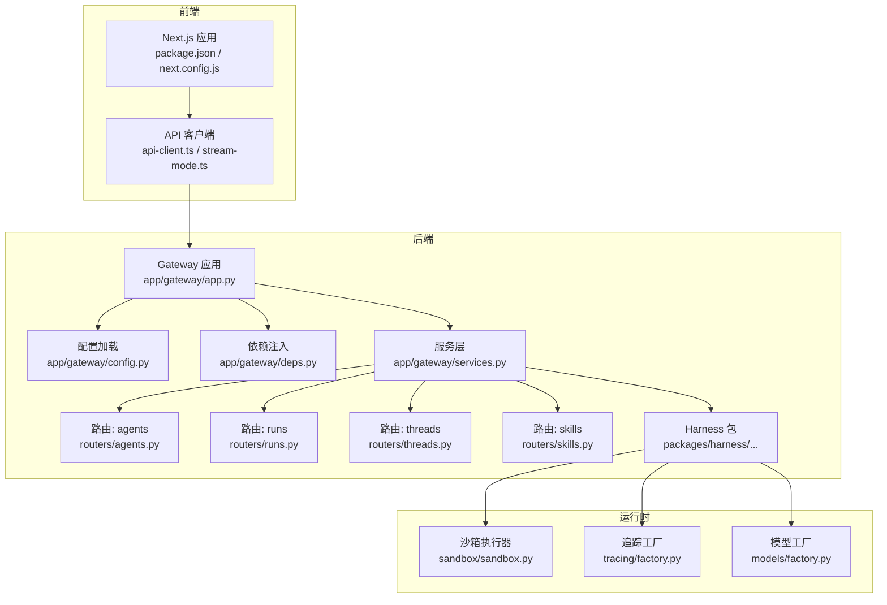
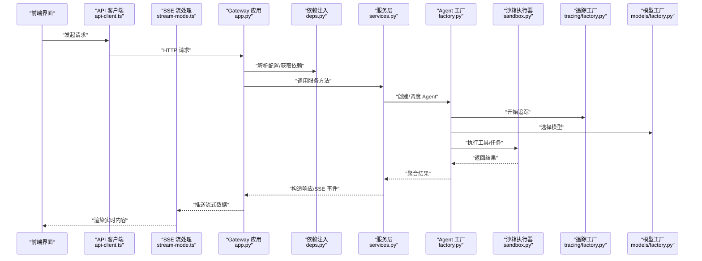
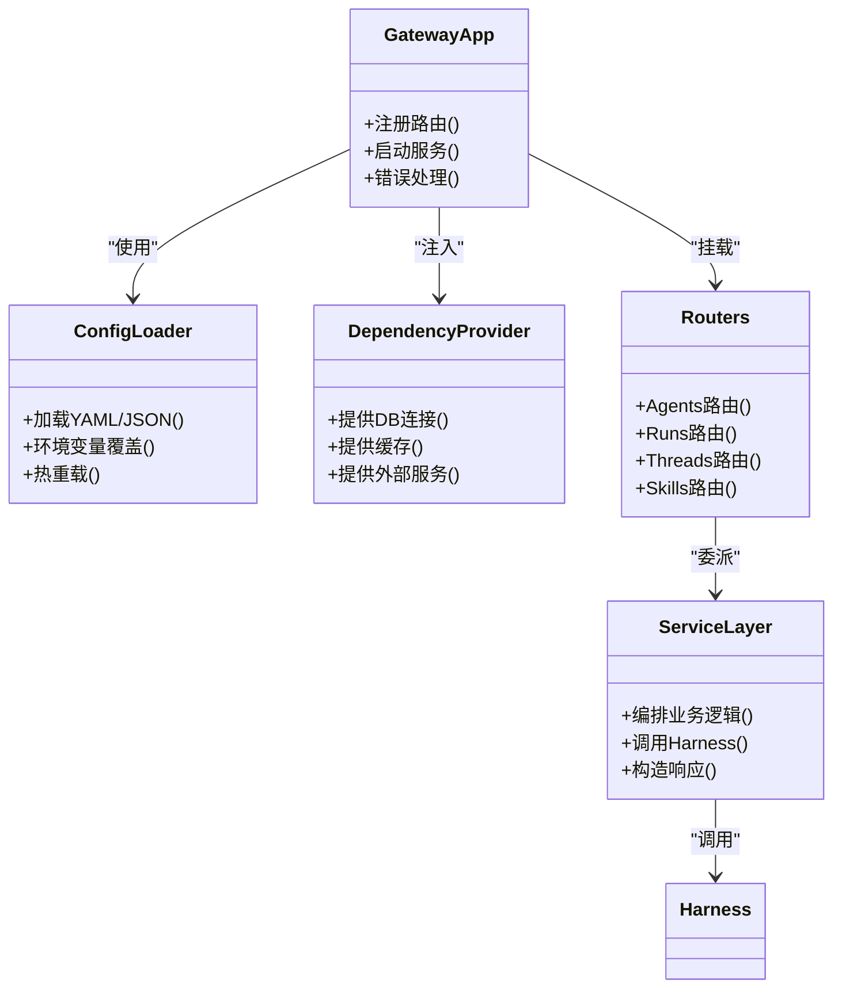
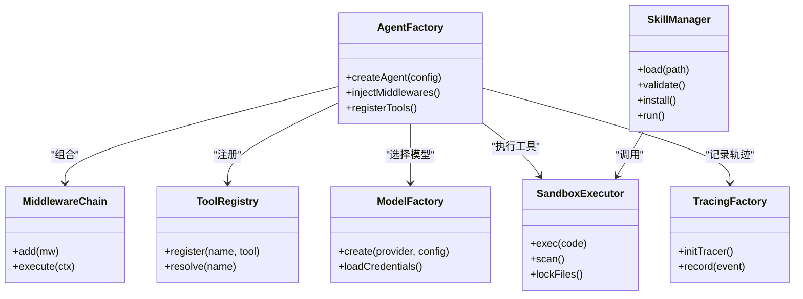
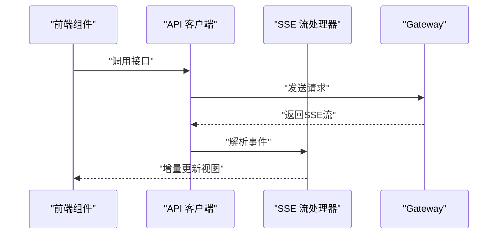
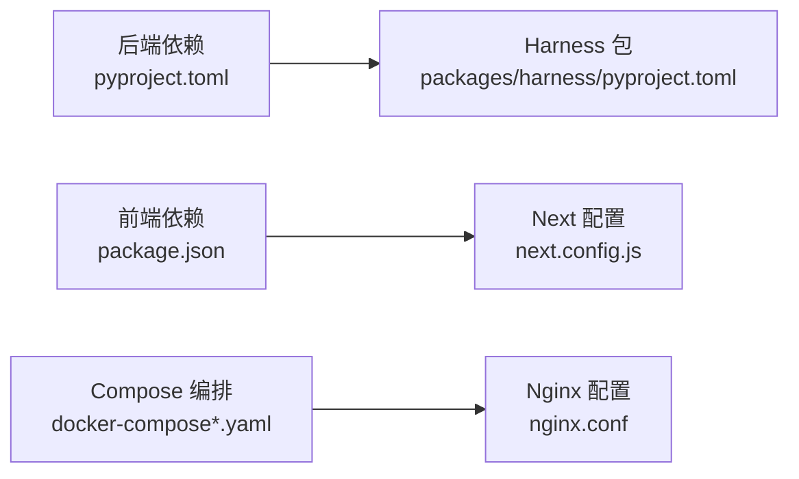
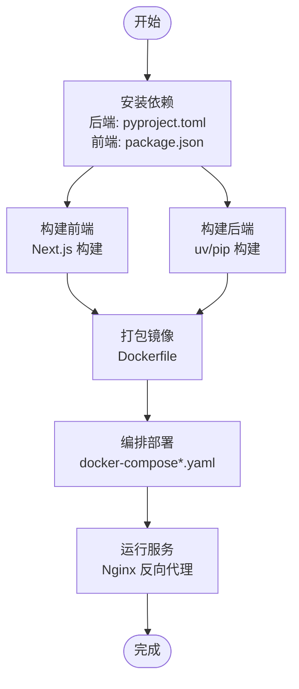
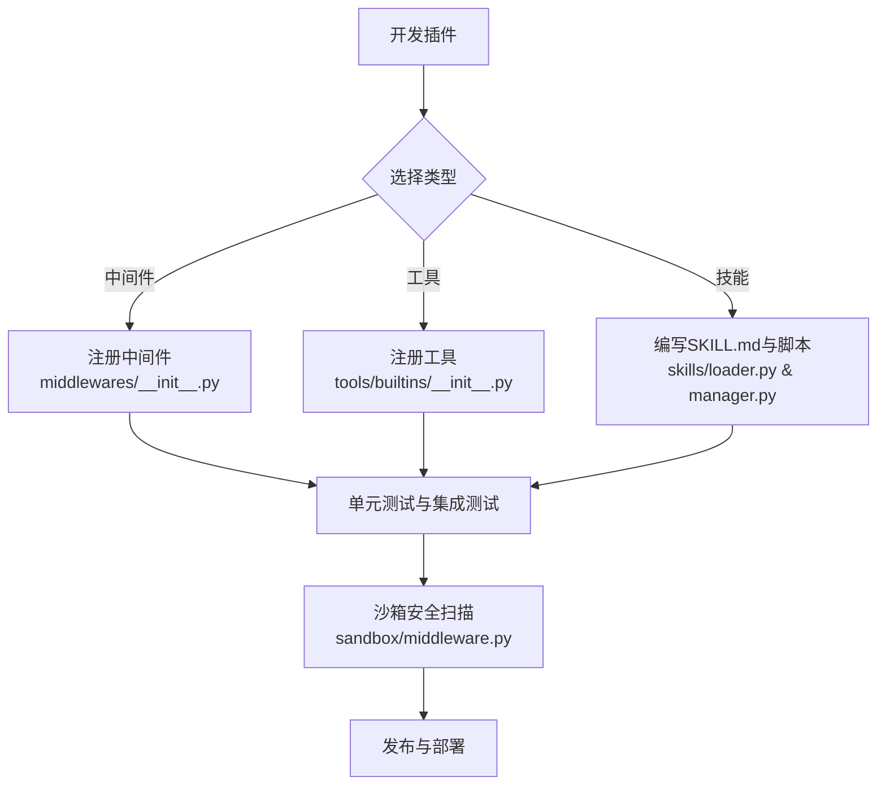
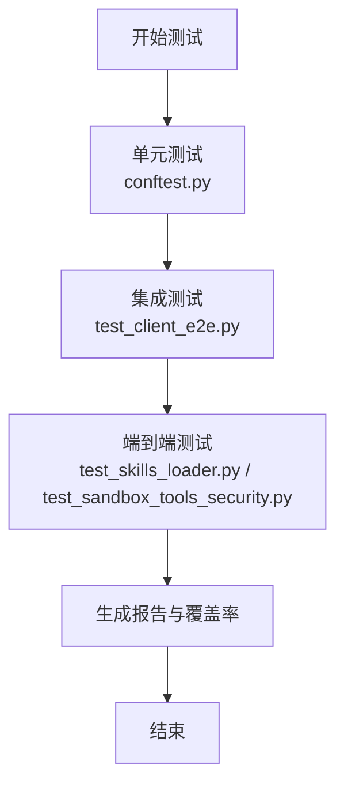

# 开发者指南

<cite>
**本文引用的文件**   
- [backend/README.md](file://backend/README.md)
- [backend/pyproject.toml](file://backend/pyproject.toml)
- [backend/Dockerfile](file://backend/Dockerfile)
- [backend/Makefile](file://backend/Makefile)
- [backend/app/gateway/app.py](file://backend/app/gateway/app.py)
- [backend/app/gateway/config.py](file://backend/app/gateway/config.py)
- [backend/app/gateway/deps.py](file://backend/app/gateway/deps.py)
- [backend/app/gateway/services.py](file://backend/app/gateway/services.py)
- [backend/app/gateway/routers/agents.py](file://backend/app/gateway/routers/agents.py)
- [backend/app/gateway/routers/runs.py](file://backend/app/gateway/routers/runs.py)
- [backend/app/gateway/routers/threads.py](file://backend/app/gateway/routers/threads.py)
- [backend/app/gateway/routers/skills.py](file://backend/app/gateway/routers/skills.py)
- [backend/packages/harness/pyproject.toml](file://backend/packages/harness/pyproject.toml)
- [backend/packages/harness/deerflow/agents/factory.py](file://backend/packages/harness/deerflow/agents/factory.py)
- [backend/packages/harness/deerflow/agents/middlewares/__init__.py](file://backend/packages/harness/deerflow/agents/middlewares/__init__.py)
- [backend/packages/harness/deerflow/tools/builtins/__init__.py](file://backend/packages/harness/deerflow/tools/builtins/__init__.py)
- [backend/packages/harness/deerflow/skills/loader.py](file://backend/packages/harness/deerflow/skills/loader.py)
- [backend/packages/harness/deerflow/skills/manager.py](file://backend/packages/harness/deerflow/skills/manager.py)
- [backend/packages/harness/deerflow/sandbox/sandbox.py](file://backend/packages/harness/deerflow/sandbox/sandbox.py)
- [backend/packages/harness/deerflow/sandbox/middleware.py](file://backend/packages/harness/deerflow/sandbox/middleware.py)
- [backend/packages/harness/deerflow/models/factory.py](file://backend/packages/harness/deerflow/models/factory.py)
- [backend/packages/harness/deerflow/tracing/factory.py](file://backend/packages/harness/deerflow/tracing/factory.py)
- [backend/tests/conftest.py](file://backend/tests/conftest.py)
- [backend/tests/test_client_e2e.py](file://backend/tests/test_client_e2e.py)
- [backend/tests/test_skills_loader.py](file://backend/tests/test_skills_loader.py)
- [backend/tests/test_sandbox_tools_security.py](file://backend/tests/test_sandbox_tools_security.py)
- [docker/docker-compose.yaml](file://docker/docker-compose.yaml)
- [docker/docker-compose-dev.yaml](file://docker/docker-compose-dev.yaml)
- [docker/nginx/nginx.conf](file://docker/nginx/nginx.conf)
- [frontend/package.json](file://frontend/package.json)
- [frontend/next.config.js](file://frontend/next.config.js)
- [frontend/vitest.config.ts](file://frontend/vitest.config.ts)
- [frontend/src/core/api/api-client.ts](file://frontend/src/core/api/api-client.ts)
- [frontend/src/core/api/stream-mode.ts](file://frontend/src/core/api/stream-mode.ts)
- [scripts/docker.sh](file://scripts/docker.sh)
- [scripts/deploy.sh](file://scripts/deploy.sh)
- [scripts/serve.sh](file://scripts/serve.sh)
- [config.example.yaml](file://config.example.yaml)
- [extensions_config.example.json](file://extensions_config.example.json)
</cite>

## 目录
1. [简介](#简介)
2. [项目结构](#项目结构)
3. [核心组件](#核心组件)
4. [架构总览](#架构总览)
5. [详细组件分析](#详细组件分析)
6. [依赖关系分析](#依赖关系分析)
7. [性能与可观测性](#性能与可观测性)
8. [故障诊断与排错](#故障诊断与排错)
9. [构建与打包](#构建与打包)
10. [插件与扩展开发](#插件与扩展开发)
11. [测试策略与实践](#测试策略与实践)
12. [代码规范与协作流程](#代码规范与协作流程)
13. [结论](#结论)

## 简介
本指南面向希望参与 DeerFlow 开发与贡献的工程师，目标是帮助你快速理解代码组织、搭建本地开发环境、编写与运行测试、遵循代码规范与提交约定，并掌握前后端构建、Docker 镜像制作以及插件（中间件、工具、技能）扩展方法。文档同时提供性能调优与故障诊断的实用技巧，帮助你在生产环境中稳定运行 DeerFlow。

## 项目结构
DeerFlow 采用前后端分离架构：
- 后端（Python + FastAPI + LangGraph）：提供网关 API、Agent 编排、沙箱执行、模型适配、技能管理、MCP 集成、追踪等能力。
- 前端（Next.js）：提供工作区、对话、图表可视化、设置、文档等界面。
- Docker 编排：提供开发/生产容器化方案，包含 Nginx 反向代理与可选 Provisioner。
- 脚本与配置：提供一键部署、服务启动、Docker 操作、示例配置等。

图示来源
- [backend/app/gateway/app.py](file://backend/app/gateway/app.py)
- [backend/app/gateway/config.py](file://backend/app/gateway/config.py)
- [backend/app/gateway/deps.py](file://backend/app/gateway/deps.py)
- [backend/app/gateway/services.py](file://backend/app/gateway/services.py)
- [backend/app/gateway/routers/agents.py](file://backend/app/gateway/routers/agents.py)
- [backend/app/gateway/routers/runs.py](file://backend/app/gateway/routers/runs.py)
- [backend/app/gateway/routers/threads.py](file://backend/app/gateway/routers/threads.py)
- [backend/app/gateway/routers/skills.py](file://backend/app/gateway/routers/skills.py)
- [backend/packages/harness/deerflow/sandbox/sandbox.py](file://backend/packages/harness/deerflow/sandbox/sandbox.py)
- [backend/packages/harness/deerflow/tracing/factory.py](file://backend/packages/harness/deerflow/tracing/factory.py)
- [backend/packages/harness/deerflow/models/factory.py](file://backend/packages/harness/deerflow/models/factory.py)
- [frontend/package.json](file://frontend/package.json)
- [frontend/next.config.js](file://frontend/next.config.js)
- [frontend/src/core/api/api-client.ts](file://frontend/src/core/api/api-client.ts)
- [frontend/src/core/api/stream-mode.ts](file://frontend/src/core/api/stream-mode.ts)

章节来源
- [backend/README.md](file://backend/README.md)
- [backend/pyproject.toml](file://backend/pyproject.toml)
- [frontend/package.json](file://frontend/package.json)
- [frontend/next.config.js](file://frontend/next.config.js)

## 核心组件
- Gateway 网关
  - 负责 HTTP 路由注册、请求校验、鉴权、限流、SSE 流式响应等。
  - 入口在应用初始化文件中挂载路由与服务。
- 配置系统
  - 集中加载 YAML/JSON 配置，支持热重载与环境变量覆盖。
- 依赖注入
  - 通过 FastAPI Depends 提供共享资源（数据库、缓存、外部服务）。
- 服务层
  - 封装业务逻辑，协调路由与底层 Harness 能力。
- Harness 包
  - Agent 工厂、中间件链、工具集、技能加载与管理、沙箱执行、模型适配、追踪等。
- 前端
  - Next.js 应用，提供工作区、对话、设置、文档等页面；通过 API 客户端与后端交互，支持 SSE 流式模式。

章节来源
- [backend/app/gateway/app.py](file://backend/app/gateway/app.py)
- [backend/app/gateway/config.py](file://backend/app/gateway/config.py)
- [backend/app/gateway/deps.py](file://backend/app/gateway/deps.py)
- [backend/app/gateway/services.py](file://backend/app/gateway/services.py)
- [backend/packages/harness/deerflow/agents/factory.py](file://backend/packages/harness/deerflow/agents/factory.py)
- [backend/packages/harness/deerflow/agents/middlewares/__init__.py](file://backend/packages/harness/deerflow/agents/middlewares/__init__.py)
- [backend/packages/harness/deerflow/tools/builtins/__init__.py](file://backend/packages/harness/deerflow/tools/builtins/__init__.py)
- [backend/packages/harness/deerflow/skills/loader.py](file://backend/packages/harness/deerflow/skills/loader.py)
- [backend/packages/harness/deerflow/skills/manager.py](file://backend/packages/harness/deerflow/skills/manager.py)
- [backend/packages/harness/deerflow/sandbox/sandbox.py](file://backend/packages/harness/deerflow/sandbox/sandbox.py)
- [backend/packages/harness/deerflow/sandbox/middleware.py](file://backend/packages/harness/deerflow/sandbox/middleware.py)
- [backend/packages/harness/deerflow/models/factory.py](file://backend/packages/harness/deerflow/models/factory.py)
- [backend/packages/harness/deerflow/tracing/factory.py](file://backend/packages/harness/deerflow/tracing/factory.py)
- [frontend/src/core/api/api-client.ts](file://frontend/src/core/api/api-client.ts)
- [frontend/src/core/api/stream-mode.ts](file://frontend/src/core/api/stream-mode.ts)

## 架构总览
下图展示了从前端到后端的完整调用链路，包括路由、服务层、Harness 能力与运行时组件的交互。

图示来源
- [backend/app/gateway/app.py](file://backend/app/gateway/app.py)
- [backend/app/gateway/deps.py](file://backend/app/gateway/deps.py)
- [backend/app/gateway/services.py](file://backend/app/gateway/services.py)
- [backend/packages/harness/deerflow/agents/factory.py](file://backend/packages/harness/deerflow/agents/factory.py)
- [backend/packages/harness/deerflow/sandbox/sandbox.py](file://backend/packages/harness/deerflow/sandbox/sandbox.py)
- [backend/packages/harness/deerflow/tracing/factory.py](file://backend/packages/harness/deerflow/tracing/factory.py)
- [backend/packages/harness/deerflow/models/factory.py](file://backend/packages/harness/deerflow/models/factory.py)
- [frontend/src/core/api/api-client.ts](file://frontend/src/core/api/api-client.ts)
- [frontend/src/core/api/stream-mode.ts](file://frontend/src/core/api/stream-mode.ts)

## 详细组件分析

### Gateway 网关与服务层
- 职责
  - 注册路由、统一错误处理、鉴权与限流、SSE 流式输出。
  - 将请求委派给服务层，服务层再调用 Harness 能力。
- 关键文件
  - 应用入口与路由挂载：[backend/app/gateway/app.py](file://backend/app/gateway/app.py)
  - 配置加载：[backend/app/gateway/config.py](file://backend/app/gateway/config.py)
  - 依赖注入：[backend/app/gateway/deps.py](file://backend/app/gateway/deps.py)
  - 服务层实现：[backend/app/gateway/services.py](file://backend/app/gateway/services.py)
  - 路由模块：
    - [backend/app/gateway/routers/agents.py](file://backend/app/gateway/routers/agents.py)
    - [backend/app/gateway/routers/runs.py](file://backend/app/gateway/routers/runs.py)
    - [backend/app/gateway/routers/threads.py](file://backend/app/gateway/routers/threads.py)
    - [backend/app/gateway/routers/skills.py](file://backend/app/gateway/routers/skills.py)

图示来源
- [backend/app/gateway/app.py](file://backend/app/gateway/app.py)
- [backend/app/gateway/config.py](file://backend/app/gateway/config.py)
- [backend/app/gateway/deps.py](file://backend/app/gateway/deps.py)
- [backend/app/gateway/services.py](file://backend/app/gateway/services.py)
- [backend/app/gateway/routers/agents.py](file://backend/app/gateway/routers/agents.py)
- [backend/app/gateway/routers/runs.py](file://backend/app/gateway/routers/runs.py)
- [backend/app/gateway/routers/threads.py](file://backend/app/gateway/routers/threads.py)
- [backend/app/gateway/routers/skills.py](file://backend/app/gateway/routers/skills.py)

章节来源
- [backend/app/gateway/app.py](file://backend/app/gateway/app.py)
- [backend/app/gateway/config.py](file://backend/app/gateway/config.py)
- [backend/app/gateway/deps.py](file://backend/app/gateway/deps.py)
- [backend/app/gateway/services.py](file://backend/app/gateway/services.py)
- [backend/app/gateway/routers/agents.py](file://backend/app/gateway/routers/agents.py)
- [backend/app/gateway/routers/runs.py](file://backend/app/gateway/routers/runs.py)
- [backend/app/gateway/routers/threads.py](file://backend/app/gateway/routers/threads.py)
- [backend/app/gateway/routers/skills.py](file://backend/app/gateway/routers/skills.py)

### Harness 包：Agent、中间件、工具、技能、沙箱、模型、追踪
- Agent 工厂
  - 负责根据配置创建与组装 Agent，注入中间件链与工具集。
  - 参考：[backend/packages/harness/deerflow/agents/factory.py](file://backend/packages/harness/deerflow/agents/factory.py)
- 中间件链
  - 统一的中间件注册与执行顺序控制，支持安全、审计、限流、标题生成等。
  - 参考：[backend/packages/harness/deerflow/agents/middlewares/__init__.py](file://backend/packages/harness/deerflow/agents/middlewares/__init__.py)
- 内置工具
  - 提供文件系统、搜索、绘图、代码执行等工具的统一入口。
  - 参考：[backend/packages/harness/deerflow/tools/builtins/__init__.py](file://backend/packages/harness/deerflow/tools/builtins/__init__.py)
- 技能（Skill）
  - 加载、验证、安装与执行技能包，支持模板与脚本。
  - 参考：
    - [backend/packages/harness/deerflow/skills/loader.py](file://backend/packages/harness/deerflow/skills/loader.py)
    - [backend/packages/harness/deerflow/skills/manager.py](file://backend/packages/harness/deerflow/skills/manager.py)
- 沙箱执行器
  - 隔离执行用户代码，提供安全扫描、文件操作锁、搜索限制等。
  - 参考：
    - [backend/packages/harness/deerflow/sandbox/sandbox.py](file://backend/packages/harness/deerflow/sandbox/sandbox.py)
    - [backend/packages/harness/deerflow/sandbox/middleware.py](file://backend/packages/harness/deerflow/sandbox/middleware.py)
- 模型工厂
  - 多模型适配与凭证加载，支持 OpenAI、Claude、vLLM 等。
  - 参考：[backend/packages/harness/deerflow/models/factory.py](file://backend/packages/harness/deerflow/models/factory.py)
- 追踪工厂
  - 统一接入追踪系统，记录 Agent 执行轨迹与指标。
  - 参考：[backend/packages/harness/deerflow/tracing/factory.py](file://backend/packages/harness/deerflow/tracing/factory.py)

图示来源
- [backend/packages/harness/deerflow/agents/factory.py](file://backend/packages/harness/deerflow/agents/factory.py)
- [backend/packages/harness/deerflow/agents/middlewares/__init__.py](file://backend/packages/harness/deerflow/agents/middlewares/__init__.py)
- [backend/packages/harness/deerflow/tools/builtins/__init__.py](file://backend/packages/harness/deerflow/tools/builtins/__init__.py)
- [backend/packages/harness/deerflow/skills/loader.py](file://backend/packages/harness/deerflow/skills/loader.py)
- [backend/packages/harness/deerflow/skills/manager.py](file://backend/packages/harness/deerflow/skills/manager.py)
- [backend/packages/harness/deerflow/sandbox/sandbox.py](file://backend/packages/harness/deerflow/sandbox/sandbox.py)
- [backend/packages/harness/deerflow/sandbox/middleware.py](file://backend/packages/harness/deerflow/sandbox/middleware.py)
- [backend/packages/harness/deerflow/models/factory.py](file://backend/packages/harness/deerflow/models/factory.py)
- [backend/packages/harness/deerflow/tracing/factory.py](file://backend/packages/harness/deerflow/tracing/factory.py)

章节来源
- [backend/packages/harness/deerflow/agents/factory.py](file://backend/packages/harness/deerflow/agents/factory.py)
- [backend/packages/harness/deerflow/agents/middlewares/__init__.py](file://backend/packages/harness/deerflow/agents/middlewares/__init__.py)
- [backend/packages/harness/deerflow/tools/builtins/__init__.py](file://backend/packages/harness/deerflow/tools/builtins/__init__.py)
- [backend/packages/harness/deerflow/skills/loader.py](file://backend/packages/harness/deerflow/skills/loader.py)
- [backend/packages/harness/deerflow/skills/manager.py](file://backend/packages/harness/deerflow/skills/manager.py)
- [backend/packages/harness/deerflow/sandbox/sandbox.py](file://backend/packages/harness/deerflow/sandbox/sandbox.py)
- [backend/packages/harness/deerflow/sandbox/middleware.py](file://backend/packages/harness/deerflow/sandbox/middleware.py)
- [backend/packages/harness/deerflow/models/factory.py](file://backend/packages/harness/deerflow/models/factory.py)
- [backend/packages/harness/deerflow/tracing/factory.py](file://backend/packages/harness/deerflow/tracing/factory.py)

### 前端 API 客户端与流式模式
- API 客户端
  - 封装基础请求、重试、错误处理与鉴权头。
  - 参考：[frontend/src/core/api/api-client.ts](file://frontend/src/core/api/api-client.ts)
- 流式模式
  - 基于 SSE 的事件解析与增量渲染。
  - 参考：[frontend/src/core/api/stream-mode.ts](file://frontend/src/core/api/stream-mode.ts)

图示来源
- [frontend/src/core/api/api-client.ts](file://frontend/src/core/api/api-client.ts)
- [frontend/src/core/api/stream-mode.ts](file://frontend/src/core/api/stream-mode.ts)

章节来源
- [frontend/src/core/api/api-client.ts](file://frontend/src/core/api/api-client.ts)
- [frontend/src/core/api/stream-mode.ts](file://frontend/src/core/api/stream-mode.ts)

## 依赖关系分析
- 后端依赖
  - Python 包管理与依赖声明位于 [backend/pyproject.toml](file://backend/pyproject.toml)。
  - Harness 子包依赖声明位于 [backend/packages/harness/pyproject.toml](file://backend/packages/harness/pyproject.toml)。
- 前端依赖
  - Node.js 包管理与脚本定义位于 [frontend/package.json](file://frontend/package.json)。
  - Next.js 构建与代理配置位于 [frontend/next.config.js](file://frontend/next.config.js)。
- 容器编排
  - 生产与开发 compose 文件：
    - [docker/docker-compose.yaml](file://docker/docker-compose.yaml)
    - [docker/docker-compose-dev.yaml](file://docker/docker-compose-dev.yaml)
  - Nginx 反向代理配置：[docker/nginx/nginx.conf](file://docker/nginx/nginx.conf)

图示来源
- [backend/pyproject.toml](file://backend/pyproject.toml)
- [backend/packages/harness/pyproject.toml](file://backend/packages/harness/pyproject.toml)
- [frontend/package.json](file://frontend/package.json)
- [frontend/next.config.js](file://frontend/next.config.js)
- [docker/docker-compose.yaml](file://docker/docker-compose.yaml)
- [docker/docker-compose-dev.yaml](file://docker/docker-compose-dev.yaml)
- [docker/nginx/nginx.conf](file://docker/nginx/nginx.conf)

章节来源
- [backend/pyproject.toml](file://backend/pyproject.toml)
- [backend/packages/harness/pyproject.toml](file://backend/packages/harness/pyproject.toml)
- [frontend/package.json](file://frontend/package.json)
- [frontend/next.config.js](file://frontend/next.config.js)
- [docker/docker-compose.yaml](file://docker/docker-compose.yaml)
- [docker/docker-compose-dev.yaml](file://docker/docker-compose-dev.yaml)
- [docker/nginx/nginx.conf](file://docker/nginx/nginx.conf)

## 性能与可观测性
- 追踪与指标
  - 使用追踪工厂统一记录 Agent 执行轨迹与耗时，便于定位瓶颈。
  - 参考：[backend/packages/harness/deerflow/tracing/factory.py](file://backend/packages/harness/deerflow/tracing/factory.py)
- 模型选择与缓存
  - 模型工厂支持多提供商与凭证加载，建议结合缓存减少重复初始化开销。
  - 参考：[backend/packages/harness/deerflow/models/factory.py](file://backend/packages/harness/deerflow/models/factory.py)
- 沙箱执行优化
  - 沙箱执行器提供文件操作锁与安全扫描，避免并发冲突与恶意行为。
  - 参考：
    - [backend/packages/harness/deerflow/sandbox/sandbox.py](file://backend/packages/harness/deerflow/sandbox/sandbox.py)
    - [backend/packages/harness/deerflow/sandbox/middleware.py](file://backend/packages/harness/deerflow/sandbox/middleware.py)
- 前端流式渲染
  - 通过 SSE 增量渲染提升用户体验，注意事件解析与内存占用。
  - 参考：
    - [frontend/src/core/api/api-client.ts](file://frontend/src/core/api/api-client.ts)
    - [frontend/src/core/api/stream-mode.ts](file://frontend/src/core/api/stream-mode.ts)

章节来源
- [backend/packages/harness/deerflow/tracing/factory.py](file://backend/packages/harness/deerflow/tracing/factory.py)
- [backend/packages/harness/deerflow/models/factory.py](file://backend/packages/harness/deerflow/models/factory.py)
- [backend/packages/harness/deerflow/sandbox/sandbox.py](file://backend/packages/harness/deerflow/sandbox/sandbox.py)
- [backend/packages/harness/deerflow/sandbox/middleware.py](file://backend/packages/harness/deerflow/sandbox/middleware.py)
- [frontend/src/core/api/api-client.ts](file://frontend/src/core/api/api-client.ts)
- [frontend/src/core/api/stream-mode.ts](file://frontend/src/core/api/stream-mode.ts)

## 故障诊断与排错
- 常见问题
  - 配置加载失败：检查 YAML/JSON 格式与环境变量覆盖。
  - 沙箱执行异常：确认权限、文件锁与网络访问策略。
  - 模型调用失败：核对凭证与网络连通性。
  - 前端流式中断：检查 SSE 事件格式与浏览器兼容性。
- 诊断工具
  - 追踪日志：查看 Agent 执行轨迹与错误堆栈。
  - 容器日志：使用 docker-compose logs 查看服务状态。
  - 健康检查：通过网关健康端点确认服务可用性。
- 参考文件
  - 配置示例：[config.example.yaml](file://config.example.yaml)
  - 扩展配置示例：[extensions_config.example.json](file://extensions_config.example.json)
  - 后端文档：[backend/README.md](file://backend/README.md)

章节来源
- [config.example.yaml](file://config.example.yaml)
- [extensions_config.example.json](file://extensions_config.example.json)
- [backend/README.md](file://backend/README.md)

## 构建与打包
- 后端构建
  - 使用 Makefile 或 uv 进行依赖安装与构建。
  - Docker 镜像构建：参考 [backend/Dockerfile](file://backend/Dockerfile)。
  - 参考：
    - [backend/Makefile](file://backend/Makefile)
    - [backend/Dockerfile](file://backend/Dockerfile)
- 前端构建
  - 使用 pnpm 安装依赖与构建静态资源。
  - Next.js 构建与代理配置：[frontend/next.config.js](file://frontend/next.config.js)。
  - 参考：
    - [frontend/package.json](file://frontend/package.json)
    - [frontend/next.config.js](file://frontend/next.config.js)
- 容器编排
  - 生产与开发环境：
    - [docker/docker-compose.yaml](file://docker/docker-compose.yaml)
    - [docker/docker-compose-dev.yaml](file://docker/docker-compose-dev.yaml)
  - Nginx 反向代理：[docker/nginx/nginx.conf](file://docker/nginx/nginx.conf)
- 脚本辅助
  - Docker 操作：[scripts/docker.sh](file://scripts/docker.sh)
  - 部署脚本：[scripts/deploy.sh](file://scripts/deploy.sh)
  - 服务启动：[scripts/serve.sh](file://scripts/serve.sh)

图示来源
- [backend/pyproject.toml](file://backend/pyproject.toml)
- [frontend/package.json](file://frontend/package.json)
- [backend/Dockerfile](file://backend/Dockerfile)
- [docker/docker-compose.yaml](file://docker/docker-compose.yaml)
- [docker/docker-compose-dev.yaml](file://docker/docker-compose-dev.yaml)
- [docker/nginx/nginx.conf](file://docker/nginx/nginx.conf)
- [scripts/docker.sh](file://scripts/docker.sh)
- [scripts/deploy.sh](file://scripts/deploy.sh)
- [scripts/serve.sh](file://scripts/serve.sh)

章节来源
- [backend/Makefile](file://backend/Makefile)
- [backend/Dockerfile](file://backend/Dockerfile)
- [frontend/package.json](file://frontend/package.json)
- [frontend/next.config.js](file://frontend/next.config.js)
- [docker/docker-compose.yaml](file://docker/docker-compose.yaml)
- [docker/docker-compose-dev.yaml](file://docker/docker-compose-dev.yaml)
- [docker/nginx/nginx.conf](file://docker/nginx/nginx.conf)
- [scripts/docker.sh](file://scripts/docker.sh)
- [scripts/deploy.sh](file://scripts/deploy.sh)
- [scripts/serve.sh](file://scripts/serve.sh)

## 插件与扩展开发
- 中间件开发
  - 在中间件注册处添加自定义中间件，确保执行顺序与上下文传递。
  - 参考：[backend/packages/harness/deerflow/agents/middlewares/__init__.py](file://backend/packages/harness/deerflow/agents/middlewares/__init__.py)
- 工具开发
  - 在工具注册处暴露新工具，遵循参数校验与错误处理规范。
  - 参考：[backend/packages/harness/deerflow/tools/builtins/__init__.py](file://backend/packages/harness/deerflow/tools/builtins/__init__.py)
- 技能（Skill）开发
  - 按照 SKILL.md 规范编写描述、模板与脚本，使用 Loader 与 Manager 进行加载与执行。
  - 参考：
    - [backend/packages/harness/deerflow/skills/loader.py](file://backend/packages/harness/deerflow/skills/loader.py)
    - [backend/packages/harness/deerflow/skills/manager.py](file://backend/packages/harness/deerflow/skills/manager.py)
- 沙箱安全
  - 利用沙箱中间件进行安全扫描与资源限制，防止恶意代码执行。
  - 参考：
    - [backend/packages/harness/deerflow/sandbox/sandbox.py](file://backend/packages/harness/deerflow/sandbox/sandbox.py)
    - [backend/packages/harness/deerflow/sandbox/middleware.py](file://backend/packages/harness/deerflow/sandbox/middleware.py)
- 模型扩展
  - 在模型工厂中新增提供商适配，实现凭证加载与调用封装。
  - 参考：[backend/packages/harness/deerflow/models/factory.py](file://backend/packages/harness/deerflow/models/factory.py)

图示来源
- [backend/packages/harness/deerflow/agents/middlewares/__init__.py](file://backend/packages/harness/deerflow/agents/middlewares/__init__.py)
- [backend/packages/harness/deerflow/tools/builtins/__init__.py](file://backend/packages/harness/deerflow/tools/builtins/__init__.py)
- [backend/packages/harness/deerflow/skills/loader.py](file://backend/packages/harness/deerflow/skills/loader.py)
- [backend/packages/harness/deerflow/skills/manager.py](file://backend/packages/harness/deerflow/skills/manager.py)
- [backend/packages/harness/deerflow/sandbox/middleware.py](file://backend/packages/harness/deerflow/sandbox/middleware.py)

章节来源
- [backend/packages/harness/deerflow/agents/middlewares/__init__.py](file://backend/packages/harness/deerflow/agents/middlewares/__init__.py)
- [backend/packages/harness/deerflow/tools/builtins/__init__.py](file://backend/packages/harness/deerflow/tools/builtins/__init__.py)
- [backend/packages/harness/deerflow/skills/loader.py](file://backend/packages/harness/deerflow/skills/loader.py)
- [backend/packages/harness/deerflow/skills/manager.py](file://backend/packages/harness/deerflow/skills/manager.py)
- [backend/packages/harness/deerflow/sandbox/middleware.py](file://backend/packages/harness/deerflow/sandbox/middleware.py)

## 测试策略与实践
- 测试分层
  - 单元测试：针对工具、中间件、技能加载器等小单元。
  - 集成测试：验证服务层与 Harness 能力的协同。
  - 端到端测试：模拟真实用户场景，覆盖网关到前端的完整链路。
- 关键测试文件
  - 通用夹具与配置：[backend/tests/conftest.py](file://backend/tests/conftest.py)
  - 客户端 E2E：[backend/tests/test_client_e2e.py](file://backend/tests/test_client_e2e.py)
  - 技能加载器：[backend/tests/test_skills_loader.py](file://backend/tests/test_skills_loader.py)
  - 沙箱工具安全：[backend/tests/test_sandbox_tools_security.py](file://backend/tests/test_sandbox_tools_security.py)
- 前端测试
  - Vitest 配置：[frontend/vitest.config.ts](file://frontend/vitest.config.ts)
  - 单元测试示例路径：[frontend/tests/unit/core/api/stream-mode.test.ts](file://frontend/tests/unit/core/api/stream-mode.test.ts)

图示来源
- [backend/tests/conftest.py](file://backend/tests/conftest.py)
- [backend/tests/test_client_e2e.py](file://backend/tests/test_client_e2e.py)
- [backend/tests/test_skills_loader.py](file://backend/tests/test_skills_loader.py)
- [backend/tests/test_sandbox_tools_security.py](file://backend/tests/test_sandbox_tools_security.py)
- [frontend/vitest.config.ts](file://frontend/vitest.config.ts)

章节来源
- [backend/tests/conftest.py](file://backend/tests/conftest.py)
- [backend/tests/test_client_e2e.py](file://backend/tests/test_client_e2e.py)
- [backend/tests/test_skills_loader.py](file://backend/tests/test_skills_loader.py)
- [backend/tests/test_sandbox_tools_security.py](file://backend/tests/test_sandbox_tools_security.py)
- [frontend/vitest.config.ts](file://frontend/vitest.config.ts)

## 代码规范与协作流程
- 代码规范
  - 后端：使用 ruff 进行 lint 与格式化，参考 [backend/ruff.toml](file://backend/ruff.toml)。
  - 前端：使用 ESLint 与 Prettier，参考 [frontend/eslint.config.js](file://frontend/eslint.config.js)、[frontend/prettier.config.js](file://frontend/prettier.config.js)。
- Git 工作流程
  - 分支策略：主分支保护，功能分支命名规范，提交信息遵循约定式提交。
  - 代码审查：PR 需包含变更说明、测试覆盖与影响评估。
- 持续集成
  - GitHub Actions 工作流与 Copilot 指令：
    - [github/workflows](file://.github/workflows)
    - [copilot-instructions.md](file://.github/copilot-instructions.md)
- 贡献指南
  - 参考仓库根目录的 CONTRIBUTING 与 README 文档。

章节来源
- [backend/ruff.toml](file://backend/ruff.toml)
- [frontend/eslint.config.js](file://frontend/eslint.config.js)
- [frontend/prettier.config.js](file://frontend/prettier.config.js)
- [.github/workflows](file://.github/workflows)
- [.github/copilot-instructions.md](file://.github/copilot-instructions.md)

## 结论
本指南系统梳理了 DeerFlow 的代码结构与模块划分，提供了完整的开发环境搭建、测试策略、代码规范与协作流程、构建与打包方法，以及插件扩展与性能调优的实践建议。借助这些内容，新贡献者可以快速上手并高效参与项目开发与维护。