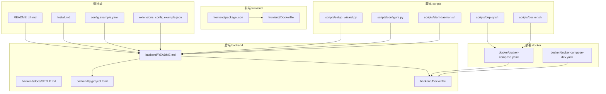
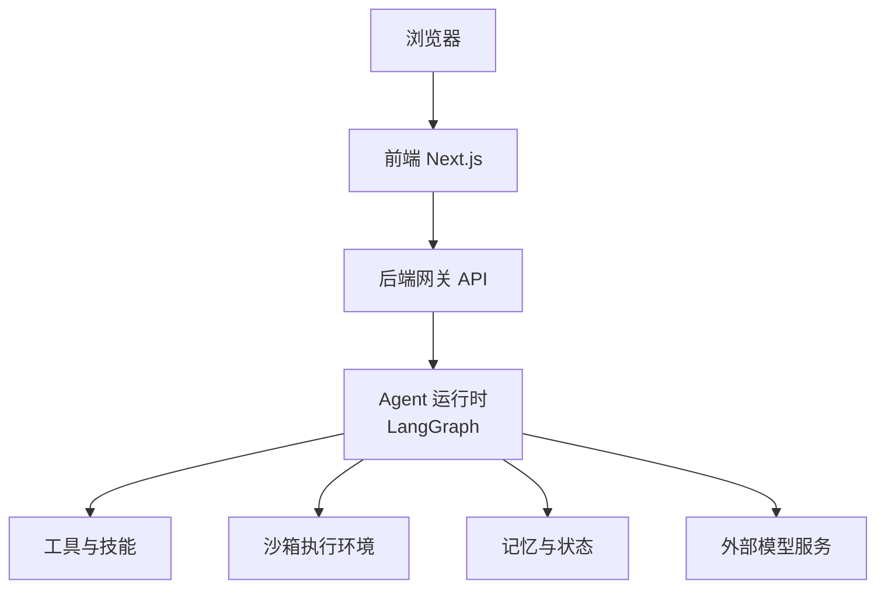
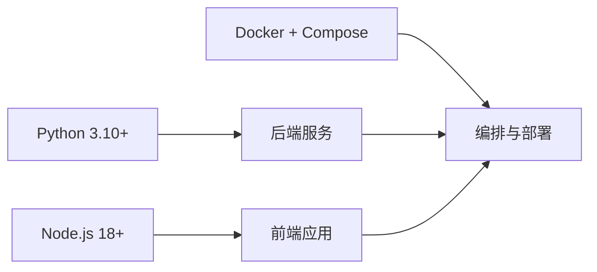

# 快速开始

<cite>
**本文引用的文件**   
- [README_zh.md](file://README_zh.md)
- [Install.md](file://Install.md)
- [config.example.yaml](file://config.example.yaml)
- [extensions_config.example.json](file://extensions_config.example.json)
- [backend/README.md](file://backend/README.md)
- [backend/docs/SETUP.md](file://backend/docs/SETUP.md)
- [backend/pyproject.toml](file://backend/pyproject.toml)
- [backend/Dockerfile](file://backend/Dockerfile)
- [docker/docker-compose.yaml](file://docker/docker-compose.yaml)
- [docker/docker-compose-dev.yaml](file://docker/docker-compose-dev.yaml)
- [scripts/setup_wizard.py](file://scripts/setup_wizard.py)
- [scripts/configure.py](file://scripts/configure.py)
- [scripts/deploy.sh](file://scripts/deploy.sh)
- [scripts/docker.sh](file://scripts/docker.sh)
- [scripts/start-daemon.sh](file://scripts/start-daemon.sh)
- [frontend/package.json](file://frontend/package.json)
- [frontend/Dockerfile](file://frontend/Dockerfile)
- [.agent/skills/smoke-test/scripts/deploy_docker.sh](file://.agent/skills/smoke-test/scripts/deploy_docker.sh)
</cite>

## 目录
1. [简介](#简介)
2. [项目结构](#项目结构)
3. [核心组件](#核心组件)
4. [架构总览](#架构总览)
5. [详细组件分析](#详细组件分析)
6. [依赖分析](#依赖分析)
7. [性能考虑](#性能考虑)
8. [故障排除指南](#故障排除指南)
9. [结论](#结论)
10. [附录](#附录)

## 简介
本指南面向首次接触 DeerFlow 的用户，目标是在 30 分钟内完成本地或容器化部署并运行第一个代理。内容涵盖：
- 环境要求（Python、Node.js、Docker）
- 本地开发环境搭建步骤（克隆仓库、安装依赖、配置环境变量）
- Docker 一键部署命令与配置选项
- 设置向导使用方法
- 创建并运行第一个代理的示例流程
- 常见问题与排错建议

## 项目结构
DeerFlow 采用前后端分离与多语言工程组织方式：
- 后端（Python/LangGraph）：提供 API、Agent 运行时、工具与技能管理、沙箱执行等能力
- 前端（Next.js）：工作区、聊天、模型与设置管理等界面
- 脚本与部署：包含设置向导、配置生成、Docker 编排与启动脚本
- 文档与示例：README、安装说明、配置样例、技能包等

图表来源
- [README_zh.md](file://README_zh.md)
- [backend/README.md](file://backend/README.md)
- [backend/docs/SETUP.md](file://backend/docs/SETUP.md)
- [backend/pyproject.toml](file://backend/pyproject.toml)
- [backend/Dockerfile](file://backend/Dockerfile)
- [frontend/package.json](file://frontend/package.json)
- [frontend/Dockerfile](file://frontend/Dockerfile)
- [docker/docker-compose.yaml](file://docker/docker-compose.yaml)
- [docker/docker-compose-dev.yaml](file://docker/docker-compose-dev.yaml)
- [scripts/setup_wizard.py](file://scripts/setup_wizard.py)
- [scripts/configure.py](file://scripts/configure.py)
- [scripts/deploy.sh](file://scripts/deploy.sh)
- [scripts/docker.sh](file://scripts/docker.sh)
- [scripts/start-daemon.sh](file://scripts/start-daemon.sh)

章节来源
- [README_zh.md](file://README_zh.md)
- [Install.md](file://Install.md)
- [backend/README.md](file://backend/README.md)
- [backend/docs/SETUP.md](file://backend/docs/SETUP.md)

## 核心组件
- 后端服务：基于 Python 与 LangGraph，提供 Agent 生命周期管理、工具调用、记忆与流式输出、MCP 集成、上传处理等
- 前端应用：Next.js 构建的工作区与聊天界面，支持模型选择、线程管理、设置与国际化
- 编排与部署：Docker Compose 编排前后端与反向代理；提供开发与生产两种编排模板
- 配置与向导：通过 YAML/JSON 样例与交互式向导完成初始配置与环境校验
- 技能与工具：内置多种技能与工具，支持扩展与自定义

章节来源
- [backend/README.md](file://backend/README.md)
- [backend/docs/SETUP.md](file://backend/docs/SETUP.md)
- [frontend/package.json](file://frontend/package.json)
- [docker/docker-compose.yaml](file://docker/docker-compose.yaml)
- [docker/docker-compose-dev.yaml](file://docker/docker-compose-dev.yaml)

## 架构总览
下图展示本地与容器化部署的整体交互关系：浏览器访问前端，前端请求后端 API，后端在沙箱中执行工具与技能，必要时连接外部模型与服务。

图表来源
- [backend/README.md](file://backend/README.md)
- [backend/docs/SETUP.md](file://backend/docs/SETUP.md)
- [docker/docker-compose.yaml](file://docker/docker-compose.yaml)

## 详细组件分析

### 环境要求
- Python 3.10+：用于后端运行与依赖管理
- Node.js 18+：用于前端构建与开发
- Docker 与 Docker Compose：用于容器化部署与一键启动
- 可选：Git（用于克隆仓库）、系统命令行工具（如 curl、jq）

章节来源
- [backend/pyproject.toml](file://backend/pyproject.toml)
- [frontend/package.json](file://frontend/package.json)
- [backend/Dockerfile](file://backend/Dockerfile)
- [frontend/Dockerfile](file://frontend/Dockerfile)

### 本地开发环境搭建（从零到可运行）
以下步骤帮助你在本机完成后端与前端的环境准备与启动：

1. 克隆仓库
   - 使用 Git 将 DeerFlow 源码克隆至本地目录

2. 安装后端依赖
   - 进入后端目录，使用 Python 包管理器安装依赖
   - 参考后端 README 与 SETUP 文档中的依赖安装指引

3. 安装前端依赖
   - 进入前端目录，使用 pnpm/npm/yarn 安装依赖
   - 参考前端 package.json 中的脚本定义

4. 配置环境变量
   - 复制配置样例为实际配置文件
     - 后端主配置：从 config.example.yaml 复制为 .env 或对应配置文件
     - 扩展配置：从 extensions_config.example.json 复制为实际 JSON 配置
   - 根据需求填写模型密钥、端口、存储路径等关键项

5. 运行设置向导（推荐）
   - 使用交互式向导自动检测环境、生成配置、校验依赖
   - 向导入口位于 scripts/setup_wizard.py

6. 启动后端服务
   - 使用 Makefile 或脚本启动后端进程
   - 也可通过 uvicorn/fastapi 直接启动（参考后端文档）

7. 启动前端服务
   - 使用前端脚本启动开发服务器
   - 默认监听本地端口，可在配置中调整

8. 验证服务
   - 打开浏览器访问前端地址
   - 检查后端健康检查接口是否返回正常

章节来源
- [backend/README.md](file://backend/README.md)
- [backend/docs/SETUP.md](file://backend/docs/SETUP.md)
- [config.example.yaml](file://config.example.yaml)
- [extensions_config.example.json](file://extensions_config.example.json)
- [scripts/setup_wizard.py](file://scripts/setup_wizard.py)
- [scripts/configure.py](file://scripts/configure.py)
- [Makefile](file://Makefile)

### Docker 一键部署
使用 Docker Compose 可以一键拉起前后端与必要的中间件，适合快速体验与演示。

- 使用默认编排
  - 在项目根目录执行 docker compose up -d
  - 该命令会读取 docker/docker-compose.yaml 进行编排

- 使用开发编排
  - 执行 docker compose -f docker/docker-compose-dev.yaml up -d
  - 适用于需要热重载或调试的场景

- 常用参数与选项
  - --build：强制重建镜像
  - --pull：拉取最新镜像
  - -d：后台运行
  - 可通过环境变量覆盖默认配置（参考各服务的 .env 或 compose 变量）

- 停止与清理
  - docker compose down
  - docker compose down -v（同时删除数据卷）

章节来源
- [docker/docker-compose.yaml](file://docker/docker-compose.yaml)
- [docker/docker-compose-dev.yaml](file://docker/docker-compose-dev.yaml)
- [scripts/deploy.sh](file://scripts/deploy.sh)
- [scripts/docker.sh](file://scripts/docker.sh)
- [.agent/skills/smoke-test/scripts/deploy_docker.sh](file://.agent/skills/smoke-test/scripts/deploy_docker.sh)

### 设置向导使用方法
设置向导帮助用户快速完成初始配置与环境校验：

- 启动向导
  - 运行 scripts/setup_wizard.py
  - 向导会引导你选择模型提供商、输入密钥、配置端口与存储路径

- 自动生成配置
  - 向导会根据你的选择生成后端与前端所需的环境变量与配置文件
  - 生成的文件通常位于项目根目录或各自子目录

- 环境检查与修复建议
  - 向导会检查 Python/Node/Docker 版本与可用命令
  - 对缺失依赖给出安装建议

- 一键启动
  - 向导完成后，可直接调用启动脚本拉起服务

章节来源
- [scripts/setup_wizard.py](file://scripts/setup_wizard.py)
- [scripts/configure.py](file://scripts/configure.py)

### 创建并运行第一个代理
以下流程帮助你快速体验 DeerFlow 的核心功能：

1. 登录工作区
   - 打开前端页面，进入工作区

2. 新建代理
   - 在工作区中选择“新建代理”
   - 按提示填写名称、描述与基础能力（如搜索、代码执行等）

3. 选择模型
   - 在设置中选择已配置的模型提供商与模型名
   - 确保密钥与权限正确

4. 运行任务
   - 在聊天窗口输入任务描述
   - 观察流式输出与工具调用过程

5. 查看结果
   - 查看生成的文本、图表或文件产物
   - 根据需要导出或分享

章节来源
- [backend/README.md](file://backend/README.md)
- [backend/docs/SETUP.md](file://backend/docs/SETUP.md)
- [frontend/package.json](file://frontend/package.json)

## 依赖分析
- 后端依赖
  - Python 3.10+ 与相关包（由 pyproject.toml 声明）
  - 运行时依赖包括 Web 框架、LangGraph、工具库等
- 前端依赖
  - Node.js 18+ 与 pnpm/npm/yarn
  - 依赖由 package.json 声明
- 容器依赖
  - Docker 与 Docker Compose
  - 镜像构建由 Dockerfile 定义

图表来源
- [backend/pyproject.toml](file://backend/pyproject.toml)
- [frontend/package.json](file://frontend/package.json)
- [backend/Dockerfile](file://backend/Dockerfile)
- [frontend/Dockerfile](file://frontend/Dockerfile)
- [docker/docker-compose.yaml](file://docker/docker-compose.yaml)

章节来源
- [backend/pyproject.toml](file://backend/pyproject.toml)
- [frontend/package.json](file://frontend/package.json)
- [backend/Dockerfile](file://backend/Dockerfile)
- [frontend/Dockerfile](file://frontend/Dockerfile)
- [docker/docker-compose.yaml](file://docker/docker-compose.yaml)

## 性能考虑
- 合理选择模型与上下文长度，避免过长输入导致延迟与成本上升
- 启用缓存与记忆优化策略，减少重复计算
- 控制并发与超时，避免资源耗尽
- 在生产环境中使用反向代理与静态资源缓存提升响应速度
- 监控日志与指标，定位瓶颈与异常

[本节为通用指导，不直接分析具体文件]

## 故障排除指南
- 端口冲突
  - 现象：服务无法启动或访问失败
  - 排查：检查本地占用端口，修改配置中的端口号
- 模型密钥错误
  - 现象：调用模型时报鉴权或限流错误
  - 排查：确认密钥格式与权限，检查网络连通性
- 依赖缺失
  - 现象：导入错误或命令找不到
  - 排查：重新安装依赖，核对 Python/Node 版本
- 容器网络问题
  - 现象：容器间无法通信
  - 排查：检查 Compose 网络配置与端口映射
- 日志与诊断
  - 使用后端日志与前端控制台定位问题
  - 使用健康检查接口验证服务状态

章节来源
- [backend/docs/SETUP.md](file://backend/docs/SETUP.md)
- [backend/README.md](file://backend/README.md)
- [scripts/docker.sh](file://scripts/docker.sh)
- [scripts/deploy.sh](file://scripts/deploy.sh)

## 结论
通过本指南，你可以在 30 分钟内完成 DeerFlow 的本地或容器化部署，并使用设置向导快速完成初始配置，创建并运行第一个代理。建议在后续使用中结合文档深入探索工具、技能与高级配置，以获得更强大的自动化能力。

[本节为总结，不直接分析具体文件]

## 附录
- 参考文档
  - 中文 README：README_zh.md
  - 安装说明：Install.md
  - 后端 README 与 SETUP：backend/README.md、backend/docs/SETUP.md
- 配置样例
  - 后端主配置：config.example.yaml
  - 扩展配置：extensions_config.example.json
- 部署脚本
  - 一键部署：scripts/deploy.sh
  - Docker 辅助：scripts/docker.sh
  - 守护进程启动：scripts/start-daemon.sh

章节来源
- [README_zh.md](file://README_zh.md)
- [Install.md](file://Install.md)
- [backend/README.md](file://backend/README.md)
- [backend/docs/SETUP.md](file://backend/docs/SETUP.md)
- [config.example.yaml](file://config.example.yaml)
- [extensions_config.example.json](file://extensions_config.example.json)
- [scripts/deploy.sh](file://scripts/deploy.sh)
- [scripts/docker.sh](file://scripts/docker.sh)
- [scripts/start-daemon.sh](file://scripts/start-daemon.sh)