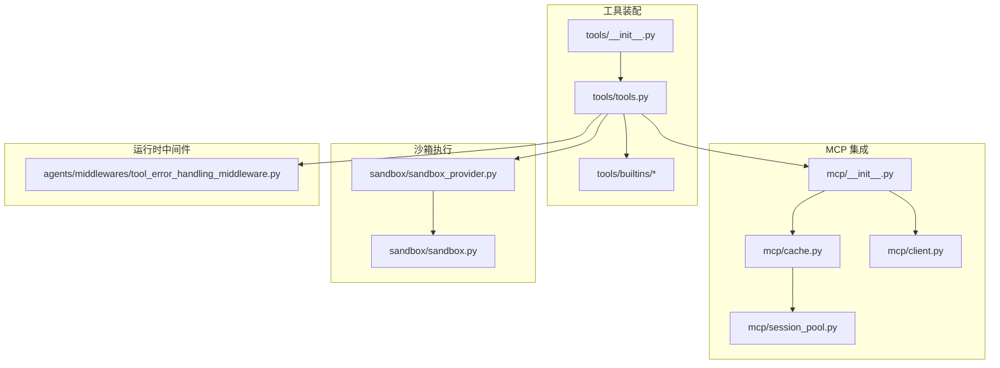
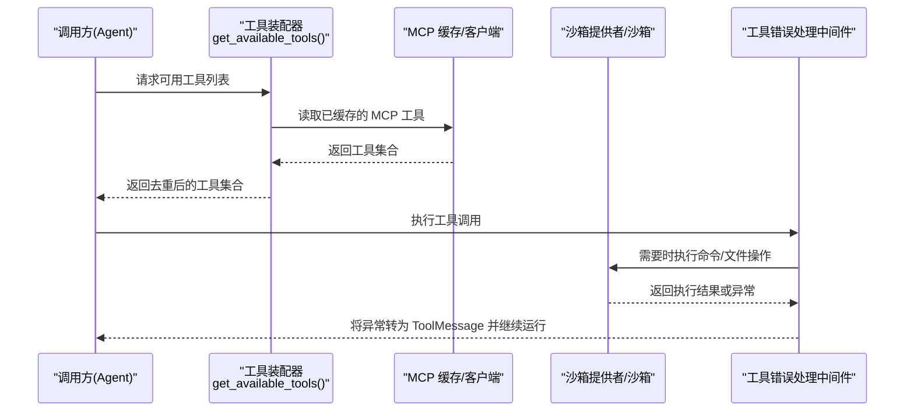
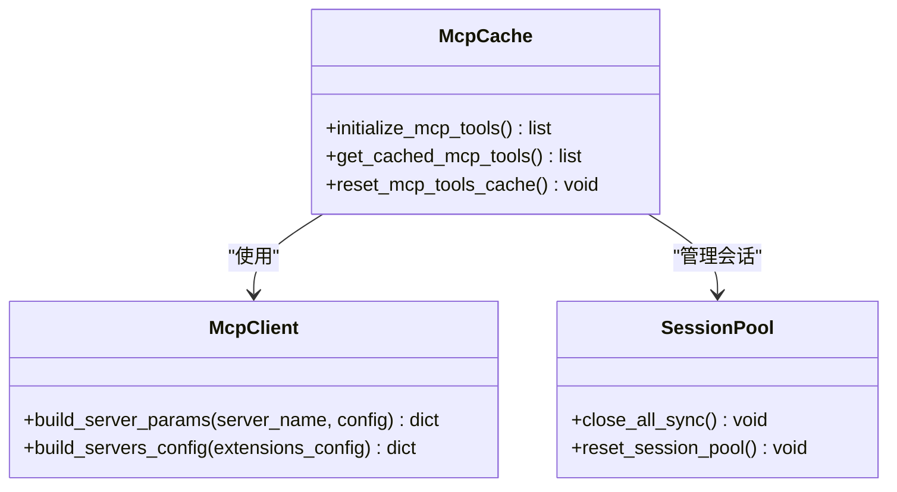
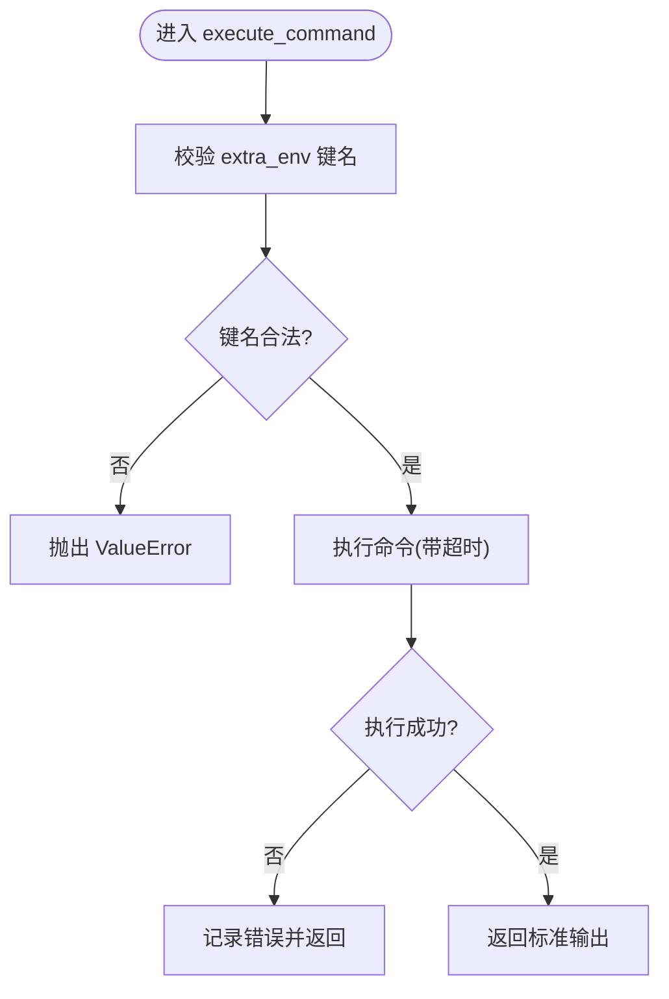
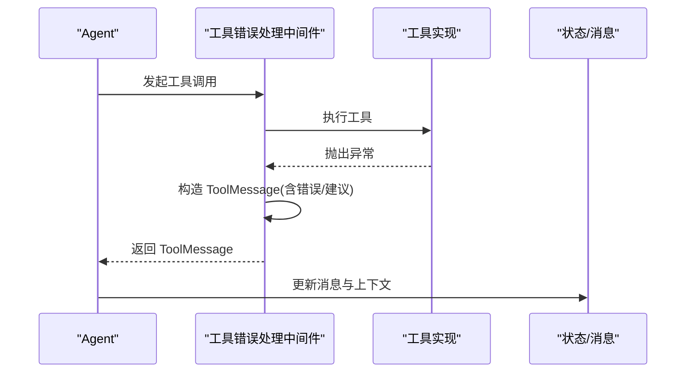
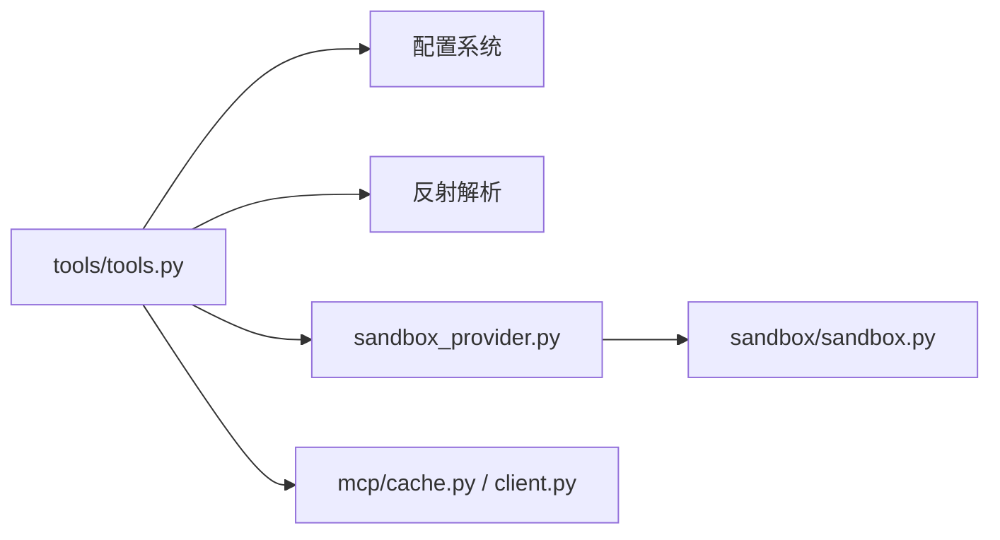

# 工具插件开发

<cite>
**本文引用的文件**
- [tools.py](file://backend/packages/harness/deerflow/tools/tools.py)
- [__init__.py（tools）](file://backend/packages/harness/deerflow/tools/__init__.py)
- [mcp/__init__.py](file://backend/packages/harness/deerflow/mcp/__init__.py)
- [client.py（MCP 客户端）](file://backend/packages/harness/deerflow/mcp/client.py)
- [cache.py（MCP 缓存）](file://backend/packages/harness/deerflow/mcp/cache.py)
- [sandbox.py（沙箱抽象）](file://backend/packages/harness/deerflow/sandbox/sandbox.py)
- [sandbox_provider.py（沙箱提供者）](file://backend/packages/harness/deerflow/sandbox/sandbox_provider.py)
- [present_file_tool.py](file://backend/packages/harness/deerflow/tools/builtins/present_file_tool.py)
- [clarification_tool.py](file://backend/packages/harness/deerflow/tools/builtins/clarification_tool.py)
- [tool_error_handling_middleware.py](file://backend/packages/harness/deerflow/agents/middlewares/tool_error_handling_middleware.py)
</cite>

## 目录
1. [简介](#简介)
2. [项目结构](#项目结构)
3. [核心组件](#核心组件)
4. [架构总览](#架构总览)
5. [详细组件分析](#详细组件分析)
6. [依赖关系分析](#依赖关系分析)
7. [性能与扩展性](#性能与扩展性)
8. [故障排查指南](#故障排查指南)
9. [结论](#结论)
10. [附录：最佳实践清单](#附录最佳实践清单)

## 简介
本指导面向希望为 Deer-Flow 平台开发与集成“工具插件”的工程师，覆盖以下关键主题：
- Python 函数工具的开发方法：定义、参数校验、错误处理与返回值格式化
- MCP（Model Context Protocol）服务器集成：协议实现、消息处理与安全控制
- 第三方 API 对接最佳实践：认证管理、请求重试、缓存策略与错误处理
- 内置工具的扩展方式：文件操作、网络请求、数据处理等常用能力的定制
- 安全沙箱执行环境：权限控制、资源限制与审计日志
- 完整开发示例与调试技巧

## 项目结构
围绕“工具插件”的核心代码主要位于后端 harness 包中，包括工具装配、MCP 集成、沙箱抽象与中间件。下图展示了与工具插件开发密切相关的模块组织与交互关系。

图表来源
- [tools.py:1-177](file://backend/packages/harness/deerflow/tools/tools.py#L1-L177)
- [__init__.py（tools）:1-12](file://backend/packages/harness/deerflow/tools/__init__.py#L1-L12)
- [mcp/__init__.py:1-19](file://backend/packages/harness/deerflow/mcp/__init__.py#L1-L19)
- [client.py（MCP 客户端）:1-69](file://backend/packages/harness/deerflow/mcp/client.py#L1-L69)
- [cache.py（MCP 缓存）:1-167](file://backend/packages/harness/deerflow/mcp/cache.py#L1-L167)
- [sandbox.py（沙箱抽象）:1-176](file://backend/packages/harness/deerflow/sandbox/sandbox.py#L1-L176)
- [sandbox_provider.py（沙箱提供者）:1-171](file://backend/packages/harness/deerflow/sandbox/sandbox_provider.py#L1-L171)
- [tool_error_handling_middleware.py:1-305](file://backend/packages/harness/deerflow/agents/middlewares/tool_error_handling_middleware.py#L1-L305)

章节来源
- [tools.py:1-177](file://backend/packages/harness/deerflow/tools/tools.py#L1-L177)
- [__init__.py（tools）:1-12](file://backend/packages/harness/deerflow/tools/__init__.py#L1-L12)
- [mcp/__init__.py:1-19](file://backend/packages/harness/deerflow/mcp/__init__.py#L1-L19)
- [client.py（MCP 客户端）:1-69](file://backend/packages/harness/deerflow/mcp/client.py#L1-L69)
- [cache.py（MCP 缓存）:1-167](file://backend/packages/harness/deerflow/mcp/cache.py#L1-L167)
- [sandbox.py（沙箱抽象）:1-176](file://backend/packages/harness/deerflow/sandbox/sandbox.py#L1-L176)
- [sandbox_provider.py（沙箱提供者）:1-171](file://backend/packages/harness/deerflow/sandbox/sandbox_provider.py#L1-L171)
- [tool_error_handling_middleware.py:1-305](file://backend/packages/harness/deerflow/agents/middlewares/tool_error_handling_middleware.py#L1-L305)

## 核心组件
- 工具装配器：负责从配置加载工具、去重、条件启用（如视觉模型、子代理工具）、注入同步包装、合并内置/MCP/ACP 工具集。
- MCP 集成层：提供多传输类型（stdio/sse/http）的参数构建、会话池与缓存、懒初始化与失效重建。
- 沙箱抽象与提供者：统一命令执行、文件读写、搜索与二进制更新接口；通过提供者单例进行生命周期管理与线程安全获取。
- 工具错误处理中间件：将工具异常转换为可恢复的 ToolMessage，附加上下文元数据，保障运行不中断。
- 内置工具示例：文件呈现、澄清提问等，展示如何返回 Command/ToolMessage 并遵循安全约束。

章节来源
- [tools.py:1-177](file://backend/packages/harness/deerflow/tools/tools.py#L1-L177)
- [mcp/__init__.py:1-19](file://backend/packages/harness/deerflow/mcp/__init__.py#L1-L19)
- [client.py（MCP 客户端）:1-69](file://backend/packages/harness/deerflow/mcp/client.py#L1-L69)
- [cache.py（MCP 缓存）:1-167](file://backend/packages/harness/deerflow/mcp/cache.py#L1-L167)
- [sandbox.py（沙箱抽象）:1-176](file://backend/packages/harness/deerflow/sandbox/sandbox.py#L1-L176)
- [sandbox_provider.py（沙箱提供者）:1-171](file://backend/packages/harness/deerflow/sandbox/sandbox_provider.py#L1-L171)
- [tool_error_handling_middleware.py:1-305](file://backend/packages/harness/deerflow/agents/middlewares/tool_error_handling_middleware.py#L1-L305)
- [present_file_tool.py:1-122](file://backend/packages/harness/deerflow/tools/builtins/present_file_tool.py#L1-L122)
- [clarification_tool.py:1-56](file://backend/packages/harness/deerflow/tools/builtins/clarification_tool.py#L1-L56)

## 架构总览
下图展示了“工具调用”在系统中的端到端流程：从工具装配到执行、再到错误处理与结果回写。

图表来源
- [tools.py:44-177](file://backend/packages/harness/deerflow/tools/tools.py#L44-L177)
- [cache.py（MCP 缓存）:56-129](file://backend/packages/harness/deerflow/mcp/cache.py#L56-L129)
- [sandbox_provider.py（沙箱提供者）:76-112](file://backend/packages/harness/deerflow/sandbox/sandbox_provider.py#L76-L112)
- [tool_error_handling_middleware.py:51-114](file://backend/packages/harness/deerflow/agents/middlewares/tool_error_handling_middleware.py#L51-L114)

## 详细组件分析

### 工具函数开发规范（Python）
- 定义与注册
  - 使用统一的工具装配入口获取工具集合，避免硬编码注册。
  - 若工具为异步实现，需确保被同步包装以兼容同步调用路径。
- 参数验证
  - 优先使用类型注解与可选的 Pydantic/Zod 风格校验；对敏感输入（路径、URL、环境变量名）进行白名单/正则校验。
  - 对可能影响系统安全的参数（如 shell 命令、文件路径）必须做严格边界检查。
- 错误处理
  - 抛出明确异常类型，由中间件统一捕获并转换为 ToolMessage，保证 Agent 流程不断裂。
  - 记录必要上下文（工具名、调用 ID、部分入参），避免泄露敏感信息。
- 返回值格式化
  - 结构化返回：成功返回业务数据，失败返回错误信息与建议。
  - 对于需要中断交互的场景（如澄清），按约定返回 Command/ToolMessage。

章节来源
- [tools.py:37-42](file://backend/packages/harness/deerflow/tools/tools.py#L37-L42)
- [tool_error_handling_middleware.py:51-114](file://backend/packages/harness/deerflow/agents/middlewares/tool_error_handling_middleware.py#L51-L114)

### MCP 服务器集成（协议、消息与安全）
- 传输与参数构建
  - 支持 stdio、sse、http 三种传输；根据配置生成 MultiServerMCPClient 所需参数。
- 会话与缓存
  - 启动时一次性初始化并缓存 MCP 工具；监听配置文件 mtime 变化，自动失效重建。
  - 提供重置接口关闭持久会话，避免连接泄漏。
- 安全控制
  - 仅启用显式配置的服务器；对 URL/命令/头信息进行必填校验。
  - 通过 session pool 统一管理连接生命周期。

图表来源
- [client.py（MCP 客户端）:11-69](file://backend/packages/harness/deerflow/mcp/client.py#L11-L69)
- [cache.py（MCP 缓存）:56-167](file://backend/packages/harness/deerflow/mcp/cache.py#L56-L167)

章节来源
- [client.py（MCP 客户端）:1-69](file://backend/packages/harness/deerflow/mcp/client.py#L1-L69)
- [cache.py（MCP 缓存）:1-167](file://backend/packages/harness/deerflow/mcp/cache.py#L1-L167)
- [mcp/__init__.py:1-19](file://backend/packages/harness/deerflow/mcp/__init__.py#L1-L19)

### 第三方 API 对接最佳实践
- 认证管理
  - 使用受控的环境变量或密钥管理服务注入凭据；避免将凭据写入提示词或工具参数。
  - 对 OAuth/JWT 等令牌进行短生命周期轮换与最小权限授权。
- 请求重试与退避
  - 对幂等请求实施指数退避重试；对非幂等请求谨慎重试并记录追踪 ID。
- 缓存策略
  - 对读多写少的响应采用 TTL 缓存；结合 ETag/Last-Modified 减少带宽与延迟。
- 错误处理
  - 区分可重试错误（超时、限流）与不可重试错误（4xx 业务错误）。
  - 统一封装错误对象，包含错误码、消息与建议动作。

[本节为通用指导，不直接分析具体文件]

### 内置工具扩展方法（文件、网络、数据处理）
- 文件操作
  - 通过沙箱抽象提供的 read/write/grep/glob 等方法访问受限文件系统；对外暴露的路径需归一化并限制在允许目录内。
  - 示例：文件呈现工具会将宿主路径映射为虚拟输出路径，并在 UI 侧渲染。
- 网络请求
  - 建议在独立服务或 MCP 服务器中封装外部 HTTP 能力，并通过 MCP 暴露给 Agent。
- 数据处理
  - 将重型计算放入沙箱进程或远程 Worker，避免阻塞主事件循环。

章节来源
- [sandbox.py（沙箱抽象）:56-176](file://backend/packages/harness/deerflow/sandbox/sandbox.py#L56-L176)
- [present_file_tool.py:33-81](file://backend/packages/harness/deerflow/tools/builtins/present_file_tool.py#L33-L81)

### 安全沙箱执行环境（权限、资源、审计）
- 权限控制
  - 环境变量键名强制 POSIX 规则，防止未来可能的 shell 拼接注入。
  - 文件访问限制在虚拟前缀下，越界访问抛出明确异常。
- 资源限制
  - 命令执行支持超时控制，避免长时间挂起；批量扫描限制最大结果数。
- 审计日志
  - 对关键操作（文件写入、下载、命令执行）记录上下文（用户、线程、路径、时间戳）。

图表来源
- [sandbox.py（沙箱抽象）:17-42](file://backend/packages/harness/deerflow/sandbox/sandbox.py#L17-L42)
- [sandbox.py（沙箱抽象）:56-91](file://backend/packages/harness/deerflow/sandbox/sandbox.py#L56-L91)

章节来源
- [sandbox.py（沙箱抽象）:1-176](file://backend/packages/harness/deerflow/sandbox/sandbox.py#L1-L176)

### 工具错误处理中间件（健壮性与可恢复性）
- 作用
  - 将工具异常转换为 ToolMessage，附带错误信息与恢复建议，使 Agent 能继续选择替代方案。
- 元数据增强
  - 针对特定工具（如技能文件读取）追加上下文条目，便于后续分析与溯源。
- 任务工具特殊处理
  - 对子代理任务工具的错误进行标准化标记，便于上层聚合与展示。

图表来源
- [tool_error_handling_middleware.py:51-114](file://backend/packages/harness/deerflow/agents/middlewares/tool_error_handling_middleware.py#L51-L114)

章节来源
- [tool_error_handling_middleware.py:1-305](file://backend/packages/harness/deerflow/agents/middlewares/tool_error_handling_middleware.py#L1-L305)

## 依赖关系分析
- 工具装配器依赖：
  - 配置系统（AppConfig、ExtensionsConfig）
  - 反射解析（resolve_variable/resolve_class）
  - 沙箱安全策略（是否允许主机 bash）
  - MCP 缓存与会话池
- 沙箱提供者：
  - 单例模式，线程安全获取与重置/关闭
  - 动态解析具体提供者类（Local/AIO/e2b 等）
- MCP 层：
  - 基于 langchain-mcp-adapters 的多服务器客户端
  - 会话池管理连接生命周期

图表来源
- [tools.py:1-177](file://backend/packages/harness/deerflow/tools/tools.py#L1-L177)
- [sandbox_provider.py（沙箱提供者）:76-112](file://backend/packages/harness/deerflow/sandbox/sandbox_provider.py#L76-L112)
- [sandbox.py（沙箱抽象）:1-176](file://backend/packages/harness/deerflow/sandbox/sandbox.py#L1-L176)
- [client.py（MCP 客户端）:1-69](file://backend/packages/harness/deerflow/mcp/client.py#L1-L69)
- [cache.py（MCP 缓存）:1-167](file://backend/packages/harness/deerflow/mcp/cache.py#L1-L167)

章节来源
- [tools.py:1-177](file://backend/packages/harness/deerflow/tools/tools.py#L1-L177)
- [sandbox_provider.py（沙箱提供者）:1-171](file://backend/packages/harness/deerflow/sandbox/sandbox_provider.py#L1-L171)
- [sandbox.py（沙箱抽象）:1-176](file://backend/packages/harness/deerflow/sandbox/sandbox.py#L1-L176)
- [client.py（MCP 客户端）:1-69](file://backend/packages/harness/deerflow/mcp/client.py#L1-L69)
- [cache.py（MCP 缓存）:1-167](file://backend/packages/harness/deerflow/mcp/cache.py#L1-L167)

## 性能与扩展性
- 工具加载与去重
  - 按名称去重，配置工具优先级高于内置/MCP/ACP 工具，避免 LLM 收到歧义 schema。
- MCP 缓存与懒初始化
  - 首次访问时按需初始化，监听配置文件变更自动失效重建，兼顾热更新与稳定性。
- 沙箱提供者单例
  - 线程安全获取，避免重复创建与资源泄漏；支持 reset/shutdown 清理。
- 异步友好
  - 沙箱提供者在 acquire_async 中将阻塞操作迁移至线程池，避免阻塞事件循环。

章节来源
- [tools.py:161-177](file://backend/packages/harness/deerflow/tools/tools.py#L161-L177)
- [cache.py（MCP 缓存）:56-129](file://backend/packages/harness/deerflow/mcp/cache.py#L56-L129)
- [sandbox_provider.py（沙箱提供者）:25-33](file://backend/packages/harness/deerflow/sandbox/sandbox_provider.py#L25-L33)

## 故障排查指南
- 工具名不一致导致“无效工具”错误
  - 现象：配置 name 与工具 .name 不一致，LLM 收到的 schema 与实际路由不匹配。
  - 定位：查看工具装配器的警告日志，修正配置或工具定义。
- MCP 工具未加载或过期
  - 现象：新增 MCP 服务器后工具未生效。
  - 定位：检查 extensions 配置与 mtime 检测；必要时调用重置接口重建缓存。
- 沙箱执行超时或卡住
  - 现象：命令执行长时间无返回。
  - 定位：确认超时参数设置；检查命令是否为前台阻塞型；考虑改用后台任务。
- 工具异常导致运行中断
  - 现象：某工具抛异常后整个运行失败。
  - 定位：确认中间件是否正确捕获并转换为 ToolMessage；检查错误信息是否包含恢复建议。

章节来源
- [tools.py:75-87](file://backend/packages/harness/deerflow/tools/tools.py#L75-L87)
- [cache.py（MCP 缓存）:95-129](file://backend/packages/harness/deerflow/mcp/cache.py#L95-L129)
- [sandbox.py（沙箱抽象）:56-91](file://backend/packages/harness/deerflow/sandbox/sandbox.py#L56-L91)
- [tool_error_handling_middleware.py:51-114](file://backend/packages/harness/deerflow/agents/middlewares/tool_error_handling_middleware.py#L51-L114)

## 结论
通过统一的工具装配、MCP 集成、沙箱抽象与错误处理中间件，Deer-Flow 提供了可扩展、安全且健壮的“工具插件”体系。开发者应遵循参数校验、错误转换与资源限制的最佳实践，充分利用缓存与会话管理提升性能，借助中间件保障运行鲁棒性。

## 附录：最佳实践清单
- 工具开发
  - 使用类型注解与文档字符串；对敏感输入做白名单/正则校验
  - 将异常转换为 ToolMessage，附带错误与建议
  - 避免在工具中直接持有全局可变状态
- MCP 集成
  - 仅在配置中启用必要的服务器；严格校验传输参数
  - 使用缓存与会话池，避免频繁建立连接
- 第三方 API
  - 使用短期令牌与最小权限；对幂等请求实施指数退避重试
  - 合理缓存读多写少数据，注意失效策略
- 沙箱与审计
  - 环境变量键名符合 POSIX 规则；文件访问限制在虚拟前缀
  - 记录关键操作的上下文，便于追溯与合规

[本节为通用指导，不直接分析具体文件]