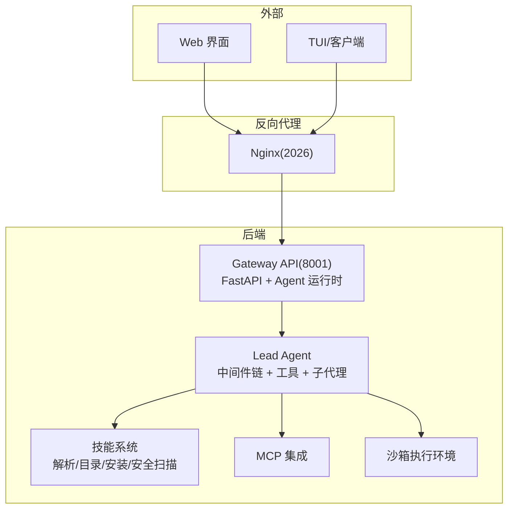
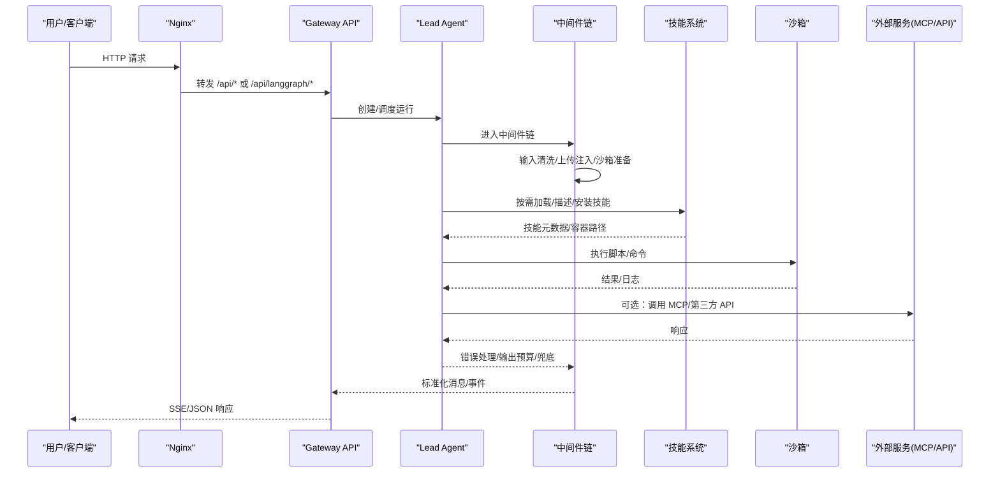
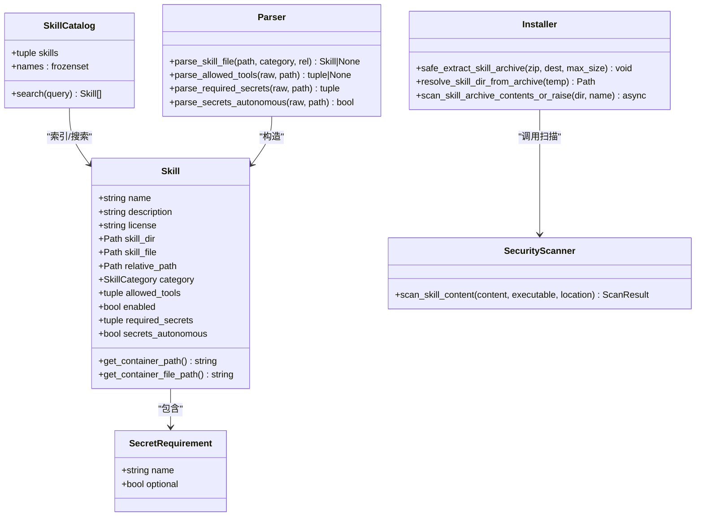
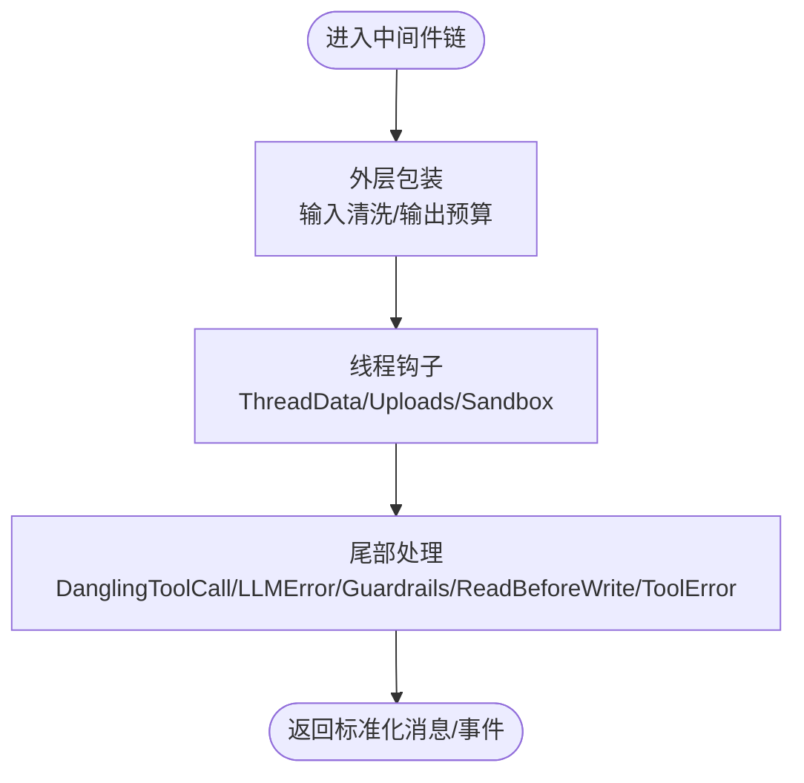
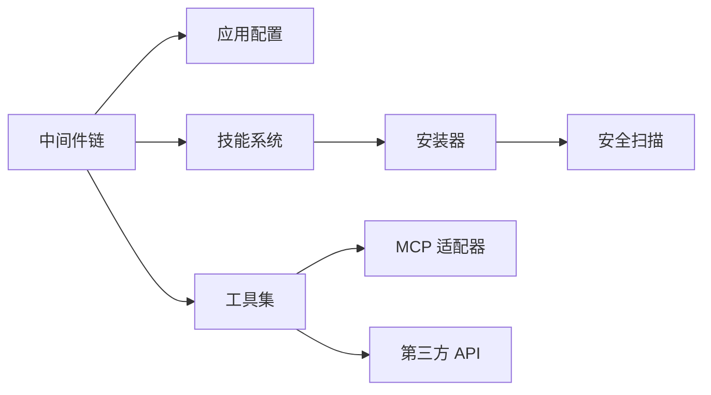

# 扩展开发

<cite>
**本文引用的文件**   
- [README.md](file://README.md)
- [backend/README.md](file://backend/README.md)
- [skills/public/chart-visualization/SKILL.md](file://skills/public/chart-visualization/SKILL.md)
- [skills/public/data-analysis/SKILL.md](file://skills/public/data-analysis/SKILL.md)
- [skills/public/image-generation/SKILL.md](file://skills/public/image-generation/SKILL.md)
- [backend/packages/harness/deerflow/skills/parser.py](file://backend/packages/harness/deerflow/skills/parser.py)
- [backend/packages/harness/deerflow/skills/catalog.py](file://backend/packages/harness/deerflow/skills/catalog.py)
- [backend/packages/harness/deerflow/skills/types.py](file://backend/packages/harness/deerflow/skills/types.py)
- [backend/packages/harness/deerflow/skills/installer.py](file://backend/packages/harness/deerflow/skills/installer.py)
- [backend/packages/harness/deerflow/skills/security_scanner.py](file://backend/packages/harness/deerflow/skills/security_scanner.py)
- [backend/packages/harness/deerflow/agents/middlewares/tool_error_handling_middleware.py](file://backend/packages/harness/deerflow/agents/middlewares/tool_error_handling_middleware.py)
</cite>

## 目录
1. [简介](#简介)
2. [项目结构](#项目结构)
3. [核心组件](#核心组件)
4. [架构总览](#架构总览)
5. [详细组件分析](#详细组件分析)
6. [依赖分析](#依赖分析)
7. [性能考虑](#性能考虑)
8. [故障排查指南](#故障排查指南)
9. [结论](#结论)
10. [附录](#附录)

## 简介
本指南面向 DeerFlow 扩展开发者，覆盖以下主题：
- 自定义技能（Skill）的完整流程：SKILL.md 规范、脚本与模板组织、安装与验证
- 工具插件开发：Python 函数工具、MCP 服务器集成、第三方 API 对接
- 中间件机制：请求拦截、响应处理、错误处理
- 社区工具集成最佳实践：浏览器、搜索引擎、数据处理等
- 调试技巧与性能优化建议
- 打包、分发与版本管理

## 项目结构
DeerFlow 采用“网关 + 运行时”的分层架构。前端通过 Nginx 统一入口访问 Gateway API；Gateway 负责路由到 LangGraph 兼容接口与其他业务路由；Agent 运行时在 Gateway 内以中间件链形式执行。

图示来源
- [backend/README.md:10-35](file://backend/README.md#L10-L35)
- [backend/README.md:220-265](file://backend/README.md#L220-L265)

章节来源
- [backend/README.md:10-35](file://backend/README.md#L10-L35)
- [backend/README.md:220-265](file://backend/README.md#L220-L265)

## 核心组件
- 技能系统（Skills）
  - 解析器：从 SKILL.md 提取元数据、白名单工具、所需密钥、自动绑定策略
  - 目录与搜索：延迟发现、按名称/描述检索、最大返回数量限制
  - 安装器：解压 .skill 归档、路径与大小校验、可执行二进制检测、权限设置
  - 安全扫描：对文本与脚本进行内容审查，支持 allow/warn/block 决策
- 中间件链（Middleware Chain）
  - 输入清洗、上传注入、沙箱生命周期、输出预算、错误处理、防护护栏、循环检测、视觉增强等
- 工具生态（Tools）
  - 内置工具、社区工具、MCP 工具、技能脚本调用
- 网关 API（Gateway）
  - 模型、MCP、技能、记忆、上传、工件、线程、运行、流式事件等 REST 端点

章节来源
- [backend/README.md:39-134](file://backend/README.md#L39-L134)
- [backend/README.md:108-134](file://backend/README.md#L108-L134)

## 架构总览
下图展示了从用户请求到技能脚本执行的端到端流程，包括中间件链与安全扫描环节。

图示来源
- [backend/README.md:10-35](file://backend/README.md#L10-L35)
- [backend/README.md:220-265](file://backend/README.md#L220-L265)
- [backend/packages/harness/deerflow/agents/middlewares/tool_error_handling_middleware.py:149-223](file://backend/packages/harness/deerflow/agents/middlewares/tool_error_handling_middleware.py#L149-L223)

## 详细组件分析

### 技能系统（Skills）
- SKILL.md 规范
  - 必需字段：name、description
  - 可选字段：license、allowed-tools、required-secrets、secrets-autonomous、compatibility 等
  - 解析器会校验 YAML front-matter，提供友好错误提示与行号定位
- 目录与搜索
  - 延迟发现：仅在需要时加载，保持系统提示紧凑
  - 查询语法：精确选择 select:、前缀要求 +、正则匹配
- 安装与打包
  - 支持 .skill 归档安装，拒绝绝对路径、目录穿越、符号链接、可执行二进制、超大压缩包
  - 安装后设置只读权限，确保沙箱可读
- 安全扫描
  - 基于 LLM 的内容审查，返回 allow/warn/block 决策
  - 失败保守回退为 block，需人工审核

图示来源
- [backend/packages/harness/deerflow/skills/types.py:25-93](file://backend/packages/harness/deerflow/skills/types.py#L25-L93)
- [backend/packages/harness/deerflow/skills/catalog.py:41-103](file://backend/packages/harness/deerflow/skills/catalog.py#L41-L103)
- [backend/packages/harness/deerflow/skills/parser.py:122-208](file://backend/packages/harness/deerflow/skills/parser.py#L122-L208)
- [backend/packages/harness/deerflow/skills/installer.py:101-148](file://backend/packages/harness/deerflow/skills/installer.py#L101-L148)
- [backend/packages/harness/deerflow/skills/security_scanner.py:70-110](file://backend/packages/harness/deerflow/skills/security_scanner.py#L70-L110)

章节来源
- [backend/packages/harness/deerflow/skills/parser.py:122-208](file://backend/packages/harness/deerflow/skills/parser.py#L122-L208)
- [backend/packages/harness/deerflow/skills/catalog.py:41-103](file://backend/packages/harness/deerflow/skills/catalog.py#L41-L103)
- [backend/packages/harness/deerflow/skills/types.py:25-93](file://backend/packages/harness/deerflow/skills/types.py#L25-L93)
- [backend/packages/harness/deerflow/skills/installer.py:101-148](file://backend/packages/harness/deerflow/skills/installer.py#L101-L148)
- [backend/packages/harness/deerflow/skills/security_scanner.py:70-110](file://backend/packages/harness/deerflow/skills/security_scanner.py#L70-L110)

#### SKILL.md 编写要点
- 使用 YAML front-matter 声明 name、description 等元信息
- 如需限定可用工具，使用 allowed-tools 列出工具名
- 如需声明环境变量密钥，使用 required-secrets；可通过 optional 控制是否强制
- 若希望仅在使用 /slash 激活时才绑定密钥，设置 secrets-autonomous=false
- 参考示例：
  - [chart-visualization/SKILL.md](file://skills/public/chart-visualization/SKILL.md)
  - [data-analysis/SKILL.md](file://skills/public/data-analysis/SKILL.md)
  - [image-generation/SKILL.md](file://skills/public/image-generation/SKILL.md)

章节来源
- [skills/public/chart-visualization/SKILL.md:1-73](file://skills/public/chart-visualization/SKILL.md#L1-L73)
- [skills/public/data-analysis/SKILL.md:1-249](file://skills/public/data-analysis/SKILL.md#L1-L249)
- [skills/public/image-generation/SKILL.md:1-209](file://skills/public/image-generation/SKILL.md#L1-L209)

#### 脚本与模板组织
- scripts：存放可执行脚本（Python/Node/Shell 等），由技能在工作区中调用
- templates：存放模板文件（Markdown/JSON 等），供生成阶段填充
- references：存放参考文档与参数说明，辅助模型正确构造参数
- 工作区路径约定：
  - /mnt/user-data/uploads：用户上传文件
  - /mnt/user-data/workspace：工作目录
  - /mnt/user-data/outputs：最终产物
  - /mnt/skills/{public,custom}：技能挂载路径

章节来源
- [backend/README.md:69-77](file://backend/README.md#L69-L77)

#### 测试与验证
- 本地验证
  - 使用 /skill-name 显式激活技能，观察系统提示是否注入、脚本是否可执行
  - 检查 outputs 目录是否产出预期文件
- 归档安装验证
  - 通过 Gateway 安装 .skill 归档，确认安全扫描与权限设置生效
- 单元测试参考
  - 技能安装、解析、权限、上下文、描述等测试用例位于 tests 目录

章节来源
- [backend/README.md:425-442](file://backend/README.md#L425-L442)

### 工具插件开发
- Python 函数工具
  - 遵循 LangChain/LangGraph 工具定义，暴露参数 schema 与实现逻辑
  - 结合沙箱路径约定读写文件，避免直接访问宿主文件系统
- MCP 服务器集成
  - 支持 stdio、HTTP/SSE 传输；HTTP 支持 OAuth（client_credentials、refresh_token）
  - 可在 extensions_config.json 中配置多个 MCP 服务器
- 第三方 API 对接
  - 通过工具封装网络请求，注意超时、重试、鉴权与错误降级
  - 建议在中间件中统一处理异常与输出预算

章节来源
- [backend/README.md:100-106](file://backend/README.md#L100-L106)
- [backend/README.md:294-325](file://backend/README.md#L294-L325)

### 中间件开发机制
- 中间件链顺序
  - 外层包装：输入清洗、输出预算
  - 线程钩子：线程数据初始化、上传注入、沙箱生命周期
  - 尾部处理：悬挂工具调用修复、LLM 错误处理、防护护栏、读取优先写、工具错误处理
- 关键职责
  - 输入清洗：过滤不安全内容
  - 上传注入：将新上传文件加入上下文
  - 沙箱：获取隔离执行环境，映射虚拟路径
  - 输出预算：限制工具输出大小，防止上下文爆炸
  - 错误处理：捕获并规范化工具/LLM 错误，提供恢复提示
- 构建方式
  - 共享基础中间件构建函数，区分主代理与子代理的差异（如图像能力、延迟工具过滤）

图示来源
- [backend/packages/harness/deerflow/agents/middlewares/tool_error_handling_middleware.py:149-223](file://backend/packages/harness/deerflow/agents/middlewares/tool_error_handling_middleware.py#L149-L223)

章节来源
- [backend/README.md:51-66](file://backend/README.md#L51-L66)
- [backend/packages/harness/deerflow/agents/middlewares/tool_error_handling_middleware.py:149-223](file://backend/packages/harness/deerflow/agents/middlewares/tool_error_handling_middleware.py#L149-L223)

### 社区工具集成最佳实践
- 浏览器工具
  - 使用渲染抓取或无头浏览器工具，注意反爬与速率限制
  - 将结果写入 outputs，并通过 present_files 展示
- 搜索引擎
  - 集成 Tavily、SearXNG、Exa 等，统一封装为工具
  - 缓存高频查询结果，减少重复请求
- 数据处理
  - 使用 data-analysis 技能提供的 DuckDB 引擎进行 SQL 分析与导出
  - 大文件处理采用列式存储与分页读取

章节来源
- [backend/README.md:100-106](file://backend/README.md#L100-L106)
- [skills/public/data-analysis/SKILL.md:1-249](file://skills/public/data-analysis/SKILL.md#L1-L249)

### 完整的开发示例
- 图表可视化技能
  - 根据数据特征智能选择图表类型，抽取参数并调用 generate.js 生成图片
  - 参考：[chart-visualization/SKILL.md](file://skills/public/chart-visualization/SKILL.md)
- 数据分析技能
  - 支持 Excel/CSV 多表、SQL 查询、统计摘要、导出 CSV/JSON/Markdown
  - 参考：[data-analysis/SKILL.md](file://skills/public/data-analysis/SKILL.md)
- 图像生成技能
  - 结构化 JSON 提示词，支持参考图与多提供商（Gemini/MiniMax）
  - 参考：[image-generation/SKILL.md](file://skills/public/image-generation/SKILL.md)

章节来源
- [skills/public/chart-visualization/SKILL.md:1-73](file://skills/public/chart-visualization/SKILL.md#L1-L73)
- [skills/public/data-analysis/SKILL.md:1-249](file://skills/public/data-analysis/SKILL.md#L1-L249)
- [skills/public/image-generation/SKILL.md:1-209](file://skills/public/image-generation/SKILL.md#L1-L209)

### 打包、分发与版本管理
- 打包
  - 将 SKILL.md、scripts、templates、references 等放入归档，确保不包含危险成员
- 分发
  - 通过 Gateway 安装接口上传 .skill 归档
  - 支持可选 frontmatter 元数据（version、author、compatibility）
- 版本管理
  - 在 SKILL.md 的 front-matter 中声明 version 与 compatibility
  - 使用 installer 的安全扫描与权限控制保证安装一致性

章节来源
- [README.md:625-626](file://README.md#L625-L626)
- [backend/packages/harness/deerflow/skills/installer.py:101-148](file://backend/packages/harness/deerflow/skills/installer.py#L101-L148)

## 依赖分析
- 组件耦合
  - 中间件链强依赖配置与工具策略；技能系统独立于网关，但被运行时按需调用
  - 安全扫描作为安装前置步骤，阻断不合规内容
- 外部依赖
  - MCP 适配器、LangChain/LangGraph、沙箱提供者、文档转换库等

图示来源
- [backend/README.md:39-134](file://backend/README.md#L39-L134)
- [backend/packages/harness/deerflow/skills/installer.py:101-148](file://backend/packages/harness/deerflow/skills/installer.py#L101-L148)
- [backend/packages/harness/deerflow/skills/security_scanner.py:70-110](file://backend/packages/harness/deerflow/skills/security_scanner.py#L70-L110)

章节来源
- [backend/README.md:39-134](file://backend/README.md#L39-L134)

## 性能考虑
- 延迟加载技能与工具，避免一次性注入全部描述
- 控制工具输出预算，防止上下文膨胀
- 使用沙箱异步生命周期钩子，避免阻塞事件循环
- 对频繁调用的外部 API 增加缓存与去重
- 合理配置并发与超时，避免资源争用

章节来源
- [backend/README.md:51-66](file://backend/README.md#L51-L66)
- [backend/README.md:425-442](file://backend/README.md#L425-L442)

## 故障排查指南
- 常见问题
  - SKILL.md YAML 错误：解析器会输出具体行号与提示
  - 安全扫描失败：默认 block，需人工审核
  - 工具调用异常：中间件提供兜底与恢复提示
- 诊断工具
  - make doctor：检查环境与依赖
  - make support-bundle：收集诊断信息与证据包
  - 追踪：启用 LangSmith/Langfuse 进行链路观测

章节来源
- [backend/packages/harness/deerflow/skills/parser.py:15-43](file://backend/packages/harness/deerflow/skills/parser.py#L15-L43)
- [backend/packages/harness/deerflow/skills/security_scanner.py:102-110](file://backend/packages/harness/deerflow/skills/security_scanner.py#L102-L110)
- [backend/packages/harness/deerflow/agents/middlewares/tool_error_handling_middleware.py:149-223](file://backend/packages/harness/deerflow/agents/middlewares/tool_error_handling_middleware.py#L149-L223)
- [README.md:118-130](file://README.md#L118-L130)

## 结论
DeerFlow 的扩展体系围绕“技能 + 工具 + 中间件”三大支柱构建。通过标准化的 SKILL.md、严格的安装与安全扫描、灵活的中间件链与丰富的工具生态，开发者可以快速构建领域化、可复用的能力模块，并在生产环境中稳定运行。

## 附录
- 快速开始与部署
  - 参考 README 中的 Docker 与本地开发指引
- 配置参考
  - config.yaml 与 extensions_config.json 的关键项说明
- 测试与质量
  - 使用 ruff 进行代码风格检查，pytest 运行测试套件

章节来源
- [README.md:231-337](file://README.md#L231-L337)
- [backend/README.md:275-325](file://backend/README.md#L275-L325)
- [backend/README.md:417-442](file://backend/README.md#L417-L442)