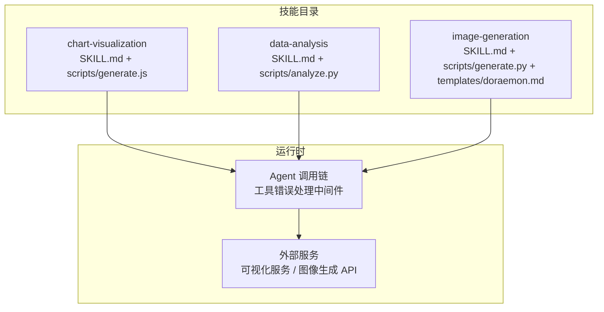
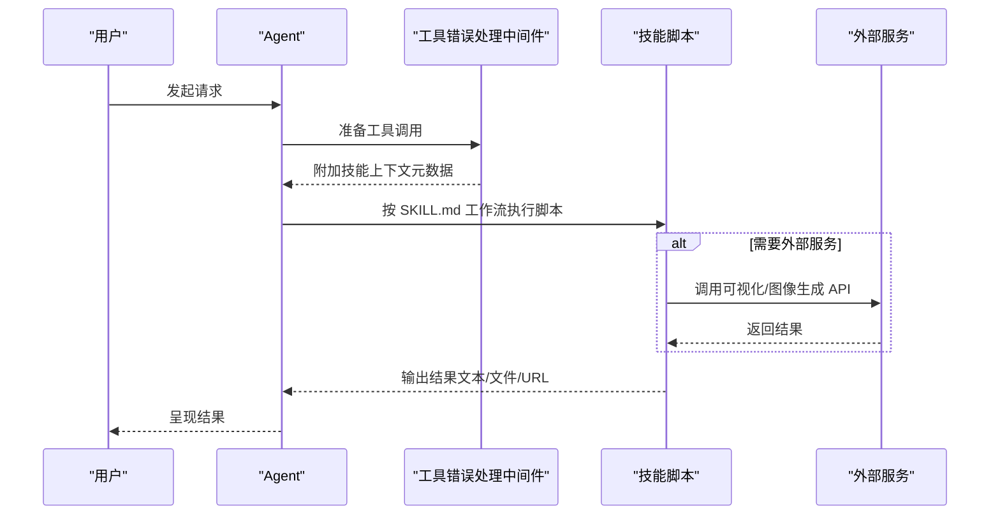
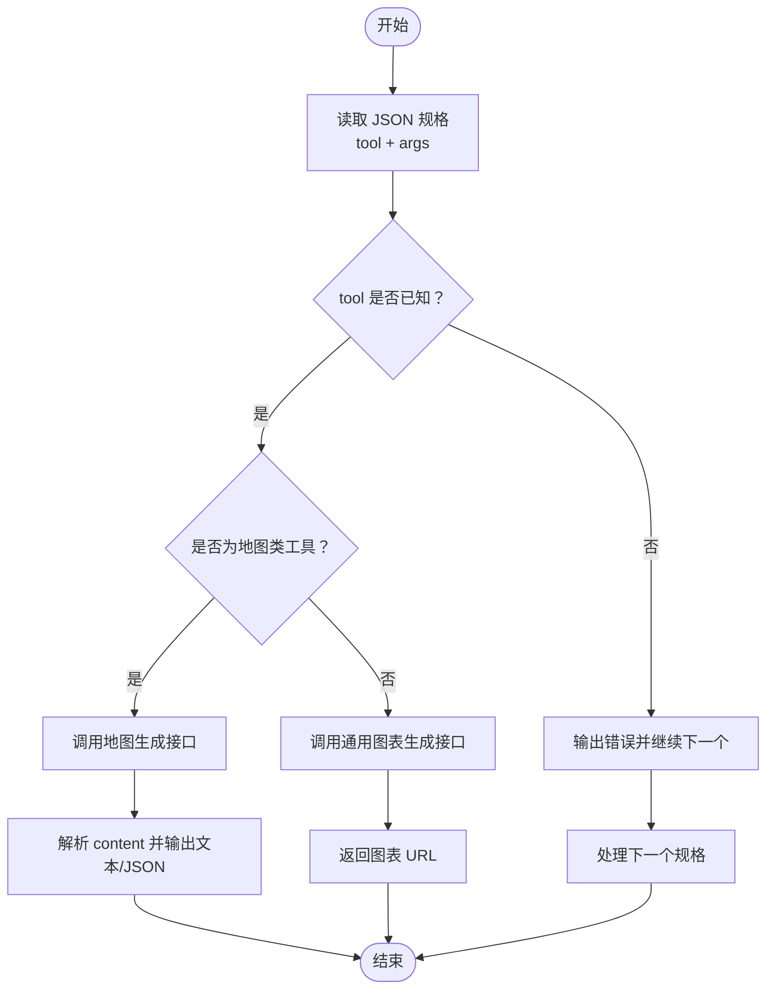
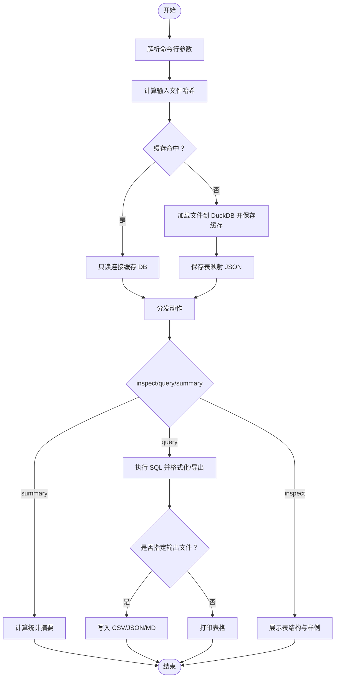
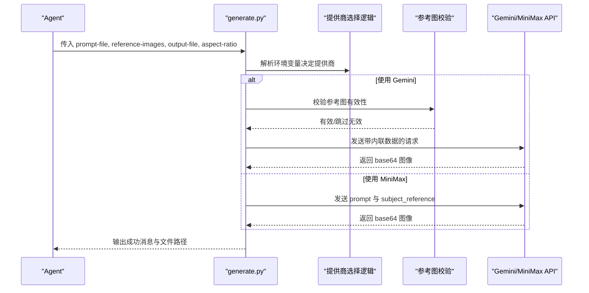
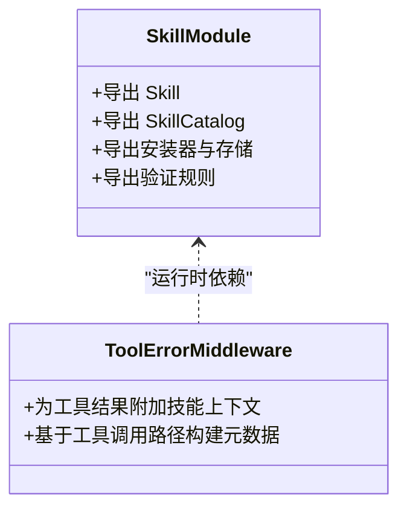

# 自定义技能开发

<cite>
**本文引用的文件**   
- [SKILL.md（图表可视化）](file://skills/public/chart-visualization/SKILL.md)
- [generate.js（图表可视化脚本）](file://skills/public/chart-visualization/scripts/generate.js)
- [SKILL.md（数据分析）](file://skills/public/data-analysis/SKILL.md)
- [analyze.py（数据分析脚本）](file://skills/public/data-analysis/scripts/analyze.py)
- [SKILL.md（图像生成）](file://skills/public/image-generation/SKILL.md)
- [generate.py（图像生成脚本）](file://skills/public/image-generation/scripts/generate.py)
- [tool_error_handling_middleware.py（工具错误处理中间件）](file://backend/packages/harness/deerflow/agents/middlewares/tool_error_handling_middleware.py)
- [__init__.py（技能模块导出）](file://backend/packages/harness/deerflow/skills/__init__.py)
</cite>

## 目录
1. [简介](#简介)
2. [项目结构](#项目结构)
3. [核心组件](#核心组件)
4. [架构总览](#架构总览)
5. [详细组件分析](#详细组件分析)
6. [依赖关系分析](#依赖关系分析)
7. [性能考虑](#性能考虑)
8. [故障排查指南](#故障排查指南)
9. [结论](#结论)
10. [附录](#附录)

## 简介
本指南面向希望为 DeerFlow 平台开发“自定义技能”的工程师与内容创作者。文档围绕以下目标展开：
- SKILL.md 文件格式规范：元数据定义、参数配置、依赖声明等核心要素
- 脚本编写规范：Python、JavaScript、Shell 脚本的要求与最佳实践
- 模板系统使用方法：Jinja2 模板语法与变量替换机制
- 完整技能开发示例：从简单数据处理到复杂多步骤工作流
- 测试验证方法：单元测试、集成测试与性能测试
- 打包、版本管理与发布流程
- 参考现有技能案例：chart-visualization、data-analysis、image-generation

## 项目结构
DeerFlow 将“技能”以目录形式组织，每个技能包含描述性说明、可执行脚本与可选模板/参考资料。典型结构如下：
- 根目录：skills/public/<skill-name>/
  - SKILL.md：技能说明与工作流
  - scripts/：可执行脚本（Python/JS/Shell）
  - templates/：模板文件（如 Jinja2）
  - references/：参考文档或规范

**图示来源** 
- [SKILL.md（图表可视化）:1-73](file://skills/public/chart-visualization/SKILL.md#L1-L73)
- [generate.js（图表可视化脚本）:1-174](file://skills/public/chart-visualization/scripts/generate.js#L1-L174)
- [SKILL.md（数据分析）:1-249](file://skills/public/data-analysis/SKILL.md#L1-L249)
- [analyze.py（数据分析脚本）:1-567](file://skills/public/data-analysis/scripts/analyze.py#L1-L567)
- [SKILL.md（图像生成）:1-209](file://skills/public/image-generation/SKILL.md#L1-L209)
- [generate.py（图像生成脚本）:1-229](file://skills/public/image-generation/scripts/generate.py#L1-L229)
- [tool_error_handling_middleware.py（工具错误处理中间件）:1-114](file://backend/packages/harness/deerflow/agents/middlewares/tool_error_handling_middleware.py#L1-L114)

**章节来源**
- [SKILL.md（图表可视化）:1-73](file://skills/public/chart-visualization/SKILL.md#L1-L73)
- [SKILL.md（数据分析）:1-249](file://skills/public/data-analysis/SKILL.md#L1-L249)
- [SKILL.md（图像生成）:1-209](file://skills/public/image-generation/SKILL.md#L1-L209)

## 核心组件
- SKILL.md 规范
  - 使用 YAML Front Matter 提供元数据（名称、描述、兼容性等）
  - 正文部分定义工作流、参数、输出格式与注意事项
- 脚本接口
  - Python 脚本通过命令行参数接收输入，支持缓存与结果导出
  - JavaScript 脚本解析 JSON 规格并调用外部可视化服务
  - Shell 脚本用于环境检查、部署与健康检查等辅助任务
- 模板系统
  - 在模板目录中存放模板文件，结合变量替换生成最终内容
- 运行时集成
  - Agent 通过工具调用链执行技能脚本，中间件负责错误处理与上下文注入

**章节来源**
- [SKILL.md（图表可视化）:1-73](file://skills/public/chart-visualization/SKILL.md#L1-L73)
- [SKILL.md（数据分析）:1-249](file://skills/public/data-analysis/SKILL.md#L1-L249)
- [SKILL.md（图像生成）:1-209](file://skills/public/image-generation/SKILL.md#L1-L209)
- [generate.js（图表可视化脚本）:1-174](file://skills/public/chart-visualization/scripts/generate.js#L1-L174)
- [analyze.py（数据分析脚本）:1-567](file://skills/public/data-analysis/scripts/analyze.py#L1-L567)
- [generate.py（图像生成脚本）:1-229](file://skills/public/image-generation/scripts/generate.py#L1-L229)
- [tool_error_handling_middleware.py（工具错误处理中间件）:1-114](file://backend/packages/harness/deerflow/agents/middlewares/tool_error_handling_middleware.py#L1-L114)

## 架构总览
下图展示了 Agent 调用技能脚本的整体流程：用户请求进入 Agent，Agent 根据 SKILL.md 的工作流选择相应脚本，脚本执行后返回结果；中间件对工具调用进行错误处理与上下文标注。

**图示来源** 
- [tool_error_handling_middleware.py（工具错误处理中间件）:1-114](file://backend/packages/harness/deerflow/agents/middlewares/tool_error_handling_middleware.py#L1-L114)
- [SKILL.md（图表可视化）:1-73](file://skills/public/chart-visualization/SKILL.md#L1-L73)
- [SKILL.md（数据分析）:1-249](file://skills/public/data-analysis/SKILL.md#L1-L249)
- [SKILL.md（图像生成）:1-209](file://skills/public/image-generation/SKILL.md#L1-L209)

## 详细组件分析

### 图表可视化技能（chart-visualization）
- 能力概述
  - 智能选择图表类型，提取参数，调用 JS 脚本生成图表图片 URL
- 关键流程
  - 读取 SKILL.md 中的图表选择指南与参考文档
  - 构造 JSON 规格（包含 tool 与 args）
  - 执行 generate.js，传入 JSON 规格字符串或文件路径
  - 脚本映射 tool 到具体图表类型，调用可视化服务并返回结果
- 错误处理
  - 脚本对未知 tool 与 HTTP 错误进行提示与退出
  - 地图类工具走专用分支，返回结构化 content

**图示来源** 
- [SKILL.md（图表可视化）:1-73](file://skills/public/chart-visualization/SKILL.md#L1-L73)
- [generate.js（图表可视化脚本）:1-174](file://skills/public/chart-visualization/scripts/generate.js#L1-L174)

**章节来源**
- [SKILL.md（图表可视化）:1-73](file://skills/public/chart-visualization/SKILL.md#L1-L73)
- [generate.js（图表可视化脚本）:1-174](file://skills/public/chart-visualization/scripts/generate.js#L1-L174)

### 数据分析技能（data-analysis）
- 能力概述
  - 基于 DuckDB 的 SQL 引擎，支持 Excel/CSV 的结构检查、查询、统计摘要与结果导出
- 关键流程
  - inspect：列出表名、列信息、非空计数与样例数据
  - query：执行 SQL，支持跨文件 JOIN、窗口函数、聚合等
  - summary：对数值型与字符型列分别计算统计指标
  - 结果导出：CSV/JSON/Markdown
- 缓存机制
  - 基于输入文件的 SHA256 哈希持久化 DuckDB 数据库与表映射，命中则只读连接，显著加速重复调用

**图示来源** 
- [SKILL.md（数据分析）:1-249](file://skills/public/data-analysis/SKILL.md#L1-L249)
- [analyze.py（数据分析脚本）:1-567](file://skills/public/data-analysis/scripts/analyze.py#L1-L567)

**章节来源**
- [SKILL.md（数据分析）:1-249](file://skills/public/data-analysis/SKILL.md#L1-L249)
- [analyze.py（数据分析脚本）:1-567](file://skills/public/data-analysis/scripts/analyze.py#L1-L567)

### 图像生成技能（image-generation）
- 能力概述
  - 通过结构化 JSON 提示词与可选参考图，调用 Gemini 或 MiniMax 生成高质量图像
- 关键流程
  - 读取 prompt 文件（JSON 或纯文本），自动选择提供商
  - 校验参考图有效性（Gemini 路径）
  - 调用对应 API，解码 base64 图像并保存到输出路径
- 提供商选择
  - 环境变量优先级：显式覆盖 > 已有凭据 > MiniMax 默认
  - MiniMax 限制：prompt 长度上限，内部优化器扩展提示

**图示来源** 
- [SKILL.md（图像生成）:1-209](file://skills/public/image-generation/SKILL.md#L1-L209)
- [generate.py（图像生成脚本）:1-229](file://skills/public/image-generation/scripts/generate.py#L1-L229)

**章节来源**
- [SKILL.md（图像生成）:1-209](file://skills/public/image-generation/SKILL.md#L1-L209)
- [generate.py（图像生成脚本）:1-229](file://skills/public/image-generation/scripts/generate.py#L1-L229)

### 模板系统与变量替换
- 模板位置
  - 位于各技能的 templates/ 目录下，例如 image-generation 的 doraemon.md
- 使用方式
  - 在 SKILL.md 中指明何时读取特定模板
  - 模板文件中使用占位符与条件逻辑，由渲染层进行变量替换
- 建议
  - 保持模板与业务逻辑解耦，便于维护与复用
  - 对敏感信息进行脱敏后再填充

[本节为概念性说明，不直接分析具体文件]

## 依赖关系分析
- 模块导出
  - 技能相关能力通过 __init__.py 统一导出，包括 Skill、SkillCatalog、安装器、存储、验证等
- 运行时集成
  - 工具错误处理中间件在工具调用时注入技能上下文元数据，提升可观测性与排障效率

**图示来源** 
- [__init__.py（技能模块导出）:1-24](file://backend/packages/harness/deerflow/skills/__init__.py#L1-L24)
- [tool_error_handling_middleware.py（工具错误处理中间件）:1-114](file://backend/packages/harness/deerflow/agents/middlewares/tool_error_handling_middleware.py#L1-L114)

**章节来源**
- [__init__.py（技能模块导出）:1-24](file://backend/packages/harness/deerflow/skills/__init__.py#L1-L24)
- [tool_error_handling_middleware.py（工具错误处理中间件）:1-114](file://backend/packages/harness/deerflow/agents/middlewares/tool_error_handling_middleware.py#L1-L114)

## 性能考虑
- 数据分析缓存
  - 基于文件内容的哈希键避免重复解析，首次加载后后续调用接近即时启动
- 外部服务调用
  - 图表与图像生成均涉及网络请求，需合理设置超时与重试策略
- 大文件处理
  - DuckDB 列式引擎高效处理大型数据集，注意内存与磁盘空间规划
- 日志与可观测性
  - 脚本输出结构化日志，便于定位问题与评估性能

**章节来源**
- [analyze.py（数据分析脚本）:1-567](file://skills/public/data-analysis/scripts/analyze.py#L1-L567)
- [generate.js（图表可视化脚本）:1-174](file://skills/public/chart-visualization/scripts/generate.js#L1-L174)
- [generate.py（图像生成脚本）:1-229](file://skills/public/image-generation/scripts/generate.py#L1-L229)

## 故障排查指南
- 常见错误
  - 未知 tool 或非法 JSON 规格：脚本会输出错误并终止当前项
  - 外部服务失败：HTTP 状态码与响应体作为错误信息返回
  - 缺少凭据：图像生成脚本在未设置必要环境变量时报错
- 调试建议
  - 查看脚本标准输出与错误输出
  - 检查环境变量与文件路径是否正确
  - 利用中间件附加的技能上下文元数据进行链路追踪

**章节来源**
- [generate.js（图表可视化脚本）:1-174](file://skills/public/chart-visualization/scripts/generate.js#L1-L174)
- [generate.py（图像生成脚本）:1-229](file://skills/public/image-generation/scripts/generate.py#L1-L229)
- [tool_error_handling_middleware.py（工具错误处理中间件）:1-114](file://backend/packages/harness/deerflow/agents/middlewares/tool_error_handling_middleware.py#L1-L114)

## 结论
通过统一的 SKILL.md 规范与脚本接口，DeerFlow 提供了可扩展、可观测且高性能的技能体系。开发者可以基于现有案例快速上手，并在模板、缓存与错误处理方面遵循最佳实践，确保技能在生产环境中稳定运行。

[本节为总结性内容，不直接分析具体文件]

## 附录

### SKILL.md 元数据与字段规范
- 必需字段
  - name：技能名称
  - description：技能用途与触发场景
- 可选字段
  - compatibility：运行时依赖与环境要求（如 nodejs 版本）
- 正文结构
  - 工作流：分步说明如何完成任务
  - 参数与输出：明确输入输出格式与约束
  - 注意事项：安全、性能与边界情况

**章节来源**
- [SKILL.md（图表可视化）:1-73](file://skills/public/chart-visualization/SKILL.md#L1-L73)
- [SKILL.md（数据分析）:1-249](file://skills/public/data-analysis/SKILL.md#L1-L249)
- [SKILL.md（图像生成）:1-209](file://skills/public/image-generation/SKILL.md#L1-L209)

### 脚本编写规范与最佳实践
- Python 脚本
  - 使用 argparse 解析参数
  - 实现幂等与缓存，减少重复开销
  - 输出结构化结果，便于下游消费
- JavaScript 脚本
  - 严格校验输入 JSON 规格
  - 对外部服务调用增加错误处理与重试
- Shell 脚本
  - 提供环境检查、部署与健康检查等辅助功能
  - 使用严格的退出码与日志输出

**章节来源**
- [analyze.py（数据分析脚本）:1-567](file://skills/public/data-analysis/scripts/analyze.py#L1-L567)
- [generate.js（图表可视化脚本）:1-174](file://skills/public/chart-visualization/scripts/generate.js#L1-L174)
- [generate.py（图像生成脚本）:1-229](file://skills/public/image-generation/scripts/generate.py#L1-L229)

### 模板系统使用要点
- 模板文件放置于 templates/ 目录
- 在 SKILL.md 中指明模板的使用时机与变量来源
- 使用安全的变量替换，避免注入风险

[本节为概念性说明，不直接分析具体文件]

### 测试与验证方法
- 单元测试
  - 针对脚本的核心函数与边界条件进行测试
- 集成测试
  - 模拟外部服务响应，验证端到端流程
- 性能测试
  - 对大数据集与高并发场景进行基准测试，关注缓存命中率与外部服务延迟

[本节为概念性说明，不直接分析具体文件]

### 打包、版本管理与发布流程
- 打包
  - 将 SKILL.md、scripts/、templates/、references/ 纳入版本控制
- 版本管理
  - 使用语义化版本号记录变更
  - 在 SKILL.md 中注明兼容性与依赖变化
- 发布
  - 提交至公共仓库或私有注册中心
  - 更新文档与示例，确保使用者能顺利安装与运行

[本节为概念性说明，不直接分析具体文件]