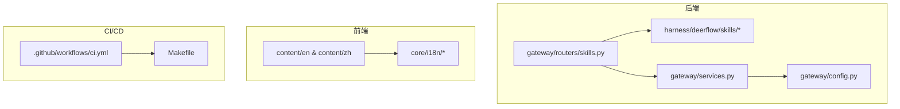
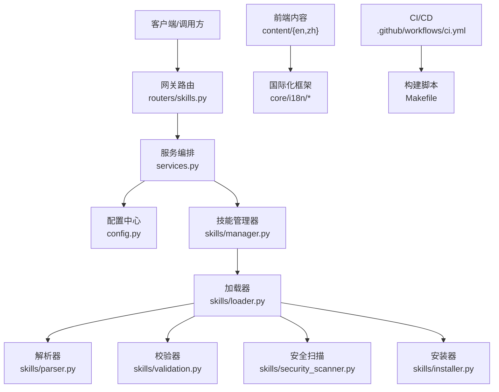
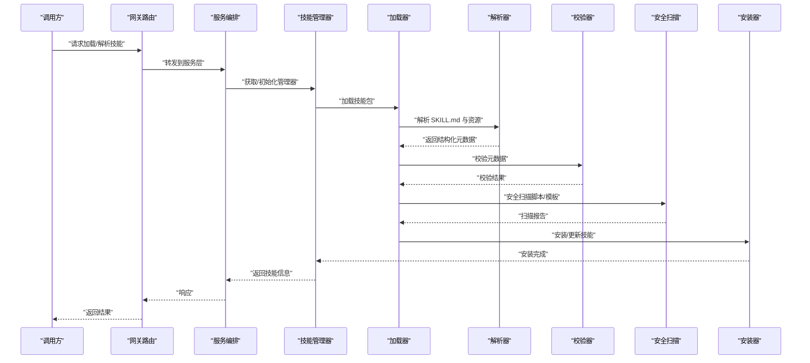
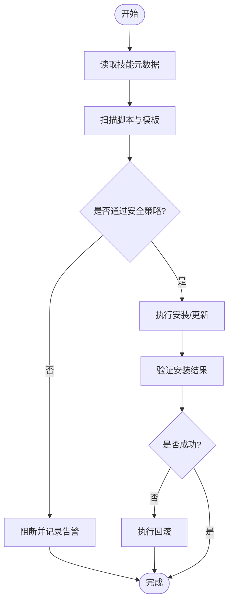
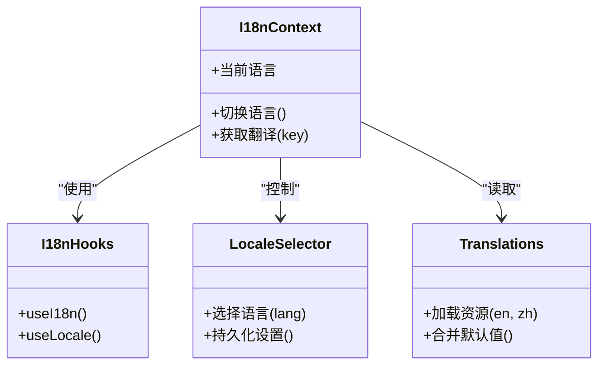
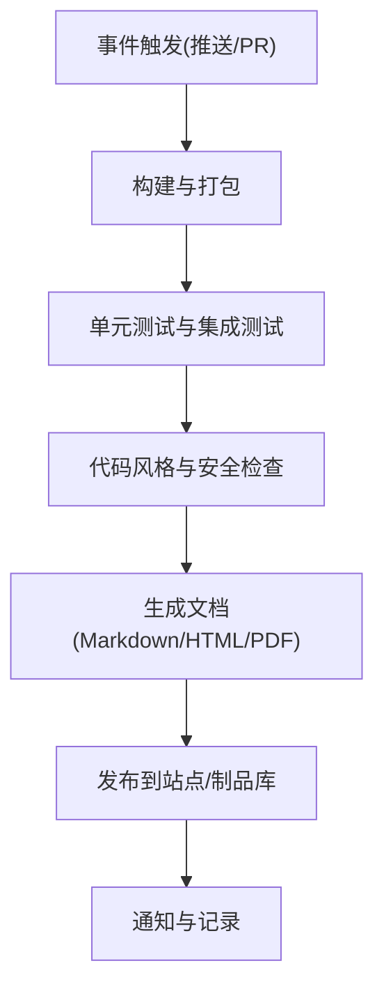
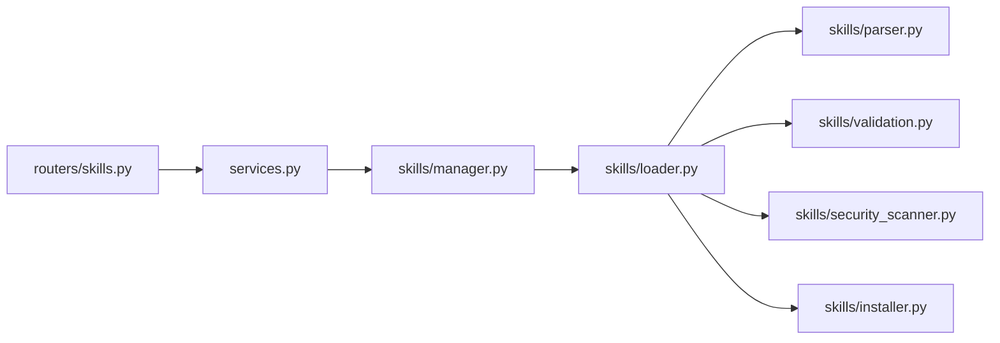

# 代码文档生成技能

<cite>
**本文引用的文件**   
- [SKILL.md](file://skills/public/code-documentation/SKILL.md)
- [backend/app/gateway/routers/skills.py](file://backend/app/gateway/routers/skills.py)
- [backend/packages/harness/deerflow/skills/loader.py](file://backend/packages/harness/deerflow/skills/loader.py)
- [backend/packages/harness/deerflow/skills/manager.py](file://backend/packages/harness/deerflow/skills/manager.py)
- [backend/packages/harness/deerflow/skills/parser.py](file://backend/packages/harness/deerflow/skills/parser.py)
- [backend/packages/harness/deerflow/skills/types.py](file://backend/packages/harness/deerflow/skills/types.py)
- [backend/packages/harness/deerflow/skills/validation.py](file://backend/packages/harness/deerflow/skills/validation.py)
- [backend/packages/harness/deerflow/skills/installer.py](file://backend/packages/harness/deerflow/skills/installer.py)
- [backend/packages/harness/deerflow/skills/security_scanner.py](file://backend/packages/harness/deerflow/skills/security_scanner.py)
- [backend/app/gateway/services.py](file://backend/app/gateway/services.py)
- [backend/app/gateway/config.py](file://backend/app/gateway/config.py)
- [frontend/src/content/en/index.mdx](file://frontend/src/content/en/index.mdx)
- [frontend/src/content/zh/index.mdx](file://frontend/src/content/zh/index.mdx)
- [frontend/src/core/i18n/index.ts](file://frontend/src/core/i18n/index.ts)
- [frontend/src/core/i18n/context.tsx](file://frontend/src/core/i18n/context.tsx)
- [frontend/src/core/i18n/hooks.ts](file://frontend/src/core/i18n/hooks.ts)
- [frontend/src/core/i18n/locale.ts](file://frontend/src/core/i18n/locale.ts)
- [frontend/src/core/i18n/server.ts](file://frontend/src/core/i18n/server.ts)
- [frontend/src/core/i18n/translations.ts](file://frontend/src/core/i18n/translations.ts)
- [frontend/src/core/i18n/locales/en.json](file://frontend/src/core/i18n/locales/en.json)
- [frontend/src/core/i18n/locales/zh.json](file://frontend/src/core/i18n/locales/zh.json)
- [.github/workflows/ci.yml](file://.github/workflows/ci.yml)
- [Makefile](file://Makefile)
</cite>

## 目录
1. [简介](#简介)
2. [项目结构](#项目结构)
3. [核心组件](#核心组件)
4. [架构总览](#架构总览)
5. [详细组件分析](#详细组件分析)
6. [依赖关系分析](#依赖关系分析)
7. [性能考虑](#性能考虑)
8. [故障排查指南](#故障排查指南)
9. [结论](#结论)
10. [附录](#附录)

## 简介
本“代码文档生成技能”围绕仓库中的 skills 体系与前端多语言内容组织，提供一套从“技能定义—加载解析—校验与安全扫描—安装部署—API 暴露—前端展示—国际化—CI/CD 集成”的端到端能力。其目标包括：
- 支持多种编程语言（通过通用解析器与工具链扩展）
- 输出多种文档格式（Markdown、HTML、PDF 等，由模板与渲染管线决定）
- 自动提取代码注释、API 接口文档、函数说明
- 文档结构组织、版本管理与更新策略
- 自定义文档模板与样式配置
- 多语言支持与国际化配置
- 与 CI/CD 流程集成和自动化文档发布

## 项目结构
该功能在仓库中分布于后端 skills 子系统、网关路由与服务层、前端内容与 i18n 资源以及 GitHub Actions 工作流与 Makefile 脚本。整体结构如下：

图表来源
- [backend/app/gateway/routers/skills.py](file://backend/app/gateway/routers/skills.py)
- [backend/packages/harness/deerflow/skills/loader.py](file://backend/packages/harness/deerflow/skills/loader.py)
- [backend/packages/harness/deerflow/skills/manager.py](file://backend/packages/harness/deerflow/skills/manager.py)
- [backend/packages/harness/deerflow/skills/parser.py](file://backend/packages/harness/deerflow/skills/parser.py)
- [backend/packages/harness/deerflow/skills/types.py](file://backend/packages/harness/deerflow/skills/types.py)
- [backend/packages/harness/deerflow/skills/validation.py](file://backend/packages/harness/deerflow/skills/validation.py)
- [backend/packages/harness/deerflow/skills/installer.py](file://backend/packages/harness/deerflow/skills/installer.py)
- [backend/packages/harness/deerflow/skills/security_scanner.py](file://backend/packages/harness/deerflow/skills/security_scanner.py)
- [backend/app/gateway/services.py](file://backend/app/gateway/services.py)
- [backend/app/gateway/config.py](file://backend/app/gateway/config.py)
- [frontend/src/content/en/index.mdx](file://frontend/src/content/en/index.mdx)
- [frontend/src/content/zh/index.mdx](file://frontend/src/content/zh/index.mdx)
- [frontend/src/core/i18n/index.ts](file://frontend/src/core/i18n/index.ts)
- [frontend/src/core/i18n/context.tsx](file://frontend/src/core/i18n/context.tsx)
- [frontend/src/core/i18n/hooks.ts](file://frontend/src/core/i18n/hooks.ts)
- [frontend/src/core/i18n/locale.ts](file://frontend/src/core/i18n/locale.ts)
- [frontend/src/core/i18n/server.ts](file://frontend/src/core/i18n/server.ts)
- [frontend/src/core/i18n/translations.ts](file://frontend/src/core/i18n/translations.ts)
- [frontend/src/core/i18n/locales/en.json](file://frontend/src/core/i18n/locales/en.json)
- [frontend/src/core/i18n/locales/zh.json](file://frontend/src/core/i18n/locales/zh.json)
- [.github/workflows/ci.yml](file://.github/workflows/ci.yml)
- [Makefile](file://Makefile)

章节来源
- [backend/app/gateway/routers/skills.py](file://backend/app/gateway/routers/skills.py)
- [backend/packages/harness/deerflow/skills/loader.py](file://backend/packages/harness/deerflow/skills/loader.py)
- [backend/packages/harness/deerflow/skills/manager.py](file://backend/packages/harness/deerflow/skills/manager.py)
- [backend/packages/harness/deerflow/skills/parser.py](file://backend/packages/harness/deerflow/skills/parser.py)
- [backend/packages/harness/deerflow/skills/types.py](file://backend/packages/harness/deerflow/skills/types.py)
- [backend/packages/harness/deerflow/skills/validation.py](file://backend/packages/harness/deerflow/skills/validation.py)
- [backend/packages/harness/deerflow/skills/installer.py](file://backend/packages/harness/deerflow/skills/installer.py)
- [backend/packages/harness/deerflow/skills/security_scanner.py](file://backend/packages/harness/deerflow/skills/security_scanner.py)
- [backend/app/gateway/services.py](file://backend/app/gateway/services.py)
- [backend/app/gateway/config.py](file://backend/app/gateway/config.py)
- [frontend/src/content/en/index.mdx](file://frontend/src/content/en/index.mdx)
- [frontend/src/content/zh/index.mdx](file://frontend/src/content/zh/index.mdx)
- [frontend/src/core/i18n/index.ts](file://frontend/src/core/i18n/index.ts)
- [frontend/src/core/i18n/context.tsx](file://frontend/src/core/i18n/context.tsx)
- [frontend/src/core/i18n/hooks.ts](file://frontend/src/core/i18n/hooks.ts)
- [frontend/src/core/i18n/locale.ts](file://frontend/src/core/i18n/locale.ts)
- [frontend/src/core/i18n/server.ts](file://frontend/src/core/i18n/server.ts)
- [frontend/src/core/i18n/translations.ts](file://frontend/src/core/i18n/translations.ts)
- [frontend/src/core/i18n/locales/en.json](file://frontend/src/core/i18n/locales/en.json)
- [frontend/src/core/i18n/locales/zh.json](file://frontend/src/core/i18n/locales/zh.json)
- [.github/workflows/ci.yml](file://.github/workflows/ci.yml)
- [Makefile](file://Makefile)

## 核心组件
- 技能定义与元数据
  - 每个技能以 SKILL.md 为入口，描述能力、输入输出、模板与脚本等。
  - 类型与校验模型集中在 types.py 与 validation.py，确保元数据一致性与安全性。
- 技能加载与解析
  - loader.py 负责发现与加载技能包；parser.py 解析 SKILL.md 与关联资源；manager.py 维护运行时状态与生命周期。
- 安全与安装
  - security_scanner.py 对脚本与模板进行安全检查；installer.py 负责安装、升级与回滚。
- 网关与服务
  - routers/skills.py 暴露 REST API；services.py 编排业务逻辑；config.py 提供配置项。
- 前端内容与国际化
  - content/{en,zh} 存放多语言文档；core/i18n 提供上下文、钩子、服务器端选择与翻译资源。
- CI/CD 与构建
  - .github/workflows/ci.yml 驱动流水线；Makefile 封装常用命令。

章节来源
- [skills/public/code-documentation/SKILL.md](file://skills/public/code-documentation/SKILL.md)
- [backend/packages/harness/deerflow/skills/types.py](file://backend/packages/harness/deerflow/skills/types.py)
- [backend/packages/harness/deerflow/skills/validation.py](file://backend/packages/harness/deerflow/skills/validation.py)
- [backend/packages/harness/deerflow/skills/loader.py](file://backend/packages/harness/deerflow/skills/loader.py)
- [backend/packages/harness/deerflow/skills/parser.py](file://backend/packages/harness/deerflow/skills/parser.py)
- [backend/packages/harness/deerflow/skills/manager.py](file://backend/packages/harness/deerflow/skills/manager.py)
- [backend/packages/harness/deerflow/skills/security_scanner.py](file://backend/packages/harness/deerflow/skills/security_scanner.py)
- [backend/packages/harness/deerflow/skills/installer.py](file://backend/packages/harness/deerflow/skills/installer.py)
- [backend/app/gateway/routers/skills.py](file://backend/app/gateway/routers/skills.py)
- [backend/app/gateway/services.py](file://backend/app/gateway/services.py)
- [backend/app/gateway/config.py](file://backend/app/gateway/config.py)
- [frontend/src/content/en/index.mdx](file://frontend/src/content/en/index.mdx)
- [frontend/src/content/zh/index.mdx](file://frontend/src/content/zh/index.mdx)
- [frontend/src/core/i18n/index.ts](file://frontend/src/core/i18n/index.ts)
- [frontend/src/core/i18n/context.tsx](file://frontend/src/core/i18n/context.tsx)
- [frontend/src/core/i18n/hooks.ts](file://frontend/src/core/i18n/hooks.ts)
- [frontend/src/core/i18n/locale.ts](file://frontend/src/core/i18n/locale.ts)
- [frontend/src/core/i18n/server.ts](file://frontend/src/core/i18n/server.ts)
- [frontend/src/core/i18n/translations.ts](file://frontend/src/core/i18n/translations.ts)
- [frontend/src/core/i18n/locales/en.json](file://frontend/src/core/i18n/locales/en.json)
- [frontend/src/core/i18n/locales/zh.json](file://frontend/src/core/i18n/locales/zh.json)
- [.github/workflows/ci.yml](file://.github/workflows/ci.yml)
- [Makefile](file://Makefile)

## 架构总览
系统采用“后端技能引擎 + 网关服务 + 前端多语言内容 + CI/CD 自动化”的分层架构。

图表来源
- [backend/app/gateway/routers/skills.py](file://backend/app/gateway/routers/skills.py)
- [backend/app/gateway/services.py](file://backend/app/gateway/services.py)
- [backend/app/gateway/config.py](file://backend/app/gateway/config.py)
- [backend/packages/harness/deerflow/skills/manager.py](file://backend/packages/harness/deerflow/skills/manager.py)
- [backend/packages/harness/deerflow/skills/loader.py](file://backend/packages/harness/deerflow/skills/loader.py)
- [backend/packages/harness/deerflow/skills/parser.py](file://backend/packages/harness/deerflow/skills/parser.py)
- [backend/packages/harness/deerflow/skills/validation.py](file://backend/packages/harness/deerflow/skills/validation.py)
- [backend/packages/harness/deerflow/skills/security_scanner.py](file://backend/packages/harness/deerflow/skills/security_scanner.py)
- [backend/packages/harness/deerflow/skills/installer.py](file://backend/packages/harness/deerflow/skills/installer.py)
- [frontend/src/content/en/index.mdx](file://frontend/src/content/en/index.mdx)
- [frontend/src/content/zh/index.mdx](file://frontend/src/content/zh/index.mdx)
- [frontend/src/core/i18n/index.ts](file://frontend/src/core/i18n/index.ts)
- [frontend/src/core/i18n/context.tsx](file://frontend/src/core/i18n/context.tsx)
- [frontend/src/core/i18n/hooks.ts](file://frontend/src/core/i18n/hooks.ts)
- [frontend/src/core/i18n/locale.ts](file://frontend/src/core/i18n/locale.ts)
- [frontend/src/core/i18n/server.ts](file://frontend/src/core/i18n/server.ts)
- [frontend/src/core/i18n/translations.ts](file://frontend/src/core/i18n/translations.ts)
- [.github/workflows/ci.yml](file://.github/workflows/ci.yml)
- [Makefile](file://Makefile)

## 详细组件分析

### 技能定义与元数据（SKILL.md 与类型/校验）
- 技能入口 SKILL.md 描述能力范围、输入参数、输出模板、依赖脚本与参考文档。
- types.py 定义技能元数据结构；validation.py 对字段进行约束与合法性检查。
- 建议将“支持的编程语言”“输出格式”“模板路径”“脚本清单”作为必填或可选字段纳入元数据，便于统一处理。

章节来源
- [skills/public/code-documentation/SKILL.md](file://skills/public/code-documentation/SKILL.md)
- [backend/packages/harness/deerflow/skills/types.py](file://backend/packages/harness/deerflow/skills/types.py)
- [backend/packages/harness/deerflow/skills/validation.py](file://backend/packages/harness/deerflow/skills/validation.py)

### 技能加载与解析（loader.py、parser.py、manager.py）
- loader.py 负责发现技能目录、读取 SKILL.md 与关联资源。
- parser.py 解析结构化字段（如模板、脚本、依赖），并转换为内部表示。
- manager.py 管理技能的注册、生命周期与运行上下文。

图表来源
- [backend/app/gateway/routers/skills.py](file://backend/app/gateway/routers/skills.py)
- [backend/app/gateway/services.py](file://backend/app/gateway/services.py)
- [backend/packages/harness/deerflow/skills/manager.py](file://backend/packages/harness/deerflow/skills/manager.py)
- [backend/packages/harness/deerflow/skills/loader.py](file://backend/packages/harness/deerflow/skills/loader.py)
- [backend/packages/harness/deerflow/skills/parser.py](file://backend/packages/harness/deerflow/skills/parser.py)
- [backend/packages/harness/deerflow/skills/validation.py](file://backend/packages/harness/deerflow/skills/validation.py)
- [backend/packages/harness/deerflow/skills/security_scanner.py](file://backend/packages/harness/deerflow/skills/security_scanner.py)
- [backend/packages/harness/deerflow/skills/installer.py](file://backend/packages/harness/deerflow/skills/installer.py)

章节来源
- [backend/packages/harness/deerflow/skills/loader.py](file://backend/packages/harness/deerflow/skills/loader.py)
- [backend/packages/harness/deerflow/skills/parser.py](file://backend/packages/harness/deerflow/skills/parser.py)
- [backend/packages/harness/deerflow/skills/manager.py](file://backend/packages/harness/deerflow/skills/manager.py)

### 安全扫描与安装（security_scanner.py、installer.py）
- security_scanner.py 对脚本与模板进行静态检查，阻断高风险操作。
- installer.py 实现安装、升级、回滚与清理，确保可观测与可恢复。

图表来源
- [backend/packages/harness/deerflow/skills/security_scanner.py](file://backend/packages/harness/deerflow/skills/security_scanner.py)
- [backend/packages/harness/deerflow/skills/installer.py](file://backend/packages/harness/deerflow/skills/installer.py)

章节来源
- [backend/packages/harness/deerflow/skills/security_scanner.py](file://backend/packages/harness/deerflow/skills/security_scanner.py)
- [backend/packages/harness/deerflow/skills/installer.py](file://backend/packages/harness/deerflow/skills/installer.py)

### 网关与服务（routers/skills.py、services.py、config.py）
- routers/skills.py 暴露技能相关 API（如列表、详情、安装、更新）。
- services.py 编排跨模块调用，处理错误与日志。
- config.py 集中管理配置项（如模板路径、输出格式开关、语言包位置）。

章节来源
- [backend/app/gateway/routers/skills.py](file://backend/app/gateway/routers/skills.py)
- [backend/app/gateway/services.py](file://backend/app/gateway/services.py)
- [backend/app/gateway/config.py](file://backend/app/gateway/config.py)

### 前端内容与国际化（content/{en,zh} 与 core/i18n）
- content/en 与 content/zh 分别存放英文与中文文档内容，MDX 形式便于渲染。
- core/i18n 提供上下文、钩子、服务端语言选择与翻译资源，支持动态切换。

图表来源
- [frontend/src/core/i18n/context.tsx](file://frontend/src/core/i18n/context.tsx)
- [frontend/src/core/i18n/hooks.ts](file://frontend/src/core/i18n/hooks.ts)
- [frontend/src/core/i18n/locale.ts](file://frontend/src/core/i18n/locale.ts)
- [frontend/src/core/i18n/server.ts](file://frontend/src/core/i18n/server.ts)
- [frontend/src/core/i18n/translations.ts](file://frontend/src/core/i18n/translations.ts)
- [frontend/src/core/i18n/locales/en.json](file://frontend/src/core/i18n/locales/en.json)
- [frontend/src/core/i18n/locales/zh.json](file://frontend/src/core/i18n/locales/zh.json)

章节来源
- [frontend/src/content/en/index.mdx](file://frontend/src/content/en/index.mdx)
- [frontend/src/content/zh/index.mdx](file://frontend/src/content/zh/index.mdx)
- [frontend/src/core/i18n/index.ts](file://frontend/src/core/i18n/index.ts)
- [frontend/src/core/i18n/context.tsx](file://frontend/src/core/i18n/context.tsx)
- [frontend/src/core/i18n/hooks.ts](file://frontend/src/core/i18n/hooks.ts)
- [frontend/src/core/i18n/locale.ts](file://frontend/src/core/i18n/locale.ts)
- [frontend/src/core/i18n/server.ts](file://frontend/src/core/i18n/server.ts)
- [frontend/src/core/i18n/translations.ts](file://frontend/src/core/i18n/translations.ts)
- [frontend/src/core/i18n/locales/en.json](file://frontend/src/core/i18n/locales/en.json)
- [frontend/src/core/i18n/locales/zh.json](file://frontend/src/core/i18n/locales/zh.json)

### CI/CD 与自动化（ci.yml 与 Makefile）
- ci.yml 定义触发条件、步骤与产物，用于构建、测试与发布。
- Makefile 封装常用命令，简化本地与流水线操作。

图表来源
- [.github/workflows/ci.yml](file://.github/workflows/ci.yml)
- [Makefile](file://Makefile)

章节来源
- [.github/workflows/ci.yml](file://.github/workflows/ci.yml)
- [Makefile](file://Makefile)

## 依赖关系分析
- 低耦合高内聚：routers 仅负责路由，services 编排逻辑，skills 子系统专注技能生命周期。
- 直接依赖：routers → services → manager → loader → parser/validation/scanner/installer。
- 外部依赖：前端 i18n 资源与 MDX 渲染；CI/CD 工具链。

图表来源
- [backend/app/gateway/routers/skills.py](file://backend/app/gateway/routers/skills.py)
- [backend/app/gateway/services.py](file://backend/app/gateway/services.py)
- [backend/packages/harness/deerflow/skills/manager.py](file://backend/packages/harness/deerflow/skills/manager.py)
- [backend/packages/harness/deerflow/skills/loader.py](file://backend/packages/harness/deerflow/skills/loader.py)
- [backend/packages/harness/deerflow/skills/parser.py](file://backend/packages/harness/deerflow/skills/parser.py)
- [backend/packages/harness/deerflow/skills/validation.py](file://backend/packages/harness/deerflow/skills/validation.py)
- [backend/packages/harness/deerflow/skills/security_scanner.py](file://backend/packages/harness/deerflow/skills/security_scanner.py)
- [backend/packages/harness/deerflow/skills/installer.py](file://backend/packages/harness/deerflow/skills/installer.py)

章节来源
- [backend/app/gateway/routers/skills.py](file://backend/app/gateway/routers/skills.py)
- [backend/app/gateway/services.py](file://backend/app/gateway/services.py)
- [backend/packages/harness/deerflow/skills/manager.py](file://backend/packages/harness/deerflow/skills/manager.py)
- [backend/packages/harness/deerflow/skills/loader.py](file://backend/packages/harness/deerflow/skills/loader.py)
- [backend/packages/harness/deerflow/skills/parser.py](file://backend/packages/harness/deerflow/skills/parser.py)
- [backend/packages/harness/deerflow/skills/validation.py](file://backend/packages/harness/deerflow/skills/validation.py)
- [backend/packages/harness/deerflow/skills/security_scanner.py](file://backend/packages/harness/deerflow/skills/security_scanner.py)
- [backend/packages/harness/deerflow/skills/installer.py](file://backend/packages/harness/deerflow/skills/installer.py)

## 性能考虑
- 懒加载与缓存：对已解析的技能元数据进行缓存，避免重复 IO 与解析开销。
- 并行处理：在安全扫描与模板渲染阶段采用并发策略，缩短总体耗时。
- 增量更新：基于变更检测仅重新生成受影响文档，减少全量构建成本。
- 资源限制：对脚本执行与内存占用设置上限，防止异常消耗影响服务稳定性。

[本节为通用指导，不直接分析具体文件]

## 故障排查指南
- 加载失败
  - 检查 SKILL.md 结构与必填字段；确认 loader 与 parser 的解析规则。
- 校验错误
  - 查看 validation 返回的错误码与消息，修正元数据或依赖声明。
- 安全拦截
  - 根据 scanner 的报告定位风险脚本或模板，调整策略或修复问题。
- 安装异常
  - 检查 installer 的回滚日志与环境权限，必要时手动清理残留。
- 前端语言未生效
  - 确认 i18n 上下文与 hooks 的使用；核对 locales 资源是否完整加载。

章节来源
- [backend/packages/harness/deerflow/skills/validation.py](file://backend/packages/harness/deerflow/skills/validation.py)
- [backend/packages/harness/deerflow/skills/security_scanner.py](file://backend/packages/harness/deerflow/skills/security_scanner.py)
- [backend/packages/harness/deerflow/skills/installer.py](file://backend/packages/harness/deerflow/skills/installer.py)
- [frontend/src/core/i18n/context.tsx](file://frontend/src/core/i18n/context.tsx)
- [frontend/src/core/i18n/hooks.ts](file://frontend/src/core/i18n/hooks.ts)
- [frontend/src/core/i18n/translations.ts](file://frontend/src/core/i18n/translations.ts)

## 结论
本“代码文档生成技能”通过统一的技能定义、严格的校验与安全扫描、稳健的安装与生命周期管理，结合前后端协作与 CI/CD 自动化，实现了可扩展、可维护、可发布的文档生成体系。建议在后续迭代中完善：
- 明确支持的编程语言与解析器插件机制
- 标准化输出模板与样式配置
- 强化版本管理与发布策略
- 完善多语言覆盖与本地化流程

[本节为总结性内容，不直接分析具体文件]

## 附录
- 支持的编程语言
  - 通过解析器与工具链扩展，可在 SKILL.md 中声明目标语言与对应解析器。
- 文档格式
  - Markdown、HTML、PDF 等由模板与渲染管线决定，可在配置中启用或禁用。
- 自动提取
  - 基于解析器抽取注释、API 接口与函数说明，填充至模板生成文档。
- 文档结构组织
  - 按技能维度组织目录，包含 references、templates、scripts 等子目录。
- 版本管理与更新策略
  - 使用 installer 的版本字段与回滚机制，配合 CI/CD 进行灰度发布。
- 自定义模板与样式
  - 在 templates 中定义模板与样式资源，通过配置注入渲染上下文。
- 多语言与国际化
  - 使用 content/{en,zh} 与 core/i18n 资源，支持运行时切换与持久化。
- CI/CD 集成
  - 在 ci.yml 中定义构建、测试、文档生成与发布步骤，Makefile 提供便捷命令。

[本节为概念性说明，不直接分析具体文件]