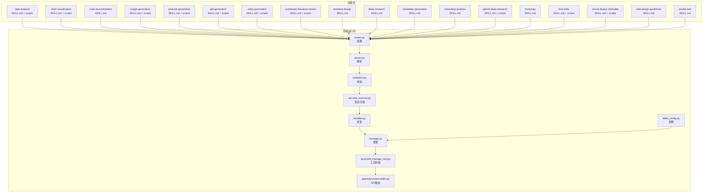
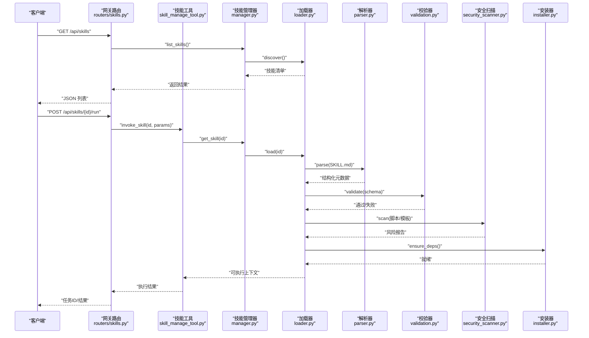
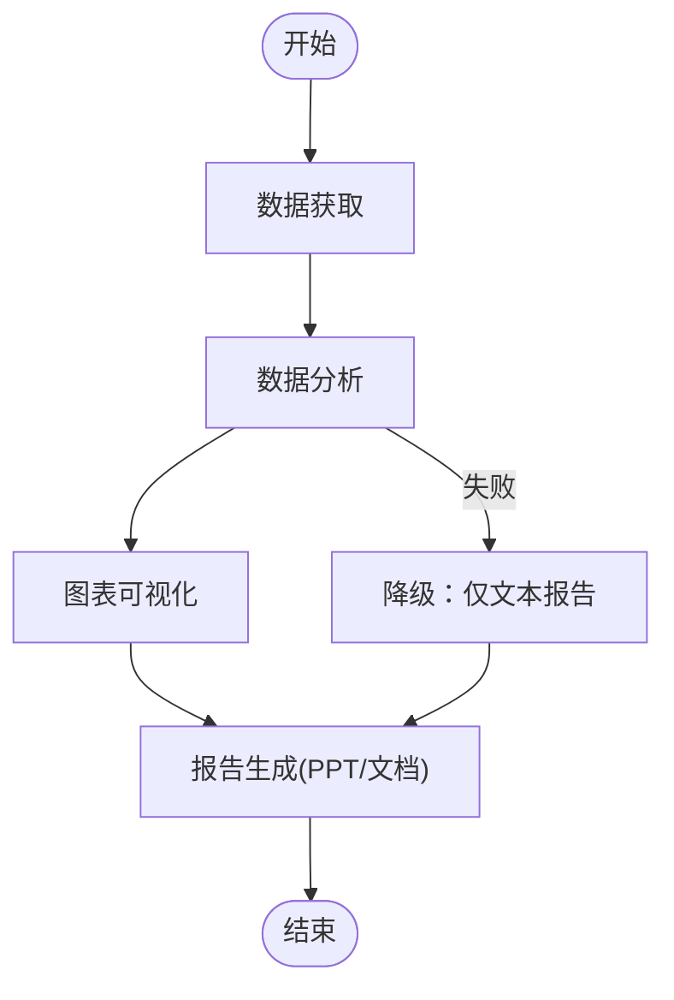
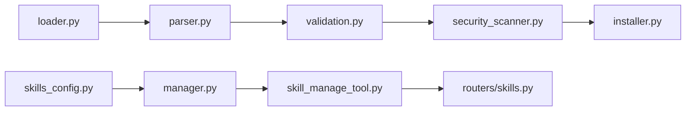

# 内置技能介绍

<cite>
**本文引用的文件**   
- [skills_config.py](file://backend/packages/harness/deerflow/config/skills_config.py)
- [manager.py](file://backend/packages/harness/deerflow/skills/manager.py)
- [loader.py](file://backend/packages/harness/deerflow/skills/loader.py)
- [parser.py](file://backend/packages/harness/deerflow/skills/parser.py)
- [installer.py](file://backend/packages/harness/deerflow/skills/installer.py)
- [validation.py](file://backend/packages/harness/deerflow/skills/validation.py)
- [types.py](file://backend/packages/harness/deerflow/skills/types.py)
- [security_scanner.py](file://backend/packages/harness/deerflow/skills/security_scanner.py)
- [skill_manage_tool.py](file://backend/packages/harness/deerflow/tools/skill_manage_tool.py)
- [tools.py](file://backend/packages/harness/deerflow/tools/tools.py)
- [routers/skills.py](file://backend/app/gateway/routers/skills.py)
- [SKILL.md（数据分析）](file://skills/public/data-analysis/SKILL.md)
- [analyze.py（数据分析脚本）](file://skills/public/data-analysis/scripts/analyze.py)
- [SKILL.md（图表可视化）](file://skills/public/chart-visualization/SKILL.md)
- [generate.js（图表生成脚本）](file://skills/public/chart-visualization/scripts/generate.js)
- [SKILL.md（代码文档生成）](file://skills/public/code-documentation/SKILL.md)
- [SKILL.md（图像生成）](file://skills/public/image-generation/SKILL.md)
- [generate.py（图像生成脚本）](file://skills/public/image-generation/scripts/generate.py)
- [SKILL.md（播客生成）](file://skills/public/podcast-generation/SKILL.md)
- [generate.py（播客生成脚本）](file://skills/public/podcast-generation/scripts/generate.py)
- [SKILL.md（PPT生成）](file://skills/public/ppt-generation/SKILL.md)
- [generate.py（PPT生成脚本）](file://skills/public/ppt-generation/scripts/generate.py)
- [SKILL.md（视频生成）](file://skills/public/video-generation/SKILL.md)
- [generate.py（视频生成脚本）](file://skills/public/video-generation/scripts/generate.py)
- [SKILL.md（学术文献综述）](file://skills/public/systematic-literature-review/SKILL.md)
- [arxiv_search.py（学术搜索脚本）](file://skills/public/systematic-literature-review/scripts/arxiv_search.py)
- [SKILL.md（前端设计）](file://skills/public/frontend-design/SKILL.md)
- [SKILL.md（深度研究）](file://skills/public/deep-research/SKILL.md)
- [SKILL.md（新闻通讯生成）](file://skills/public/newsletter-generation/SKILL.md)
- [SKILL.md（咨询分析）](file://skills/public/consulting-analysis/SKILL.md)
- [SKILL.md（GitHub深度研究）](file://skills/public/github-deep-research/SKILL.md)
- [github_api.py（GitHub API脚本）](file://skills/public/github-deep-research/scripts/github_api.py)
- [SKILL.md（引导模板）](file://skills/public/bootstrap/SKILL.md)
- [SKILL.md（发现技能）](file://skills/public/find-skills/SKILL.md)
- [install-skill.sh（安装脚本）](file://skills/public/find-skills/scripts/install-skill.sh)
- [SKILL.md（Vercel部署认领）](file://skills/public/vercel-deploy-claimable/SKILL.md)
- [deploy.sh（部署脚本）](file://skills/public/vercel-deploy-claimable/scripts/deploy.sh)
- [SKILL.md（Web设计规范）](file://skills/public/web-design-guidelines/SKILL.md)
- [SKILL.md（烟雾测试）](file://.agent/skills/smoke-test/SKILL.md)
</cite>

## 目录
1. [简介](#简介)
2. [项目结构](#项目结构)
3. [核心组件](#核心组件)
4. [架构总览](#架构总览)
5. [详细组件分析](#详细组件分析)
6. [依赖分析](#依赖分析)
7. [性能考虑](#性能考虑)
8. [故障排查指南](#故障排查指南)
9. [结论](#结论)
10. [附录](#附录)

## 简介
本文件系统性介绍 DeerFlow 的“内置技能”能力与生态。DeerFlow 将“技能”作为可组合、可安装、可验证的可执行单元，通过统一的加载、解析、校验与安全扫描流程，在代理工作流中被调度执行。仓库中提供了丰富的预置技能，覆盖数据分析、图表可视化、代码文档生成、图像生成、播客生成、PPT生成、视频生成、学术文献综述、前端设计、深度研究、新闻通讯生成、咨询分析、GitHub 深度研究、引导模板、技能发现与安装、Vercel 部署认领、Web 设计规范等场景。

## 项目结构
- 技能定义位于 skills/public 下，每个技能包含 SKILL.md（描述与参数）、可选 scripts（执行脚本）、templates（模板）、references（参考文档）等。
- 后端提供技能的运行时基础设施：配置、加载、解析、安装、校验、安全扫描、工具集成与网关路由。
- 前端提供技能管理界面与示例数据，便于用户浏览与调用。

图示来源
- [skills_config.py:1-200](file://backend/packages/harness/deerflow/config/skills_config.py#L1-L200)
- [loader.py:1-200](file://backend/packages/harness/deerflow/skills/loader.py#L1-L200)
- [parser.py:1-200](file://backend/packages/harness/deerflow/skills/parser.py#L1-L200)
- [validation.py:1-200](file://backend/packages/harness/deerflow/skills/validation.py#L1-L200)
- [security_scanner.py:1-200](file://backend/packages/harness/deerflow/skills/security_scanner.py#L1-L200)
- [installer.py:1-200](file://backend/packages/harness/deerflow/skills/installer.py#L1-L200)
- [manager.py:1-200](file://backend/packages/harness/deerflow/skills/manager.py#L1-L200)
- [skill_manage_tool.py:1-200](file://backend/packages/harness/deerflow/tools/skill_manage_tool.py#L1-L200)
- [routers/skills.py:1-200](file://backend/app/gateway/routers/skills.py#L1-L200)

章节来源
- [skills_config.py:1-200](file://backend/packages/harness/deerflow/config/skills_config.py#L1-L200)
- [manager.py:1-200](file://backend/packages/harness/deerflow/skills/manager.py#L1-L200)
- [loader.py:1-200](file://backend/packages/harness/deerflow/skills/loader.py#L1-L200)
- [parser.py:1-200](file://backend/packages/harness/deerflow/skills/parser.py#1-L200)
- [installer.py:1-200](file://backend/packages/harness/deerflow/skills/installer.py#L1-L200)
- [validation.py:1-200](file://backend/packages/harness/deerflow/skills/validation.py#L1-L200)
- [types.py:1-200](file://backend/packages/harness/deerflow/skills/types.py#L1-L200)
- [security_scanner.py:1-200](file://backend/packages/harness/deerflow/skills/security_scanner.py#L1-L200)
- [skill_manage_tool.py:1-200](file://backend/packages/harness/deerflow/tools/skill_manage_tool.py#L1-L200)
- [tools.py:1-200](file://backend/packages/harness/deerflow/tools/tools.py#L1-L200)
- [routers/skills.py:1-200](file://backend/app/gateway/routers/skills.py#L1-L200)

## 核心组件
- 配置层：集中管理技能路径、启用开关、版本策略、沙箱隔离等。
- 加载与解析：按约定目录结构发现并解析 SKILL.md，提取元数据、输入输出模式、脚本入口等。
- 校验与安全：对技能清单、脚本、模板进行结构与内容校验，并进行安全扫描。
- 安装器：支持从本地或远程源安装技能，处理依赖与资源。
- 管理器：统一注册、枚举、查询、生命周期管理。
- 工具封装：将技能暴露为工具，供代理在工作流中调用。
- 网关路由：对外提供技能列表、详情、安装、执行等 REST API。

章节来源
- [skills_config.py:1-200](file://backend/packages/harness/deerflow/config/skills_config.py#L1-L200)
- [types.py:1-200](file://backend/packages/harness/deerflow/skills/types.py#L1-L200)
- [loader.py:1-200](file://backend/packages/harness/deerflow/skills/loader.py#L1-L200)
- [parser.py:1-200](file://backend/packages/harness/deerflow/skills/parser.py#L1-L200)
- [validation.py:1-200](file://backend/packages/harness/deerflow/skills/validation.py#L1-L200)
- [security_scanner.py:1-200](file://backend/packages/harness/deerflow/skills/security_scanner.py#L1-L200)
- [installer.py:1-200](file://backend/packages/harness/deerflow/skills/installer.py#L1-L200)
- [manager.py:1-200](file://backend/packages/harness/deerflow/skills/manager.py#L1-L200)
- [skill_manage_tool.py:1-200](file://backend/packages/harness/deerflow/tools/skill_manage_tool.py#L1-L200)
- [routers/skills.py:1-200](file://backend/app/gateway/routers/skills.py#L1-L200)

## 架构总览
下图展示了从外部请求到技能执行的端到端流程，包括 API 路由、工具封装、管理器、解析与校验、安全扫描、安装与执行等环节。

图示来源
- [routers/skills.py:1-200](file://backend/app/gateway/routers/skills.py#L1-L200)
- [skill_manage_tool.py:1-200](file://backend/packages/harness/deerflow/tools/skill_manage_tool.py#L1-L200)
- [manager.py:1-200](file://backend/packages/harness/deerflow/skills/manager.py#L1-L200)
- [loader.py:1-200](file://backend/packages/harness/deerflow/skills/loader.py#L1-L200)
- [parser.py:1-200](file://backend/packages/harness/deerflow/skills/parser.py#L1-L200)
- [validation.py:1-200](file://backend/packages/harness/deerflow/skills/validation.py#L1-L200)
- [security_scanner.py:1-200](file://backend/packages/harness/deerflow/skills/security_scanner.py#L1-L200)
- [installer.py:1-200](file://backend/packages/harness/deerflow/skills/installer.py#L1-L200)

## 详细组件分析

### 技能管理与运行管线
- 配置项：包括技能根目录、启用/禁用列表、版本兼容策略、沙箱隔离选项等。
- 加载流程：扫描目录、读取 SKILL.md、解析字段、构建技能对象。
- 校验规则：必填字段、类型约束、引用完整性、模板存在性。
- 安全扫描：检测危险命令、网络访问、文件写入范围、依赖来源可信度。
- 安装流程：拉取资源、安装依赖、缓存索引、更新元数据。
- 工具封装：将技能以工具形式暴露给代理，支持参数映射、错误降级、超时控制。
- 网关路由：提供技能列表、详情、安装、执行、状态查询接口。

章节来源
- [skills_config.py:1-200](file://backend/packages/harness/deerflow/config/skills_config.py#L1-L200)
- [manager.py:1-200](file://backend/packages/harness/deerflow/skills/manager.py#L1-L200)
- [loader.py:1-200](file://backend/packages/harness/deerflow/skills/loader.py#L1-L200)
- [parser.py:1-200](file://backend/packages/harness/deerflow/skills/parser.py#L1-L200)
- [validation.py:1-200](file://backend/packages/harness/deerflow/skills/validation.py#L1-L200)
- [security_scanner.py:1-200](file://backend/packages/harness/deerflow/skills/security_scanner.py#L1-L200)
- [installer.py:1-200](file://backend/packages/harness/deerflow/skills/installer.py#L1-L200)
- [skill_manage_tool.py:1-200](file://backend/packages/harness/deerflow/tools/skill_manage_tool.py#L1-L200)
- [routers/skills.py:1-200](file://backend/app/gateway/routers/skills.py#L1-L200)

### 预置技能一览与使用说明

#### 数据分析
- 功能特性：基于脚本进行数据清洗、统计分析与结果导出；支持常见数据格式与可视化输出。
- 使用场景：报表生成、指标计算、数据质量检查。
- 配置参数：输入数据路径/URL、分析维度、输出格式、是否开启缓存。
- 输入输出：输入通常为数据集或查询条件；输出为结构化结果或文件链接。
- 调用方法：通过“数据分析”技能工具传入参数，或在网关路由中调用对应接口。
- 示例路径：[SKILL.md（数据分析）](file://skills/public/data-analysis/SKILL.md)、[analyze.py（数据分析脚本）](file://skills/public/data-analysis/scripts/analyze.py)

章节来源
- [SKILL.md（数据分析）:1-200](file://skills/public/data-analysis/SKILL.md#L1-L200)
- [analyze.py（数据分析脚本）:1-200](file://skills/public/data-analysis/scripts/analyze.py#L1-L200)

#### 图表可视化
- 功能特性：提供多种图表类型的生成能力，如饼图、柱状图、雷达图、桑基图等；支持批量生成与模板化定制。
- 使用场景：业务看板、分析报告、演示材料。
- 配置参数：图表类型、数据源、样式主题、尺寸、语言。
- 输入输出：输入为结构化数据与样式配置；输出为图片文件或嵌入资源。
- 调用方法：选择目标图表类型并传入数据，由脚本渲染后返回产物。
- 示例路径：[SKILL.md（图表可视化）](file://skills/public/chart-visualization/SKILL.md)、[generate.js（图表生成脚本）](file://skills/public/chart-visualization/scripts/generate.js)

章节来源
- [SKILL.md（图表可视化）:1-200](file://skills/public/chart-visualization/SKILL.md#L1-L200)
- [generate.js（图表生成脚本）:1-200](file://skills/public/chart-visualization/scripts/generate.js#L1-L200)

#### 代码文档生成
- 功能特性：自动抽取代码注释与结构信息，生成可读的技术文档与 API 说明。
- 使用场景：开源项目文档、内部知识库、变更影响评估。
- 配置参数：源码路径、语言、文档风格、输出目录。
- 输入输出：输入为源代码与可选配置；输出为 Markdown 或 HTML 文档。
- 调用方法：指定源码目录与风格模板，触发文档生成任务。
- 示例路径：[SKILL.md（代码文档生成）](file://skills/public/code-documentation/SKILL.md)

章节来源
- [SKILL.md（代码文档生成）:1-200](file://skills/public/code-documentation/SKILL.md#L1-L200)

#### 图像生成
- 功能特性：根据文本提示或模板生成图像，支持风格与分辨率设置。
- 使用场景：素材创作、营销物料、个性化头像。
- 配置参数：提示词、模型选择、分辨率、数量、种子。
- 输入输出：输入为提示词与参数；输出为图像文件链接或二进制流。
- 调用方法：通过图像生成技能工具提交提示词与参数，异步获取结果。
- 示例路径：[SKILL.md（图像生成）](file://skills/public/image-generation/SKILL.md)、[generate.py（图像生成脚本）](file://skills/public/image-generation/scripts/generate.py)

章节来源
- [SKILL.md（图像生成）:1-200](file://skills/public/image-generation/SKILL.md#L1-L200)
- [generate.py（图像生成脚本）:1-200](file://skills/public/image-generation/scripts/generate.py#L1-L200)

#### 播客生成
- 功能特性：将文本内容转换为音频播客，支持多角色配音与背景音乐。
- 使用场景：知识传播、内容再加工、无障碍阅读。
- 配置参数：文本来源、音色、语速、背景音乐、时长限制。
- 输入输出：输入为文本与音频配置；输出为音频文件。
- 调用方法：提交文本与配置，等待音频生成完成并下载。
- 示例路径：[SKILL.md（播客生成）](file://skills/public/podcast-generation/SKILL.md)、[generate.py（播客生成脚本）](file://skills/public/podcast-generation/scripts/generate.py)

章节来源
- [SKILL.md（播客生成）:1-200](file://skills/public/podcast-generation/SKILL.md#L1-L200)
- [generate.py（播客生成脚本）:1-200](file://skills/public/podcast-generation/scripts/generate.py#L1-L200)

#### PPT 生成
- 功能特性：依据大纲或模板自动生成演示文稿，支持版式与主题切换。
- 使用场景：汇报材料、培训课件、会议资料。
- 配置参数：大纲文本、模板、主题、页数限制、语言。
- 输入输出：输入为大纲与模板；输出为 PPT 文件或在线预览链接。
- 调用方法：上传大纲与模板，触发生成任务并获取产物。
- 示例路径：[SKILL.md（PPT生成）](file://skills/public/ppt-generation/SKILL.md)、[generate.py（PPT生成脚本）](file://skills/public/ppt-generation/scripts/generate.py)

章节来源
- [SKILL.md（PPT生成）:1-200](file://skills/public/ppt-generation/SKILL.md#L1-L200)
- [generate.py（PPT生成脚本）:1-200](file://skills/public/ppt-generation/scripts/generate.py#L1-L200)

#### 视频生成
- 功能特性：结合脚本与模板生成短视频，支持字幕、转场与配乐。
- 使用场景：教程视频、产品宣传、社交媒体内容。
- 配置参数：脚本、模板、分辨率、帧率、时长、字幕语言。
- 输入输出：输入为脚本与媒体资源；输出为视频文件。
- 调用方法：提交脚本与资源，异步生成并返回下载链接。
- 示例路径：[SKILL.md（视频生成）](file://skills/public/video-generation/SKILL.md)、[generate.py（视频生成脚本）](file://skills/public/video-generation/scripts/generate.py)

章节来源
- [SKILL.md（视频生成）:1-200](file://skills/public/video-generation/SKILL.md#L1-L200)
- [generate.py（视频生成脚本）:1-200](file://skills/public/video-generation/scripts/generate.py#L1-L200)

#### 学术文献综述
- 功能特性：自动化检索与整理学术文献，生成综述报告与参考文献列表。
- 使用场景：科研立项、论文背景调研、技术趋势分析。
- 配置参数：关键词、数据库来源、时间范围、引用格式。
- 输入输出：输入为检索条件；输出为综述文档与引用列表。
- 调用方法：设定检索条件与格式，执行搜索与汇总。
- 示例路径：[SKILL.md（学术文献综述）](file://skills/public/systematic-literature-review/SKILL.md)、[arxiv_search.py（学术搜索脚本）](file://skills/public/systematic-literature-review/scripts/arxiv_search.py)

章节来源
- [SKILL.md（学术文献综述）:1-200](file://skills/public/systematic-literature-review/SKILL.md#L1-L200)
- [arxiv_search.py（学术搜索脚本）:1-200](file://skills/public/systematic-literature-review/scripts/arxiv_search.py#L1-L200)

#### 前端设计
- 功能特性：提供页面布局建议、组件规范与交互模式指导。
- 使用场景：UI 原型设计、设计规范制定、团队对齐。
- 配置参数：目标平台、设计风格、品牌色板、响应式要求。
- 输入输出：输入为需求描述与约束；输出为设计建议与参考样例。
- 调用方法：提交需求与约束，获取设计建议。
- 示例路径：[SKILL.md（前端设计）](file://skills/public/frontend-design/SKILL.md)

章节来源
- [SKILL.md（前端设计）:1-200](file://skills/public/frontend-design/SKILL.md#L1-L200)

#### 深度研究
- 功能特性：围绕主题进行多维度信息收集、对比与总结，形成研究报告。
- 使用场景：市场洞察、竞品分析、技术选型。
- 配置参数：主题、信息来源、深度级别、输出格式。
- 输入输出：输入为主题与约束；输出为结构化报告。
- 调用方法：设定主题与深度，启动研究流程。
- 示例路径：[SKILL.md（深度研究）](file://skills/public/deep-research/SKILL.md)

章节来源
- [SKILL.md（深度研究）:1-200](file://skills/public/deep-research/SKILL.md#L1-L200)

#### 新闻通讯生成
- 功能特性：聚合信息源，生成周期性新闻简报。
- 使用场景：企业内刊、行业周报、个人资讯订阅。
- 配置参数：信息源、主题分类、篇幅限制、语言。
- 输入输出：输入为信息源与偏好；输出为通讯稿。
- 调用方法：配置信息源与偏好，定时或手动触发生成。
- 示例路径：[SKILL.md（新闻通讯生成）](file://skills/public/newsletter-generation/SKILL.md)

章节来源
- [SKILL.md（新闻通讯生成）:1-200](file://skills/public/newsletter-generation/SKILL.md#L1-L200)

#### 咨询分析
- 功能特性：结构化问题拆解、假设驱动分析与方案评估。
- 使用场景：商业决策、战略规划、风险评估。
- 配置参数：问题框架、数据来源、评估指标、输出模板。
- 输入输出：输入为问题与数据；输出为咨询报告。
- 调用方法：定义问题框架与指标，生成分析报告。
- 示例路径：[SKILL.md（咨询分析）](file://skills/public/consulting-analysis/SKILL.md)

章节来源
- [SKILL.md（咨询分析）:1-200](file://skills/public/consulting-analysis/SKILL.md#L1-L200)

#### GitHub 深度研究
- 功能特性：抓取仓库信息、贡献者画像、Issue/PR 趋势，生成研究报告。
- 使用场景：开源治理、技术审计、社区健康度评估。
- 配置参数：仓库地址、时间窗口、指标集合、输出格式。
- 输入输出：输入为仓库与指标；输出为研究报告。
- 调用方法：提交仓库与指标，执行抓取与分析。
- 示例路径：[SKILL.md（GitHub深度研究）](file://skills/public/github-deep-research/SKILL.md)、[github_api.py（GitHub API脚本）](file://skills/public/github-deep-research/scripts/github_api.py)

章节来源
- [SKILL.md（GitHub深度研究）:1-200](file://skills/public/github-deep-research/SKILL.md#L1-L200)
- [github_api.py（GitHub API脚本）:1-200](file://skills/public/github-deep-research/scripts/github_api.py#L1-L200)

#### 引导模板
- 功能特性：提供对话引导与灵魂模板，帮助快速构建角色与任务。
- 使用场景：新手上手、团队标准化、快速原型。
- 配置参数：角色设定、任务目标、输出风格。
- 输入输出：输入为角色与任务；输出为引导内容与示例。
- 调用方法：选择模板并填充参数，生成引导内容。
- 示例路径：[SKILL.md（引导模板）](file://skills/public/bootstrap/SKILL.md)

章节来源
- [SKILL.md（引导模板）:1-200](file://skills/public/bootstrap/SKILL.md#L1-L200)

#### 发现技能
- 功能特性：搜索与安装新技能，简化扩展生态接入。
- 使用场景：按需扩展、团队协作共享、持续集成。
- 配置参数：技能名称、来源地址、安装目标。
- 输入输出：输入为搜索条件与安装目标；输出为安装结果与状态。
- 调用方法：执行搜索与安装流程，查看安装日志。
- 示例路径：[SKILL.md（发现技能）](file://skills/public/find-skills/SKILL.md)、[install-skill.sh（安装脚本）](file://skills/public/find-skills/scripts/install-skill.sh)

章节来源
- [SKILL.md（发现技能）:1-200](file://skills/public/find-skills/SKILL.md#L1-L200)
- [install-skill.sh（安装脚本）:1-200](file://skills/public/find-skills/scripts/install-skill.sh#L1-L200)

#### Vercel 部署认领
- 功能特性：协助完成 Vercel 项目的部署与认领流程。
- 使用场景：CI/CD 集成、环境初始化、权限绑定。
- 配置参数：项目标识、令牌、分支、环境变量。
- 输入输出：输入为部署配置；输出为部署状态与链接。
- 调用方法：提交部署配置，跟踪部署进度。
- 示例路径：[SKILL.md（Vercel部署认领）](file://skills/public/vercel-deploy-claimable/SKILL.md)、[deploy.sh（部署脚本）](file://skills/public/vercel-deploy-claimable/scripts/deploy.sh)

章节来源
- [SKILL.md（Vercel部署认领）:1-200](file://skills/public/vercel-deploy-claimable/SKILL.md#L1-L200)
- [deploy.sh（部署脚本）:1-200](file://skills/public/vercel-deploy-claimable/scripts/deploy.sh#L1-L200)

#### Web 设计规范
- 功能特性：提供 Web 设计与开发的最佳实践与规范参考。
- 使用场景：团队规范制定、评审标准、新人培训。
- 配置参数：适用平台、规范版本、输出格式。
- 输入输出：输入为平台与版本；输出为规范文档。
- 调用方法：选择平台与版本，生成规范文档。
- 示例路径：[SKILL.md（Web设计规范）](file://skills/public/web-design-guidelines/SKILL.md)

章节来源
- [SKILL.md（Web设计规范）:1-200](file://skills/public/web-design-guidelines/SKILL.md#L1-L200)

#### 烟雾测试
- 功能特性：用于快速验证环境与基础能力的连通性与可用性。
- 使用场景：部署后自检、回归测试、监控告警。
- 配置参数：测试范围、超时、重试次数。
- 输入输出：输入为测试配置；输出为测试结果与日志。
- 调用方法：执行烟雾测试，查看结果与诊断信息。
- 示例路径：[SKILL.md（烟雾测试）](file://.agent/skills/smoke-test/SKILL.md)

章节来源
- [SKILL.md（烟雾测试）:1-200](file://.agent/skills/smoke-test/SKILL.md#L1-L200)

### 技能协作与组合使用
- 典型流水线：数据获取 → 数据分析 → 图表可视化 → 报告生成（PPT/文档）。
- 跨技能编排：通过代理工作流串联多个技能，实现端到端自动化。
- 参数传递：上游技能输出作为下游技能输入，确保数据结构一致。
- 错误回退：当某环节失败时，采用降级策略（如跳过可视化、仅生成文本）。
- 并发与缓存：对独立子任务并行执行，并对中间结果进行缓存以提升性能。

[此图为概念流程图，不直接映射具体源码文件]

## 依赖分析
- 模块耦合：管理器依赖加载器、解析器、校验器、安全扫描器与安装器；工具封装依赖管理器；网关路由依赖工具封装。
- 外部依赖：各技能脚本可能依赖第三方库或外部服务（如图表渲染引擎、音视频编解码器、网络 API）。
- 潜在循环：当前设计避免循环依赖，所有核心模块单向依赖基础设施。
- 接口契约：SKILL.md 定义输入输出模式，解析器与校验器据此建立强契约。

图示来源
- [skills_config.py:1-200](file://backend/packages/harness/deerflow/config/skills_config.py#L1-L200)
- [manager.py:1-200](file://backend/packages/harness/deerflow/skills/manager.py#L1-L200)
- [loader.py:1-200](file://backend/packages/harness/deerflow/skills/loader.py#L1-L200)
- [parser.py:1-200](file://backend/packages/harness/deerflow/skills/parser.py#L1-L200)
- [validation.py:1-200](file://backend/packages/harness/deerflow/skills/validation.py#L1-L200)
- [security_scanner.py:1-200](file://backend/packages/harness/deerflow/skills/security_scanner.py#L1-L200)
- [installer.py:1-200](file://backend/packages/harness/deerflow/skills/installer.py#L1-L200)
- [skill_manage_tool.py:1-200](file://backend/packages/harness/deerflow/tools/skill_manage_tool.py#L1-L200)
- [routers/skills.py:1-200](file://backend/app/gateway/routers/skills.py#L1-L200)

章节来源
- [skills_config.py:1-200](file://backend/packages/harness/deerflow/config/skills_config.py#L1-L200)
- [manager.py:1-200](file://backend/packages/harness/deerflow/skills/manager.py#L1-L200)
- [loader.py:1-200](file://backend/packages/harness/deerflow/skills/loader.py#L1-L200)
- [parser.py:1-200](file://backend/packages/harness/deerflow/skills/parser.py#L1-L200)
- [validation.py:1-200](file://backend/packages/harness/deerflow/skills/validation.py#L1-L200)
- [security_scanner.py:1-200](file://backend/packages/harness/deerflow/skills/security_scanner.py#L1-L200)
- [installer.py:1-200](file://backend/packages/harness/deerflow/skills/installer.py#L1-L200)
- [skill_manage_tool.py:1-200](file://backend/packages/harness/deerflow/tools/skill_manage_tool.py#L1-L200)
- [routers/skills.py:1-200](file://backend/app/gateway/routers/skills.py#L1-L200)

## 性能考虑
- 缓存策略：对中间结果（如分析结果、图表文件）进行缓存，减少重复计算。
- 并发执行：对独立子任务并行处理，提升吞吐。
- 资源限制：为长耗时任务设置超时与内存上限，防止资源耗尽。
- 增量更新：对大文档或大数据集采用增量处理，降低 IO 压力。
- 批处理：批量生成图表或报告，合并任务以减少开销。

[本节为通用性能建议，不直接分析具体文件]

## 故障排查指南
- 常见问题
  - 技能未加载：检查技能目录结构与 SKILL.md 是否存在，确认配置中的路径与启用开关。
  - 解析失败：核对 SKILL.md 字段是否符合校验规则，修复缺失或类型错误。
  - 安全扫描拦截：审查脚本与模板，移除危险命令或不信任的外部依赖。
  - 安装失败：检查网络连通性与依赖源可用性，确认权限与磁盘空间。
  - 执行超时：调整超时配置，优化脚本逻辑或拆分任务。
- 定位步骤
  - 查看网关路由日志，确认请求与响应。
  - 检查管理器与加载器的调试输出，定位解析与校验阶段。
  - 审查安全扫描报告，修正风险点。
  - 查看安装器日志，确认依赖安装状态。
- 恢复措施
  - 清理缓存并重新加载技能。
  - 降级执行（如跳过可视化），保证主流程可用。
  - 回滚至上一稳定版本，必要时重建环境。

章节来源
- [routers/skills.py:1-200](file://backend/app/gateway/routers/skills.py#L1-L200)
- [manager.py:1-200](file://backend/packages/harness/deerflow/skills/manager.py#L1-L200)
- [loader.py:1-200](file://backend/packages/harness/deerflow/skills/loader.py#L1-L200)
- [validation.py:1-200](file://backend/packages/harness/deerflow/skills/validation.py#L1-L200)
- [security_scanner.py:1-200](file://backend/packages/harness/deerflow/skills/security_scanner.py#L1-L200)
- [installer.py:1-200](file://backend/packages/harness/deerflow/skills/installer.py#L1-L200)

## 结论
DeerFlow 的内置技能体系以“可组合、可验证、可安装”为核心设计理念，通过统一的运行时基础设施支撑多样化应用场景。预置技能覆盖了从数据处理到多媒体生成的广泛领域，配合代理工作流可实现端到端的自动化流水线。建议在工程中遵循规范化的 SKILL.md 定义、强化安全扫描与校验、合理配置缓存与并发，以获得稳定高效的体验。

[本节为总结性内容，不直接分析具体文件]

## 附录
- 版本兼容性与更新策略
  - 版本策略：SKILL.md 声明兼容范围，解析器与校验器据此判断是否可用。
  - 更新流程：通过“发现技能”与“安装器”拉取新版本，校验通过后替换旧版本。
  - 回滚机制：保留历史版本快照，出现异常时可快速回滚。
  - 灰度发布：对新版本进行小流量验证，确认稳定后再全量推广。

[本节为通用策略说明，不直接分析具体文件]