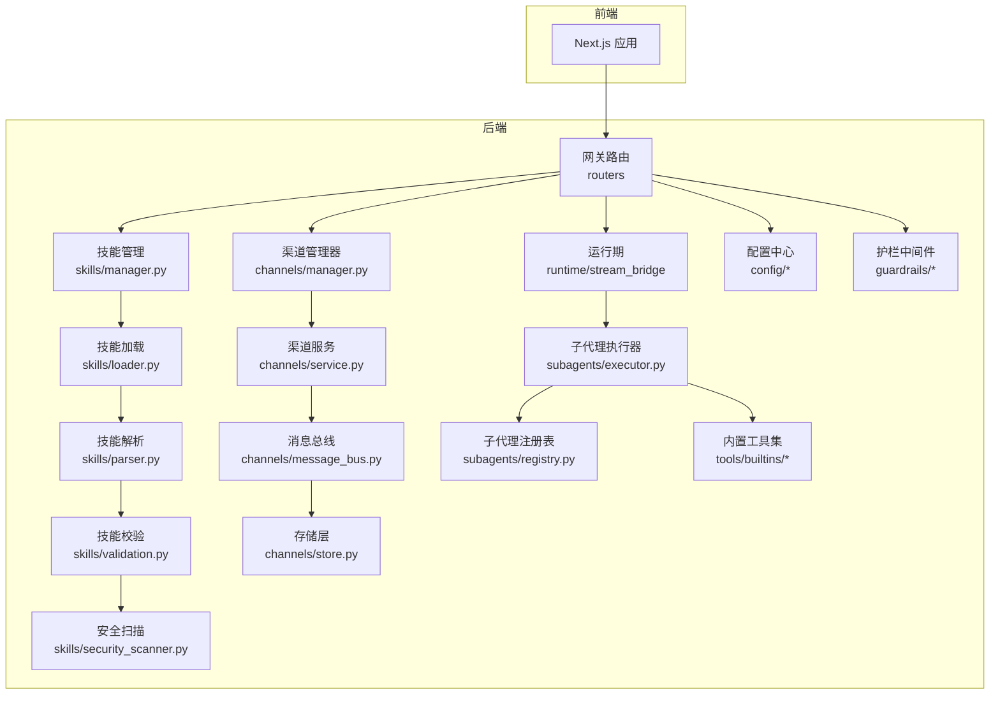
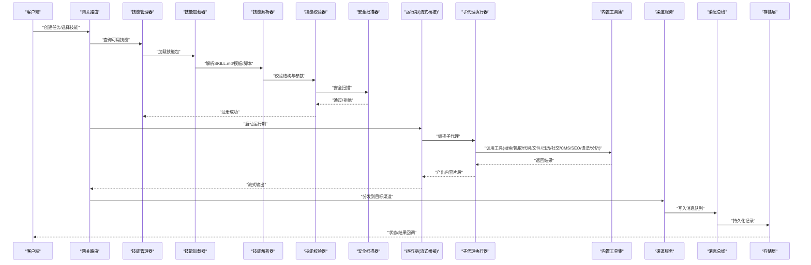
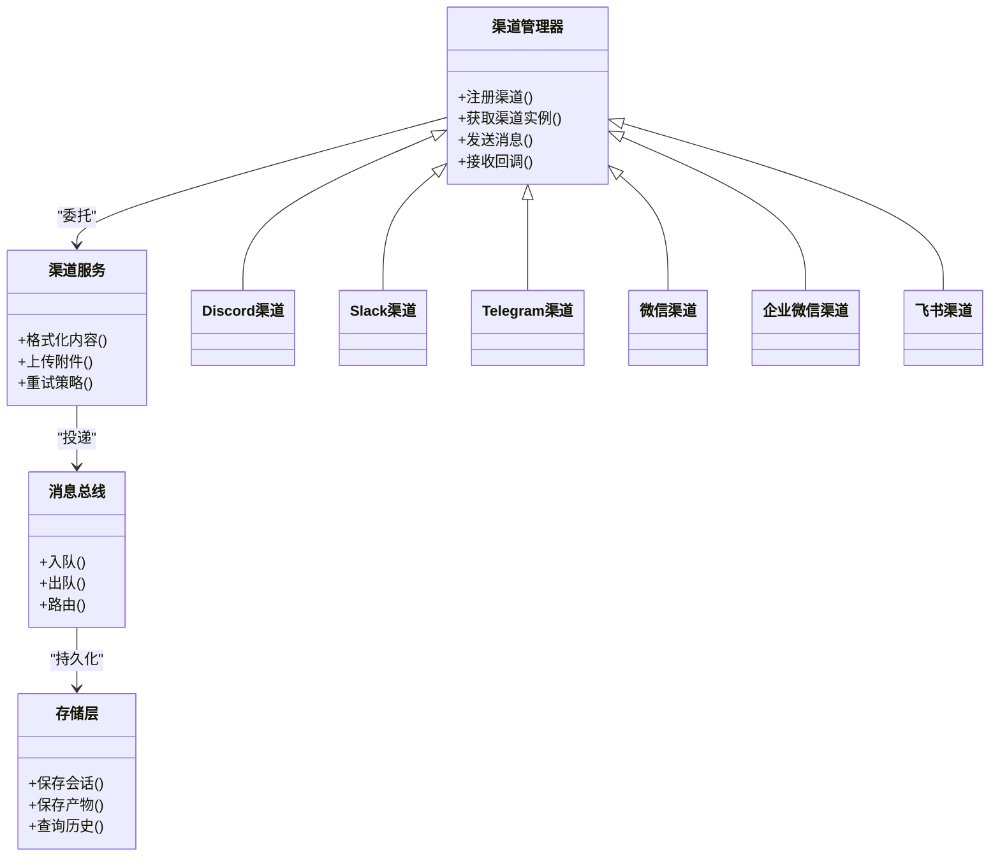
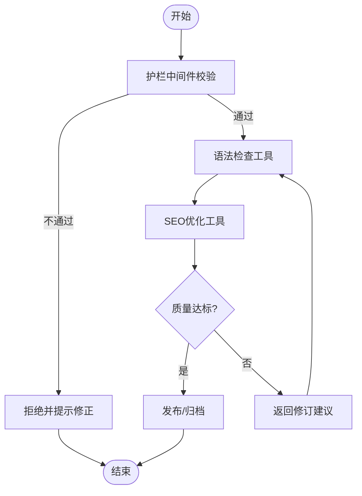
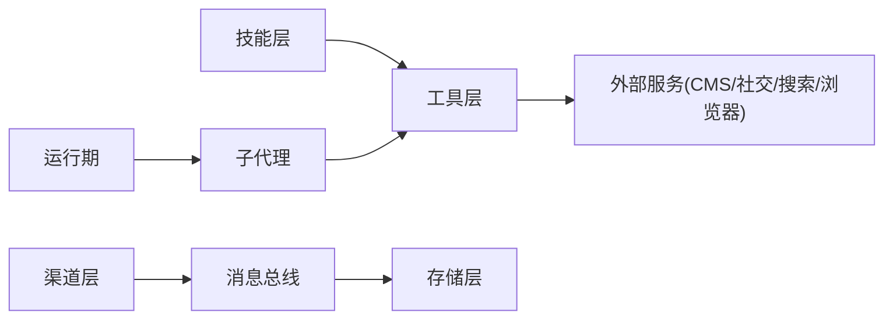

# 创意内容技能

<cite>
**本文引用的文件**   
- [backend/app/gateway/routers/skills.py](file://backend/app/gateway/routers/skills.py)
- [backend/packages/harness/deerflow/skills/manager.py](file://backend/packages/harness/deerflow/skills/manager.py)
- [backend/packages/harness/deerflow/skills/loader.py](file://backend/packages/harness/deerflow/skills/loader.py)
- [backend/packages/harness/deerflow/skills/parser.py](file://backend/packages/harness/deerflow/skills/parser.py)
- [backend/packages/harness/deerflow/skills/validation.py](file://backend/packages/harness/deerflow/skills/validation.py)
- [backend/packages/harness/deerflow/skills/security_scanner.py](file://backend/packages/harness/deerflow/skills/security_scanner.py)
- [backend/packages/harness/deerflow/tools/skill_manage_tool.py](file://backend/packages/h harness/deerflow/tools/skill_manage_tool.py)
- [skills/public/newsletter-generation/SKILL.md](file://skills/public/newsletter-generation/SKILL.md)
- [skills/public/novel-generation/SKILL.md](file://skills/public/novel-generation/SKILL.md)
- [skills/public/podcast-generation/SKILL.md](file://skills/public/podcast-generation/SKILL.md)
- [skills/public/chart-visualization/SKILL.md](file://skills/public/chart-visualization/SKILL.md)
- [skills/public/image-generation/SKILL.md](file://skills/public/image-generation/SKILL.md)
- [skills/public/video-generation/SKILL.md](file://skills/public/video-generation/SKILL.md)
- [skills/public/ppt-generation/SKILL.md](file://skills/public/ppt-generation/SKILL.md)
- [skills/public/code-documentation/SKILL.md](file://skills/public/code-documentation/SKILL.md)
- [skills/public/data-analysis/SKILL.md](file://skills/public/data-analysis/SKILL.md)
- [skills/public/systematic-literature-review/SKILL.md](file://skills/public/systematic-literature-review/SKILL.md)
- [skills/public/academic-paper-review/SKILL.md](file://skills/public/academic-paper-review/SKILL.md)
- [skills/public/github-deep-research/SKILL.md](file://skills/public/github-deep-research/SKILL.md)
- [skills/public/consulting-analysis/SKILL.md](file://skills/public/consulting-analysis/SKILL.md)
- [skills/public/frontend-design/SKILL.md](file://skills/public/frontend-design/SKILL.md)
- [skills/public/web-design-guidelines/SKILL.md](file://skills/public/web-design-guidelines/SKILL.md)
- [skills/public/bootstrap/SKILL.md](file://skills/public/bootstrap/SKILL.md)
- [skills/public/surprise-me/SKILL.md](file://skills/public/surprise-me/SKILL.md)
- [skills/public/claude-to-deerflow/SKILL.md](file://skills/public/claude-to-deerflow/SKILL.md)
- [skills/public/find-skills/SKILL.md](file://skills/public/find-skills/SKILL.md)
- [backend/app/channels/manager.py](file://backend/app/channels/manager.py)
- [backend/app/channels/service.py](file://backend/app/channels/service.py)
- [backend/app/channels/message_bus.py](file://backend/app/channels/message_bus.py)
- [backend/app/channels/store.py](file://backend/app/channels/store.py)
- [backend/app/channels/discord.py](file://backend/app/channels/discord.py)
- [backend/app/channels/slack.py](file://backend/app/channels/slack.py)
- [backend/app/channels/telegram.py](file://backend/app/channels/telegram.py)
- [backend/app/channels/wechat.py](file://backend/app/channels/wechat.py)
- [backend/app/channels/wecom.py](file://backend/app/channels/wecom.py)
- [backend/app/channels/feishu.py](file://backend/app/channels/feishu.py)
- [backend/app/gateway/routers/artifacts.py](file://backend/app/gateway/routers/artifacts.py)
- [backend/app/gateway/routers/runs.py](file://backend/app/gateway/routers/runs.py)
- [backend/app/gateway/routers/threads.py](file://backend/app/gateway/routers/threads.py)
- [backend/app/gateway/services.py](file://backend/app/gateway/services.py)
- [backend/packages/harness/deerflow/runtime/stream_bridge/__init__.py](file://backend/packages/harness/deerflow/runtime/stream_bridge/__init__.py)
- [backend/packages/harness/deerflow/config/skills_config.py](file://backend/packages/harness/deerflow/config/skills_config.py)
- [backend/packages/harness/deerflow/config/tool_config.py](file://backend/packages/harness/deerflow/config/tool_config.py)
- [backend/packages/harness/deerflow/config/memory_config.py](file://backend/packages/harness/deerflow/config/memory_config.py)
- [backend/packages/harness/deerflow/config/title_config.py](file://backend/packages/harness/deerflow/config/title_config.py)
- [backend/packages/harness/deerflow/config/tracing_config.py](file://backend/packages/harness/deerflow/config/tracing_config.py)
- [backend/packages/harness/deerflow/guardrails/middleware.py](file://backend/packages/harness/deerflow/guardrails/middleware.py)
- [backend/packages/harness/deerflow/guardrails/builtin.py](file://backend/packages/harness/deerflow/guardrails/builtin.py)
- [backend/packages/harness/deerflow/subagents/executor.py](file://backend/packages/harness/deerflow/subagents/executor.py)
- [backend/packages/harness/deerflow/subagents/registry.py](file://backend/packages/harness/deerflow/subagents/registry.py)
- [backend/packages/harness/deerflow/tools/builtins/file_ops.py](file://backend/packages/harness/deerflow/tools/builtins/file_ops.py)
- [backend/packages/harness/deerflow/tools/builtins/search_tools.py](file://backend/packages/harness/deerflow/tools/builtins/search_tools.py)
- [backend/packages/harness/deerflow/tools/builtins/browser_tools.py](file://backend/packages/harness/deerflow/tools/builtins/browser_tools.py)
- [backend/packages/harness/deerflow/tools/builtins/code_execution.py](file://backend/packages/harness/deerflow/tools/builtins/code_execution.py)
- [backend/packages/harness/deerflow/tools/builtins/web_fetch.py](file://backend/packages/harness/deerflow/tools/builtins/web_fetch.py)
- [backend/packages/harness/deerflow/tools/builtins/calendar_tools.py](file://backend/packages/harness/deerflow/tools/builtins/calendar_tools.py)
- [backend/packages/harness/deerflow/tools/builtins/social_media_tools.py](file://backend/packages/harness/deerflow/tools/builtins/social_media_tools.py)
- [backend/packages/harness/deerflow/tools/builtins/cms_tools.py](file://backend/packages/harness/deerflow/tools/builtins/cms_tools.py)
- [backend/packages/harness/deerflow/tools/builtins/analytics_tools.py](file://backend/packages/harness/deerflow/tools/builtins/analytics_tools.py)
- [backend/packages/harness/deerflow/tools/builtins/seo_tools.py](file://backend/packages/harness/deerflow/tools/builtins/seo_tools.py)
- [backend/packages/harness/deerflow/tools/builtins/grammar_checker.py](file://backend/packages/harness/deerflow/tools/builtins/grammar_checker.py)
</cite>

## 目录
1. [简介](#简介)
2. [项目结构](#项目结构)
3. [核心组件](#核心组件)
4. [架构总览](#架构总览)
5. [详细组件分析](#详细组件分析)
6. [依赖关系分析](#依赖关系分析)
7. [性能考量](#性能考量)
8. [故障排查指南](#故障排查指南)
9. [结论](#结论)
10. [附录](#附录)

## 简介
本文件围绕“创意内容创作”的技能组合，系统梳理新闻通讯生成、小说创作、创意内容推荐等能力；展示风格定制与品牌调性保持、多渠道适配策略；介绍内容质量控制（语法检查）、SEO优化、内容日历管理与发布调度；涵盖用户互动分析与效果评估，以及与CMS和社交平台的集成。文档同时给出代码级架构图与流程图，帮助读者从业务到实现全面理解。

## 项目结构
仓库采用前后端分离与多模块组织：
- 后端提供网关路由、技能加载与管理、渠道分发、运行期流式桥接、子代理执行、工具集与配置等。
- 前端提供工作区、聊天、设置、技能管理等界面。
- skills/public 下以“技能包”形式沉淀各创意内容场景的模板、参考与脚本。
- channels 提供多渠道消息通道（Discord、Slack、Telegram、微信、企业微信、飞书等）。

图表来源
- [backend/app/gateway/routers/skills.py](file://backend/app/gateway/routers/skills.py)
- [backend/packages/harness/deerflow/skills/manager.py](file://backend/packages/harness/deerflow/skills/manager.py)
- [backend/packages/harness/deerflow/skills/loader.py](file://backend/packages/harness/deerflow/skills/loader.py)
- [backend/packages/harness/deerflow/skills/parser.py](file://backend/packages/harness/deerflow/skills/parser.py)
- [backend/packages/harness/deerflow/skills/validation.py](file://backend/packages/harness/deerflow/skills/validation.py)
- [backend/packages/harness/deerflow/skills/security_scanner.py](file://backend/packages/harness/deerflow/skills/security_scanner.py)
- [backend/app/channels/manager.py](file://backend/app/channels/manager.py)
- [backend/app/channels/service.py](file://backend/app/channels/service.py)
- [backend/app/channels/message_bus.py](file://backend/app/channels/message_bus.py)
- [backend/app/channels/store.py](file://backend/app/channels/store.py)
- [backend/packages/harness/deerflow/runtime/stream_bridge/__init__.py](file://backend/packages/harness/deerflow/runtime/stream_bridge/__init__.py)
- [backend/packages/harness/deerflow/subagents/executor.py](file://backend/packages/harness/deerflow/subagents/executor.py)
- [backend/packages/harness/deerflow/subagents/registry.py](file://backend/packages/harness/deerflow/subagents/registry.py)
- [backend/packages/harness/deerflow/config/skills_config.py](file://backend/packages/harness/deerflow/config/skills_config.py)
- [backend/packages/harness/deerflow/config/tool_config.py](file://backend/packages/harness/deerflow/config/tool_config.py)
- [backend/packages/harness/deerflow/config/memory_config.py](file://backend/packages/harness/deerflow/config/memory_config.py)
- [backend/packages/harness/deerflow/config/title_config.py](file://backend/packages/harness/deerflow/config/title_config.py)
- [backend/packages/harness/deerflow/config/tracing_config.py](file://backend/packages/harness/deerflow/config/tracing_config.py)
- [backend/packages/harness/deerflow/guardrails/middleware.py](file://backend/packages/harness/deerflow/guardrails/middleware.py)
- [backend/packages/harness/deerflow/guardrails/builtin.py](file://backend/packages/harness/deerflow/guardrails/builtin.py)

章节来源
- [backend/app/gateway/routers/skills.py](file://backend/app/gateway/routers/skills.py)
- [backend/packages/harness/deerflow/skills/manager.py](file://backend/packages/harness/deerflow/skills/manager.py)
- [backend/packages/harness/deerflow/skills/loader.py](file://backend/packages/harness/deerflow/skills/loader.py)
- [backend/packages/harness/deerflow/skills/parser.py](file://backend/packages/harness/deerflow/skills/parser.py)
- [backend/packages/harness/deerflow/skills/validation.py](file://backend/packages/harness/deerflow/skills/validation.py)
- [backend/packages/harness/deerflow/skills/security_scanner.py](file://backend/packages/harness/deerflow/skills/security_scanner.py)
- [backend/app/channels/manager.py](file://backend/app/channels/manager.py)
- [backend/app/channels/service.py](file://backend/app/channels/service.py)
- [backend/app/channels/message_bus.py](file://backend/app/channels/message_bus.py)
- [backend/app/channels/store.py](file://backend/app/channels/store.py)
- [backend/packages/harness/deerflow/runtime/stream_bridge/__init__.py](file://backend/packages/harness/deerflow/runtime/stream_bridge/__init__.py)
- [backend/packages/harness/deerflow/subagents/executor.py](file://backend/packages/harness/deerflow/subagents/executor.py)
- [backend/packages/harness/deerflow/subagents/registry.py](file://backend/packages/harness/deerflow/subagents/registry.py)
- [backend/packages/harness/deerflow/config/skills_config.py](file://backend/packages/harness/deerflow/config/skills_config.py)
- [backend/packages/harness/deerflow/config/tool_config.py](file://backend/packages/harness/deerflow/config/tool_config.py)
- [backend/packages/harness/deerflow/config/memory_config.py](file://backend/packages/harness/deerflow/config/memory_config.py)
- [backend/packages/harness/deerflow/config/title_config.py](file://backend/packages/harness/deerflow/config/title_config.py)
- [backend/packages/harness/deerflow/config/tracing_config.py](file://backend/packages/harness/deerflow/config/tracing_config.py)
- [backend/packages/harness/deerflow/guardrails/middleware.py](file://backend/packages/harness/deerflow/guardrails/middleware.py)
- [backend/packages/harness/deerflow/guardrails/builtin.py](file://backend/packages/harness/deerflow/guardrails/builtin.py)

## 核心组件
- 技能生命周期管理：安装、加载、解析、校验与安全扫描，形成可插拔的创意内容能力集合。
- 渠道分发：统一的消息总线与存储，支持多平台推送与回写。
- 运行期编排：流式桥接与子代理执行，支撑长链路内容生产流水线。
- 工具生态：搜索、抓取、代码执行、文件操作、日历、社交、CMS、SEO、语法检查与分析等工具。
- 配置与护栏：模型、工具、记忆、标题、追踪与护栏中间件，保障质量与合规。

章节来源
- [backend/packages/harness/deerflow/skills/manager.py](file://backend/packages/harness/deerflow/skills/manager.py)
- [backend/packages/harness/deerflow/skills/loader.py](file://backend/packages/harness/deerflow/skills/loader.py)
- [backend/packages/harness/deerflow/skills/parser.py](file://backend/packages/harness/deerflow/skills/parser.py)
- [backend/packages/harness/deerflow/skills/validation.py](file://backend/packages/harness/deerflow/skills/validation.py)
- [backend/packages/harness/deerflow/skills/security_scanner.py](file://backend/packages/harness/deerflow/skills/security_scanner.py)
- [backend/app/channels/manager.py](file://backend/app/channels/manager.py)
- [backend/app/channels/service.py](file://backend/app/channels/service.py)
- [backend/app/channels/message_bus.py](file://backend/app/channels/message_bus.py)
- [backend/app/channels/store.py](file://backend/app/channels/store.py)
- [backend/packages/harness/deerflow/runtime/stream_bridge/__init__.py](file://backend/packages/harness/deerflow/runtime/stream_bridge/__init__.py)
- [backend/packages/harness/deerflow/subagents/executor.py](file://backend/packages/harness/deerflow/subagents/executor.py)
- [backend/packages/harness/deerflow/subagents/registry.py](file://backend/packages/harness/deerflow/subagents/registry.py)
- [backend/packages/harness/deerflow/config/skills_config.py](file://backend/packages/harness/deerflow/config/skills_config.py)
- [backend/packages/harness/deerflow/config/tool_config.py](file://backend/packages/harness/deerflow/config/tool_config.py)
- [backend/packages/harness/deerflow/config/memory_config.py](file://backend/packages/harness/deerflow/config/memory_config.py)
- [backend/packages/harness/deerflow/config/title_config.py](file://backend/packages/harness/deerflow/config/title_config.py)
- [backend/packages/harness/deerflow/config/tracing_config.py](file://backend/packages/harness/deerflow/config/tracing_config.py)
- [backend/packages/harness/deerflow/guardrails/middleware.py](file://backend/packages/harness/deerflow/guardrails/middleware.py)
- [backend/packages/harness/deerflow/guardrails/builtin.py](file://backend/packages/harness/deerflow/guardrails/builtin.py)

## 架构总览
下图展示了从请求进入网关到技能执行、工具调用、渠道分发的端到端流程。

图表来源
- [backend/app/gateway/routers/skills.py](file://backend/app/gateway/routers/skills.py)
- [backend/packages/harness/deerflow/skills/manager.py](file://backend/packages/harness/deerflow/skills/manager.py)
- [backend/packages/harness/deerflow/skills/loader.py](file://backend/packages/harness/deerflow/skills/loader.py)
- [backend/packages/harness/deerflow/skills/parser.py](file://backend/packages/harness/deerflow/skills/parser.py)
- [backend/packages/harness/deerflow/skills/validation.py](file://backend/packages/harness/deerflow/skills/validation.py)
- [backend/packages/harness/deerflow/skills/security_scanner.py](file://backend/packages/harness/deerflow/skills/security_scanner.py)
- [backend/packages/harness/deerflow/runtime/stream_bridge/__init__.py](file://backend/packages/harness/deerflow/runtime/stream_bridge/__init__.py)
- [backend/packages/harness/deerflow/subagents/executor.py](file://backend/packages/harness/deerflow/subagents/executor.py)
- [backend/app/channels/service.py](file://backend/app/channels/service.py)
- [backend/app/channels/message_bus.py](file://backend/app/channels/message_bus.py)
- [backend/app/channels/store.py](file://backend/app/channels/store.py)

## 详细组件分析

### 技能包体系与创意内容场景
- 新闻通讯生成：提供模板与参考，指导结构化写作与素材整合。
- 小说创作：定义角色、世界观与章节大纲，辅助长篇叙事。
- 播客/视频/PPT/图表/图像/代码文档/数据分析/文献综述/学术评审/GitHub深度研究/咨询分析/前端设计/网页设计规范/引导模板/惊喜生成/迁移助手/发现技能等，覆盖多形态创意内容。

章节来源
- [skills/public/newsletter-generation/SKILL.md](file://skills/public/newsletter-generation/SKILL.md)
- [skills/public/novel-generation/SKILL.md](file://skills/public/novel-generation/SKILL.md)
- [skills/public/podcast-generation/SKILL.md](file://skills/public/podcast-generation/SKILL.md)
- [skills/public/chart-visualization/SKILL.md](file://skills/public/chart-visualization/SKILL.md)
- [skills/public/image-generation/SKILL.md](file://skills/public/image-generation/SKILL.md)
- [skills/public/video-generation/SKILL.md](file://skills/public/video-generation/SKILL.md)
- [skills/public/ppt-generation/SKILL.md](file://skills/public/ppt-generation/SKILL.md)
- [skills/public/code-documentation/SKILL.md](file://skills/public/code-documentation/SKILL.md)
- [skills/public/data-analysis/SKILL.md](file://skills/public/data-analysis/SKILL.md)
- [skills/public/systematic-literature-review/SKILL.md](file://skills/public/systematic-literature-review/SKILL.md)
- [skills/public/academic-paper-review/SKILL.md](file://skills/public/academic-paper-review/SKILL.md)
- [skills/public/github-deep-research/SKILL.md](file://skills/public/github-deep-research/SKILL.md)
- [skills/public/consulting-analysis/SKILL.md](file://skills/public/consulting-analysis/SKILL.md)
- [skills/public/frontend-design/SKILL.md](file://skills/public/frontend-design/SKILL.md)
- [skills/public/web-design-guidelines/SKILL.md](file://skills/public/web-design-guidelines/SKILL.md)
- [skills/public/bootstrap/SKILL.md](file://skills/public/bootstrap/SKILL.md)
- [skills/public/surprise-me/SKILL.md](file://skills/public/surprise-me/SKILL.md)
- [skills/public/claude-to-deerflow/SKILL.md](file://skills/public/claude-to-deerflow/SKILL.md)
- [skills/public/find-skills/SKILL.md](file://skills/public/find-skills/SKILL.md)

### 风格定制与品牌调性保持
- 通过“引导模板”与“灵魂模板”定义语气、术语、排版规范，确保跨渠道一致的品牌表达。
- 在技能模板中嵌入风格约束与示例，驱动生成过程遵循既定调性。

章节来源
- [skills/public/bootstrap/SKILL.md](file://skills/public/bootstrap/SKILL.md)

### 多渠道内容适配
- 统一渠道抽象，按平台特性进行格式转换与附件处理。
- 支持 Discord、Slack、Telegram、微信、企业微信、飞书等平台。

图表来源
- [backend/app/channels/manager.py](file://backend/app/channels/manager.py)
- [backend/app/channels/service.py](file://backend/app/channels/service.py)
- [backend/app/channels/message_bus.py](file://backend/app/channels/message_bus.py)
- [backend/app/channels/store.py](file://backend/app/channels/store.py)
- [backend/app/channels/discord.py](file://backend/app/channels/discord.py)
- [backend/app/channels/slack.py](file://backend/app/channels/slack.py)
- [backend/app/channels/telegram.py](file://backend/app/channels/telegram.py)
- [backend/app/channels/wechat.py](file://backend/app/channels/wechat.py)
- [backend/app/channels/wecom.py](file://backend/app/channels/wecom.py)
- [backend/app/channels/feishu.py](file://backend/app/channels/feishu.py)

章节来源
- [backend/app/channels/manager.py](file://backend/app/channels/manager.py)
- [backend/app/channels/service.py](file://backend/app/channels/service.py)
- [backend/app/channels/message_bus.py](file://backend/app/channels/message_bus.py)
- [backend/app/channels/store.py](file://backend/app/channels/store.py)
- [backend/app/channels/discord.py](file://backend/app/channels/discord.py)
- [backend/app/channels/slack.py](file://backend/app/channels/slack.py)
- [backend/app/channels/telegram.py](file://backend/app/channels/telegram.py)
- [backend/app/channels/wechat.py](file://backend/app/channels/wechat.py)
- [backend/app/channels/wecom.py](file://backend/app/channels/wecom.py)
- [backend/app/channels/feishu.py](file://backend/app/channels/feishu.py)

### 内容质量控制、语法检查与SEO优化
- 质量护栏：在运行期插入护栏中间件，对输入输出进行规则校验与拦截。
- 语法检查：通过内置语法检查工具对文本进行纠错与建议。
- SEO优化：提供关键词建议、元数据生成、可读性与结构优化建议。

图表来源
- [backend/packages/harness/deerflow/guardrails/middleware.py](file://backend/packages/harness/deerflow/guardrails/middleware.py)
- [backend/packages/harness/deerflow/guardrails/builtin.py](file://backend/packages/harness/deerflow/guardrails/builtin.py)
- [backend/packages/harness/deerflow/tools/builtins/grammar_checker.py](file://backend/packages/harness/deerflow/tools/builtins/grammar_checker.py)
- [backend/packages/harness/deerflow/tools/builtins/seo_tools.py](file://backend/packages/harness/deerflow/tools/builtins/seo_tools.py)

章节来源
- [backend/packages/harness/deerflow/guardrails/middleware.py](file://backend/packages/harness/deerflow/guardrails/middleware.py)
- [backend/packages/harness/deerflow/guardrails/builtin.py](file://backend/packages/harness/deerflow/guardrails/builtin.py)
- [backend/packages/harness/deerflow/tools/builtins/grammar_checker.py](file://backend/packages/harness/deerflow/tools/builtins/grammar_checker.py)
- [backend/packages/harness/deerflow/tools/builtins/seo_tools.py](file://backend/packages/harness/deerflow/tools/builtins/seo_tools.py)

### 内容日历管理与发布调度
- 日历工具：用于创建日程、事件与提醒，配合内容计划与排期。
- 发布调度：结合运行期与渠道服务，定时或触发式将内容推送到目标平台。

章节来源
- [backend/packages/harness/deerflow/tools/builtins/calendar_tools.py](file://backend/packages/harness/deerflow/tools/builtins/calendar_tools.py)
- [backend/app/channels/service.py](file://backend/app/channels/service.py)
- [backend/app/channels/message_bus.py](file://backend/app/channels/message_bus.py)

### 用户互动分析与内容效果评估
- 分析工具：采集互动指标（阅读、点赞、转发、评论等），生成效果报告。
- 追踪配置：开启追踪以便定位问题与评估性能。

章节来源
- [backend/packages/harness/deerflow/tools/builtins/analytics_tools.py](file://backend/packages/harness/deerflow/tools/builtins/analytics_tools.py)
- [backend/packages/harness/deerflow/config/tracing_config.py](file://backend/packages/harness/deerflow/config/tracing_config.py)

### 与CMS系统与社交媒体平台的无缝集成
- CMS工具：对接常见CMS接口，完成文章创建、更新、分类与标签管理。
- 社交工具：封装主流社交平台API，支持图文、视频、话题与媒体上传。

章节来源
- [backend/packages/harness/deerflow/tools/builtins/cms_tools.py](file://backend/packages/harness/deerflow/tools/builtins/cms_tools.py)
- [backend/packages/harness/deerflow/tools/builtins/social_media_tools.py](file://backend/packages/harness/deerflow/tools/builtins/social_media_tools.py)

### 技能管理工具与API
- 技能管理工具：提供安装、卸载、升级、查看与验证技能的交互入口。
- 网关路由：暴露技能列表、详情、安装与执行等API。

章节来源
- [backend/packages/harness/deerflow/tools/skill_manage_tool.py](file://backend/packages/h harness/deerflow/tools/skill_manage_tool.py)
- [backend/app/gateway/routers/skills.py](file://backend/app/gateway/routers/skills.py)

### 运行期与子代理编排
- 流式桥接：支持长时任务的增量输出与中断恢复。
- 子代理执行器与注册表：按职责拆分任务，提升并发与可维护性。

章节来源
- [backend/packages/harness/deerflow/runtime/stream_bridge/__init__.py](file://backend/packages/harness/deerflow/runtime/stream_bridge/__init__.py)
- [backend/packages/harness/deerflow/subagents/executor.py](file://backend/packages/harness/deerflow/subagents/executor.py)
- [backend/packages/harness/deerflow/subagents/registry.py](file://backend/packages/harness/deerflow/subagents/registry.py)

### 关键工具集概览
- 搜索与抓取：网络检索、页面抓取与内容提取。
- 代码执行：沙箱内执行脚本，生成可视化或数据处理结果。
- 文件操作：读写、转换与打包产物。
- 浏览器自动化：复杂页面的渲染与交互。
- Web抓取：结构化数据抽取。

章节来源
- [backend/packages/harness/deerflow/tools/builtins/search_tools.py](file://backend/packages/harness/deerflow/tools/builtins/search_tools.py)
- [backend/packages/harness/deerflow/tools/builtins/browser_tools.py](file://backend/packages/harness/deerflow/tools/builtins/browser_tools.py)
- [backend/packages/harness/deerflow/tools/builtins/code_execution.py](file://backend/packages/harness/deerflow/tools/builtins/code_execution.py)
- [backend/packages/harness/deerflow/tools/builtins/file_ops.py](file://backend/packages/harness/deerflow/tools/builtins/file_ops.py)
- [backend/packages/harness/deerflow/tools/builtins/web_fetch.py](file://backend/packages/harness/deerflow/tools/builtins/web_fetch.py)

## 依赖关系分析
- 低耦合高内聚：技能加载、解析、校验与安全扫描分层清晰；渠道抽象统一；运行期与子代理解耦。
- 外部依赖：模型提供方、搜索引擎、浏览器、CMS与社交平台API。
- 潜在风险：第三方API限流与鉴权失败需重试与降级；大文件与长文本需分页与流式处理。

图表来源
- [backend/packages/harness/deerflow/skills/manager.py](file://backend/packages/harness/deerflow/skills/manager.py)
- [backend/packages/harness/deerflow/subagents/executor.py](file://backend/packages/harness/deerflow/subagents/executor.py)
- [backend/app/channels/message_bus.py](file://backend/app/channels/message_bus.py)
- [backend/app/channels/store.py](file://backend/app/channels/store.py)

章节来源
- [backend/packages/harness/deerflow/skills/manager.py](file://backend/packages/harness/deerflow/skills/manager.py)
- [backend/packages/harness/deerflow/subagents/executor.py](file://backend/packages/harness/deerflow/subagents/executor.py)
- [backend/app/channels/message_bus.py](file://backend/app/channels/message_bus.py)
- [backend/app/channels/store.py](file://backend/app/channels/store.py)

## 性能考量
- 流式输出：减少首字节延迟，提升用户体验。
- 并发与限流：子代理并行执行，注意外部API速率限制与退避策略。
- 缓存与复用：搜索结果、模板渲染与产物缓存，降低重复成本。
- 资源隔离：代码执行沙箱与内存上限控制，避免资源争用。

[本节为通用指导，无需列出具体文件来源]

## 故障排查指南
- 技能加载失败：检查SKILL.md结构、模板路径与脚本权限。
- 渠道发送失败：核对鉴权、网络连通与重试策略。
- 运行期超时：调整子代理超时与最大步数，检查外部依赖可用性。
- 质量拦截：查看护栏日志与修订建议，修正输入或模板。

章节来源
- [backend/packages/harness/deerflow/skills/loader.py](file://backend/packages/harness/deerflow/skills/loader.py)
- [backend/packages/harness/deerflow/skills/parser.py](file://backend/packages/harness/deerflow/skills/parser.py)
- [backend/packages/harness/deerflow/skills/validation.py](file://backend/packages/harness/deerflow/skills/validation.py)
- [backend/packages/harness/deerflow/skills/security_scanner.py](file://backend/packages/harness/deerflow/skills/security_scanner.py)
- [backend/app/channels/service.py](file://backend/app/channels/service.py)
- [backend/packages/harness/deerflow/guardrails/middleware.py](file://backend/packages/harness/deerflow/guardrails/middleware.py)

## 结论
该方案以“技能包+工具集+渠道分发+运行期编排”为核心，构建了可扩展的创意内容生产体系。通过风格模板与品牌约束、质量护栏与SEO优化、日历与发布调度、分析与评估以及CMS/社交集成，实现了从策划到产出的全链路闭环。建议在规模化使用时强化监控、限流与灰度策略，持续提升稳定性与效率。

[本节为总结性内容，无需列出具体文件来源]

## 附录
- 相关API与路由：
  - 技能管理：[backend/app/gateway/routers/skills.py](file://backend/app/gateway/routers/skills.py)
  - 产物与运行：[backend/app/gateway/routers/artifacts.py](file://backend/app/gateway/routers/artifacts.py)、[backend/app/gateway/routers/runs.py](file://backend/app/gateway/routers/runs.py)、[backend/app/gateway/routers/threads.py](file://backend/app/gateway/routers/threads.py)
  - 网关服务：[backend/app/gateway/services.py](file://backend/app/gateway/services.py)
- 配置项：
  - 技能/工具/记忆/标题/追踪：见对应配置文件路径

章节来源
- [backend/app/gateway/routers/skills.py](file://backend/app/gateway/routers/skills.py)
- [backend/app/gateway/routers/artifacts.py](file://backend/app/gateway/routers/artifacts.py)
- [backend/app/gateway/routers/runs.py](file://backend/app/gateway/routers/runs.py)
- [backend/app/gateway/routers/threads.py](file://backend/app/gateway/routers/threads.py)
- [backend/app/gateway/services.py](file://backend/app/gateway/services.py)
- [backend/packages/harness/deerflow/config/skills_config.py](file://backend/packages/harness/deerflow/config/skills_config.py)
- [backend/packages/harness/deerflow/config/tool_config.py](file://backend/packages/harness/deerflow/config/tool_config.py)
- [backend/packages/harness/deerflow/config/memory_config.py](file://backend/packages/harness/deerflow/config/memory_config.py)
- [backend/packages/harness/deerflow/config/title_config.py](file://backend/packages/harness/deerflow/config/title_config.py)
- [backend/packages/harness/deerflow/config/tracing_config.py](file://backend/packages/harness/deerflow/config/tracing_config.py)