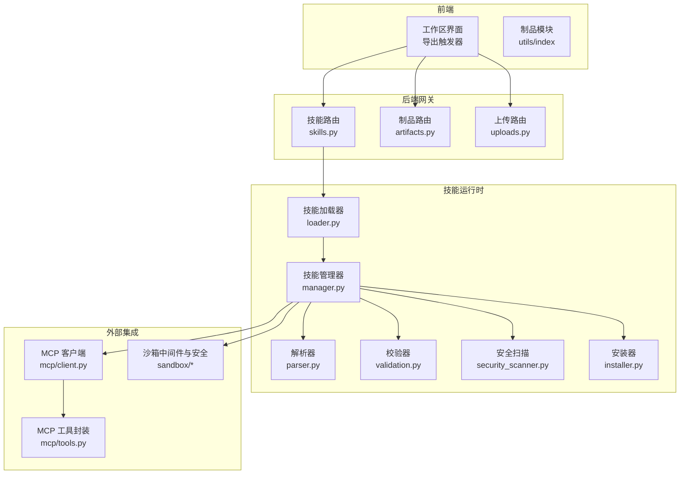
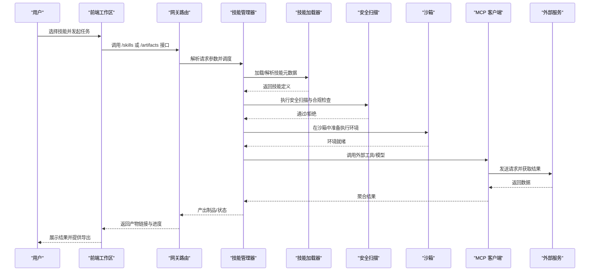
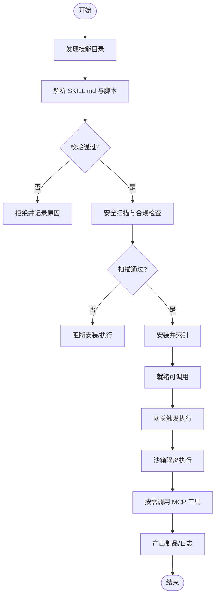
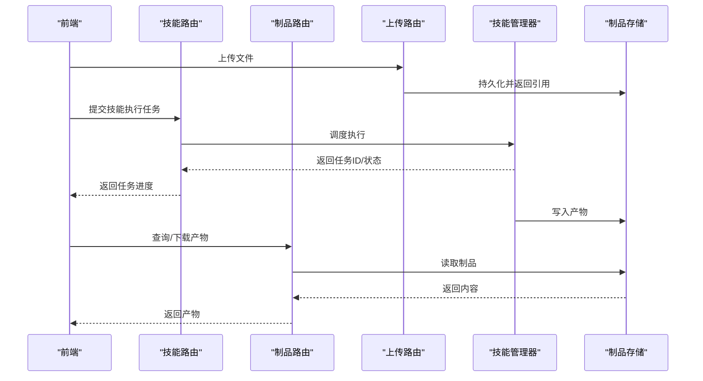
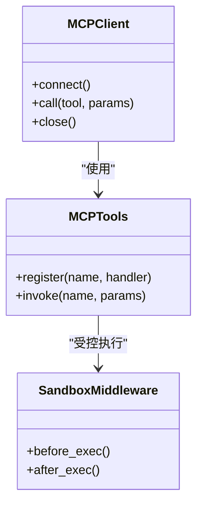
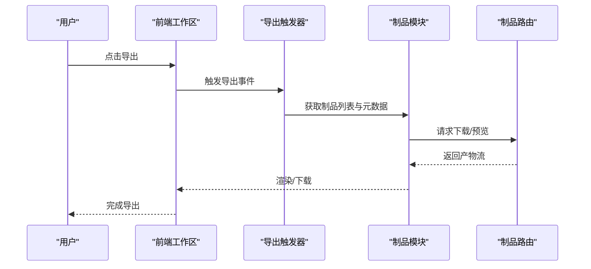
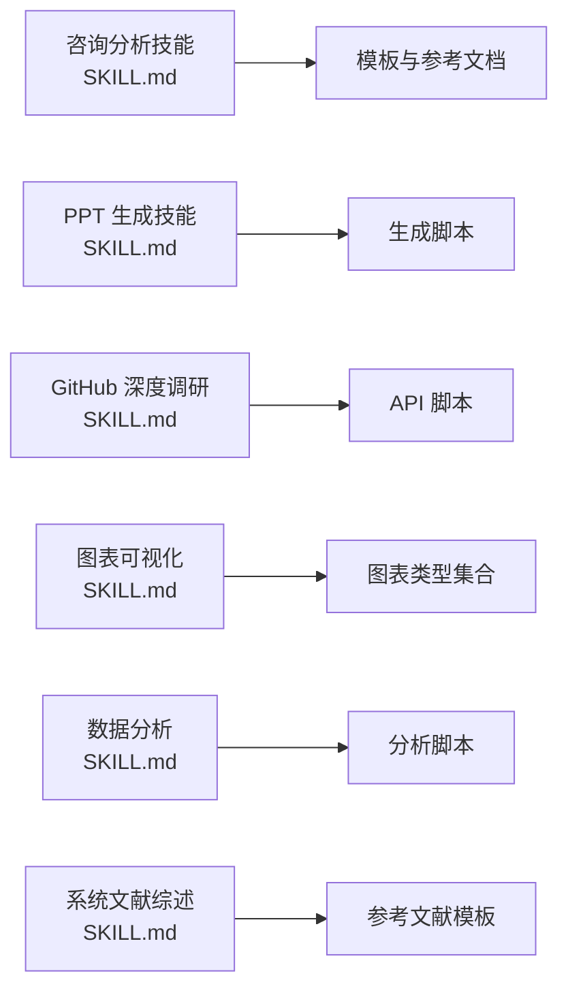
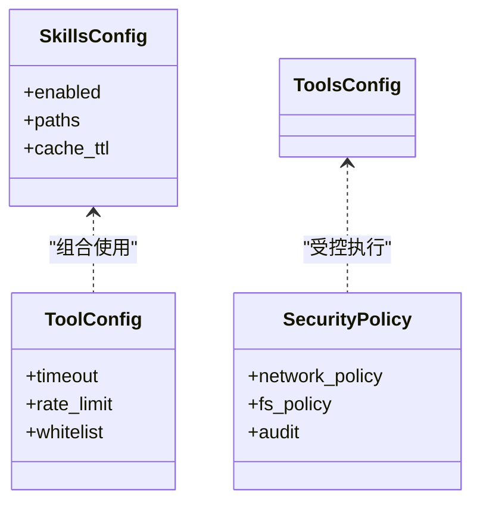
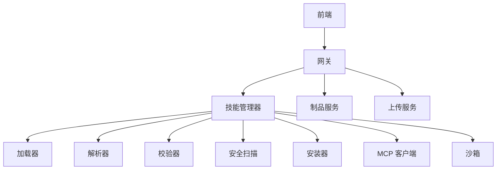

# 商业工具技能

<cite>
**本文引用的文件**   
- [README.md](file://README.md)
- [backend/AGENTS.md](file://backend/AGENTS.md)
- [backend/packages/harness/deerflow/skills/loader.py](file://backend/packages/harness/deerflow/skills/loader.py)
- [backend/packages/harness/deerflow/skills/manager.py](file://backend/packages/harness/deerflow/skills/manager.py)
- [backend/packages/harness/deerflow/skills/parser.py](file://backend/packages/harness/deerflow/skills/parser.py)
- [backend/packages/harness/deerflow/skills/validation.py](file://backend/packages/harness/deerflow/skills/validation.py)
- [backend/packages/harness/deerflow/skills/security_scanner.py](file://backend/packages/harness/deerflow/skills/security_scanner.py)
- [backend/packages/harness/deerflow/skills/installer.py](file://backend/packages/harness/deerflow/skills/installer.py)
- [backend/packages/harness/deerflow/tools/skill_manage_tool.py](file://backend/packages/harness/deerflow/tools/skill_manage_tool.py)
- [skills/public/consulting-analysis/SKILL.md](file://skills/public/consulting-analysis/SKILL.md)
- [skills/public/ppt-generation/SKILL.md](file://skills/public/ppt-generation/SKILL.md)
- [skills/public/github-deep-research/SKILL.md](file://skills/public/github-deep-research/SKILL.md)
- [skills/public/chart-visualization/SKILL.md](file://skills/public/chart-visualization/SKILL.md)
- [skills/public/data-analysis/SKILL.md](file://skills/public/data-analysis/SKILL.md)
- [skills/public/systematic-literature-review/SKILL.md](file://skills/public/systematic-literature-review/SKILL.md)
- [backend/app/gateway/routers/skills.py](file://backend/app/gateway/routers/skills.py)
- [backend/app/gateway/routers/artifacts.py](file://backend/app/gateway/routers/artifacts.py)
- [backend/app/gateway/routers/uploads.py](file://backend/app/gateway/routers/uploads.py)
- [backend/packages/harness/deerflow/config/skills_config.py](file://backend/packages/harness/deerflow/config/skills_config.py)
- [backend/packages/harness/deerflow/config/tool_config.py](file://backend/packages/harness/deerflow/config/tool_config.py)
- [backend/packages/harness/deerflow/mcp/client.py](file://backend/packages/harness/deerflow/mcp/client.py)
- [backend/packages/harness/deerflow/mcp/tools.py](file://backend/packages/harness/deerflow/mcp/tools.py)
- [backend/packages/harness/deerflow/sandbox/middleware.py](file://backend/packages/harness/deerflow/sandbox/middleware.py)
- [backend/packages/harness/deerflow/sandbox/security.py](file://backend/packages/harness/deerflow/sandbox/security.py)
- [frontend/src/components/workspace/export-trigger.tsx](file://frontend/src/components/workspace/export-trigger.tsx)
- [frontend/src/core/artifacts/index.ts](file://frontend/src/core/artifacts/index.ts)
- [frontend/src/core/artifacts/utils.ts](file://frontend/src/core/artifacts/utils.ts)
</cite>

## 目录
1. [简介](#简介)
2. [项目结构](#项目结构)
3. [核心组件](#核心组件)
4. [架构总览](#架构总览)
5. [详细组件分析](#详细组件分析)
6. [依赖关系分析](#依赖关系分析)
7. [性能考量](#性能考量)
8. [故障排查指南](#故障排查指南)
9. [结论](#结论)
10. [附录](#附录)

## 简介
本文件面向“商业分析与企业级应用”场景，系统性梳理 Deer-Flow 在以下能力上的实现与集成方式：
- 咨询分析报告生成、PPT 演示文稿制作、GitHub 项目深度调研
- 商业智能分析、市场研究报告、竞品分析等工具链
- 报告模板库、品牌元素集成与导出格式支持
- 团队协作、版本控制与审批流程管理（基于工作区、制品与通道）
- 数据安全、权限控制与合规性检查（沙箱、安全扫描、MCP 鉴权）
- 与企业现有系统的集成方案（MCP、网关 API、前端工作区）

该文档以代码仓库为依据，提供从系统架构到关键组件的深入解读，并辅以可视化图示帮助非技术读者理解。

## 项目结构
整体采用前后端分离与插件化“技能（Skill）”体系：
- 后端提供网关路由、技能加载与管理、MCP 客户端、沙箱执行环境、上传与制品存储等能力
- 前端提供工作区界面、导出触发器、制品展示与多语言内容渲染
- 公共技能位于 skills/public，覆盖咨询分析、PPT 生成、GitHub 深度调研、图表可视化、数据分析、系统文献综述等

**图示来源**
- [backend/app/gateway/routers/skills.py](file://backend/app/gateway/routers/skills.py)
- [backend/app/gateway/routers/artifacts.py](file://backend/app/gateway/routers/artifacts.py)
- [backend/app/gateway/routers/uploads.py](file://backend/app/gateway/routers/uploads.py)
- [backend/packages/harness/deerflow/skills/loader.py](file://backend/packages/harness/deerflow/skills/loader.py)
- [backend/packages/harness/deerflow/skills/manager.py](file://backend/packages/harness/deerflow/skills/manager.py)
- [backend/packages/harness/deerflow/skills/parser.py](file://backend/packages/harness/deerflow/skills/parser.py)
- [backend/packages/harness/deerflow/skills/validation.py](file://backend/packages/harness/deerflow/skills/validation.py)
- [backend/packages/harness/deerflow/skills/security_scanner.py](file://backend/packages/harness/deerflow/skills/security_scanner.py)
- [backend/packages/harness/deerflow/skills/installer.py](file://backend/packages/harness/deerflow/skills/installer.py)
- [backend/packages/harness/deerflow/mcp/client.py](file://backend/packages/harness/deerflow/mcp/client.py)
- [backend/packages/harness/deerflow/mcp/tools.py](file://backend/packages/harness/deerflow/mcp/tools.py)
- [backend/packages/harness/deerflow/sandbox/middleware.py](file://backend/packages/harness/deerflow/sandbox/middleware.py)
- [backend/packages/harness/deerflow/sandbox/security.py](file://backend/packages/harness/deerflow/sandbox/security.py)
- [frontend/src/components/workspace/export-trigger.tsx](file://frontend/src/components/workspace/export-trigger.tsx)
- [frontend/src/core/artifacts/index.ts](file://frontend/src/core/artifacts/index.ts)
- [frontend/src/core/artifacts/utils.ts](file://frontend/src/core/artifacts/utils.ts)

**章节来源**
- [README.md](file://README.md)
- [backend/AGENTS.md](file://backend/AGENTS.md)

## 核心组件
- 技能加载与注册：负责发现、解析、校验、安装与缓存技能元数据，为上层路由与工具暴露统一接口
- 技能管理与编排：组合解析、校验、安全扫描、安装等子能力，提供统一的调用入口
- 网关路由层：对外暴露技能查询、执行、产物获取、上传等 REST 接口
- MCP 客户端与工具封装：对接外部模型/工具服务，统一认证与错误处理
- 沙箱与安全中间件：隔离执行、资源限制、访问控制与审计
- 前端导出与工作区：提供一键导出、制品浏览与协作视图

**章节来源**
- [backend/packages/harness/deerflow/skills/loader.py](file://backend/packages/harness/deerflow/skills/loader.py)
- [backend/packages/harness/deerflow/skills/manager.py](file://backend/packages/harness/deerflow/skills/manager.py)
- [backend/app/gateway/routers/skills.py](file://backend/app/gateway/routers/skills.py)
- [backend/packages/harness/deerflow/mcp/client.py](file://backend/packages/harness/deerflow/mcp/client.py)
- [backend/packages/harness/deerflow/sandbox/middleware.py](file://backend/packages/harness/deerflow/sandbox/middleware.py)
- [frontend/src/components/workspace/export-trigger.tsx](file://frontend/src/components/workspace/export-trigger.tsx)

## 架构总览
下图展示了从用户操作到技能执行与产物产出的端到端流程，涵盖网关、技能运行时、MCP 集成与沙箱安全。

**图示来源**
- [backend/app/gateway/routers/skills.py](file://backend/app/gateway/routers/skills.py)
- [backend/packages/harness/deerflow/skills/manager.py](file://backend/packages/harness/deerflow/skills/manager.py)
- [backend/packages/harness/deerflow/skills/loader.py](file://backend/packages/harness/deerflow/skills/loader.py)
- [backend/packages/harness/deerflow/skills/security_scanner.py](file://backend/packages/harness/deerflow/skills/security_scanner.py)
- [backend/packages/harness/deerflow/sandbox/middleware.py](file://backend/packages/harness/deerflow/sandbox/middleware.py)
- [backend/packages/harness/deerflow/mcp/client.py](file://backend/packages/harness/deerflow/mcp/client.py)

## 详细组件分析

### 技能生命周期与安全管理
- 加载阶段：扫描技能目录，解析 SKILL.md 与脚本/模板，构建技能清单
- 校验阶段：对元数据、脚本签名、依赖声明进行合法性校验
- 安全扫描：检测潜在风险（如危险命令、网络外联策略），输出合规报告
- 安装阶段：将技能部署至运行期路径，建立索引与缓存
- 执行阶段：通过网关路由触发，进入沙箱执行，必要时调用 MCP 工具

**图示来源**
- [backend/packages/harness/deerflow/skills/loader.py](file://backend/packages/harness/deerflow/skills/loader.py)
- [backend/packages/harness/deerflow/skills/parser.py](file://backend/packages/harness/deerflow/skills/parser.py)
- [backend/packages/harness/deerflow/skills/validation.py](file://backend/packages/harness/deerflow/skills/validation.py)
- [backend/packages/harness/deerflow/skills/security_scanner.py](file://backend/packages/harness/deerflow/skills/security_scanner.py)
- [backend/packages/harness/deerflow/skills/installer.py](file://backend/packages/harness/deerflow/skills/installer.py)
- [backend/app/gateway/routers/skills.py](file://backend/app/gateway/routers/skills.py)
- [backend/packages/harness/deerflow/sandbox/middleware.py](file://backend/packages/harness/deerflow/sandbox/middleware.py)

**章节来源**
- [backend/packages/harness/deerflow/skills/loader.py](file://backend/packages/harness/deerflow/skills/loader.py)
- [backend/packages/harness/deerflow/skills/manager.py](file://backend/packages/harness/deerflow/skills/manager.py)
- [backend/packages/harness/deerflow/skills/parser.py](file://backend/packages/harness/deerflow/skills/parser.py)
- [backend/packages/harness/deerflow/skills/validation.py](file://backend/packages/harness/deerflow/skills/validation.py)
- [backend/packages/harness/deerflow/skills/security_scanner.py](file://backend/packages/harness/deerflow/skills/security_scanner.py)
- [backend/packages/harness/deerflow/skills/installer.py](file://backend/packages/harness/deerflow/skills/installer.py)

### 网关与制品流转
- 技能路由：接收前端请求，解析参数，委托技能管理器执行，返回任务状态与产物引用
- 制品路由：提供产物列表、下载、预览与版本信息
- 上传路由：支持用户上传附件，供技能执行时读取

**图示来源**
- [backend/app/gateway/routers/skills.py](file://backend/app/gateway/routers/skills.py)
- [backend/app/gateway/routers/artifacts.py](file://backend/app/gateway/routers/artifacts.py)
- [backend/app/gateway/routers/uploads.py](file://backend/app/gateway/routers/uploads.py)

**章节来源**
- [backend/app/gateway/routers/skills.py](file://backend/app/gateway/routers/skills.py)
- [backend/app/gateway/routers/artifacts.py](file://backend/app/gateway/routers/artifacts.py)
- [backend/app/gateway/routers/uploads.py](file://backend/app/gateway/routers/uploads.py)

### MCP 集成与外部工具调用
- 客户端：统一配置、连接与重试策略，支持 OAuth 等鉴权
- 工具封装：将外部工具抽象为标准化接口，便于技能编排
- 安全：结合沙箱中间件限制网络与文件系统访问范围

**图示来源**
- [backend/packages/harness/deerflow/mcp/client.py](file://backend/packages/harness/deerflow/mcp/client.py)
- [backend/packages/harness/deerflow/mcp/tools.py](file://backend/packages/harness/deerflow/mcp/tools.py)
- [backend/packages/harness/deerflow/sandbox/middleware.py](file://backend/packages/harness/deerflow/sandbox/middleware.py)

**章节来源**
- [backend/packages/harness/deerflow/mcp/client.py](file://backend/packages/harness/deerflow/mcp/client.py)
- [backend/packages/harness/deerflow/mcp/tools.py](file://backend/packages/harness/deerflow/mcp/tools.py)
- [backend/packages/harness/deerflow/sandbox/middleware.py](file://backend/packages/harness/deerflow/sandbox/middleware.py)

### 前端导出与工作区协作
- 导出触发器：提供一键导出按钮，触发制品下载或打包
- 制品模块：封装制品加载、预览与转换逻辑
- 协作：通过工作区会话、消息与任务列表，支撑多人协同与版本追踪

**图示来源**
- [frontend/src/components/workspace/export-trigger.tsx](file://frontend/src/components/workspace/export-trigger.tsx)
- [frontend/src/core/artifacts/index.ts](file://frontend/src/core/artifacts/index.ts)
- [frontend/src/core/artifacts/utils.ts](file://frontend/src/core/artifacts/utils.ts)
- [backend/app/gateway/routers/artifacts.py](file://backend/app/gateway/routers/artifacts.py)

**章节来源**
- [frontend/src/components/workspace/export-trigger.tsx](file://frontend/src/components/workspace/export-trigger.tsx)
- [frontend/src/core/artifacts/index.ts](file://frontend/src/core/artifacts/index.ts)
- [frontend/src/core/artifacts/utils.ts](file://frontend/src/core/artifacts/utils.ts)

### 典型技能用例与模板库
- 咨询分析报告：提供结构化模板与参考文档，支持多步骤研究与输出
- PPT 演示文稿：通过脚本生成演示材料，适配企业品牌元素
- GitHub 深度调研：自动化抓取项目信息、贡献者画像与趋势分析
- 图表可视化：内置多种图表类型，支持交互式生成
- 数据分析：提供分析脚本与示例数据集，快速洞察
- 系统文献综述：遵循学术规范，自动生成参考文献与摘要

**图示来源**
- [skills/public/consulting-analysis/SKILL.md](file://skills/public/consulting-analysis/SKILL.md)
- [skills/public/ppt-generation/SKILL.md](file://skills/public/ppt-generation/SKILL.md)
- [skills/public/github-deep-research/SKILL.md](file://skills/public/github-deep-research/SKILL.md)
- [skills/public/chart-visualization/SKILL.md](file://skills/public/chart-visualization/SKILL.md)
- [skills/public/data-analysis/SKILL.md](file://skills/public/data-analysis/SKILL.md)
- [skills/public/systematic-literature-review/SKILL.md](file://skills/public/systematic-literature-review/SKILL.md)

**章节来源**
- [skills/public/consulting-analysis/SKILL.md](file://skills/public/consulting-analysis/SKILL.md)
- [skills/public/ppt-generation/SKILL.md](file://skills/public/ppt-generation/SKILL.md)
- [skills/public/github-deep-research/SKILL.md](file://skills/public/github-deep-research/SKILL.md)
- [skills/public/chart-visualization/SKILL.md](file://skills/public/chart-visualization/SKILL.md)
- [skills/public/data-analysis/SKILL.md](file://skills/public/data-analysis/SKILL.md)
- [skills/public/systematic-literature-review/SKILL.md](file://skills/public/systematic-literature-review/SKILL.md)

### 配置与扩展点
- 技能配置：集中管理技能开关、路径、缓存与可见性
- 工具配置：统一工具启用、限流与超时策略
- 安全策略：沙箱隔离、网络白名单、文件访问控制
- 审计与追踪：记录执行轨迹、资源消耗与错误堆栈

**图示来源**
- [backend/packages/harness/deerflow/config/skills_config.py](file://backend/packages/harness/deerflow/config/skills_config.py)
- [backend/packages/harness/deerflow/config/tool_config.py](file://backend/packages/harness/deerflow/config/tool_config.py)
- [backend/packages/harness/deerflow/sandbox/security.py](file://backend/packages/harness/deerflow/sandbox/security.py)

**章节来源**
- [backend/packages/harness/deerflow/config/skills_config.py](file://backend/packages/harness/deerflow/config/skills_config.py)
- [backend/packages/harness/deerflow/config/tool_config.py](file://backend/packages/harness/deerflow/config/tool_config.py)
- [backend/packages/harness/deerflow/sandbox/security.py](file://backend/packages/harness/deerflow/sandbox/security.py)

## 依赖关系分析
- 组件耦合
  - 网关路由层仅依赖技能管理器与制品/上传服务，保持低耦合
  - 技能管理器聚合加载器、解析器、校验器、安全扫描与安装器，职责清晰
  - MCP 客户端与工具封装解耦于具体外部服务，便于替换与扩展
- 直接/间接依赖
  - 前端依赖网关 API；网关依赖技能运行时；运行时依赖沙箱与 MCP
- 外部集成点
  - MCP 协议用于统一接入外部模型与工具服务
  - 制品与上传服务作为持久化边界，便于与对象存储或文件系统对接

**图示来源**
- [backend/app/gateway/routers/skills.py](file://backend/app/gateway/routers/skills.py)
- [backend/packages/harness/deerflow/skills/manager.py](file://backend/packages/harness/deerflow/skills/manager.py)
- [backend/packages/harness/deerflow/skills/loader.py](file://backend/packages/harness/deerflow/skills/loader.py)
- [backend/packages/harness/deerflow/skills/parser.py](file://backend/packages/harness/deerflow/skills/parser.py)
- [backend/packages/harness/deerflow/skills/validation.py](file://backend/packages/harness/deerflow/skills/validation.py)
- [backend/packages/harness/deerflow/skills/security_scanner.py](file://backend/packages/harness/deerflow/skills/security_scanner.py)
- [backend/packages/harness/deerflow/skills/installer.py](file://backend/packages/harness/deerflow/skills/installer.py)
- [backend/packages/harness/deerflow/mcp/client.py](file://backend/packages/harness/deerflow/mcp/client.py)
- [backend/packages/harness/deerflow/sandbox/middleware.py](file://backend/packages/harness/deerflow/sandbox/middleware.py)
- [backend/app/gateway/routers/artifacts.py](file://backend/app/gateway/routers/artifacts.py)
- [backend/app/gateway/routers/uploads.py](file://backend/app/gateway/routers/uploads.py)

**章节来源**
- [backend/app/gateway/routers/skills.py](file://backend/app/gateway/routers/skills.py)
- [backend/packages/harness/deerflow/skills/manager.py](file://backend/packages/harness/deerflow/skills/manager.py)

## 性能考量
- 技能加载缓存：避免重复解析与 IO，缩短冷启动时间
- 并发与限流：对 MCP 调用与外部 API 设置并发上限与退避策略
- 产物分块与流式传输：大文件导出采用流式响应，降低内存峰值
- 沙箱资源配额：CPU/内存/磁盘限额，防止单任务占用过多资源
- 前端懒加载与增量更新：减少首屏体积与无谓刷新

[本节为通用指导，不直接分析具体文件]

## 故障排查指南
- 技能无法加载
  - 检查 SKILL.md 语法与必填字段是否完整
  - 查看解析器与校验器的错误日志
- 安全扫描失败
  - 确认脚本未包含高危命令或越权访问
  - 调整安全策略白名单后重试
- MCP 调用异常
  - 核对鉴权配置与网络连通性
  - 查看客户端重试与超时日志
- 制品缺失或下载失败
  - 确认上传与制品路由是否正常
  - 检查存储后端可用性与权限

**章节来源**
- [backend/packages/harness/deerflow/skills/parser.py](file://backend/packages/harness/deerflow/skills/parser.py)
- [backend/packages/harness/deerflow/skills/validation.py](file://backend/packages/harness/deerflow/skills/validation.py)
- [backend/packages/harness/deerflow/skills/security_scanner.py](file://backend/packages/harness/deerflow/skills/security_scanner.py)
- [backend/packages/harness/deerflow/mcp/client.py](file://backend/packages/harness/deerflow/mcp/client.py)
- [backend/app/gateway/routers/artifacts.py](file://backend/app/gateway/routers/artifacts.py)
- [backend/app/gateway/routers/uploads.py](file://backend/app/gateway/routers/uploads.py)

## 结论
Deer-Flow 通过“技能”这一可扩展单元，将咨询分析、PPT 生成、GitHub 深度调研等能力模块化，并以网关、沙箱与 MCP 为核心形成稳定可靠的执行底座。配合前端工作区与制品管理，可实现从研究、生成到交付的全链路闭环。在企业环境中，借助安全扫描、权限控制与审计机制，可在保障合规的前提下高效复用与扩展业务能力。

[本节为总结性内容，不直接分析具体文件]

## 附录
- 团队协作文档与最佳实践
  - 建议在工作区中维护任务看板、评审意见与变更记录
  - 使用制品版本标记与发布标签，确保可追溯
- 合规与审计
  - 开启执行审计与资源用量统计
  - 定期审查技能清单与安全策略
- 集成建议
  - 通过 MCP 接入企业知识库、BI 系统与数据湖
  - 将导出产物推送至企业文档中心或协作平台

[本节为补充说明，不直接分析具体文件]