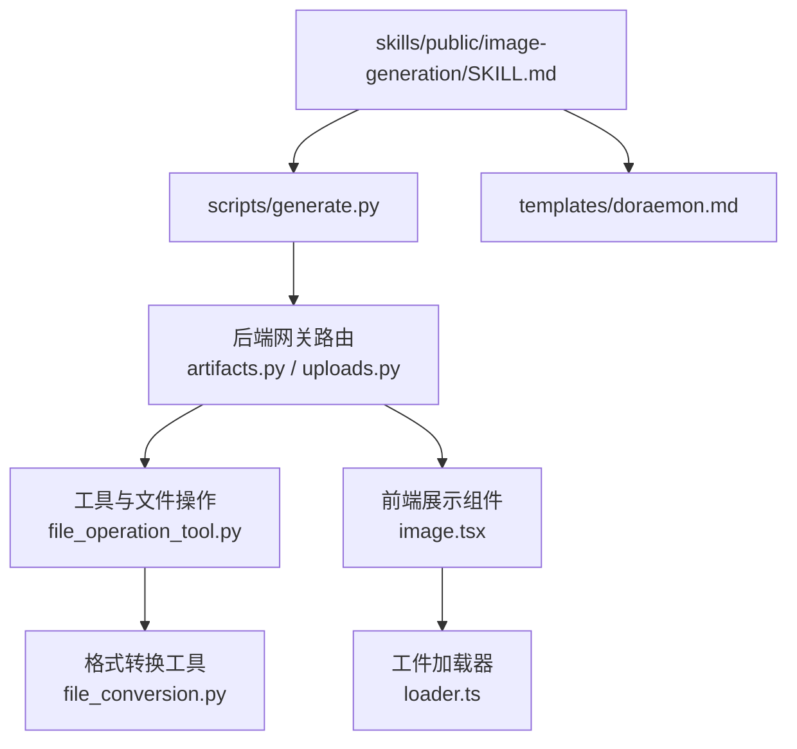
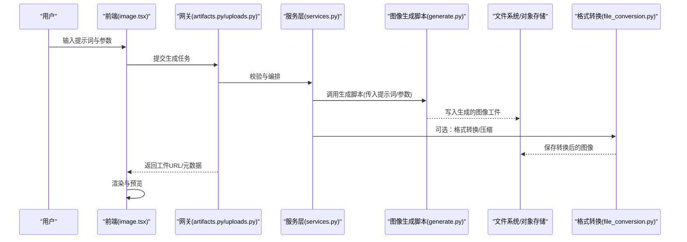
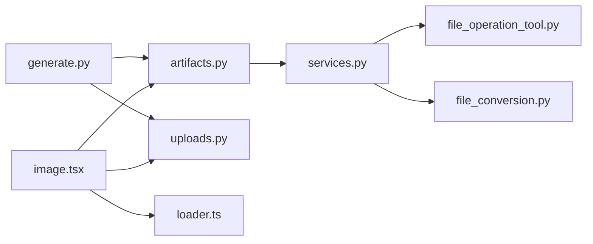

# 图像生成技能

<cite>
**本文引用的文件**   
- [image-generation/SKILL.md](file://skills/public/image-generation/SKILL.md)
- [image-generation/scripts/generate.py](file://skills/public/image-generation/scripts/generate.py)
- [image-generation/templates/doraemon.md](file://skills/public/image-generation/templates/doraemon.md)
- [backend/app/gateway/routers/artifacts.py](file://backend/app/gateway/routers/artifacts.py)
- [backend/app/gateway/routers/uploads.py](file://backend/app/gateway/routers/uploads.py)
- [backend/app/gateway/services.py](file://backend/app/gateway/services.py)
- [backend/packages/harness/deerflow/tools/builtins/file_operation_tool.py](file://backend/packages/harness/deerflow/tools/builtins/file_operation_tool.py)
- [backend/packages/harness/deerflow/utils/file_conversion.py](file://backend/packages/harness/deerflow/utils/file_conversion.py)
- [frontend/src/components/ai-elements/image.tsx](file://frontend/src/components/ai-elements/image.tsx)
- [frontend/src/core/artifacts/loader.ts](file://frontend/src/core/artifacts/loader.ts)
</cite>

## 目录
1. [简介](#简介)
2. [项目结构](#项目结构)
3. [核心组件](#核心组件)
4. [架构总览](#架构总览)
5. [详细组件分析](#详细组件分析)
6. [依赖关系分析](#依赖关系分析)
7. [性能与质量优化](#性能与质量优化)
8. [故障排查指南](#故障排查指南)
9. [结论](#结论)
10. [附录](#附录)

## 简介
本文件面向“图像生成技能”的使用者与集成者，系统说明该技能的能力边界、支持的模型与参数、文本到图像、图像编辑与风格转换等核心功能，并提供提示词编写技巧、批量生成与工作流编排建议。同时覆盖图像存储管理、格式转换与压缩优化，以及与前端组件的集成和实时预览实现方法。

## 项目结构
图像生成技能位于 skills/public/image-generation 目录下，包含技能描述、脚本与模板：
- SKILL.md：技能能力、使用方式与约束说明
- scripts/generate.py：图像生成执行脚本（调用外部服务或本地推理）
- templates/doraemon.md：示例模板（用于引导提示词与输出结构）

图示来源
- [image-generation/SKILL.md](file://skills/public/image-generation/SKILL.md)
- [image-generation/scripts/generate.py](file://skills/public/image-generation/scripts/generate.py)
- [image-generation/templates/doraemon.md](file://skills/public/image-generation/templates/doraemon.md)
- [backend/app/gateway/routers/artifacts.py](file://backend/app/gateway/routers/artifacts.py)
- [backend/app/gateway/routers/uploads.py](file://backend/app/gateway/routers/uploads.py)
- [backend/packages/harness/deerflow/tools/builtins/file_operation_tool.py](file://backend/packages/harness/deerflow/tools/builtins/file_operation_tool.py)
- [backend/packages/harness/deerflow/utils/file_conversion.py](file://backend/packages/harness/deerflow/utils/file_conversion.py)
- [frontend/src/components/ai-elements/image.tsx](file://frontend/src/components/ai-elements/image.tsx)
- [frontend/src/core/artifacts/loader.ts](file://frontend/src/core/artifacts/loader.ts)

章节来源
- [image-generation/SKILL.md](file://skills/public/image-generation/SKILL.md)
- [image-generation/scripts/generate.py](file://skills/public/image-generation/scripts/generate.py)
- [image-generation/templates/doraemon.md](file://skills/public/image-generation/templates/doraemon.md)

## 核心组件
- 技能定义与入口
  - 通过 SKILL.md 描述能力范围、输入输出约定、可用参数与注意事项，供智能体在任务规划时选择并调用。
- 生成脚本
  - generate.py 负责接收提示词与参数，调用外部图像生成服务或本地推理引擎，并将结果落盘为工件。
- 模板
  - doraemon.md 提供结构化提示词模板，帮助稳定生成质量与一致性。
- 后端网关与工件管理
  - artifacts.py 与 uploads.py 提供上传、下载、列表与元数据查询接口；services.py 协调业务逻辑。
- 文件与格式处理
  - file_operation_tool.py 提供通用文件读写、移动、删除等操作；file_conversion.py 提供格式转换与压缩能力。
- 前端展示与预览
  - image.tsx 渲染图片、支持缩放与交互；loader.ts 负责从工件路径加载资源并缓存。

章节来源
- [image-generation/SKILL.md](file://skills/public/image-generation/SKILL.md)
- [image-generation/scripts/generate.py](file://skills/public/image-generation/scripts/generate.py)
- [image-generation/templates/doraemon.md](file://skills/public/image-generation/templates/doraemon.md)
- [backend/app/gateway/routers/artifacts.py](file://backend/app/gateway/routers/artifacts.py)
- [backend/app/gateway/routers/uploads.py](file://backend/app/gateway/routers/uploads.py)
- [backend/app/gateway/services.py](file://backend/app/gateway/services.py)
- [backend/packages/harness/deerflow/tools/builtins/file_operation_tool.py](file://backend/packages/harness/deerflow/tools/builtins/file_operation_tool.py)
- [backend/packages/harness/deerflow/utils/file_conversion.py](file://backend/packages/harness/deerflow/utils/file_conversion.py)
- [frontend/src/components/ai-elements/image.tsx](file://frontend/src/components/ai-elements/image.tsx)
- [frontend/src/core/artifacts/loader.ts](file://frontend/src/core/artifacts/loader.ts)

## 架构总览
下图展示了从用户发起请求到图像生成、存储、转换与前端展示的端到端流程。

图示来源
- [backend/app/gateway/routers/artifacts.py](file://backend/app/gateway/routers/artifacts.py)
- [backend/app/gateway/routers/uploads.py](file://backend/app/gateway/routers/uploads.py)
- [backend/app/gateway/services.py](file://backend/app/gateway/services.py)
- [skills/public/image-generation/scripts/generate.py](file://skills/public/image-generation/scripts/generate.py)
- [backend/packages/harness/deerflow/utils/file_conversion.py](file://backend/packages/harness/deerflow/utils/file_conversion.py)
- [frontend/src/components/ai-elements/image.tsx](file://frontend/src/components/ai-elements/image.tsx)

## 详细组件分析

### 技能定义与模板
- 能力说明
  - 支持文本到图像生成、基于参考图的图像编辑与风格迁移等场景。
  - 可配置分辨率、步数、采样器、种子、提示词权重等参数（具体以脚本与服务端实现为准）。
- 模板用法
  - 使用 doraemon.md 作为结构化提示词模板，确保关键要素完整（主体、背景、风格、构图、光照、细节等），提升稳定性与可重复性。
- 最佳实践
  - 明确主体与场景，避免歧义；限定风格与材质；给出尺寸与比例；必要时加入负面提示词。

章节来源
- [image-generation/SKILL.md](file://skills/public/image-generation/SKILL.md)
- [image-generation/templates/doraemon.md](file://skills/public/image-generation/templates/doraemon.md)

### 生成脚本与参数
- 输入
  - 提示词、负向提示词、模型名称、分辨率、步数、采样器、CFG 系数、种子、裁剪区域、参考图路径等。
- 输出
  - 生成图像文件路径、元数据（尺寸、哈希、时间戳）、可选的缩略图路径。
- 错误处理
  - 对超时、配额不足、模型不可用等情况进行降级与重试策略。

章节来源
- [image-generation/scripts/generate.py](file://skills/public/image-generation/scripts/generate.py)

### 后端网关与工件管理
- 工件路由
  - 提供创建、列出、获取、删除工件的接口；支持按类型过滤（如 image）。
- 上传路由
  - 支持上传参考图、掩码图等中间产物，便于图像编辑与风格转换。
- 服务编排
  - 校验输入、调度生成脚本、触发后处理（压缩/转格式）、记录元数据。

章节来源
- [backend/app/gateway/routers/artifacts.py](file://backend/app/gateway/routers/artifacts.py)
- [backend/app/gateway/routers/uploads.py](file://backend/app/gateway/routers/uploads.py)
- [backend/app/gateway/services.py](file://backend/app/gateway/services.py)

### 文件与格式处理
- 文件操作
  - 提供安全沙箱内的文件读写、移动、复制、删除等能力，限制访问范围。
- 格式转换与压缩
  - 支持常见图像格式互转（如 PNG/JPEG/WebP），可按目标大小或质量阈值进行压缩。

章节来源
- [backend/packages/harness/deerflow/tools/builtins/file_operation_tool.py](file://backend/packages/harness/deerflow/tools/builtins/file_operation_tool.py)
- [backend/packages/harness/deerflow/utils/file_conversion.py](file://backend/packages/harness/deerflow/utils/file_conversion.py)

### 前端展示与实时预览
- 图片组件
  - 支持懒加载、占位骨架屏、点击放大、下载与分享。
- 工件加载器
  - 根据工件 ID 或 URL 拉取资源，结合缓存策略减少重复请求。
- 实时预览
  - 通过 SSE/WS 或轮询获取生成进度，逐步更新 UI。

章节来源
- [frontend/src/components/ai-elements/image.tsx](file://frontend/src/components/ai-elements/image.tsx)
- [frontend/src/core/artifacts/loader.ts](file://frontend/src/core/artifacts/loader.ts)

## 依赖关系分析
- 模块耦合
  - 生成脚本依赖后端网关与服务编排；后端依赖文件操作与格式转换工具；前端依赖工件与上传路由。
- 外部依赖
  - 图像生成脚本可能依赖第三方 API 或本地推理引擎（由部署环境决定）。
- 潜在风险
  - 大文件上传与高并发生成时的 I/O 压力；格式转换时的 CPU 占用；网络抖动导致的超时。

图示来源
- [skills/public/image-generation/scripts/generate.py](file://skills/public/image-generation/scripts/generate.py)
- [backend/app/gateway/routers/artifacts.py](file://backend/app/gateway/routers/artifacts.py)
- [backend/app/gateway/routers/uploads.py](file://backend/app/gateway/routers/uploads.py)
- [backend/app/gateway/services.py](file://backend/app/gateway/services.py)
- [backend/packages/harness/deerflow/tools/builtins/file_operation_tool.py](file://backend/packages/harness/deerflow/tools/builtins/file_operation_tool.py)
- [backend/packages/harness/deerflow/utils/file_conversion.py](file://backend/packages/harness/deerflow/utils/file_conversion.py)
- [frontend/src/components/ai-elements/image.tsx](file://frontend/src/components/ai-elements/image.tsx)
- [frontend/src/core/artifacts/loader.ts](file://frontend/src/core/artifacts/loader.ts)

## 性能与质量优化
- 生成参数调优
  - 合理设置分辨率与步数，平衡质量与耗时；固定种子以提升可复现性；使用合适的采样器与 CFG 系数。
- 批处理与工作流
  - 将多个提示词合并为批次任务，利用队列与并发控制提高吞吐；引入失败重试与熔断机制。
- 存储与传输
  - 优先使用 WebP/AVIF 等高压缩比格式；按需生成缩略图；启用 CDN 与浏览器缓存。
- 流水线优化
  - 并行化非阻塞步骤（如缩略图生成、元数据提取）；对热点工件做内存缓存。

[本节为通用指导，不直接分析具体文件]

## 故障排查指南
- 常见问题
  - 生成超时：检查外部服务可用性、网络延迟与超时配置。
  - 配额不足：确认 API Key 与额度，必要时切换备用模型。
  - 格式不支持：确认目标格式是否在转换工具白名单内。
  - 权限问题：检查沙箱文件访问范围与写权限。
- 定位手段
  - 查看工件元数据与日志；核对上传文件大小与类型；验证前端加载 URL 是否有效。

章节来源
- [backend/packages/harness/deerflow/tools/builtins/file_operation_tool.py](file://backend/packages/harness/deerflow/tools/builtins/file_operation_tool.py)
- [backend/packages/harness/deerflow/utils/file_conversion.py](file://backend/packages/harness/deerflow/utils/file_conversion.py)
- [backend/app/gateway/routers/artifacts.py](file://backend/app/gateway/routers/artifacts.py)
- [backend/app/gateway/routers/uploads.py](file://backend/app/gateway/routers/uploads.py)

## 结论
图像生成技能通过清晰的技能定义、稳定的脚本执行、完善的工件管理与前后端协作，实现了从提示词到高质量图像的端到端能力。借助模板与参数调优、批处理与压缩优化，可在保证质量的同时提升效率与用户体验。

[本节为总结性内容，不直接分析具体文件]

## 附录
- 提示词编写技巧
  - 明确主体与场景；限定风格与材质；给出尺寸与比例；加入必要的负面提示词；使用模板保持结构一致。
- 工作流编排建议
  - 将“生成—压缩—缩略图—归档”拆分为独立节点，便于监控与回滚；引入幂等键避免重复生成。
- 与前端集成要点
  - 统一工件 ID 规范；为图片组件提供占位与错误态；利用缓存与预加载提升首屏体验。

[本节为通用指导，不直接分析具体文件]