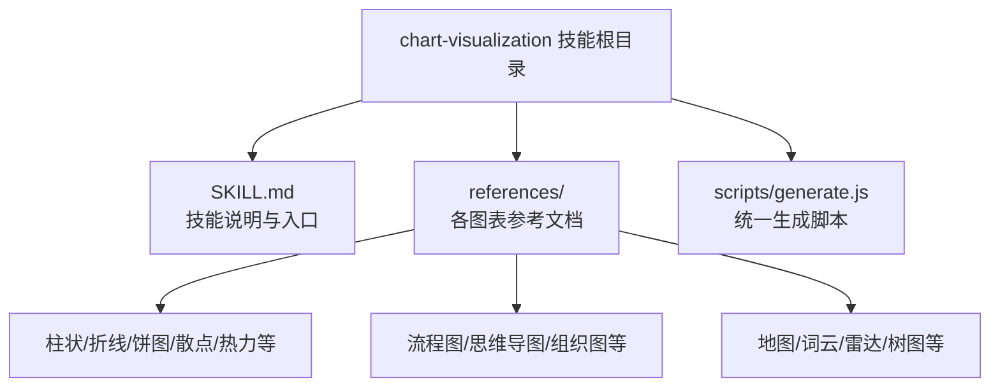
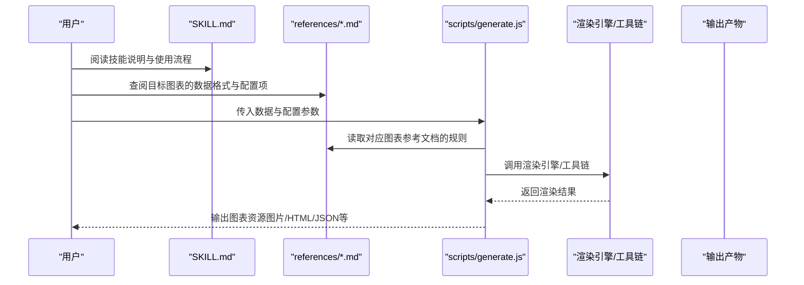
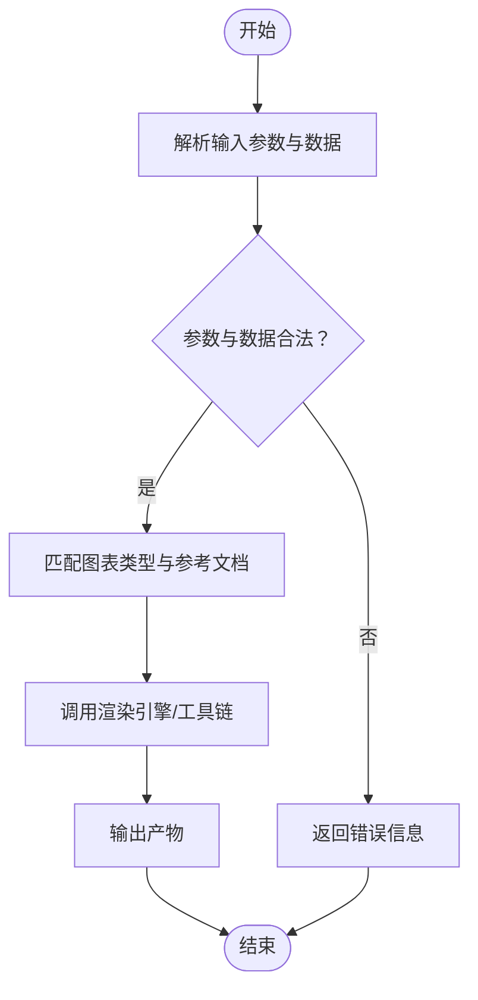
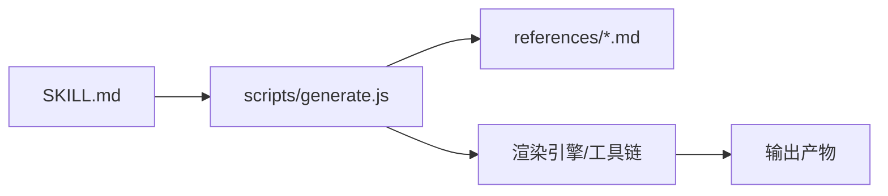

# 图表可视化技能

<cite>
**本文引用的文件**   
- [SKILL.md](file://skills/public/chart-visualization/SKILL.md)
- [generate.js](file://skills/public/chart-visualization/scripts/generate.js)
- [generate_district_map.md](file://skills/public/chart-visualization/references/generate_district_map.md)
- [generate_fishbone_diagram.md](file://skills/public/chart-visualization/references/generate_fishbone_diagram.md)
- [generate_flow_diagram.md](file://skills/public/chart-visualization/references/generate_flow_diagram.md)
- [generate_funnel_chart.md](file://skills/public/chart-visualization/references/generate_funnel_chart.md)
- [generate_histogram_chart.md](file://skills/public/chart-visualization/references/generate_histogram_chart.md)
- [generate_liquid_chart.md](file://skills/public/chart-visualization/references/generate_liquid_chart.md)
- [generate_mind_map.md](file://skills/public/chart-visualization/references/generate_mind_map.md)
- [generate_network_graph.md](file://skills/public/chart-visualization/references/generate_network_graph.md)
- [generate_organization_chart.md](file://skills/public/chart-visualization/references/generate_organization_chart.md)
- [generate_path_map.md](file://skills/public/chart-visualization/references/generate_path_map.md)
- [generate_pie_chart.md](file://skills/public/chart-visualization/references/generate_pie_chart.md)
- [generate_pin_map.md](file://skills/public/chart-visualization/references/generate_pin_map.md)
- [generate_radar_chart.md](file://skills/public/chart-visualization/references/generate_radar_chart.md)
- [generate_treemap_chart.md](file://skills/public/chart-visualization/references/generate_treemap_chart.md)
- [generate_venn_chart.md](file://skills/public/chart-visualization/references/generate_venn_chart.md)
- [generate_violin_chart.md](file://skills/public/chart-visualization/references/generate_violin_chart.md)
- [generate_word_cloud_chart.md](file://skills/public/chart-visualization/references/generate_word_cloud_chart.md)
</cite>

## 目录
1. [简介](#简介)
2. [项目结构](#项目结构)
3. [核心组件](#核心组件)
4. [架构总览](#架构总览)
5. [详细组件分析](#详细组件分析)
6. [依赖分析](#依赖分析)
7. [性能考虑](#性能考虑)
8. [故障排查指南](#故障排查指南)
9. [结论](#结论)
10. [附录](#附录)

## 简介
本文件系统化梳理“图表可视化技能”的能力边界与使用方法，覆盖支持的图表类型、适用场景、配置参数、样式定制选项、数据格式要求、复杂图表构建方法、交互式实现思路、模板系统与自定义开发路径，以及响应式设计与移动端适配最佳实践。该技能通过统一的脚本入口生成多种可视化产物，并配套丰富的参考文档以指导不同图表的输入输出规范与风格建议。

## 项目结构
图表可视化技能位于 skills/public/chart-visualization 目录下，采用“能力说明 + 参考文档 + 执行脚本”的组织方式：
- SKILL.md：技能总览与使用说明
- references/*：各图表类型的参考文档（含数据格式、配置项、示例等）
- scripts/generate.js：统一生成脚本入口

**图示来源**
- [SKILL.md](file://skills/public/chart-visualization/SKILL.md)
- [generate.js](file://skills/public/chart-visualization/scripts/generate.js)

**章节来源**
- [SKILL.md](file://skills/public/chart-visualization/SKILL.md)
- [generate.js](file://skills/public/chart-visualization/scripts/generate.js)

## 核心组件
- 技能说明（SKILL.md）
  - 提供技能定位、使用流程、输入输出约定、与其他模块的集成方式等总体说明。
- 参考文档集合（references/*.md）
  - 针对每种图表类型给出：适用场景、数据格式、关键配置项、样式定制建议、注意事项与示例。
- 生成脚本（scripts/generate.js）
  - 作为统一入口，负责解析输入、加载对应参考文档中的规则、调用渲染引擎或工具链、输出最终图表资源。

**章节来源**
- [SKILL.md](file://skills/public/chart-visualization/SKILL.md)
- [generate.js](file://skills/public/chart-visualization/scripts/generate.js)

## 架构总览
从“需求到产出”的整体流程如下：用户通过技能说明了解所需图表类型，准备符合参考文档的数据与配置，调用统一生成脚本完成渲染与导出。

**图示来源**
- [SKILL.md](file://skills/public/chart-visualization/SKILL.md)
- [generate.js](file://skills/public/chart-visualization/scripts/generate.js)

## 详细组件分析

### 生成脚本（scripts/generate.js）
- 职责
  - 解析命令行或标准输入中的数据与配置
  - 根据图表类型路由至对应的参考文档规则
  - 驱动渲染引擎生成最终产物
- 关键流程
  - 参数校验 → 数据预处理 → 规则匹配 → 渲染 → 产物落盘/输出
- 扩展点
  - 新增图表类型时，优先在 references 下补充参考文档，并在 generate.js 中增加路由与处理逻辑

**图示来源**
- [generate.js](file://skills/public/chart-visualization/scripts/generate.js)

**章节来源**
- [generate.js](file://skills/public/chart-visualization/scripts/generate.js)

### 图表类型与参考文档
以下按类别列出已提供的参考文档，便于快速定位数据格式、配置项与样式建议。每个参考文档均包含：
- 适用场景
- 数据格式要求
- 关键配置项与默认值
- 样式定制选项
- 常见陷阱与优化建议

- 基础统计类
  - 柱状图：[generate_histogram_chart.md](file://skills/public/chart-visualization/references/generate_histogram_chart.md)
  - 折线图：[generate_histogram_chart.md](file://skills/public/chart-visualization/references/generate_histogram_chart.md)（同文档通常涵盖多系列折线）
  - 饼图：[generate_pie_chart.md](file://skills/public/chart-visualization/references/generate_pie_chart.md)
  - 散点图：[generate_histogram_chart.md](file://skills/public/chart-visualization/references/generate_histogram_chart.md)（同文档常包含散点/气泡）
  - 热力图：[generate_histogram_chart.md](file://skills/public/chart-visualization/references/generate_histogram_chart.md)（同文档常包含矩阵/热力）
- 结构与关系类
  - 流程图：[generate_flow_diagram.md](file://skills/public/chart-visualization/references/generate_flow_diagram.md)
  - 思维导图：[generate_mind_map.md](file://skills/public/chart-visualization/references/generate_mind_map.md)
  - 组织架构图：[generate_organization_chart.md](file://skills/public/chart-visualization/references/generate_organization_chart.md)
  - 网络图：[generate_network_graph.md](file://skills/public/chart-visualization/references/generate_network_graph.md)
- 地理与空间类
  - 区域地图：[generate_district_map.md](file://skills/public/chart-visualization/references/generate_district_map.md)
  - 标注地图：[generate_pin_map.md](file://skills/public/chart-visualization/references/generate_pin_map.md)
  - 路径地图：[generate_path_map.md](file://skills/public/chart-visualization/references/generate_path_map.md)
- 分布与对比类
  - 漏斗图：[generate_funnel_chart.md](file://skills/public/chart-visualization/references/generate_funnel_chart.md)
  - 雷达图：[generate_radar_chart.md](file://skills/public/chart-visualization/references/generate_radar_chart.md)
  - 树图：[generate_treemap_chart.md](file://skills/public/chart-visualization/references/generate_treemap_chart.md)
  - 维恩图：[generate_venn_chart.md](file://skills/public/chart-visualization/references/generate_venn_chart.md)
  - 小提琴图：[generate_violin_chart.md](file://skills/public/chart-visualization/references/generate_violin_chart.md)
- 文本与情感类
  - 词云图：[generate_word_cloud_chart.md](file://skills/public/chart-visualization/references/generate_word_cloud_chart.md)
- 特殊展示类
  - 鱼骨图：[generate_fishbone_diagram.md](file://skills/public/chart-visualization/references/generate_fishbone_diagram.md)
  - 液体进度图：[generate_liquid_chart.md](file://skills/public/chart-visualization/references/generate_liquid_chart.md)

提示：
- 若某类图表未在单独文件中出现，可优先查看“基础统计类”所在文档是否合并了多个图表类型。
- 所有图表的数据格式与配置项均以对应参考文档为准。

**章节来源**
- [generate_histogram_chart.md](file://skills/public/chart-visualization/references/generate_histogram_chart.md)
- [generate_pie_chart.md](file://skills/public/chart-visualization/references/generate_pie_chart.md)
- [generate_flow_diagram.md](file://skills/public/chart-visualization/references/generate_flow_diagram.md)
- [generate_mind_map.md](file://skills/public/chart-visualization/references/generate_mind_map.md)
- [generate_organization_chart.md](file://skills/public/chart-visualization/references/generate_organization_chart.md)
- [generate_network_graph.md](file://skills/public/chart-visualization/references/generate_network_graph.md)
- [generate_district_map.md](file://skills/public/chart-visualization/references/generate_district_map.md)
- [generate_pin_map.md](file://skills/public/chart-visualization/references/generate_pin_map.md)
- [generate_path_map.md](file://skills/public/chart-visualization/references/generate_path_map.md)
- [generate_funnel_chart.md](file://skills/public/chart-visualization/references/generate_funnel_chart.md)
- [generate_radar_chart.md](file://skills/public/chart-visualization/references/generate_radar_chart.md)
- [generate_treemap_chart.md](file://skills/public/chart-visualization/references/generate_treemap_chart.md)
- [generate_venn_chart.md](file://skills/public/chart-visualization/references/generate_venn_chart.md)
- [generate_violin_chart.md](file://skills/public/chart-visualization/references/generate_violin_chart.md)
- [generate_word_cloud_chart.md](file://skills/public/chart-visualization/references/generate_word_cloud_chart.md)
- [generate_fishbone_diagram.md](file://skills/public/chart-visualization/references/generate_fishbone_diagram.md)
- [generate_liquid_chart.md](file://skills/public/chart-visualization/references/generate_liquid_chart.md)

### 复杂图表构建方法
- 组合型图表
  - 将多个子图表（如柱状+折线、地图+散点）拆分为独立数据集与配置块，在生成脚本中按顺序渲染并合成输出。
- 分层与聚合
  - 对大规模数据先进行聚合（分组、采样、分桶），再渲染，避免前端或渲染端过载。
- 主题与样式复用
  - 抽取通用样式（配色、字体、边距、图例位置）为共享配置，减少重复定义。
- 交互增强
  - 在 HTML 输出中注入事件监听（缩放、筛选、联动），或在静态图片中提供超链接跳转至详情页面。

（本节为方法论概述，不直接分析具体文件）

### 交互式图表实现
- 输出 HTML 时嵌入交互库（如缩放、平移、点击高亮、悬浮提示）。
- 基于 JSON 配置驱动交互行为（过滤条件、联动关系、动态刷新）。
- 在移动端限制复杂交互，优先提供滑动与长按操作。

（本节为方法论概述，不直接分析具体文件）

### 图表模板系统与自定义开发
- 模板系统
  - 以 references/*.md 作为“图表模板”，统一描述数据格式、配置项与样式约定。
  - 在 generate.js 中维护“图表类型 → 参考文档”的映射，支持按需加载与缓存。
- 自定义图表
  - 新增步骤：
    1) 在 references 下创建新图表参考文档，明确数据与配置；
    2) 在 generate.js 中添加路由与渲染分支；
    3) 在 SKILL.md 中补充使用说明与示例。
  - 建议遵循现有命名与结构，保持可维护性与一致性。

**章节来源**
- [SKILL.md](file://skills/public/chart-visualization/SKILL.md)
- [generate.js](file://skills/public/chart-visualization/scripts/generate.js)

### 响应式设计与移动端适配最佳实践
- 尺寸与布局
  - 使用相对单位与自适应容器，确保在不同屏幕比例下正常显示。
- 交互简化
  - 移动端减少悬停交互，改用点击/长按；提供手势缩放与滚动。
- 性能优化
  - 大数据集分页/懒加载；按需加载交互脚本；压缩图片与矢量资源。
- 可读性
  - 调整字号、间距与图例密度，保证小屏下的可读性。

（本节为方法论概述，不直接分析具体文件）

## 依赖分析
- 内部依赖
  - generate.js 依赖 references/*.md 中的规则与约定
  - SKILL.md 作为对外入口，引用 generate.js 的使用方式
- 外部依赖
  - 渲染引擎/工具链由 generate.js 调用（具体实现以脚本为准）

**图示来源**
- [SKILL.md](file://skills/public/chart-visualization/SKILL.md)
- [generate.js](file://skills/public/chart-visualization/scripts/generate.js)

**章节来源**
- [SKILL.md](file://skills/public/chart-visualization/SKILL.md)
- [generate.js](file://skills/public/chart-visualization/scripts/generate.js)

## 性能考虑
- 数据侧
  - 预聚合、降采样、去重与字段裁剪，降低渲染压力。
- 渲染侧
  - 批量绘制、延迟渲染、按需更新；避免频繁重绘。
- 输出侧
  - 选择合适的输出格式（SVG/PNG/HTML），权衡体积与交互需求。
- 缓存策略
  - 对相同输入的结果进行缓存，避免重复计算。

（本节为方法论概述，不直接分析具体文件）

## 故障排查指南
- 常见问题
  - 参数缺失或类型错误：检查 generate.js 的参数校验逻辑与输入数据是否符合参考文档约定。
  - 数据格式不符：对照相应 references/*.md 的数据结构定义逐项核对。
  - 渲染失败：确认渲染引擎可用、依赖安装完整、输出路径权限正确。
- 调试建议
  - 开启详细日志，记录输入数据、中间状态与错误堆栈。
  - 逐步缩小问题范围，先验证最小可复现用例。

**章节来源**
- [generate.js](file://skills/public/chart-visualization/scripts/generate.js)

## 结论
“图表可视化技能”通过统一的生成脚本与完善的参考文档体系，覆盖了从基础统计到地理空间、从结构关系到文本情感的广泛图表类型。借助模板化与可扩展的架构，团队可以快速新增图表类型、复用样式与交互模式，并在移动端与大屏场景下保持一致的用户体验。

## 附录
- 快速上手
  - 阅读 SKILL.md 了解整体流程
  - 选择目标图表类型，参考对应 references/*.md 准备数据与配置
  - 运行 generate.js 生成最终产物
- 扩展清单
  - 新增图表类型：补充 references 文档 → 更新 generate.js 路由 → 更新 SKILL.md 说明

（本节为方法论概述，不直接分析具体文件）