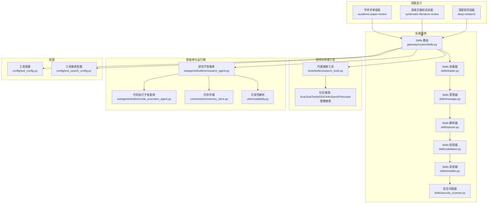
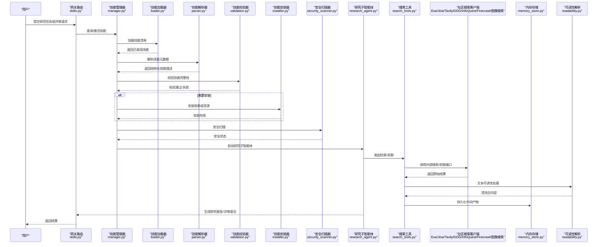
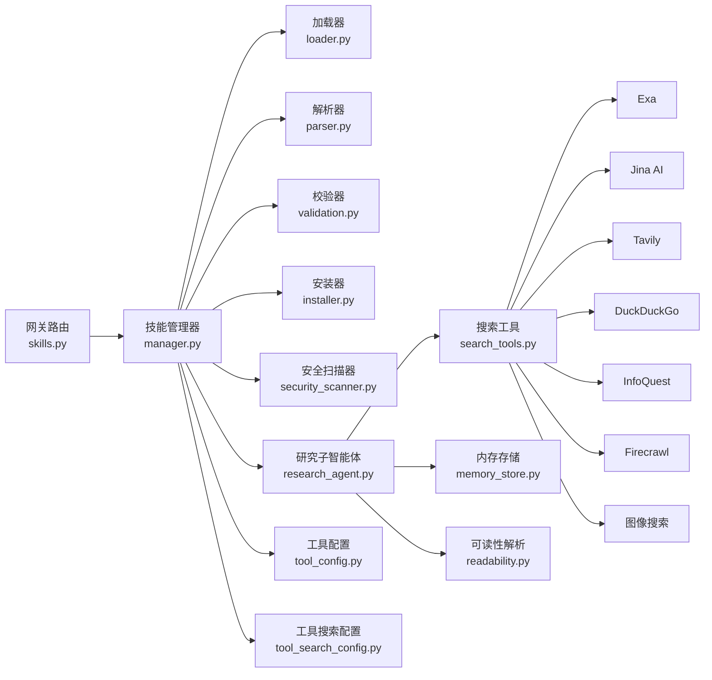

# 学术与研究技能

<cite>
**本文引用的文件**   
- [skills/public/academic-paper-review/SKILL.md](file://skills/public/academic-paper-review/SKILL.md)
- [skills/public/systematic-literature-review/SKILL.md](file://skills/public/systematic-literature-review/SKILL.md)
- [skills/public/deep-research/SKILL.md](file://skills/public/deep-research/SKILL.md)
- [skills/public/systematic-literature-review/scripts/arxiv_search.py](file://skills/public/systematic-literature-review/scripts/arxiv_search.py)
- [backend/app/gateway/routers/skills.py](file://backend/app/gateway/routers/skills.py)
- [backend/packages/harness/deerflow/skills/loader.py](file://backend/packages/harness/deerflow/skills/loader.py)
- [backend/packages/harness/deerflow/skills/manager.py](file://backend/packages/harness/deerflow/skills/manager.py)
- [backend/packages/harness/deerflow/skills/parser.py](file://backend/packages/harness/deerflow/skills/parser.py)
- [backend/packages/harness/deerflow/skills/validation.py](file://backend/packages/harness/deerflow/skills/validation.py)
- [backend/packages/harness/deerflow/skills/installer.py](file://backend/packages/harness/deerflow/skills/installer.py)
- [backend/packages/harness/deerflow/skills/security_scanner.py](file://backend/packages/harness/deerflow/skills/security_scanner.py)
- [backend/packages/harness/deerflow/tools/builtins/search_tools.py](file://backend/packages/harness/deerflow/tools/builtins/search_tools.py)
- [backend/packages/harness/deerflow/community/exa/__init__.py](file://backend/packages/harness/deerflow/community/exa/__init__.py)
- [backend/packages/harness/deerflow/community/jina_ai/__init__.py](file://backend/packages/harness/deerflow/community/jina_ai/__init__.py)
- [backend/packages/harness/deerflow/community/tavily/__init__.py](file://backend/packages/harness/deerflow/community/tavily/__init__.py)
- [backend/packages/harness/deerflow/community/ddg_search/__init__.py](file://backend/packages/harness/deerflow/community/ddg_search/__init__.py)
- [backend/packages/harness/deerflow/community/infoquest/__init__.py](file://backend/packages/harness/deerflow/community/infoquest/__init__.py)
- [backend/packages/harness/deerflow/community/firecrawl/__init__.py](file://backend/packages/harness/deerflow/community/firecrawl/__init__.py)
- [backend/packages/harness/deerflow/community/image_search/__init__.py](file://backend/packages/harness/deerflow/community/image_search/__init__.py)
- [backend/packages/harness/deerflow/subagents/builtins/research_agent.py](file://backend/packages/harness/deerflow/subagents/builtins/research_agent.py)
- [backend/packages/harness/deerflow/subagents/builtins/code_execution_agent.py](file://backend/packages/harness/deerflow/subagents/builtins/code_execution_agent.py)
- [backend/packages/harness/deerflow/runtime/store/memory_store.py](file://backend/packages/harness/deerflow/runtime/store/memory_store.py)
- [backend/packages/harness/deerflow/utils/readability.py](file://backend/packages/harness/deerflow/utils/readability.py)
- [backend/packages/harness/deerflow/config/tool_config.py](file://backend/packages/harness/deerflow/config/tool_config.py)
- [backend/packages/harness/deerflow/config/tool_search_config.py](file://backend/packages/harness/deerflow/config/tool_search_config.py)
</cite>

## 目录
1. [简介](#简介)
2. [项目结构](#项目结构)
3. [核心组件](#核心组件)
4. [架构总览](#架构总览)
5. [详细组件分析](#详细组件分析)
6. [依赖分析](#依赖分析)
7. [性能考虑](#性能考虑)
8. [故障排查指南](#故障排查指南)
9. [结论](#结论)
10. [附录](#附录)

## 简介
本文件面向学术与研究工作流，系统化梳理并展示 Deer-Flow 在“学术论文评审、系统文献综述、深度研究”等高级能力上的实现与集成。内容覆盖：
- 学术数据库检索与论文质量评估、引用分析工具链
- 研究方法论指导与学术写作辅助
- 学术规范检查与格式标准化（APA、IEEE、BibTeX）
- 研究数据管理与知识图谱构建支撑
- 与学术出版流程与同行评审系统的对接思路与集成点

该文档既提供高层概览，也深入到具体模块与调用链路，帮助研究者与工程师快速定位能力边界与扩展点。

## 项目结构
围绕“学术与研究技能”，仓库中与学术相关的关键位置包括：
- skills/public 下的学术类技能定义与模板
- backend 中 Skills 加载、安装、校验与安全扫描
- 社区搜索与抓取工具（Exa、Jina AI、Tavily、DuckDuckGo、InfoQuest、Firecrawl、图像搜索）
- Subagents 内置的研究与代码执行智能体
- 运行时存储与可读性解析工具
- 工具配置与搜索配置

图示来源
- [backend/app/gateway/routers/skills.py](file://backend/app/gateway/routers/skills.py)
- [backend/packages/harness/deerflow/skills/loader.py](file://backend/packages/harness/deerflow/skills/loader.py)
- [backend/packages/harness/deerflow/skills/manager.py](file://backend/packages/harness/deerflow/skills/manager.py)
- [backend/packages/harness/deerflow/skills/parser.py](file://backend/packages/harness/deerflow/skills/parser.py)
- [backend/packages/harness/deerflow/skills/validation.py](file://backend/packages/harness/deerflow/skills/validation.py)
- [backend/packages/harness/deerflow/skills/installer.py](file://backend/packages/harness/deerflow/skills/installer.py)
- [backend/packages/harness/deerflow/skills/security_scanner.py](file://backend/packages/harness/deerflow/skills/security_scanner.py)
- [backend/packages/harness/deerflow/tools/builtins/search_tools.py](file://backend/packages/harness/deerflow/tools/builtins/search_tools.py)
- [backend/packages/harness/deerflow/community/exa/__init__.py](file://backend/packages/harness/deerflow/community/exa/__init__.py)
- [backend/packages/harness/deerflow/community/jina_ai/__init__.py](file://backend/packages/harness/deerflow/community/jina_ai/__init__.py)
- [backend/packages/harness/deerflow/community/tavily/__init__.py](file://backend/packages/harness/deerflow/community/tavily/__init__.py)
- [backend/packages/harness/deerflow/community/ddg_search/__init__.py](file://backend/packages/harness/deerflow/community/ddg_search/__init__.py)
- [backend/packages/harness/deerflow/community/infoquest/__init__.py](file://backend/packages/harness/deerflow/community/infoquest/__init__.py)
- [backend/packages/harness/deerflow/community/firecrawl/__init__.py](file://backend/packages/harness/deerflow/community/firecrawl/__init__.py)
- [backend/packages/harness/deerflow/community/image_search/__init__.py](file://backend/packages/harness/deerflow/community/image_search/__init__.py)
- [backend/packages/harness/deerflow/subagents/builtins/research_agent.py](file://backend/packages/harness/deerflow/subagents/builtins/research_agent.py)
- [backend/packages/harness/deerflow/subagents/builtins/code_execution_agent.py](file://backend/packages/harness/deerflow/subagents/builtins/code_execution_agent.py)
- [backend/packages/harness/deerflow/runtime/store/memory_store.py](file://backend/packages/harness/deerflow/runtime/store/memory_store.py)
- [backend/packages/harness/deerflow/utils/readability.py](file://backend/packages/harness/deerflow/utils/readability.py)
- [backend/packages/harness/deerflow/config/tool_config.py](file://backend/packages/harness/deerflow/config/tool_config.py)
- [backend/packages/harness/deerflow/config/tool_search_config.py](file://backend/packages/harness/deerflow/config/tool_search_config.py)

章节来源
- [skills/public/academic-paper-review/SKILL.md](file://skills/public/academic-paper-review/SKILL.md)
- [skills/public/systematic-literature-review/SKILL.md](file://skills/public/systematic-literature-review/SKILL.md)
- [skills/public/deep-research/SKILL.md](file://skills/public/deep-research/SKILL.md)

## 核心组件
- 学术评审技能：提供论文评审工作流指引、评价维度与输出模板，支持多格式引用与规范化检查。
- 系统文献综述技能：包含 ArXiv 检索脚本与多种引文模板（APA、IEEE、BibTeX），用于系统性检索、筛选与汇总。
- 深度研究技能：面向复杂问题的分阶段研究策略、信息聚合与分析框架。
- 研究工具链：内置与社区搜索工具（Exa、Jina AI、Tavily、DDG、InfoQuest、Firecrawl、图像搜索），配合可读性解析与内存存储，形成检索—清洗—结构化—可视化的闭环。
- 智能体编排：研究子智能体协调检索、阅读、分析与报告生成；代码执行子智能体负责数据处理与可视化脚本执行。
- 技能生命周期管理：加载、解析、校验、安装与安全扫描，确保技能可用性与安全性。

章节来源
- [skills/public/academic-paper-review/SKILL.md](file://skills/public/academic-paper-review/SKILL.md)
- [skills/public/systematic-literature-review/SKILL.md](file://skills/public/systematic-literature-review/SKILL.md)
- [skills/public/deep-research/SKILL.md](file://skills/public/deep-research/SKILL.md)
- [backend/packages/harness/deerflow/skills/loader.py](file://backend/packages/harness/deerflow/skills/loader.py)
- [backend/packages/harness/deerflow/skills/manager.py](file://backend/packages/harness/deerflow/skills/manager.py)
- [backend/packages/harness/deerflow/skills/parser.py](file://backend/packages/harness/deerflow/skills/parser.py)
- [backend/packages/harness/deerflow/skills/validation.py](file://backend/packages/harness/deerflow/skills/validation.py)
- [backend/packages/harness/deerflow/skills/installer.py](file://backend/packages/harness/deerflow/skills/installer.py)
- [backend/packages/harness/deerflow/skills/security_scanner.py](file://backend/packages/harness/deerflow/skills/security_scanner.py)

## 架构总览
下图展示了从用户请求到技能执行、工具调用与结果输出的端到端流程。

图示来源
- [backend/app/gateway/routers/skills.py](file://backend/app/gateway/routers/skills.py)
- [backend/packages/harness/deerflow/skills/manager.py](file://backend/packages/harness/deerflow/skills/manager.py)
- [backend/packages/harness/deerflow/skills/loader.py](file://backend/packages/harness/deerflow/skills/loader.py)
- [backend/packages/harness/deerflow/skills/parser.py](file://backend/packages/harness/deerflow/skills/parser.py)
- [backend/packages/harness/deerflow/skills/validation.py](file://backend/packages/harness/deerflow/skills/validation.py)
- [backend/packages/harness/deerflow/skills/installer.py](file://backend/packages/harness/deerflow/skills/installer.py)
- [backend/packages/harness/deerflow/skills/security_scanner.py](file://backend/packages/harness/deerflow/skills/security_scanner.py)
- [backend/packages/harness/deerflow/subagents/builtins/research_agent.py](file://backend/packages/harness/deerflow/subagents/builtins/research_agent.py)
- [backend/packages/harness/deerflow/tools/builtins/search_tools.py](file://backend/packages/harness/deerflow/tools/builtins/search_tools.py)
- [backend/packages/harness/deerflow/community/exa/__init__.py](file://backend/packages/harness/deerflow/community/exa/__init__.py)
- [backend/packages/harness/deerflow/community/jina_ai/__init__.py](file://backend/packages/harness/deerflow/community/jina_ai/__init__.py)
- [backend/packages/harness/deerflow/community/tavily/__init__.py](file://backend/packages/harness/deerflow/community/tavily/__init__.py)
- [backend/packages/harness/deerflow/community/ddg_search/__init__.py](file://backend/packages/harness/deerflow/community/ddg_search/__init__.py)
- [backend/packages/harness/deerflow/community/infoquest/__init__.py](file://backend/packages/harness/deerflow/community/infoquest/__init__.py)
- [backend/packages/harness/deerflow/community/firecrawl/__init__.py](file://backend/packages/harness/deerflow/community/firecrawl/__init__.py)
- [backend/packages/harness/deerflow/community/image_search/__init__.py](file://backend/packages/harness/deerflow/community/image_search/__init__.py)
- [backend/packages/harness/deerflow/runtime/store/memory_store.py](file://backend/packages/harness/deerflow/runtime/store/memory_store.py)
- [backend/packages/harness/deerflow/utils/readability.py](file://backend/packages/harness/deerflow/utils/readability.py)

## 详细组件分析

### 学术论文评审技能
- 功能要点
  - 评审维度：创新性、方法严谨性、实验设计、可复现性、伦理与合规、贡献与影响。
  - 输出结构：摘要、优点、不足、改进建议、最终推荐意见。
  - 引用与格式：支持 APA、IEEE、BibTeX 模板，便于纳入参考文献列表。
- 使用方式
  - 通过网关路由选择“学术评审”技能，上传论文或提供链接，由研究子智能体组织评审流程。
- 关键路径
  - 技能定义入口：[academic-paper-review/SKILL.md](file://skills/public/academic-paper-review/SKILL.md)
  - 评审流程编排：研究子智能体协调检索、阅读与评估。
  - 格式化输出：结合系统文献综述技能的模板进行统一排版。

章节来源
- [skills/public/academic-paper-review/SKILL.md](file://skills/public/academic-paper-review/SKILL.md)
- [backend/packages/harness/deerflow/subagents/builtins/research_agent.py](file://backend/packages/harness/deerflow/subagents/builtins/research_agent.py)
- [skills/public/systematic-literature-review/SKILL.md](file://skills/public/systematic-literature-review/SKILL.md)

### 系统文献综述技能
- 功能要点
  - 检索策略：基于关键词、时间窗、领域过滤的自动化检索。
  - 数据源：ArXiv 检索脚本与通用搜索引擎/学术搜索客户端。
  - 引文模板：APA、IEEE、BibTeX，便于直接导出至 LaTeX/Word。
- 使用方式
  - 输入研究问题与筛选条件，自动生成检索式，批量获取元数据与摘要，去重与排序后输出综述初稿。
- 关键路径
  - 技能定义入口：[systematic-literature-review/SKILL.md](file://skills/public/systematic-literature-review/SKILL.md)
  - ArXiv 检索脚本：[scripts/arxiv_search.py](file://skills/public/systematic-literature-review/scripts/arxiv_search.py)
  - 搜索工具与社区客户端：见“依赖分析”。

章节来源
- [skills/public/systematic-literature-review/SKILL.md](file://skills/public/systematic-literature-review/SKILL.md)
- [skills/public/systematic-literature-review/scripts/arxiv_search.py](file://skills/public/systematic-literature-review/scripts/arxiv_search.py)

### 深度研究技能
- 功能要点
  - 分阶段研究：问题分解、假设提出、证据收集、对比分析、结论提炼。
  - 工具协同：搜索、抓取、可读性解析、代码执行（数据分析与可视化）。
- 使用方式
  - 输入主题与目标，自动规划研究步骤，迭代检索与验证，产出结构化研究报告。
- 关键路径
  - 技能定义入口：[deep-research/SKILL.md](file://skills/public/deep-research/SKILL.md)
  - 代码执行子智能体：用于数据处理与图表生成。

章节来源
- [skills/public/deep-research/SKILL.md](file://skills/public/deep-research/SKILL.md)
- [backend/packages/harness/deerflow/subagents/builtins/code_execution_agent.py](file://backend/packages/harness/deerflow/subagents/builtins/code_execution_agent.py)

### 研究工具链与检索集成
- 内置搜索工具
  - 统一封装检索参数、分页、重试与错误降级。
  - 适配多种社区搜索客户端，按需切换。
- 社区搜索客户端
  - Exa：面向语义与学术检索。
  - Jina AI：网页与文档抓取。
  - Tavily：通用搜索优化。
  - DuckDuckGo：匿名搜索。
  - InfoQuest：问答式检索。
  - Firecrawl：大规模页面抓取。
  - 图像搜索：辅助视觉资料检索。
- 关键路径
  - 搜索工具入口：[tools/builtins/search_tools.py](file://backend/packages/harness/deerflow/tools/builtins/search_tools.py)
  - 社区客户端：见各 __init__.py 文件。

章节来源
- [backend/packages/harness/deerflow/tools/builtins/search_tools.py](file://backend/packages/harness/deerflow/tools/builtins/search_tools.py)
- [backend/packages/harness/deerflow/community/exa/__init__.py](file://backend/packages/harness/deerflow/community/exa/__init__.py)
- [backend/packages/harness/deerflow/community/jina_ai/__init__.py](file://backend/packages/harness/deerflow/community/jina_ai/__init__.py)
- [backend/packages/harness/deerflow/community/tavily/__init__.py](file://backend/packages/harness/deerflow/community/tavily/__init__.py)
- [backend/packages/harness/deerflow/community/ddg_search/__init__.py](file://backend/packages/harness/deerflow/community/ddg_search/__init__.py)
- [backend/packages/harness/deerflow/community/infoquest/__init__.py](file://backend/packages/harness/deerflow/community/infoquest/__init__.py)
- [backend/packages/harness/deerflow/community/firecrawl/__init__.py](file://backend/packages/harness/deerflow/community/firecrawl/__init__.py)
- [backend/packages/harness/deerflow/community/image_search/__init__.py](file://backend/packages/harness/deerflow/community/image_search/__init__.py)

### 研究数据管理与知识图谱构建
- 数据管理
  - 中间产物持久化：搜索结果、摘要、抽取实体、关系三元组等存入内存存储。
  - 可读性解析：对抓取内容进行清洗与结构化，提升后续分析质量。
- 知识图谱构建
  - 实体识别与关系抽取：在研究子智能体内联调用，将结构化数据写入存储。
  - 可视化与导出：结合代码执行子智能体生成图结构与导出为常用格式。
- 关键路径
  - 内存存储：[runtime/store/memory_store.py](file://backend/packages/harness/deerflow/runtime/store/memory_store.py)
  - 可读性解析：[utils/readability.py](file://backend/packages/harness/deerflow/utils/readability.py)
  - 研究子智能体：[subagents/builtins/research_agent.py](file://backend/packages/harness/deerflow/subagents/builtins/research_agent.py)
  - 代码执行子智能体：[subagents/builtins/code_execution_agent.py](file://backend/packages/harness/deerflow/subagents/builtins/code_execution_agent.py)

章节来源
- [backend/packages/harness/deerflow/runtime/store/memory_store.py](file://backend/packages/harness/deerflow/runtime/store/memory_store.py)
- [backend/packages/harness/deerflow/utils/readability.py](file://backend/packages/harness/deerflow/utils/readability.py)
- [backend/packages/harness/deerflow/subagents/builtins/research_agent.py](file://backend/packages/harness/deerflow/subagents/builtins/research_agent.py)
- [backend/packages/harness/deerflow/subagents/builtins/code_execution_agent.py](file://backend/packages/harness/deerflow/subagents/builtins/code_execution_agent.py)

### 学术规范检查与格式标准化
- 规范检查
  - 标题、摘要、关键词、引言、方法、结果、讨论、结论的结构化校验。
  - 伦理声明、数据来源与可复现性说明检查。
- 格式标准化
  - 引文格式：APA、IEEE、BibTeX 模板一键转换。
  - 图表编号与交叉引用一致性检查。
- 关键路径
  - 模板与示例：[systematic-literature-review/SKILL.md](file://skills/public/systematic-literature-review/SKILL.md)
  - 模板文件：[templates/apa.md](file://skills/public/systematic-literature-review/templates/apa.md)、[templates/ieee.md](file://skills/public/systematic-literature-review/templates/ieee.md)、[templates/bibtex.md](file://skills/public/systematic-literature-review/templates/bibtex.md)

章节来源
- [skills/public/systematic-literature-review/SKILL.md](file://skills/public/systematic-literature-review/SKILL.md)
- [skills/public/systematic-literature-review/templates/apa.md](file://skills/public/systematic-literature-review/templates/apa.md)
- [skills/public/systematic-literature-review/templates/ieee.md](file://skills/public/systematic-literature-review/templates/ieee.md)
- [skills/public/systematic-literature-review/templates/bibtex.md](file://skills/public/systematic-literature-review/templates/bibtex.md)

### 与学术出版流程与同行评审系统集成
- 集成思路
  - 通过网关路由暴露“评审”与“综述”能力，供外部投稿系统或机构平台调用。
  - 以标准 JSON 协议交换评审意见与修订建议，支持版本化归档。
  - 利用安全扫描与权限控制，保障敏感稿件与评审过程的安全。
- 关键路径
  - 网关路由：[gateway/routers/skills.py](file://backend/app/gateway/routers/skills.py)
  - 安全扫描：[skills/security_scanner.py](file://backend/packages/harness/deerflow/skills/security_scanner.py)

章节来源
- [backend/app/gateway/routers/skills.py](file://backend/app/gateway/routers/skills.py)
- [backend/packages/harness/deerflow/skills/security_scanner.py](file://backend/packages/harness/deerflow/skills/security_scanner.py)

## 依赖分析
- 组件耦合与内聚
  - 网关路由仅依赖技能管理器与配置，保持高内聚低耦合。
  - 技能生命周期（加载、解析、校验、安装、安全扫描）职责清晰，易于替换与扩展。
- 直接与间接依赖
  - 研究子智能体依赖搜索工具与社区客户端，间接依赖内存存储与可读性解析。
  - 代码执行子智能体独立于检索链路，专注于数据处理与可视化。
- 外部依赖与集成点
  - 社区搜索客户端作为外部 API 集成点，需配置密钥与限流策略。
  - 可选的抓取与图像搜索增强检索覆盖面。
- 循环依赖检测
  - 当前分层清晰，未发现循环依赖迹象。

图示来源
- [backend/app/gateway/routers/skills.py](file://backend/app/gateway/routers/skills.py)
- [backend/packages/harness/deerflow/skills/manager.py](file://backend/packages/harness/deerflow/skills/manager.py)
- [backend/packages/harness/deerflow/skills/loader.py](file://backend/packages/harness/deerflow/skills/loader.py)
- [backend/packages/harness/deerflow/skills/parser.py](file://backend/packages/harness/deerflow/skills/parser.py)
- [backend/packages/harness/deerflow/skills/validation.py](file://backend/packages/harness/deerflow/skills/validation.py)
- [backend/packages/harness/deerflow/skills/installer.py](file://backend/packages/harness/deerflow/skills/installer.py)
- [backend/packages/harness/deerflow/skills/security_scanner.py](file://backend/packages/harness/deerflow/skills/security_scanner.py)
- [backend/packages/harness/deerflow/subagents/builtins/research_agent.py](file://backend/packages/harness/deerflow/subagents/builtins/research_agent.py)
- [backend/packages/harness/deerflow/tools/builtins/search_tools.py](file://backend/packages/harness/deerflow/tools/builtins/search_tools.py)
- [backend/packages/harness/deerflow/community/exa/__init__.py](file://backend/packages/harness/deerflow/community/exa/__init__.py)
- [backend/packages/harness/deerflow/community/jina_ai/__init__.py](file://backend/packages/harness/deerflow/community/jina_ai/__init__.py)
- [backend/packages/harness/deerflow/community/tavily/__init__.py](file://backend/packages/harness/deerflow/community/tavily/__init__.py)
- [backend/packages/harness/deerflow/community/ddg_search/__init__.py](file://backend/packages/harness/deerflow/community/ddg_search/__init__.py)
- [backend/packages/harness/deerflow/community/infoquest/__init__.py](file://backend/packages/harness/deerflow/community/infoquest/__init__.py)
- [backend/packages/harness/deerflow/community/firecrawl/__init__.py](file://backend/packages/harness/deerflow/community/firecrawl/__init__.py)
- [backend/packages/harness/deerflow/community/image_search/__init__.py](file://backend/packages/harness/deerflow/community/image_search/__init__.py)
- [backend/packages/harness/deerflow/runtime/store/memory_store.py](file://backend/packages/harness/deerflow/runtime/store/memory_store.py)
- [backend/packages/harness/deerflow/utils/readability.py](file://backend/packages/harness/deerflow/utils/readability.py)
- [backend/packages/harness/deerflow/config/tool_config.py](file://backend/packages/harness/deerflow/config/tool_config.py)
- [backend/packages/harness/deerflow/config/tool_search_config.py](file://backend/packages/harness/deerflow/config/tool_search_config.py)

章节来源
- [backend/app/gateway/routers/skills.py](file://backend/app/gateway/routers/skills.py)
- [backend/packages/harness/deerflow/skills/manager.py](file://backend/packages/harness/deerflow/skills/manager.py)
- [backend/packages/harness/deerflow/tools/builtins/search_tools.py](file://backend/packages/harness/deerflow/tools/builtins/search_tools.py)
- [backend/packages/harness/deerflow/config/tool_config.py](file://backend/packages/harness/deerflow/config/tool_config.py)
- [backend/packages/harness/deerflow/config/tool_search_config.py](file://backend/packages/harness/deerflow/config/tool_search_config.py)

## 性能考虑
- 检索并行与限流
  - 对多个社区搜索客户端并发调用时，应设置全局限流与重试退避，避免触发外部 API 限制。
- 缓存与去重
  - 对搜索结果与中间产物进行哈希去重，减少重复计算与网络开销。
- 文本处理优化
  - 可读性解析采用增量处理与流式读取，降低大文档处理的内存占用。
- 存储与索引
  - 内存存储适合短期会话；如需跨会话复用，可扩展持久化层与倒排索引以提升检索效率。
- 子智能体调度
  - 研究子智能体与代码执行子智能体解耦，避免长耗时任务阻塞主流程。

## 故障排查指南
- 常见问题
  - 技能未加载：检查加载器与解析器日志，确认技能路径与元数据完整。
  - 校验失败：查看校验器规则，补齐必填字段或修正格式。
  - 安装失败：确认安装器依赖环境，检查网络与包源可达性。
  - 安全告警：根据安全扫描器报告修复潜在风险后再启用。
  - 检索异常：核对社区客户端配置（密钥、域名、代理），观察限流与超时。
  - 存储异常：检查内存存储读写权限与容量上限。
- 定位步骤
  - 从网关路由开始，逐步下钻到技能管理器与各子模块，记录每一步输入输出。
  - 针对搜索工具，打印请求参数与响应码，定位外部 API 问题。
  - 对于代码执行子智能体，捕获执行环境与依赖缺失信息。

章节来源
- [backend/packages/harness/deerflow/skills/loader.py](file://backend/packages/harness/deerflow/skills/loader.py)
- [backend/packages/harness/deerflow/skills/parser.py](file://backend/packages/harness/deerflow/skills/parser.py)
- [backend/packages/harness/deerflow/skills/validation.py](file://backend/packages/harness/deerflow/skills/validation.py)
- [backend/packages/harness/deerflow/skills/installer.py](file://backend/packages/harness/deerflow/skills/installer.py)
- [backend/packages/harness/deerflow/skills/security_scanner.py](file://backend/packages/harness/deerflow/skills/security_scanner.py)
- [backend/packages/harness/deerflow/tools/builtins/search_tools.py](file://backend/packages/harness/deerflow/tools/builtins/search_tools.py)
- [backend/packages/harness/deerflow/runtime/store/memory_store.py](file://backend/packages/harness/deerflow/runtime/store/memory_store.py)

## 结论
Deer-Flow 在学术与研究场景提供了从检索、阅读、分析到报告生成的全链路能力。通过模块化技能体系、丰富的搜索与抓取工具、以及稳健的智能体编排，能够高效支撑学术论文评审、系统文献综述与深度研究。同时，规范的检查与模板化输出有助于提升成果质量与可复现性。建议在部署时完善安全策略与限流机制，并根据业务需求扩展更多学术数据源与可视化能力。

## 附录
- 术语表
  - 技能：可被加载、解析、校验与执行的模块化能力单元。
  - 子智能体：承担特定任务的专用智能体，如研究、代码执行。
  - 社区客户端：第三方搜索/抓取服务的封装。
- 参考路径
  - 学术评审技能：[academic-paper-review/SKILL.md](file://skills/public/academic-paper-review/SKILL.md)
  - 系统文献综述技能：[systematic-literature-review/SKILL.md](file://skills/public/systematic-literature-review/SKILL.md)
  - 深度研究技能：[deep-research/SKILL.md](file://skills/public/deep-research/SKILL.md)
  - ArXiv 检索脚本：[scripts/arxiv_search.py](file://skills/public/systematic-literature-review/scripts/arxiv_search.py)
  - 网关路由：[gateway/routers/skills.py](file://backend/app/gateway/routers/skills.py)
  - 技能生命周期：[skills/loader.py](file://backend/packages/harness/deerflow/skills/loader.py)、[skills/manager.py](file://backend/packages/harness/deerflow/skills/manager.py)、[skills/parser.py](file://backend/packages/harness/deerflow/skills/parser.py)、[skills/validation.py](file://backend/packages/harness/deerflow/skills/validation.py)、[skills/installer.py](file://backend/packages/harness/deerflow/skills/installer.py)、[skills/security_scanner.py](file://backend/packages/harness/deerflow/skills/security_scanner.py)
  - 搜索工具与社区客户端：见“依赖分析”部分所列文件
  - 研究子智能体与代码执行子智能体：[research_agent.py](file://backend/packages/harness/deerflow/subagents/builtins/research_agent.py)、[code_execution_agent.py](file://backend/packages/harness/deerflow/subagents/builtins/code_execution_agent.py)
  - 内存存储与可读性解析：[memory_store.py](file://backend/packages/harness/deerflow/runtime/store/memory_store.py)、[readability.py](file://backend/packages/harness/deerflow/utils/readability.py)
  - 工具配置与搜索配置：[tool_config.py](file://backend/packages/harness/deerflow/config/tool_config.py)、[tool_search_config.py](file://backend/packages/harness/deerflow/config/tool_search_config.py)