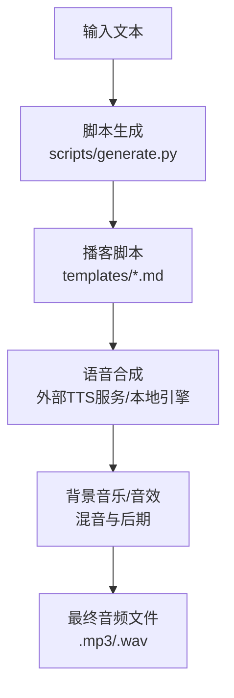
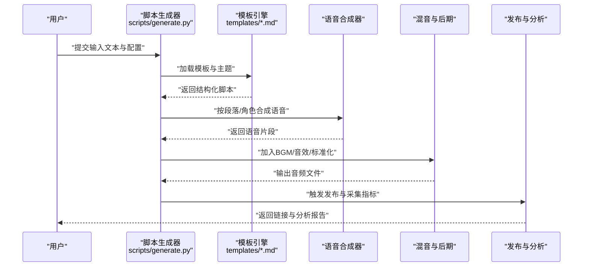
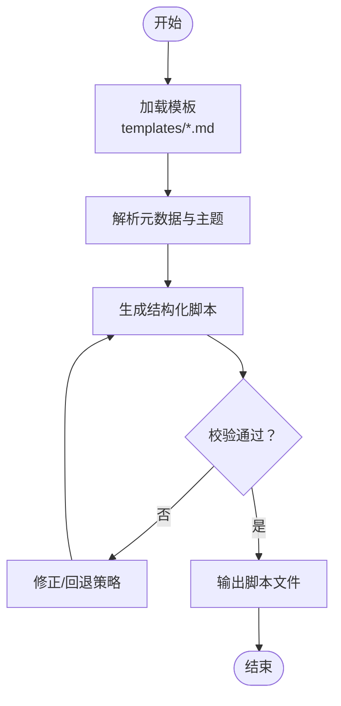
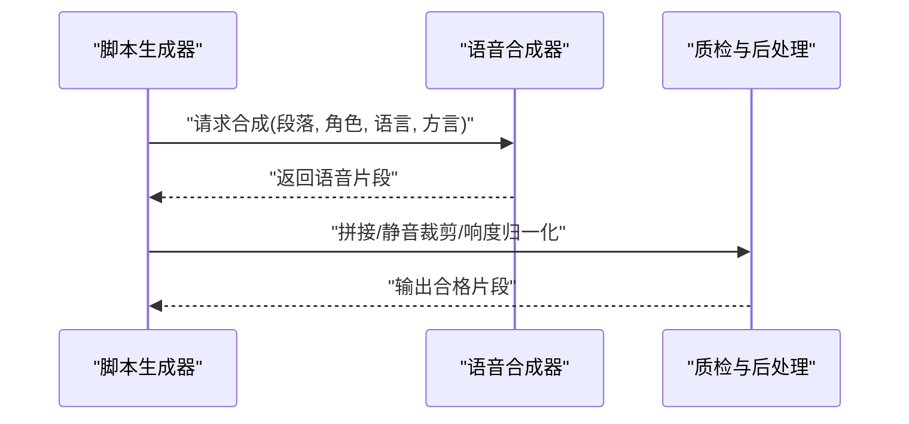
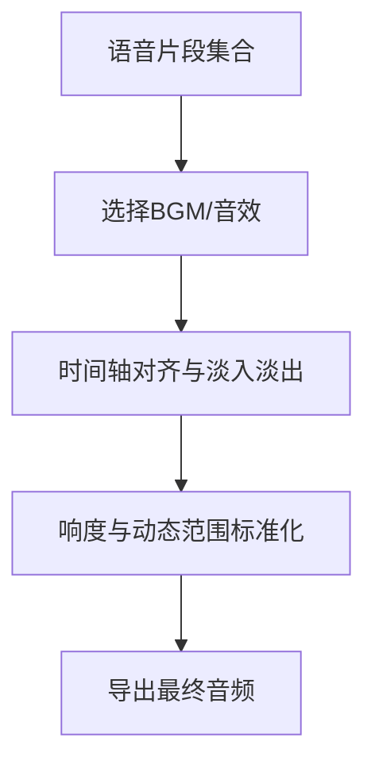
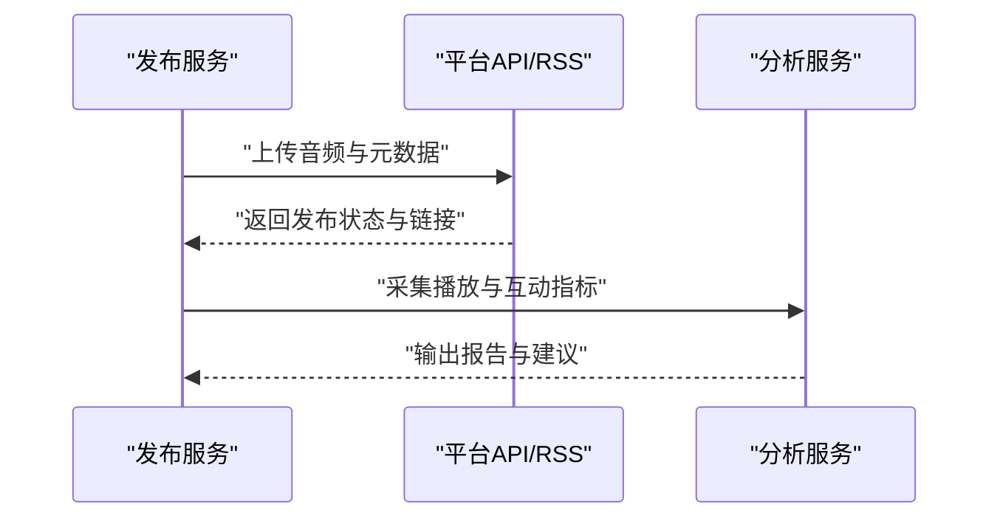
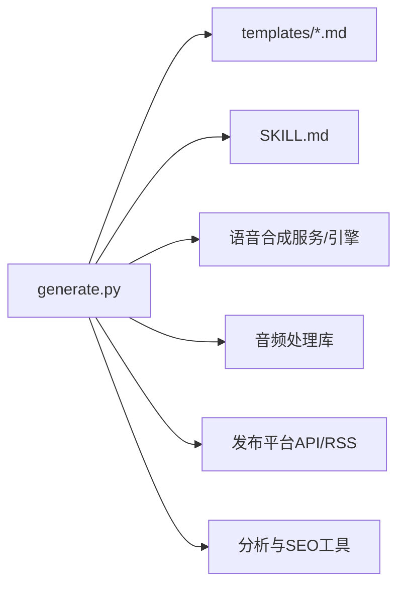

# 播客生成技能

<cite>
**本文引用的文件**   
- [SKILL.md](file://skills/public/podcast-generation/SKILL.md)
- [generate.py](file://skills/public/podcast-generation/scripts/generate.py)
- [tech-explainer.md](file://skills/public/podcast-generation/templates/tech-explainer.md)
</cite>

## 目录
1. [简介](#简介)
2. [项目结构](#项目结构)
3. [核心组件](#核心组件)
4. [架构总览](#架构总览)
5. [详细组件分析](#详细组件分析)
6. [依赖分析](#依赖分析)
7. [性能考虑](#性能考虑)
8. [故障排查指南](#故障排查指南)
9. [结论](#结论)
10. [附录](#附录)

## 简介
本文件面向“播客生成技能”的端到端工作流程，聚焦从文本内容到音频播客的完整转换过程。该技能通过脚本驱动的方式，将输入文本转换为结构化播客脚本，再调用语音合成与后期处理工具链，输出可播放的音频文件。同时提供模板系统与主题定制能力，支持多语言与方言选择，并给出发布、分析与SEO优化的建议流程。

## 项目结构
播客生成技能位于 skills/public/podcast-generation 目录下，采用“脚本 + 模板 + 说明文档”的最小可行结构：
- scripts/generate.py：主执行脚本，负责编排工作流（脚本生成、语音合成、混音、导出等）
- templates/tech-explainer.md：示例模板，定义播客结构与风格提示
- SKILL.md：技能说明，包含使用方式、参数约定与扩展点

[此图为概念性流程图，不直接映射具体源码文件]

**章节来源**
- [SKILL.md](file://skills/public/podcast-generation/SKILL.md)
- [generate.py](file://skills/public/podcast-generation/scripts/generate.py)
- [tech-explainer.md](file://skills/public/podcast-generation/templates/tech-explainer.md)

## 核心组件
- 脚本生成器：根据输入文本与模板，产出分镜式播客脚本（含段落、角色、语气、停顿等元数据）
- 语音合成器：将脚本中的台词转为语音片段，支持多语言与方言选择
- 后期处理：添加背景音乐、音效、淡入淡出、响度标准化、降噪等
- 模板系统：以Markdown为载体的模板，便于主题定制与风格迁移
- 发布与分析：将成品音频上传至平台，收集反馈指标，优化标题、标签与描述以提升SEO

**章节来源**
- [SKILL.md](file://skills/public/podcast-generation/SKILL.md)
- [generate.py](file://skills/public/podcast-generation/scripts/generate.py)
- [tech-explainer.md](file://skills/public/podcast-generation/templates/tech-explainer.md)

## 架构总览
下图展示从输入到输出的端到端数据流与关键处理阶段。

**图表来源**
- [generate.py](file://skills/public/podcast-generation/scripts/generate.py)
- [tech-explainer.md](file://skills/public/podcast-generation/templates/tech-explainer.md)

**章节来源**
- [SKILL.md](file://skills/public/podcast-generation/SKILL.md)
- [generate.py](file://skills/public/podcast-generation/scripts/generate.py)
- [tech-explainer.md](file://skills/public/podcast-generation/templates/tech-explainer.md)

## 详细组件分析

### 脚本生成与模板系统
- 模板载体：使用Markdown模板定义播客结构（开场、正文、转场、结尾），并通过占位符注入主题与内容
- 主题定制：在模板中设置风格、语速、角色分配、段落长度等，实现不同主题的快速切换
- 多语言与方言：模板与脚本生成逻辑支持语言与方言参数，以便在不同地区受众间复用

**图表来源**
- [tech-explainer.md](file://skills/public/podcast-generation/templates/tech-explainer.md)
- [generate.py](file://skills/public/podcast-generation/scripts/generate.py)

**章节来源**
- [tech-explainer.md](file://skills/public/podcast-generation/templates/tech-explainer.md)
- [SKILL.md](file://skills/public/podcast-generation/SKILL.md)

### 语音合成与多语言/方言支持
- 合成入口：由脚本生成器按段落/角色调用语音合成接口或本地引擎
- 语言与方言：通过参数指定目标语言与方言，确保发音与口音符合预期
- 质量保障：对合成结果进行断句对齐、静音裁剪、响度归一化

**图表来源**
- [generate.py](file://skills/public/podcast-generation/scripts/generate.py)

**章节来源**
- [SKILL.md](file://skills/public/podcast-generation/SKILL.md)
- [generate.py](file://skills/public/podcast-generation/scripts/generate.py)

### 背景音乐与音效处理
- 素材管理：集中存放BGM与音效资源，按场景/情绪分类
- 混音策略：依据脚本节奏插入过门音乐、强调音效，控制音量比例与淡入淡出
- 标准化：统一响度、动态范围与采样率，保证跨平台一致性

**图表来源**
- [generate.py](file://skills/public/podcast-generation/scripts/generate.py)

**章节来源**
- [SKILL.md](file://skills/public/podcast-generation/SKILL.md)
- [generate.py](file://skills/public/podcast-generation/scripts/generate.py)

### 发布、分析与SEO优化
- 自动化发布：对接主流播客平台的API或RSS订阅，批量上传与排期
- 反馈收集：聚合下载量、完播率、评论与评分，形成听众画像
- SEO优化：基于关键词与趋势自动生成标题、标签与描述，提升搜索可见性

**图表来源**
- [SKILL.md](file://skills/public/podcast-generation/SKILL.md)
- [generate.py](file://skills/public/podcast-generation/scripts/generate.py)

**章节来源**
- [SKILL.md](file://skills/public/podcast-generation/SKILL.md)
- [generate.py](file://skills/public/podcast-generation/scripts/generate.py)

## 依赖分析
- 内部依赖
  - generate.py 依赖模板文件（templates/*.md）作为内容骨架
  - SKILL.md 作为技能入口，定义参数约定与运行方式
- 外部依赖（概念层面）
  - 语音合成服务/引擎（可选本地或云端）
  - 音频处理库（用于混音、标准化、格式转换）
  - 发布平台API或RSS服务
  - 分析与SEO工具（关键词、趋势、元数据生成）

**图表来源**
- [generate.py](file://skills/public/podcast-generation/scripts/generate.py)
- [tech-explainer.md](file://skills/public/podcast-generation/templates/tech-explainer.md)
- [SKILL.md](file://skills/public/podcast-generation/SKILL.md)

**章节来源**
- [generate.py](file://skills/public/podcast-generation/scripts/generate.py)
- [tech-explainer.md](file://skills/public/podcast-generation/templates/tech-explainer.md)
- [SKILL.md](file://skills/public/podcast-generation/SKILL.md)

## 性能考虑
- 并行合成：按段落并发调用语音合成，缩短整体时延
- 增量处理：对长文本分段处理，避免单次任务过大导致内存峰值
- 缓存策略：对重复段落或固定BGM/音效进行缓存，减少重复计算
- 资源限制：合理设置超时、重试与熔断，防止外部服务抖动影响整体稳定性

[本节为通用指导，不直接分析具体文件]

## 故障排查指南
- 常见问题
  - 模板解析失败：检查模板语法与占位符是否匹配
  - 语音合成失败：确认语言/方言参数有效，网络或服务可用
  - 混音异常：核对BGM/音效路径与时长，检查响度阈值
  - 发布失败：验证平台凭证与权限，检查文件格式与元数据
- 定位方法
  - 查看脚本日志与错误堆栈
  - 逐步回放各阶段产物（脚本、语音片段、混音中间件）
  - 使用最小复现用例隔离问题

**章节来源**
- [SKILL.md](file://skills/public/podcast-generation/SKILL.md)
- [generate.py](file://skills/public/podcast-generation/scripts/generate.py)

## 结论
播客生成技能以“脚本+模板+工具链”的方式，实现了从文本到音频的端到端自动化。通过模板系统与主题定制，能够快速适配不同内容与风格；借助多语言与方言支持，满足国际化需求；结合发布与分析闭环，持续优化传播效果。建议在工程化层面完善错误恢复、监控告警与性能调优，进一步提升稳定性与可扩展性。

[本节为总结性内容，不直接分析具体文件]

## 附录
- 术语
  - 脚本：按段落/角色组织的播客文本与元数据
  - 模板：定义结构与风格的Markdown骨架
  - 混音：将语音、BGM与音效组合并进行标准化
  - SEO：通过标题、标签与描述提升搜索可见性
- 参考路径
  - 技能说明：[SKILL.md](file://skills/public/podcast-generation/SKILL.md)
  - 主脚本：[generate.py](file://skills/public/podcast-generation/scripts/generate.py)
  - 示例模板：[tech-explainer.md](file://skills/public/podcast-generation/templates/tech-explainer.md)