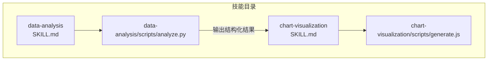
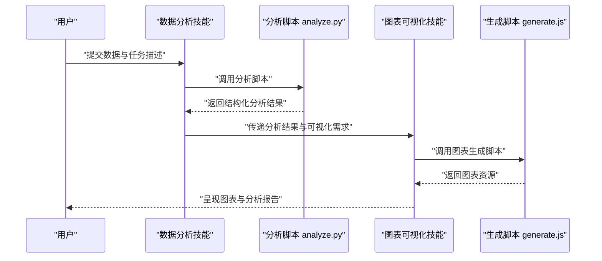
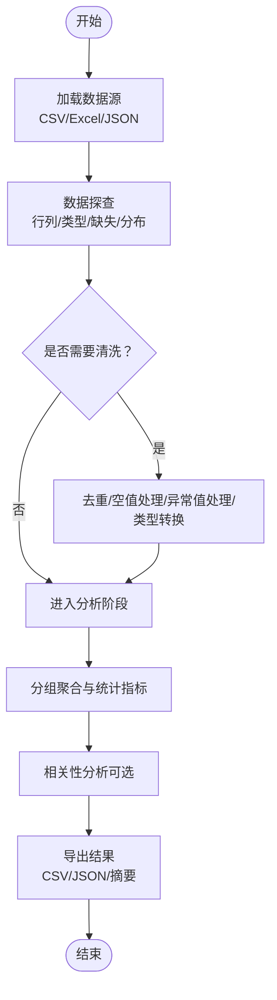
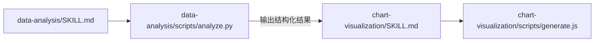

# 数据分析技能

<cite>
**本文引用的文件**   
- [data-analysis/SKILL.md](file://skills/public/data-analysis/SKILL.md)
- [data-analysis/scripts/analyze.py](file://skills/public/data-analysis/scripts/analyze.py)
- [chart-visualization/SKILL.md](file://skills/public/chart-visualization/SKILL.md)
- [chart-visualization/scripts/generate.js](file://skills/public/chart-visualization/scripts/generate.js)
</cite>

## 目录
1. [简介](#简介)
2. [项目结构](#项目结构)
3. [核心组件](#核心组件)
4. [架构总览](#架构总览)
5. [详细组件分析](#详细组件分析)
6. [依赖关系分析](#依赖关系分析)
7. [性能考虑](#性能考虑)
8. [故障排查指南](#故障排查指南)
9. [结论](#结论)
10. [附录](#附录)

## 简介
本章节面向“数据分析技能”的使用者与集成者，系统说明该技能支持的数据格式、内置分析与统计能力、典型工作流（数据加载、清洗、统计分析、可视化生成）、配置参数与扩展方式，以及与图表可视化技能的协作模式。文档同时提供大数据集处理策略与性能优化建议，帮助在不同规模数据上稳定高效地完成分析任务。

## 项目结构
“数据分析技能”位于 skills/public/data-analysis 目录下，包含技能描述与执行脚本；与之配套的“图表可视化技能”位于 skills/public/chart-visualization，用于将分析结果渲染为图表。

图示来源
- [data-analysis/SKILL.md](file://skills/public/data-analysis/SKILL.md)
- [data-analysis/scripts/analyze.py](file://skills/public/data-analysis/scripts/analyze.py)
- [chart-visualization/SKILL.md](file://skills/public/chart-visualization/SKILL.md)
- [chart-visualization/scripts/generate.js](file://skills/public/chart-visualization/scripts/generate.js)

章节来源
- [data-analysis/SKILL.md](file://skills/public/data-analysis/SKILL.md)
- [data-analysis/scripts/analyze.py](file://skills/public/data-analysis/scripts/analyze.py)
- [chart-visualization/SKILL.md](file://skills/public/chart-visualization/SKILL.md)
- [chart-visualization/scripts/generate.js](file://skills/public/chart-visualization/scripts/generate.js)

## 核心组件
- 技能定义与入口：通过 SKILL.md 描述技能用途、输入输出约定、使用示例与注意事项；scripts/analyze.py 实现具体数据处理与分析逻辑。
- 可视化协作：chart-visualization 技能接收结构化分析结果，按预设模板或用户指令生成图表资源，便于在对话或报告中展示。

章节来源
- [data-analysis/SKILL.md](file://skills/public/data-analysis/SKILL.md)
- [data-analysis/scripts/analyze.py](file://skills/public/data-analysis/scripts/analyze.py)
- [chart-visualization/SKILL.md](file://skills/public/chart-visualization/SKILL.md)

## 架构总览
下图展示了从数据输入到分析再到可视化的端到端流程。数据由“数据分析技能”读取并处理，产出结构化结果；随后“图表可视化技能”消费这些结果，生成图表。

图示来源
- [data-analysis/SKILL.md](file://skills/public/data-analysis/SKILL.md)
- [data-analysis/scripts/analyze.py](file://skills/public/data-analysis/scripts/analyze.py)
- [chart-visualization/SKILL.md](file://skills/public/chart-visualization/SKILL.md)
- [chart-visualization/scripts/generate.js](file://skills/public/chart-visualization/scripts/generate.js)

## 详细组件分析

### 数据分析技能（data-analysis）
- 功能定位
  - 负责数据加载、清洗、探索性统计与基础建模准备。
  - 输出标准化的结构化结果，供后续可视化或其他技能消费。
- 支持的数据格式
  - CSV、Excel、JSON 等常见表格与半结构化数据。
  - 自动推断列类型与分隔符，必要时允许显式指定编码与分隔符。
- 内置分析与统计工具
  - 数据概览：行数、列数、缺失值比例、唯一值计数、数值型基本统计量。
  - 清洗能力：去重、空值填充/删除、异常值检测与替换、类型转换、时间解析。
  - 分组聚合：按维度分组计算均值、中位数、标准差、分位数、计数等。
  - 相关性分析：数值变量间相关系数矩阵与显著性检验（可选）。
  - 导出：将清洗后数据与统计摘要导出为 CSV/JSON，便于下游使用。
- 关键流程（算法视角）

图示来源
- [data-analysis/scripts/analyze.py](file://skills/public/data-analysis/scripts/analyze.py)

章节来源
- [data-analysis/SKILL.md](file://skills/public/data-analysis/SKILL.md)
- [data-analysis/scripts/analyze.py](file://skills/public/data-analysis/scripts/analyze.py)

### 图表可视化技能（chart-visualization）
- 功能定位
  - 将结构化分析结果转换为可视化图表，支持多种图表类型（柱状图、折线图、饼图、散点图、热力图等）。
- 输入约定
  - 来自数据分析技能的结构化结果（如 JSON），包含字段名、数据类型与数值范围信息。
- 输出产物
  - 图表资源（图片/矢量图）与简要图例说明，可直接嵌入报告或对话界面。
- 典型用法
  - 选择图表类型 → 映射维度与度量 → 设置样式与主题 → 生成并保存图表。

章节来源
- [chart-visualization/SKILL.md](file://skills/public/chart-visualization/SKILL.md)
- [chart-visualization/scripts/generate.js](file://skills/public/chart-visualization/scripts/generate.js)

### 与其他技能的协作模式
- 与数据分析技能联动
  - 数据分析技能先完成数据清洗与统计，输出标准化结果；图表可视化技能再根据结果生成图表。
- 与报告/文档技能联动
  - 将分析摘要与图表资源一并写入报告模板，形成完整的数据洞察文档。
- 与搜索/知识检索技能联动
  - 结合外部数据源补充背景信息，增强分析结论的可解释性与可追溯性。

章节来源
- [data-analysis/SKILL.md](file://skills/public/data-analysis/SKILL.md)
- [chart-visualization/SKILL.md](file://skills/public/chart-visualization/SKILL.md)

## 依赖关系分析
- 内部依赖
  - data-analysis 技能依赖其脚本 analyze.py 完成数据处理与分析。
  - chart-visualization 技能依赖其脚本 generate.js 完成图表生成。
- 外部依赖
  - 数据分析脚本通常依赖 Python 生态的表格与统计库（如 pandas、numpy、scipy 等）。
  - 图表生成脚本可能依赖前端或 Node 生态的绘图库（如 ECharts、Chart.js 等）。
- 耦合与内聚
  - 两技能之间通过“结构化结果”进行松耦合交互，便于独立演进与替换实现。

图示来源
- [data-analysis/SKILL.md](file://skills/public/data-analysis/SKILL.md)
- [data-analysis/scripts/analyze.py](file://skills/public/data-analysis/scripts/analyze.py)
- [chart-visualization/SKILL.md](file://skills/public/chart-visualization/SKILL.md)
- [chart-visualization/scripts/generate.js](file://skills/public/chart-visualization/scripts/generate.js)

章节来源
- [data-analysis/SKILL.md](file://skills/public/data-analysis/SKILL.md)
- [data-analysis/scripts/analyze.py](file://skills/public/data-analysis/scripts/analyze.py)
- [chart-visualization/SKILL.md](file://skills/public/chart-visualization/SKILL.md)
- [chart-visualization/scripts/generate.js](file://skills/public/chart-visualization/scripts/generate.js)

## 性能考虑
- 内存与分块
  - 对大文件采用分块读取与增量聚合，避免一次性载入全部数据导致内存溢出。
- I/O 优化
  - 优先使用列式存储（如 Parquet）或压缩格式（GZIP/BZ2）减少磁盘与网络开销。
- 并行与向量化
  - 利用向量化操作替代循环；对独立任务启用多线程/多进程并行。
- 采样与近似
  - 在探索阶段使用随机采样或近似统计（如分位数近似）快速定位问题。
- 缓存与中间结果
  - 缓存清洗后的中间表与常用统计摘要，避免重复计算。
- 资源限制
  - 设置超时、最大内存与重试退避策略，保障稳定性。

[本节为通用指导，不直接分析具体文件]

## 故障排查指南
- 常见问题
  - 编码错误：CSV/文本文件非 UTF-8 导致解析失败。解决：显式指定编码或预处理转码。
  - 分隔符不一致：混合分隔符或引号包裹字段导致列错位。解决：统一分隔符或使用更健壮的解析器。
  - 类型推断错误：日期/数值被误判为字符串。解决：显式声明列类型或提供类型映射。
  - 缺失值过多：统计结果不可靠。解决：合理填充或删除，并在报告中披露缺失比例。
  - 内存不足：大数据集分析崩溃。解决：分块处理、降采样、改用更高效的数据格式。
- 诊断步骤
  - 检查输入文件完整性与大小。
  - 打印数据概览（行列、类型、缺失、前几行样例）。
  - 逐步关闭可选分析项以定位瓶颈。
  - 查看日志与异常堆栈，确认错误位置。

章节来源
- [data-analysis/SKILL.md](file://skills/public/data-analysis/SKILL.md)
- [data-analysis/scripts/analyze.py](file://skills/public/data-analysis/scripts/analyze.py)

## 结论
“数据分析技能”提供了从数据加载、清洗到统计分析与结果导出的完整链路，并以结构化输出与“图表可视化技能”解耦协作，形成可扩展的分析流水线。通过合理的配置与性能优化策略，可在中小数据集上获得即时反馈，在大数据集上也能保持稳定与高效。

## 附录
- 使用示例（步骤级）
  - 数据加载：上传 CSV/Excel/JSON 文件，指定分隔符与编码。
  - 数据清洗：去重、空值处理、异常值替换、类型转换。
  - 统计分析：分组聚合、相关性分析、导出摘要。
  - 可视化生成：将分析结果传递给图表可视化技能，选择图表类型并生成图表。
- 配置参数（建议项）
  - 输入路径/URL、编码、分隔符、列类型映射。
  - 缺失值策略（填充/删除）、异常值阈值、采样比例。
  - 并行度、超时、内存上限、中间结果缓存开关。
- 自定义扩展方法
  - 新增分析函数：在分析脚本中注册新的统计或变换函数，并在 SKILL.md 中更新使用说明。
  - 新增图表类型：在图表生成脚本中添加对应渲染逻辑，并在 SKILL.md 中补充映射规则。
  - 插件化管道：将清洗与分析步骤抽象为可插拔模块，按需组合。

章节来源
- [data-analysis/SKILL.md](file://skills/public/data-analysis/SKILL.md)
- [data-analysis/scripts/analyze.py](file://skills/public/data-analysis/scripts/analyze.py)
- [chart-visualization/SKILL.md](file://skills/public/chart-visualization/SKILL.md)
- [chart-visualization/scripts/generate.js](file://skills/public/chart-visualization/scripts/generate.js)