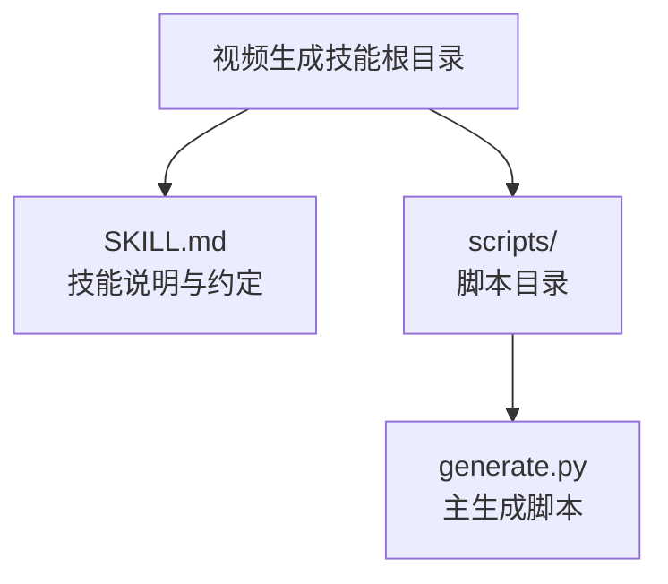
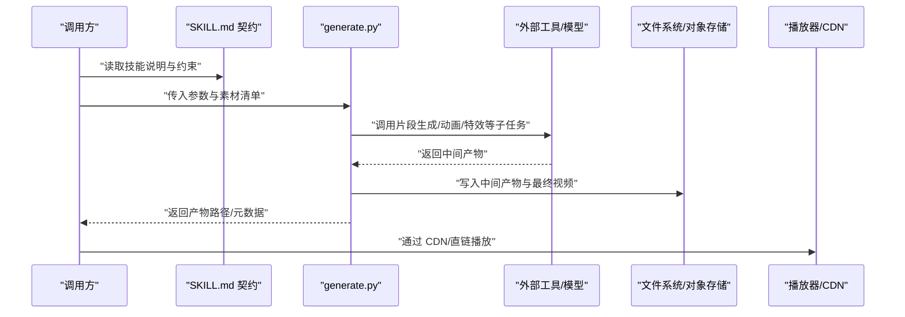
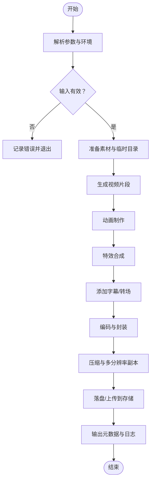
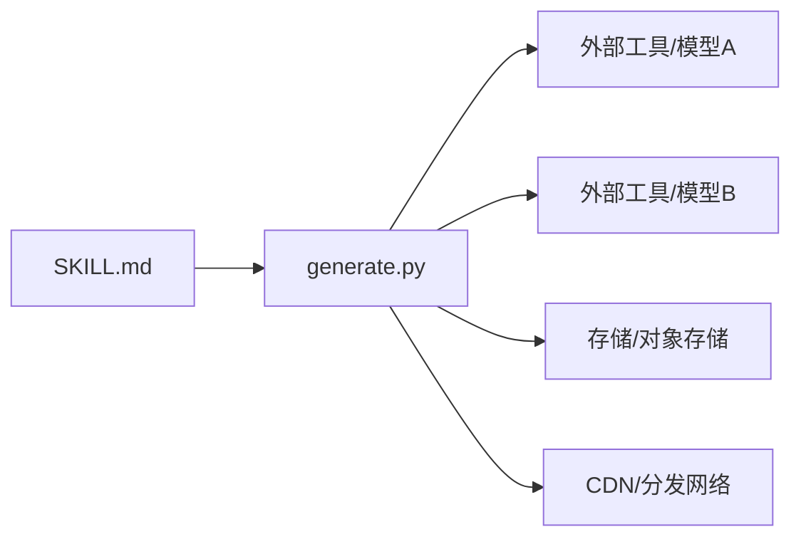

# 视频生成技能

<cite>
**本文引用的文件**   
- [SKILL.md](file://skills/public/video-generation/SKILL.md)
- [generate.py](file://skills/public/video-generation/scripts/generate.py)
</cite>

## 目录
1. [简介](#简介)
2. [项目结构](#项目结构)
3. [核心组件](#核心组件)
4. [架构总览](#架构总览)
5. [详细组件分析](#详细组件分析)
6. [依赖关系分析](#依赖关系分析)
7. [性能考虑](#性能考虑)
8. [故障排查指南](#故障排查指南)
9. [结论](#结论)
10. [附录](#附录)

## 简介
本文件面向“视频生成技能”的高级能力与集成实践，围绕以下目标展开：
- 视频片段生成、动画制作、特效合成等核心能力的说明与使用建议
- 脚本驱动的视频创作流程与自动化工作流设计
- 视频编辑（剪辑、转场、字幕）的落地方案与最佳实践
- 视频编码、格式转换与压缩优化策略
- 视频存储管理、CDN 分发与播放优化
- 与社交媒体平台的内容发布集成思路

说明：当前仓库中提供的视频生成技能以脚本化方式组织，具体实现细节由脚本与技能描述共同定义。下文将基于现有文件进行系统化梳理，并给出可操作的扩展与集成建议。

章节来源
- [SKILL.md](file://skills/public/video-generation/SKILL.md)
- [generate.py](file://skills/public/video-generation/scripts/generate.py)

## 项目结构
视频生成技能位于 skills/public/video-generation 目录下，采用“技能描述 + 脚本”的最小可行结构：
- SKILL.md：技能说明、输入输出约定、使用示例与注意事项
- scripts/generate.py：视频生成的主执行脚本，负责编排调用外部工具或模型、处理中间产物与最终输出

图示来源
- [SKILL.md](file://skills/public/video-generation/SKILL.md)
- [generate.py](file://skills/public/video-generation/scripts/generate.py)

章节来源
- [SKILL.md](file://skills/public/video-generation/SKILL.md)
- [generate.py](file://skills/public/video-generation/scripts/generate.py)

## 核心组件
- 技能入口与契约
  - 通过 SKILL.md 定义技能的职责边界、输入参数、输出产物、错误码与重试策略，确保上层编排器或用户能够稳定调用。
- 生成脚本
  - generate.py 作为统一入口，负责解析参数、加载素材、调度子任务（如片段生成、动画、特效）、合并与导出最终视频。
- 产物与中间态
  - 典型产物包括：分镜/片段、关键帧序列、特效层、字幕轨道、最终视频文件；中间态用于断点续跑与回滚。

章节来源
- [SKILL.md](file://skills/public/video-generation/SKILL.md)
- [generate.py](file://skills/public/video-generation/scripts/generate.py)

## 架构总览
从“脚本驱动”的角度，视频生成技能遵循“输入→编排→渲染→封装→交付”的流水线式架构。下图展示端到端的数据流与关键节点。

图示来源
- [SKILL.md](file://skills/public/video-generation/SKILL.md)
- [generate.py](file://skills/public/video-generation/scripts/generate.py)

## 详细组件分析

### 技能契约（SKILL.md）
- 职责
  - 明确技能名称、版本、作者与维护者信息
  - 定义输入参数（提示词、分辨率、时长、帧率、风格、字幕语言等）
  - 定义输出产物（视频文件、字幕文件、封面图、元数据 JSON）
  - 规定错误类型与恢复策略（超时、资源不足、外部服务不可用）
  - 提供最小可用示例与常见用例
- 建议
  - 将“高级功能开关”纳入契约（如是否启用特效合成、是否生成多分辨率副本）
  - 对敏感配置（API Key、存储凭证）采用环境变量注入，不在文档中硬编码

章节来源
- [SKILL.md](file://skills/public/video-generation/SKILL.md)

### 生成脚本（generate.py）
- 职责
  - 解析命令行参数与环境变量
  - 校验输入与权限
  - 编排子任务：片段生成、动画制作、特效合成、字幕叠加、转场拼接
  - 控制质量与体积：编码参数、码率、分辨率、帧率、容器格式
  - 持久化中间产物，支持断点续跑
  - 输出标准化产物与日志
- 关键流程（概念性流程图）

章节来源
- [generate.py](file://skills/public/video-generation/scripts/generate.py)

### 高级能力说明与实践要点
- 视频片段生成
  - 依据提示词或分镜脚本生成若干片段；建议为每个片段保留独立中间产物，便于局部重算
- 动画制作
  - 支持关键帧动画、形变、缩放、位移等；建议将动画轨迹与素材解耦，复用性强
- 特效合成
  - 支持光效、粒子、遮罩、色彩校正等；建议分层输出，方便后期调整
- 字幕与转场
  - 字幕建议使用标准轨（如 SRT/ASS），转场参数化以便批量替换
- 编码与压缩
  - 推荐 H.264/H.265 编码，按场景选择码率曲线（CBR/VBR/CRF）；按需生成移动端/桌面端不同规格
- 存储与分发
  - 本地磁盘或对象存储均可；上线后接入 CDN，开启缓存与预热
- 播放优化
  - 切片/自适应码率（HLS/DASH）；预取与懒加载；封面图与缩略图先行

[本节为通用实践说明，不直接分析具体文件]

## 依赖关系分析
- 内部依赖
  - SKILL.md 与 generate.py 构成“契约—实现”的最小闭环
- 外部依赖（由脚本决定）
  - 可能涉及：视频编解码库、图像处理库、字幕处理库、对象存储 SDK、第三方生成 API 等
- 耦合与内聚
  - 建议将“外部工具调用”抽象为插件/模块，降低 generate.py 的复杂度，提升可测试性与可替换性

图示来源
- [SKILL.md](file://skills/public/video-generation/SKILL.md)
- [generate.py](file://skills/public/video-generation/scripts/generate.py)

章节来源
- [SKILL.md](file://skills/public/video-generation/SKILL.md)
- [generate.py](file://skills/public/video-generation/scripts/generate.py)

## 性能考虑
- 并行与批处理
  - 片段生成与特效合成尽量并行；I/O 密集阶段使用异步或队列
- 内存与磁盘
  - 大文件采用流式读写；及时清理中间产物，避免磁盘膨胀
- 编码策略
  - 优先 CRF 模式保证主观质量；移动端适当降低码率与分辨率
- 缓存与复用
  - 对相同输入做幂等缓存；关键帧与 LUT 等可复用资源集中管理
- 监控与度量
  - 记录耗时、失败率、文件大小、码率分布，持续优化

[本节为通用指导，不直接分析具体文件]

## 故障排查指南
- 常见问题定位
  - 参数校验失败：检查 SKILL.md 约定的必填项与取值范围
  - 外部服务不可用：查看 generate.py 的错误分支与重试逻辑
  - 磁盘空间不足：监控临时目录与输出目录容量
  - 编码失败：核对编码器、容器、分辨率与码率组合
- 日志与诊断
  - 在关键步骤输出结构化日志（含时间戳、步骤名、输入摘要、耗时）
  - 保留失败时的中间产物快照，便于复现与回溯
- 恢复策略
  - 支持断点续跑：跳过已完成步骤，仅重算失败部分
  - 降级模式：当某特效不可用时，自动切换至轻量方案

章节来源
- [SKILL.md](file://skills/public/video-generation/SKILL.md)
- [generate.py](file://skills/public/video-generation/scripts/generate.py)

## 结论
视频生成技能在当前仓库中以“契约+脚本”的形式呈现，具备清晰的职责边界与可扩展的脚本化工作流。通过完善 SKILL.md 的契约与 generate.py 的编排能力，可以逐步覆盖从片段生成、动画与特效合成，到编码、存储、分发与播放优化的全链路需求，并在此基础上对接社交媒体平台的发布流程。

[本节为总结性内容，不直接分析具体文件]

## 附录
- 快速上手
  - 阅读 SKILL.md 了解输入输出与示例
  - 运行 generate.py 完成一次最小可用的视频生成
- 扩展建议
  - 将外部工具封装为可插拔模块
  - 引入任务队列与状态机，支撑长时任务与可视化进度
  - 增加多分辨率与多语言字幕的批量产出能力

[本节为补充说明，不直接分析具体文件]