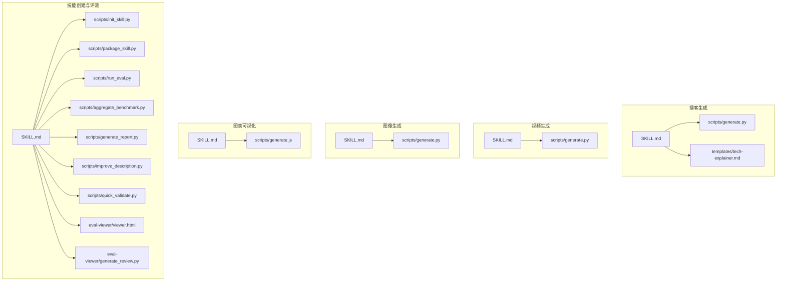
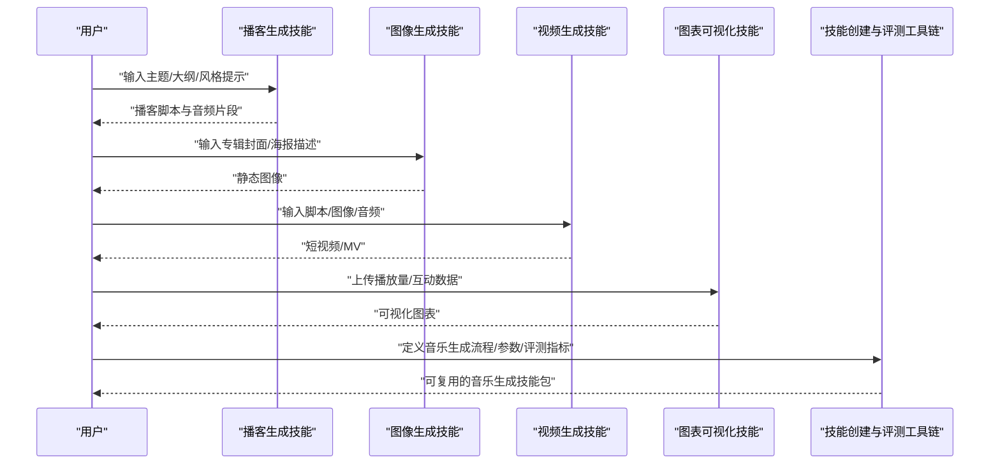
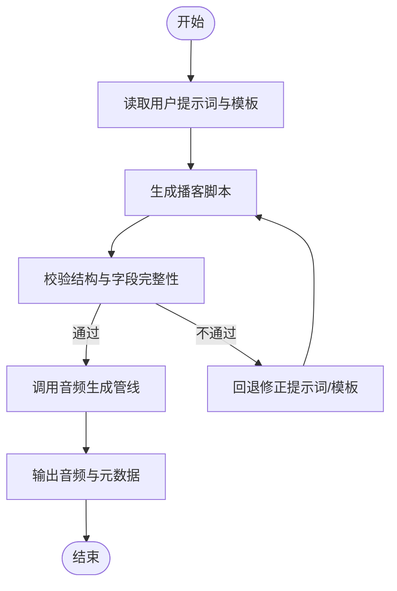
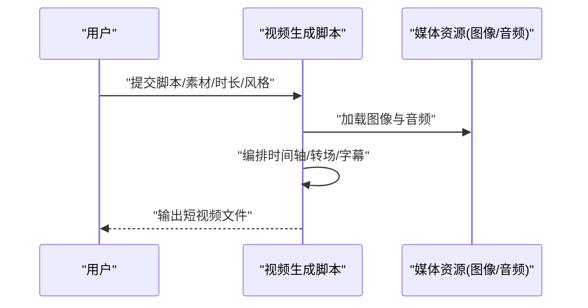
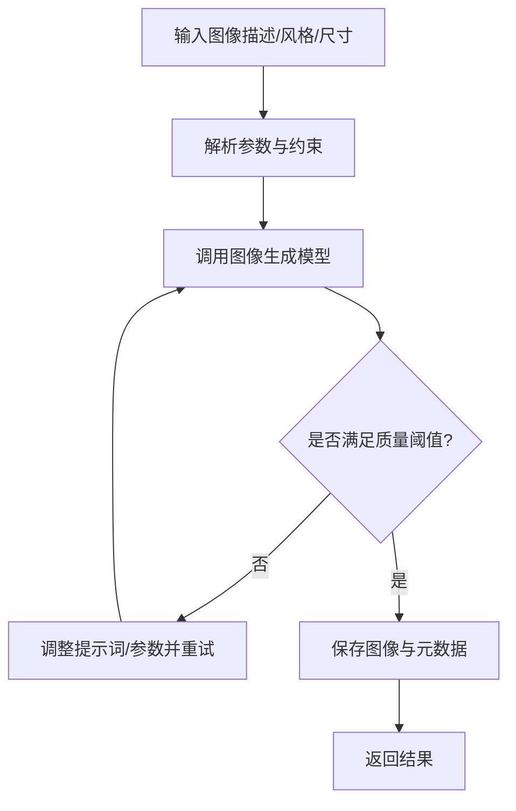
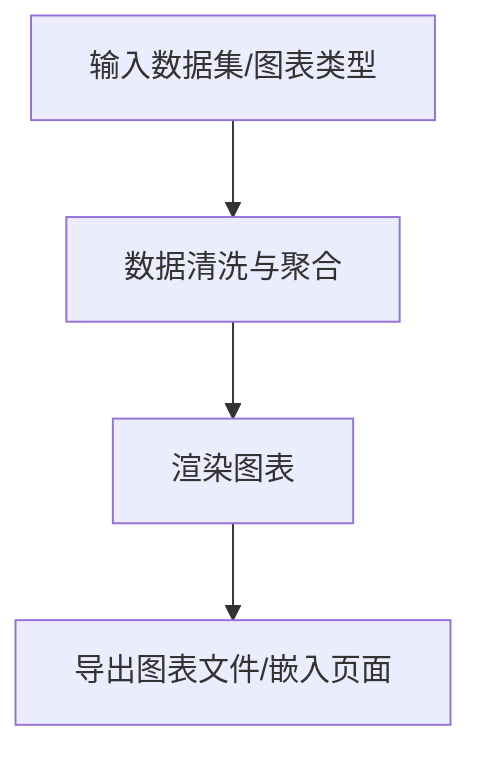
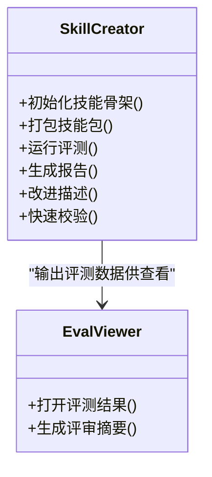
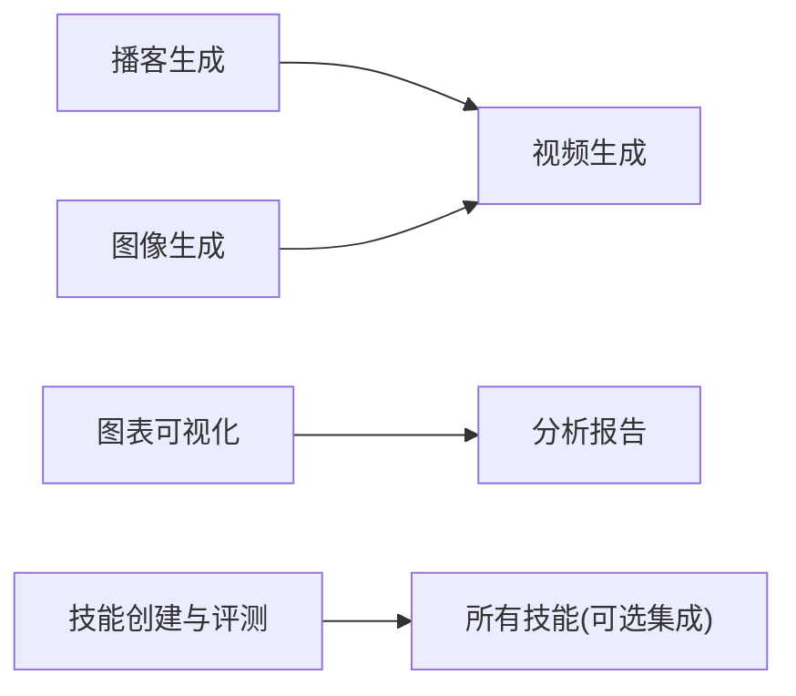

# 音乐生成技能

<cite>
**本文引用的文件**   
- [SKILL.md](file://skills/public/podcast-generation/SKILL.md)
- [generate.py](file://skills/public/podcast-generation/scripts/generate.py)
- [tech-explainer.md](file://skills/public/podcast-generation/templates/tech-explainer.md)
- [SKILL.md](file://skills/public/video-generation/SKILL.md)
- [generate.py](file://skills/public/video-generation/scripts/generate.py)
- [SKILL.md](file://skills/public/image-generation/SKILL.md)
- [generate.py](file://skills/public/image-generation/scripts/generate.py)
- [SKILL.md](file://skills/public/chart-visualization/SKILL.md)
- [generate.js](file://skills/public/chart-visualization/scripts/generate.js)
- [SKILL.md](file://skills/public/skill-creator/SKILL.md)
- [init_skill.py](file://skills/public/skill-creator/scripts/init_skill.py)
- [package_skill.py](file://skills/public/skill-creator/scripts/package_skill.py)
- [run_eval.py](file://skills/public/skill-creator/scripts/run_eval.py)
- [aggregate_benchmark.py](file://skills/public/skill-creator/scripts/aggregate_benchmark.py)
- [generate_report.py](file://skills/public/skill-creator/scripts/generate_report.py)
- [improve_description.py](file://skills/public/skill-creator/scripts/improve_description.py)
- [quick_validate.py](file://skills/public/skill-creator/scripts/quick_validate.py)
- [viewer.html](file://skills/public/skill-creator/eval-viewer/viewer.html)
- [generate_review.py](file://skills/public/skill-creator/eval-viewer/generate_review.py)
</cite>

## 目录
1. [简介](#简介)
2. [项目结构](#项目结构)
3. [核心组件](#核心组件)
4. [架构总览](#架构总览)
5. [详细组件分析](#详细组件分析)
6. [依赖关系分析](#依赖关系分析)
7. [性能与质量建议](#性能与质量建议)
8. [故障排查指南](#故障排查指南)
9. [结论](#结论)
10. [附录](#附录)

## 简介
本文件面向“音乐生成技能”的使用者与集成者，系统梳理在仓库中可复用的音频与多媒体能力边界、使用方法与最佳实践。需要特别说明的是：当前仓库未提供专门的“音乐生成技能”，但提供了播客生成、视频生成、图像生成以及技能创建与评测工具链，这些能力可与音乐创作工作流组合使用，形成从创意到成品的端到端方案。

## 项目结构
围绕音频与多媒体相关能力，仓库中与“音乐生成技能”最相关的目录与文件如下：
- 播客生成技能：包含脚本与模板，可用于语音内容生产，常作为音乐作品的旁白或人声素材来源
- 视频生成技能：用于将文本或图片合成短视频，便于为音乐作品制作可视化封面或 MV
- 图像生成技能：用于生成专辑封面、海报等视觉物料
- 图表可视化技能：用于数据可视化，可作为音乐数据分析（如播放量趋势）的辅助产出
- 技能创建与评测工具链：用于自定义扩展、打包发布与评估，适合构建专属的音乐生成技能

**图示来源**
- [SKILL.md](file://skills/public/podcast-generation/SKILL.md)
- [generate.py](file://skills/public/podcast-generation/scripts/generate.py)
- [tech-explainer.md](file://skills/public/podcast-generation/templates/tech-explainer.md)
- [SKILL.md](file://skills/public/video-generation/SKILL.md)
- [generate.py](file://skills/public/video-generation/scripts/generate.py)
- [SKILL.md](file://skills/public/image-generation/SKILL.md)
- [generate.py](file://skills/public/image-generation/scripts/generate.py)
- [SKILL.md](file://skills/public/chart-visualization/SKILL.md)
- [generate.js](file://skills/public/chart-visualization/scripts/generate.js)
- [SKILL.md](file://skills/public/skill-creator/SKILL.md)
- [init_skill.py](file://skills/public/skill-creator/scripts/init_skill.py)
- [package_skill.py](file://skills/public/skill-creator/scripts/package_skill.py)
- [run_eval.py](file://skills/public/skill-creator/scripts/run_eval.py)
- [aggregate_benchmark.py](file://skills/public/skill-creator/scripts/aggregate_benchmark.py)
- [generate_report.py](file://skills/public/skill-creator/scripts/generate_report.py)
- [improve_description.py](file://skills/public/skill-creator/scripts/improve_description.py)
- [quick_validate.py](file://skills/public/skill-creator/scripts/quick_validate.py)
- [viewer.html](file://skills/public/skill-creator/eval-viewer/viewer.html)
- [generate_review.py](file://skills/public/skill-creator/eval-viewer/generate_review.py)

**章节来源**
- [SKILL.md](file://skills/public/podcast-generation/SKILL.md)
- [generate.py](file://skills/public/podcast-generation/scripts/generate.py)
- [tech-explainer.md](file://skills/public/podcast-generation/templates/tech-explainer.md)
- [SKILL.md](file://skills/public/video-generation/SKILL.md)
- [generate.py](file://skills/public/video-generation/scripts/generate.py)
- [SKILL.md](file://skills/public/image-generation/SKILL.md)
- [generate.py](file://skills/public/image-generation/scripts/generate.py)
- [SKILL.md](file://skills/public/chart-visualization/SKILL.md)
- [generate.js](file://skills/public/chart-visualization/scripts/generate.js)
- [SKILL.md](file://skills/public/skill-creator/SKILL.md)
- [init_skill.py](file://skills/public/skill-creator/scripts/init_skill.py)
- [package_skill.py](file://skills/public/skill-creator/scripts/package_skill.py)
- [run_eval.py](file://skills/public/skill-creator/scripts/run_eval.py)
- [aggregate_benchmark.py](file://skills/public/skill-creator/scripts/aggregate_benchmark.py)
- [generate_report.py](file://skills/public/skill-creator/scripts/generate_report.py)
- [improve_description.py](file://skills/public/skill-creator/scripts/improve_description.py)
- [quick_validate.py](file://skills/public/skill-creator/scripts/quick_validate.py)
- [viewer.html](file://skills/public/skill-creator/eval-viewer/viewer.html)
- [generate_review.py](file://skills/public/skill-creator/eval-viewer/generate_review.py)

## 核心组件
- 播客生成技能：提供脚本与模板，支持基于提示词生成播客脚本并输出音频产物，适合作为人声旁白或对话式内容的基础素材
- 视频生成技能：根据输入材料生成短视频，可用于音乐作品的封面动图、MV 或宣传短片
- 图像生成技能：生成高质量静态图像，适用于专辑封面、海报、社交媒体配图
- 图表可视化技能：将数据转换为图表，便于展示音乐传播效果、用户画像等
- 技能创建与评测工具链：从零搭建自定义技能、打包分发、运行评测与报告生成，支撑音乐生成能力的持续演进

**章节来源**
- [SKILL.md](file://skills/public/podcast-generation/SKILL.md)
- [SKILL.md](file://skills/public/video-generation/SKILL.md)
- [SKILL.md](file://skills/public/image-generation/SKILL.md)
- [SKILL.md](file://skills/public/chart-visualization/SKILL.md)
- [SKILL.md](file://skills/public/skill-creator/SKILL.md)

## 架构总览
下图展示了以“音乐生成技能”为目标的工作流如何复用现有技能：通过播客生成获得人声素材，结合图像与视频生成完成视觉包装，再借助图表可视化进行数据复盘；若需定制专属音乐生成流程，可使用技能创建与评测工具链进行封装与迭代。

[此图为概念性流程图，不直接映射具体源码文件]

## 详细组件分析

### 播客生成技能
- 功能要点
  - 基于提示词生成结构化播客脚本
  - 提供模板用于统一风格与结构
  - 脚本驱动音频生成，便于后续与人声、BGM 混音
- 关键文件
  - 技能说明与使用说明：[SKILL.md](file://skills/public/podcast-generation/SKILL.md)
  - 生成脚本入口：[generate.py](file://skills/public/podcast-generation/scripts/generate.py)
  - 示例模板：[tech-explainer.md](file://skills/public/podcast-generation/templates/tech-explainer.md)

**图示来源**
- [SKILL.md](file://skills/public/podcast-generation/SKILL.md)
- [generate.py](file://skills/public/podcast-generation/scripts/generate.py)
- [tech-explainer.md](file://skills/public/podcast-generation/templates/tech-explainer.md)

**章节来源**
- [SKILL.md](file://skills/public/podcast-generation/SKILL.md)
- [generate.py](file://skills/public/podcast-generation/scripts/generate.py)
- [tech-explainer.md](file://skills/public/podcast-generation/templates/tech-explainer.md)

### 视频生成技能
- 功能要点
  - 将文本、图像与音频合成短视频
  - 支持多素材拼接与转场，适配音乐 MV 与宣传片
- 关键文件
  - 技能说明与使用说明：[SKILL.md](file://skills/public/video-generation/SKILL.md)
  - 生成脚本入口：[generate.py](file://skills/public/video-generation/scripts/generate.py)

**图示来源**
- [SKILL.md](file://skills/public/video-generation/SKILL.md)
- [generate.py](file://skills/public/video-generation/scripts/generate.py)

**章节来源**
- [SKILL.md](file://skills/public/video-generation/SKILL.md)
- [generate.py](file://skills/public/video-generation/scripts/generate.py)

### 图像生成技能
- 功能要点
  - 根据描述生成高质量静态图像
  - 适用于专辑封面、海报、社交配图
- 关键文件
  - 技能说明与使用说明：[SKILL.md](file://skills/public/image-generation/SKILL.md)
  - 生成脚本入口：[generate.py](file://skills/public/image-generation/scripts/generate.py)

**图示来源**
- [SKILL.md](file://skills/public/image-generation/SKILL.md)
- [generate.py](file://skills/public/image-generation/scripts/generate.py)

**章节来源**
- [SKILL.md](file://skills/public/image-generation/SKILL.md)
- [generate.py](file://skills/public/image-generation/scripts/generate.py)

### 图表可视化技能
- 功能要点
  - 将数据转换为多种图表类型，便于音乐数据分析与汇报
- 关键文件
  - 技能说明与使用说明：[SKILL.md](file://skills/public/chart-visualization/SKILL.md)
  - 生成脚本入口：[generate.js](file://skills/public/chart-visualization/scripts/generate.js)

**图示来源**
- [SKILL.md](file://skills/public/chart-visualization/SKILL.md)
- [generate.js](file://skills/public/chart-visualization/scripts/generate.js)

**章节来源**
- [SKILL.md](file://skills/public/chart-visualization/SKILL.md)
- [generate.js](file://skills/public/chart-visualization/scripts/generate.js)

### 技能创建与评测工具链
- 功能要点
  - 初始化技能骨架、打包发布、运行评测、生成报告、改进描述、快速校验、评测查看器
- 关键文件
  - 技能说明与使用说明：[SKILL.md](file://skills/public/skill-creator/SKILL.md)
  - 初始化脚本：[init_skill.py](file://skills/public/skill-creator/scripts/init_skill.py)
  - 打包脚本：[package_skill.py](file://skills/public/skill-creator/scripts/package_skill.py)
  - 评测脚本：[run_eval.py](file://skills/public/skill-creator/scripts/run_eval.py)
  - 基准聚合：[aggregate_benchmark.py](file://skills/public/skill-creator/scripts/aggregate_benchmark.py)
  - 报告生成：[generate_report.py](file://skills/public/skill-creator/scripts/generate_report.py)
  - 描述优化：[improve_description.py](file://skills/public/skill-creator/scripts/improve_description.py)
  - 快速校验：[quick_validate.py](file://skills/public/skill-creator/scripts/quick_validate.py)
  - 评测查看器：[viewer.html](file://skills/public/skill-creator/eval-viewer/viewer.html)、[generate_review.py](file://skills/public/skill-creator/eval-viewer/generate_review.py)

**图示来源**
- [SKILL.md](file://skills/public/skill-creator/SKILL.md)
- [init_skill.py](file://skills/public/skill-creator/scripts/init_skill.py)
- [package_skill.py](file://skills/public/skill-creator/scripts/package_skill.py)
- [run_eval.py](file://skills/public/skill-creator/scripts/run_eval.py)
- [aggregate_benchmark.py](file://skills/public/skill-creator/scripts/aggregate_benchmark.py)
- [generate_report.py](file://skills/public/skill-creator/scripts/generate_report.py)
- [improve_description.py](file://skills/public/skill-creator/scripts/improve_description.py)
- [quick_validate.py](file://skills/public/skill-creator/scripts/quick_validate.py)
- [viewer.html](file://skills/public/skill-creator/eval-viewer/viewer.html)
- [generate_review.py](file://skills/public/skill-creator/eval-viewer/generate_review.py)

**章节来源**
- [SKILL.md](file://skills/public/skill-creator/SKILL.md)
- [init_skill.py](file://skills/public/skill-creator/scripts/init_skill.py)
- [package_skill.py](file://skills/public/skill-creator/scripts/package_skill.py)
- [run_eval.py](file://skills/public/skill-creator/scripts/run_eval.py)
- [aggregate_benchmark.py](file://skills/public/skill-creator/scripts/aggregate_benchmark.py)
- [generate_report.py](file://skills/public/skill-creator/scripts/generate_report.py)
- [improve_description.py](file://skills/public/skill-creator/scripts/improve_description.py)
- [quick_validate.py](file://skills/public/skill-creator/scripts/quick_validate.py)
- [viewer.html](file://skills/public/skill-creator/eval-viewer/viewer.html)
- [generate_review.py](file://skills/public/skill-creator/eval-viewer/generate_review.py)

## 依赖关系分析
- 技能间耦合度低，主要通过“输入/输出产物”协作（脚本、图像、音频、视频、图表）
- 视频与图像生成对媒体资源有较强依赖；播客生成对脚本与模板依赖明显
- 技能创建与评测工具链为上层能力提供工程化支撑，不直接参与媒体生成

[此图为概念性依赖图，不直接映射具体源码文件]

## 性能与质量建议
- 提示词工程
  - 明确目标受众、情绪基调、节奏与段落结构
  - 指定时长、采样率、声道数、响度目标等硬性约束
- 生成策略
  - 先小样后精修：先用短片段验证风格，再扩展到完整曲目
  - 分轨生成：旋律、和声、鼓点、贝斯分层生成，便于后期混音
- 质量控制
  - 设置自动校验（时长、格式、响度、峰值限制）
  - 引入主观评测与客观指标（清晰度、动态范围、频谱均衡）
- 资源管理
  - 缓存中间产物，避免重复计算
  - 批量任务并行化，注意并发上限与队列管理

[本节为通用指导，无需源码引用]

## 故障排查指南
- 常见问题定位
  - 提示词无效：检查模板字段是否齐全、语义是否清晰
  - 生成失败：确认外部模型/服务可用性与配额
  - 产物异常：核对输出格式、编码、采样率与通道配置
- 调试手段
  - 启用日志与中间产物快照
  - 使用快速校验脚本进行前置检查
  - 通过评测查看器定位问题样本

**章节来源**
- [quick_validate.py](file://skills/public/skill-creator/scripts/quick_validate.py)
- [viewer.html](file://skills/public/skill-creator/eval-viewer/viewer.html)
- [generate_review.py](file://skills/public/skill-creator/eval-viewer/generate_review.py)

## 结论
尽管仓库未内置“音乐生成技能”，但通过播客、图像、视频与图表可视化等现成能力，配合技能创建与评测工具链，可以高效构建完整的音乐创作与分发流水线。建议在工程中优先沉淀提示词模板、评测指标与自动化校验，逐步将音乐生成能力封装为可复用的技能包。

## 附录

### 支持的音频格式与音乐风格
- 音频格式
  - 常见无损与有损格式（如 WAV、MP3、FLAC、AAC）通常被广泛支持
  - 建议输出时统一采样率与声道配置，便于后续混音与母带处理
- 音乐风格
  - 流行、摇滚、电子、嘻哈、古典、爵士、世界音乐等均可通过提示词引导
  - 可通过分段提示词控制曲式结构（前奏、主歌、副歌、桥段、尾奏）

[本节为通用指导，无需源码引用]

### 生成参数清单（建议）
- 基础参数
  - 时长、节拍（BPM）、调性、拍号、音色偏好
- 质量参数
  - 采样率、位深、响度目标、峰值限制、动态范围
- 结构参数
  - 段落数量、过渡方式、乐器编排、层次密度

[本节为通用指导，无需源码引用]

### 提示词编写指南与创意技巧
- 结构清晰
  - 明确主题、情绪、场景、受众与用途
  - 指定曲式结构与段落时长
- 细节丰富
  - 描述乐器、音色、织体、律动与空间感
  - 给出参考艺术家或流派特征（避免侵权风险）
- 可执行性
  - 将复杂需求拆分为多步提示词，逐步细化
  - 加入约束条件（如禁用某类音色、限定频率范围）

[本节为通用指导，无需源码引用]

### 音频后期处理、混音与母带制作
- 后期处理
  - 降噪、去齿音、压缩、均衡、混响、延迟
- 混音
  - 平衡各轨音量、声像、动态与频域
  - 自动化包络与侧链压缩
- 母带
  - 整体响度提升、立体声增强、限幅保护
  - 平台响度标准化（如 -14 LUFS 等）

[本节为通用指导，无需源码引用]

### 版权管理与分发策略
- 版权合规
  - 明确训练数据来源与授权范围
  - 标注生成内容与人工修改比例
- 分发渠道
  - 数字音乐平台、播客平台、短视频平台
- 收益与署名
  - 约定署名规则与收益分配
  - 建立版本与变更记录

[本节为通用指导，无需源码引用]

### 与播客生成、视频配乐的集成应用
- 播客+音乐
  - 用播客生成技能产出旁白与对话，叠加背景音乐与音效
- 视频配乐
  - 将生成的音乐与图像/视频素材合成 MV 或宣传片
  - 利用图表可视化呈现传播数据与复盘报告

**章节来源**
- [SKILL.md](file://skills/public/podcast-generation/SKILL.md)
- [SKILL.md](file://skills/public/video-generation/SKILL.md)
- [SKILL.md](file://skills/public/chart-visualization/SKILL.md)