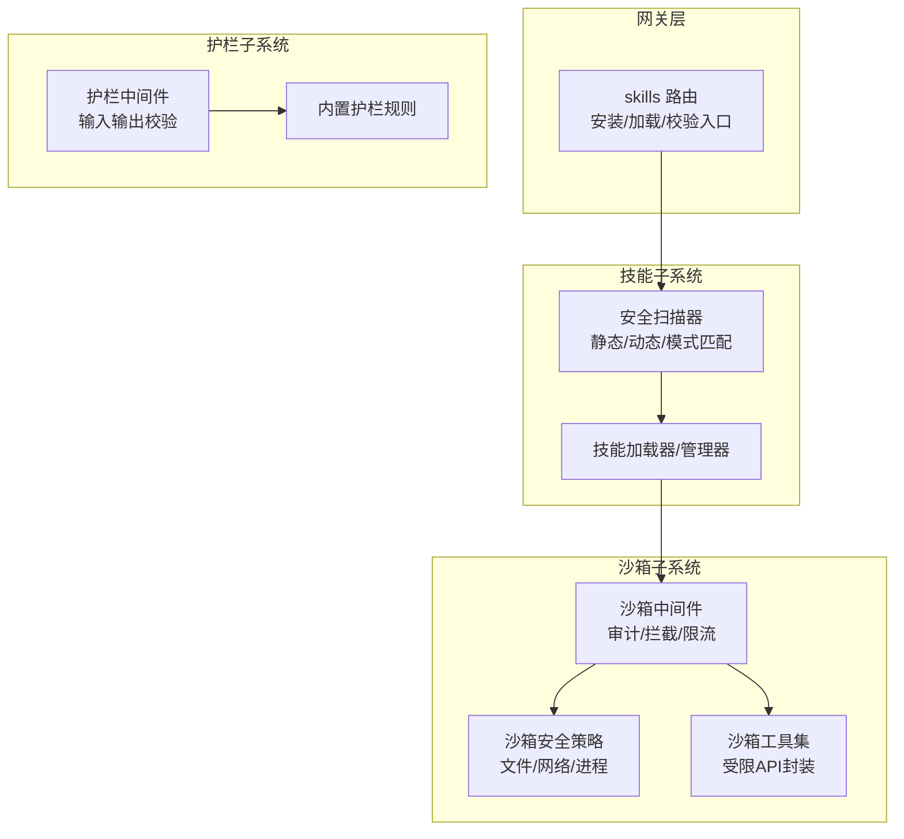
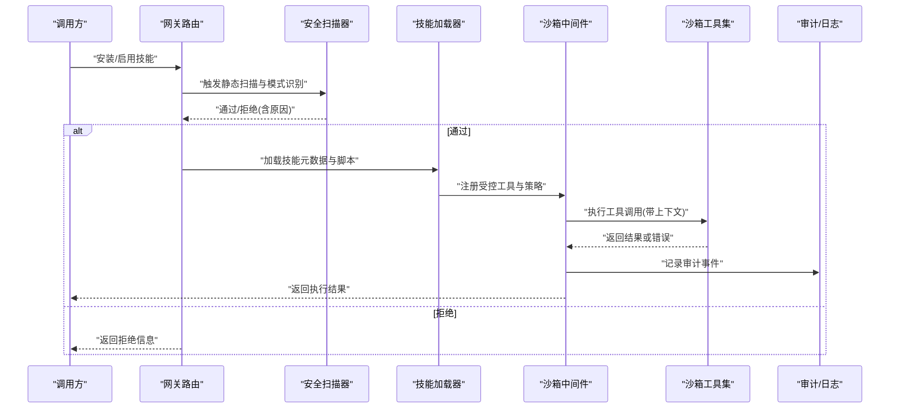
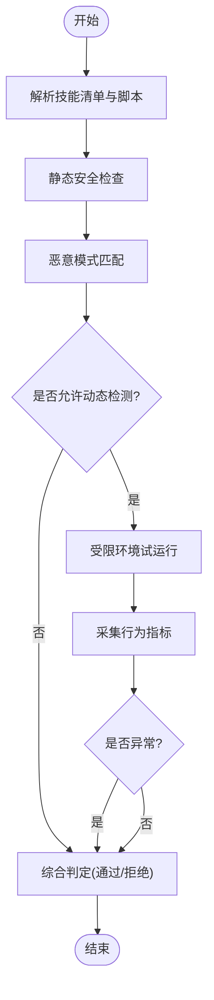
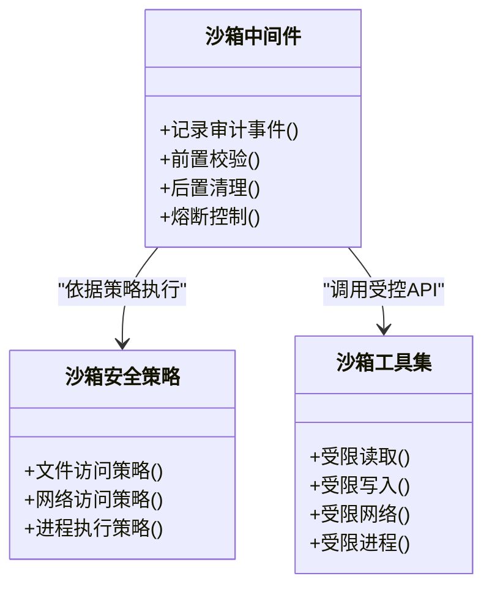
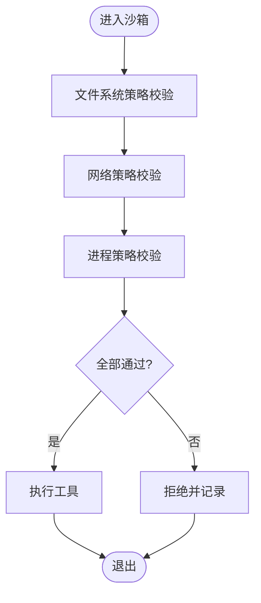
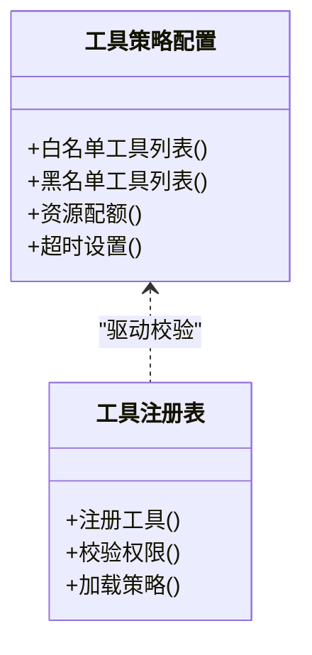
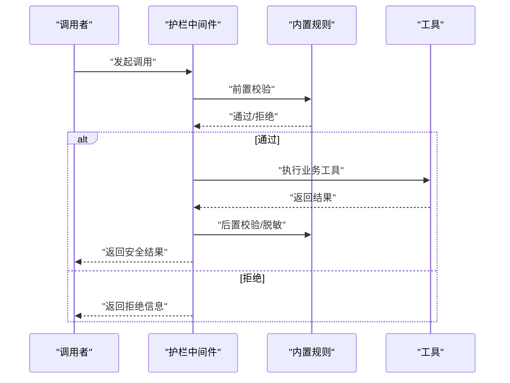
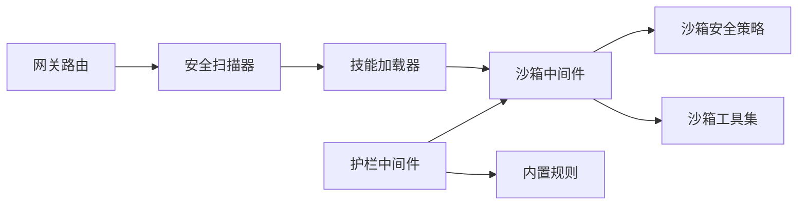

# 技能安全扫描

<cite>
**本文引用的文件**   
- [backend/app/gateway/routers/skills.py](file://backend/app/gateway/routers/skills.py)
- [backend/packages/harness/deerflow/skills/security_scanner.py](file://backend/packages/harness/deerflow/skills/security_scanner.py)
- [backend/packages/harness/deerflow/sandbox/middleware.py](file://backend/packages/harness/deerflow/sandbox/middleware.py)
- [backend/packages/harness/deerflow/sandbox/security.py](file://backend/packages/harness/deerflow/sandbox/security.py)
- [backend/packages/harness/deerflow/sandbox/tools.py](file://backend/packages/harness/deerflow/sandbox/tools.py)
- [backend/packages/harness/deerflow/config/sandbox_config.py](file://backend/packages/harness/deerflow/config/sandbox_config.py)
- [backend/packages/harness/deerflow/config/tool_config.py](file://backend/packages/harness/deerflow/config/tool_config.py)
- [backend/packages/harness/deerflow/guardrails/middleware.py](file://backend/packages/harness/deerflow/guardrails/middleware.py)
- [backend/packages/harness/deerflow/guardrails/builtin.py](file://backend/packages/harness/deerflow/guardrails/builtin.py)
- [backend/tests/test_security_scanner.py](file://backend/tests/test_security_scanner.py)
- [backend/tests/test_sandbox_tools_security.py](file://backend/tests/test_sandbox_tools_security.py)
- [backend/tests/test_sandbox_audit_middleware.py](file://backend/tests/test_sandbox_audit_middleware.py)
</cite>

## 目录
1. [简介](#简介)
2. [项目结构](#项目结构)
3. [核心组件](#核心组件)
4. [架构总览](#架构总览)
5. [详细组件分析](#详细组件分析)
6. [依赖关系分析](#依赖关系分析)
7. [性能考量](#性能考量)
8. [故障排查指南](#故障排查指南)
9. [结论](#结论)
10. [附录](#附录)

## 简介
本文件聚焦 DeerFlow 的“技能安全扫描与防护机制”，围绕以下目标展开：
- 安全扫描器实现原理：静态代码分析、动态行为检测、恶意模式识别
- 工具策略控制：权限管理、资源限制、访问控制
- 沙箱安全机制：执行环境隔离、文件系统保护、网络访问控制
- 安全策略配置：白名单/黑名单、自定义规则
- 安全审计与日志记录：使用方法与最佳实践
- 威胁分析与防护措施：帮助开发者构建安全的技能应用

## 项目结构
与安全相关的核心模块分布在后端网关路由、技能子系统、沙箱子系统、护栏（Guardrails）子系统以及测试用例中。下图给出概念性结构，便于理解各层职责与交互。

[此图为概念性结构图，不直接映射具体源码文件，故无图表来源]

## 核心组件
- 安全扫描器：负责在技能安装/加载阶段进行静态检查与动态行为探测，并基于规则库进行恶意模式识别。
- 沙箱中间件：在执行期对工具调用进行审计、拦截与资源限制，保障运行环境安全。
- 沙箱安全策略：定义文件系统、网络、进程等资源的访问边界与约束。
- 沙箱工具集：提供受控的 API 封装，屏蔽危险系统调用。
- 护栏中间件与内置规则：对输入/输出进行二次校验，阻断注入与越权风险。

章节来源
- [backend/app/gateway/routers/skills.py](file://backend/app/gateway/routers/skills.py)
- [backend/packages/harness/deerflow/skills/security_scanner.py](file://backend/packages/harness/deerflow/skills/security_scanner.py)
- [backend/packages/harness/deerflow/sandbox/middleware.py](file://backend/packages/harness/deerflow/sandbox/middleware.py)
- [backend/packages/harness/deerflow/sandbox/security.py](file://backend/packages/harness/deerflow/sandbox/security.py)
- [backend/packages/harness/deerflow/sandbox/tools.py](file://backend/packages/harness/deerflow/sandbox/tools.py)
- [backend/packages/harness/deerflow/guardrails/middleware.py](file://backend/packages/harness/deerflow/guardrails/middleware.py)
- [backend/packages/harness/deerflow/guardrails/builtin.py](file://backend/packages/harness/deerflow/guardrails/builtin.py)

## 架构总览
从请求到执行的端到端安全路径如下：

图表来源
- [backend/app/gateway/routers/skills.py](file://backend/app/gateway/routers/skills.py)
- [backend/packages/harness/deerflow/skills/security_scanner.py](file://backend/packages/harness/deerflow/skills/security_scanner.py)
- [backend/packages/harness/deerflow/sandbox/middleware.py](file://backend/packages/harness/deerflow/sandbox/middleware.py)
- [backend/packages/harness/deerflow/sandbox/tools.py](file://backend/packages/harness/deerflow/sandbox/tools.py)

## 详细组件分析

### 安全扫描器（静态/动态/模式识别）
- 静态代码分析
  - 解析技能清单与脚本，提取导入、函数签名、外部依赖声明
  - 检查危险 API 使用、硬编码凭据、敏感路径访问
- 动态行为检测
  - 在受限环境中试运行关键脚本，观测网络、文件、进程行为
  - 采集运行时指标（CPU/内存/IO/网络），用于异常判定
- 恶意模式识别
  - 基于规则库进行正则/语法树匹配，识别常见攻击面（如命令注入、SSRF、路径遍历）
  - 支持白名单/黑名单与自定义规则扩展

图表来源
- [backend/packages/harness/deerflow/skills/security_scanner.py](file://backend/packages/harness/deerflow/skills/security_scanner.py)

章节来源
- [backend/packages/harness/deerflow/skills/security_scanner.py](file://backend/packages/harness/deerflow/skills/security_scanner.py)
- [backend/tests/test_security_scanner.py](file://backend/tests/test_security_scanner.py)

### 沙箱中间件（执行期审计与拦截）
- 审计与日志
  - 记录每次工具调用的入参、出参、耗时、资源消耗与上下文标识
  - 支持按技能/用户/会话维度聚合统计
- 拦截与熔断
  - 对高风险操作进行前置拦截（如写盘、外网访问）
  - 超限自动熔断，避免雪崩
- 资源限制
  - CPU/内存/时间/并发数上限，防止滥用

图表来源
- [backend/packages/harness/deerflow/sandbox/middleware.py](file://backend/packages/harness/deerflow/sandbox/middleware.py)
- [backend/packages/harness/deerflow/sandbox/security.py](file://backend/packages/harness/deerflow/sandbox/security.py)
- [backend/packages/harness/deerflow/sandbox/tools.py](file://backend/packages/harness/deerflow/sandbox/tools.py)

章节来源
- [backend/packages/harness/deerflow/sandbox/middleware.py](file://backend/packages/harness/deerflow/sandbox/middleware.py)
- [backend/packages/harness/deerflow/sandbox/security.py](file://backend/packages/harness/deerflow/sandbox/security.py)
- [backend/packages/harness/deerflow/sandbox/tools.py](file://backend/packages/harness/deerflow/sandbox/tools.py)
- [backend/tests/test_sandbox_audit_middleware.py](file://backend/tests/test_sandbox_audit_middleware.py)
- [backend/tests/test_sandbox_tools_security.py](file://backend/tests/test_sandbox_tools_security.py)

### 沙箱安全策略（文件系统/网络/进程）
- 文件系统保护
  - 只读挂载、白名单目录、禁止符号链接逃逸
- 网络访问控制
  - 域名/IP 白名单、端口限制、禁止内网穿透
- 进程执行限制
  - 禁用危险命令、限制子进程数量与生命周期

图表来源
- [backend/packages/harness/deerflow/sandbox/security.py](file://backend/packages/harness/deerflow/sandbox/security.py)
- [backend/packages/harness/deerflow/config/sandbox_config.py](file://backend/packages/harness/deerflow/config/sandbox_config.py)

章节来源
- [backend/packages/harness/deerflow/sandbox/security.py](file://backend/packages/harness/deerflow/sandbox/security.py)
- [backend/packages/harness/deerflow/config/sandbox_config.py](file://backend/packages/harness/deerflow/config/sandbox_config.py)

### 工具策略控制（权限/资源/访问）
- 权限管理
  - 工具级最小权限原则，按需授予读写/网络/进程能力
- 资源限制
  - 单工具实例的资源配额与超时控制
- 访问控制
  - 基于角色/租户的工具可见性与调用许可

图表来源
- [backend/packages/harness/deerflow/config/tool_config.py](file://backend/packages/harness/deerflow/config/tool_config.py)
- [backend/packages/harness/deerflow/sandbox/tools.py](file://backend/packages/harness/deerflow/sandbox/tools.py)

章节来源
- [backend/packages/harness/deerflow/config/tool_config.py](file://backend/packages/harness/deerflow/config/tool_config.py)
- [backend/packages/harness/deerflow/sandbox/tools.py](file://backend/packages/harness/deerflow/sandbox/tools.py)

### 护栏（Guardrails）与内置规则
- 护栏中间件
  - 在工具调用前后插入校验逻辑，统一处理异常与脱敏
- 内置规则
  - 输入参数合法性、输出长度/格式限制、敏感信息过滤

图表来源
- [backend/packages/harness/deerflow/guardrails/middleware.py](file://backend/packages/harness/deerflow/guardrails/middleware.py)
- [backend/packages/harness/deerflow/guardrails/builtin.py](file://backend/packages/harness/deerflow/guardrails/builtin.py)

章节来源
- [backend/packages/harness/deerflow/guardrails/middleware.py](file://backend/packages/harness/deerflow/guardrails/middleware.py)
- [backend/packages/harness/deerflow/guardrails/builtin.py](file://backend/packages/harness/deerflow/guardrails/builtin.py)

### 安全策略配置方法（白名单/黑名单/自定义规则）
- 白名单
  - 仅允许已审核的技能/工具/域名/IP 被使用
- 黑名单
  - 显式禁止高危 API、危险命令、可疑模式
- 自定义规则
  - 基于规则引擎扩展新的检测项与拦截条件
- 配置生效范围
  - 全局/租户/技能级别的多级覆盖

章节来源
- [backend/packages/harness/deerflow/config/sandbox_config.py](file://backend/packages/harness/deerflow/config/sandbox_config.py)
- [backend/packages/harness/deerflow/config/tool_config.py](file://backend/packages/harness/deerflow/config/tool_config.py)

### 安全审计与日志记录
- 审计内容
  - 调用主体、技能ID、工具名、入参摘要、出参摘要、耗时、资源用量、策略命中情况
- 日志分级
  - INFO/WARN/ERROR 分层记录，便于检索与告警
- 合规留存
  - 按策略保留周期归档，支持导出与查询

章节来源
- [backend/packages/harness/deerflow/sandbox/middleware.py](file://backend/packages/harness/deerflow/sandbox/middleware.py)
- [backend/tests/test_sandbox_audit_middleware.py](file://backend/tests/test_sandbox_audit_middleware.py)

## 依赖关系分析
- 组件耦合
  - 网关路由依赖安全扫描器；扫描器与技能加载器协作；加载器向沙箱中间件注册工具；中间件依赖安全策略与工具集；护栏中间件贯穿调用链路
- 外部依赖
  - 配置中心（沙箱/工具配置）、日志/审计存储、规则库
- 潜在循环
  - 通过明确分层与接口契约避免循环依赖

图表来源
- [backend/app/gateway/routers/skills.py](file://backend/app/gateway/routers/skills.py)
- [backend/packages/harness/deerflow/skills/security_scanner.py](file://backend/packages/harness/deerflow/skills/security_scanner.py)
- [backend/packages/harness/deerflow/sandbox/middleware.py](file://backend/packages/harness/deerflow/sandbox/middleware.py)
- [backend/packages/harness/deerflow/sandbox/security.py](file://backend/packages/harness/deerflow/sandbox/security.py)
- [backend/packages/harness/deerflow/sandbox/tools.py](file://backend/packages/harness/deerflow/sandbox/tools.py)
- [backend/packages/harness/deerflow/guardrails/middleware.py](file://backend/packages/harness/deerflow/guardrails/middleware.py)
- [backend/packages/harness/deerflow/guardrails/builtin.py](file://backend/packages/harness/deerflow/guardrails/builtin.py)

章节来源
- [backend/app/gateway/routers/skills.py](file://backend/app/gateway/routers/skills.py)
- [backend/packages/harness/deerflow/skills/security_scanner.py](file://backend/packages/harness/deerflow/skills/security_scanner.py)
- [backend/packages/harness/deerflow/sandbox/middleware.py](file://backend/packages/harness/deerflow/sandbox/middleware.py)
- [backend/packages/harness/deerflow/sandbox/security.py](file://backend/packages/harness/deerflow/sandbox/security.py)
- [backend/packages/harness/deerflow/sandbox/tools.py](file://backend/packages/harness/deerflow/sandbox/tools.py)
- [backend/packages/harness/deerflow/guardrails/middleware.py](file://backend/packages/harness/deerflow/guardrails/middleware.py)
- [backend/packages/harness/deerflow/guardrails/builtin.py](file://backend/packages/harness/deerflow/guardrails/builtin.py)

## 性能考量
- 扫描阶段
  - 静态分析优先，动态检测仅在必要时启用，避免阻塞安装流程
- 执行阶段
  - 沙箱中间件采用轻量拦截与批量化审计，减少额外开销
  - 合理设置超时与熔断阈值，避免长尾任务拖垮服务
- 资源隔离
  - 为每个技能/工具实例分配独立配额，防止相互影响

[本节为通用指导，无需章节来源]

## 故障排查指南
- 常见问题定位
  - 扫描失败：查看扫描器日志与规则命中详情
  - 工具被拒：核对工具白名单与权限策略
  - 沙箱拦截：检查文件/网络/进程策略与审计日志
  - 护栏拒绝：确认输入/输出是否符合内置规则
- 建议步骤
  - 开启更细粒度的审计日志
  - 逐步放宽策略以复现问题，再收紧至最小可用集合
  - 使用测试用例验证策略变更的影响面

章节来源
- [backend/tests/test_security_scanner.py](file://backend/tests/test_security_scanner.py)
- [backend/tests/test_sandbox_tools_security.py](file://backend/tests/test_sandbox_tools_security.py)
- [backend/tests/test_sandbox_audit_middleware.py](file://backend/tests/test_sandbox_audit_middleware.py)

## 结论
DeerFlow 将“事前扫描+事中管控+事后审计”的安全闭环融入技能全生命周期：在安装/加载阶段通过静态与动态扫描识别风险，在执行期由沙箱中间件与护栏规则实施强约束，并通过完善的审计日志支撑可观测与合规。配合白名单/黑名单与自定义规则，可有效降低恶意技能与不安全工具带来的威胁面。

[本节为总结性内容，无需章节来源]

## 附录
- 术语
  - 技能：可被平台加载与执行的功能单元
  - 工具：在沙箱中受控运行的原子能力
  - 护栏：对输入/输出的二次校验与净化机制
- 参考
  - 相关测试用例可作为策略与行为的权威说明

[本节为补充说明，无需章节来源]