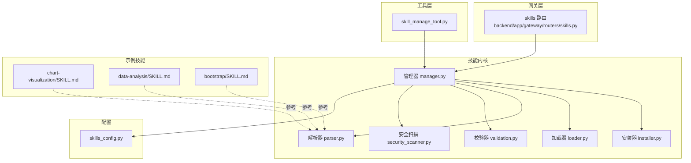
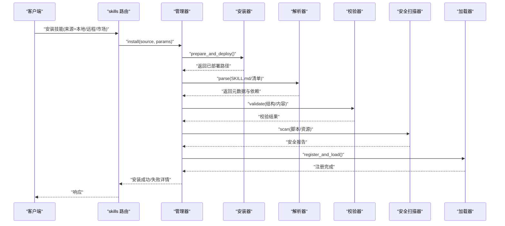
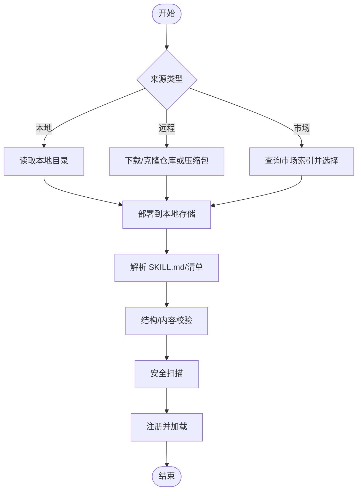
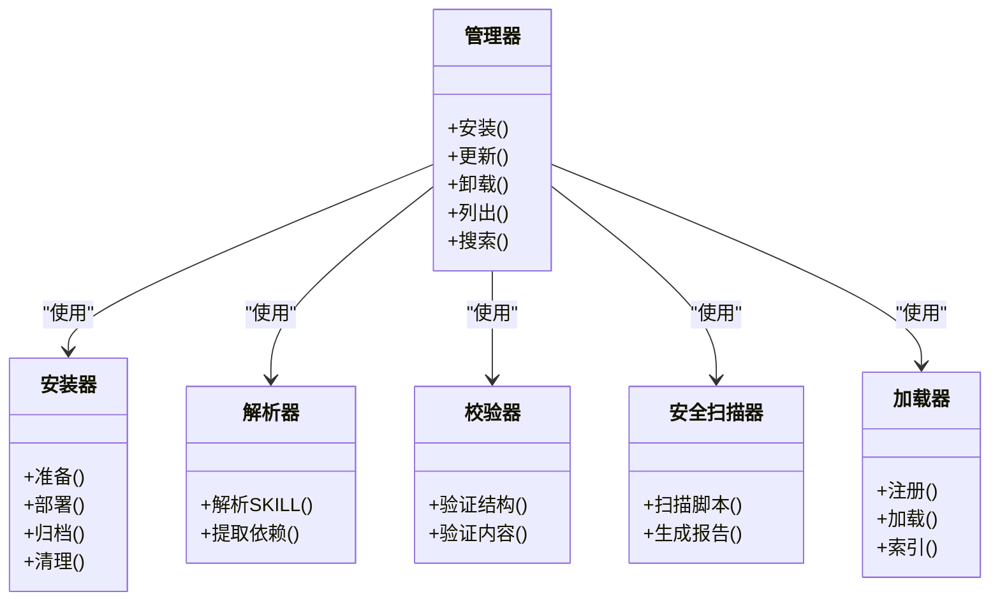
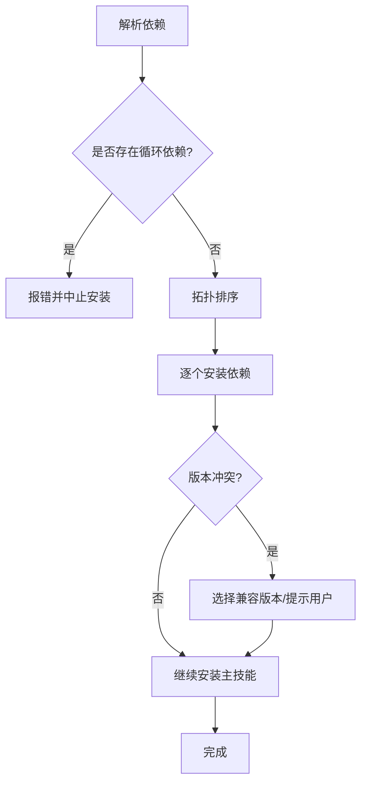
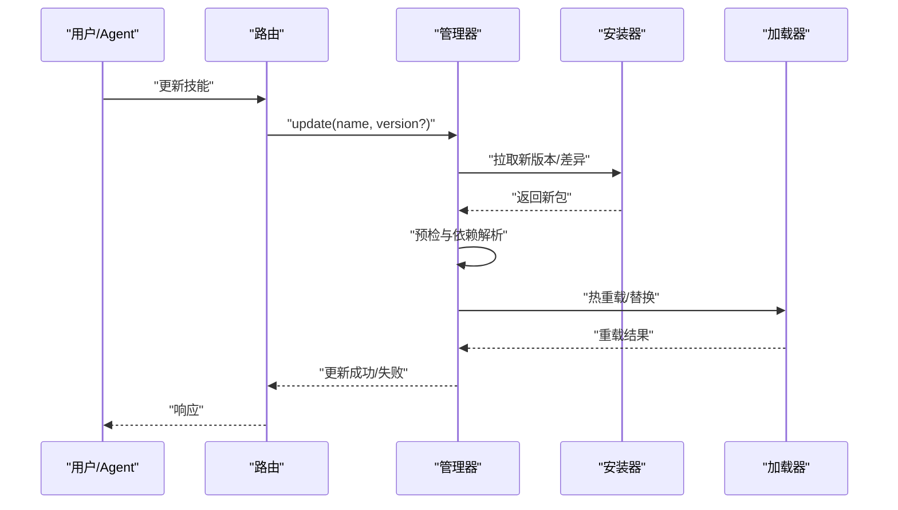
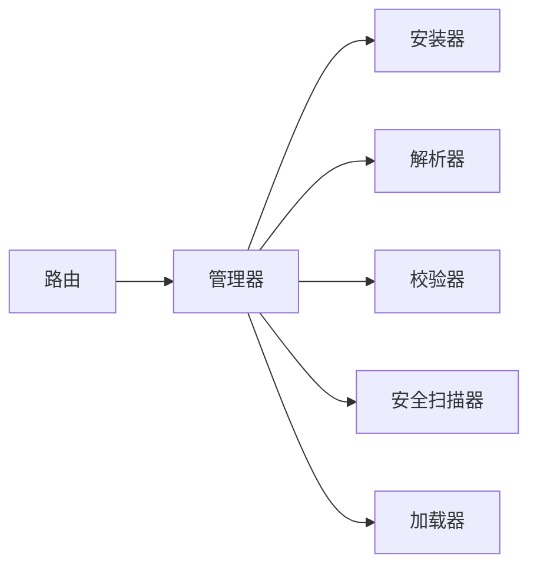

# 技能安装与管理

<cite>
**本文引用的文件**   
- [backend/app/gateway/routers/skills.py](file://backend/app/gateway/routers/skills.py)
- [backend/packages/harness/deerflow/skills/manager.py](file://backend/packages/harness/deerflow/skills/manager.py)
- [backend/packages/harness/deerflow/skills/installer.py](file://backend/packages/harness/deerflow/skills/installer.py)
- [backend/packages/harness/deerflow/skills/loader.py](file://backend/packages/harness/deerflow/skills/loader.py)
- [backend/packages/harness/deerflow/skills/parser.py](file://backend/packages/harness/deerflow/skills/parser.py)
- [backend/packages/harness/deerflow/skills/validation.py](file://backend/packages/harness/deerflow/skills/validation.py)
- [backend/packages/harness/deerflow/skills/security_scanner.py](file://backend/packages/harness/deerflow/skills/security_scanner.py)
- [backend/packages/harness/deerflow/config/skills_config.py](file://backend/packages/harness/deerflow/config/skills_config.py)
- [backend/packages/harness/deerflow/tools/skill_manage_tool.py](file://backend/packages/harness/deerflow/tools/skill_manage_tool.py)
- [backend/tests/test_skills_installer.py](file://backend/tests/test_skills_installer.py)
- [backend/tests/test_skills_loader.py](file://backend/tests/test_skills_loader.py)
- [backend/tests/test_skills_parser.py](file://backend/tests/test_skills_parser.py)
- [backend/tests/test_skills_validation.py](file://backend/tests/test_skills_validation.py)
- [backend/tests/test_security_scanner.py](file://backend/tests/test_security_scanner.py)
- [skills/public/chart-visualization/SKILL.md](file://skills/public/chart-visualization/SKILL.md)
- [skills/public/data-analysis/SKILL.md](file://skills/public/data-analysis/SKILL.md)
- [skills/public/bootstrap/SKILL.md](file://skills/public/bootstrap/SKILL.md)
</cite>

## 目录
1. [简介](#简介)
2. [项目结构](#项目结构)
3. [核心组件](#核心组件)
4. [架构总览](#架构总览)
5. [详细组件分析](#详细组件分析)
6. [依赖关系分析](#依赖关系分析)
7. [性能考虑](#性能考虑)
8. [故障排除指南](#故障排除指南)
9. [结论](#结论)
10. [附录](#附录)

## 简介
本文件系统性说明 DeerFlow 的“技能”安装与管理机制，覆盖以下主题：
- 安装来源与流程：本地文件系统、远程仓库、技能市场（通过后端 API）
- 存储架构：本地持久化与用户隔离策略
- 版本控制：版本管理、依赖解析与冲突解决
- 生命周期：安装、更新、卸载、备份与恢复
- 配置管理：全局配置与用户级配置
- 搜索与发现：如何快速定位可用技能
- 故障排除与性能优化建议

## 项目结构
DeerFlow 的技能系统由后端网关路由、技能管理器、安装器、加载器、解析器、校验器与安全扫描器等模块组成，并通过工具层暴露给上层调用方。公共示例技能位于 skills/public 下，便于参考 SKILL.md 规范与脚本组织方式。

图表来源
- [backend/app/gateway/routers/skills.py](file://backend/app/gateway/routers/skills.py)
- [backend/packages/harness/deerflow/skills/manager.py](file://backend/packages/harness/deerflow/skills/manager.py)
- [backend/packages/harness/deerflow/skills/installer.py](file://backend/packages/harness/deerflow/skills/installer.py)
- [backend/packages/harness/deerflow/skills/loader.py](file://backend/packages/harness/deerflow/skills/loader.py)
- [backend/packages/harness/deerflow/skills/parser.py](file://backend/packages/harness/deerflow/skills/parser.py)
- [backend/packages/harness/deerflow/skills/validation.py](file://backend/packages/harness/deerflow/skills/validation.py)
- [backend/packages/harness/deerflow/skills/security_scanner.py](file://backend/packages/harness/deerflow/skills/security_scanner.py)
- [backend/packages/harness/deerflow/config/skills_config.py](file://backend/packages/harness/deerflow/config/skills_config.py)
- [backend/packages/harness/deerflow/tools/skill_manage_tool.py](file://backend/packages/harness/deerflow/tools/skill_manage_tool.py)
- [skills/public/chart-visualization/SKILL.md](file://skills/public/chart-visualization/SKILL.md)
- [skills/public/data-analysis/SKILL.md](file://skills/public/data-analysis/SKILL.md)
- [skills/public/bootstrap/SKILL.md](file://skills/public/bootstrap/SKILL.md)

章节来源
- [backend/app/gateway/routers/skills.py](file://backend/app/gateway/routers/skills.py)
- [backend/packages/harness/deerflow/skills/manager.py](file://backend/packages/harness/deerflow/skills/manager.py)
- [backend/packages/harness/deerflow/skills/installer.py](file://backend/packages/harness/deerflow/skills/installer.py)
- [backend/packages/harness/deerflow/skills/loader.py](file://backend/packages/harness/deerflow/skills/loader.py)
- [backend/packages/harness/deerflow/skills/parser.py](file://backend/packages/harness/deerflow/skills/parser.py)
- [backend/packages/harness/deerflow/skills/validation.py](file://backend/packages/harness/deerflow/skills/validation.py)
- [backend/packages/harness/deerflow/skills/security_scanner.py](file://backend/packages/harness/deerflow/skills/security_scanner.py)
- [backend/packages/harness/deerflow/config/skills_config.py](file://backend/packages/harness/deerflow/config/skills_config.py)
- [backend/packages/harness/deerflow/tools/skill_manage_tool.py](file://backend/packages/harness/deerflow/tools/skill_manage_tool.py)
- [skills/public/chart-visualization/SKILL.md](file://skills/public/chart-visualization/SKILL.md)
- [skills/public/data-analysis/SKILL.md](file://skills/public/data-analysis/SKILL.md)
- [skills/public/bootstrap/SKILL.md](file://skills/public/bootstrap/SKILL.md)

## 核心组件
- 网关路由（skills 路由）：对外暴露技能的查询、安装、更新、卸载等接口，统一鉴权与参数校验后委派给管理器。
- 管理器（manager）：协调安装、加载、解析、校验、安全扫描、版本与依赖处理，维护技能元数据与状态。
- 安装器（installer）：负责从不同来源拉取或复制技能包，执行解压、归档、部署到目标目录等操作。
- 加载器（loader）：将已安装的技能目录映射为运行时可用的技能对象，提供按名称/标签/版本的检索能力。
- 解析器（parser）：解析 SKILL.md 及可选清单文件，提取元数据、依赖、脚本、模板等信息。
- 校验器（validation）：对技能结构与内容做完整性与合规性检查。
- 安全扫描器（security_scanner）：对脚本与资源进行静态安全检查，阻断高风险操作。
- 配置（skills_config）：集中管理技能相关的全局与用户级配置项。
- 工具（skill_manage_tool）：在 Agent 工作流中提供可被调用的技能管理能力。

章节来源
- [backend/packages/harness/deerflow/skills/manager.py](file://backend/packages/harness/deerflow/skills/manager.py)
- [backend/packages/harness/deerflow/skills/installer.py](file://backend/packages/harness/deerflow/skills/installer.py)
- [backend/packages/harness/deerflow/skills/loader.py](file://backend/packages/harness/deerflow/skills/loader.py)
- [backend/packages/harness/deerflow/skills/parser.py](file://backend/packages/harness/deerflow/skills/parser.py)
- [backend/packages/harness/deerflow/skills/validation.py](file://backend/packages/harness/deerflow/skills/validation.py)
- [backend/packages/harness/deerflow/skills/security_scanner.py](file://backend/packages/harness/deerflow/skills/security_scanner.py)
- [backend/packages/harness/deerflow/config/skills_config.py](file://backend/packages/harness/deerflow/config/skills_config.py)
- [backend/packages/harness/deerflow/tools/skill_manage_tool.py](file://backend/packages/harness/deerflow/tools/skill_manage_tool.py)

## 架构总览
下图展示了从前端或外部客户端发起请求到技能安装完成的端到端流程，涵盖多来源安装路径与关键校验环节。

图表来源
- [backend/app/gateway/routers/skills.py](file://backend/app/gateway/routers/skills.py)
- [backend/packages/harness/deerflow/skills/manager.py](file://backend/packages/harness/deerflow/skills/manager.py)
- [backend/packages/harness/deerflow/skills/installer.py](file://backend/packages/harness/deerflow/skills/installer.py)
- [backend/packages/harness/deerflow/skills/parser.py](file://backend/packages/harness/deerflow/skills/parser.py)
- [backend/packages/harness/deerflow/skills/validation.py](file://backend/packages/harness/deerflow/skills/validation.py)
- [backend/packages/harness/deerflow/skills/security_scanner.py](file://backend/packages/harness/deerflow/skills/security_scanner.py)
- [backend/packages/harness/deerflow/skills/loader.py](file://backend/packages/harness/deerflow/skills/loader.py)

## 详细组件分析

### 安装来源与流程
- 本地文件系统安装
  - 支持从本地目录直接安装，要求包含规范的 SKILL.md 与必要资源。
  - 安装器会复制并归档至本地存储，随后进入解析与校验流程。
- 远程仓库安装
  - 支持从 Git 仓库或压缩包 URL 拉取，安装器负责下载、解压与部署。
  - 网络异常、权限不足、证书问题等错误在安装阶段捕获并上报。
- 技能市场安装
  - 通过后端 API 访问“市场索引”，选择目标技能后走统一安装流程。
  - 市场侧通常提供版本、依赖、描述与预览信息，便于发现与对比。

图表来源
- [backend/packages/harness/deerflow/skills/installer.py](file://backend/packages/harness/deerflow/skills/installer.py)
- [backend/packages/harness/deerflow/skills/parser.py](file://backend/packages/harness/deerflow/skills/parser.py)
- [backend/packages/harness/deerflow/skills/validation.py](file://backend/packages/harness/deerflow/skills/validation.py)
- [backend/packages/harness/deerflow/skills/security_scanner.py](file://backend/packages/harness/deerflow/skills/security_scanner.py)
- [backend/packages/harness/deerflow/skills/loader.py](file://backend/packages/harness/deerflow/skills/loader.py)

章节来源
- [backend/packages/harness/deerflow/skills/installer.py](file://backend/packages/harness/deerflow/skills/installer.py)
- [backend/packages/harness/deerflow/skills/parser.py](file://backend/packages/harness/deerflow/skills/parser.py)
- [backend/packages/harness/deerflow/skills/validation.py](file://backend/packages/harness/deerflow/skills/validation.py)
- [backend/packages/harness/deerflow/skills/security_scanner.py](file://backend/packages/harness/deerflow/skills/security_scanner.py)
- [backend/packages/harness/deerflow/skills/loader.py](file://backend/packages/harness/deerflow/skills/loader.py)

### 存储架构与用户隔离
- 本地存储
  - 已安装技能以目录形式持久化，包含元数据、脚本、模板与资源。
  - 安装器负责创建目录结构、归档与清理临时文件。
- 用户隔离
  - 管理器根据当前用户上下文划分独立存储空间，避免跨用户污染。
  - 加载器在加载时仅可见当前用户域内的技能，确保权限边界。
- 元数据与索引
  - 解析器生成的元数据用于快速检索与过滤（名称、标签、版本、来源等）。
  - 加载器维护内存索引以提升查询性能。

图表来源
- [backend/packages/harness/deerflow/skills/manager.py](file://backend/packages/harness/deerflow/skills/manager.py)
- [backend/packages/harness/deerflow/skills/installer.py](file://backend/packages/harness/deerflow/skills/installer.py)
- [backend/packages/harness/deerflow/skills/loader.py](file://backend/packages/harness/deerflow/skills/loader.py)
- [backend/packages/harness/deerflow/skills/parser.py](file://backend/packages/harness/deerflow/skills/parser.py)
- [backend/packages/harness/deerflow/skills/validation.py](file://backend/packages/harness/deerflow/skills/validation.py)
- [backend/packages/harness/deerflow/skills/security_scanner.py](file://backend/packages/harness/deerflow/skills/security_scanner.py)

章节来源
- [backend/packages/harness/deerflow/skills/manager.py](file://backend/packages/harness/deerflow/skills/manager.py)
- [backend/packages/harness/deerflow/skills/installer.py](file://backend/packages/harness/deerflow/skills/installer.py)
- [backend/packages/harness/deerflow/skills/loader.py](file://backend/packages/harness/deerflow/skills/loader.py)

### 版本控制与依赖管理
- 版本管理
  - 解析器从 SKILL.md 或清单中提取版本号；安装器记录安装时间戳与来源。
  - 管理器维护版本列表，支持回滚与切换。
- 依赖解析
  - 解析器识别依赖声明（如其他技能、外部工具），构建依赖图。
  - 管理器按拓扑顺序安装依赖，避免循环依赖导致的死锁。
- 冲突解决
  - 当同一技能存在多个版本或依赖不兼容时，管理器采用“最新稳定优先”或“显式指定版本”的策略。
  - 若发生冲突，给出明确提示并提供降级或替换建议。

图表来源
- [backend/packages/harness/deerflow/skills/parser.py](file://backend/packages/harness/deerflow/skills/parser.py)
- [backend/packages/harness/deerflow/skills/manager.py](file://backend/packages/harness/deerflow/skills/manager.py)

章节来源
- [backend/packages/harness/deerflow/skills/parser.py](file://backend/packages/harness/deerflow/skills/parser.py)
- [backend/packages/harness/deerflow/skills/manager.py](file://backend/packages/harness/deerflow/skills/manager.py)

### 生命周期管理
- 安装
  - 入口：网关路由接收安装请求，交由管理器协调各子组件完成。
  - 输出：返回安装结果、版本信息与依赖清单。
- 更新
  - 检测新版本并增量更新，保留用户自定义配置与数据。
  - 更新前进行预检（兼容性、依赖变更），失败则回滚。
- 卸载
  - 移除技能目录与元数据，释放占用的资源与索引。
  - 若存在运行中的任务，等待或中断策略由配置决定。
- 备份与恢复
  - 管理器导出技能快照（含元数据与资源），支持导入恢复。
  - 恢复过程进行一致性校验，防止损坏数据污染环境。

图表来源
- [backend/app/gateway/routers/skills.py](file://backend/app/gateway/routers/skills.py)
- [backend/packages/harness/deerflow/skills/manager.py](file://backend/packages/harness/deerflow/skills/manager.py)
- [backend/packages/harness/deerflow/skills/installer.py](file://backend/packages/harness/deerflow/skills/installer.py)
- [backend/packages/harness/deerflow/skills/loader.py](file://backend/packages/harness/deerflow/skills/loader.py)

章节来源
- [backend/app/gateway/routers/skills.py](file://backend/app/gateway/routers/skills.py)
- [backend/packages/harness/deerflow/skills/manager.py](file://backend/packages/harness/deerflow/skills/manager.py)
- [backend/packages/harness/deerflow/skills/installer.py](file://backend/packages/harness/deerflow/skills/installer.py)
- [backend/packages/harness/deerflow/skills/loader.py](file://backend/packages/harness/deerflow/skills/loader.py)

### 配置管理（全局与用户级）
- 全局配置
  - 定义默认安装路径、缓存策略、安全扫描阈值、并发限制等。
  - 通过配置模块集中加载，供管理器与安装器使用。
- 用户级配置
  - 每个用户拥有独立的配置与存储目录，覆盖全局默认值。
  - 支持用户自定义源、代理、超时、日志级别等。
- 动态生效
  - 部分配置支持热重载，无需重启服务即可生效。

章节来源
- [backend/packages/harness/deerflow/config/skills_config.py](file://backend/packages/harness/deerflow/config/skills_config.py)
- [backend/packages/harness/deerflow/skills/manager.py](file://backend/packages/harness/deerflow/skills/manager.py)

### 搜索与发现
- 本地搜索
  - 基于加载器的索引，按名称、标签、版本、来源进行过滤与排序。
- 市场发现
  - 通过网关路由访问市场索引，展示热门、推荐与分类技能。
- 工具辅助
  - 通过 skill_manage_tool 在 Agent 工作流内实现自动化搜索与安装。

章节来源
- [backend/packages/harness/deerflow/skills/loader.py](file://backend/packages/harness/deerflow/skills/loader.py)
- [backend/app/gateway/routers/skills.py](file://backend/app/gateway/routers/skills.py)
- [backend/packages/harness/deerflow/tools/skill_manage_tool.py](file://backend/packages/harness/deerflow/tools/skill_manage_tool.py)

### 安全与校验
- 结构校验
  - 校验 SKILL.md 必填字段、目录结构、脚本权限等。
- 内容校验
  - 检查模板变量、引用资源是否完整。
- 安全扫描
  - 对脚本与资源进行静态分析，拦截高危命令与注入风险。
- 测试覆盖
  - 单元测试覆盖安装、加载、解析、校验与安全扫描的关键路径。

章节来源
- [backend/packages/harness/deerflow/skills/validation.py](file://backend/packages/harness/deerflow/skills/validation.py)
- [backend/packages/harness/deerflow/skills/security_scanner.py](file://backend/packages/harness/deerflow/skills/security_scanner.py)
- [backend/tests/test_skills_validation.py](file://backend/tests/test_skills_validation.py)
- [backend/tests/test_security_scanner.py](file://backend/tests/test_security_scanner.py)

## 依赖关系分析
- 组件耦合
  - 管理器作为编排中心，强依赖安装器、解析器、校验器、安全扫描器与加载器。
  - 路由层仅与管理器交互，保持高内聚低耦合。
- 外部依赖
  - 网络访问（远程仓库/市场）、文件系统（本地存储）、进程/脚本执行（受安全策略约束）。
- 潜在循环
  - 依赖解析需避免循环依赖；管理器在拓扑排序阶段进行检测与阻断。

图表来源
- [backend/app/gateway/routers/skills.py](file://backend/app/gateway/routers/skills.py)
- [backend/packages/harness/deerflow/skills/manager.py](file://backend/packages/harness/deerflow/skills/manager.py)
- [backend/packages/harness/deerflow/skills/installer.py](file://backend/packages/harness/deerflow/skills/installer.py)
- [backend/packages/harness/deerflow/skills/parser.py](file://backend/packages/harness/deerflow/skills/parser.py)
- [backend/packages/harness/deerflow/skills/validation.py](file://backend/packages/harness/deerflow/skills/validation.py)
- [backend/packages/harness/deerflow/skills/security_scanner.py](file://backend/packages/harness/deerflow/skills/security_scanner.py)
- [backend/packages/harness/deerflow/skills/loader.py](file://backend/packages/harness/deerflow/skills/loader.py)

章节来源
- [backend/app/gateway/routers/skills.py](file://backend/app/gateway/routers/skills.py)
- [backend/packages/harness/deerflow/skills/manager.py](file://backend/packages/harness/deerflow/skills/manager.py)

## 性能考虑
- 索引与缓存
  - 加载器维护内存索引，减少重复解析开销；合理设置缓存失效策略。
- 并行与限流
  - 安装与扫描可并行执行，但需限制并发度以避免 I/O 与 CPU 争用。
- 增量更新
  - 优先采用差异更新，减少网络与磁盘 IO。
- 资源隔离
  - 对用户目录与临时文件进行分区管理，避免单用户占用过多资源。

[本节为通用性能建议，不直接分析具体文件]

## 故障排除指南
- 常见安装失败原因
  - 网络问题：远程仓库不可达、证书校验失败、代理未配置。
  - 权限问题：目标目录无写入权限、脚本执行权限受限。
  - 结构不完整：缺少 SKILL.md 或必需资源。
  - 安全拦截：脚本触发安全规则导致安装中止。
- 诊断步骤
  - 查看安装日志与扫描报告，定位具体错误点。
  - 使用工具层提供的能力进行手动安装与调试。
  - 检查用户隔离目录是否正确创建与访问。
- 恢复措施
  - 回滚到上一版本或重新安装。
  - 修复 SKILL.md 或脚本后重试。
  - 调整安全策略或白名单（谨慎操作）。

章节来源
- [backend/packages/harness/deerflow/skills/installer.py](file://backend/packages/harness/deerflow/skills/installer.py)
- [backend/packages/harness/deerflow/skills/security_scanner.py](file://backend/packages/harness/deerflow/skills/security_scanner.py)
- [backend/packages/harness/deerflow/tools/skill_manage_tool.py](file://backend/packages/harness/deerflow/tools/skill_manage_tool.py)
- [backend/tests/test_skills_installer.py](file://backend/tests/test_skills_installer.py)

## 结论
DeerFlow 的技能系统通过清晰的分层与职责划分，实现了多来源安装、严格的校验与安全扫描、完善的版本与依赖管理，以及用户隔离的存储架构。配合配置管理与搜索发现能力，既满足企业级安全与治理需求，又兼顾易用性与扩展性。建议在部署时结合业务场景调整并发、缓存与安全策略，以获得最佳性能与稳定性。

## 附录
- 示例技能参考
  - chart-visualization：可视化图表生成技能，包含脚本与模板。
  - data-analysis：数据分析技能，提供数据处理脚本。
  - bootstrap：引导类技能，包含对话指南与模板。

章节来源
- [skills/public/chart-visualization/SKILL.md](file://skills/public/chart-visualization/SKILL.md)
- [skills/public/data-analysis/SKILL.md](file://skills/public/data-analysis/SKILL.md)
- [skills/public/bootstrap/SKILL.md](file://skills/public/bootstrap/SKILL.md)