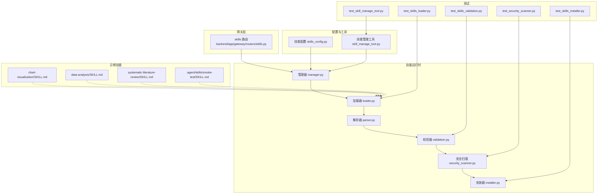
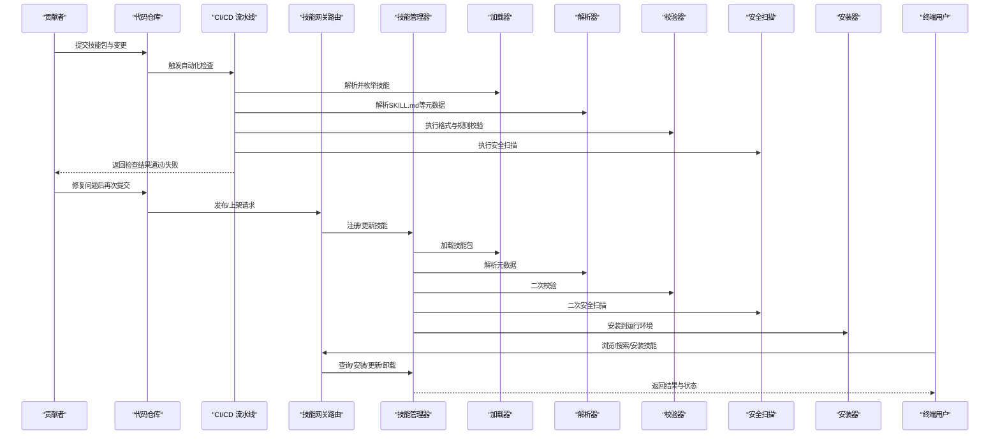
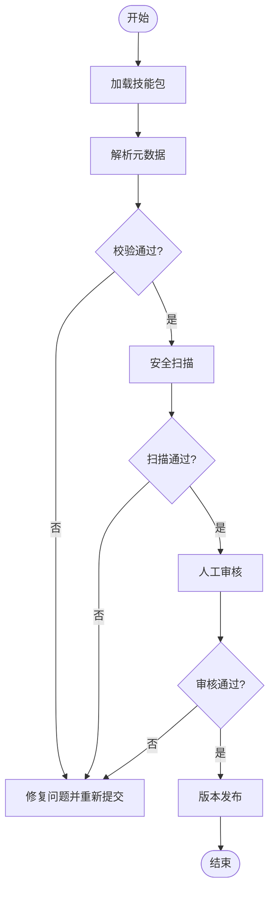
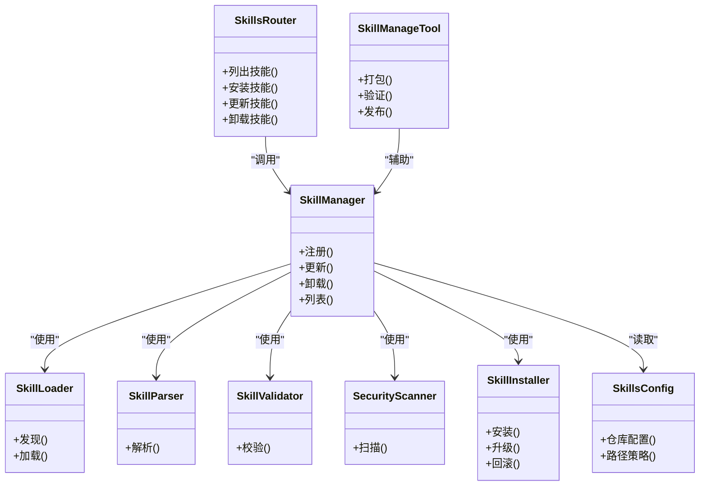

# 技能市场与贡献

<cite>
**本文引用的文件**   
- [backend/app/gateway/routers/skills.py](file://backend/app/gateway/routers/skills.py)
- [backend/packages/harness/deerflow/skills/manager.py](file://backend/packages/harness/deerflow/skills/manager.py)
- [backend/packages/harness/deerflow/skills/loader.py](file://backend/packages/harness/deerflow/skills/loader.py)
- [backend/packages/harness/deerflow/skills/parser.py](file://backend/packages/harness/deerflow/skills/parser.py)
- [backend/packages/harness/deerflow/skills/validation.py](file://backend/packages/harness/deerflow/skills/validation.py)
- [backend/packages/harness/deerflow/skills/security_scanner.py](file://backend/packages/harness/deerflow/skills/security_scanner.py)
- [backend/packages/harness/deerflow/skills/installer.py](file://backend/packages/harness/deerflow/skills/installer.py)
- [backend/packages/harness/deerflow/config/skills_config.py](file://backend/packages/harness/deerflow/config/skills_config.py)
- [backend/packages/harness/deerflow/tools/skill_manage_tool.py](file://backend/packages/harness/deerflow/tools/skill_manage_tool.py)
- [skills/public/chart-visualization/SKILL.md](file://skills/public/chart-visualization/SKILL.md)
- [skills/public/data-analysis/SKILL.md](file://skills/public/data-analysis/SKILL.md)
- [skills/public/systematic-literature-review/SKILL.md](file://skills/public/systematic-literature-review/SKILL.md)
- [.agent/skills/smoke-test/SKILL.md](file://.agent/skills/smoke-test/SKILL.md)
- [backend/tests/test_skills_loader.py](file://backend/tests/test_skills_loader.py)
- [backend/tests/test_skills_validation.py](file://backend/tests/test_skills_validation.py)
- [backend/tests/test_skills_installer.py](file://backend/tests/test_skills_installer.py)
- [backend/tests/test_security_scanner.py](file://backend/tests/test_security_scanner.py)
- [backend/tests/test_skill_manage_tool.py](file://backend/tests/test_skill_manage_tool.py)
</cite>

## 目录
1. [简介](#简介)
2. [项目结构](#项目结构)
3. [核心组件](#核心组件)
4. [架构总览](#架构总览)
5. [详细组件分析](#详细组件分析)
6. [依赖分析](#依赖分析)
7. [性能考虑](#性能考虑)
8. [故障排查指南](#故障排查指南)
9. [结论](#结论)
10. [附录](#附录)

## 简介
本文件面向DeerFlow技能市场的贡献者与使用者，系统阐述技能的发布标准、质量要求、审核流程、分享协作机制、打包分发方案以及评价推荐思路。文档以现有代码实现为依据，结合测试与示例技能，给出可操作的规范与最佳实践，帮助开发者高质量地参与技能生态建设。

## 项目结构
技能相关能力主要分布在后端网关路由、技能运行时（加载/解析/校验/安全扫描/安装）、配置与工具层，以及前端展示与测试用例中。公共示例技能位于 skills/public 目录，便于参考结构与内容组织。

图示来源
- [backend/app/gateway/routers/skills.py](file://backend/app/gateway/routers/skills.py)
- [backend/packages/harness/deerflow/skills/manager.py](file://backend/packages/harness/deerflow/skills/manager.py)
- [backend/packages/harness/deerflow/skills/loader.py](file://backend/packages/harness/deerflow/skills/loader.py)
- [backend/packages/harness/deerflow/skills/parser.py](file://backend/packages/harness/deerflow/skills/parser.py)
- [backend/packages/harness/deerflow/skills/validation.py](file://backend/packages/harness/deerflow/skills/validation.py)
- [backend/packages/harness/deerflow/skills/security_scanner.py](file://backend/packages/harness/deerflow/skills/security_scanner.py)
- [backend/packages/harness/deerflow/skills/installer.py](file://backend/packages/harness/deerflow/skills/installer.py)
- [backend/packages/harness/deerflow/config/skills_config.py](file://backend/packages/harness/deerflow/config/skills_config.py)
- [backend/packages/harness/deerflow/tools/skill_manage_tool.py](file://backend/packages/harness/deerflow/tools/skill_manage_tool.py)
- [skills/public/chart-visualization/SKILL.md](file://skills/public/chart-visualization/SKILL.md)
- [skills/public/data-analysis/SKILL.md](file://skills/public/data-analysis/SKILL.md)
- [skills/public/systematic-literature-review/SKILL.md](file://skills/public/systematic-literature-review/SKILL.md)
- [.agent/skills/smoke-test/SKILL.md](file://.agent/skills/smoke-test/SKILL.md)
- [backend/tests/test_skills_loader.py](file://backend/tests/test_skills_loader.py)
- [backend/tests/test_skills_validation.py](file://backend/tests/test_skills_validation.py)
- [backend/tests/test_skills_installer.py](file://backend/tests/test_skills_installer.py)
- [backend/tests/test_security_scanner.py](file://backend/tests/test_security_scanner.py)
- [backend/tests/test_skill_manage_tool.py](file://backend/tests/test_skill_manage_tool.py)

章节来源
- [backend/app/gateway/routers/skills.py](file://backend/app/gateway/routers/skills.py)
- [backend/packages/harness/deerflow/skills/manager.py](file://backend/packages/harness/deerflow/skills/manager.py)
- [backend/packages/harness/deerflow/skills/loader.py](file://backend/packages/harness/deerflow/skills/loader.py)
- [backend/packages/harness/deerflow/skills/parser.py](file://backend/packages/harness/deerflow/skills/parser.py)
- [backend/packages/harness/deerflow/skills/validation.py](file://backend/packages/harness/deerflow/skills/validation.py)
- [backend/packages/harness/deerflow/skills/security_scanner.py](file://backend/packages/harness/deerflow/skills/security_scanner.py)
- [backend/packages/harness/deerflow/skills/installer.py](file://backend/packages/harness/deerflow/skills/installer.py)
- [backend/packages/harness/deerflow/config/skills_config.py](file://backend/packages/harness/deerflow/config/skills_config.py)
- [backend/packages/harness/deerflow/tools/skill_manage_tool.py](file://backend/packages/harness/deerflow/tools/skill_manage_tool.py)
- [skills/public/chart-visualization/SKILL.md](file://skills/public/chart-visualization/SKILL.md)
- [skills/public/data-analysis/SKILL.md](file://skills/public/data-analysis/SKILL.md)
- [skills/public/systematic-literature-review/SKILL.md](file://skills/public/systematic-literature-review/SKILL.md)
- [.agent/skills/smoke-test/SKILL.md](file://.agent/skills/smoke-test/SKILL.md)
- [backend/tests/test_skills_loader.py](file://backend/tests/test_skills_loader.py)
- [backend/tests/test_skills_validation.py](file://backend/tests/test_skills_validation.py)
- [backend/tests/test_skills_installer.py](file://backend/tests/test_skills_installer.py)
- [backend/tests/test_security_scanner.py](file://backend/tests/test_security_scanner.py)
- [backend/tests/test_skill_manage_tool.py](file://backend/tests/test_skill_manage_tool.py)

## 核心组件
- 网关路由：对外暴露技能查询、安装、更新、卸载等接口，作为用户与技能运行时的交互入口。
- 管理器：协调加载、解析、校验、安全扫描与安装生命周期，维护技能清单与状态。
- 加载器：发现并读取技能包（目录或归档），提取元数据与资源。
- 解析器：解析 SKILL.md 等结构化描述，生成统一模型供后续处理。
- 校验器：对元数据、脚本、依赖声明进行格式与规则检查。
- 安全扫描：对脚本与依赖进行风险检测，阻断高危操作。
- 安装器：将技能部署到目标环境，处理依赖与版本兼容。
- 配置：集中管理技能仓库、路径、策略等全局设置。
- 工具：提供命令行或内部调用方式，辅助打包、验证、发布等操作。

章节来源
- [backend/app/gateway/routers/skills.py](file://backend/app/gateway/routers/skills.py)
- [backend/packages/harness/deerflow/skills/manager.py](file://backend/packages/harness/deerflow/skills/manager.py)
- [backend/packages/harness/deerflow/skills/loader.py](file://backend/packages/harness/deerflow/skills/loader.py)
- [backend/packages/harness/deerflow/skills/parser.py](file://backend/packages/harness/deerflow/skills/parser.py)
- [backend/packages/harness/deerflow/skills/validation.py](file://backend/packages/harness/deerflow/skills/validation.py)
- [backend/packages/harness/deerflow/skills/security_scanner.py](file://backend/packages/harness/deerflow/skills/security_scanner.py)
- [backend/packages/harness/deerflow/skills/installer.py](file://backend/packages/harness/deerflow/skills/installer.py)
- [backend/packages/harness/deerflow/config/skills_config.py](file://backend/packages/harness/deerflow/config/skills_config.py)
- [backend/packages/harness/deerflow/tools/skill_manage_tool.py](file://backend/packages/harness/deerflow/tools/skill_manage_tool.py)

## 架构总览
下图展示了从“技能提交”到“上线可用”的端到端流程，涵盖自动检查、人工审核与发布环节。

图示来源
- [backend/app/gateway/routers/skills.py](file://backend/app/gateway/routers/skills.py)
- [backend/packages/harness/deerflow/skills/manager.py](file://backend/packages/harness/deerflow/skills/manager.py)
- [backend/packages/harness/deerflow/skills/loader.py](file://backend/packages/harness/deerflow/skills/loader.py)
- [backend/packages/harness/deerflow/skills/parser.py](file://backend/packages/harness/deerflow/skills/parser.py)
- [backend/packages/harness/deerflow/skills/validation.py](file://backend/packages/harness/deerflow/skills/validation.py)
- [backend/packages/harness/deerflow/skills/security_scanner.py](file://backend/packages/harness/deerflow/skills/security_scanner.py)
- [backend/packages/harness/deerflow/skills/installer.py](file://backend/packages/harness/deerflow/skills/installer.py)

## 详细组件分析

### 技能发布标准与质量要求
- 代码规范
  - 脚本与工具需具备清晰的输入输出约定，避免隐式副作用。
  - 禁止直接访问敏感环境变量或硬编码密钥；应通过受控通道注入。
  - 外部网络访问需显式声明并在安全扫描中记录。
- 文档要求
  - 每个技能必须包含 SKILL.md，清晰说明用途、前置条件、参数、输出与示例。
  - 建议提供 references 与 templates 目录，用于SOP与模板复用。
- 测试覆盖率
  - 关键逻辑需提供单元测试与集成测试，覆盖正常路径与异常分支。
  - 建议对解析、校验、安装与安全扫描链路编写回归用例。
- 兼容性
  - 明确声明依赖与版本约束，确保在目标环境中可稳定安装。
  - 对平台差异（如Windows/Linux）进行适配说明与测试。

章节来源
- [skills/public/chart-visualization/SKILL.md](file://skills/public/chart-visualization/SKILL.md)
- [skills/public/data-analysis/SKILL.md](file://skills/public/data-analysis/SKILL.md)
- [skills/public/systematic-literature-review/SKILL.md](file://skills/public/systematic-literature-review/SKILL.md)
- [.agent/skills/smoke-test/SKILL.md](file://.agent/skills/smoke-test/SKILL.md)
- [backend/packages/harness/deerflow/skills/parser.py](file://backend/packages/harness/deerflow/skills/parser.py)
- [backend/packages/harness/deerflow/skills/validation.py](file://backend/packages/harness/deerflow/skills/validation.py)
- [backend/packages/harness/deerflow/skills/security_scanner.py](file://backend/packages/harness/deerflow/skills/security_scanner.py)
- [backend/packages/harness/deerflow/skills/installer.py](file://backend/packages/harness/deerflow/skills/installer.py)

### 技能审核流程（自动检查、人工审核、版本发布）
- 自动检查
  - 加载与解析：确认技能包结构完整，SKILL.md 可被正确解析。
  - 规则校验：字段完整性、命名规范、依赖声明格式等。
  - 安全扫描：检测危险命令、可疑网络行为、未签名二进制等。
- 人工审核
  - 功能验收：按示例步骤复现，验证输出符合预期。
  - 文档审查：说明是否充分、示例是否可执行、风险提示是否完备。
  - 兼容性评估：在不同环境与依赖版本下验证稳定性。
- 版本发布
  - 版本号遵循语义化版本，变更日志清晰。
  - 发布前完成全量自动化检查与人工复核。
  - 发布后提供回滚与降级策略。

图示来源
- [backend/packages/harness/deerflow/skills/loader.py](file://backend/packages/harness/deerflow/skills/loader.py)
- [backend/packages/harness/deerflow/skills/parser.py](file://backend/packages/harness/deerflow/skills/parser.py)
- [backend/packages/harness/deerflow/skills/validation.py](file://backend/packages/harness/deerflow/skills/validation.py)
- [backend/packages/harness/deerflow/skills/security_scanner.py](file://backend/packages/harness/deerflow/skills/security_scanner.py)

章节来源
- [backend/packages/harness/deerflow/skills/loader.py](file://backend/packages/harness/deerflow/skills/loader.py)
- [backend/packages/harness/deerflow/skills/parser.py](file://backend/packages/harness/deerflow/skills/parser.py)
- [backend/packages/harness/deerflow/skills/validation.py](file://backend/packages/harness/deerflow/skills/validation.py)
- [backend/packages/harness/deerflow/skills/security_scanner.py](file://backend/packages/harness/deerflow/skills/security_scanner.py)

### 技能分享与协作机制
- 社区贡献
  - 通过仓库提交PR，附带变更说明与测试用例。
  - 使用统一的技能模板与目录结构，降低审阅成本。
- 版本管理
  - 采用标签化管理版本，保持主分支稳定。
  - 发布说明包含破坏性变更提示与迁移指南。
- 反馈收集
  - 在 SKILL.md 中提供问题反馈渠道与期望行为说明。
  - 对高频问题建立FAQ与排障文档。

章节来源
- [skills/public/chart-visualization/SKILL.md](file://skills/public/chart-visualization/SKILL.md)
- [skills/public/data-analysis/SKILL.md](file://skills/public/data-analysis/SKILL.md)
- [skills/public/systematic-literature-review/SKILL.md](file://skills/public/systematic-literature-review/SKILL.md)
- [.agent/skills/smoke-test/SKILL.md](file://.agent/skills/smoke-test/SKILL.md)

### 技能打包与分发技术方案
- 包格式
  - 支持目录型与归档型两种形式，均需提供 SKILL.md 与必要资源。
  - 归档内目录结构应与目录型保持一致，便于加载器统一处理。
- 依赖声明
  - 在元数据中声明外部依赖与版本范围，安装器据此进行依赖解析与安装。
- 兼容性检查
  - 在安装阶段进行环境探测与依赖冲突检测，必要时提供降级或替代方案。
- 分发渠道
  - 本地仓库与远程仓库均可作为源，管理员可配置可信源白名单。

章节来源
- [backend/packages/harness/deerflow/skills/loader.py](file://backend/packages/harness/deerflow/skills/loader.py)
- [backend/packages/harness/deerflow/skills/installer.py](file://backend/packages/harness/deerflow/skills/installer.py)
- [backend/packages/harness/deerflow/config/skills_config.py](file://backend/packages/harness/deerflow/config/skills_config.py)

### 技能评价与推荐系统
- 评价维度
  - 功能性、稳定性、易用性、安全性、文档质量、社区活跃度。
- 评分与排序
  - 基于自动化测试结果、安全扫描报告、用户反馈与下载量综合加权。
- 推荐策略
  - 根据用户场景与历史偏好进行个性化推荐，并提供相似技能对比。
- 反馈闭环
  - 用户可提交问题与建议，维护者及时响应并迭代优化。

[本节为概念性说明，不直接分析具体文件]

### 贡献者指南与社区规范
- 贡献流程
  - Fork 仓库 -> 创建特性分支 -> 提交变更与测试 -> 发起PR -> 通过CI与人工审核 -> 合并发布。
- 代码规范
  - 遵循项目既有风格与静态检查规则，保证可读性与一致性。
- 文档规范
  - 新增或修改功能需同步更新文档与示例，确保可复现。
- 行为准则
  - 尊重社区成员，理性讨论，遵守安全与合规要求。

章节来源
- [backend/tests/test_skills_loader.py](file://backend/tests/test_skills_loader.py)
- [backend/tests/test_skills_validation.py](file://backend/tests/test_skills_validation.py)
- [backend/tests/test_skills_installer.py](file://backend/tests/test_skills_installer.py)
- [backend/tests/test_security_scanner.py](file://backend/tests/test_security_scanner.py)
- [backend/tests/test_skill_manage_tool.py](file://backend/tests/test_skill_manage_tool.py)

## 依赖分析
技能模块之间的依赖关系如下：网关路由依赖管理器；管理器协调加载器、解析器、校验器、安全扫描与安装器；配置与工具为上层提供支撑。

图示来源
- [backend/app/gateway/routers/skills.py](file://backend/app/gateway/routers/skills.py)
- [backend/packages/harness/deerflow/skills/manager.py](file://backend/packages/harness/deerflow/skills/manager.py)
- [backend/packages/harness/deerflow/skills/loader.py](file://backend/packages/harness/deerflow/skills/loader.py)
- [backend/packages/harness/deerflow/skills/parser.py](file://backend/packages/harness/deerflow/skills/parser.py)
- [backend/packages/harness/deerflow/skills/validation.py](file://backend/packages/harness/deerflow/skills/validation.py)
- [backend/packages/harness/deerflow/skills/security_scanner.py](file://backend/packages/harness/deerflow/skills/security_scanner.py)
- [backend/packages/harness/deerflow/skills/installer.py](file://backend/packages/harness/deerflow/skills/installer.py)
- [backend/packages/harness/deerflow/config/skills_config.py](file://backend/packages/harness/deerflow/config/skills_config.py)
- [backend/packages/harness/deerflow/tools/skill_manage_tool.py](file://backend/packages/harness/deerflow/tools/skill_manage_tool.py)

章节来源
- [backend/app/gateway/routers/skills.py](file://backend/app/gateway/routers/skills.py)
- [backend/packages/harness/deerflow/skills/manager.py](file://backend/packages/harness/deerflow/skills/manager.py)
- [backend/packages/harness/deerflow/skills/loader.py](file://backend/packages/harness/deerflow/skills/loader.py)
- [backend/packages/harness/deerflow/skills/parser.py](file://backend/packages/harness/deerflow/skills/parser.py)
- [backend/packages/harness/deerflow/skills/validation.py](file://backend/packages/harness/deerflow/skills/validation.py)
- [backend/packages/harness/deerflow/skills/security_scanner.py](file://backend/packages/harness/deerflow/skills/security_scanner.py)
- [backend/packages/harness/deerflow/skills/installer.py](file://backend/packages/harness/deerflow/skills/installer.py)
- [backend/packages/harness/deerflow/config/skills_config.py](file://backend/packages/harness/deerflow/config/skills_config.py)
- [backend/packages/harness/deerflow/tools/skill_manage_tool.py](file://backend/packages/harness/deerflow/tools/skill_manage_tool.py)

## 性能考虑
- 缓存与增量更新
  - 对已解析的元数据与校验结果进行缓存，减少重复计算。
  - 增量安装仅处理变更部分，缩短安装时延。
- 并发与限流
  - 批量安装与扫描任务采用队列与并发控制，避免资源争用。
- 资源隔离
  - 高风险脚本在沙箱中执行，限制CPU/内存/IO，防止影响宿主。
- 监控与告警
  - 记录关键指标（解析耗时、扫描耗时、安装成功率），异常阈值触发告警。

[本节为通用指导，不直接分析具体文件]

## 故障排查指南
- 常见问题定位
  - 解析失败：检查 SKILL.md 结构与必填字段。
  - 校验失败：对照错误信息修正字段类型与取值范围。
  - 安全扫描拦截：移除危险命令或添加白名单申请。
  - 安装失败：核对依赖版本与环境差异，查看安装日志。
- 调试手段
  - 启用详细日志，定位具体失败阶段。
  - 使用本地模拟仓库与最小化技能包快速复现问题。
- 回归与预防
  - 补充对应测试用例，纳入CI门禁。
  - 对高频问题沉淀排障手册与FAQ。

章节来源
- [backend/tests/test_skills_loader.py](file://backend/tests/test_skills_loader.py)
- [backend/tests/test_skills_validation.py](file://backend/tests/test_skills_validation.py)
- [backend/tests/test_skills_installer.py](file://backend/tests/test_skills_installer.py)
- [backend/tests/test_security_scanner.py](file://backend/tests/test_security_scanner.py)
- [backend/tests/test_skill_manage_tool.py](file://backend/tests/test_skill_manage_tool.py)

## 结论
DeerFlow 技能市场围绕“标准化、可验证、可追溯”的目标构建，通过完善的加载、解析、校验、安全扫描与安装链路，保障技能的质量与安全。配合严格的发布流程与社区协作机制，有助于形成健康、可持续的技能生态。建议贡献者在提交前完成自测与文档完善，提升一次通过率与用户体验。

## 附录
- 术语
  - 技能包：包含 SKILL.md 与资源的目录或归档。
  - 元数据：由 SKILL.md 解析得到的结构化描述。
  - 安全扫描：对脚本与依赖的风险检测过程。
- 参考示例
  - 图表可视化技能、数据分析技能、系统文献综述技能与冒烟测试技能可作为结构与内容的参考。

章节来源
- [skills/public/chart-visualization/SKILL.md](file://skills/public/chart-visualization/SKILL.md)
- [skills/public/data-analysis/SKILL.md](file://skills/public/data-analysis/SKILL.md)
- [skills/public/systematic-literature-review/SKILL.md](file://skills/public/systematic-literature-review/SKILL.md)
- [.agent/skills/smoke-test/SKILL.md](file://.agent/skills/smoke-test/SKILL.md)