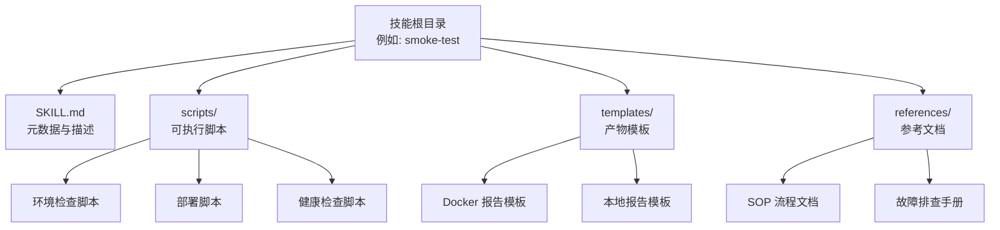
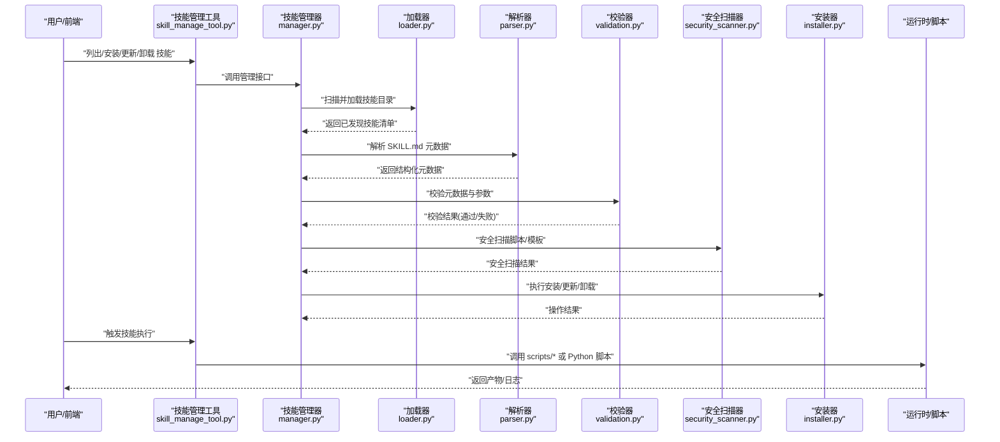
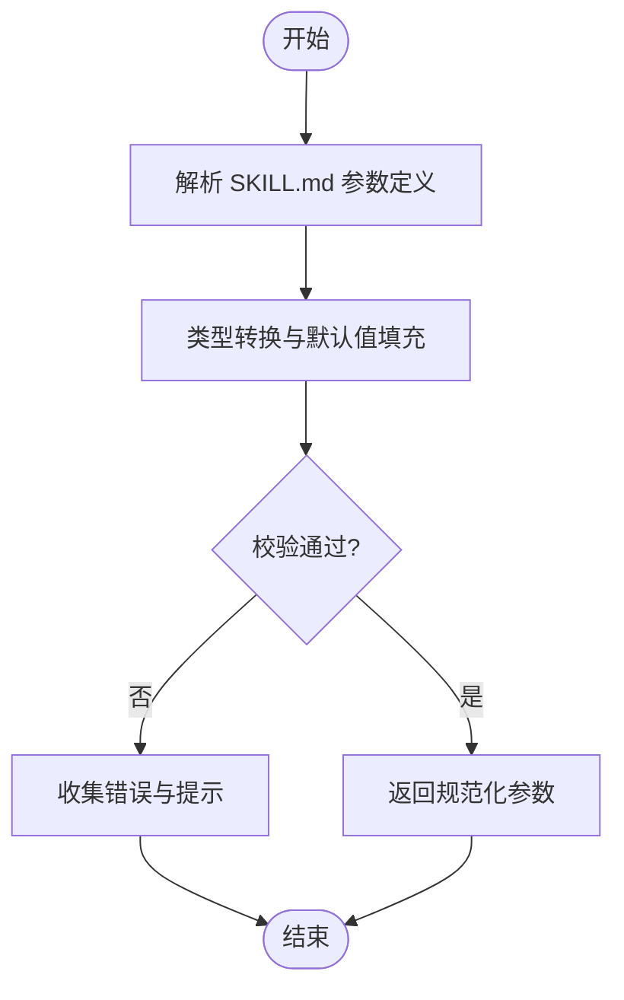
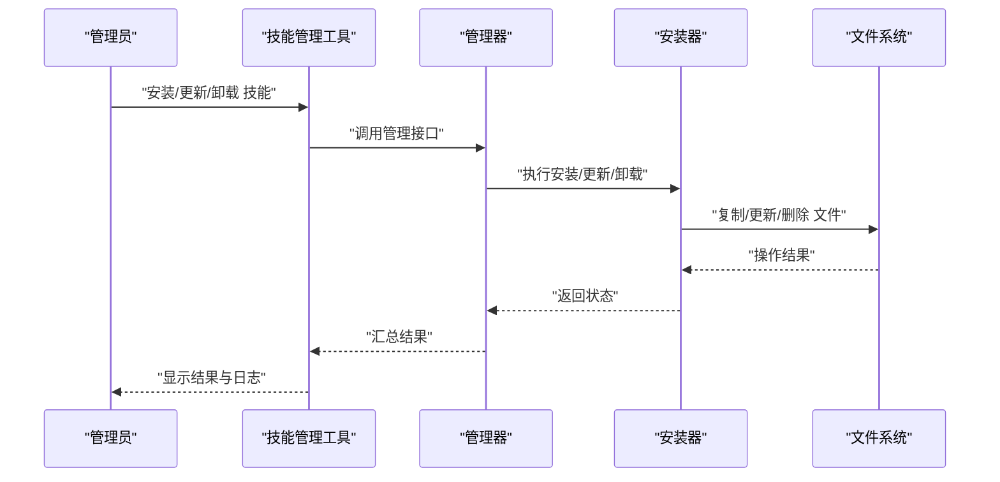
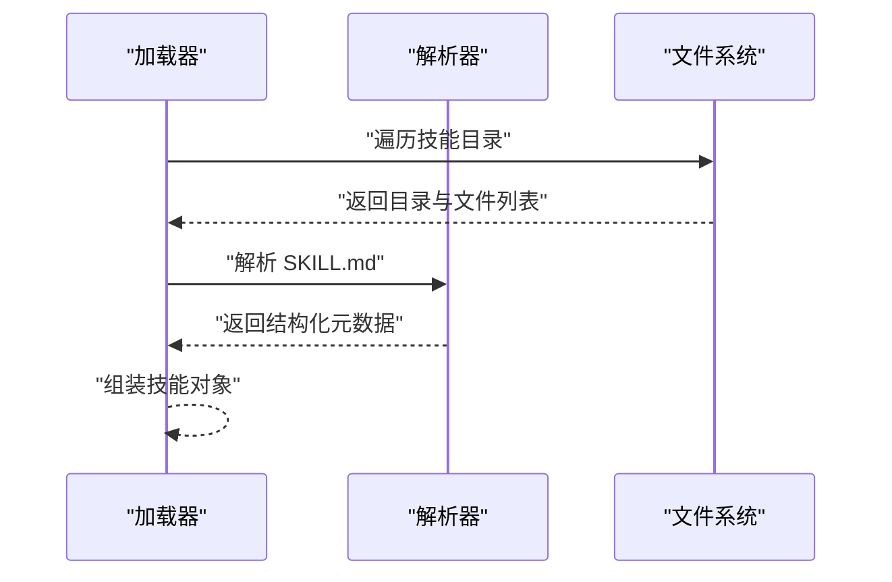
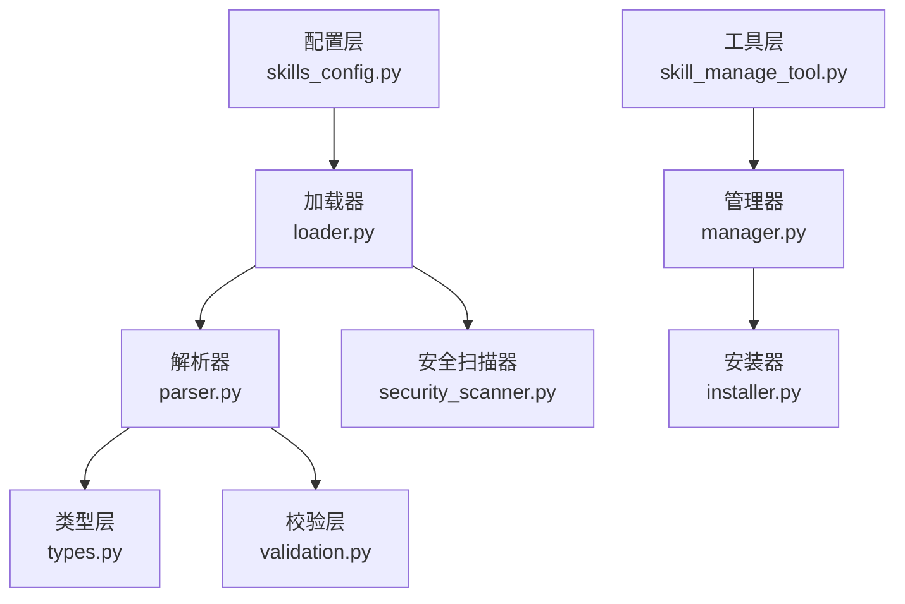

# 技能开发指南

<cite>
**本文引用的文件**   
- [SKILL.md](file://.agent/skills/smoke-test/SKILL.md)
- [SOP.md](file://.agent/skills/smoke-test/references/SOP.md)
- [troubleshooting.md](file://.agent/skills/smoke-test/references/troubleshooting.md)
- [check_docker.sh](file://.agent/skills/smoke-test/scripts/check_docker.sh)
- [check_local_env.sh](file://.agent/skills/smoke-test/scripts/check_local_env.sh)
- [deploy_docker.sh](file://.agent/skills/smoke-test/scripts/deploy_docker.sh)
- [deploy_local.sh](file://.agent/skills/smoke-test/scripts/deploy_local.sh)
- [frontend_check.sh](file://.agent/skills/smoke-test/scripts/frontend_check.sh)
- [health_check.sh](file://.agent/skills/smoke-test/scripts/health_check.sh)
- [pull_code.sh](file://.agent/skills/smoke-test/scripts/pull_code.sh)
- [report.docker.template.md](file://.agent/skills/smoke-test/templates/report.docker.template.md)
- [report.local.template.md](file://.agent/skills/smoke-test/templates/report.local.template.md)
- [skills_config.py](file://backend/app/packages/harness/deerflow/config/skills_config.py)
- [loader.py](file://backend/app/packages/harness/deerflow/skills/loader.py)
- [parser.py](file://backend/app/packages/harness/deerflow/skills/parser.py)
- [types.py](file://backend/app/packages/harness/deerflow/skills/types.py)
- [validation.py](file://backend/app/packages/harness/deerflow/skills/validation.py)
- [installer.py](file://backend/app/packages/harness/deerflow/skills/installer.py)
- [manager.py](file://backend/app/packages/harness/deerflow/skills/manager.py)
- [security_scanner.py](file://backend/app/packages/harness/deerflow/skills/security_scanner.py)
- [skill_manage_tool.py](file://backend/app/packages/harness/deerflow/tools/skill_manage_tool.py)
- [test_skills_loader.py](file://backend/tests/test_skills_loader.py)
- [test_skills_parser.py](file://backend/tests/test_skills_parser.py)
- [test_skills_validation.py](file://backend/tests/test_skills_validation.py)
- [test_skills_installer.py](file://backend/tests/test_skills_installer.py)
- [test_skill_manage_tool.py](file://backend/tests/test_skill_manage_tool.py)
</cite>

## 目录
1. [简介](#简介)
2. [项目结构](#项目结构)
3. [核心组件](#核心组件)
4. [架构总览](#架构总览)
5. [详细组件分析](#详细组件分析)
6. [依赖关系分析](#依赖关系分析)
7. [性能考虑](#性能考虑)
8. [故障排查指南](#故障排查指南)
9. [结论](#结论)
10. [附录](#附录)

## 简介
本指南面向希望在 DeerFlow 中开发“技能”的工程师与内容创作者，系统阐述 SKILL.md 文件格式规范、脚本编写约定、模板与引用文件的组织方式、类型系统与验证规则，以及从需求到部署的完整流程。文档同时结合后端实现（加载、解析、校验、安装与管理）给出可操作的实践建议与排障要点，帮助开发者快速上手并稳定交付高质量技能。

## 项目结构
一个标准的 DeerFlow 技能目录通常包含如下元素：
- SKILL.md：技能的元数据与描述入口
- scripts/：可执行脚本（Shell/Python 等），由技能运行时在沙箱或宿主环境中调用
- templates/：用于生成报告或产物的 Markdown 模板
- references/：参考文档、SOP、故障排查手册等辅助材料

示例路径参考：
- .agent/skills/smoke-test/SKILL.md
- .agent/skills/smoke-test/scripts/*.sh
- .agent/skills/smoke-test/templates/*.template.md
- .agent/skills/smoke-test/references/*.md

**图表来源**
- [SKILL.md](file://.agent/skills/smoke-test/SKILL.md)
- [check_docker.sh](file://.agent/skills/smoke-test/scripts/check_docker.sh)
- [deploy_docker.sh](file://.agent/skills/smoke-test/scripts/deploy_docker.sh)
- [health_check.sh](file://.agent/skills/smoke-test/scripts/health_check.sh)
- [report.docker.template.md](file://.agent/skills/smoke-test/templates/report.docker.template.md)
- [SOP.md](file://.agent/skills/smoke-test/references/SOP.md)

**章节来源**
- [SKILL.md](file://.agent/skills/smoke-test/SKILL.md)
- [check_docker.sh](file://.agent/skills/smoke-test/scripts/check_docker.sh)
- [deploy_docker.sh](file://.agent/skills/smoke-test/scripts/deploy_docker.sh)
- [health_check.sh](file://.agent/skills/smoke-test/scripts/health_check.sh)
- [report.docker.template.md](file://.agent/skills/smoke-test/templates/report.docker.template.md)
- [SOP.md](file://.agent/skills/smoke-test/references/SOP.md)

## 核心组件
本节聚焦技能系统的核心能力与职责边界：
- 配置与发现：通过配置项指定技能根目录与扫描策略
- 加载与解析：读取 SKILL.md，解析元数据与参数定义
- 类型与校验：对输入输出进行类型约束与合法性校验
- 安全扫描：对脚本与模板进行基础安全检查
- 安装与管理：提供安装、更新、卸载与列表查询能力
- 工具集成：通过工具接口暴露技能管理能力

关键模块与职责：
- 配置层：skills_config.py
- 加载层：loader.py
- 解析层：parser.py
- 类型层：types.py
- 校验层：validation.py
- 安全层：security_scanner.py
- 安装层：installer.py
- 管理层：manager.py
- 工具层：skill_manage_tool.py

**章节来源**
- [skills_config.py](file://backend/app/packages/harness/deerflow/config/skills_config.py)
- [loader.py](file://backend/app/packages/harness/deerflow/skills/loader.py)
- [parser.py](file://backend/app/packages/harness/deerflow/skills/parser.py)
- [types.py](file://backend/app/packages/harness/deerflow/skills/types.py)
- [validation.py](file://backend/app/packages/harness/deerflow/skills/validation.py)
- [security_scanner.py](file://backend/app/packages/harness/deerflow/skills/security_scanner.py)
- [installer.py](file://backend/app/packages/harness/deerflow/skills/installer.py)
- [manager.py](file://backend/app/packages/harness/deerflow/skills/manager.py)
- [skill_manage_tool.py](file://backend/app/packages/harness/deerflow/tools/skill_manage_tool.py)

## 架构总览
下图展示了技能从发现到执行的端到端流程，包括加载、解析、校验、安全扫描、安装与运行等环节。

**图表来源**
- [skill_manage_tool.py](file://backend/app/packages/harness/deerflow/tools/skill_manage_tool.py)
- [manager.py](file://backend/app/packages/harness/deerflow/skills/manager.py)
- [loader.py](file://backend/app/packages/harness/deerflow/skills/loader.py)
- [parser.py](file://backend/app/packages/harness/deerflow/skills/parser.py)
- [validation.py](file://backend/app/packages/harness/deerflow/skills/validation.py)
- [security_scanner.py](file://backend/app/packages/harness/deerflow/skills/security_scanner.py)
- [installer.py](file://backend/app/packages/harness/deerflow/skills/installer.py)

## 详细组件分析

### SKILL.md 格式规范
SKILL.md 是技能的声明式入口，承载以下核心信息：
- 元数据定义：名称、版本、作者、许可证、描述、标签等
- 描述编写：清晰说明技能用途、适用场景、前置条件与注意事项
- 参数配置：输入参数名、类型、默认值、是否必填、取值范围与校验提示
- 脚本与模板引用：scripts/ 与 templates/ 下文件的使用约定
- 输出产物：期望生成的文件或内容形态（如报告、图表、代码等）

编写建议：
- 使用简洁明确的标题与段落结构，便于解析与展示
- 参数描述需包含类型、默认值与约束，避免歧义
- 明确外部依赖与环境要求，降低运行期失败概率
- 为复杂流程提供 references/ 下的 SOP 与故障排查文档

**章节来源**
- [SKILL.md](file://.agent/skills/smoke-test/SKILL.md)

### 脚本编写规范
脚本位于 scripts/ 目录下，支持 Shell 与 Python 等语言。建议遵循以下规范：
- 入口函数/命令：统一命名与参数约定，便于解析与调用
- 环境变量：通过环境变量传递敏感信息与运行时配置
- 错误处理：返回非零退出码并输出结构化错误信息
- 日志输出：区分 stdout/stderr，便于追踪与诊断
- 幂等性：重复执行应产生一致结果，避免副作用
- 资源清理：及时释放临时文件与进程资源

常见脚本分类：
- 环境检查：如 check_docker.sh、check_local_env.sh
- 部署脚本：如 deploy_docker.sh、deploy_local.sh
- 健康检查：如 health_check.sh
- 业务脚本：如 analyze.py、generate.py 等

**章节来源**
- [check_docker.sh](file://.agent/skills/smoke-test/scripts/check_docker.sh)
- [check_local_env.sh](file://.agent/skills/smoke-test/scripts/check_local_env.sh)
- [deploy_docker.sh](file://.agent/skills/smoke-test/scripts/deploy_docker.sh)
- [deploy_local.sh](file://.agent/skills/smoke-test/scripts/deploy_local.sh)
- [health_check.sh](file://.agent/skills/smoke-test/scripts/health_check.sh)

### 模板与引用文件组织
- templates/：存放产物模板（如 Markdown 报告模板），可在脚本中渲染填充
- references/：存放 SOP、故障排查、领域知识等参考文档，供人类阅读或作为上下文注入

最佳实践：
- 模板文件采用 .template.md 后缀，便于识别
- 引用文档按主题分文件，保持小而精
- 在 SKILL.md 中明确引用文件的作用与使用位置

**章节来源**
- [report.docker.template.md](file://.agent/skills/smoke-test/templates/report.docker.template.md)
- [report.local.template.md](file://.agent/skills/smoke-test/templates/report.local.template.md)
- [SOP.md](file://.agent/skills/smoke-test/references/SOP.md)
- [troubleshooting.md](file://.agent/skills/smoke-test/references/troubleshooting.md)

### 类型系统与验证规则
类型系统围绕 types.py 与 validation.py 构建，负责：
- 定义输入/输出类型（字符串、数字、布尔、枚举、数组、对象等）
- 提供类型转换与默认值填充
- 执行约束校验（必填、范围、正则、唯一性等）
- 生成友好的错误消息与修复建议

典型流程：
- 解析 SKILL.md 中的参数定义
- 将原始输入转换为内部类型
- 应用校验规则并收集错误
- 返回校验结果与修正后的参数

**图表来源**
- [types.py](file://backend/app/packages/harness/deerflow/skills/types.py)
- [validation.py](file://backend/app/packages/harness/deerflow/skills/validation.py)

**章节来源**
- [types.py](file://backend/app/packages/harness/deerflow/skills/types.py)
- [validation.py](file://backend/app/packages/harness/deerflow/skills/validation.py)

### 安全扫描机制
security_scanner.py 对脚本与模板进行基础安全检查，包括但不限于：
- 危险命令检测（如 rm -rf、curl | bash 等）
- 网络访问限制与白名单策略
- 文件读写权限与路径穿越防护
- 模板注入风险检测

建议：
- 在开发阶段启用严格模式，逐步放宽至生产
- 对第三方脚本进行额外审查与隔离执行
- 记录扫描结果与告警，纳入审计

**章节来源**
- [security_scanner.py](file://backend/app/packages/harness/deerflow/skills/security_scanner.py)

### 安装与管理流程
installer.py 与 manager.py 提供技能的安装、更新、卸载与列表查询能力；skill_manage_tool.py 对外暴露工具接口。

典型流程：
- 扫描技能目录，发现可用技能
- 解析并校验元数据
- 执行安装/更新/卸载动作
- 维护技能状态与索引

**图表来源**
- [skill_manage_tool.py](file://backend/app/packages/harness/deerflow/tools/skill_manage_tool.py)
- [manager.py](file://backend/app/packages/harness/deerflow/skills/manager.py)
- [installer.py](file://backend/app/packages/harness/deerflow/skills/installer.py)

**章节来源**
- [installer.py](file://backend/app/packages/harness/deerflow/skills/installer.py)
- [manager.py](file://backend/app/packages/harness/deerflow/skills/manager.py)
- [skill_manage_tool.py](file://backend/app/packages/harness/deerflow/tools/skill_manage_tool.py)

### 加载与解析流程
loader.py 负责发现与加载技能目录；parser.py 负责解析 SKILL.md 的结构化内容。

**图表来源**
- [loader.py](file://backend/app/packages/harness/deerflow/skills/loader.py)
- [parser.py](file://backend/app/packages/harness/deerflow/skills/parser.py)

**章节来源**
- [loader.py](file://backend/app/packages/harness/deerflow/skills/loader.py)
- [parser.py](file://backend/app/packages/harness/deerflow/skills/parser.py)

## 依赖关系分析
技能系统各模块之间的依赖关系如下：

**图表来源**
- [skills_config.py](file://backend/app/packages/harness/deerflow/config/skills_config.py)
- [loader.py](file://backend/app/packages/harness/deerflow/skills/loader.py)
- [parser.py](file://backend/app/packages/harness/deerflow/skills/parser.py)
- [types.py](file://backend/app/packages/harness/deerflow/skills/types.py)
- [validation.py](file://backend/app/packages/harness/deerflow/skills/validation.py)
- [security_scanner.py](file://backend/app/packages/harness/deerflow/skills/security_scanner.py)
- [manager.py](file://backend/app/packages/harness/deerflow/skills/manager.py)
- [installer.py](file://backend/app/packages/harness/deerflow/skills/installer.py)
- [skill_manage_tool.py](file://backend/app/packages/harness/deerflow/tools/skill_manage_tool.py)

**章节来源**
- [skills_config.py](file://backend/app/packages/harness/deerflow/config/skills_config.py)
- [loader.py](file://backend/app/packages/harness/deerflow/skills/loader.py)
- [parser.py](file://backend/app/packages/harness/deerflow/skills/parser.py)
- [types.py](file://backend/app/packages/harness/deerflow/skills/types.py)
- [validation.py](file://backend/app/packages/harness/deerflow/skills/validation.py)
- [security_scanner.py](file://backend/app/packages/harness/deerflow/skills/security_scanner.py)
- [manager.py](file://backend/app/packages/harness/deerflow/skills/manager.py)
- [installer.py](file://backend/app/packages/harness/deerflow/skills/installer.py)
- [skill_manage_tool.py](file://backend/app/packages/harness/deerflow/tools/skill_manage_tool.py)

## 性能考虑
- 懒加载与缓存：对 SKILL.md 解析结果进行缓存，减少重复 IO 与 CPU 开销
- 并行扫描：对多技能目录进行并发扫描，提升发现速度
- 增量更新：在安装/更新时仅变更受影响文件，避免全量拷贝
- 脚本执行隔离：在沙箱中运行脚本，限制资源占用与执行时间
- 产物流式输出：对大文件产物采用流式写入，降低内存峰值

[本节为通用指导，不直接分析具体文件]

## 故障排查指南
常见问题与定位方法：
- 解析失败：检查 SKILL.md 语法与字段完整性，参考测试用例
- 校验错误：查看参数类型与约束，确认默认值与必填项
- 安全拦截：根据扫描结果调整脚本或模板，避免危险命令
- 安装失败：检查文件权限与目标路径，确认磁盘空间
- 运行异常：查看脚本日志与退出码，复现最小用例

相关测试覆盖：
- 加载器测试：test_skills_loader.py
- 解析器测试：test_skills_parser.py
- 校验器测试：test_skills_validation.py
- 安装器测试：test_skills_installer.py
- 工具层测试：test_skill_manage_tool.py

**章节来源**
- [test_skills_loader.py](file://backend/tests/test_skills_loader.py)
- [test_skills_parser.py](file://backend/tests/test_skills_parser.py)
- [test_skills_validation.py](file://backend/tests/test_skills_validation.py)
- [test_skills_installer.py](file://backend/tests/test_skills_installer.py)
- [test_skill_manage_tool.py](file://backend/tests/test_skill_manage_tool.py)

## 结论
通过统一的 SKILL.md 规范、严格的类型与校验机制、完善的安全扫描与安装管理，DeerFlow 提供了可扩展、可治理的技能生态。开发者应遵循本文档的规范与实践，确保技能的可读性、可维护性与安全性，从而高效交付高质量自动化能力。

[本节为总结性内容，不直接分析具体文件]

## 附录

### 完整开发流程（从需求到部署）
- 需求分析：明确技能目标、输入输出、依赖环境与产物形态
- 设计 SKILL.md：定义元数据、参数、模板与引用文件
- 编写脚本：实现核心逻辑，遵循脚本规范与安全要求
- 准备模板与参考文档：完善产物模板与 SOP/故障排查
- 本地验证：运行环境检查与健康检查，确保依赖满足
- 安全扫描：启用严格模式，修复潜在风险
- 安装与发布：使用管理工具完成安装与版本管理
- 测试与回归：覆盖边界用例与异常路径，确保稳定性
- 监控与迭代：收集运行指标与反馈，持续优化

[本节为流程性指导，不直接分析具体文件]