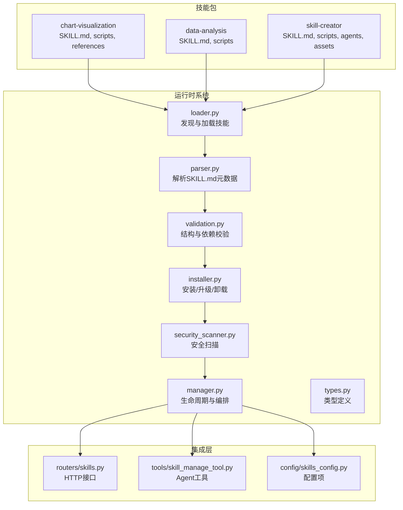
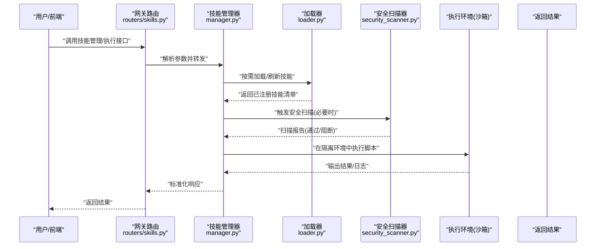
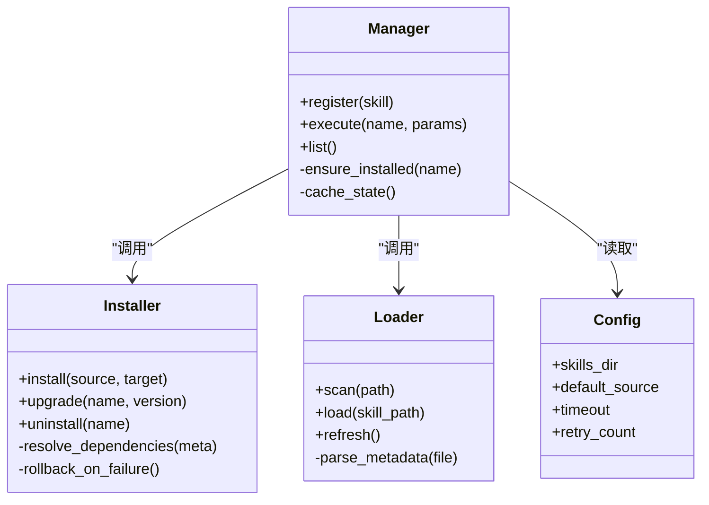
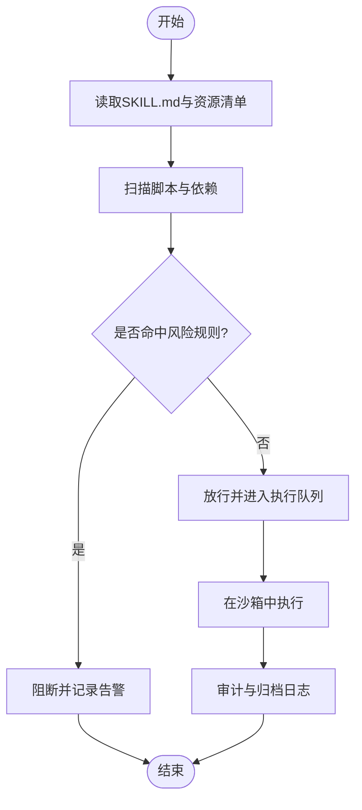
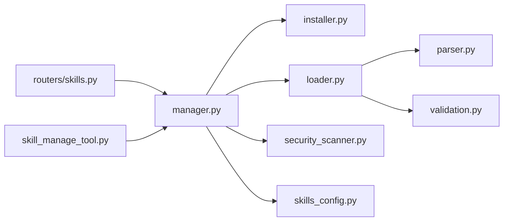

# 技能生态系统

<cite>
**本文引用的文件**   
- [SKILL.md](file://skills/public/chart-visualization/SKILL.md)
- [SKILL.md](file://skills/public/data-analysis/SKILL.md)
- [analyze.py](file://skills/public/data-analysis/scripts/analyze.py)
- [generate.js](file://skills/public/chart-visualization/scripts/generate.js)
- [SKILL.md](file://skills/public/skill-creator/SKILL.md)
- [init_skill.py](file://skills/public/skill-creator/scripts/init_skill.py)
- [package_skill.py](file://skills/public/skill-creator/scripts/package_skill.py)
- [quick_validate.py](file://skills/public/skill-creator/scripts/quick_validate.py)
- [installer.py](file://backend/packages/harness/deerflow/skills/installer.py)
- [loader.py](file://backend/packages/harness/deerflow/skills/loader.py)
- [manager.py](file://backend/packages/harness/deerflow/skills/manager.py)
- [parser.py](file://backend/packages/harness/deerflow/skills/parser.py)
- [security_scanner.py](file://backend/packages/harness/deerflow/skills/security_scanner.py)
- [types.py](file://backend/packages/harness/deerflow/skills/types.py)
- [validation.py](file://backend/packages/harness/deerflow/skills/validation.py)
- [skills_config.py](file://backend/packages/harness/deerflow/config/skills_config.py)
- [skills.py](file://backend/app/gateway/routers/skills.py)
- [skill_manage_tool.py](file://backend/packages/harness/deerflow/tools/skill_manage_tool.py)
- [test_skills_loader.py](file://backend/tests/test_skills_loader.py)
- [test_skills_parser.py](file://backend/tests/test_skills_parser.py)
- [test_skills_validation.py](file://backend/tests/test_skills_validation.py)
- [test_security_scanner.py](file://backend/tests/test_security_scanner.py)
- [test_skills_installer.py](file://backend/tests/test_skills_installer.py)
- [test_skill_manage_tool.py](file://backend/tests/test_skill_manage_tool.py)
</cite>

## 目录
1. [简介](#简介)
2. [项目结构](#项目结构)
3. [核心组件](#核心组件)
4. [架构总览](#架构总览)
5. [详细组件分析](#详细组件分析)
6. [依赖分析](#依赖分析)
7. [性能考虑](#性能考虑)
8. [故障排查指南](#故障排查指南)
9. [结论](#结论)
10. [附录](#附录)

## 简介
本文件面向DeerFlow技能生态系统的开发者与使用者，系统性阐述“技能(Skill)”的概念、优势与扩展方式，提供完整的技能开发指南（包括SKILL.md规范、脚本编写约定、模板与引用组织），介绍内置技能的使用方法，说明安装与管理机制（版本控制、依赖管理、更新策略）、安全扫描与权限控制，并给出技能市场的贡献流程与实践案例。目标是帮助读者从零开始构建、发布、治理可复用的AI能力单元，并在生产环境中安全高效地运行。

## 项目结构
技能生态由“技能包”和“运行时系统”两部分组成：
- 技能包位于 skills/public 下，每个子目录是一个独立技能，包含 SKILL.md、scripts、templates、references 等可选目录。
- 运行时系统位于 backend/packages/harness/deerflow/skills 中，负责加载、解析、校验、安装与安全扫描技能，并通过网关路由与工具暴露给上层应用。

图表来源
- [loader.py:1-200](file://backend/packages/harness/deerflow/skills/loader.py#L1-L200)
- [parser.py:1-200](file://backend/packages/harness/deerflow/skills/parser.py#L1-L200)
- [validation.py:1-200](file://backend/packages/harness/deerflow/skills/validation.py#L1-L200)
- [installer.py:1-200](file://backend/packages/harness/deerflow/skills/installer.py#L1-L200)
- [security_scanner.py:1-200](file://backend/packages/harness/deerflow/skills/security_scanner.py#L1-L200)
- [manager.py:1-200](file://backend/packages/harness/deerflow/skills/manager.py#L1-L200)
- [types.py:1-200](file://backend/packages/harness/deerflow/skills/types.py#L1-L200)
- [skills.py:1-200](file://backend/app/gateway/routers/skills.py#L1-L200)
- [skill_manage_tool.py:1-200](file://backend/packages/harness/deerflow/tools/skill_manage_tool.py#L1-L200)
- [skills_config.py:1-200](file://backend/packages/harness/deerflow/config/skills_config.py#L1-L200)

章节来源
- [loader.py:1-200](file://backend/packages/harness/deerflow/skills/loader.py#L1-L200)
- [parser.py:1-200](file://backend/packages/harness/deerflow/skills/parser.py#L1-L200)
- [validation.py:1-200](file://backend/packages/harness/deerflow/skills/validation.py#L1-L200)
- [installer.py:1-200](file://backend/packages/harness/deerflow/skills/installer.py#L1-L200)
- [security_scanner.py:1-200](file://backend/packages/harness/deerflow/skills/security_scanner.py#L1-L200)
- [manager.py:1-200](file://backend/packages/harness/deerflow/skills/manager.py#L1-L200)
- [types.py:1-200](file://backend/packages/harness/deerflow/skills/types.py#L1-L200)
- [skills.py:1-200](file://backend/app/gateway/routers/skills.py#L1-L200)
- [skill_manage_tool.py:1-200](file://backend/packages/harness/deerflow/tools/skill_manage_tool.py#L1-L200)
- [skills_config.py:1-200](file://backend/packages/harness/deerflow/config/skills_config.py#L1-L200)

## 核心组件
- 技能描述与清单：每个技能根目录的 SKILL.md 是技能的“说明书”，声明名称、版本、作者、依赖、入口脚本、模板与参考文档等元数据。
- 脚本与资源：scripts 存放可执行脚本；templates 存放渲染模板；references 存放参考材料或SOP。
- 运行时加载器：按约定路径扫描、解析、校验并注册技能，为上层提供统一API。
- 安装器：支持从本地/远程源安装、升级、卸载技能，处理依赖与版本冲突。
- 安全扫描器：对脚本与资源进行静态检查，拦截高风险操作与不合规依赖。
- 管理器：维护技能生命周期、状态、缓存与并发访问，协调调用链。
- 类型与校验：统一的类型定义与结构化校验，确保SKILL.md与资源一致性。
- 网关与工具：通过HTTP路由与Agent工具暴露技能管理能力，便于前端与自动化流程使用。

章节来源
- [SKILL.md](file://skills/public/chart-visualization/SKILL.md)
- [SKILL.md](file://skills/public/data-analysis/SKILL.md)
- [SKILL.md](file://skills/public/skill-creator/SKILL.md)
- [loader.py:1-200](file://backend/packages/harness/deerflow/skills/loader.py#L1-L200)
- [parser.py:1-200](file://backend/packages/harness/deerflow/skills/parser.py#L1-L200)
- [validation.py:1-200](file://backend/packages/harness/deerflow/skills/validation.py#L1-L200)
- [installer.py:1-200](file://backend/packages/harness/deerflow/skills/installer.py#L1-L200)
- [security_scanner.py:1-200](file://backend/packages/harness/deerflow/skills/security_scanner.py#L1-L200)
- [manager.py:1-200](file://backend/packages/harness/deerflow/skills/manager.py#L1-L200)
- [types.py:1-200](file://backend/packages/harness/deerflow/skills/types.py#L1-L200)
- [skills.py:1-200](file://backend/app/gateway/routers/skills.py#L1-L200)
- [skill_manage_tool.py:1-200](file://backend/packages/harness/deerflow/tools/skill_manage_tool.py#L1-L200)

## 架构总览
下图展示了从用户请求到技能执行的端到端流程，涵盖网关路由、管理器调度、安全扫描与脚本执行。

图表来源
- [skills.py:1-200](file://backend/app/gateway/routers/skills.py#L1-L200)
- [manager.py:1-200](file://backend/packages/harness/deerflow/skills/manager.py#L1-L200)
- [loader.py:1-200](file://backend/packages/harness/deerflow/skills/loader.py#L1-L200)
- [security_scanner.py:1-200](file://backend/packages/harness/deerflow/skills/security_scanner.py#L1-L200)

## 详细组件分析

### 技能清单与格式规范（SKILL.md）
- 作用：声明技能基本信息、版本、作者、许可证、依赖、入口脚本、模板与参考文档等。
- 关键要点：
  - 必须包含唯一标识与版本号，便于安装器进行版本管理与升级。
  - 入口脚本需明确语言与环境要求，避免未声明的外部依赖。
  - 模板与参考文档应放在 templates 与 references 目录下，供脚本渲染与查阅。
  - 建议附带示例输入/输出与错误处理说明，提升可维护性。

章节来源
- [SKILL.md](file://skills/public/chart-visualization/SKILL.md)
- [SKILL.md](file://skills/public/data-analysis/SKILL.md)
- [SKILL.md](file://skills/public/skill-creator/SKILL.md)
- [parser.py:1-200](file://backend/packages/harness/deerflow/skills/parser.py#L1-L200)
- [validation.py:1-200](file://backend/packages/harness/deerflow/skills/validation.py#L1-L200)

### 脚本编写规范与资源组织
- 脚本目录 scripts：存放主执行逻辑，建议使用幂等设计、显式日志与退出码。
- 模板目录 templates：用于生成报告或代码，应与脚本解耦，便于替换与复用。
- 引用目录 references：存放SOP、参考实现或外部规范，供脚本读取但不直接执行。
- 命名与路径：所有相对路径以技能根目录为基准，避免硬编码绝对路径。

章节来源
- [analyze.py:1-200](file://skills/public/data-analysis/scripts/analyze.py#L1-L200)
- [generate.js:1-200](file://skills/public/chart-visualization/scripts/generate.js#L1-L200)

### 内置技能概览与用法
- 数据分析(data-analysis)：提供数据清洗、统计分析与可视化脚本，适合离线批处理与交互式探索。
- 图表可视化(chart-visualization)：基于模板与脚本生成多种图表，适用于报告自动化与演示材料制作。
- 技能创建器(skill-creator)：辅助快速初始化新技能骨架、打包与验证，加速开发闭环。

章节来源
- [SKILL.md](file://skills/public/data-analysis/SKILL.md)
- [SKILL.md](file://skills/public/chart-visualization/SKILL.md)
- [SKILL.md](file://skills/public/skill-creator/SKILL.md)
- [analyze.py:1-200](file://skills/public/data-analysis/scripts/analyze.py#L1-L200)
- [generate.js:1-200](file://skills/public/chart-visualization/scripts/generate.js#L1-L200)

### 安装与管理机制
- 安装器(installer.py)：支持从本地目录或远程仓库安装技能，处理依赖解析、版本冲突与回滚。
- 加载器(loader.py)：扫描已知路径，解析SKILL.md，注册可用技能，并提供刷新与热重载能力。
- 管理器(manager.py)：维护技能状态机、缓存与并发访问，协调安装、卸载、升级与执行。
- 配置(skills_config.py)：集中管理技能目录、默认源、超时与重试策略等。

图表来源
- [installer.py:1-200](file://backend/packages/harness/deerflow/skills/installer.py#L1-L200)
- [loader.py:1-200](file://backend/packages/harness/deerflow/skills/loader.py#L1-L200)
- [manager.py:1-200](file://backend/packages/harness/deerflow/skills/manager.py#L1-L200)
- [skills_config.py:1-200](file://backend/packages/harness/deerflow/config/skills_config.py#L1-L200)

章节来源
- [installer.py:1-200](file://backend/packages/harness/deerflow/skills/installer.py#L1-L200)
- [loader.py:1-200](file://backend/packages/harness/deerflow/skills/loader.py#L1-L200)
- [manager.py:1-200](file://backend/packages/harness/deerflow/skills/manager.py#L1-L200)
- [skills_config.py:1-200](file://backend/packages/harness/deerflow/config/skills_config.py#L1-L200)

### 安全扫描与权限控制
- 安全扫描器(security_scanner.py)：对脚本与资源进行静态检查，识别危险函数调用、网络访问、文件系统越权等风险点。
- 权限控制：结合沙箱与最小权限原则，限制脚本的网络、IO与进程能力，仅允许白名单操作。
- 审计与告警：记录扫描结果与执行日志，支持阻断高危技能与告警通知。

图表来源
- [security_scanner.py:1-200](file://backend/packages/harness/deerflow/skills/security_scanner.py#L1-L200)

章节来源
- [security_scanner.py:1-200](file://backend/packages/harness/deerflow/skills/security_scanner.py#L1-L200)

### 网关与工具集成
- 网关路由(routers/skills.py)：暴露技能列表、安装、升级、卸载与执行接口，供前端与自动化流程调用。
- Agent工具(tools/skill_manage_tool.py)：将技能管理能力封装为Agent可调用的工具，便于在对话与工作流中使用。

章节来源
- [skills.py:1-200](file://backend/app/gateway/routers/skills.py#L1-L200)
- [skill_manage_tool.py:1-200](file://backend/packages/harness/deerflow/tools/skill_manage_tool.py#L1-L200)

### 类型定义与校验
- 类型(types.py)：定义技能元数据、依赖、脚本与资源的统一结构，保证各模块间契约一致。
- 校验(validation.py)：对SKILL.md与资源进行结构化校验，缺失必填字段或非法值时提前失败，减少运行时异常。

章节来源
- [types.py:1-200](file://backend/packages/harness/deerflow/skills/types.py#L1-L200)
- [validation.py:1-200](file://backend/packages/harness/deerflow/skills/validation.py#L1-L200)

## 依赖分析
- 内部依赖：
  - manager 依赖 installer、loader、security_scanner 与 config。
  - loader 依赖 parser 与 validation。
  - routers 与 tools 依赖 manager 提供的统一接口。
- 外部依赖：
  - 脚本可能依赖Python/Node等运行时，需在SKILL.md中声明。
  - 安全扫描器依赖规则库与沙箱能力。

图表来源
- [skills.py:1-200](file://backend/app/gateway/routers/skills.py#L1-L200)
- [skill_manage_tool.py:1-200](file://backend/packages/harness/deerflow/tools/skill_manage_tool.py#L1-L200)
- [manager.py:1-200](file://backend/packages/harness/deerflow/skills/manager.py#L1-L200)
- [installer.py:1-200](file://backend/packages/harness/deerflow/skills/installer.py#L1-L200)
- [loader.py:1-200](file://backend/packages/harness/deerflow/skills/loader.py#L1-L200)
- [security_scanner.py:1-200](file://backend/packages/harness/deerflow/skills/security_scanner.py#L1-L200)
- [skills_config.py:1-200](file://backend/packages/harness/deerflow/config/skills_config.py#L1-L200)
- [parser.py:1-200](file://backend/packages/harness/deerflow/skills/parser.py#L1-L200)
- [validation.py:1-200](file://backend/packages/harness/deerflow/skills/validation.py#L1-L200)

章节来源
- [skills.py:1-200](file://backend/app/gateway/routers/skills.py#L1-L200)
- [skill_manage_tool.py:1-200](file://backend/packages/harness/deerflow/tools/skill_manage_tool.py#L1-L200)
- [manager.py:1-200](file://backend/packages/harness/deerflow/skills/manager.py#L1-L200)
- [installer.py:1-200](file://backend/packages/harness/deerflow/skills/installer.py#L1-L200)
- [loader.py:1-200](file://backend/packages/harness/deerflow/skills/loader.py#L1-L200)
- [security_scanner.py:1-200](file://backend/packages/harness/deerflow/skills/security_scanner.py#L1-L200)
- [skills_config.py:1-200](file://backend/packages/harness/deerflow/config/skills_config.py#L1-L200)
- [parser.py:1-200](file://backend/packages/harness/deerflow/skills/parser.py#L1-L200)
- [validation.py:1-200](file://backend/packages/harness/deerflow/skills/validation.py#L1-L200)

## 性能考虑
- 懒加载与缓存：仅在首次调用或变更时加载技能，后续使用内存缓存，降低I/O开销。
- 并行执行与限流：对无状态脚本采用并发执行，同时设置全局与单技能限流，避免资源争用。
- 增量更新：安装器支持增量下载与差异校验，缩短升级时间。
- 资源隔离：通过沙箱限制CPU与内存上限，防止恶意或低质量脚本影响宿主。

[本节为通用指导，无需具体文件分析]

## 故障排查指南
- 常见问题定位：
  - 技能无法加载：检查SKILL.md必填字段与路径是否正确，查看解析与校验日志。
  - 安装失败：确认源可达、依赖满足与磁盘空间充足，关注回滚日志。
  - 安全阻断：查看扫描报告，修正脚本中的高风险调用或补充白名单。
  - 执行超时：调整配置中的超时与重试参数，优化脚本性能。
- 测试用例参考：
  - 加载器、解析器、校验器、安全扫描器、安装器与工具均提供单元测试，可作为行为对照与回归保障。

章节来源
- [test_skills_loader.py:1-200](file://backend/tests/test_skills_loader.py#L1-L200)
- [test_skills_parser.py:1-200](file://backend/tests/test_skills_parser.py#L1-L200)
- [test_skills_validation.py:1-200](file://backend/tests/test_skills_validation.py#L1-L200)
- [test_security_scanner.py:1-200](file://backend/tests/test_security_scanner.py#L1-L200)
- [test_skills_installer.py:1-200](file://backend/tests/test_skills_installer.py#L1-L200)
- [test_skill_manage_tool.py:1-200](file://backend/tests/test_skill_manage_tool.py#L1-L200)

## 结论
DeerFlow技能生态系统通过标准化的SKILL.md与清晰的目录约定，结合强大的加载、校验、安装与安全扫描能力，为AI能力的模块化与可复用提供了坚实基础。配合网关与Agent工具，技能可在多场景中被便捷地发现、安装、执行与治理。遵循本文的开发指南与最佳实践，团队可以快速构建高质量、可维护、可审计的技能资产，持续丰富生态。

[本节为总结性内容，无需具体文件分析]

## 附录

### 技能开发指南（步骤清单）
- 规划与建模：明确技能目标、输入输出、依赖与边界条件。
- 编写SKILL.md：填写名称、版本、作者、许可证、依赖、入口脚本、模板与参考文档。
- 实现脚本与模板：在scripts中实现主逻辑，在templates中准备渲染模板，在references中整理参考资料。
- 本地验证：使用skill-creator的初始化与快速校验脚本，确保结构与依赖正确。
- 安全自检：运行安全扫描，修复风险点，完善日志与错误处理。
- 打包与发布：使用打包脚本生成可分发包，提交至技能市场或私有仓库。
- 安装与升级：通过安装器安装或升级，观察日志与测试结果，必要时回滚。

章节来源
- [SKILL.md](file://skills/public/skill-creator/SKILL.md)
- [init_skill.py:1-200](file://skills/public/skill-creator/scripts/init_skill.py#L1-L200)
- [package_skill.py:1-200](file://skills/public/skill-creator/scripts/package_skill.py#L1-L200)
- [quick_validate.py:1-200](file://skills/public/skill-creator/scripts/quick_validate.py#L1-L200)

### 实际案例：数据分析技能
- 目标：对CSV数据进行清洗、统计与可视化，输出报告与图表。
- 关键文件：
  - SKILL.md：声明入口脚本与依赖。
  - scripts/analyze.py：实现数据处理与出图逻辑。
- 使用方式：通过网关或Agent工具传入数据路径与参数，获取分析报告与图表链接。

章节来源
- [SKILL.md](file://skills/public/data-analysis/SKILL.md)
- [analyze.py:1-200](file://skills/public/data-analysis/scripts/analyze.py#L1-L200)

### 实际案例：图表可视化技能
- 目标：根据模板与数据生成多种图表，支持批量导出。
- 关键文件：
  - SKILL.md：声明脚本与模板位置。
  - scripts/generate.js：实现图表生成流水线。
- 使用方式：传入数据集与图表类型，选择模板，输出图片与报告。

章节来源
- [SKILL.md](file://skills/public/chart-visualization/SKILL.md)
- [generate.js:1-200](file://skills/public/chart-visualization/scripts/generate.js#L1-L200)

### 技能市场贡献指南
- 发布前准备：完成自测、安全扫描与文档完善，确保版本语义化。
- 提交与审核：提交至仓库或市场平台，等待自动化检查与人工审核。
- 分享与维护：提供使用说明与示例，及时响应问题与漏洞修复。

[本节为流程性指导，无需具体文件分析]