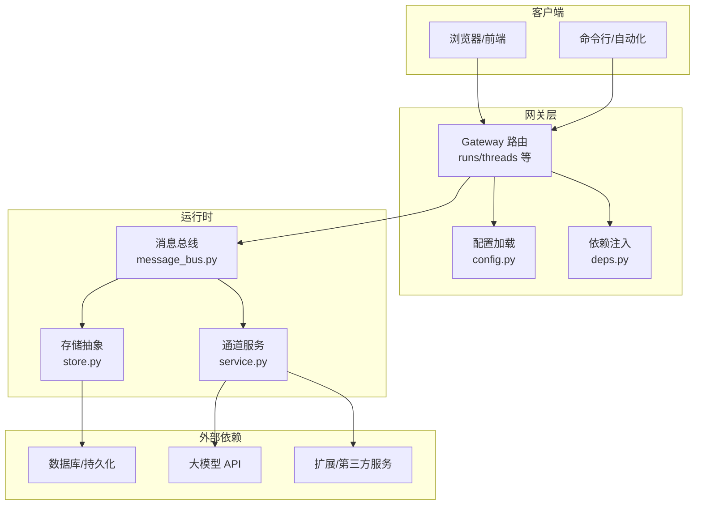
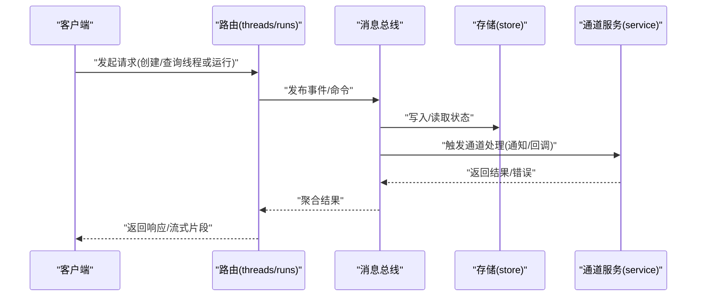
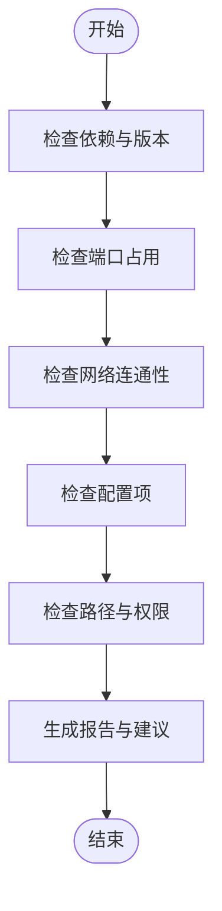
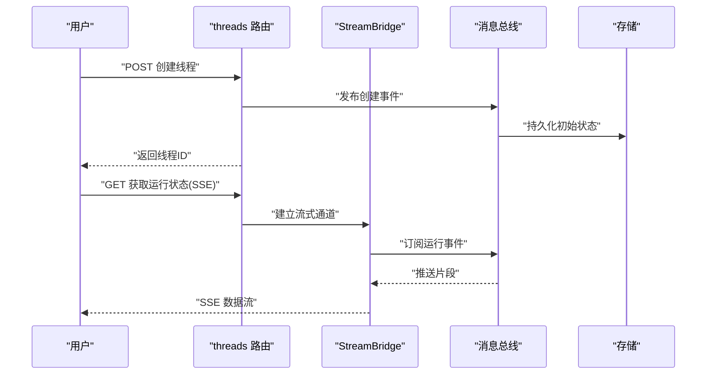
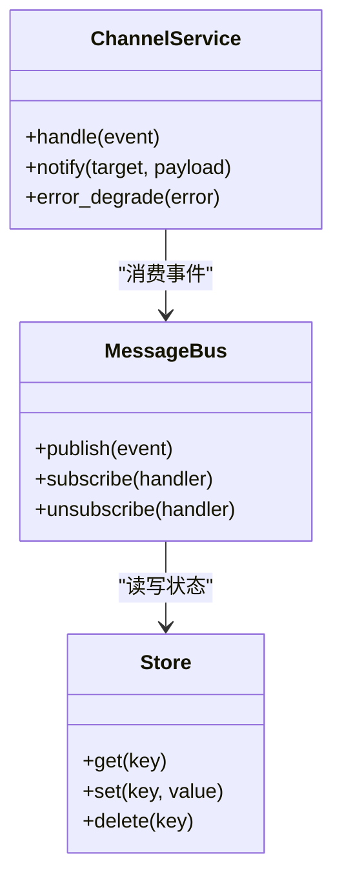
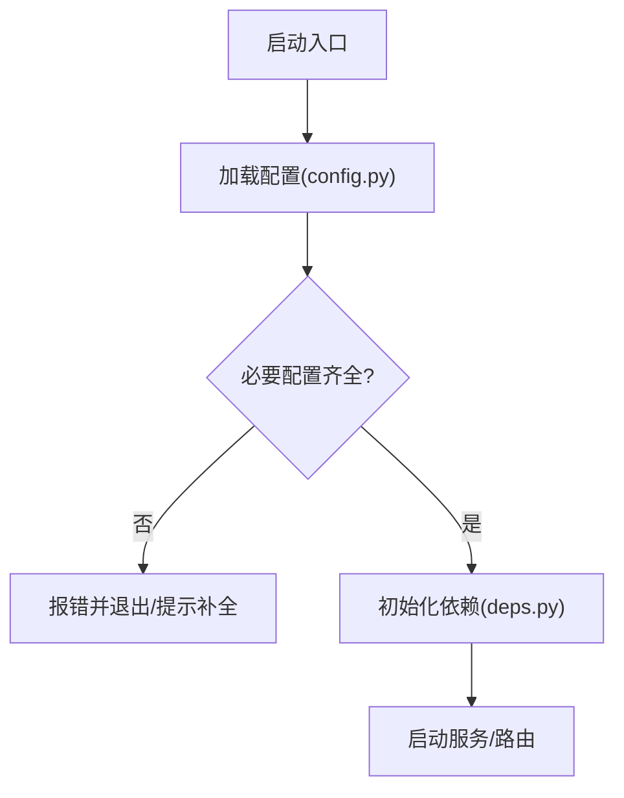
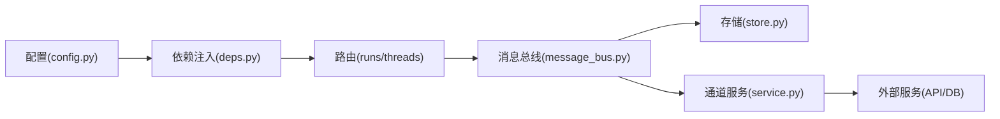

# 故障排除

<cite>
**本文引用的文件**   
- [scripts/doctor.py](file://scripts/doctor.py)
- [.agent/skills/smoke-test/scripts/health_check.sh](file://.agent/skills/smoke-test/scripts/health_check.sh)
- [.agent/skills/smoke-test/scripts/check_docker.sh](file://.agent/skills/smoke-test/scripts/check_docker.sh)
- [.agent/skills/smoke-test/scripts/check_local_env.sh](file://.agent/skills/smoke-test/scripts/check_local_env.sh)
- [.agent/skills/smoke-test/references/troubleshooting.md](file://.agent/skills/smoke-test/references/troubleshooting.md)
- [backend/app/gateway/routers/runs.py](file://backend/app/gateway/routers/runs.py)
- [backend/app/gateway/routers/threads.py](file://backend/app/gateway/routers/threads.py)
- [backend/app/channels/message_bus.py](file://backend/app/channels/message_bus.py)
- [backend/app/channels/store.py](file://backend/app/channels/store.py)
- [backend/app/channels/service.py](file://backend/app/channels/service.py)
- [docker/docker-compose.yaml](file://docker/docker-compose.yaml)
- [docker/nginx/nginx.conf](file://docker/nginx/nginx.conf)
- [backend/app/gateway/config.py](file://backend/app/gateway/config.py)
- [backend/app/gateway/deps.py](file://backend/app/gateway/deps.py)
- [backend/tests/test_doctor.py](file://backend/tests/test_doctor.py)
- [backend/tests/test_stream_bridge.py](file://backend/tests/test_stream_bridge.py)
- [backend/tests/test_channels.py](file://backend/tests/test_channels.py)
- [backend/tests/test_sse_format.py](file://backend/tests/test_sse_format.py)
- [backend/docs/STREAMING.md](file://backend/docs/STREAMING.md)
- [backend/docs/ARCHITECTURE.md](file://backend/docs/ARCHITECTURE.md)
- [backend/docs/CONFIGURATION.md](file://backend/docs/CONFIGURATION.md)
- [config.example.yaml](file://config.example.yaml)
- [extensions_config.example.json](file://extensions_config.example.json)
</cite>

## 目录
1. [简介](#简介)
2. [项目结构](#项目结构)
3. [核心组件](#核心组件)
4. [架构总览](#架构总览)
5. [详细组件分析](#详细组件分析)
6. [依赖关系分析](#依赖关系分析)
7. [性能考虑](#性能考虑)
8. [故障排除指南](#故障排除指南)
9. [结论](#结论)
10. [附录](#附录)

## 简介
本指南面向 DeerFlow 的安装、配置、运行与运维人员，聚焦于快速定位并解决问题。内容覆盖：
- 常见问题与解决方案（安装、配置、运行时异常）
- 系统诊断工具使用（doctor 脚本、健康检查、日志分析）
- 性能问题诊断与优化（内存泄漏检测、CPU 使用率分析、数据库性能调优）
- 网络连接问题排查（API 调用失败、WebSocket/SSE 连接中断）
- 容器化与部署相关问题
- 监控告警配置与响应流程
- 社区支持与问题反馈模板

## 项目结构
DeerFlow 采用前后端分离与多通道消息总线架构，关键目录与职责如下：
- backend：后端服务、网关路由、消息通道、沙箱、技能与工具等
- docker：Docker Compose 编排与 Nginx 反向代理配置
- scripts：通用脚本（包含 doctor 诊断、环境检查、部署辅助等）
- .agent/skills/smoke-test：冒烟测试与健康检查脚本、参考文档
- frontend：前端应用（与故障排除关联度较低，此处略）

图表来源
- [backend/app/gateway/routers/runs.py](file://backend/app/gateway/routers/runs.py)
- [backend/app/gateway/routers/threads.py](file://backend/app/gateway/routers/threads.py)
- [backend/app/channels/message_bus.py](file://backend/app/channels/message_bus.py)
- [backend/app/channels/store.py](file://backend/app/channels/store.py)
- [backend/app/channels/service.py](file://backend/app/channels/service.py)
- [backend/app/gateway/config.py](file://backend/app/gateway/config.py)
- [backend/app/gateway/deps.py](file://backend/app/gateway/deps.py)

章节来源
- [backend/docs/ARCHITECTURE.md](file://backend/docs/ARCHITECTURE.md)
- [backend/docs/CONFIGURATION.md](file://backend/docs/CONFIGURATION.md)

## 核心组件
- 诊断与健康检查
  - doctor 脚本：一键环境自检、依赖校验、端口占用、网络连通性、基础配置项验证
  - 健康检查脚本：对关键服务进行可达性与基本功能探测
- 网关路由
  - runs/threads 路由：处理任务执行与线程状态查询，暴露 SSE/流式输出能力
- 消息通道与存储
  - message_bus：统一消息分发与订阅
  - store：存储抽象，对接不同后端（如本地、远程、数据库）
  - service：通道服务封装，协调消息流转与错误降级
- 配置与依赖注入
  - config.py：集中读取配置（环境变量、配置文件）
  - deps.py：提供可插拔的依赖实例（如存储、缓存、外部服务）

章节来源
- [scripts/doctor.py](file://scripts/doctor.py)
- [.agent/skills/smoke-test/scripts/health_check.sh](file://.agent/skills/smoke-test/scripts/health_check.sh)
- [backend/app/gateway/routers/runs.py](file://backend/app/gateway/routers/runs.py)
- [backend/app/gateway/routers/threads.py](file://backend/app/gateway/routers/threads.py)
- [backend/app/channels/message_bus.py](file://backend/app/channels/message_bus.py)
- [backend/app/channels/store.py](file://backend/app/channels/store.py)
- [backend/app/channels/service.py](file://backend/app/channels/service.py)
- [backend/app/gateway/config.py](file://backend/app/gateway/config.py)
- [backend/app/gateway/deps.py](file://backend/app/gateway/deps.py)

## 架构总览
下图展示了从请求进入、路由到消息总线与存储的关键路径，以及常见故障点。

图表来源
- [backend/app/gateway/routers/runs.py](file://backend/app/gateway/routers/runs.py)
- [backend/app/gateway/routers/threads.py](file://backend/app/gateway/routers/threads.py)
- [backend/app/channels/message_bus.py](file://backend/app/channels/message_bus.py)
- [backend/app/channels/store.py](file://backend/app/channels/store.py)
- [backend/app/channels/service.py](file://backend/app/channels/service.py)

## 详细组件分析

### 诊断与健康检查
- doctor 脚本
  - 作用：检查 Python/依赖版本、端口占用、网络连通性、基础配置项、关键路径权限等
  - 典型用法：在项目根目录执行，按提示修复缺失项
  - 相关测试：[test_doctor.py](file://backend/tests/test_doctor.py)
- 健康检查脚本
  - 作用：探测后端服务是否存活、关键接口是否可用
  - 适用场景：容器编排探针、CI 冒烟测试
- Docker 与环境检查
  - check_docker.sh：验证 Docker 引擎、镜像、网络
  - check_local_env.sh：验证本地开发环境（Python、依赖、端口）

图表来源
- [scripts/doctor.py](file://scripts/doctor.py)
- [.agent/skills/smoke-test/scripts/check_docker.sh](file://.agent/skills/smoke-test/scripts/check_docker.sh)
- [.agent/skills/smoke-test/scripts/check_local_env.sh](file://.agent/skills/smoke-test/scripts/check_local_env.sh)
- [.agent/skills/smoke-test/scripts/health_check.sh](file://.agent/skills/smoke-test/scripts/health_check.sh)

章节来源
- [scripts/doctor.py](file://scripts/doctor.py)
- [backend/tests/test_doctor.py](file://backend/tests/test_doctor.py)
- [.agent/skills/smoke-test/references/troubleshooting.md](file://.agent/skills/smoke-test/references/troubleshooting.md)

### 网关路由与流式输出
- runs/threads 路由负责任务生命周期管理与线程状态查询
- 流式输出（SSE）用于实时推送中间结果与最终结果
- 常见问题：SSE 格式不正确、连接过早关闭、超时设置不当

图表来源
- [backend/app/gateway/routers/threads.py](file://backend/app/gateway/routers/threads.py)
- [backend/app/gateway/routers/runs.py](file://backend/app/gateway/routers/runs.py)
- [backend/tests/test_stream_bridge.py](file://backend/tests/test_stream_bridge.py)
- [backend/tests/test_sse_format.py](file://backend/tests/test_sse_format.py)
- [backend/docs/STREAMING.md](file://backend/docs/STREAMING.md)

章节来源
- [backend/app/gateway/routers/runs.py](file://backend/app/gateway/routers/runs.py)
- [backend/app/gateway/routers/threads.py](file://backend/app/gateway/routers/threads.py)
- [backend/tests/test_stream_bridge.py](file://backend/tests/test_stream_bridge.py)
- [backend/tests/test_sse_format.py](file://backend/tests/test_sse_format.py)
- [backend/docs/STREAMING.md](file://backend/docs/STREAMING.md)

### 消息通道与存储
- message_bus：统一消息分发，支持订阅/发布模式
- store：存储抽象，便于切换不同后端实现
- service：通道服务，封装业务逻辑与错误处理

图表来源
- [backend/app/channels/message_bus.py](file://backend/app/channels/message_bus.py)
- [backend/app/channels/store.py](file://backend/app/channels/store.py)
- [backend/app/channels/service.py](file://backend/app/channels/service.py)

章节来源
- [backend/app/channels/message_bus.py](file://backend/app/channels/message_bus.py)
- [backend/app/channels/store.py](file://backend/app/channels/store.py)
- [backend/app/channels/service.py](file://backend/app/channels/service.py)
- [backend/tests/test_channels.py](file://backend/tests/test_channels.py)

### 配置与依赖注入
- config.py：集中读取配置，支持环境变量与配置文件
- deps.py：提供可插拔依赖（如存储、缓存、外部服务）
- 示例配置：config.example.yaml、extensions_config.example.json

图表来源
- [backend/app/gateway/config.py](file://backend/app/gateway/config.py)
- [backend/app/gateway/deps.py](file://backend/app/gateway/deps.py)
- [config.example.yaml](file://config.example.yaml)
- [extensions_config.example.json](file://extensions_config.example.json)

章节来源
- [backend/app/gateway/config.py](file://backend/app/gateway/config.py)
- [backend/app/gateway/deps.py](file://backend/app/gateway/deps.py)
- [config.example.yaml](file://config.example.yaml)
- [extensions_config.example.json](file://extensions_config.example.json)

## 依赖关系分析
- 组件耦合
  - 路由层依赖配置与依赖注入模块
  - 消息总线与存储解耦，通过抽象接口替换实现
  - 通道服务依赖消息总线与外部服务
- 外部依赖
  - 数据库/持久化、大模型 API、扩展服务
- 潜在循环依赖
  - 避免在 deps.py 中直接引用具体服务实现，应通过工厂或注册表管理

图表来源
- [backend/app/gateway/config.py](file://backend/app/gateway/config.py)
- [backend/app/gateway/deps.py](file://backend/app/gateway/deps.py)
- [backend/app/gateway/routers/runs.py](file://backend/app/gateway/routers/runs.py)
- [backend/app/gateway/routers/threads.py](file://backend/app/gateway/routers/threads.py)
- [backend/app/channels/message_bus.py](file://backend/app/channels/message_bus.py)
- [backend/app/channels/store.py](file://backend/app/channels/store.py)
- [backend/app/channels/service.py](file://backend/app/channels/service.py)

章节来源
- [backend/docs/ARCHITECTURE.md](file://backend/docs/ARCHITECTURE.md)

## 性能考虑
- 内存泄漏检测
  - 使用进程级监控工具（如 psutil、tracemalloc）观察内存增长趋势
  - 针对长连接（SSE/WebSocket）与消息队列消费者进行资源释放审计
- CPU 使用率分析
  - 使用 cProfile/py-spy 定位热点函数
  - 关注模型推理、序列化/反序列化、I/O 密集路径
- 数据库性能调优
  - 检查慢查询与索引命中情况
  - 调整连接池大小与事务隔离级别
  - 对高频读路径引入缓存层（Redis/Memcached）
- 流式输出优化
  - 合理设置缓冲区大小与超时时间
  - 避免在流式处理中进行阻塞 I/O

[本节为通用指导，不直接分析具体文件]

## 故障排除指南

### 安装问题
- 环境依赖缺失
  - 现象：导入失败、命令不可用
  - 排查：运行 doctor 脚本，根据建议安装缺失依赖
  - 参考：[scripts/doctor.py](file://scripts/doctor.py)、[backend/tests/test_doctor.py](file://backend/tests/test_doctor.py)
- Docker 环境问题
  - 现象：镜像拉取失败、容器无法启动
  - 排查：使用 check_docker.sh 验证 Docker 引擎与网络；检查 docker-compose.yaml 中的镜像与端口映射
  - 参考：[docker/docker-compose.yaml](file://docker/docker-compose.yaml)、[.agent/skills/smoke-test/scripts/check_docker.sh](file://.agent/skills/smoke-test/scripts/check_docker.sh)

章节来源
- [scripts/doctor.py](file://scripts/doctor.py)
- [backend/tests/test_doctor.py](file://backend/tests/test_doctor.py)
- [docker/docker-compose.yaml](file://docker/docker-compose.yaml)
- [.agent/skills/smoke-test/scripts/check_docker.sh](file://.agent/skills/smoke-test/scripts/check_docker.sh)

### 配置错误
- 必要配置缺失
  - 现象：启动时报错、关键功能不可用
  - 排查：对照示例配置（config.example.yaml、extensions_config.example.json），确认环境变量与配置文件一致
  - 参考：[backend/app/gateway/config.py](file://backend/app/gateway/config.py)、[config.example.yaml](file://config.example.yaml)、[extensions_config.example.json](file://extensions_config.example.json)
- 路径与权限问题
  - 现象：文件上传/下载失败、日志无法写入
  - 排查：检查挂载目录与权限；使用 doctor 脚本的路径检查项

章节来源
- [backend/app/gateway/config.py](file://backend/app/gateway/config.py)
- [config.example.yaml](file://config.example.yaml)
- [extensions_config.example.json](file://extensions_config.example.json)

### 运行时异常
- 消息总线异常
  - 现象：事件未送达、消费者无响应
  - 排查：检查消息总线订阅关系与错误降级策略；查看通道服务日志
  - 参考：[backend/app/channels/message_bus.py](file://backend/app/channels/message_bus.py)、[backend/app/channels/service.py](file://backend/app/channels/service.py)、[backend/tests/test_channels.py](file://backend/tests/test_channels.py)
- 存储层异常
  - 现象：状态不一致、读写超时
  - 排查：检查存储后端连接与重试策略；必要时回滚事务
  - 参考：[backend/app/channels/store.py](file://backend/app/channels/store.py)

章节来源
- [backend/app/channels/message_bus.py](file://backend/app/channels/message_bus.py)
- [backend/app/channels/service.py](file://backend/app/channels/service.py)
- [backend/app/channels/store.py](file://backend/app/channels/store.py)
- [backend/tests/test_channels.py](file://backend/tests/test_channels.py)

### 网络连接问题
- API 调用失败
  - 现象：网关返回 5xx 或超时
  - 排查：检查外部服务可达性、证书与代理设置；使用 health_check.sh 进行连通性探测
  - 参考：[.agent/skills/smoke-test/scripts/health_check.sh](file://.agent/skills/smoke-test/scripts/health_check.sh)
- SSE/WebSocket 连接中断
  - 现象：前端断流、长时间无响应
  - 排查：检查 Nginx 超时与缓冲配置；确认路由层正确推送 SSE 片段
  - 参考：[docker/nginx/nginx.conf](file://docker/nginx/nginx.conf)、[backend/app/gateway/routers/runs.py](file://backend/app/gateway/routers/runs.py)、[backend/app/gateway/routers/threads.py](file://backend/app/gateway/routers/threads.py)、[backend/tests/test_stream_bridge.py](file://backend/tests/test_stream_bridge.py)、[backend/tests/test_sse_format.py](file://backend/tests/test_sse_format.py)、[backend/docs/STREAMING.md](file://backend/docs/STREAMING.md)

章节来源
- [.agent/skills/smoke-test/scripts/health_check.sh](file://.agent/skills/smoke-test/scripts/health_check.sh)
- [docker/nginx/nginx.conf](file://docker/nginx/nginx.conf)
- [backend/app/gateway/routers/runs.py](file://backend/app/gateway/routers/runs.py)
- [backend/app/gateway/routers/threads.py](file://backend/app/gateway/routers/threads.py)
- [backend/tests/test_stream_bridge.py](file://backend/tests/test_stream_bridge.py)
- [backend/tests/test_sse_format.py](file://backend/tests/test_sse_format.py)
- [backend/docs/STREAMING.md](file://backend/docs/STREAMING.md)

### 容器化与部署
- 端口冲突
  - 现象：服务启动失败
  - 排查：使用 doctor 脚本检查端口占用；修改 docker-compose.yaml 映射
- 反向代理配置
  - 现象：静态资源 404、SSE 被截断
  - 排查：检查 nginx.conf 的 location 与 proxy_set_header；确保开启 keepalive 与合适的超时
- 健康检查探针
  - 现象：Kubernetes/编排平台判定服务不健康
  - 排查：使用 health_check.sh 作为 liveness/readiness 探针

章节来源
- [docker/docker-compose.yaml](file://docker/docker-compose.yaml)
- [docker/nginx/nginx.conf](file://docker/nginx/nginx.conf)
- [.agent/skills/smoke-test/scripts/health_check.sh](file://.agent/skills/smoke-test/scripts/health_check.sh)

### 监控告警与响应流程
- 指标采集
  - 建议采集：QPS、延迟分布、错误率、SSE 连接数、消息总线积压、存储读写耗时
- 告警规则
  - 错误率阈值、SSE 断连频率、存储超时比例、外部 API 失败率
- 响应流程
  - 自动恢复（重试/熔断）、人工介入（扩容/回滚）、问题复盘（记录根因与改进措施）

[本节为通用指导，不直接分析具体文件]

### 社区支持与问题反馈
- 社区渠道
  - GitHub Issues、讨论区、贡献指南
- 问题反馈模板
  - 标题：简明描述问题
  - 环境信息：操作系统、Python/Node/Docker 版本、部署方式（本地/容器/云）
  - 复现步骤：最小化复现场景与输入
  - 期望行为与实际行为
  - 日志与截图：关键日志片段、错误堆栈、网络抓包摘要
  - 附加信息：配置项变更、最近部署版本、相关 PR/Commit

[本节为通用指导，不直接分析具体文件]

## 结论
通过系统化的诊断工具（doctor、健康检查）、清晰的架构图与组件职责划分，以及对常见问题的分门别类排查，能够快速定位 DeerFlow 的安装、配置、运行与网络问题。结合性能分析与监控告警，可有效提升系统的稳定性与可观测性。

## 附录
- 常用命令与路径
  - 诊断：scripts/doctor.py
  - 健康检查：.agent/skills/smoke-test/scripts/health_check.sh
  - 环境检查：.agent/skills/smoke-test/scripts/check_local_env.sh
  - Docker 检查：.agent/skills/smoke-test/scripts/check_docker.sh
  - 配置示例：config.example.yaml、extensions_config.example.json
  - 网关路由：backend/app/gateway/routers/runs.py、backend/app/gateway/routers/threads.py
  - 消息通道：backend/app/channels/message_bus.py、backend/app/channels/store.py、backend/app/channels/service.py
  - 配置与依赖：backend/app/gateway/config.py、backend/app/gateway/deps.py
  - 流式输出文档：backend/docs/STREAMING.md
  - 架构文档：backend/docs/ARCHITECTURE.md
  - 配置文档：backend/docs/CONFIGURATION.md

[本节为汇总信息，不直接分析具体文件]