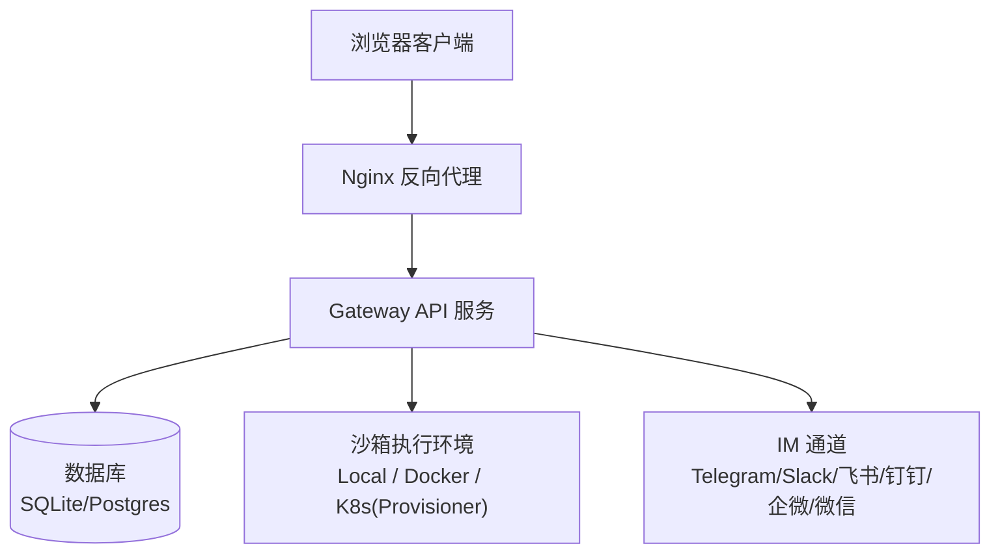
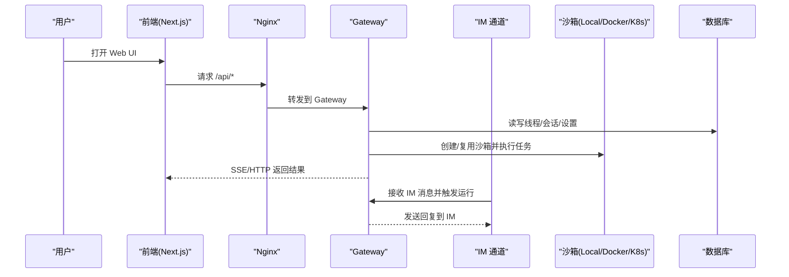
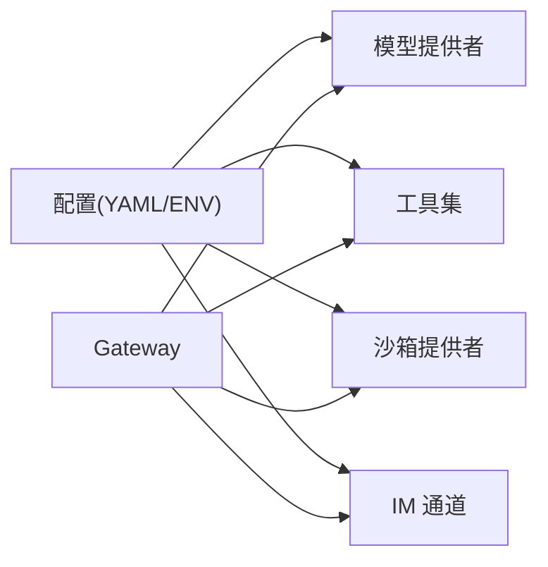

# 常见问题解答

<cite>
**本文引用的文件**   
- [README.md](file://README.md)
- [backend/docs/SETUP.md](file://backend/docs/SETUP.md)
- [backend/docs/CONFIGURATION.md](file://backend/docs/CONFIGURATION.md)
- [backend/docs/IM_CHANNEL_CONNECTIONS.md](file://backend/docs/IM_CHANNEL_CONNECTIONS.md)
- [backend/docs/SANDBOX_MEMORY_PROFILING.md](file://backend/docs/SANDBOX_MEMORY_PROFILING.md)
- [backend/docs/MEMORY_IMPROVEMENTS.md](file://backend/docs/MEMORY_IMPROVEMENTS.md)
- [backend/docs/MEMORY_SETTINGS_REVIEW.md](file://backend/docs/MEMORY_SETTINGS_REVIEW.md)
- [docker/docker-compose.yaml](file://docker/docker-compose.yaml)
- [docker/provisioner/app.py](file://docker/provisioner/app.py)
- [scripts/sandbox_memory_profile.py](file://scripts/sandbox_memory_profile.py)
</cite>

## 目录
1. [简介](#简介)
2. [项目结构](#项目结构)
3. [核心组件](#核心组件)
4. [架构总览](#架构总览)
5. [详细组件分析](#详细组件分析)
6. [依赖分析](#依赖分析)
7. [性能注意事项](#性能注意事项)
8. [故障排查指南](#故障排查指南)
9. [结论](#结论)
10. [附录](#附录)

## 简介
本 FAQ 面向 DeerFlow 的安装、配置与运行过程中常见问题的快速定位与解决，覆盖以下主题：
- 安装与环境：Python/Node.js 版本、Docker 权限、镜像拉取与网络代理
- LLM 提供商认证：API Key、OAuth、OpenAI 兼容网关、Thinking/Reasoning 模型
- 沙箱执行环境：本地/Docker/Kubernetes 模式、DooD 安全、Provisioner 部署
- IM 渠道集成：Telegram、Slack、飞书/Lark、钉钉、企业微信、微信 iLink
- 性能诊断：内存泄漏检测、CPU 使用率优化、数据库连接池与并发

## 项目结构
DeerFlow 采用前后端分离与多服务编排：
- 后端 Gateway（FastAPI）提供统一入口，承载 Agent 运行时、持久化、通道接入等
- 前端 Next.js 应用通过 Nginx 反向代理访问 Gateway
- Docker Compose 编排 Gateway、Nginx、可选 Provisioner（K8s 沙箱编排）
- 文档位于 backend/docs，包含配置、沙箱、IM 通道、记忆系统改进等专题

图表来源
- [README.md](file://README.md)
- [docker/docker-compose.yaml](file://docker/docker-compose.yaml)
- [docker/provisioner/app.py](file://docker/provisioner/app.py)

章节来源
- [README.md](file://README.md)
- [docker/docker-compose.yaml](file://docker/docker-compose.yaml)

## 核心组件
- 配置中心：YAML 配置文件 + 环境变量注入，支持版本升级与自动合并
- 模型与工具：多 LLM 提供商、OpenAI 兼容网关、Thinking/Reasoning 模型适配
- 沙箱执行：Local、AioSandbox(Docker)、Provisioner(K8s)、BoxLite、E2B
- IM 通道：长轮询/WebSocket/Stream 等多种传输，支持用户绑定与鉴权策略
- 可观测性：LangSmith/Langfuse 追踪、请求级 Trace 关联
- 记忆系统：事实注入、置信度排序、Token 预算控制

章节来源
- [backend/docs/CONFIGURATION.md](file://backend/docs/CONFIGURATION.md)
- [README.md](file://README.md)

## 架构总览
下图展示典型部署中各组件的交互关系与数据流向。

图表来源
- [README.md](file://README.md)
- [docker/docker-compose.yaml](file://docker/docker-compose.yaml)
- [docker/provisioner/app.py](file://docker/provisioner/app.py)

## 详细组件分析

### 安装与环境问题
- Python 版本不兼容
  - 现象：启动失败或依赖解析异常
  - 原因：DeerFlow 要求 Python 3.12+；旧版本无法满足包约束
  - 处理：使用 pyenv/conda 切换至 3.12+；重新初始化虚拟环境并安装依赖
  - 参考：README 中标注 Python 3.12+

- Node.js 版本错误
  - 现象：前端构建/开发报错
  - 原因：需要 Node.js 22+；低版本导致脚本或语法不兼容
  - 处理：使用 nvm 安装 Node 22+；清理 node_modules 后重试
  - 参考：README 中标注 Node.js 22+

- Docker 容器运行时问题
  - 现象：Linux 下报“permission denied while trying to connect to the Docker daemon socket”
  - 原因：当前用户不在 docker 组或缺少对 /var/run/docker.sock 的访问权限
  - 处理：将用户加入 docker 组并重新登录；或使用 sudo（仅临时）
  - 参考：README 中的 Docker 权限提示

- 镜像拉取慢/失败
  - 现象：首次运行卡住或超时
  - 原因：镜像较大且网络受限
  - 处理：提前拉取沙箱镜像；在受限网络导出 UV_INDEX_URL/NPM_REGISTRY 加速
  - 参考：README 中关于 make setup-sandbox 与镜像预拉取说明

- 配置未生效或找不到
  - 现象：启动时报“Config file not found”
  - 原因：config.yaml 位置不正确或未设置 DEER_FLOW_PROJECT_ROOT/DEER_FLOW_CONFIG_PATH
  - 处理：将 config.yaml 放在项目根目录；或通过环境变量指定路径
  - 参考：backend/docs/SETUP.md 与 CONFIGURATION.md

章节来源
- [README.md](file://README.md)
- [backend/docs/SETUP.md](file://backend/docs/SETUP.md)
- [backend/docs/CONFIGURATION.md](file://backend/docs/CONFIGURATION.md)

### LLM 提供商认证失败
- API Key 配置错误
  - 现象：调用模型时报 Invalid API key 或 401/403
  - 原因：环境变量未设置、变量名不一致、$ 引用未生效
  - 处理：在 .env 中设置对应变量；确保 YAML 中使用 $VAR 引用；重启服务
  - 参考：CONFIGURATION.md 的环境变量与示例

- OpenAI 兼容网关(base_url)配置错误
  - 现象：请求被拒或路由错误
  - 原因：误用 api_base 而非 base_url；或 base_url 指向非兼容端点
  - 处理：使用 base_url；确认端点遵循 OpenAI 协议
  - 参考：CONFIGURATION.md 中对 base_url 的说明

- OAuth 认证流程问题（Claude Code/Codex CLI）
  - 现象：CLI 模式无法获取令牌或登录失败
  - 原因：macOS 未自动探测 Keychain；凭证路径不正确
  - 处理：使用 export_claude_code_oauth.py 显式导出；检查 ~/.codex/auth.json 或 ~/.claude/.credentials.json
  - 参考：README 与 CONFIGURATION.md 中 CLI 提供商说明

- Thinking/Reasoning 模型参数不匹配
  - 现象：400 INVALID_ARGUMENT 或 reasoning 字段丢失
  - 原因：部分模型需额外 extra_body 或保留 reasoning_content/thought_signature
  - 处理：按模型文档配置 supports_thinking 与 when_thinking_enabled；必要时使用 PatchedChat* 类
  - 参考：CONFIGURATION.md 中 Thinking/Reasoning 与 Patched 类说明

- 网络访问限制
  - 现象：连接超时或证书错误
  - 原因：代理/防火墙阻断；自托管服务证书未信任
  - 处理：配置代理；为自托管服务添加 CA；验证端口可达
  - 参考：README 中关于代理与镜像拉取的说明

章节来源
- [backend/docs/CONFIGURATION.md](file://backend/docs/CONFIGURATION.md)
- [README.md](file://README.md)

### 沙箱执行环境问题
- 本地沙箱权限问题
  - 现象：文件写入失败或 bash 不可用
  - 原因：Local 模式下默认禁用 host bash；路径不可写
  - 处理：仅在可信本地工作流启用 allow_host_bash；确保 workspace/outputs 可写
  - 参考：CONFIGURATION.md 中 LocalSandboxProvider 与安全说明

- Docker 沙箱配置
  - 现象：容器启动失败或端口冲突
  - 原因：Docker 未运行；端口占用；镜像不可达
  - 处理：启动 Docker；释放端口；拉取镜像；必要时自定义 image
  - 参考：CONFIGURATION.md 中 AioSandboxProvider 与自定义镜像

- Kubernetes 部署（Provisioner 模式）
  - 现象：Pod 无法调度或沙箱不可用
  - 原因：集群未就绪；Provisioner 未启动；镜像拉取失败
  - 处理：检查 K8s 状态；启动 provisioner；配置 SANDBOX_IMAGE；查看 Pod 日志
  - 参考：CONFIGURATION.md 与 docker/provisioner/README.md

- DooD（Docker-in-Docker）安全风险
  - 现象：宿主机暴露风险
  - 原因：挂载 /var/run/docker.sock 赋予宿主 root 等价能力
  - 处理：优先使用 Provisioner/K8s 模式；如必须使用 aio，隔离宿主并考虑 Docker API 代理
  - 参考：CONFIGURATION.md 安全注意

章节来源
- [backend/docs/CONFIGURATION.md](file://backend/docs/CONFIGURATION.md)
- [docker/provisioner/app.py](file://docker/provisioner/app.py)

### IM 渠道集成问题
- Telegram Bot Token 配置
  - 现象：无法收到消息或机器人无响应
  - 原因：TELEGRAM_BOT_TOKEN 未设置或无效；channels.telegram.enabled 未开启
  - 处理：通过 @BotFather 创建机器人并复制 token；在 .env 与 config.yaml 中启用
  - 参考：README 中 Telegram 设置步骤

- Slack App 设置
  - 现象：事件订阅不触发或 Socket Mode 连接失败
  - 原因：缺少必要 scopes；未启用 Socket Mode；App-Level Token 缺失
  - 处理：添加 app_mentions:read/chat:write/im:* 等 scopes；启用 Socket Mode 生成 xapp-*；订阅事件
  - 参考：README 中 Slack 设置步骤

- 飞书/Lark 授权
  - 现象：机器人无法接收消息
  - 原因：未启用 Bot 能力；未订阅 im.message.receive_v1；域名配置错误
  - 处理：启用 Bot；添加 im:message 等权限；选择长连接模式；设置 domain（国内/国际）
  - 参考：README 中飞书设置步骤

- 钉钉/企业微信/微信 iLink
  - 现象：消息收发失败或二维码登录卡住
  - 原因：Stream 模式未开启；client_id/secret 错误；QR 引导未完成
  - 处理：按 README 指引完成应用创建、权限与回调模式；首次扫码绑定；持久化 state_dir
  - 参考：README 中各渠道设置步骤

- 用户绑定与鉴权策略
  - 现象：普通消息被拒绝或绑定失败
  - 原因：require_bound_identity=true 时未先完成绑定；connect code 泄露或被重复使用
  - 处理：从 Settings > Channels 发起绑定；保护一次性代码；理解 allowed_users 在绑定后的作用域
  - 参考：backend/docs/IM_CHANNEL_CONNECTIONS.md

章节来源
- [README.md](file://README.md)
- [backend/docs/IM_CHANNEL_CONNECTIONS.md](file://backend/docs/IM_CHANNEL_CONNECTIONS.md)

### 性能相关问题诊断
- 内存泄漏检测
  - 方法：使用 sandbox_memory_profile.py 在不同阶段采集快照；对比空沙箱、命令执行、导入库、生成产物、并发场景
  - 指标：Pod 级别 working set、进程 RSS、启动延迟、资源回收
  - 参考：backend/docs/SANDBOX_MEMORY_PROFILING.md 与 scripts/sandbox_memory_profile.py

- CPU 使用率优化
  - 建议：降低并发运行数；合理设置 max_concurrent_runs；避免长时间阻塞任务；使用异步与缓存
  - 参考：README 中部署规模建议与 scheduler 配置

- 数据库连接池配置
  - 建议：生产环境使用 Postgres；调整连接池大小与超时；监控慢查询与锁等待
  - 参考：README 中数据库后端选择与多 worker 注意事项

- 记忆系统注入与 Token 预算
  - 现状：基于 tiktoken 的准确计数；按置信度排序；受 max_injection_tokens 限制
  - 规划：TF-IDF 相似度召回与上下文感知检索（计划中）
  - 参考：backend/docs/MEMORY_IMPROVEMENTS.md 与 MEMORY_SETTINGS_REVIEW.md

章节来源
- [backend/docs/SANDBOX_MEMORY_PROFILING.md](file://backend/docs/SANDBOX_MEMORY_PROFILING.md)
- [scripts/sandbox_memory_profile.py](file://scripts/sandbox_memory_profile.py)
- [backend/docs/MEMORY_IMPROVEMENTS.md](file://backend/docs/MEMORY_IMPROVEMENTS.md)
- [backend/docs/MEMORY_SETTINGS_REVIEW.md](file://backend/docs/MEMORY_SETTINGS_REVIEW.md)
- [README.md](file://README.md)

## 依赖分析
- 外部依赖
  - LLM 提供商：OpenAI、Anthropic、DeepSeek、MiMo、OpenRouter 等
  - 沙箱运行时：Docker、Kubernetes、BoxLite、E2B
  - 可观测性：LangSmith、Langfuse
- 内部模块耦合
  - Gateway 与沙箱中间件链（输入清洗、上传、沙箱、LLM 错误处理、护栏、审计、读前写）
  - IM 通道复用现有出站传输，无需公网回调
  - 配置驱动模型与工具加载，环境变量注入密钥

图表来源
- [backend/docs/CONFIGURATION.md](file://backend/docs/CONFIGURATION.md)
- [README.md](file://README.md)

章节来源
- [backend/docs/CONFIGURATION.md](file://backend/docs/CONFIGURATION.md)
- [README.md](file://README.md)

## 性能注意事项
- 部署规模起步建议
  - 本地评估：至少 4 vCPU/8 GB RAM；推荐 8/16
  - Docker 开发：至少 4/8；推荐 8/16
  - 长期服务：至少 8/16；推荐 16/32
- 单 Worker 与 Redis 桥接
  - 生产默认 GATEWAY_WORKERS=1；Redis 桥接共享 SSE 与 Last-Event-ID 回放
- 并发与资源上限
  - 通过 scheduler.max_concurrent_runs 控制全局并发；避免 SQLite 在多 worker 下的竞态
- 沙箱资源与隔离
  - 优先使用 Provisioner/K8s；DooD 需谨慎；合理设置 replicas 与 idle_timeout

章节来源
- [README.md](file://README.md)
- [backend/docs/CONFIGURATION.md](file://backend/docs/CONFIGURATION.md)

## 故障排查指南
- 启动与配置
  - 使用 make doctor 自检；make support-bundle 收集诊断信息
  - 检查 config.yaml 位置与 DEER_FLOW_PROJECT_ROOT/DEER_FLOW_CONFIG_PATH
  - 参考：README 与 SETUP.md

- 认证与鉴权
  - 校验 JWT_SECRET、OAuth 凭据路径；确认 OIDC 回调与域名
  - 参考：CONFIGURATION.md 与 README 中 CLI 提供商说明

- 沙箱与容器
  - 检查 Docker 守护进程与权限；确认镜像可达与端口可用
  - 参考：README 与 CONFIGURATION.md

- IM 通道
  - 核对各平台 token/scopes/事件订阅；确认 channels.* 与 channel_connections 配置一致
  - 参考：README 与 IM_CHANNEL_CONNECTIONS.md

- 性能与资源
  - 使用 sandbox_memory_profile.py 采集快照；观察 Pod/进程内存与启动延迟
  - 参考：SANDBOX_MEMORY_PROFILING.md

章节来源
- [README.md](file://README.md)
- [backend/docs/SETUP.md](file://backend/docs/SETUP.md)
- [backend/docs/CONFIGURATION.md](file://backend/docs/CONFIGURATION.md)
- [backend/docs/IM_CHANNEL_CONNECTIONS.md](file://backend/docs/IM_CHANNEL_CONNECTIONS.md)
- [backend/docs/SANDBOX_MEMORY_PROFILING.md](file://backend/docs/SANDBOX_MEMORY_PROFILING.md)

## 结论
通过规范化的配置管理、安全的沙箱隔离与稳定的 IM 通道集成，DeerFlow 可在多种部署形态下稳定运行。遇到认证、网络、权限与性能问题时，建议优先依据本文档的定位步骤进行自检与数据采集，并结合 make doctor/support-bundle 输出进一步分析。

## 附录
- 常用命令
  - make setup / make dev / make docker-start / make up / make down
  - make check / make install / make setup-sandbox
  - python scripts/sandbox_memory_profile.py --sample <name> --format json
- 关键环境变量
  - OPENAI_API_KEY、ANTHROPIC_API_KEY、DEEPSEEK_API_KEY、MIMO_API_KEY、NOVITA_API_KEY
  - TAVILY_API_KEY、BRAVE_SEARCH_API_KEY、SERPER_API_KEY、GROUNDROUTE_API_KEY
  - BROWSERLESS_TOKEN、DEER_FLOW_PROJECT_ROOT、DEER_FLOW_CONFIG_PATH、DEER_FLOW_HOME、DEER_FLOW_SKILLS_PATH
- 参考文档
  - 配置指南：backend/docs/CONFIGURATION.md
  - 安装指南：backend/docs/SETUP.md
  - IM 通道连接：backend/docs/IM_CHANNEL_CONNECTIONS.md
  - 沙箱内存画像：backend/docs/SANDBOX_MEMORY_PROFILING.md
  - 记忆系统改进：backend/docs/MEMORY_IMPROVEMENTS.md