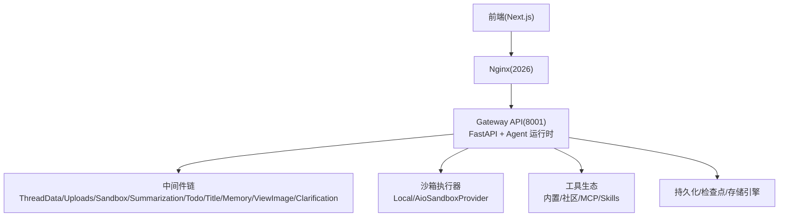
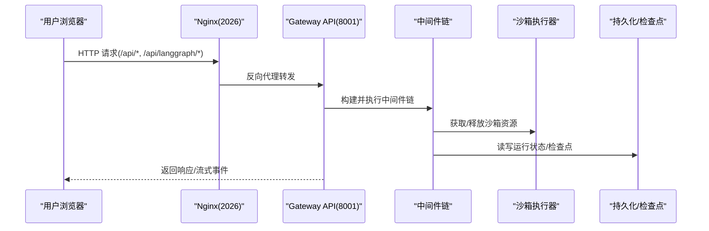
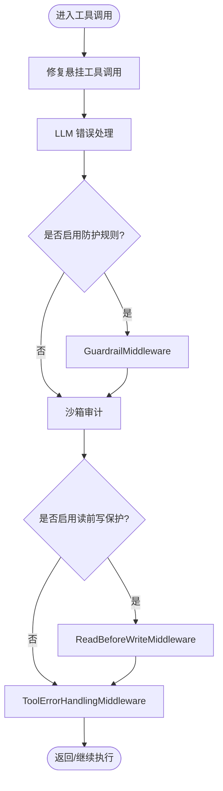
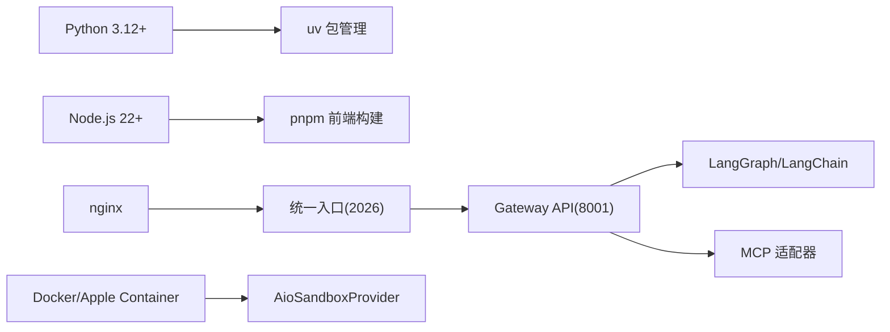

# 故障排除与调试

<cite>
**本文引用的文件**   
- [README.md](file://README.md)
- [backend/README.md](file://backend/README.md)
- [scripts/doctor.py](file://scripts/doctor.py)
- [scripts/support_bundle.py](file://scripts/support_bundle.py)
- [backend/packages/harness/deerflow/agents/middlewares/tool_error_handling_middleware.py](file://backend/packages/harness/deerflow/agents/middlewares/tool_error_handling_middleware.py)
</cite>

## 目录
1. [简介](#简介)
2. [项目结构](#项目结构)
3. [核心组件](#核心组件)
4. [架构总览](#架构总览)
5. [详细组件分析](#详细组件分析)
6. [依赖分析](#依赖分析)
7. [性能考虑](#性能考虑)
8. [故障排除指南](#故障排除指南)
9. [监控与告警](#监控与告警)
10. [结论](#结论)
11. [附录](#附录)

## 简介
本指南面向 DeerFlow 的运维与开发者，提供系统化的故障定位、日志与诊断工具使用、常见问题排查、性能调优与应急响应流程。内容覆盖安装与配置问题、运行时异常、性能瓶颈、Docker/Windows/企业网络环境差异，以及 doctor 命令与支持包（support bundle）生成和问题报告模板的使用。

## 项目结构
DeerFlow 采用前后端分离与多服务编排：Nginx 统一入口，Gateway API 承载 Agent 运行时与业务路由，前端为 Next.js 应用。后端通过中间件链组织跨切面能力（上传、沙箱、摘要、标题、记忆、图像、澄清等），并支持子代理并行执行与持久化记忆。

图示来源
- [backend/README.md:9-36](file://backend/README.md#L9-L36)
- [backend/README.md:39-134](file://backend/README.md#L39-L134)

章节来源
- [backend/README.md:9-36](file://backend/README.md#L9-L36)
- [backend/README.md:39-134](file://backend/README.md#L39-L134)

## 核心组件
- Gateway API：对外暴露 REST 接口，内部承载 LangGraph 兼容路径与业务路由。
- 中间件链：按严格顺序处理线程隔离、上传注入、沙箱生命周期、上下文摘要、待办跟踪、自动标题、异步记忆、图像注入与澄清拦截。
- 沙箱系统：本地或容器化执行，虚拟路径映射到线程专属目录，支持并发安全写入与工具集。
- 子代理系统：后台任务池并行执行，状态追踪与 SSE 事件回传。
- 记忆系统：LLM 驱动的长期记忆抽取与结构化存储，支持去重与延迟更新。
- 工具生态：内置、社区、MCP 与 Skills 组合扩展。

章节来源
- [backend/README.md:39-134](file://backend/README.md#L39-L134)

## 架构总览
下图展示从浏览器到后端的请求流转与关键组件交互。

图示来源
- [backend/README.md:9-36](file://backend/README.md#L9-L36)
- [backend/README.md:39-134](file://backend/README.md#L39-L134)

## 详细组件分析

### 诊断与健康检查：doctor 命令
- 功能：检查 Python/Node/pnpm/uv/nginx 版本、config.yaml 存在性与可加载性、模型配置与环境变量、Web 能力（搜索/抓取/截图/图片搜索）、沙箱模式与容器运行时可用性，输出带修复建议的诊断报告。
- 用法：在项目根目录执行 make doctor；若失败会返回非零退出码并列出错误项与修复提示。
- 典型问题与修复：
  - 缺少 Node.js 22+ 或 pnpm：安装对应版本。
  - config.yaml 缺失或不可加载：运行 make setup 或对照示例配置修复。
  - LLM 提供商包未安装或环境变量缺失：按提示安装依赖并设置密钥。
  - 沙箱模式不匹配或缺少 Docker/Apple Container：切换模式或安装运行时。

章节来源
- [scripts/doctor.py:1-120](file://scripts/doctor.py#L1-L120)
- [scripts/doctor.py:134-205](file://scripts/doctor.py#L134-L205)
- [scripts/doctor.py:207-285](file://scripts/doctor.py#L207-L285)
- [scripts/doctor.py:287-376](file://scripts/doctor.py#L287-L376)
- [scripts/doctor.py:433-584](file://scripts/doctor.py#L433-L584)
- [scripts/doctor.py:598-667](file://scripts/doctor.py#L598-L667)
- [scripts/doctor.py:685-780](file://scripts/doctor.py#L685-L780)

### 支持包生成：support bundle
- 功能：收集脱敏后的环境与配置摘要、Git 元数据、doctor 输出、可选线程文件清单，生成 zip 包与 Markdown 摘要，便于问题上报与维护者快速分诊。
- 隐私策略：不包含 .env、原始对话消息与用户文件内容；对敏感字段进行掩码处理。
- 产出物：issue-summary.md、ai-issue-draft.md、triage.json、manifest.json、environment.json、config-summary.json、extensions-summary.json、git.json、doctor.json（可选）、thread-summary.json（可选）。
- 用法：在项目根目录执行 make support-bundle；可按需包含 doctor 输出与特定 thread_id 的文件清单。

章节来源
- [scripts/support_bundle.py:1-123](file://scripts/support_bundle.py#L1-L123)
- [scripts/support_bundle.py:174-212](file://scripts/support_bundle.py#L174-L212)
- [scripts/support_bundle.py:266-283](file://scripts/support_bundle.py#L266-L283)
- [scripts/support_bundle.py:285-289](file://scripts/support_bundle.py#L285-L289)
- [scripts/support_bundle.py:456-521](file://scripts/support_bundle.py#L456-L521)
- [scripts/support_bundle.py:527-557](file://scripts/support_bundle.py#L527-L557)
- [scripts/support_bundle.py:707-746](file://scripts/support_bundle.py#L707-L746)
- [scripts/support_bundle.py:770-800](file://scripts/support_bundle.py#L770-L800)

### 运行时错误处理与恢复：工具错误中间件
- 职责：在工具调用链路中捕获与标准化错误，处理“悬挂工具调用”、LLM 错误、防护规则（guardrails）、沙箱审计、读前写保护等，确保中断与异常场景下的健壮性。
- 关键点：
  - 悬挂工具调用修复：在强制停止时清理 provider 级原始工具调用元数据并注入占位结果，避免下游模型因历史不一致报错。
  - 子代理链镜像：子代理继承循环检测与安全终止中间件，防止工具循环导致上下文膨胀与 token 消耗失控。
  - 安全终止原因过滤：屏蔽 finish_reason=content_filter 等导致的无效工具调用，避免向父代理传播错误。

图示来源
- [backend/packages/harness/deerflow/agents/middlewares/tool_error_handling_middleware.py:178-223](file://backend/packages/harness/deerflow/agents/middlewares/tool_error_handling_middleware.py#L178-L223)
- [backend/packages/harness/deerflow/agents/middlewares/tool_error_handling_middleware.py:236-305](file://backend/packages/harness/deerflow/agents/middlewares/tool_error_handling_middleware.py#L236-L305)

章节来源
- [backend/packages/harness/deerflow/agents/middlewares/tool_error_handling_middleware.py:178-223](file://backend/packages/harness/deerflow/agents/middlewares/tool_error_handling_middleware.py#L178-L223)
- [backend/packages/harness/deerflow/agents/middlewares/tool_error_handling_middleware.py:236-305](file://backend/packages/harness/deerflow/agents/middlewares/tool_error_handling_middleware.py#L236-L305)

## 依赖分析
- 外部依赖：Python 3.12+、Node.js 22+、pnpm、uv、nginx、Docker/Apple Container（视沙箱模式而定）。
- 运行时依赖：LangGraph/LangChain、FastAPI、MCP 适配器等。
- 配置依赖：config.yaml 与 extensions_config.json，环境变量通过 $VAR 引用注入。

图示来源
- [README.md:217-270](file://README.md#L217-L270)
- [backend/README.md:445-477](file://backend/README.md#L445-L477)

章节来源
- [README.md:217-270](file://README.md#L217-L270)
- [backend/README.md:445-477](file://backend/README.md#L445-L477)

## 性能考虑
- 部署规模建议：
  - 本地评估/开发：起步 4 vCPU/8 GB RAM，推荐 8 vCPU/16 GB RAM。
  - Docker 开发：起步 4 vCPU/8 GB RAM，推荐 8 vCPU/16 GB RAM。
  - 长期运行服务器：起步 8 vCPU/16 GB RAM，推荐 16 vCPU/32 GB RAM。
- 并发与资源：
  - 生产默认单 Gateway worker（GATEWAY_WORKERS=1），Redis 流桥共享 SSE 投递与 Last-Event-ID 回放，滚动 TTL 作为清理兜底。
  - CPU/内存持续打满时，优先降低并发运行数，再升级规格。
- 缓存与上下文：
  - 记忆系统支持去重与延迟更新，减少重复 LLM 调用。
  - 上下文摘要与技能按需加载，保持上下文窗口精简。
- 观测与追踪：
  - 支持 LangSmith 与 Langfuse 双提供者同时启用，附带会话/用户标签与 trace_id 关联。

章节来源
- [README.md:217-270](file://README.md#L217-L270)
- [README.md:542-600](file://README.md#L542-L600)
- [backend/README.md:88-107](file://backend/README.md#L88-L107)

## 故障排除指南

### 安装与环境问题
- 症状：make dev/docker-start 启动失败、端口占用、权限拒绝。
- 排查步骤：
  - 运行 make check 验证 Node.js 22+、pnpm、uv、nginx 可用。
  - 运行 make doctor 逐项检查系统要求、配置与 LLM 提供商。
  - Linux Docker 权限问题：将用户加入 docker 组并重登。
  - Windows 本地开发：使用 Git Bash 运行脚本，WSL 不保证兼容。
- 参考：
  - [README.md:270-320](file://README.md#L270-L320)
  - [README.md:246-248](file://README.md#L246-L248)

章节来源
- [README.md:270-320](file://README.md#L270-L320)
- [README.md:246-248](file://README.md#L246-L248)

### 配置错误
- 症状：Gateway 启动时报错、模型无法解析、工具不可用。
- 排查步骤：
  - 确认 config.yaml 存在且可加载，必要时运行 make setup 或 make config-upgrade。
  - 校验 models[*].use 模块路径与依赖包已安装。
  - 检查环境变量引用 $VAR 是否正确设置。
  - 使用 doctor 的“models configured”“config.yaml loadable”“LLM API key check”“LLM package check”等项定位。
- 参考：
  - [scripts/doctor.py:207-285](file://scripts/doctor.py#L207-L285)
  - [scripts/doctor.py:287-376](file://scripts/doctor.py#L287-L376)

章节来源
- [scripts/doctor.py:207-285](file://scripts/doctor.py#L207-L285)
- [scripts/doctor.py:287-376](file://scripts/doctor.py#L287-L376)

### 运行时异常
- 症状：工具调用失败、子代理卡死、上下文爆炸、token 消耗异常。
- 排查步骤：
  - 查看中间件链日志，关注 DanglingToolCallMiddleware、LLMErrorHandlingMiddleware、LoopDetectionMiddleware、SafetyFinishReasonMiddleware 的行为。
  - 确认子代理是否启用了循环检测与安全终止过滤。
  - 使用 support bundle 收集 triage.json 与 doctor.json，辅助维护者分诊。
- 参考：
  - [backend/packages/harness/deerflow/agents/middlewares/tool_error_handling_middleware.py:178-223](file://backend/packages/harness/deerflow/agents/middlewares/tool_error_handling_middleware.py#L178-L223)
  - [backend/packages/harness/deerflow/agents/middlewares/tool_error_handling_middleware.py:236-305](file://backend/packages/harness/deerflow/agents/middlewares/tool_error_handling_middleware.py#L236-L305)
  - [scripts/support_bundle.py:456-521](file://scripts/support_bundle.py#L456-L521)

章节来源
- [backend/packages/harness/deerflow/agents/middlewares/tool_error_handling_middleware.py:178-223](file://backend/packages/harness/deerflow/agents/middlewares/tool_error_handling_middleware.py#L178-L223)
- [backend/packages/harness/deerflow/agents/middlewares/tool_error_handling_middleware.py:236-305](file://backend/packages/harness/deerflow/agents/middlewares/tool_error_handling_middleware.py#L236-L305)
- [scripts/support_bundle.py:456-521](file://scripts/support_bundle.py#L456-L521)

### 性能问题
- 症状：CPU/内存持续高位、响应慢、SSE 断流。
- 排查步骤：
  - 根据部署规模建议调整资源；先降并发再升规格。
  - 检查 Redis 流桥 TTL 与单 worker 限制，避免跨 worker 状态不一致。
  - 开启 LangSmith/Langfuse 追踪，结合 trace_id 定位慢调用。
- 参考：
  - [README.md:217-270](file://README.md#L217-L270)
  - [README.md:542-600](file://README.md#L542-L600)

章节来源
- [README.md:217-270](file://README.md#L217-L270)
- [README.md:542-600](file://README.md#L542-L600)

### 特殊环境问题
- Docker 环境：
  - Linux Docker 权限拒绝：加入 docker 组并重登。
  - 受限网络镜像拉取：设置 UV_INDEX_URL/NPM_REGISTRY 加速。
- Windows 平台：
  - 本地开发需在 Git Bash 下运行脚本，cmd/PowerShell 不支持 bash 脚本。
- 企业网络：
  - 代理与镜像源：通过环境变量配置 uv/npm 镜像；CORS 与 CSRF 同源默认关闭跨域，需要显式设置 GATEWAY_CORS_ORIGINS。
- 参考：
  - [README.md:246-248](file://README.md#L246-L248)
  - [README.md:242-244](file://README.md#L242-L244)
  - [README.md:270-276](file://README.md#L270-L276)
  - [README.md:263-267](file://README.md#L263-L267)

章节来源
- [README.md:246-248](file://README.md#L246-L248)
- [README.md:242-244](file://README.md#L242-L244)
- [README.md:270-276](file://README.md#L270-L276)
- [README.md:263-267](file://README.md#L263-L267)

### 日志分析与追踪
- 请求追踪关联：
  - 启用 logging.enhance.enabled=true 后，HTTP 响应头 X-Trace-Id、日志 trace_id、Langfuse 元数据 deerflow_trace_id 一致。
- 追踪提供者：
  - LangSmith：设置 LANGSMITH_TRACING 及相关键值。
  - Langfuse：设置 LANGFUSE_TRACING 及公钥/私钥/基础 URL。
  - 两者可同时启用，同一运行数据上报至两个系统。
- 参考：
  - [README.md:542-600](file://README.md#L542-L600)

章节来源
- [README.md:542-600](file://README.md#L542-L600)

### 支持包与问题报告模板
- 生成支持包：
  - 执行 make support-bundle，产出 zip 与 issue-summary.md、ai-issue-draft.md、triage.json 等。
- 报告模板要点：
  - 使用 ai-issue-draft.md 作为 AI 辅助填写模板，替换所有 REQUIRED 占位符。
  - 仅当维护者要求或摘要不足以诊断时附上 zip。
- 参考：
  - [scripts/support_bundle.py:527-557](file://scripts/support_bundle.py#L527-L557)
  - [scripts/support_bundle.py:707-746](file://scripts/support_bundle.py#L707-L746)
  - [README.md:118-130](file://README.md#L118-L130)

章节来源
- [scripts/support_bundle.py:527-557](file://scripts/support_bundle.py#L527-L557)
- [scripts/support_bundle.py:707-746](file://scripts/support_bundle.py#L707-L746)
- [README.md:118-130](file://README.md#L118-L130)

## 监控与告警
- 追踪与可视化：
  - 启用 LangSmith/Langfuse 后，可在仪表盘查看模型调用、Agent 运行、工具执行与中间件处理轨迹。
  - 利用 session_id、user_id、trace_name、tags、deerflow_trace_id 等保留属性聚合会话与用户视图。
- 建议告警指标：
  - 网关错误率与延迟、SSE 断流次数、子代理超时与循环检测触发次数、沙箱健康状态、数据库迁移失败。
- 参考：
  - [README.md:542-600](file://README.md#L542-L600)
  - [backend/README.md:334-374](file://backend/README.md#L334-L374)

章节来源
- [README.md:542-600](file://README.md#L542-L600)
- [backend/README.md:334-374](file://backend/README.md#L334-L374)

## 结论
通过 doctor 与健康检查、支持包与问题模板、中间件错误处理与追踪体系，DeerFlow 提供了端到端的排障与诊断能力。配合合理的部署规模、并发与缓存策略，可有效提升稳定性与性能。建议在 CI/CD 中集成 doctor 与支持包生成，形成自动化问题上报与分诊闭环。

## 附录

### 常用命令速查
- 环境检查：make check
- 健康诊断：make doctor
- 生成支持包：make support-bundle
- 启动开发：make dev / make docker-start
- 启动生产：make up / deploy.sh

章节来源
- [README.md:270-320](file://README.md#L270-L320)
- [README.md:231-254](file://README.md#L231-L254)