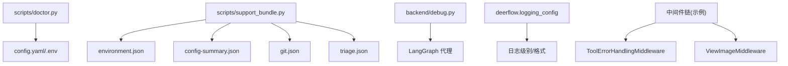
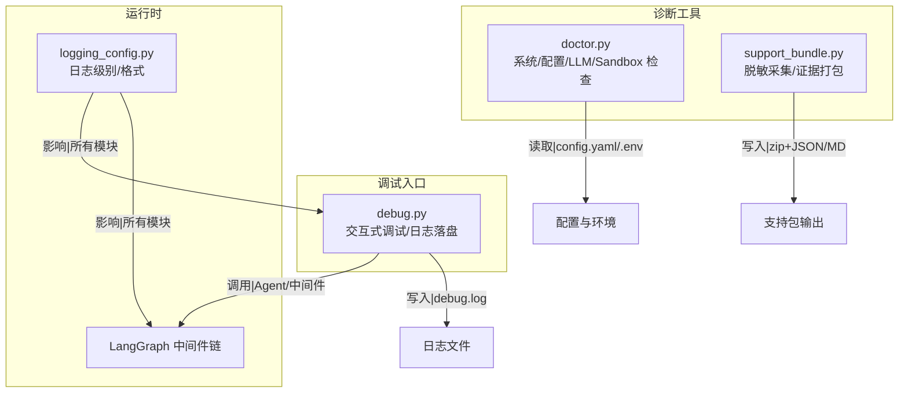
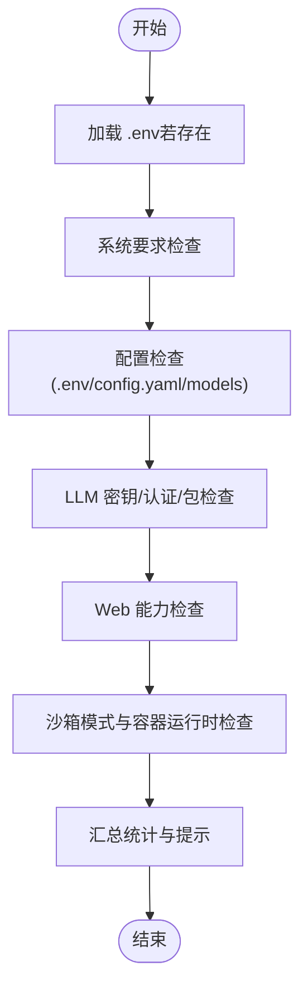
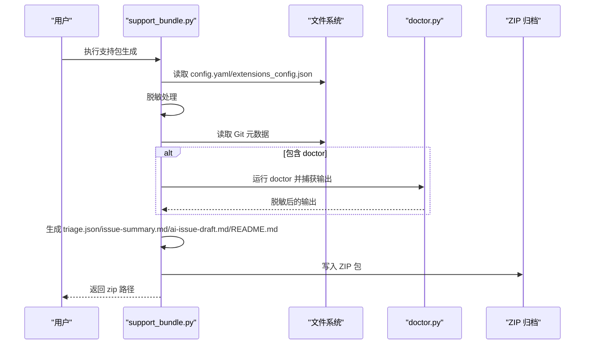
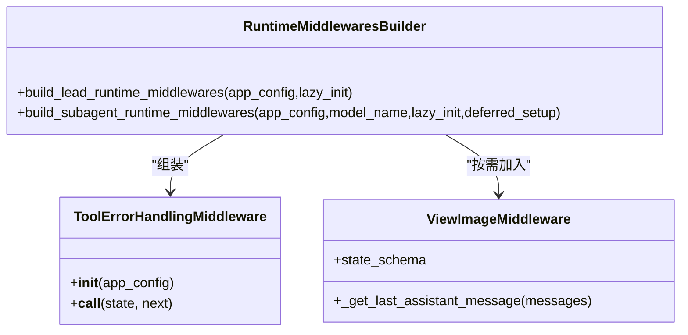
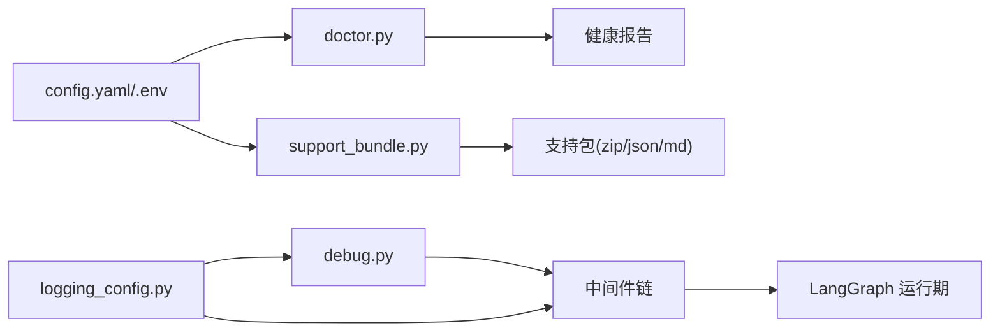

# 调试工具使用

<cite>
**本文引用的文件**   
- [scripts/doctor.py](file://scripts/doctor.py)
- [scripts/support_bundle.py](file://scripts/support_bundle.py)
- [backend/debug.py](file://backend/debug.py)
- [backend/packages/harness/deerflow/logging_config.py](file://backend/packages/harness/deerflow/logging_config.py)
- [backend/packages/harness/deerflow/agents/middlewares/tool_error_handling_middleware.py](file://backend/packages/harness/deerflow/agents/middlewares/tool_error_handling_middleware.py)
- [backend/packages/harness/deerflow/agents/middlewares/view_image_middleware.py](file://backend/packages/harness/deerflow/agents/middlewares/view_image_middleware.py)
- [backend/packages/harness/deerflow/runtime/runs/__init__.py](file://backend/packages/harness/deerflow/runtime/runs/__init__.py)
</cite>

## 目录
1. [简介](#简介)
2. [项目结构](#项目结构)
3. [核心组件](#核心组件)
4. [架构总览](#架构总览)
5. [详细组件分析](#详细组件分析)
6. [依赖关系分析](#依赖关系分析)
7. [性能考虑](#性能考虑)
8. [故障排查指南](#故障排查指南)
9. [结论](#结论)
10. [附录](#附录)

## 简介
本指南面向 DeerFlow 开发者与运维人员，系统化介绍调试与诊断工具的使用方法，包括：
- doctor 命令：系统环境检查、配置验证、LLM 提供商检测、沙箱状态检测等
- support bundle 生成：日志收集、配置导出、运行时快照（脱敏）
- LangGraph 调试：中间件执行链、代理执行路径可视化思路
- 日志系统：级别控制、结构化输出、轮转策略建议
- 性能分析：CPU/内存/数据库查询监控方法
- 断点与远程调试：VS Code / PyCharm 配置要点
- 实战案例：常见问题定位流程

## 项目结构
与调试相关的核心脚本与模块分布如下：
- scripts/doctor.py：健康检查与健康报告
- scripts/support_bundle.py：支持包生成（含脱敏、证据汇总）
- backend/debug.py：交互式调试入口（可配合 IDE 断点）
- backend/packages/harness/deerflow/logging_config.py：应用日志配置
- 中间件与运行期：用于理解 LangGraph 执行链与可观测性

图示来源
- [scripts/doctor.py:685-776](file://scripts/doctor.py#L685-L776)
- [scripts/support_bundle.py:770-800](file://scripts/support_bundle.py#L770-L800)
- [backend/debug.py:63-169](file://backend/debug.py#L63-L169)
- [backend/packages/harness/deerflow/logging_config.py](file://backend/packages/harness/deerflow/logging_config.py)
- [backend/packages/harness/deerflow/agents/middlewares/tool_error_handling_middleware.py:149-223](file://backend/packages/harness/deerflow/agents/middlewares/tool_error_handling_middleware.py#L149-L223)
- [backend/packages/harness/deerflow/agents/middlewares/view_image_middleware.py:1-36](file://backend/packages/harness/deerflow/agents/middlewares/view_image_middleware.py#L1-L36)

章节来源
- [scripts/doctor.py:685-776](file://scripts/doctor.py#L685-L776)
- [scripts/support_bundle.py:770-800](file://scripts/support_bundle.py#L770-L800)
- [backend/debug.py:63-169](file://backend/debug.py#L63-L169)

## 核心组件
- doctor 健康检查
  - 检查 Python/Node.js/pnpm/uv/nginx 等系统要求
  - 校验 config.yaml 存在性与版本、是否可加载、模型是否配置
  - 校验 LLM API Key 与认证方式、依赖包是否安装
  - 校验 Web 能力（搜索/抓取/截图/图片搜索）与 Provider 可用性
  - 校验 Sandbox 模式与容器运行时可用性
  - 输出彩色报告并返回退出码（0=无错误，1=有错误）
- support bundle 支持包
  - 采集环境信息、工具链版本、Git 元数据
  - 脱敏导出配置摘要与扩展配置摘要
  - 可选线程工作区清单（不读取用户文件内容）
  - 可选集成 doctor 输出
  - 生成 triage.json、issue-summary.md、ai-issue-draft.md、README.md 等
- 调试入口 debug.py
  - 启动前设置日志到 debug.log
  - 加载应用配置并应用日志级别
  - 初始化 MCP 工具、创建 Lead Agent，提供交互式输入
  - 展示本轮生成的“呈现文件”映射
- 日志配置 logging_config.py
  - 提供应用级日志级别与应用入口
- LangGraph 中间件链
  - 构建共享中间件链（输入清洗、预算、上传、沙箱、审计、错误处理等）
  - 子代理与主代理的中间件差异与顺序说明

章节来源
- [scripts/doctor.py:134-677](file://scripts/doctor.py#L134-L677)
- [scripts/support_bundle.py:174-453](file://scripts/support_bundle.py#L174-L453)
- [backend/debug.py:37-169](file://backend/debug.py#L37-L169)
- [backend/packages/harness/deerflow/logging_config.py](file://backend/packages/harness/deerflow/logging_config.py)
- [backend/packages/harness/deerflow/agents/middlewares/tool_error_handling_middleware.py:149-305](file://backend/packages/harness/deerflow/agents/middlewares/tool_error_handling_middleware.py#L149-L305)
- [backend/packages/harness/deerflow/agents/middlewares/view_image_middleware.py:1-36](file://backend/packages/harness/deerflow/agents/middlewares/view_image_middleware.py#L1-L36)

## 架构总览
下图展示了调试相关组件之间的交互关系：doctor 与 support bundle 作为独立诊断工具；debug.py 作为本地交互式调试入口；logging_config 为全链路日志提供基础；中间件链体现 LangGraph 执行路径。

图示来源
- [scripts/doctor.py:685-776](file://scripts/doctor.py#L685-L776)
- [scripts/support_bundle.py:770-800](file://scripts/support_bundle.py#L770-L800)
- [backend/debug.py:63-169](file://backend/debug.py#L63-L169)
- [backend/packages/harness/deerflow/logging_config.py](file://backend/packages/harness/deerflow/logging_config.py)
- [backend/packages/harness/deerflow/agents/middlewares/tool_error_handling_middleware.py:149-223](file://backend/packages/harness/deerflow/agents/middlewares/tool_error_handling_middleware.py#L149-L223)

## 详细组件分析

### doctor 命令使用指南
- 功能概览
  - 系统要求：Python、Node.js、pnpm、uv、nginx
  - 配置：.env、frontend/.env、config.yaml 存在性/版本/可加载性、模型配置
  - LLM 提供商：API Key 环境变量、认证方式、Provider 包安装
  - Web 能力：web_search/web_fetch/web_capture/image_search 配置与密钥
  - 沙箱：LocalSandboxProvider/AioSandboxProvider 及容器运行时
- 使用方法
  - 在项目根目录执行 make doctor 或直接运行 scripts/doctor.py
  - 关注各模块的 ok/warn/fail 状态与修复建议
  - 退出码：0 表示无错误（允许警告），1 表示存在错误
- 关键流程示意

图示来源
- [scripts/doctor.py:685-776](file://scripts/doctor.py#L685-L776)

章节来源
- [scripts/doctor.py:134-677](file://scripts/doctor.py#L134-L677)
- [scripts/doctor.py:685-776](file://scripts/doctor.py#L685-L776)

### support bundle 生成工具
- 功能概览
  - 采集平台与工具链版本（node/pnpm/uv/nginx/docker）
  - 脱敏导出 config.yaml 与 extensions_config.json 的结构摘要
  - 采集 Git 元数据（分支、HEAD、上游、变更状态）
  - 可选线程工作区清单（仅文件列表，不含内容）
  - 可选集成 doctor 输出
  - 生成 triage.json、issue-summary.md、ai-issue-draft.md、README.md 等
- 隐私与安全
  - 自动脱敏常见密钥字段、Bearer Token、OpenAI key、URL 中的凭据等
  - 不采集 .env 原始内容、不采集对话消息、不采集用户文件内容
- 使用方法
  - 在根目录执行 make support-bundle 或运行 scripts/support_bundle.py
  - 根据提示将 issue-summary.md 粘贴至 Issue，必要时附上 zip
- 生成流程示意

图示来源
- [scripts/support_bundle.py:174-453](file://scripts/support_bundle.py#L174-L453)
- [scripts/support_bundle.py:770-800](file://scripts/support_bundle.py#L770-L800)

章节来源
- [scripts/support_bundle.py:174-453](file://scripts/support_bundle.py#L174-L453)
- [scripts/support_bundle.py:770-800](file://scripts/support_bundle.py#L770-L800)

### LangGraph 调试工具与中间件链
- 中间件链构成（示例）
  - 外层包装：输入清洗、工具输出预算
  - 线程钩子：线程数据注入、上传处理、沙箱隔离
  - 尾部处理：挂起工具调用修复、LLM 错误处理、护栏、沙箱审计、读写保护、工具错误处理
- 子代理与主代理差异
  - 子代理默认不包含上传中间件
  - 子代理可启用循环检测与安全终止原因处理
- 可视化建议
  - 通过 LangGraph 事件流与中间件 hook 输出，结合外部可视化工具绘制执行图
  - 在关键中间件处记录入参/出参与耗时，辅助定位瓶颈

图示来源
- [backend/packages/harness/deerflow/agents/middlewares/tool_error_handling_middleware.py:149-305](file://backend/packages/harness/deerflow/agents/middlewares/tool_error_handling_middleware.py#L149-L305)
- [backend/packages/harness/deerflow/agents/middlewares/view_image_middleware.py:1-36](file://backend/packages/harness/deerflow/agents/middlewares/view_image_middleware.py#L1-L36)

章节来源
- [backend/packages/harness/deerflow/agents/middlewares/tool_error_handling_middleware.py:149-305](file://backend/packages/harness/deerflow/agents/middlewares/tool_error_handling_middleware.py#L149-L305)
- [backend/packages/harness/deerflow/agents/middlewares/view_image_middleware.py:1-36](file://backend/packages/harness/deerflow/agents/middlewares/view_image_middleware.py#L1-L36)

### 日志系统使用
- 日志级别与应用入口
  - 通过应用配置获取并应用日志级别
  - 调试脚本在启动时清理根处理器，统一写入 debug.log
- 结构化与轮转建议
  - 建议在应用层引入结构化日志（如 JSON）
  - 生产环境建议使用日志轮转（按大小/时间），避免单文件过大
- 与调试脚本联动
  - 先安装文件处理器再导入可能产生副作用的模块，确保早期日志不落终端

章节来源
- [backend/debug.py:37-66](file://backend/debug.py#L37-L66)
- [backend/debug.py:68-73](file://backend/debug.py#L68-L73)
- [backend/packages/harness/deerflow/logging_config.py](file://backend/packages/harness/deerflow/logging_config.py)

### 性能分析与监控
- CPU 分析
  - 使用 cProfile/py-spy 对关键函数或进程进行采样
  - 结合 LangGraph 中间件埋点，识别慢步骤
- 内存分析
  - 使用 tracemalloc/memory_profiler 定位泄漏或峰值
  - 关注大对象（如 base64 图像、长上下文）的持有时间
- 数据库查询
  - 开启 SQL 日志（如 SQLite/PostgreSQL）并过滤慢查询
  - 结合事务边界与索引优化
- 指标采集
  - 在中间件层记录请求耗时、token 用量、工具调用次数
  - 将指标推送到 Prometheus/Grafana 或内部监控系统

[本节为通用指导，无需特定源码引用]

### 断点调试与远程调试
- VS Code 调试
  - 使用 backend/debug.py 作为启动脚本
  - 在 agent/中间件/工具代码中设置断点，逐步执行
  - 确认 PYTHONPATH 与 uv 工作区解析正确
- PyCharm 调试
  - 配置 Python 解释器指向后端虚拟环境
  - 将 backend/debug.py 设为运行目标，传入必要环境变量
- 远程调试
  - 使用 debugpy 或类似库在远端进程暴露调试端口
  - 本地 IDE 连接远端端口进行断点调试

章节来源
- [backend/debug.py:1-169](file://backend/debug.py#L1-L169)

## 依赖关系分析
- 诊断工具与配置
  - doctor 依赖 config.yaml/.env 与外部命令（node/pnpm/uv/nginx/docker）
  - support bundle 依赖 YAML/JSON 解析与 subprocess 调用
- 运行时与中间件
  - 中间件链由构建器组装，受 AppConfig 控制
  - 子代理与主代理的中间件集合不同
- 日志与调试
  - debug.py 在导入业务模块前先安装日志处理器，保证早期日志可追踪

图示来源
- [scripts/doctor.py:685-776](file://scripts/doctor.py#L685-L776)
- [scripts/support_bundle.py:770-800](file://scripts/support_bundle.py#L770-L800)
- [backend/debug.py:63-169](file://backend/debug.py#L63-L169)
- [backend/packages/harness/deerflow/logging_config.py](file://backend/packages/harness/deerflow/logging_config.py)
- [backend/packages/harness/deerflow/agents/middlewares/tool_error_handling_middleware.py:149-223](file://backend/packages/harness/deerflow/agents/middlewares/tool_error_handling_middleware.py#L149-L223)

章节来源
- [scripts/doctor.py:685-776](file://scripts/doctor.py#L685-L776)
- [scripts/support_bundle.py:770-800](file://scripts/support_bundle.py#L770-L800)
- [backend/debug.py:63-169](file://backend/debug.py#L63-L169)
- [backend/packages/harness/deerflow/agents/middlewares/tool_error_handling_middleware.py:149-223](file://backend/packages/harness/deerflow/agents/middlewares/tool_error_handling_middleware.py#L149-L223)

## 性能考虑
- 减少不必要的 I/O：在 doctor 与 support bundle 中对耗时命令设置超时
- 控制上下文大小：避免在中间件中传递超大对象
- 缓存与懒加载：对工具/技能注册表采用 mtime 缓存与延迟初始化
- 资源限制：为子代理设置最大轮次与 token 预算，防止无限增长

[本节为通用指导，无需特定源码引用]

## 故障排查指南
- 典型问题与定位步骤
  - 启动失败：运行 make doctor，逐项修复 fail 项
  - 模型不可用：检查 LLM 密钥与认证方式，确认 provider 包已安装
  - 网络能力异常：检查 web_* 工具配置与对应密钥
  - 沙箱异常：确认容器运行时可用或切换为本地沙箱
  - 日志缺失：确认日志级别与文件处理器已安装，查看 debug.log
- 支持包提交
  - 使用 make support-bundle 生成压缩包
  - 将 issue-summary.md 粘贴到 Issue，必要时附上 zip
- 中间件相关问题
  - 观察中间件链顺序与条件开关（如 guardrails/sandbox_audit/read_before_write）
  - 针对工具错误，查看 ToolErrorHandlingMiddleware 的处理逻辑

章节来源
- [scripts/doctor.py:685-776](file://scripts/doctor.py#L685-L776)
- [scripts/support_bundle.py:174-453](file://scripts/support_bundle.py#L174-L453)
- [backend/packages/harness/deerflow/agents/middlewares/tool_error_handling_middleware.py:149-305](file://backend/packages/harness/deerflow/agents/middlewares/tool_error_handling_middleware.py#L149-L305)

## 结论
通过 doctor 与 support bundle 两大诊断工具，配合 debug.py 的交互式调试与完善的日志体系，可以快速定位 DeerFlow 的环境、配置、LLM 与沙箱问题。结合 LangGraph 中间件链的可观测性设计与性能分析方法，能够高效完成复杂问题的排障与优化。

## 附录
- 常用命令
  - make doctor：运行健康检查
  - make support-bundle：生成支持包
  - cd backend && PYTHONPATH=. uv run python debug.py：启动交互式调试
- 参考文件
  - 健康检查实现：scripts/doctor.py
  - 支持包实现：scripts/support_bundle.py
  - 调试入口：backend/debug.py
  - 日志配置：backend/packages/harness/deerflow/logging_config.py
  - 中间件链：backend/packages/harness/deerflow/agents/middlewares/tool_error_handling_middleware.py
  - 视图图片中间件：backend/packages/harness/deerflow/agents/middlewares/view_image_middleware.py
  - 运行期接口：backend/packages/harness/deerflow/runtime/runs/__init__.py