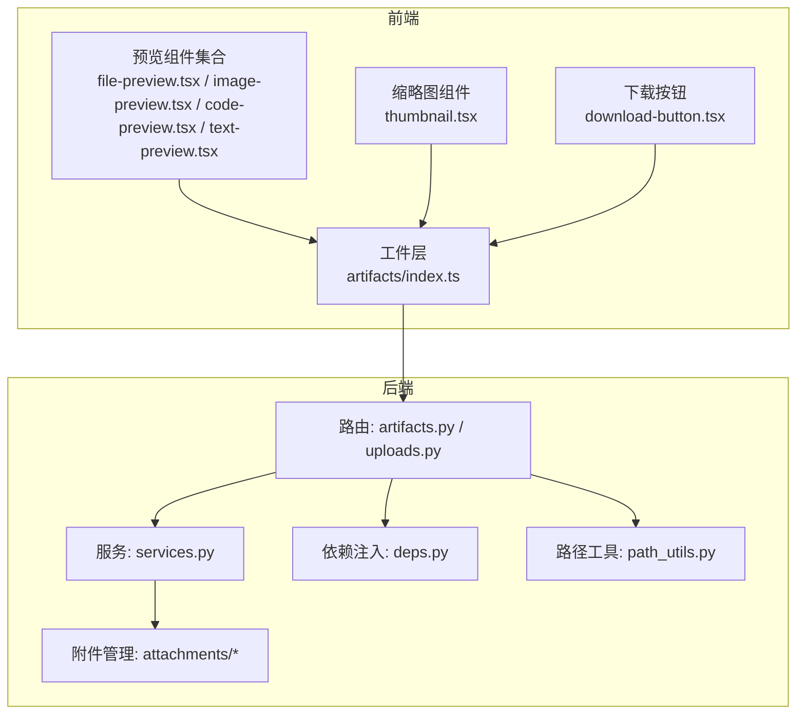
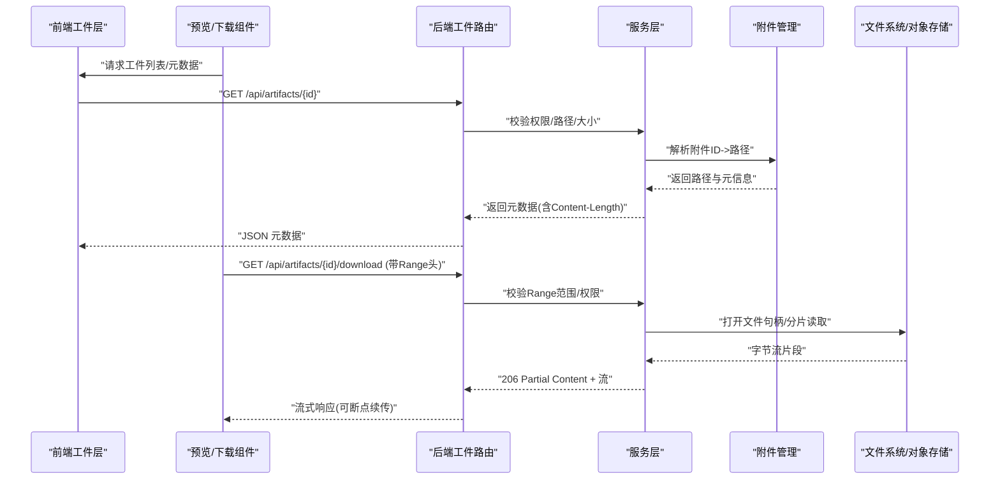
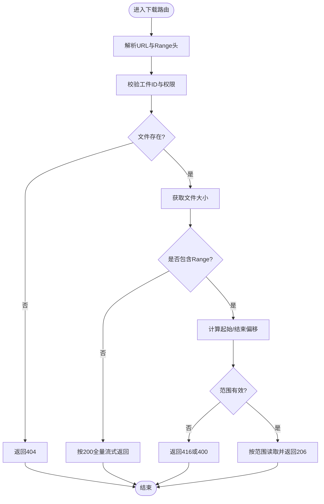
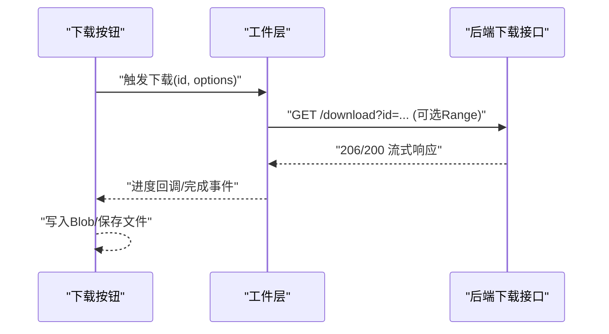
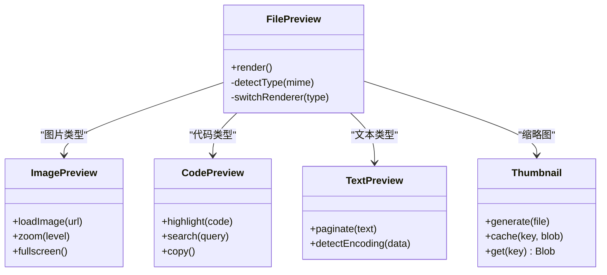
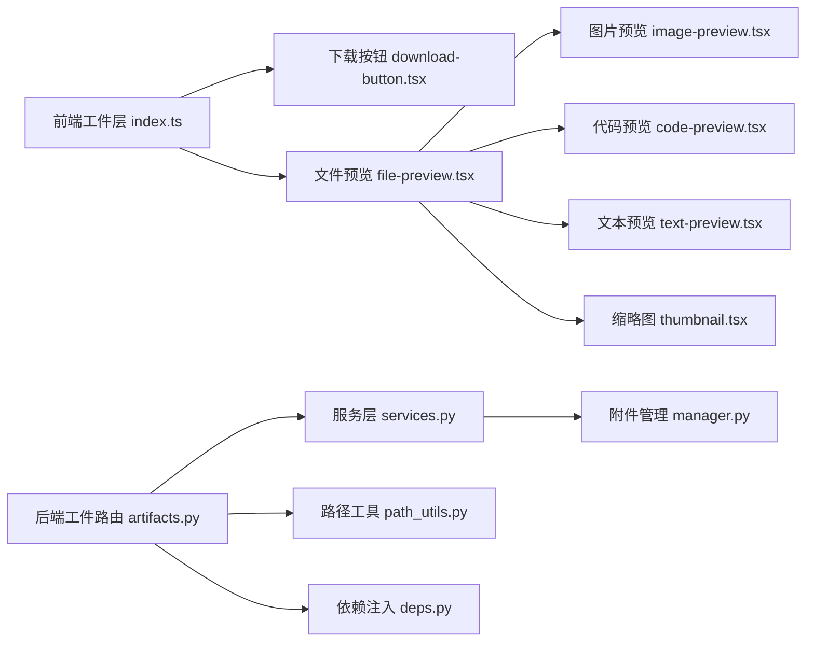

# 下载预览

<cite>
**本文引用的文件**   
- [backend/app/gateway/routers/artifacts.py](file://backend/app/gateway/routers/artifacts.py)
- [backend/app/gateway/routers/uploads.py](file://backend/app/gateway/routers/uploads.py)
- [backend/app/gateway/services.py](file://backend/app/gateway/services.py)
- [backend/app/gateway/deps.py](file://backend/app/gateway/deps.py)
- [backend/app/gateway/path_utils.py](file://backend/app/gateway/path_utils.py)
- [backend/packages/harness/deerflow/attachments/__init__.py](file://backend/packages/harness/deerflow/attachments/__init__.py)
- [backend/packages/harness/deerflow/attachments/manager.py](file://backend/packages/harness/deerflow/attachments/manager.py)
- [frontend/src/core/artifacts/index.ts](file://frontend/src/core/artifacts/index.ts)
- [frontend/src/core/artifacts/hooks.ts](file://frontend/src/core/artifacts/hooks.ts)
- [frontend/src/core/artifacts/loader.ts](file://frontend/src/core/artifacts/loader.ts)
- [frontend/src/components/workspace/artifacts/file-preview.tsx](file://frontend/src/components/workspace/artifacts/file-preview.tsx)
- [frontend/src/components/workspace/artifacts/image-preview.tsx](file://frontend/src/components/workspace/artifacts/image-preview.tsx)
- [frontend/src/components/workspace/artifacts/code-preview.tsx](file://frontend/src/components/workspace/artifacts/code-preview.tsx)
- [frontend/src/components/workspace/artifacts/text-preview.tsx](file://frontend/src/components/workspace/artifacts/text-preview.tsx)
- [frontend/src/components/workspace/artifacts/thumbnail.tsx](file://frontend/src/components/workspace/artifacts/thumbnail.tsx)
- [frontend/src/components/workspace/artifacts/download-button.tsx](file://frontend/src/components/workspace/artifacts/download-button.tsx)
</cite>

## 目录
1. [简介](#简介)
2. [项目结构](#项目结构)
3. [核心组件](#核心组件)
4. [架构总览](#架构总览)
5. [详细组件分析](#详细组件分析)
6. [依赖关系分析](#依赖关系分析)
7. [性能考虑](#性能考虑)
8. [故障排查指南](#故障排查指南)
9. [结论](#结论)
10. [附录](#附录)

## 简介
本文件聚焦 DeerFlow 的“文件下载与预览”能力，覆盖后端下载 API、前端预览组件、缩略图生成与缓存、权限控制与访问限制、自定义预览器扩展、移动端适配与响应式优化等主题。文档以代码级为依据，提供架构图、时序图与流程图，帮助读者快速理解并扩展该功能。

## 项目结构
与下载和预览相关的代码主要分布在以下位置：
- 后端网关路由与服务：负责文件元数据查询、下载流式输出、断点续传支持、路径解析与安全校验
- 附件管理模块：封装上传后的附件生命周期、存储路径与元信息
- 前端工件（Artifacts）层：统一获取工件列表、下载与预览入口
- 前端预览组件：图片、文本、代码、通用文件预览与缩略图展示
- 前端下载按钮：触发浏览器原生下载或分片下载

图表来源
- [backend/app/gateway/routers/artifacts.py](file://backend/app/gateway/routers/artifacts.py)
- [backend/app/gateway/routers/uploads.py](file://backend/app/gateway/routers/uploads.py)
- [backend/app/gateway/services.py](file://backend/app/gateway/services.py)
- [backend/app/gateway/deps.py](file://backend/app/gateway/deps.py)
- [backend/app/gateway/path_utils.py](file://backend/app/gateway/path_utils.py)
- [backend/packages/harness/deerflow/attachments/__init__.py](file://backend/packages/harness/deerflow/attachments/__init__.py)
- [backend/packages/harness/deerflow/attachments/manager.py](file://backend/packages/harness/deerflow/attachments/manager.py)
- [frontend/src/core/artifacts/index.ts](file://frontend/src/core/artifacts/index.ts)
- [frontend/src/components/workspace/artifacts/file-preview.tsx](file://frontend/src/components/workspace/artifacts/file-preview.tsx)
- [frontend/src/components/workspace/artifacts/image-preview.tsx](file://frontend/src/components/workspace/artifacts/image-preview.tsx)
- [frontend/src/components/workspace/artifacts/code-preview.tsx](file://frontend/src/components/workspace/artifacts/code-preview.tsx)
- [frontend/src/components/workspace/artifacts/text-preview.tsx](file://frontend/src/components/workspace/artifacts/text-preview.tsx)
- [frontend/src/components/workspace/artifacts/thumbnail.tsx](file://frontend/src/components/workspace/artifacts/thumbnail.tsx)
- [frontend/src/components/workspace/artifacts/download-button.tsx](file://frontend/src/components/workspace/artifacts/download-button.tsx)

章节来源
- [backend/app/gateway/routers/artifacts.py](file://backend/app/gateway/routers/artifacts.py)
- [backend/app/gateway/routers/uploads.py](file://backend/app/gateway/routers/uploads.py)
- [backend/app/gateway/services.py](file://backend/app/gateway/services.py)
- [backend/app/gateway/deps.py](file://backend/app/gateway/deps.py)
- [backend/app/gateway/path_utils.py](file://backend/app/gateway/path_utils.py)
- [backend/packages/harness/deerflow/attachments/__init__.py](file://backend/packages/harness/deerflow/attachments/__init__.py)
- [backend/packages/harness/deerflow/attachments/manager.py](file://backend/packages/harness/deerflow/attachments/manager.py)
- [frontend/src/core/artifacts/index.ts](file://frontend/src/core/artifacts/index.ts)
- [frontend/src/components/workspace/artifacts/file-preview.tsx](file://frontend/src/components/workspace/artifacts/file-preview.tsx)
- [frontend/src/components/workspace/artifacts/image-preview.tsx](file://frontend/src/components/workspace/artifacts/image-preview.tsx)
- [frontend/src/components/workspace/artifacts/code-preview.tsx](file://frontend/src/components/workspace/artifacts/code-preview.tsx)
- [frontend/src/components/workspace/artifacts/text-preview.tsx](file://frontend/src/components/workspace/artifacts/text-preview.tsx)
- [frontend/src/components/workspace/artifacts/thumbnail.tsx](file://frontend/src/components/workspace/artifacts/thumbnail.tsx)
- [frontend/src/components/workspace/artifacts/download-button.tsx](file://frontend/src/components/workspace/artifacts/download-button.tsx)

## 核心组件
- 后端下载与预览接口
  - 工件路由：提供工件列表、元数据、下载端点；支持 Range 头实现断点续传
  - 上传路由：提供上传与元数据读取，供预览与缩略图使用
  - 服务层：封装文件存在性检查、大小与类型判断、MIME 设置、流式响应构建
  - 依赖注入：会话/用户上下文、配置项（如最大文件大小、允许的文件类型）
  - 路径工具：安全路径拼接与白名单校验，防止路径穿越
  - 附件管理：统一处理附件 ID 到物理路径映射、元信息持久化
- 前端工件层
  - 工件索引：聚合工件列表、下载 URL 构造、预览入口
  - 钩子：拉取工件、错误重试、加载状态
  - 加载器：对大文件进行分块请求与进度回调
- 前端预览组件
  - 通用文件预览：根据 MIME 类型选择具体渲染器
  - 图片预览：懒加载、缩放、全屏、移动端手势
  - 代码预览：语法高亮、行号、复制、搜索替换
  - 文本预览：自动换行、编码检测、超大文本分页
  - 缩略图：异步生成、本地缓存、占位骨架屏
  - 下载按钮：原生下载、Range 断点续传、进度条

章节来源
- [backend/app/gateway/routers/artifacts.py](file://backend/app/gateway/routers/artifacts.py)
- [backend/app/gateway/routers/uploads.py](file://backend/app/gateway/routers/uploads.py)
- [backend/app/gateway/services.py](file://backend/app/gateway/services.py)
- [backend/app/gateway/deps.py](file://backend/app/gateway/deps.py)
- [backend/app/gateway/path_utils.py](file://backend/app/gateway/path_utils.py)
- [backend/packages/harness/deerflow/attachments/__init__.py](file://backend/packages/harness/deerflow/attachments/__init__.py)
- [backend/packages/harness/deerflow/attachments/manager.py](file://backend/packages/harness/deerflow/attachments/manager.py)
- [frontend/src/core/artifacts/index.ts](file://frontend/src/core/artifacts/index.ts)
- [frontend/src/core/artifacts/hooks.ts](file://frontend/src/core/artifacts/hooks.ts)
- [frontend/src/core/artifacts/loader.ts](file://frontend/src/core/artifacts/loader.ts)
- [frontend/src/components/workspace/artifacts/file-preview.tsx](file://frontend/src/components/workspace/artifacts/file-preview.tsx)
- [frontend/src/components/workspace/artifacts/image-preview.tsx](file://frontend/src/components/workspace/artifacts/image-preview.tsx)
- [frontend/src/components/workspace/artifacts/code-preview.tsx](file://frontend/src/components/workspace/artifacts/code-preview.tsx)
- [frontend/src/components/workspace/artifacts/text-preview.tsx](file://frontend/src/components/workspace/artifacts/text-preview.tsx)
- [frontend/src/components/workspace/artifacts/thumbnail.tsx](file://frontend/src/components/workspace/artifacts/thumbnail.tsx)
- [frontend/src/components/workspace/artifacts/download-button.tsx](file://frontend/src/components/workspace/artifacts/download-button.tsx)

## 架构总览
下图展示了从前端点击预览/下载到后端返回流式数据的完整链路，包括断点续传与权限校验的关键节点。

图表来源
- [backend/app/gateway/routers/artifacts.py](file://backend/app/gateway/routers/artifacts.py)
- [backend/app/gateway/services.py](file://backend/app/gateway/services.py)
- [backend/packages/harness/deerflow/attachments/manager.py](file://backend/packages/harness/deerflow/attachments/manager.py)
- [frontend/src/core/artifacts/index.ts](file://frontend/src/core/artifacts/index.ts)
- [frontend/src/components/workspace/artifacts/download-button.tsx](file://frontend/src/components/workspace/artifacts/download-button.tsx)

## 详细组件分析

### 后端下载与预览 API
- 设计要点
  - 工件元数据接口：返回文件名、MIME、大小、创建时间等
  - 下载接口：支持 HTTP Range 头，返回 206 部分响应；未携带 Range 时返回 200 全量流
  - 安全校验：基于路径工具与附件管理器，确保仅能访问受控路径
  - 权限控制：通过依赖注入获取当前用户/会话，结合工件归属与共享策略
  - 性能优化：流式传输、避免一次性读入内存；必要时启用压缩与缓存头
- 关键流程
  - 解析请求参数与 Range 头
  - 校验工件存在性与访问权限
  - 计算可读字节范围
  - 建立文件句柄并按范围读取
  - 设置响应头（Content-Type、Content-Length、Content-Range、Accept-Ranges）
  - 流式写出响应体

图表来源
- [backend/app/gateway/routers/artifacts.py](file://backend/app/gateway/routers/artifacts.py)
- [backend/app/gateway/services.py](file://backend/app/gateway/services.py)
- [backend/app/gateway/path_utils.py](file://backend/app/gateway/path_utils.py)

章节来源
- [backend/app/gateway/routers/artifacts.py](file://backend/app/gateway/routers/artifacts.py)
- [backend/app/gateway/services.py](file://backend/app/gateway/services.py)
- [backend/app/gateway/path_utils.py](file://backend/app/gateway/path_utils.py)
- [backend/packages/harness/deerflow/attachments/manager.py](file://backend/packages/harness/deerflow/attachments/manager.py)

### 前端工件层与下载
- 工件索引
  - 统一暴露工件列表、详情与下载链接构造方法
  - 将后端元数据转换为前端可用的数据结构
- 下载按钮
  - 默认行为：构造下载 URL，交由浏览器处理
  - 高级模式：使用 fetch + ReadableStream 实现分片下载与进度显示
  - 断点续传：在支持的情况下发送 Range 头，恢复中断的下载
- 加载器
  - 对大文件采用分块请求，累计已下载字节数
  - 提供进度回调与取消机制

图表来源
- [frontend/src/core/artifacts/index.ts](file://frontend/src/core/artifacts/index.ts)
- [frontend/src/core/artifacts/loader.ts](file://frontend/src/core/artifacts/loader.ts)
- [frontend/src/components/workspace/artifacts/download-button.tsx](file://frontend/src/components/workspace/artifacts/download-button.tsx)
- [backend/app/gateway/routers/artifacts.py](file://backend/app/gateway/routers/artifacts.py)

章节来源
- [frontend/src/core/artifacts/index.ts](file://frontend/src/core/artifacts/index.ts)
- [frontend/src/core/artifacts/loader.ts](file://frontend/src/core/artifacts/loader.ts)
- [frontend/src/components/workspace/artifacts/download-button.tsx](file://frontend/src/components/workspace/artifacts/download-button.tsx)

### 预览组件架构与渲染优化
- 组件分层
  - 通用文件预览：根据 MIME 类型分发到具体渲染器
  - 图片预览：懒加载、按需缩放、全屏查看、移动端双指缩放
  - 代码预览：语法高亮、行号、搜索替换、复制、暗色主题
  - 文本预览：自动换行、编码检测、超大文本分页与虚拟滚动
  - 缩略图：异步生成、本地缓存、占位骨架屏
- 渲染优化
  - 惰性加载：仅在可见区域渲染大图/长文
  - 分块渲染：超长文本分页，减少首屏压力
  - 防抖与节流：窗口尺寸变化、滚动事件优化
  - 资源清理：组件卸载时释放监听与定时器

图表来源
- [frontend/src/components/workspace/artifacts/file-preview.tsx](file://frontend/src/components/workspace/artifacts/file-preview.tsx)
- [frontend/src/components/workspace/artifacts/image-preview.tsx](file://frontend/src/components/workspace/artifacts/image-preview.tsx)
- [frontend/src/components/workspace/artifacts/code-preview.tsx](file://frontend/src/components/workspace/artifacts/code-preview.tsx)
- [frontend/src/components/workspace/artifacts/text-preview.tsx](file://frontend/src/components/workspace/artifacts/text-preview.tsx)
- [frontend/src/components/workspace/artifacts/thumbnail.tsx](file://frontend/src/components/workspace/artifacts/thumbnail.tsx)

章节来源
- [frontend/src/components/workspace/artifacts/file-preview.tsx](file://frontend/src/components/workspace/artifacts/file-preview.tsx)
- [frontend/src/components/workspace/artifacts/image-preview.tsx](file://frontend/src/components/workspace/artifacts/image-preview.tsx)
- [frontend/src/components/workspace/artifacts/code-preview.tsx](file://frontend/src/components/workspace/artifacts/code-preview.tsx)
- [frontend/src/components/workspace/artifacts/text-preview.tsx](file://frontend/src/components/workspace/artifacts/text-preview.tsx)
- [frontend/src/components/workspace/artifacts/thumbnail.tsx](file://frontend/src/components/workspace/artifacts/thumbnail.tsx)

### 缩略图生成与缓存机制
- 生成策略
  - 图片：按比例裁剪与压缩，生成固定尺寸的缩略图
  - 文档：提取首帧或封面页作为缩略图
  - 代码/文本：使用图标占位或首行内容截图
- 缓存策略
  - 键值：基于文件 ID 与生成参数（尺寸、质量）
  - 存储：浏览器 IndexedDB 或 localStorage（小体积），服务端缓存（CDN 或内存）
  - 失效：文件更新后清除对应缓存条目
- 用户体验
  - 骨架屏占位，提升感知速度
  - 渐进式加载：先低清缩略图，再高清原图

章节来源
- [frontend/src/components/workspace/artifacts/thumbnail.tsx](file://frontend/src/components/workspace/artifacts/thumbnail.tsx)

### 预览权限控制与访问限制
- 权限模型
  - 基于工件归属与共享策略（私有、团队、公开）
  - 会话/令牌校验，确保仅授权用户可访问
- 访问限制
  - 路径白名单与沙箱隔离，防止越权访问
  - 文件大小上限与类型白名单
  - 速率限制与并发限制，保护后端资源
- 审计与日志
  - 记录访问者、时间、IP、操作结果，便于追踪

章节来源
- [backend/app/gateway/deps.py](file://backend/app/gateway/deps.py)
- [backend/app/gateway/path_utils.py](file://backend/app/gateway/path_utils.py)
- [backend/app/gateway/services.py](file://backend/app/gateway/services.py)

### 自定义预览器开发指南
- 扩展点
  - 在通用文件预览中注册新的 MIME 类型与渲染器
  - 实现最小可用接口：初始化、渲染、销毁
- 最佳实践
  - 保持组件无副作用，避免全局状态污染
  - 提供错误边界与降级方案
  - 支持键盘导航与无障碍访问
- 示例步骤
  - 新增渲染器组件
  - 在类型分发逻辑中注册新类型
  - 编写单元测试与集成测试

章节来源
- [frontend/src/components/workspace/artifacts/file-preview.tsx](file://frontend/src/components/workspace/artifacts/file-preview.tsx)

### 移动端适配与响应式设计
- 布局与交互
  - 自适应网格与弹性布局
  - 触摸手势：滑动切换、双指缩放、长按菜单
- 性能优化
  - 图片按需加载与延迟解码
  - 长列表虚拟滚动与分页
- 可用性
  - 字体大小与对比度适配
  - 键盘与屏幕阅读器支持

章节来源
- [frontend/src/components/workspace/artifacts/image-preview.tsx](file://frontend/src/components/workspace/artifacts/image-preview.tsx)
- [frontend/src/components/workspace/artifacts/text-preview.tsx](file://frontend/src/components/workspace/artifacts/text-preview.tsx)

## 依赖关系分析
- 组件耦合
  - 工件层与后端路由松耦合，通过 REST 接口通信
  - 预览组件与工件层解耦，通过 props 传递数据
- 外部依赖
  - 网络库：fetch/ReadableStream
  - 渲染库：语法高亮、图片缩放、虚拟滚动
  - 存储：IndexedDB/localStorage 用于缩略图缓存
- 潜在风险
  - 循环依赖：确保组件间单向依赖
  - 大文件内存占用：严格使用流式处理与分块渲染

图表来源
- [frontend/src/core/artifacts/index.ts](file://frontend/src/core/artifacts/index.ts)
- [frontend/src/components/workspace/artifacts/file-preview.tsx](file://frontend/src/components/workspace/artifacts/file-preview.tsx)
- [frontend/src/components/workspace/artifacts/image-preview.tsx](file://frontend/src/components/workspace/artifacts/image-preview.tsx)
- [frontend/src/components/workspace/artifacts/code-preview.tsx](file://frontend/src/components/workspace/artifacts/code-preview.tsx)
- [frontend/src/components/workspace/artifacts/text-preview.tsx](file://frontend/src/components/workspace/artifacts/text-preview.tsx)
- [frontend/src/components/workspace/artifacts/thumbnail.tsx](file://frontend/src/components/workspace/artifacts/thumbnail.tsx)
- [frontend/src/components/workspace/artifacts/download-button.tsx](file://frontend/src/components/workspace/artifacts/download-button.tsx)
- [backend/app/gateway/routers/artifacts.py](file://backend/app/gateway/routers/artifacts.py)
- [backend/app/gateway/services.py](file://backend/app/gateway/services.py)
- [backend/packages/harness/deerflow/attachments/manager.py](file://backend/packages/harness/deerflow/attachments/manager.py)
- [backend/app/gateway/path_utils.py](file://backend/app/gateway/path_utils.py)
- [backend/app/gateway/deps.py](file://backend/app/gateway/deps.py)

章节来源
- [frontend/src/core/artifacts/index.ts](file://frontend/src/core/artifacts/index.ts)
- [frontend/src/components/workspace/artifacts/file-preview.tsx](file://frontend/src/components/workspace/artifacts/file-preview.tsx)
- [frontend/src/components/workspace/artifacts/image-preview.tsx](file://frontend/src/components/workspace/artifacts/image-preview.tsx)
- [frontend/src/components/workspace/artifacts/code-preview.tsx](file://frontend/src/components/workspace/artifacts/code-preview.tsx)
- [frontend/src/components/workspace/artifacts/text-preview.tsx](file://frontend/src/components/workspace/artifacts/text-preview.tsx)
- [frontend/src/components/workspace/artifacts/thumbnail.tsx](file://frontend/src/components/workspace/artifacts/thumbnail.tsx)
- [frontend/src/components/workspace/artifacts/download-button.tsx](file://frontend/src/components/workspace/artifacts/download-button.tsx)
- [backend/app/gateway/routers/artifacts.py](file://backend/app/gateway/routers/artifacts.py)
- [backend/app/gateway/services.py](file://backend/app/gateway/services.py)
- [backend/packages/harness/deerflow/attachments/manager.py](file://backend/packages/harness/deerflow/attachments/manager.py)
- [backend/app/gateway/path_utils.py](file://backend/app/gateway/path_utils.py)
- [backend/app/gateway/deps.py](file://backend/app/gateway/deps.py)

## 性能考虑
- 后端
  - 流式传输与分片读取，降低内存峰值
  - 合理设置缓存头（ETag、Cache-Control）以减少重复请求
  - 限制最大文件大小与并发连接数
- 前端
  - 图片懒加载与按需解码
  - 长文本分页与虚拟滚动
  - 缩略图本地缓存与骨架屏
  - 下载进度可视化与失败重试

[本节为通用指导，不直接分析具体文件]

## 故障排查指南
- 常见问题
  - 404：工件不存在或路径解析失败
  - 403：权限不足或会话过期
  - 416：Range 范围无效
  - 500：后端内部错误或存储不可用
- 定位步骤
  - 检查工件 ID 与后端路由匹配
  - 查看权限注入与会话状态
  - 验证 Range 头格式与服务器支持
  - 检查文件句柄与存储后端健康状态
- 日志与监控
  - 记录请求 ID、用户、工件 ID、耗时、错误码
  - 监控下载成功率与平均耗时

章节来源
- [backend/app/gateway/routers/artifacts.py](file://backend/app/gateway/routers/artifacts.py)
- [backend/app/gateway/services.py](file://backend/app/gateway/services.py)
- [backend/app/gateway/deps.py](file://backend/app/gateway/deps.py)

## 结论
DeerFlow 的下载与预览功能在后端通过流式传输与断点续传保障高效稳定，在前端通过组件化与渲染优化提升用户体验。通过清晰的权限控制与可扩展的预览器架构，系统既满足安全性又具备良好的可维护性与扩展性。建议在生产环境完善缓存与监控，持续优化移动端体验与大文件处理能力。

[本节为总结性内容，不直接分析具体文件]

## 附录
- 术语
  - 工件：系统中可被下载与预览的文件实体
  - 断点续传：基于 HTTP Range 的分片下载与恢复
  - 缩略图：文件的预览小图，用于快速识别
- 参考实现路径
  - 后端下载与预览：[backend/app/gateway/routers/artifacts.py](file://backend/app/gateway/routers/artifacts.py)、[backend/app/gateway/services.py](file://backend/app/gateway/services.py)
  - 前端工件与预览：[frontend/src/core/artifacts/index.ts](file://frontend/src/core/artifacts/index.ts)、[frontend/src/components/workspace/artifacts/file-preview.tsx](file://frontend/src/components/workspace/artifacts/file-preview.tsx)

[本节为补充说明，不直接分析具体文件]