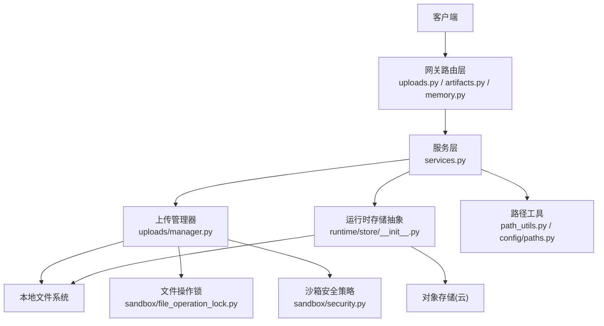
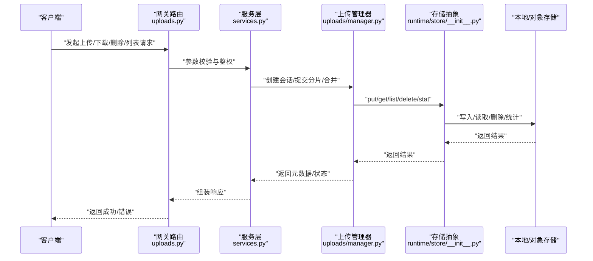
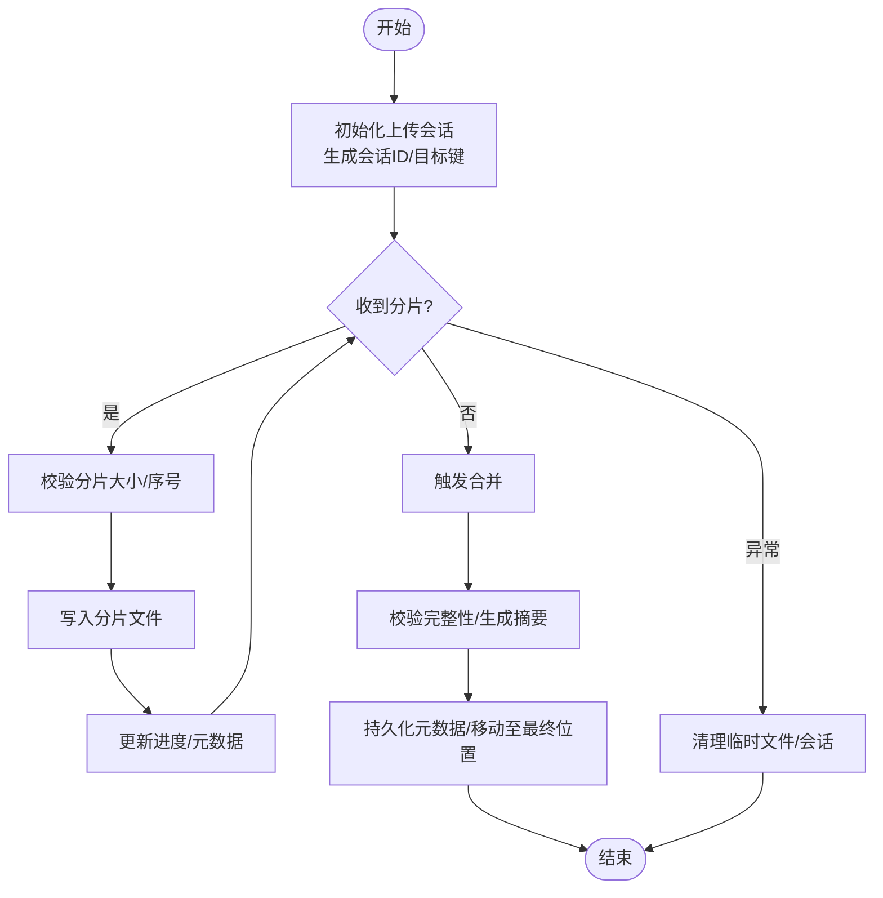
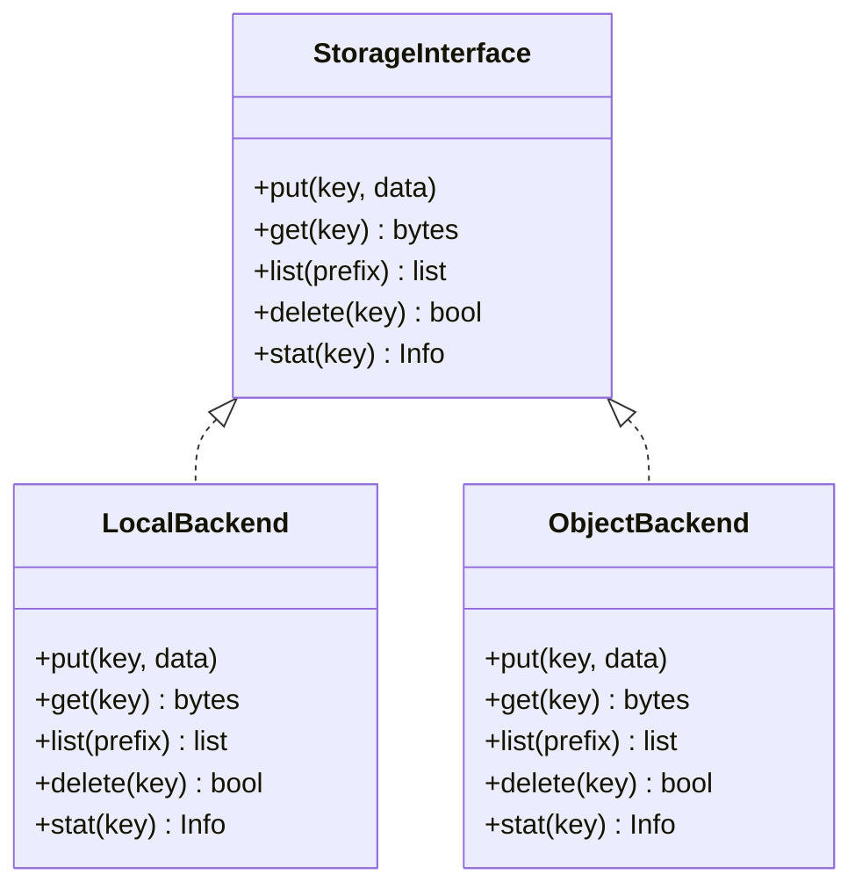
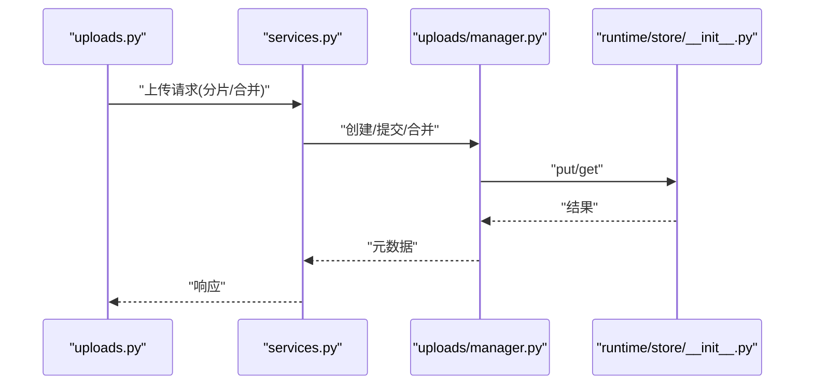
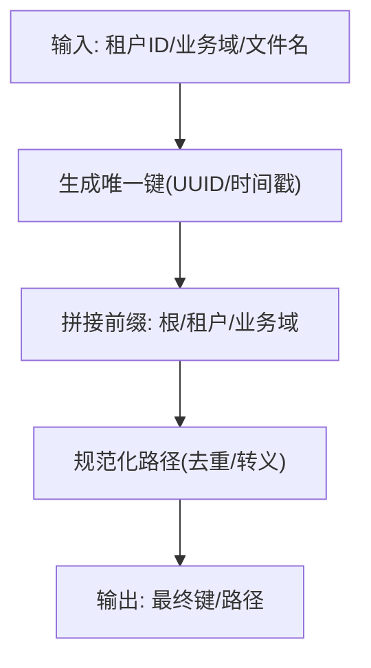
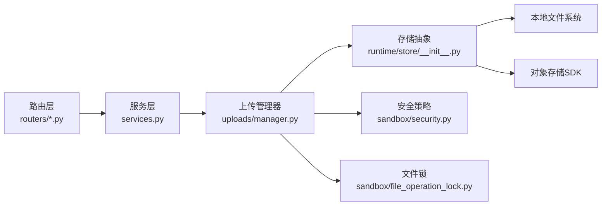

# 存储策略

<cite>
**本文引用的文件**   
- [backend/app/gateway/routers/uploads.py](file://backend/app/gateway/routers/uploads.py)
- [backend/packages/harness/deerflow/uploads/manager.py](file://backend/packages/harness/deerflow/uploads/manager.py)
- [backend/packages/harness/deerflow/config/paths.py](file://backend/packages/harness/deerflow/config/paths.py)
- [backend/app/gateway/path_utils.py](file://backend/app/gateway/path_utils.py)
- [backend/app/gateway/services.py](file://backend/app/gateway/services.py)
- [backend/app/channels/store.py](file://backend/app/channels/store.py)
- [backend/app/gateway/routers/artifacts.py](file://backend/app/gateway/routers/artifacts.py)
- [backend/app/gateway/routers/memory.py](file://backend/app/gateway/routers/memory.py)
- [backend/packages/harness/deerflow/runtime/store/__init__.py](file://backend/packages/harness/deerflow/runtime/store/__init__.py)
- [backend/packages/harness/deerflow/sandbox/file_operation_lock.py](file://backend/packages/harness/deerflow/sandbox/file_operation_lock.py)
- [backend/packages/harness/deerflow/sandbox/security.py](file://backend/packages/harness/deerflow/sandbox/security.py)
- [config.example.yaml](file://config.example.yaml)
</cite>

## 目录
1. [简介](#简介)
2. [项目结构](#项目结构)
3. [核心组件](#核心组件)
4. [架构总览](#架构总览)
5. [详细组件分析](#详细组件分析)
6. [依赖关系分析](#依赖关系分析)
7. [性能考虑](#性能考虑)
8. [故障排查指南](#故障排查指南)
9. [结论](#结论)
10. [附录](#附录)

## 简介
本文件围绕 DeerFlow 的“存储策略”进行系统化说明，覆盖本地与对象存储的配置与管理、抽象后端设计与切换机制、路径与命名规则、配额与清理、多租户隔离、性能优化、备份恢复以及迁移同步等主题。文档以代码为依据，结合架构图与时序图帮助读者快速理解并落地实践。

## 项目结构
DeerFlow 的存储相关能力主要分布在网关路由层、上传管理模块、运行时存储抽象、沙箱安全与锁、以及配置与路径工具中。整体组织遵循“功能域 + 分层”的方式：
- 网关路由层：暴露上传、制品、内存等 HTTP API，负责参数校验、鉴权与调用服务层。
- 上传管理模块：封装上传生命周期（分片、合并、元数据记录）。
- 运行时存储抽象：提供统一的存储接口，屏蔽底层实现差异。
- 沙箱安全与锁：保障并发安全与访问控制。
- 配置与路径工具：集中管理根路径、命名规则与可配置项。

图表来源
- [backend/app/gateway/routers/uploads.py](file://backend/app/gateway/routers/uploads.py)
- [backend/app/gateway/routers/artifacts.py](file://backend/app/gateway/routers/artifacts.py)
- [backend/app/gateway/routers/memory.py](file://backend/app/gateway/routers/memory.py)
- [backend/app/gateway/services.py](file://backend/app/gateway/services.py)
- [backend/packages/harness/deerflow/uploads/manager.py](file://backend/packages/harness/deerflow/uploads/manager.py)
- [backend/packages/harness/deerflow/runtime/store/__init__.py](file://backend/packages/harness/deerflow/runtime/store/__init__.py)
- [backend/packages/harness/deerflow/sandbox/file_operation_lock.py](file://backend/packages/harness/deerflow/sandbox/file_operation_lock.py)
- [backend/packages/harness/deerflow/sandbox/security.py](file://backend/packages/harness/deerflow/sandbox/security.py)
- [backend/app/gateway/path_utils.py](file://backend/app/gateway/path_utils.py)
- [backend/packages/harness/deerflow/config/paths.py](file://backend/packages/harness/deerflow/config/paths.py)

章节来源
- [backend/app/gateway/routers/uploads.py](file://backend/app/gateway/routers/uploads.py)
- [backend/app/gateway/routers/artifacts.py](file://backend/app/gateway/routers/artifacts.py)
- [backend/app/gateway/routers/memory.py](file://backend/app/gateway/routers/memory.py)
- [backend/app/gateway/services.py](file://backend/app/gateway/services.py)
- [backend/packages/harness/deerflow/uploads/manager.py](file://backend/packages/harness/deerflow/uploads/manager.py)
- [backend/packages/harness/deerflow/runtime/store/__init__.py](file://backend/packages/harness/deerflow/runtime/store/__init__.py)
- [backend/packages/harness/deerflow/sandbox/file_operation_lock.py](file://backend/packages/harness/deerflow/sandbox/file_operation_lock.py)
- [backend/packages/harness/deerflow/sandbox/security.py](file://backend/packages/harness/deerflow/sandbox/security.py)
- [backend/app/gateway/path_utils.py](file://backend/app/gateway/path_utils.py)
- [backend/packages/harness/deerflow/config/paths.py](file://backend/packages/harness/deerflow/config/paths.py)

## 核心组件
- 上传管理器：负责分片上传、断点续传、合并与元数据持久化；与存储抽象交互完成实际落盘或对象写入。
- 运行时存储抽象：定义统一接口（如 put/get/list/delete/stat），支持本地与对象存储后端切换。
- 路径与命名工具：生成唯一键、规范化路径、处理前缀与租户隔离。
- 网关路由与服务层：将 HTTP 请求转换为内部调用，串联上传流程与存储操作。
- 沙箱安全与锁：限制非法路径访问、保证并发写安全。

章节来源
- [backend/packages/harness/deerflow/uploads/manager.py](file://backend/packages/harness/deerflow/uploads/manager.py)
- [backend/packages/harness/deerflow/runtime/store/__init__.py](file://backend/packages/harness/deerflow/runtime/store/__init__.py)
- [backend/app/gateway/path_utils.py](file://backend/app/gateway/path_utils.py)
- [backend/packages/harness/deerflow/config/paths.py](file://backend/packages/harness/deerflow/config/paths.py)
- [backend/app/gateway/services.py](file://backend/app/gateway/services.py)
- [backend/packages/harness/deerflow/sandbox/file_operation_lock.py](file://backend/packages/harness/deerflow/sandbox/file_operation_lock.py)
- [backend/packages/harness/deerflow/sandbox/security.py](file://backend/packages/harness/deerflow/sandbox/security.py)

## 架构总览
下图展示了从客户端到存储后端的完整链路，包括上传、读取、删除与列表等关键路径。

图表来源
- [backend/app/gateway/routers/uploads.py](file://backend/app/gateway/routers/uploads.py)
- [backend/app/gateway/services.py](file://backend/app/gateway/services.py)
- [backend/packages/harness/deerflow/uploads/manager.py](file://backend/packages/harness/deerflow/uploads/manager.py)
- [backend/packages/harness/deerflow/runtime/store/__init__.py](file://backend/packages/harness/deerflow/runtime/store/__init__.py)

## 详细组件分析

### 上传管理器（uploads/manager.py）
- 职责
  - 管理分片上传会话、校验分片完整性、触发合并、更新元数据。
  - 通过存储抽象执行最终落盘或对象写入。
  - 与锁与安全策略协作，确保并发安全与路径合法性。
- 关键流程
  - 初始化会话：分配会话ID、计算目标键、准备临时目录。
  - 提交分片：校验大小与顺序、追加写入、记录进度。
  - 合并阶段：按序拼接分片、生成校验值、持久化元数据。
  - 失败回滚：清理未合并的分片与临时文件。
- 并发与一致性
  - 使用文件操作锁避免同一键的并发写冲突。
  - 合并完成后原子性重命名，减少中间态可见性。
- 错误处理
  - 对网络超时、磁盘空间不足、权限拒绝等异常进行分类处理与提示。

图表来源
- [backend/packages/harness/deerflow/uploads/manager.py](file://backend/packages/harness/deerflow/uploads/manager.py)
- [backend/packages/harness/deerflow/sandbox/file_operation_lock.py](file://backend/packages/harness/deerflow/sandbox/file_operation_lock.py)

章节来源
- [backend/packages/harness/deerflow/uploads/manager.py](file://backend/packages/harness/deerflow/uploads/manager.py)
- [backend/packages/harness/deerflow/sandbox/file_operation_lock.py](file://backend/packages/harness/deerflow/sandbox/file_operation_lock.py)

### 运行时存储抽象（runtime/store/__init__.py）
- 设计要点
  - 定义统一接口：put、get、list、delete、stat 等。
  - 通过工厂或配置选择具体后端（本地文件系统、AWS S3、阿里云 OSS、腾讯云 COS 等）。
  - 对路径进行标准化与前缀注入，便于多租户隔离。
- 后端切换机制
  - 基于配置项动态加载后端实现。
  - 对外暴露一致的上下文与错误类型，上层无需感知差异。
- 扩展建议
  - 新增后端时仅需实现统一接口并在注册表中声明。
  - 针对大对象读写可引入流式传输与分块并行。

图表来源
- [backend/packages/harness/deerflow/runtime/store/__init__.py](file://backend/packages/harness/deerflow/runtime/store/__init__.py)

章节来源
- [backend/packages/harness/deerflow/runtime/store/__init__.py](file://backend/packages/harness/deerflow/runtime/store/__init__.py)

### 网关路由与服务层（routers/*.py 与 services.py）
- 路由职责
  - uploads.py：接收上传、下载、删除、列表请求，解析分片参数与认证信息。
  - artifacts.py：制品文件的访问与版本管理。
  - memory.py：内存/缓存数据的存取入口。
- 服务层职责
  - 编排上传流程、调用上传管理器与存储抽象。
  - 统一错误码与日志记录，便于前端展示与运维排障。
- 典型序列
  - 上传：路由 -> 服务 -> 上传管理器 -> 存储抽象 -> 后端存储。
  - 下载：路由 -> 服务 -> 存储抽象 -> 后端存储 -> 路由。

图表来源
- [backend/app/gateway/routers/uploads.py](file://backend/app/gateway/routers/uploads.py)
- [backend/app/gateway/services.py](file://backend/app/gateway/services.py)
- [backend/packages/harness/deerflow/uploads/manager.py](file://backend/packages/harness/deerflow/uploads/manager.py)
- [backend/packages/harness/deerflow/runtime/store/__init__.py](file://backend/packages/harness/deerflow/runtime/store/__init__.py)

章节来源
- [backend/app/gateway/routers/uploads.py](file://backend/app/gateway/routers/uploads.py)
- [backend/app/gateway/routers/artifacts.py](file://backend/app/gateway/routers/artifacts.py)
- [backend/app/gateway/routers/memory.py](file://backend/app/gateway/routers/memory.py)
- [backend/app/gateway/services.py](file://backend/app/gateway/services.py)

### 路径与命名规则（path_utils.py 与 config/paths.py）
- 路径规范
  - 统一根路径、租户前缀、业务域前缀与资源标识组合成最终键。
  - 禁止路径穿越与非法字符，必要时进行转义与规范化。
- 命名策略
  - 使用 UUID 或时间戳+随机串保证全局唯一。
  - 为分片文件增加序号后缀，便于排序与校验。
- 多租户隔离
  - 通过前缀隔离不同租户的数据，避免跨租户访问。

图表来源
- [backend/app/gateway/path_utils.py](file://backend/app/gateway/path_utils.py)
- [backend/packages/harness/deerflow/config/paths.py](file://backend/packages/harness/deerflow/config/paths.py)

章节来源
- [backend/app/gateway/path_utils.py](file://backend/app/gateway/path_utils.py)
- [backend/packages/harness/deerflow/config/paths.py](file://backend/packages/harness/deerflow/config/paths.py)

### 沙箱安全与并发控制（sandbox/security.py 与 sandbox/file_operation_lock.py）
- 安全策略
  - 校验目标路径是否位于允许目录内，防止越权访问。
  - 限制文件类型与大小，阻断恶意载荷。
- 并发控制
  - 基于文件锁或分布式锁保证同一键的串行写入。
  - 合并阶段采用原子重命名，降低竞争窗口。

章节来源
- [backend/packages/harness/deerflow/sandbox/security.py](file://backend/packages/harness/deerflow/sandbox/security.py)
- [backend/packages/harness/deerflow/sandbox/file_operation_lock.py](file://backend/packages/harness/deerflow/sandbox/file_operation_lock.py)

### 通道附件存储（channels/store.py）
- 用途
  - 为消息通道（如 IM、邮件）的附件提供统一存储入口。
- 特点
  - 复用上传管理与存储抽象，保持行为一致。
  - 与消息元数据关联，便于检索与回放。

章节来源
- [backend/app/channels/store.py](file://backend/app/channels/store.py)

## 依赖关系分析
- 耦合度
  - 路由层仅依赖服务层，服务层依赖上传管理器与存储抽象，解耦清晰。
  - 存储抽象屏蔽后端差异，提升可替换性与可测试性。
- 外部依赖
  - 对象存储 SDK（如 boto3、oss2、cos-python-sdk-v5）由具体后端实现引入。
  - 文件系统 I/O 与锁机制用于本地后端。
- 潜在循环
  - 当前分层明确，未发现直接循环依赖。

图表来源
- [backend/app/gateway/routers/uploads.py](file://backend/app/gateway/routers/uploads.py)
- [backend/app/gateway/services.py](file://backend/app/gateway/services.py)
- [backend/packages/harness/deerflow/uploads/manager.py](file://backend/packages/harness/deerflow/uploads/manager.py)
- [backend/packages/harness/deerflow/runtime/store/__init__.py](file://backend/packages/harness/deerflow/runtime/store/__init__.py)
- [backend/packages/harness/deerflow/sandbox/security.py](file://backend/packages/harness/deerflow/sandbox/security.py)
- [backend/packages/harness/deerflow/sandbox/file_operation_lock.py](file://backend/packages/harness/deerflow/sandbox/file_operation_lock.py)

章节来源
- [backend/app/gateway/routers/uploads.py](file://backend/app/gateway/routers/uploads.py)
- [backend/app/gateway/services.py](file://backend/app/gateway/services.py)
- [backend/packages/harness/deerflow/uploads/manager.py](file://backend/packages/harness/deerflow/uploads/manager.py)
- [backend/packages/harness/deerflow/runtime/store/__init__.py](file://backend/packages/harness/deerflow/runtime/store/__init__.py)
- [backend/packages/harness/deerflow/sandbox/security.py](file://backend/packages/harness/deerflow/sandbox/security.py)
- [backend/packages/harness/deerflow/sandbox/file_operation_lock.py](file://backend/packages/harness/deerflow/sandbox/file_operation_lock.py)

## 性能考虑
- 本地存储
  - 使用 SSD/NVMe 提升 IOPS；合理设置分片大小以降低小文件开销。
  - 启用异步 I/O 与连接池，减少阻塞。
  - 定期整理碎片与压缩归档历史数据。
- 对象存储
  - 开启分块上传与并行传输；利用服务端复制与生命周期策略。
  - 选择合适的存储类（标准/低频/归档）并按冷热分层。
- 缓存与CDN
  - 热点文件加入缓存层；静态资源走 CDN 加速。
- 监控与告警
  - 监控吞吐、延迟、错误率与磁盘用量；阈值告警联动扩容。

[本节为通用指导，不直接分析具体文件]

## 故障排查指南
- 常见问题
  - 上传中断：检查分片序号与完整性、重试策略与会话过期时间。
  - 权限错误：确认运行用户对目标目录或桶的读写权限。
  - 路径非法：核对路径规范化逻辑与白名单策略。
  - 并发冲突：观察锁等待与合并阶段的原子性。
- 定位步骤
  - 查看路由与服务层日志，确认请求参数与流转状态。
  - 检查上传管理器会话状态与分片清单。
  - 验证存储抽象的后端配置与连通性。
  - 使用 stat/list 接口核对文件存在性与元数据。

章节来源
- [backend/app/gateway/routers/uploads.py](file://backend/app/gateway/routers/uploads.py)
- [backend/app/gateway/services.py](file://backend/app/gateway/services.py)
- [backend/packages/harness/deerflow/uploads/manager.py](file://backend/packages/harness/deerflow/uploads/manager.py)
- [backend/packages/harness/deerflow/runtime/store/__init__.py](file://backend/packages/harness/deerflow/runtime/store/__init__.py)

## 结论
DeerFlow 的存储策略以“统一抽象 + 可插拔后端”为核心，配合严格的权限与并发控制，实现了高可用、可扩展的文件管理能力。通过合理的本地与对象存储配置、路径与命名规范、配额与清理策略、多租户隔离以及完善的监控与容灾方案，可在生产环境中稳定支撑大规模文件上传与访问需求。

[本节为总结性内容，不直接分析具体文件]

## 附录

### 本地存储配置与管理
- 目录结构
  - 根目录：由配置项指定，作为所有用户数据的基路径。
  - 租户目录：按租户 ID 划分，实现数据隔离。
  - 业务域目录：按业务域进一步细分，便于检索与治理。
  - 分片目录：上传期间存放分片文件，合并后清理。
- 权限设置
  - 运行用户需具备读写权限；建议最小权限原则。
  - 目录 ACL 限制非授权访问。
- 磁盘空间监控
  - 监控剩余空间与增长速率；达到阈值触发告警与限流。
  - 自动清理策略：删除过期会话、无效分片与历史归档。

章节来源
- [backend/packages/harness/deerflow/config/paths.py](file://backend/packages/harness/deerflow/config/paths.py)
- [backend/app/gateway/path_utils.py](file://backend/app/gateway/path_utils.py)
- [backend/packages/harness/deerflow/uploads/manager.py](file://backend/packages/harness/deerflow/uploads/manager.py)

### 对象存储集成方案
- AWS S3
  - 配置要点：区域、桶名、访问密钥、分块大小、重试策略。
  - 最佳实践：启用生命周期策略、服务端加密、访问日志。
- 阿里云 OSS
  - 配置要点：Endpoint、Bucket、AccessKey、分片上传与并发数。
  - 最佳实践：设置存储类型与生命周期、开启防盗链。
- 腾讯云 COS
  - 配置要点：Region、Bucket、SecretId/SecretKey、分片大小。
  - 最佳实践：使用标签与生命周期管理、开启跨区域复制。
- 统一接入
  - 通过存储抽象后端切换，无需改动上层逻辑。
  - 统一错误码与重试策略，简化异常处理。

章节来源
- [backend/packages/harness/deerflow/runtime/store/__init__.py](file://backend/packages/harness/deerflow/runtime/store/__init__.py)
- [config.example.yaml](file://config.example.yaml)

### 存储后端抽象与切换机制
- 接口契约
  - 统一方法签名与返回值约定，屏蔽底层差异。
- 工厂与注册表
  - 根据配置项选择后端实现，支持热切换与灰度发布。
- 兼容性
  - 对路径前缀、大小写敏感、特殊字符进行适配。

章节来源
- [backend/packages/harness/deerflow/runtime/store/__init__.py](file://backend/packages/harness/deerflow/runtime/store/__init__.py)

### 文件路径管理与命名规则
- 唯一性
  - 使用 UUID 或时间戳+随机串，避免碰撞。
- 规范化
  - 去除冗余分隔符、转义非法字符、统一大小写策略。
- 前缀体系
  - 根/租户/业务域/资源类型/实例ID，便于检索与权限控制。

章节来源
- [backend/app/gateway/path_utils.py](file://backend/app/gateway/path_utils.py)
- [backend/packages/harness/deerflow/config/paths.py](file://backend/packages/harness/deerflow/config/paths.py)

### 存储配额控制与自动清理策略
- 配额控制
  - 按租户或业务域设定容量上限，超限触发限流或拒绝写入。
- 清理策略
  - 会话过期清理、分片超时回收、历史归档压缩与下线。
- 审计与追踪
  - 记录清理任务执行结果与影响范围，便于回溯。

章节来源
- [backend/packages/harness/deerflow/uploads/manager.py](file://backend/packages/harness/deerflow/uploads/manager.py)

### 多租户环境下的存储隔离
- 前缀隔离
  - 每个租户拥有独立前缀，避免数据交叉。
- 权限隔离
  - 基于前缀的访问控制策略，限制跨租户访问。
- 监控与计费
  - 按租户维度统计用量与成本。

章节来源
- [backend/app/gateway/path_utils.py](file://backend/app/gateway/path_utils.py)
- [backend/packages/harness/deerflow/config/paths.py](file://backend/packages/harness/deerflow/config/paths.py)

### 备份恢复方案
- 本地备份
  - 定时快照与增量备份；校验与还原演练。
- 对象存储备份
  - 跨区域复制与版本控制；冷归档长期保留。
- 恢复流程
  - 制定 RTO/RPO 目标；自动化恢复脚本与回滚预案。

章节来源
- [backend/packages/harness/deerflow/runtime/store/__init__.py](file://backend/packages/harness/deerflow/runtime/store/__init__.py)

### 存储迁移与数据同步
- 迁移策略
  - 双写过渡、分批迁移、一致性校验与回滚机制。
- 同步机制
  - 基于事件或定时任务的增量同步；冲突解决策略。
- 监控与告警
  - 跟踪迁移进度、错误率与数据一致性指标。

章节来源
- [backend/packages/harness/deerflow/runtime/store/__init__.py](file://backend/packages/harness/deerflow/runtime/store/__init__.py)