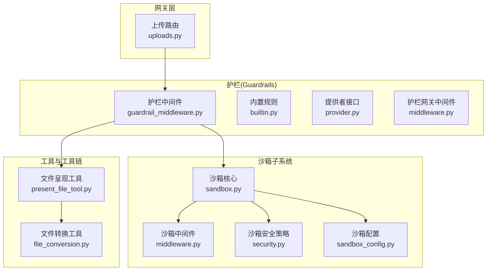
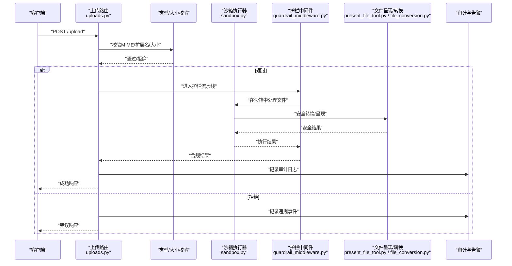

# 安全检查

<cite>
**本文引用的文件**   
- [backend/app/gateway/routers/uploads.py](file://backend/app/gateway/routers/uploads.py)
- [backend/packages/harness/deerflow/sandbox/security.py](file://backend/packages/harness/deerflow/sandbox/security.py)
- [backend/packages/harness/deerflow/sandbox/middleware.py](file://backend/packages/harness/deerflow/sandbox/middleware.py)
- [backend/packages/harness/deerflow/sandbox/sandbox.py](file://backend/packages/harness/deerflow/sandbox/sandbox.py)
- [backend/packages/harness/deerflow/config/sandbox_config.py](file://backend/packages/harness/deerflow/config/sandbox_config.py)
- [backend/packages/harness/deerflow/agents/middlewares/guardrail_middleware.py](file://backend/packages/harness/deerflow/agents/middlewares/guardrail_middleware.py)
- [backend/packages/harness/deerflow/guardrails/builtin.py](file://backend/packages/harness/deerflow/guardrails/builtin.py)
- [backend/packages/harness/deerflow/guardrails/provider.py](file://backend/packages/harness/deerflow/guardrails/provider.py)
- [backend/packages/harness/deerflow/guardrails/middleware.py](file://backend/packages/harness/deerflow/guardrails/middleware.py)
- [backend/packages/harness/deerflow/tools/builtins/present_file_tool.py](file://backend/packages/harness/deerflow/tools/builtins/present_file_tool.py)
- [backend/packages/harness/deerflow/utils/file_conversion.py](file://backend/packages/harness/deerflow/utils/file_conversion.py)
- [backend/tests/test_uploads_router.py](file://backend/tests/test_uploads_router.py)
- [backend/tests/test_sandbox_tools_security.py](file://backend/tests/test_sandbox_tools_security.py)
- [backend/tests/test_guardrail_middleware.py](file://backend/tests/test_guardrail_middleware.py)
- [backend/docs/GUARDRAILS.md](file://backend/docs/GUARDRAILS.md)
- [backend/docs/FILE_UPLOAD.md](file://backend/docs/FILE_UPLOAD.md)
</cite>

## 目录
1. [简介](#简介)
2. [项目结构](#项目结构)
3. [核心组件](#核心组件)
4. [架构总览](#架构总览)
5. [详细组件分析](#详细组件分析)
6. [依赖关系分析](#依赖关系分析)
7. [性能考量](#性能考量)
8. [故障排查指南](#故障排查指南)
9. [结论](#结论)
10. [附录](#附录)

## 简介
本章节聚焦 DeerFlow 的文件安全与验证能力，围绕上传入口、沙箱执行、内容过滤、完整性校验与审计告警等关键维度进行系统化说明。文档覆盖：
- 文件类型验证（MIME 检测与扩展名白名单）
- 文件大小限制与超限处理策略
- 病毒扫描集成方案（如 ClamAV）的接入点与配置建议
- 恶意代码检测与沙箱隔离执行环境
- 文件内容安全过滤（敏感信息识别与脱敏）
- 文件完整性校验与数字签名验证
- 安全策略配置与自定义规则开发
- 安全审计日志与威胁告警机制

## 项目结构
与安全相关的核心实现主要分布在以下模块：
- 网关上传路由：负责接收文件、基础校验与流程编排
- 沙箱子系统：提供受限执行环境与资源控制
- 护栏（Guardrails）中间件：在代理调用链中实施内容级安全策略
- 内置工具：对文件呈现与转换过程中的安全边界进行约束
- 测试用例：覆盖上传、沙箱工具安全、护栏中间件等场景

图表来源
- [backend/app/gateway/routers/uploads.py](file://backend/app/gateway/routers/uploads.py)
- [backend/packages/harness/deerflow/sandbox/sandbox.py](file://backend/packages/harness/deerflow/sandbox/sandbox.py)
- [backend/packages/harness/deerflow/sandbox/middleware.py](file://backend/packages/harness/deerflow/sandbox/middleware.py)
- [backend/packages/harness/deerflow/sandbox/security.py](file://backend/packages/harness/deerflow/sandbox/security.py)
- [backend/packages/harness/deerflow/config/sandbox_config.py](file://backend/packages/harness/deerflow/config/sandbox_config.py)
- [backend/packages/harness/deerflow/agents/middlewares/guardrail_middleware.py](file://backend/packages/harness/deerflow/agents/middlewares/guardrail_middleware.py)
- [backend/packages/harness/deerflow/guardrails/builtin.py](file://backend/packages/harness/deerflow/guardrails/builtin.py)
- [backend/packages/harness/deerflow/guardrails/provider.py](file://backend/packages/harness/deerflow/guardrails/provider.py)
- [backend/packages/harness/deerflow/guardrails/middleware.py](file://backend/packages/harness/deerflow/guardrails/middleware.py)
- [backend/packages/harness/deerflow/tools/builtins/present_file_tool.py](file://backend/packages/harness/deerflow/tools/builtins/present_file_tool.py)
- [backend/packages/harness/deerflow/utils/file_conversion.py](file://backend/packages/harness/deerflow/utils/file_conversion.py)

章节来源
- [backend/app/gateway/routers/uploads.py](file://backend/app/gateway/routers/uploads.py)
- [backend/packages/harness/deerflow/sandbox/sandbox.py](file://backend/packages/harness/deerflow/sandbox/sandbox.py)
- [backend/packages/harness/deerflow/sandbox/middleware.py](file://backend/packages/harness/deerflow/sandbox/middleware.py)
- [backend/packages/harness/deerflow/sandbox/security.py](file://backend/packages/harness/deerflow/sandbox/security.py)
- [backend/packages/harness/deerflow/config/sandbox_config.py](file://backend/packages/harness/deerflow/config/sandbox_config.py)
- [backend/packages/harness/deerflow/agents/middlewares/guardrail_middleware.py](file://backend/packages/harness/deerflow/agents/middlewares/guardrail_middleware.py)
- [backend/packages/harness/deerflow/guardrails/builtin.py](file://backend/packages/harness/deerflow/guardrails/builtin.py)
- [backend/packages/harness/deerflow/guardrails/provider.py](file://backend/packages/harness/deerflow/guardrails/provider.py)
- [backend/packages/harness/deerflow/guardrails/middleware.py](file://backend/packages/harness/deerflow/guardrails/middleware.py)
- [backend/packages/harness/deerflow/tools/builtins/present_file_tool.py](file://backend/packages/harness/deerflow/tools/builtins/present_file_tool.py)
- [backend/packages/harness/deerflow/utils/file_conversion.py](file://backend/packages/harness/deerflow/utils/file_conversion.py)

## 核心组件
- 上传路由（uploads.py）
  - 职责：接收客户端上传请求，进行基础参数校验、大小限制、类型白名单检查，并触发后续处理流程（如存储、扫描、解析）。
  - 关键点：统一错误码与消息；记录审计日志；支持流式或分块读取以规避大文件内存占用。
- 沙箱子系统（sandbox.py, middleware.py, security.py, sandbox_config.py）
  - 职责：为文件处理与脚本执行提供隔离环境，限制系统调用、网络访问、文件系统范围与资源配额。
  - 关键点：通过中间件注入上下文与权限令牌；安全策略定义可执行命令白名单、路径映射、超时与内存上限。
- 护栏（Guardrails）中间件与提供者（guardrail_middleware.py, builtin.py, provider.py, middleware.py）
  - 职责：在代理调用链中对输入输出进行内容级安全审查，包括敏感词、注入攻击模式、越权访问尝试等。
  - 关键点：可扩展提供者接口；内置规则集；可组合多个规则形成策略流水线。
- 文件呈现与转换工具（present_file_tool.py, file_conversion.py）
  - 职责：将受控文件转换为安全的展示格式或文本摘要，避免直接执行潜在危险内容。
  - 关键点：强制类型转换、剥离元数据、限制渲染深度与复杂度。

章节来源
- [backend/app/gateway/routers/uploads.py](file://backend/app/gateway/routers/uploads.py)
- [backend/packages/harness/deerflow/sandbox/sandbox.py](file://backend/packages/harness/deerflow/sandbox/sandbox.py)
- [backend/packages/harness/deerflow/sandbox/middleware.py](file://backend/packages/harness/deerflow/sandbox/middleware.py)
- [backend/packages/harness/deerflow/sandbox/security.py](file://backend/packages/harness/deerflow/sandbox/security.py)
- [backend/packages/harness/deerflow/config/sandbox_config.py](file://backend/packages/harness/deerflow/config/sandbox_config.py)
- [backend/packages/harness/deerflow/agents/middlewares/guardrail_middleware.py](file://backend/packages/harness/deerflow/agents/middlewares/guardrail_middleware.py)
- [backend/packages/harness/deerflow/guardrails/builtin.py](file://backend/packages/harness/deerflow/guardrails/builtin.py)
- [backend/packages/harness/deerflow/guardrails/provider.py](file://backend/packages/harness/deerflow/guardrails/provider.py)
- [backend/packages/harness/deerflow/guardrails/middleware.py](file://backend/packages/harness/deerflow/guardrails/middleware.py)
- [backend/packages/harness/deerflow/tools/builtins/present_file_tool.py](file://backend/packages/harness/deerflow/tools/builtins/present_file_tool.py)
- [backend/packages/harness/deerflow/utils/file_conversion.py](file://backend/packages/harness/deerflow/utils/file_conversion.py)

## 架构总览
下图展示了从上传到安全处理的端到端流程，涵盖类型与大小校验、沙箱隔离、护栏审查、结果返回与审计记录。

图表来源
- [backend/app/gateway/routers/uploads.py](file://backend/app/gateway/routers/uploads.py)
- [backend/packages/harness/deerflow/sandbox/sandbox.py](file://backend/packages/harness/deerflow/sandbox/sandbox.py)
- [backend/packages/harness/deerflow/agents/middlewares/guardrail_middleware.py](file://backend/packages/harness/deerflow/agents/middlewares/guardrail_middleware.py)
- [backend/packages/harness/deerflow/tools/builtins/present_file_tool.py](file://backend/packages/harness/deerflow/tools/builtins/present_file_tool.py)
- [backend/packages/harness/deerflow/utils/file_conversion.py](file://backend/packages/harness/deerflow/utils/file_conversion.py)

## 详细组件分析

### 上传路由与文件类型/大小校验
- 类型验证
  - MIME 检测：基于文件头字节序列推断真实类型，防止仅凭扩展名伪造。
  - 扩展名白名单：结合业务允许的后缀集合进行二次校验。
- 大小限制
  - 全局最大上传大小与单文件上限；超限立即拒绝并返回明确错误码。
  - 流式读取以避免一次性加载大文件导致内存溢出。
- 超限处理策略
  - 拒绝写入临时目录；记录审计事件；可选触发告警通道。
- 参考实现位置
  - 上传路由入口与校验逻辑：[backend/app/gateway/routers/uploads.py](file://backend/app/gateway/routers/uploads.py)
  - 单元测试覆盖上传路由行为：[backend/tests/test_uploads_router.py](file://backend/tests/test_uploads_router.py)

章节来源
- [backend/app/gateway/routers/uploads.py](file://backend/app/gateway/routers/uploads.py)
- [backend/tests/test_uploads_router.py](file://backend/tests/test_uploads_router.py)

### 沙箱执行与环境隔离
- 隔离目标
  - 限制系统调用、网络访问、进程间通信与文件系统范围。
  - 设置 CPU、内存、I/O 与时间配额，防止资源耗尽型攻击。
- 中间件与策略
  - 中间件负责注入执行上下文、挂载只读卷、重写路径映射。
  - 安全策略定义可执行命令白名单、环境变量过滤、异常退出码处理。
- 配置项
  - 沙箱后端选择、镜像/容器运行时、资源上限、超时阈值、白名单规则等。
- 参考实现位置
  - 沙箱核心与中间件：[backend/packages/harness/deerflow/sandbox/sandbox.py](file://backend/packages/harness/deerflow/sandbox/sandbox.py)、[backend/packages/harness/deerflow/sandbox/middleware.py](file://backend/packages/harness/deerflow/sandbox/middleware.py)
  - 安全策略与配置：[backend/packages/harness/deerflow/sandbox/security.py](file://backend/packages/harness/deerflow/sandbox/security.py)、[backend/packages/harness/deerflow/config/sandbox_config.py](file://backend/packages/harness/deerflow/config/sandbox_config.py)
  - 沙箱工具安全测试：[backend/tests/test_sandbox_tools_security.py](file://backend/tests/test_sandbox_tools_security.py)

章节来源
- [backend/packages/harness/deerflow/sandbox/sandbox.py](file://backend/packages/harness/deerflow/sandbox/sandbox.py)
- [backend/packages/harness/deerflow/sandbox/middleware.py](file://backend/packages/harness/deerflow/sandbox/middleware.py)
- [backend/packages/harness/deerflow/sandbox/security.py](file://backend/packages/harness/deerflow/sandbox/security.py)
- [backend/packages/harness/deerflow/config/sandbox_config.py](file://backend/packages/harness/deerflow/config/sandbox_config.py)
- [backend/tests/test_sandbox_tools_security.py](file://backend/tests/test_sandbox_tools_security.py)

### 护栏（Guardrails）内容与策略流水线
- 角色定位
  - 在代理调用链前后拦截输入/输出，执行内容安全策略。
- 内置规则
  - 常见注入模式、敏感关键词、越权访问特征、异常结构体等。
- 提供者接口
  - 通过 Provider 抽象实现自定义规则引擎或外部服务对接。
- 中间件编排
  - 支持多规则串联、短路失败、分级告警与降级策略。
- 参考实现位置
  - 护栏中间件与提供者：[backend/packages/harness/deerflow/agents/middlewares/guardrail_middleware.py](file://backend/packages/harness/deerflow/agents/middlewares/guardrail_middleware.py)、[backend/packages/harness/deerflow/guardrails/provider.py](file://backend/packages/harness/deerflow/guardrails/provider.py)
  - 内置规则与网关中间件：[backend/packages/harness/deerflow/guardrails/builtin.py](file://backend/packages/harness/deerflow/guardrails/builtin.py)、[backend/packages/harness/deerflow/guardrails/middleware.py](file://backend/packages/harness/deerflow/guardrails/middleware.py)
  - 护栏测试与文档：[backend/tests/test_guardrail_middleware.py](file://backend/tests/test_guardrail_middleware.py)、[backend/docs/GUARDRAILS.md](file://backend/docs/GUARDRAILS.md)

章节来源
- [backend/packages/harness/deerflow/agents/middlewares/guardrail_middleware.py](file://backend/packages/harness/deerflow/agents/middlewares/guardrail_middleware.py)
- [backend/packages/harness/deerflow/guardrails/provider.py](file://backend/packages/harness/deerflow/guardrails/provider.py)
- [backend/packages/harness/deerflow/guardrails/builtin.py](file://backend/packages/harness/deerflow/guardrails/builtin.py)
- [backend/packages/harness/deerflow/guardrails/middleware.py](file://backend/packages/harness/deerflow/guardrails/middleware.py)
- [backend/tests/test_guardrail_middleware.py](file://backend/tests/test_guardrail_middleware.py)
- [backend/docs/GUARDRAILS.md](file://backend/docs/GUARDRAILS.md)

### 文件呈现与转换的安全边界
- 目标
  - 将不可信文件转换为安全的文本或结构化数据，避免直接执行或渲染危险内容。
- 措施
  - 强制类型转换、剥离宏/脚本/嵌入对象、限制渲染深度与复杂度。
  - 对富文本/Office/压缩包等进行“瘦身”与去风险化处理。
- 参考实现位置
  - 文件呈现工具：[backend/packages/harness/deerflow/tools/builtins/present_file_tool.py](file://backend/packages/harness/deerflow/tools/builtins/present_file_tool.py)
  - 文件转换工具：[backend/packages/harness/deerflow/utils/file_conversion.py](file://backend/packages/harness/deerflow/utils/file_conversion.py)

章节来源
- [backend/packages/harness/deerflow/tools/builtins/present_file_tool.py](file://backend/packages/harness/deerflow/tools/builtins/present_file_tool.py)
- [backend/packages/harness/deerflow/utils/file_conversion.py](file://backend/packages/harness/deerflow/utils/file_conversion.py)

### 病毒扫描集成方案（ClamAV 等）
- 集成思路
  - 在上传后、沙箱执行前插入病毒扫描步骤；扫描通过后再进入后续处理。
  - 支持本地守护进程或远程扫描服务；失败时采用“默认拒绝”策略。
- 配置要点
  - 扫描服务地址、超时、重试次数、误报率容忍度、扫描队列容量。
  - 扫描结果与审计日志关联，便于追踪与回溯。
- 接入点建议
  - 在上传路由中增加扫描阶段；或在沙箱中间件前置钩子中调用扫描服务。
- 参考位置
  - 上传路由与文档：[backend/app/gateway/routers/uploads.py](file://backend/app/gateway/routers/uploads.py)、[backend/docs/FILE_UPLOAD.md](file://backend/docs/FILE_UPLOAD.md)

章节来源
- [backend/app/gateway/routers/uploads.py](file://backend/app/gateway/routers/uploads.py)
- [backend/docs/FILE_UPLOAD.md](file://backend/docs/FILE_UPLOAD.md)

### 恶意代码检测与沙箱执行环境
- 检测策略
  - 静态特征匹配（YARA/正则）、启发式规则、二进制签名库更新。
  - 结合沙箱动态行为监控（系统调用、网络外联、异常崩溃）。
- 沙箱隔离
  - 最小权限原则、只读根文件系统、命名空间隔离、cgroup 资源限制。
- 参考位置
  - 沙箱与安全策略：[backend/packages/harness/deerflow/sandbox/sandbox.py](file://backend/packages/harness/deerflow/sandbox/sandbox.py)、[backend/packages/harness/deerflow/sandbox/security.py](file://backend/packages/harness/deerflow/sandbox/security.py)

章节来源
- [backend/packages/harness/deerflow/sandbox/sandbox.py](file://backend/packages/harness/deerflow/sandbox/sandbox.py)
- [backend/packages/harness/deerflow/sandbox/security.py](file://backend/packages/harness/deerflow/sandbox/security.py)

### 文件内容安全过滤（敏感信息与脱敏）
- 敏感信息识别
  - 正则与词典匹配（密钥、证书、个人信息、内部标识），结合上下文评分降低误报。
- 脱敏处理
  - 掩码替换、哈希化、分段打散；保留必要字段用于调试但不出网。
- 参考位置
  - 护栏内置规则与中间件：[backend/packages/harness/deerflow/guardrails/builtin.py](file://backend/packages/harness/deerflow/guardrails/builtin.py)、[backend/packages/harness/deerflow/guardrails/middleware.py](file://backend/packages/harness/deerflow/guardrails/middleware.py)

章节来源
- [backend/packages/harness/deerflow/guardrails/builtin.py](file://backend/packages/harness/deerflow/guardrails/builtin.py)
- [backend/packages/harness/deerflow/guardrails/middleware.py](file://backend/packages/harness/deerflow/guardrails/middleware.py)

### 文件完整性校验与数字签名验证
- 完整性校验
  - 计算 SHA-256/SHA-512 等哈希值，与预期值比对；支持增量校验与缓存。
- 数字签名验证
  - 使用公钥验证发布者签名；校验证书链与有效期；失败则拒绝。
- 参考位置
  - 文件转换与呈现工具（可在其中集成校验与签名验证）：[backend/packages/harness/deerflow/utils/file_conversion.py](file://backend/packages/harness/deerflow/utils/file_conversion.py)、[backend/packages/harness/deerflow/tools/builtins/present_file_tool.py](file://backend/packages/harness/deerflow/tools/builtins/present_file_tool.py)

章节来源
- [backend/packages/harness/deerflow/utils/file_conversion.py](file://backend/packages/harness/deerflow/utils/file_conversion.py)
- [backend/packages/harness/deerflow/tools/builtins/present_file_tool.py](file://backend/packages/harness/deerflow/tools/builtins/present_file_tool.py)

### 安全策略配置与自定义规则开发
- 配置项
  - 沙箱资源上限、超时、白名单命令、路径映射；护栏规则开关与阈值。
- 自定义规则
  - 实现 Provider 接口，注册新规则；支持热更新与灰度发布。
- 参考位置
  - 沙箱配置与护栏提供者：[backend/packages/harness/deerflow/config/sandbox_config.py](file://backend/packages/harness/deerflow/config/sandbox_config.py)、[backend/packages/harness/deerflow/guardrails/provider.py](file://backend/packages/harness/deerflow/guardrails/provider.py)

章节来源
- [backend/packages/harness/deerflow/config/sandbox_config.py](file://backend/packages/harness/deerflow/config/sandbox_config.py)
- [backend/packages/harness/deerflow/guardrails/provider.py](file://backend/packages/harness/deerflow/guardrails/provider.py)

### 安全审计日志与威胁告警机制
- 审计日志
  - 记录上传来源、文件指纹、类型/大小、扫描结果、沙箱执行状态、护栏判定。
- 告警机制
  - 高危事件实时推送（邮件/IM/工单），低危事件聚合报表；支持阈值与静默期。
- 参考位置
  - 上传路由与护栏中间件（日志与告警接入点）：[backend/app/gateway/routers/uploads.py](file://backend/app/gateway/routers/uploads.py)、[backend/packages/harness/deerflow/agents/middlewares/guardrail_middleware.py](file://backend/packages/harness/deerflow/agents/middlewares/guardrail_middleware.py)

章节来源
- [backend/app/gateway/routers/uploads.py](file://backend/app/gateway/routers/uploads.py)
- [backend/packages/harness/deerflow/agents/middlewares/guardrail_middleware.py](file://backend/packages/harness/deerflow/agents/middlewares/guardrail_middleware.py)

## 依赖关系分析
- 组件耦合
  - 上传路由依赖护栏中间件与沙箱执行器；沙箱依赖安全策略与配置。
  - 文件呈现/转换工具被沙箱与护栏共同消费，作为安全输出通道。
- 外部依赖
  - 病毒扫描服务（ClamAV 等）、签名验证库、审计与告警通道。
- 循环依赖
  - 当前分层清晰，未见明显循环依赖；建议在新增规则时保持单向依赖。

```mermaid
graph LR
U["uploads.py"] --> GM["guardrail_middleware.py"]
GM --> S["sandbox.py"]
S --> SM["sandbox/middleware.py"]
S --> SS["sandbox/security.py"]
S --> SC["config/sandbox_config.py"]
GM --> PF["present_file_tool.py"]
PF --> FC["file_conversion.py"]
```

图表来源
- [backend/app/gateway/routers/uploads.py](file://backend/app/gateway/routers/uploads.py)
- [backend/packages/harness/deerflow/agents/middlewares/guardrail_middleware.py](file://backend/packages/harness/deerflow/agents/middlewares/guardrail_middleware.py)
- [backend/packages/harness/deerflow/sandbox/sandbox.py](file://backend/packages/harness/deerflow/sandbox/sandbox.py)
- [backend/packages/harness/deerflow/sandbox/middleware.py](file://backend/packages/harness/deerflow/sandbox/middleware.py)
- [backend/packages/harness/deerflow/sandbox/security.py](file://backend/packages/harness/deerflow/sandbox/security.py)
- [backend/packages/harness/deerflow/config/sandbox_config.py](file://backend/packages/harness/deerflow/config/sandbox_config.py)
- [backend/packages/harness/deerflow/tools/builtins/present_file_tool.py](file://backend/packages/harness/deerflow/tools/builtins/present_file_tool.py)
- [backend/packages/harness/deerflow/utils/file_conversion.py](file://backend/packages/harness/deerflow/utils/file_conversion.py)

章节来源
- [backend/app/gateway/routers/uploads.py](file://backend/app/gateway/routers/uploads.py)
- [backend/packages/harness/deerflow/agents/middlewares/guardrail_middleware.py](file://backend/packages/harness/deerflow/agents/middlewares/guardrail_middleware.py)
- [backend/packages/harness/deerflow/sandbox/sandbox.py](file://backend/packages/harness/deerflow/sandbox/sandbox.py)
- [backend/packages/harness/deerflow/sandbox/middleware.py](file://backend/packages/harness/deerflow/sandbox/middleware.py)
- [backend/packages/harness/deerflow/sandbox/security.py](file://backend/packages/harness/deerflow/sandbox/security.py)
- [backend/packages/harness/deerflow/config/sandbox_config.py](file://backend/packages/harness/deerflow/config/sandbox_config.py)
- [backend/packages/harness/deerflow/tools/builtins/present_file_tool.py](file://backend/packages/harness/deerflow/tools/builtins/present_file_tool.py)
- [backend/packages/harness/deerflow/utils/file_conversion.py](file://backend/packages/harness/deerflow/utils/file_conversion.py)

## 性能考量
- 上传阶段
  - 使用流式读取与分块校验，避免大文件内存峰值。
  - 并行 MIME 检测与扩展名校验，减少串行等待。
- 扫描与转换
  - 引入任务队列与并发上限；失败快速失败与重试退避。
  - 对重复文件指纹进行缓存，跳过重复扫描与转换。
- 沙箱执行
  - 合理设置 CPU/内存/IO 配额，避免雪崩；短生命周期容器复用。
- 护栏规则
  - 规则按命中成本排序，高频低成本规则优先；支持批量批处理。

## 故障排查指南
- 上传失败
  - 检查 MIME/扩展名校验是否过严；确认大小限制与临时目录权限。
  - 查看上传路由日志与审计事件，定位具体拒绝原因。
- 沙箱执行异常
  - 核对白名单命令与路径映射；检查资源配额与超时设置。
  - 关注沙箱中间件注入的上下文与权限令牌是否正确。
- 护栏误判/漏判
  - 调整内置规则阈值；补充自定义规则并灰度验证。
  - 对比护栏中间件的输入输出快照，定位问题规则。
- 参考测试与文档
  - 上传路由测试：[backend/tests/test_uploads_router.py](file://backend/tests/test_uploads_router.py)
  - 沙箱工具安全测试：[backend/tests/test_sandbox_tools_security.py](file://backend/tests/test_sandbox_tools_security.py)
  - 护栏中间件测试：[backend/tests/test_guardrail_middleware.py](file://backend/tests/test_guardrail_middleware.py)
  - 护栏文档：[backend/docs/GUARDRAILS.md](file://backend/docs/GUARDRAILS.md)

章节来源
- [backend/tests/test_uploads_router.py](file://backend/tests/test_uploads_router.py)
- [backend/tests/test_sandbox_tools_security.py](file://backend/tests/test_sandbox_tools_security.py)
- [backend/tests/test_guardrail_middleware.py](file://backend/tests/test_guardrail_middleware.py)
- [backend/docs/GUARDRAILS.md](file://backend/docs/GUARDRAILS.md)

## 结论
DeerFlow 在文件安全方面构建了“上传校验—沙箱隔离—护栏审查—安全输出—审计告警”的闭环体系。通过 MIME/扩展名双重校验、严格的沙箱资源控制、可扩展的护栏规则以及完善的审计与告警机制，能够有效抵御恶意文件与注入攻击。建议在生产环境中启用病毒扫描与签名验证，并结合业务需求持续优化护栏规则与沙箱策略。

## 附录
- 相关文档
  - 护栏总览与配置：[backend/docs/GUARDRAILS.md](file://backend/docs/GUARDRAILS.md)
  - 文件上传流程与注意事项：[backend/docs/FILE_UPLOAD.md](file://backend/docs/FILE_UPLOAD.md)