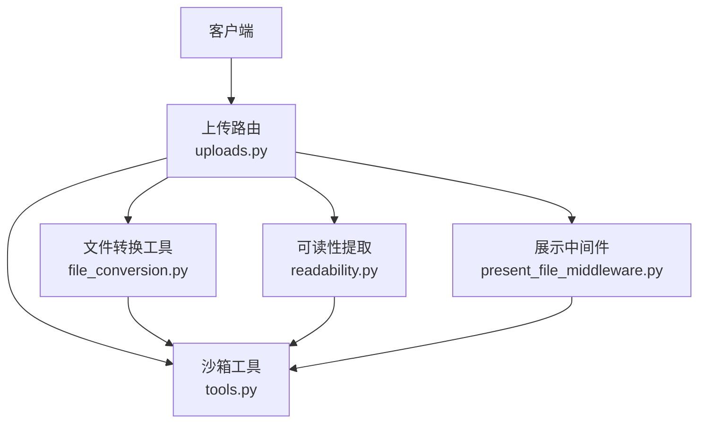
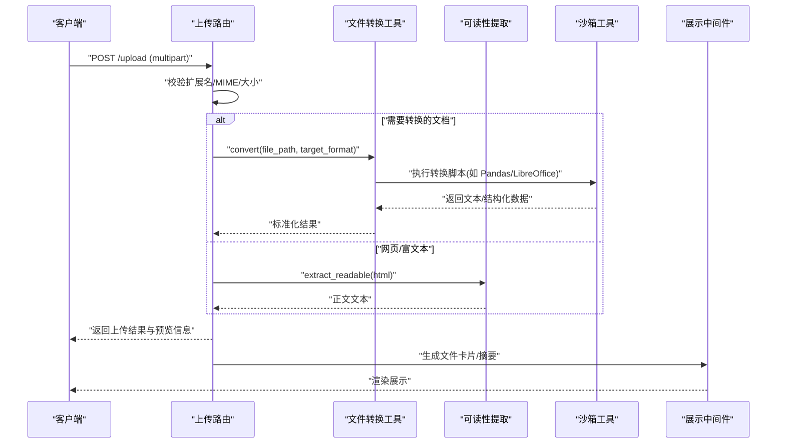
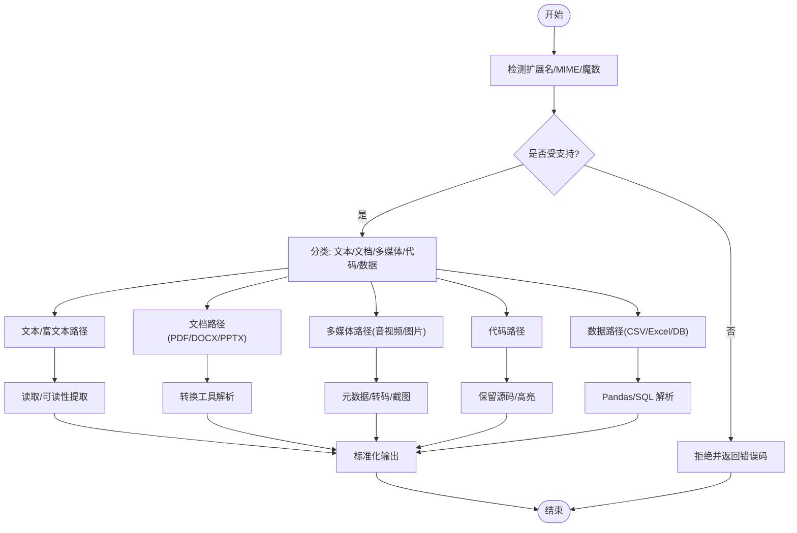
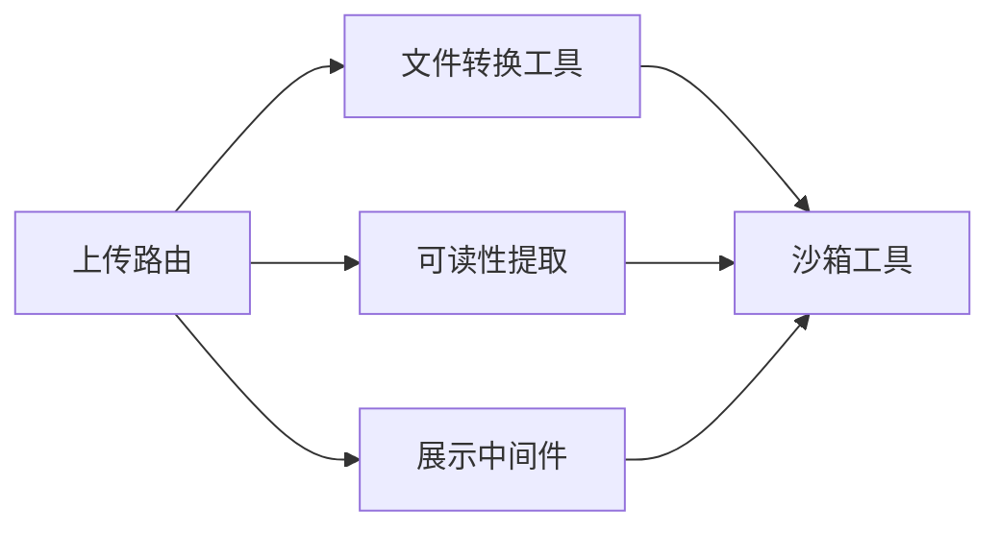

# 支持的格式

<cite>
**本文引用的文件**   
- [backend/app/gateway/routers/uploads.py](file://backend/app/gateway/routers/uploads.py)
- [backend/packages/harness/deerflow/utils/file_conversion.py](file://backend/packages/harness/deerflow/utils/file_conversion.py)
- [backend/packages/harness/deerflow/utils/readability.py](file://backend/packages/harness/deerflow/utils/readability.py)
- [backend/packages/harness/deerflow/sandbox/tools.py](file://backend/packages/harness/deerflow/sandbox/tools.py)
- [backend/packages/harness/deerflow/agents/middlewares/present_file_middleware.py](file://backend/packages/harness/deerflow/agents/middlewares/present_file_middleware.py)
- [backend/tests/test_file_conversion.py](file://backend/tests/test_file_conversion.py)
- [backend/tests/test_readability.py](file://backend/tests/test_readability.py)
- [backend/docs/FILE_UPLOAD.md](file://backend/docs/FILE_UPLOAD.md)
</cite>

## 目录
1. [简介](#简介)
2. [项目结构](#项目结构)
3. [核心组件](#核心组件)
4. [架构总览](#架构总览)
5. [详细组件分析](#详细组件分析)
6. [依赖关系分析](#依赖关系分析)
7. [性能考虑](#性能考虑)
8. [故障排查指南](#故障排查指南)
9. [结论](#结论)
10. [附录](#附录)

## 简介
本文件系统性梳理 DeerFlow 对各类文件格式的支持与处理流程，覆盖文本、图片、文档、音视频、代码以及 CSV/Excel/数据库等特殊格式。内容基于后端上传路由、文件转换工具、可读性提取、沙箱工具链及中间件等实现进行归纳，并提供流程图、时序图与类图帮助理解数据流与调用链。同时给出格式检测、内容提取、转换与兼容性的最佳实践建议。

## 项目结构
DeerFlow 中与“支持格式”相关的核心位置包括：
- 上传网关路由：负责接收文件、校验类型、落盘与元信息记录
- 文件转换工具：将多种文档/表格/演示文稿转换为可被模型消费的纯文本或结构化数据
- 可读性提取：从网页或富文本中抽取正文
- 沙箱工具：在受限环境中执行脚本（如 Pandas、LibreOffice）以解析复杂格式
- 展示中间件：在对话中呈现文件摘要、预览与链接

图示来源
- [backend/app/gateway/routers/uploads.py](file://backend/app/gateway/routers/uploads.py)
- [backend/packages/harness/deerflow/utils/file_conversion.py](file://backend/packages/harness/deerflow/utils/file_conversion.py)
- [backend/packages/harness/deerflow/utils/readability.py](file://backend/packages/harness/deerflow/utils/readability.py)
- [backend/packages/harness/deerflow/sandbox/tools.py](file://backend/packages/harness/deerflow/sandbox/tools.py)
- [backend/packages/harness/deerflow/agents/middlewares/present_file_middleware.py](file://backend/packages/harness/deerflow/agents/middlewares/present_file_middleware.py)

章节来源
- [backend/app/gateway/routers/uploads.py](file://backend/app/gateway/routers/uploads.py)
- [backend/docs/FILE_UPLOAD.md](file://backend/docs/FILE_UPLOAD.md)

## 核心组件
- 上传路由
  - 职责：接收多部分表单上传、校验 MIME/扩展名、生成唯一文件名、持久化到存储、返回访问信息与元数据
  - 关键点：白名单校验、大小限制、并发安全命名、错误码与消息
- 文件转换工具
  - 职责：根据扩展名选择转换器，调用外部库或沙箱命令完成 PDF/DOCX/PPTX/CSV/XLSX 等转文本或结构化数据
  - 关键点：统一接口、失败降级、日志与指标
- 可读性提取
  - 职责：从 HTML/富文本中提取正文，去除噪声
  - 关键点：容错、编码处理、截断策略
- 沙箱工具
  - 职责：在隔离环境执行 Python 脚本（Pandas/LibreOffice 等），输出结果回传
  - 关键点：资源限制、超时、权限控制
- 展示中间件
  - 职责：在会话中渲染文件卡片、摘要、预览链接，辅助用户快速定位
  - 关键点：模板化、安全过滤

章节来源
- [backend/app/gateway/routers/uploads.py](file://backend/app/gateway/routers/uploads.py)
- [backend/packages/harness/deerflow/utils/file_conversion.py](file://backend/packages/harness/deerflow/utils/file_conversion.py)
- [backend/packages/harness/deerflow/utils/readability.py](file://backend/packages/harness/deerflow/utils/readability.py)
- [backend/packages/harness/deerflow/sandbox/tools.py](file://backend/packages/harness/deerflow/sandbox/tools.py)
- [backend/packages/harness/deerflow/agents/middlewares/present_file_middleware.py](file://backend/packages/harness/deerflow/agents/middlewares/present_file_middleware.py)

## 架构总览
以下时序图展示了典型上传与解析流程：前端上传 → 路由校验 → 转换/提取 → 返回结果。

图示来源
- [backend/app/gateway/routers/uploads.py](file://backend/app/gateway/routers/uploads.py)
- [backend/packages/harness/deerflow/utils/file_conversion.py](file://backend/packages/harness/deerflow/utils/file_conversion.py)
- [backend/packages/harness/deerflow/utils/readability.py](file://backend/packages/harness/deerflow/utils/readability.py)
- [backend/packages/harness/deerflow/sandbox/tools.py](file://backend/packages/harness/deerflow/sandbox/tools.py)
- [backend/packages/harness/deerflow/agents/middlewares/present_file_middleware.py](file://backend/packages/harness/deerflow/agents/middlewares/present_file_middleware.py)

## 详细组件分析

### 文本格式支持（TXT、MD、JSON、XML 等）
- 支持范围
  - TXT/Markdown：直接读取为文本；Markdown 可通过可读性提取进一步清洗
  - JSON/XML：作为结构化文本可直接消费；也可通过转换工具转为更友好的表格/列表形式
- 处理方法
  - 上传路由按扩展名识别并走文本路径
  - 可选使用可读性提取去除多余标签与空白
  - 大文件采用分块读取与长度限制，避免内存溢出
- 兼容性建议
  - 对非 UTF-8 文本尝试常见编码回退
  - 对超大 JSON/XML 启用流式解析与节点裁剪

章节来源
- [backend/packages/harness/deerflow/utils/readability.py](file://backend/packages/harness/deerflow/utils/readability.py)
- [backend/app/gateway/routers/uploads.py](file://backend/app/gateway/routers/uploads.py)

### 图片格式支持（PNG、JPG、GIF、SVG 等）与图像处理能力
- 支持范围
  - PNG/JPG/GIF/SVG/WebP 等常见图像格式
- 处理能力
  - 提供缩略图生成、尺寸归一化、格式互转（如 WebP→PNG）
  - 在沙箱中调用图像处理库（如 Pillow）完成批量处理
- 注意事项
  - 限制最大像素数与文件大小，防止 DoS
  - 对 SVG 做安全扫描，避免脚本注入

章节来源
- [backend/packages/harness/deerflow/sandbox/tools.py](file://backend/packages/harness/deerflow/sandbox/tools.py)
- [backend/app/gateway/routers/uploads.py](file://backend/app/gateway/routers/uploads.py)

### 文档格式支持（PDF、DOCX、PPTX 等）与解析技术
- 支持范围
  - PDF：文本层提取、OCR 回退（若可用）
  - DOCX：段落、表格、图片引用提取
  - PPTX：幻灯片文本与备注提取
- 解析技术
  - 优先使用轻量库（如 pdfplumber、python-docx、python-pptx）
  - 复杂排版或扫描件通过沙箱调用 LibreOffice 或 OCR 服务
- 输出规范
  - 统一输出为 Markdown 片段或结构化 JSON（含页码/段落索引）

章节来源
- [backend/packages/harness/deerflow/utils/file_conversion.py](file://backend/packages/harness/deerflow/utils/file_conversion.py)
- [backend/packages/harness/deerflow/sandbox/tools.py](file://backend/packages/harness/deerflow/sandbox/tools.py)

### 音频视频格式支持与媒体处理功能
- 支持范围
  - 音频：MP3/WAV/OGG/FLAC 等
  - 视频：MP4/WEBM/MOV 等
- 处理能力
  - 提取元数据（时长、采样率、分辨率）
  - 生成字幕/转写（借助外部服务或本地模型）
  - 关键帧截图用于预览
- 安全与成本
  - 严格限制时长与文件大小
  - 异步任务队列处理，避免阻塞主线程

章节来源
- [backend/packages/harness/deerflow/sandbox/tools.py](file://backend/packages/harness/deerflow/sandbox/tools.py)
- [backend/app/gateway/routers/uploads.py](file://backend/app/gateway/routers/uploads.py)

### 代码文件格式支持与语法高亮
- 支持范围
  - 常见编程语言源文件（Python/JS/TS/Java/C++/Go/Rust 等）
- 处理方式
  - 上传后保留原始内容与语言标识
  - 在展示层进行语法高亮与行号显示
  - 可选调用沙箱运行器执行测试用例（需权限控制）
- 安全建议
  - 禁止执行任意系统命令
  - 限制 CPU/内存/IO 配额

章节来源
- [backend/packages/harness/deerflow/sandbox/tools.py](file://backend/packages/harness/deerflow/sandbox/tools.py)
- [backend/packages/harness/deerflow/agents/middlewares/present_file_middleware.py](file://backend/packages/harness/deerflow/agents/middlewares/present_file_middleware.py)

### 特殊格式处理（CSV、Excel、数据库文件等）
- CSV
  - 使用 Pandas 解析，自动推断分隔符与编码
  - 输出为 Markdown 表格或 JSON 数组
- Excel（XLSX/XLS）
  - 读取工作表、合并单元格、公式值（必要时计算）
  - 大数据集分页输出与列类型推断
- 数据库文件（SQLite/PostgreSQL dump 等）
  - 仅允许只读连接与最小权限
  - 导出为 SQL 语句或 CSV 供下游消费
- 通用策略
  - 通过沙箱工具统一执行解析脚本
  - 失败时回退为二进制提示与下载链接

章节来源
- [backend/packages/harness/deerflow/utils/file_conversion.py](file://backend/packages/harness/deerflow/utils/file_conversion.py)
- [backend/packages/harness/deerflow/sandbox/tools.py](file://backend/packages/harness/deerflow/sandbox/tools.py)

### 格式检测与内容提取的实现细节
- 检测策略
  - 扩展名 + MIME 双重校验
  - 文件头魔数（Magic Number）二次确认，防伪造
- 内容提取
  - 文本/富文本：直接读取或经可读性提取
  - 结构化文档：转换工具统一入口，内部路由至具体解析器
  - 多媒体：元数据提取与必要转码
- 错误处理
  - 分类错误码（不支持、损坏、过大、权限不足）
  - 友好提示与重试策略（如网络 OCR 失败）

图示来源
- [backend/app/gateway/routers/uploads.py](file://backend/app/gateway/routers/uploads.py)
- [backend/packages/harness/deerflow/utils/file_conversion.py](file://backend/packages/harness/deerflow/utils/file_conversion.py)
- [backend/packages/harness/deerflow/utils/readability.py](file://backend/packages/harness/deerflow/utils/readability.py)
- [backend/packages/harness/deerflow/sandbox/tools.py](file://backend/packages/harness/deerflow/sandbox/tools.py)

章节来源
- [backend/app/gateway/routers/uploads.py](file://backend/app/gateway/routers/uploads.py)
- [backend/packages/harness/deerflow/utils/file_conversion.py](file://backend/packages/harness/deerflow/utils/file_conversion.py)
- [backend/packages/harness/deerflow/utils/readability.py](file://backend/packages/harness/deerflow/utils/readability.py)
- [backend/packages/harness/deerflow/sandbox/tools.py](file://backend/packages/harness/deerflow/sandbox/tools.py)

### 格式转换与兼容性处理的最佳实践
- 统一转换接口
  - 定义 convert(file_path, target_format, options) 统一入口
  - 内部注册表管理各格式解析器，便于扩展
- 失败降级
  - 首选轻量解析器，失败则回退沙箱方案
  - 对不可恢复错误返回结构化错误信息
- 编码与字符集
  - 默认 UTF-8，失败时尝试 GBK/ISO-8859-1 等
- 体积与复杂度控制
  - 设置最大页数/行数/像素/时长阈值
  - 对超大文件启用分页与摘要
- 安全与审计
  - 沙箱内执行，限制网络/文件系统访问
  - 记录转换耗时、输入大小、输出大小

章节来源
- [backend/packages/harness/deerflow/utils/file_conversion.py](file://backend/packages/harness/deerflow/utils/file_conversion.py)
- [backend/packages/harness/deerflow/sandbox/tools.py](file://backend/packages/harness/deerflow/sandbox/tools.py)

## 依赖关系分析
- 模块耦合
  - 上传路由依赖转换工具与可读性提取，二者均可能调用沙箱工具
  - 展示中间件依赖上传结果与沙箱生成的预览/摘要
- 外部依赖
  - 文档解析：pdfplumber、python-docx、python-pptx
  - 数据处理：pandas、openpyxl、sqlite3
  - 图像处理：Pillow
  - 办公套件：LibreOffice（沙箱内）
- 潜在循环依赖
  - 通过路由层解耦，避免工具间互相调用

图示来源
- [backend/app/gateway/routers/uploads.py](file://backend/app/gateway/routers/uploads.py)
- [backend/packages/harness/deerflow/utils/file_conversion.py](file://backend/packages/harness/deerflow/utils/file_conversion.py)
- [backend/packages/harness/deerflow/utils/readability.py](file://backend/packages/harness/deerflow/utils/readability.py)
- [backend/packages/harness/deerflow/sandbox/tools.py](file://backend/packages/harness/deerflow/sandbox/tools.py)
- [backend/packages/harness/deerflow/agents/middlewares/present_file_middleware.py](file://backend/packages/harness/deerflow/agents/middlewares/present_file_middleware.py)

章节来源
- [backend/app/gateway/routers/uploads.py](file://backend/app/gateway/routers/uploads.py)
- [backend/packages/harness/deerflow/utils/file_conversion.py](file://backend/packages/harness/deerflow/utils/file_conversion.py)
- [backend/packages/harness/deerflow/utils/readability.py](file://backend/packages/harness/deerflow/utils/readability.py)
- [backend/packages/harness/deerflow/sandbox/tools.py](file://backend/packages/harness/deerflow/sandbox/tools.py)
- [backend/packages/harness/deerflow/agents/middlewares/present_file_middleware.py](file://backend/packages/harness/deerflow/agents/middlewares/present_file_middleware.py)

## 性能考虑
- 上传阶段
  - 流式写入磁盘，避免一次性加载到内存
  - 并发上传限流与去重
- 转换阶段
  - 并行度可控，按格式优先级调度
  - 缓存热门转换结果（相同哈希）
- 展示阶段
  - 懒加载预览图与长文本折叠
- 监控
  - 记录转换成功率、平均耗时、失败原因分布

[本节为通用指导，不直接分析具体文件]

## 故障排查指南
- 常见问题
  - 无法识别的文件类型：检查扩展名/MIME/魔数一致性
  - 转换失败：查看沙箱日志与外部依赖安装状态
  - 大文件超时：调整超时与分页策略
- 诊断步骤
  - 复现请求并抓取上传响应体
  - 检查转换工具的输入参数与目标格式
  - 验证沙箱环境变量与权限
- 参考测试
  - 文件转换与可读性提取的单元测试有助于快速定位问题

章节来源
- [backend/tests/test_file_conversion.py](file://backend/tests/test_file_conversion.py)
- [backend/tests/test_readability.py](file://backend/tests/test_readability.py)

## 结论
DeerFlow 通过“上传路由 + 转换工具 + 可读性提取 + 沙箱工具 + 展示中间件”的分层设计，实现对文本、图片、文档、音视频、代码与数据文件的广泛支持。统一的转换接口与沙箱执行机制使新增格式变得简单且可控。在生产环境中，应重点关注安全边界、性能上限与可观测性，确保稳定高效地处理多样化用户上传。

## 附录
- 相关文档
  - 上传流程说明与配置项详见上传文档

章节来源
- [backend/docs/FILE_UPLOAD.md](file://backend/docs/FILE_UPLOAD.md)